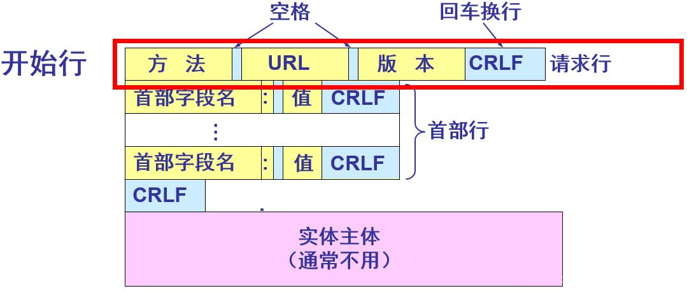
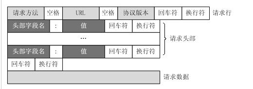
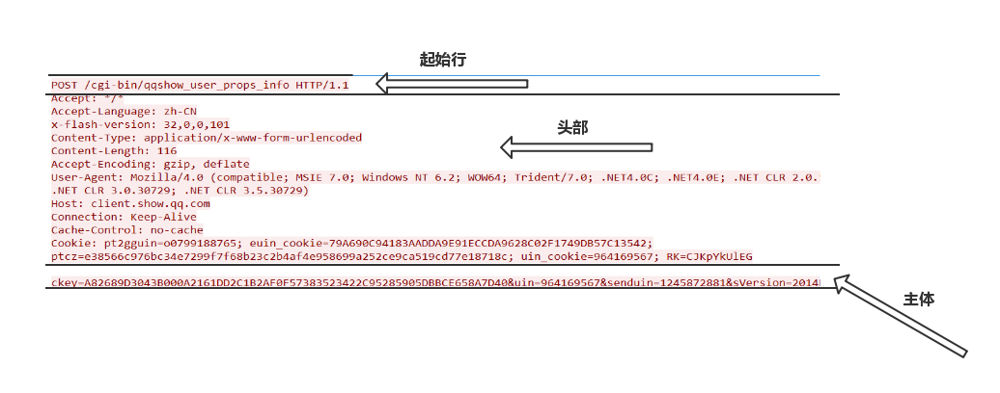
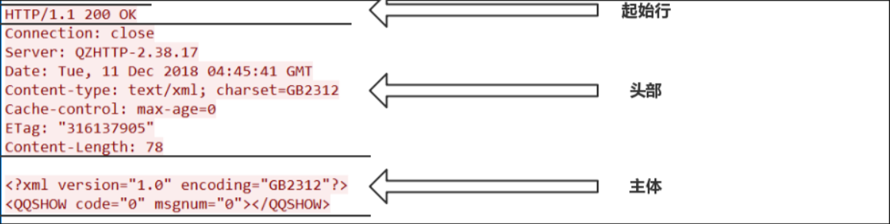
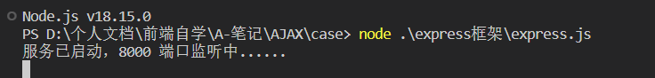
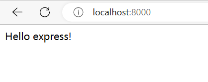
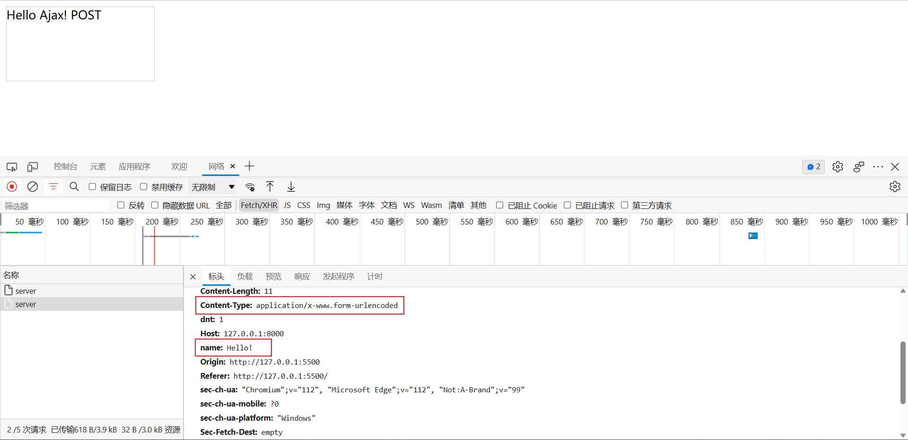
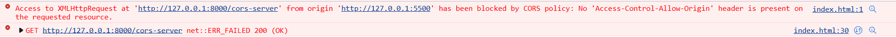

# 一、初识AJAX

## 1 AJAX简介

AJAX = 异步 JavaScript 和 XML。

AJAX 是一种用于创建快速动态网页的技术。

通过在后台与服务器进行少量数据交换，AJAX 可以使网页实现异步更新。这意味着可以在不重新加载整个网页的情况下，对网页的某部分进行更新。

传统的网页（不使用 AJAX）如果需要更新内容，必需重载整个网页面。

有很多使用 AJAX 的应用程序案例：新浪微博、Google 地图、开心网等等。

## 2 XML简介

XML 可扩展标记语言

XML 被设计用来传输和存储数据

XML 和 HTML 类似，不同的是HTML中都是预定义标签，而XML中没有预定义标签，全都是自定义标签，用来表示一些数据

比如说有一个学生数据：

```xml
<student>
    <name>孙悟空</name>
    <age>100</age>
    <gender>男</gender>
</student>
```

**现在已经被JSON取代了**

用JSON表示：

```json
{
	"name":"孙悟空",
    "age":"100",
    "gender":"男"
}
```

## 3 AJAX特点

**优点：**

1. 可以无需刷新页面而与服务器进行通信
2. 允许你根据用户事件来更新部分页面内容

**缺点：**

没有浏览历史，不能回退

存在跨域问题（同源）

SEO不友好

# 二、HTTP协议请求报文与响应报文结构

## 2.1 HTTP 

`HTTP`协议(超文本传输协议HyperText Transfer Protocol)，它是基于TCP协议的应用层传输协议，简单来说就是客户端和服务端进行数据传输的一种规则。

> **注意**：客户端与服务器的角色不是固定的，一端充当客户端，也可能在某次请求中充当服务器。这取决与请求的发起端。HTTP协议属于应用层，建立在传输层协议TCP之上。客户端通过与服务器建立TCP连接，之后发送HTTP请求与接收HTTP响应都是通过访问Socket接口来调用TCP协议实现。

## 2.2 请求报文

一个HTTP请求报文由四个部分组成：请求行、请求头部、空行、请求数据。



**请求行：**

请求行由请求方法字段、URL字段和HTTP协议版本字段3个字段组成，它们用空格分隔。比如 GET /data/info.html HTTP/1.1

方法字段就是HTTP使用的请求方法，比如常见的GET/POST

其中HTTP协议版本有两种：HTTP1.0/HTTP1.1 可以这样区别：

HTTP1.0对于每个连接都只能传送一个请求和响应，请求就会关闭，HTTP1.0没有Host字段；而HTTP1.1在同一个连接中可以传送多个请求和响应，多个请求可以重叠和同时进行，HTTP1.1必须有Host字段。

**请求头部：**

**HTTP**客户程序(例如浏览器)，向服务器发送请求的时候必须指明请求类型(一般是**GET**或者 **POST**)。如有必要，客户程序还可以选择发送其他的请求头。大多数请求头并不是必需的，但**Content-Length**除外。对于**POST**请求来说 **Content-Length**必须出现。

常见的请求头字段含义：

| **字段**          | **含义**                                                     |
| :---------------- | :----------------------------------------------------------- |
| Accept            | 浏览器可接受的MIME类型                                       |
| Accept-Charset    | 浏览器可接受的字符集                                         |
| Accept-Encoding   | 浏览器能够进行解码的数据编码方式，比如gzip。Servlet能够向支持gzip的浏览器返回经gzip编码的HTML页面。许多情形下这可以减少5到10倍的下载时间 |
| Authorization     | 授权信息，通常出现在对服务器发送的WWW-Authenticate头的应答中 |
| Content-Length    | 表示请求消息正文的长度                                       |
| Host              | 客户机通过这个头告诉服务器，想访问的主机名。Host头域指定请求资源的Intenet主机和端口号，必须表示请求url的原始服务器或网关的位置。HTTP/1.1请求必须包含主机头域，否则系统会以400状态码返回。 |
| If-Modified-Since | 客户机通过这个头告诉服务器，资源的缓存时间。只有当所请求的内容在指定的时间后又经过修改才返回它，否则返回304“Not Modified”应答 |
| Referer           | 客户机通过这个头告诉服务器，它是从哪个资源来访问服务器的(防盗链)。包含一个URL，用户从该URL代表的页面出发访问当前请求的页面 |
| User-Agent        | User-Agent头域的内容包含发出请求的用户信息。浏览器类型，如果Servlet返回的内容与浏览器类型有关则该值非常有用 |
| From              | 请求发送者的email地址，由一些特殊的Web客户程序使用，浏览器不会用到它 |

**空行：**

它的作用是通过一个空行，告诉服务器请求头部到此为止。

**请求数据：**

若方法字段是GET，则此项为空，没有数据

若方法字段是POST,则通常来说此处放置的就是要提交的数据

比如要使用POST方法提交一个表单，其中有user字段中数据为“admin”, password字段为123456，那么这里的请求数据就是 user=admin&password=123456，使用&来连接各个字段。

**HTTP请求报文格式就如下图所示：**



**HTTP请求的方法：**

1. OPTIONS
    返回服务器针对特定资源所支持的HTTP请求方法，也可以利用向web服务器发送‘*’的请求来测试服务器的功能性
2. HEAD
    向服务器索与GET请求相一致的响应，只不过响应体将不会被返回。这一方法可以再不必传输整个响应内容的情况下，就可以获取包含在响应小消息头中的元信息。
3. GET
    向特定的资源发出请求。它本质就是发送一个请求来取得服务器上的某一资源。资源通过一组HTTP头和呈现数据（如HTML文本，或者图片或者视频等）返回给客户端。GET请求中，永远不会包含呈现数据。

4. POST
    向指定资源提交数据进行处理请求（例如提交表单或者上传文件）。数据被包含在请求体中。POST请求可能会导致新的资源的建立和/或已有资源的修改。 Loadrunner中对应POST请求函数：web_submit_data,web_submit_form
5. PUT
    向指定资源位置上传其最新内容
6. DELETE
    请求服务器删除Request-URL所标识的资源
7. TRACE
    回显服务器收到的请求，主要用于测试或诊断
8. CONNECT
    HTTP/1.1协议中预留给能够将连接改为管道方式的代理服务器。

**例子：**



## 2.3 响应报文



**起始行：**

应答报文的起始行包含了3个部分

- 协议类型及版本号
- 状态码
- 状态码的文字描述

**状态码：**

在**http**协议中，状态码被分为了5大类

- 100~199（信息性状态码）
- 200~299（成功状态码）
- 300~399（重定向状态码）
- 400~499（客户端错误状态码）
- 500~599（服务器端错误状态码）

**常见的状态码：**

```
100：继续 客户端应当继续发送请求。客户端应当继续发送请求的剩余部分，或者如果请求已经完成，忽略这个响应。

101： 转换协议 在发送完这个响应最后的空行后，将会切换到在Upgrade 消息头中定义的那些协议。只有在切换新的协议更有好处的时候才应该采取类似措施。

102：继续处理 由WebDAV（RFC 2518）扩展的状态码，代表处理将被继续执行。

200：请求成功 处理方式：获得响应的内容，进行处理

201：请求完成，结果是创建了新资源。新创建资源的URI可在响应的实体中得到 处理方式：爬虫中不会遇到

202：请求被接受，但处理尚未完成 处理方式：阻塞等待

204：服务器端已经实现了请求，但是没有返回新的信 息。如果客户是用户，则无须为此更新自身的文档视图。 处理方式：丢弃

300：该状态码不被HTTP/1.0的应用程序直接使用， 只是作为3XX类型回应的默认解释。存在多个可用的被请求资源。 处理方式：若程序中能够处理，则进行进一步处理，如果程序中不能处理，则丢弃 
301：请求到的资源都会分配一个永久的URL，这样就可以在将来通过该URL来访问此资源 处理方式：重定向到分配的URL

302：请求到的资源在一个不同的URL处临时保存 处理方式：重定向到临时的URL

304：请求的资源未更新

400：非法请求

401：未授权 处理方式：丢弃

403：禁止 处理方式：丢弃

404：没有找到 处理方式：丢弃

500：服务器内部错误 服务器遇到了一个未曾预料的状况，导致了它无法完成对请求的处理。一般来说，这个问题都会在的源代码出现错误时出现。

501：服务器无法识别 服务器不支持当前请求所需要的某个功能。当服务器无法识别请求的方法，并且无法支持其对任何资源的请求。

502：错误网关 作为网关或者工作的服务器尝试执行请求时，从上游服务器接收到无效的响应。

503：服务出错 由于临时的维护或者过载，服务器当前无法处理请求。这个状况是临时的，并且将在一段时间以后恢复。
```

**头部：**

响应报文首部提供的额外信息：

```
Age：(从最初创建开始)响应持续时间

Public：服务器为其资源支持的请求方法列表

Retry-After：如果资源不可用的话，在此日期或时间重试

Server：服务器应用程序软件的名称和版本

Title：对HTML文档来说，就是HTML文档的源端给出的标题

Warning：比原因短语更详细一些的警告报文

Accept-Ranges：对此资源来说，服务器可接受的范围类型

Vary：服务器会根据这些首部的内容挑选出最适合的资源版本发送给客户端

Proxy-Authenticate：来自代理的对客户端的质询列表

Set-Cookie：在客户端设置数据，以便服务器对客户端进行标识

Set-Cookie2：与Set-Cookie类似

WWW-Authenticate：来自服务器的对客户端的质询列表
```

# 三、学习AJAX

## 3.1 node安装

node.js官网：https://nodejs.org/en

## 3.2 express简单介绍与基本使用

Express 是一个简洁而灵活的 node.js Web应用框架, 提供了一系列强大特性帮助你创建各种 Web 应用，和丰富的 HTTP 工具。

使用 Express 可以快速地搭建一个完整功能的网站，它有一套健壮的特性，可用于开发单页、多页和混合Web应用。

**安装 Express**

```base
npm i express
```

**创建文件express.js：**

```js
//1.引入express
const express = require('express');

// 2.创建应用对象
const app = express();

// 3.创建路由规则
// request：对请求报文的封装
// response：响应报文的封装
app.get('/',(request,response)=>{
    //设置响应
    response.send("Hello express!") 
});

//4.监听端口启动服务
app.listen(8000,()=>{
    console.log("服务已启动，8000 端口监听中......");
})
```

**运行文件：**

`node express.js`





## 3.3 XMLHTTP.readyState的五种状态

- **0**：请求未初始化（还没有调用 `open()`）。
- **1**：请求已经建立，但是还没有发送（还没有调用 `send()`）。
- **2**：请求已发送，正在处理中（通常现在可以从响应中获取内容头）。
- **3**：请求在处理中；通常响应中已有部分数据可用了，但是服务器还没有完成响应的生成。
- **4**：响应已完成；您可以获取并使用服务器的响应了。

## 3.4 AJAX-GET请求

**server.js：**

```js
//1.引入express
const express = require('express');

// 2.创建应用对象
const app = express();

// 3.创建路由规则
// request：对请求报文的封装
// response：响应报文的封装
app.get('/server', (request, response) => {
    //设置响应头，设置允许跨域
    response.setHeader('Access-Control-Allow-Origin', '*');
    //设置响应体
    response.send("Hello Ajax!")
});

//4.监听端口启动服务
app.listen(8000, () => {
    console.log("服务已启动，8000 端口监听中......");
})
```

**1-get.html：**

```html
<!DOCTYPE html>
<html lang="en">

<head>
    <meta charset="UTF-8">
    <meta http-equiv="X-UA-Compatible" content="IE=edge">
    <meta name="viewport" content="width=device-width, initial-scale=1.0">
    <title>Document</title>
    <style>
        #result {
            width: 200px;
            height: 100px;
            border: 1px solid #eeeeee
        }
    </style>
</head>

<body>
    <button id="btn1">点击发送请求</button>
    <div id="result"></div>
    <script>
        // 获取button元素
        const btn1 = document.getElementById("btn1")
        const result = document.getElementById("result")

        btn1.onclick = function () {
            // console.log("发送请求！");
            // 1.创建对象
            const xhr = new XMLHttpRequest()
            // 2.初始化，设置请求方法和url
            xhr.open('GET', 'http://127.0.0.1:8000/server');
            // 3.发送
            xhr.send();
            // 4.事件绑定，处理服务端返回的结果
            // on when 当...时候
            // readystate 是xhr中的属性，表示状态 0，1，2，3，4
            // change 改变
            xhr.onreadyStatechange = function () {
                // 判断(服务器返回了所有的结果)
                if (xhr.status >= 200 && xhr.status < 300) {
                    // 处理结果 行 头 空行 体
                    // 响应
                    console.log(xhr.status); //状态码
                    console.log(xhr.statusText); //状态字符串
                    console.log(xhr.getAllResponseHeaders());//所有响应头 
                    console.log(xhr.response);//响应体 
                    // 设置result文本
                    result.innerHTML = xhr.response
                }
            }
        }
    </script>
</body>

</html>
```

**get请求设置参数：**

```js
//请求中携带参数 
xhr.open('GET', 'http://127.0.0.1:8000/server/?a=100&b=200');
```

## 3.5 AJAX-POST请求

**server.js：**

```js
//1.引入express
const express = require('express');

// 2.创建应用对象
const app = express();

// 3.创建路由规则
// request：对请求报文的封装
// response：响应报文的封装
app.post('/server', (request, response) => {
    //设置响应头，设置允许跨域
    response.setHeader('Access-Control-Allow-Origin', '*');
    //设置响应体
    response.send("Hello Ajax! POST")
});

//4.监听端口启动服务
app.listen(8000, () => {
    console.log("服务已启动，8000 端口监听中......");
})
```

**2-post.html：**

```html
<!DOCTYPE html>
<html lang="en">

<head>
    <meta charset="UTF-8">
    <meta http-equiv="X-UA-Compatible" content="IE=edge">
    <meta name="viewport" content="width=device-width, initial-scale=1.0">
    <title>Document</title>
    <style>
        #result {
            width: 200px;
            height: 100px;
            border: 1px solid #cccccc;
        }
    </style>
</head>

<body>
    <div id="result"></div>
    <script>
        // 获取元素对象
        const result = document.getElementById('result');
        // 绑定事件
        result.addEventListener('mouseover', function () {
            // 1.创建对象
            const xhr = new XMLHttpRequest();
            // 2.初始化 设置类型与URL
            xhr.open('POST', 'http://127.0.0.1:8000/server');
            // 3.发送
            xhr.send();
            // 4.事件绑定
            xhr.onreadystatechange = function () {
                // 判断
                if (xhr.readyState === 4) {
                    if (xhr.status >= 200 && xhr.status < 300) {
                        // 处理服务器返回的结果
                        result.innerHTML = xhr.response;
                    }
                }
            }
        })
    </script>
</body>

</html>
```

**post请求设置参数：**

```js
xhr.send('a=100&b=200');
或
xhr.send('a:100&b:200');
或
xhr.send('123456789');
```

## 3.6 设置请求头信息

**server.js：**

```js
//1.引入express
const express = require('express');

// 2.创建应用对象
const app = express();

// 3.创建路由规则
// request：对请求报文的封装
// response：响应报文的封装
// all:可以接收任意类型的请求
app.all('/server', (request, response) => {
    //设置响应头，设置允许跨域
    response.setHeader('Access-Control-Allow-Origin', '*');
    // 响应头
    response.setHeader('Access-Control-Allow-Headers', '*');
    //设置响应体
    response.send("Hello Ajax! POST")
});

//4.监听端口启动服务
app.listen(8000, () => {
    console.log("服务已启动，8000 端口监听中......");
})
```

**2-post.html：**

```html
<!DOCTYPE html>
<html lang="en">

<head>
    <meta charset="UTF-8">
    <meta http-equiv="X-UA-Compatible" content="IE=edge">
    <meta name="viewport" content="width=device-width, initial-scale=1.0">
    <title>Document</title>
    <style>
        #result {
            width: 200px;
            height: 100px;
            border: 1px solid #cccccc;
        }
    </style>
</head>

<body>
    <div id="result"></div>
    <script>
        // 获取元素对象
        const result = document.getElementById('result');
        // 绑定事件
        result.addEventListener('mouseover', function () {
            // 1.创建对象
            const xhr = new XMLHttpRequest();
            // 2.初始化 设置类型与URL
            xhr.open('POST', 'http://127.0.0.1:8000/server');
            // 设置请求头
            xhr.setRequestHeader('Content-Type','application/x-www.form-urlencoded')
            xhr.setRequestHeader('name','Hello!')
            // 3.发送
            xhr.send('a=100&b=200');
            // 4.事件绑定
            xhr.onreadystatechange = function () {
                // 判断
                if (xhr.readyState === 4) {
                    if (xhr.status >= 200 && xhr.status < 300) {
                        // 处理服务器返回的结果
                        result.innerHTML = xhr.response;
                    }
                }
            }
        })
    </script>
</body>

</html>
```



## 3.7 服务端响应JSON数据

**server.js：**

```js
//1.引入express
const express = require('express');

// 2.创建应用对象
const app = express();

// 3.创建路由规则
// request：对请求报文的封装
// response：响应报文的封装
app.get('/json-server', (request, response) => {
    //设置响应头，设置允许跨域
    response.setHeader('Access-Control-Allow-Origin', '*');
    //响应一个数据
    const data = {
        name: '清华大学'
    }
    // 对对象进行字符串转换
    let str = JSON.stringify(data)
    //设置响应体
    response.send(str)
});

//4.监听端口启动服务
app.listen(8000, () => {
    console.log("服务已启动，8000 端口监听中......");
})
```

**3-json.html：**

```html
<!DOCTYPE html>
<html lang="en">
<head>
    <meta charset="UTF-8">
    <meta http-equiv="X-UA-Compatible" content="IE=edge">
    <meta name="viewport" content="width=device-width, initial-scale=1.0">
    <title>Document</title>
    <style>
        #result {
            width: 200px;
            height: 100px;
            border: 1px solid #cccccc;
        }
    </style>
</head>
<body>
    <div id="result"></div>
    <script>
        // 获取元素对象
        const result = document.getElementById('result');
        // 绑定键盘按下事件
        window.onkeydown = function(){
            // console.log(111);
            // 发送请求
            const xhr = new XMLHttpRequest();
            // 初始化
            xhr.open('GET','http://127.0.0.1:8000/json-server')
            // 发送
            xhr.send()
            // 事件绑定
            xhr.onreadystatechange = function(){
                if(xhr.readyState === 4){
                    if(xhr.status >=200 && xhr.status < 300){
                        // console.log(xhr.response)
                        // result.innerHTML = xhr.response
                        // 1.手动对数据转换
                        let data = JSON.parse(xhr.response)
                        // console.log(data);
                        result.innerHTML = data.name
                    }
                }
            }
        }
    </script>
</body>
</html>
```

自动转换json数据：

```js
// 获取元素对象
const result = document.getElementById('result');
// 绑定键盘按下事件
window.onkeydown = function(){
    // 发送请求
    const xhr = new XMLHttpRequest();
    // 设置响应体的数据类型
    xhr.responseType = 'json'
    // 初始化
    xhr.open('GET','http://127.0.0.1:8000/json-server')
    // 发送
    xhr.send()
    // 事件绑定
    xhr.onreadystatechange = function(){
        if(xhr.readyState === 4){
            if(xhr.status >=200 && xhr.status < 300){
                // console.log(xhr.response);
                result.innerHTML = xhr.response.name
            }
        }
    }
}
```

## 3.8 nodemon自动重启工具

在编写调试[node](https://so.csdn.net/so/search?q=node&spm=1001.2101.3001.7020)项目过程中，每次修改代码都需要close，然后重新启动。
[nodemon](https://www.npmjs.com/package/nodemon)在检测到目录中的文件更改时通过自动重新启动节点应用程序来帮助开发基于node.js的应用程序，解决了这个重复启动这个繁琐的步骤。

**安装：**

> npm install -g nodemon

**重启项目：**

>  nodemon .\server.js 

## 3..9 AJAX-IE缓存问题

在获取请求时，在URL后添加时间戳，这样每次请求时就不会调用缓存数据

```js
xhr.open("GET",'http://127.0.0.1:8000/ie?t='+Date.now());
```

使用jQuery ajax中提供了一个cache属性来解决浏览器的缓存问题；原理和方案一基本一致

```js
$.ajax({
    url: 'your url',
    type: 'GET',
    dataType: 'json',
    cache: false,  // cache的默认值为true, 如果设为false, 它会强制请求的页面不会被浏览缓存。设置cache为false时会在query string中追加一个"_=[时间戳]"的参数
    data: { 'action': 'getinfo' },
    success: function(data) {
        // TODO code here.
    }
});
```

## 3.10 AJAX请求超时与网络异常

**server.js：**

```js
//1.引入express
const express = require('express');

// 2.创建应用对象
const app = express();

// 3.创建路由规则
// request：对请求报文的封装
// response：响应报文的封装
app.get('/delay', (request, response) => {
    //设置响应头，设置允许跨域
    response.setHeader('Access-Control-Allow-Origin', '*');
    setTimeout(()=>{
        //设置响应体
        response.send("延时响应！")
    },3000)
    
});

//4.监听端口启动服务
app.listen(8000, () => {
    console.log("服务已启动，8000 端口监听中......");
})
```

**4-超时与网络异常.html：**

```html
<!DOCTYPE html>
<html lang="en">

<head>
    <meta charset="UTF-8">
    <meta http-equiv="X-UA-Compatible" content="IE=edge">
    <meta name="viewport" content="width=device-width, initial-scale=1.0">
    <title>Document</title>
    <style>
        #result {
            width: 200px;
            height: 100px;
            border: 1px solid #eeeeee
        }
    </style>
</head>

<body>
    <button id="btn1">点击发送请求</button>
    <div id="result"></div>
    <script>
        // 获取button元素
        const btn1 = document.getElementById("btn1")
        const result = document.getElementById("result")

        btn1.onclick = function () {
            const xhr = new XMLHttpRequest();
            xhr.open('GET', 'HTTP://127.0.0.1:8000/delay');
            // 超时设置
            xhr.timeout = 2000
            // 超时回调
            xhr.ontimeout = function(){
                alert("请求超时！")
            }
            // 网络异常回调
            xhr.onerror = function(){
                alert("网络似乎开小差了！")
            }
            xhr.send();
            xhr.onreadystatechange = function () {
                if (xhr.readyState === 4) {
                    if (xhr.status >= 200 && xhr.status < 300) {
                        result.innerHTML = xhr.response;
                    }
                }
            }
        }
    </script>
</body>

</html>
```

## 3.11 取消请求

**server.js：**

```js
//1.引入express
const express = require('express');

// 2.创建应用对象
const app = express();

// 3.创建路由规则
// request：对请求报文的封装
// response：响应报文的封装
app.get('/delay', (request, response) => {
    //设置响应头，设置允许跨域
    response.setHeader('Access-Control-Allow-Origin', '*');
    setTimeout(()=>{
        //设置响应体
        response.send("延时响应！")
    },3000)
    
});

//4.监听端口启动服务
app.listen(8000, () => {
    console.log("服务已启动，8000 端口监听中......");
})
```

**5-取消请求.html：**

```html
<!DOCTYPE html>
<html lang="en">

<head>
    <meta charset="UTF-8">
    <meta http-equiv="X-UA-Compatible" content="IE=edge">
    <meta name="viewport" content="width=device-width, initial-scale=1.0">
    <title>Document</title>
</head>

<body>
    <button>发送请求</button>
    <button>取消请求</button>
    <script>
        // 获取元素对象
        const btn = document.querySelectorAll('button');
        let x = null
        // 发送请求
        btn[0].onclick = function () {
            x = new XMLHttpRequest()
            x.open('GET', 'http://127.0.0.1/delay')
            x.send()
        }
        // 取消请求
        btn[1].onclick = function () {
            x.abort()
        }
    </script>
</body>

</html>
```

## 3.12 重复发送请求

**server.js：**

```js
//1.引入express
const express = require('express');

// 2.创建应用对象
const app = express();

// 3.创建路由规则
// request：对请求报文的封装
// response：响应报文的封装
app.get('/delay', (request, response) => {
    //设置响应头，设置允许跨域
    response.setHeader('Access-Control-Allow-Origin', '*');
    setTimeout(()=>{
        //设置响应体
        response.send("延时响应！")
    },3000)
    
});

//4.监听端口启动服务
app.listen(8000, () => {
    console.log("服务已启动，8000 端口监听中......");
})
```

**6-重复请求问题.html：**

```html
<!DOCTYPE html>
<html lang="en">

<head>
    <meta charset="UTF-8">
    <meta http-equiv="X-UA-Compatible" content="IE=edge">
    <meta name="viewport" content="width=device-width, initial-scale=1.0">
    <title>Document</title>
</head>

<body>
    <button>发送请求</button>
    <button>取消请求</button>
    <script>
        // 获取元素对象
        const btn = document.querySelectorAll('button');
        let x = null
        // 表示变量
        let isSending = false; //是否正在发送AJAX请求

        // 发送请求
        btn[0].onclick = function () {
            // 判断表示变量（如果正在发送请求，则取消该请求，创建一个新的请求）
            if (isSending) x.abort()
            //修改标识变量的值
            isSending = true;
            x = new XMLHttpRequest()
            x.open('GET', 'http://127.0.0.1/delay')
            x.send()
            x.onreadystatechange = function () {
                if (x.readState === 4) {
                    // 修改表示变量
                    idSending = false;
                }
            }
        }
        // 取消请求
        btn[1].onclick = function () {
            x.abort()
        }
    </script>
</body>

</html>
```

## 3.13 jQuery发送AJAX请求

**server.js：**

```js
//1.引入express
const express = require('express');

// 2.创建应用对象
const app = express();

// 3.创建路由规则
// request：对请求报文的封装
// response：响应报文的封装
app.get('/jquery-server', (request, response) => {
    //设置响应头，设置允许跨域
    response.setHeader('Access-Control-Allow-Origin', '*');
    const data = { name: 'hello jquery - get请求' }
    //设置响应体
    response.send(JSON.stringify(data))

});

app.post('/jquery-server', (request, response) => {
    //设置响应头，设置允许跨域
    response.setHeader('Access-Control-Allow-Origin', '*');
    //设置响应体
    response.send("hello jquery - post请求")
});

app.all('/jquery-server-time', (request, response) => {
    //设置响应头，设置允许跨域
    response.setHeader('Access-Control-Allow-Origin', '*');
    response.setHeader('Access-Control-Allow-Headers', '*');
    const data = { name: 'hello jquery - POST请求 - 延时' }
    setTimeout(() => {
        //设置响应体
        response.send(JSON.stringify(data))
    },1000)
});

//4.监听端口启动服务
app.listen(8000, () => {
    console.log("服务已启动，8000 端口监听中......");
})
```

**01.html：**

```html
<!DOCTYPE html>
<html lang="en">

<head>
    <meta charset="UTF-8">
    <meta http-equiv="X-UA-Compatible" content="IE=edge">
    <meta name="viewport" content="width=device-width, initial-scale=1.0">
    <title>Document</title>
    <script src="https://cdn.bootcdn.net/ajax/libs/jquery/3.6.4/jquery.min.js"></script>
</head>

<body>
    <div class="container">
        <h2>发送AJAX请求</h2>
        <button>GET</button>
        <button>POST</button>
        <button>通用性方法ajax</button>
    </div>

    <script>
        // get请求
        $('button').eq(0).click(function () {
            $.get('http://127.0.0.1:8000/jquery-server', { a: 100, b: 200 }, function (data) {
                console.log(data);
            }, 'json')
        })
        // get请求-json对比
        // $('button').eq(0).click(function () {
        //     $.get('http://127.0.0.1:8000/jquery-server', { a: 100, b: 200 }, function(data){
        //         console.log(data);
        //     })
        // })

        // post请求
        $('button').eq(1).click(function () {
            $.post('http://127.0.0.1:8000/jquery-server', { a: 100, b: 200 }, function (data) {
                console.log(data);
            })
        })

        // 通用性方法
        $('button').eq(2).click(function () {
            $.ajax({
                // url
                url: 'http://127.0.0.1:8000/jquery-server-time',
                // 参数
                data: { a: 100, b: 200 },
                // 请求类型
                type: 'POST',
                // 响应体结果设置
                dataType: 'json',
                // 成功的回调
                success: function (data) {
                    console.log(data);
                },
                // 超时事件
                timeout: 2000,
                // 失败的回调
                error: function () {
                    console.log('出错了');
                },
                // 头信息
                header:{
                    c:300,
                    d:400
                }
            })
        })
    </script>
</body>

</html>
```

## 3.14 Axios发送AJAX请求

**server.js：**

```js
//1.引入express
const express = require('express');

// 2.创建应用对象
const app = express();

// 3.创建路由规则
// request：对请求报文的封装
// response：响应报文的封装
app.all('/axios-server', (request, response) => {
    //设置响应头，设置允许跨域
    response.setHeader('Access-Control-Allow-Origin', '*');
    response.setHeader('Access-Control-Allow-Headers', '*');
    const data = { name: 'hello axios' }
    //设置响应体
    response.send(JSON.stringify(data))

});

//4.监听端口启动服务
app.listen(8000, () => {
    console.log("服务已启动，8000 端口监听中......");
})
```

**01.html：**

```html
<!DOCTYPE html>
<html lang="en">

<head>
    <meta charset="UTF-8">
    <meta http-equiv="X-UA-Compatible" content="IE=edge">
    <meta name="viewport" content="width=device-width, initial-scale=1.0">
    <title>Document</title>
    <script src="https://cdn.bootcdn.net/ajax/libs/axios/1.3.6/axios.min.js"></script>
</head>

<body>
    <button>GET</button>
    <button>POST</button>
    <button>AJAX</button>
    <script>
        const btn = document.querySelectorAll('button');
        // btn[0].onclick = function(){
        //     // get请求
        //     axios.get('http://127.0.0.1:8000/axios-server',{
        //         // 参数
        //         params:{
        //             id:100,
        //             vip:7
        //         },
        //         // 请求头信息
        //         headers:{
        //             name:'welcome'
        //         }
        //     })
        // };
        // 配置baseURL(配置baseURL后就无需再请求方式后写url)
        axios.defaults.baseURL = 'http://127.0.0.1:8000'
        // get请求
        btn[0].onclick = function () {
            // get请求
            axios.get('/axios-server', {
                // url参数
                params: {
                    id: 100,
                    vip: 7
                },
                // 请求头信息
                headers: {
                    name: 'welcome'
                }
            }).then(value => {
                console.log(value);
            })
        }
        // post请求
        btn[1].onclick = function () {
            // get请求
            axios.post('/axios-server', {
                username: 'admin',
                password: 'admin'
            }, {
                // url参数
                params: {
                    id: 200,
                    vip: 9
                },
                // 请求头信息
                headers: {
                    name: 'world'
                }
            }).then(value => {
                console.log(value);
            })
        }
        // 通用方法发送请求
        btn[2].onclick = function (){
            axios({
                // 请求方法
                method:'post',
                // url
                url:'/axios-server',
                // url参数
                params: {
                    id: 10,
                    vip: 1
                },
                // 头信息参数
                headers:{
                    a:100
                },
                // 请求体
                data:{
                    username:'admin',
                    password:'123456'
                }
            }).then(response => {
                // 响应状态码
                console.log(response.status);
                // 响应状态字符串
                console.log(response.statusText);
                // 响应头信息
                console.log(response.headers);
                // 响应体
                console.log(response.data);
            })
        }
    </script>
</body>

</html>
```

## 3.15 使用fetch函数发送AJAX请求

**server.js：**

```js
//1.引入express
const express = require('express');

// 2.创建应用对象
const app = express();

// 3.创建路由规则
// request：对请求报文的封装
// response：响应报文的封装
app.all('/fetch-server', (request, response) => {
    //设置响应头，设置允许跨域
    response.setHeader('Access-Control-Allow-Origin', '*');
    response.setHeader('Access-Control-Allow-Headers', '*');
    const data = { name: 'hello axios' }
    //设置响应体
    response.send(JSON.stringify(data))

});

//4.监听端口启动服务
app.listen(8000, () => {
    console.log("服务已启动，8000 端口监听中......");
})
```

**01.html：**

```html
<!DOCTYPE html>
<html lang="en">

<head>
    <meta charset="UTF-8">
    <meta http-equiv="X-UA-Compatible" content="IE=edge">
    <meta name="viewport" content="width=device-width, initial-scale=1.0">
    <title>Document</title>
</head>

<body>
    <button>Fetch-AJAX请求</button>
    <script>
        const btn = document.querySelector('button');
        btn.onclick = function(){
            fetch('http://127.0.0.1:8000/fetch-server',{
                // 请求方法
                method:'POST',
                // 请求头
                headers:{
                    name:'User'
                },
                // 请求体
                body:'username=admin&password=123456'
            }).then(response =>{
                return response.json()
            }).then(response=>{
                console.log(response);
            })
        }
    </script>
</body>

</html>
```

## 3.16 同源策略

同源策略（Same origin policy）是一种约定，它是浏览器最核心也最基本的安全功能，如果缺少了同源策略，则浏览器的正常功能可能都会受到影响。可以说 Web 是构建在同源策略基础之上的，浏览器只是针对同源策略的一种实现。

它的核心就在于它认为自任何站点装载的信赖内容是不安全的。当被浏览器半信半疑的脚本运行在沙箱时，它们应该只被允许访问来自同一站点的资源，而不是那些来自其它站点可能怀有恶意的资源。

所谓同源是指：域名、协议、端口相同。

下表是相对于`http://abc.com/` 的同源检测结果：

| URL                    | 是否跨域 | 原因                                      |
| ---------------------- | -------- | ----------------------------------------- |
| `http://abc.com/other` | 否       | 协议，端口，主机相同                      |
| `https://abc.com`      | 是       | 不同的协议（https）                       |
| `http://abc.com:81`    | 是       | 端口不同（81）                            |
| `http://news.abc.com/` | 是       | 不同的主机（news）                        |
| `http://www.abc.com`   | 是       | 域名不同，顶级域名与www子域名不是一个概念 |

另外，同源策略又分为以下两种：

1. DOM 同源策略：禁止对不同源页面 DOM 进行操作。这里主要场景是 iframe 跨域的情况，不同域名的 iframe 是限制互相访问的。
2. XMLHttpRequest 同源策略：禁止使用 XHR 对象向不同源的服务器地址发起 HTTP 请求。

**不属于同源策略就是跨域**

同源策略案例：

**index.html：**

```html
<!DOCTYPE html>
<html lang="en">

<head>
    <meta charset="UTF-8">
    <meta http-equiv="X-UA-Compatible" content="IE=edge">
    <meta name="viewport" content="width=device-width, initial-scale=1.0">
    <title>Document</title>
</head>

<body>
    <h1>Hello World!</h1>
    <button>获取用户数据</button>
    <script>
        const btn = document.querySelector('button')
        btn.onclick = function () {
            const xhr = new XMLHttpRequest();
            // 因为是同源，所以url可以简写
            xhr.open("GET", '/data');
            xhr.send();
            xhr.onreadystatechange = function () {
                if (xhr.readyState === 4) {
                    if (xhr.status >= 200 && xhr.status < 300) {
                        console.log(xhr.response);
                    }
                }
            }
        }
    </script>
</body>

</html>
```

**server.js：**

```js
//1.引入express
const express = require('express');

// 2.创建应用对象
const app = express();

// 3.创建路由规则
app.get('/home',(request,response)=>{
    // 响应一个页面
    response.sendFile(__dirname+'/index.html')
})
app.get('/data',(request,response)=>{
    response.send('用户数据！')
})

//4.监听端口启动服务
app.listen(9000, () => {
    console.log("服务已启动，9000 端口监听中......");
})
```

运行server.js文件，访问：`http://127.0.0.1:9000/home`

## 3.17 跨域

### 3.17.1 为什么要有跨域限制？

因为存在浏览器同源策略，所以才会有跨域问题。那么浏览器是出于何种原因会有跨域的限制呢。其实不难想到，跨域限制主要的目的就是为了用户的上网安全。

如果浏览器没有同源策略，会存在什么样的安全问题呢。下面从 DOM 同源策略和 XMLHttpRequest 同源策略来举例说明：

如果没有 DOM 同源策略，也就是说不同域的 iframe 之间可以相互访问，那么黑客可以这样进行攻击：

- 做一个假网站，里面用 iframe 嵌套一个银行网站 http://mybank.com。

- 把 iframe 宽高啥的调整到页面全部，这样用户进来除了域名，别的部分和银行的网站没有任何差别。
- 这时如果用户输入账号密码，我们的主网站可以跨域访问到 http://mybank.com 的 dom 节点，就可以拿到用户的账户密码了。

如果没有 XMLHttpRequest 同源策略，那么黑客可以进行 CSRF（跨站请求伪造） 攻击：

- 用户登录了自己的银行页面 http://mybank.com，http://mybank.com 向用户的 cookie 中添加用户标识。
- 用户浏览了恶意页面 http://evil.com，执行了页面中的恶意 AJAX 请求代码。
- http://evil.com 向 http://mybank.com 发起 AJAX HTTP 请求，请求会默认把 http://mybank.com 对应 cookie 也同时发送过去。
- 银行页面从发送的 cookie 中提取用户标识，验证用户无误，response 中返回请求数据。此时数据就泄露了。
- 而且由于 Ajax 在后台执行，用户无法感知这一过程。

因此，有了浏览器同源策略，我们才能更安全的上网。

### 3.17.2 jsonp解决跨域

由于 `script` 标签不受浏览器同源策略的影响，允许跨域引用资源。因此可以通过动态创建 script 标签，然后利用 src 属性进行跨域，这也就是 JSONP 跨域的基本原理。

**server.js：**

```js
//1.引入express
const express = require('express');

// 2.创建应用对象
const app = express();

// 3.创建路由规则
// jsonp服务
app.all('/jsonp-server',(request,response)=>{
    const data ={
        name:'Hello World!'
    }
    // 将数据转换为对象
    let str = JSON.stringify(data)
    // 返回结果
    response.end(`handle(${str})`)
})
//4.监听端口启动服务
app.listen(9000, () => {
    console.log("服务已启动，9000 端口监听中......");
})
```

**index.html：**

```html
<!DOCTYPE html>
<html lang="en">

<head>
    <meta charset="UTF-8">
    <meta http-equiv="X-UA-Compatible" content="IE=edge">
    <meta name="viewport" content="width=device-width, initial-scale=1.0">
    <title>Document</title>
    <style>
        #result{
            width: 200px;
            height: 100px;
            border: 1px solid #cccccc;
        }
    </style>
</head>

<body>
    <div id="result"></div>
    <script>
        function handle(data){
            // 获取result元素
            const result = document.getElementById('result')
            result.innerHTML = data.name
        }
    </script>
    <script src="http://127.0.0.1:9000/jsonp-server"></script>
</body>

</html>
```

### 3.17.3 原生jsonp实践

**server.js：**

```js
//1.引入express
const express = require('express');

// 2.创建应用对象
const app = express();

// 3.创建路由规则
// jsonp服务
app.all('/check-username',(request,response)=>{
    const data ={
        exist:1,
        msg:'用户名已经存在！'
    }
    // 将数据转换为对象
    let str = JSON.stringify(data)
    // 返回结果
    response.end(`handle(${str})`)
})
//4.监听端口启动服务
app.listen(8000, () => {
    console.log("服务已启动，8000 端口监听中......");
})
```

**index.html：**

```html
<!DOCTYPE html>
<html lang="en">

<head>
    <meta charset="UTF-8">
    <meta http-equiv="X-UA-Compatible" content="IE=edge">
    <meta name="viewport" content="width=device-width, initial-scale=1.0">
    <title>Document</title>
</head>

<body>
    用户名：<input type="text" id="username">
    <p></p>
    <script>
        // 获取input元素
        const input = document.querySelector('input');
        const p = document.querySelector('p');
        // 获取p元素
        // 声明handle
        function handle(data) {
            input.style.border = "1px solid #f00"
            // 修改p标签的提示文本
            p.innerHTML = data.msg
        }
        // 绑定事件
        input.onblur = function () {
            // 获取用户的输入框
            let username = this.value
            // 向服务器发送请求，监测用户名是否存在
            // 1.创建一个script标签
            const script = document.createElement('script');
            // 2.设置标签的src属性
            script.src = 'http://127.0.0.1:8000/check-username'
            // 3.将script插入到文档中
            document.body.appendChild(script)
        } 
    </script>
</body>

</html>
```

### 3.17.4 jQuery发送jsonp请求

**server.js：**

```js
//1.引入express
const express = require('express');

// 2.创建应用对象
const app = express();

// 3.创建路由规则
// jsonp服务
app.all('/jquery-jsonp-server',(request,response)=>{
    const data ={
        name:'Hello World!',
        city:['北京','上海','深圳']
    }
    // 将数据转换为对象
    let str = JSON.stringify(data)
    // 接收callback参数
    let cb = request.query.callback
    // 返回结果
    response.end(`${cb}(${str})`)
})
//4.监听端口启动服务
app.listen(8000, () => {
    console.log("服务已启动，8000 端口监听中......");
})
```

**index.html：**

```html
<!DOCTYPE html>
<html lang="en">

<head>
    <meta charset="UTF-8">
    <meta http-equiv="X-UA-Compatible" content="IE=edge">
    <meta name="viewport" content="width=device-width, initial-scale=1.0">
    <title>Document</title>
    <script src="https://cdn.bootcdn.net/ajax/libs/jquery/3.6.4/jquery.min.js"></script>
    <style>
        #result {
            width: 200px;
            height: 100px;
            border: 1px solid #ccc
        }
    </style>
</head>

<body>
    <button>点击发送jsonp请求</button>
    <div id="result">

    </div>
    <script>
        $('button').eq(0).click(function () {
            $.getJSON('http://127.0.0.1:8000/jquery-jsonp-server?callback=?', function (data) {
                // console.log(data);
                $('#result').html(
                    `
                    ${data.name}</br>
                    ${data.city}
                    `
                )
            })
        })
    </script>
</body>

</html>
```

### 3.17.5 设置CORS响应头实现跨域

CORS是一个W3C标准，全称是"跨域资源共享"（Cross-origin resource sharing）。

它允许浏览器向跨源服务器，发出[`XMLHttpRequest`](https://links.jianshu.com/go?to=http%3A%2F%2Fwww.ruanyifeng.com%2Fblog%2F2012%2F09%2Fxmlhttprequest_level_2.html)请求，从而克服了AJAX只能[同源](https://links.jianshu.com/go?to=http%3A%2F%2Fwww.ruanyifeng.com%2Fblog%2F2016%2F04%2Fsame-origin-policy.html)使用的限制。

CORS需要浏览器和服务器同时支持。目前，所有浏览器都支持该功能，IE浏览器不能低于IE10。

- 浏览器端：

    目前，所有浏览器都支持该功能（IE10以下不行）。整个CORS通信过程，都是浏览器自动完成，不需要用户参与。

- 服务端：

    CORS通信与AJAX没有任何差别，因此你不需要改变以前的业务逻辑。只不过，浏览器会在请求中携带一些头信息，我们需要以此判断是否运行其跨域，然后在响应头中加入一些信息即可。这一般通过过滤器完成即可。

案例：

**index.html：**

```html
<!DOCTYPE html>
<html lang="en">

<head>
    <meta charset="UTF-8">
    <meta http-equiv="X-UA-Compatible" content="IE=edge">
    <meta name="viewport" content="width=device-width, initial-scale=1.0">
    <title>Document</title>
    <script src="https://cdn.bootcdn.net/ajax/libs/jquery/3.6.4/jquery.min.js"></script>
    <style>
        #result {
            width: 200px;
            height: 100px;
            border: 1px solid #ccc
        }
    </style>
</head>

<body>
    <button>点击发送jsonp请求</button>
    <div id="result"></div>
    <script>
        const btn = document.querySelector('button');
        btn.onclick = function () {
            // 1.创建对象
            const xhr = new XMLHttpRequest();
            // 2.初始化对象
            xhr.open('GET','http://127.0.0.1:8000/cors-server')
            // 3.发送
            xhr.send();
            // 4.绑定事件，处理响应结果
            xhr.onreadystatechange = function(){
                if(xhr.readyState === 4){
                    if(xhr.status >=200 && xhr.status < 300){
                        console.log(response);
                    }
                }
            }
        }
    </script>
</body>

</html>
```

**server.js：**

```js
//1.引入express
const express = require('express');

// 2.创建应用对象
const app = express();

// 3.创建路由规则
// jsonp服务
app.all('/cors-server',(request,response)=>{
    response.send('Hello World!')
})
//4.监听端口启动服务
app.listen(8000, () => {
    console.log("服务已启动，8000 端口监听中......");
})
```

此时发送跨域请求，会报错，具体报错信息如下：



需要设置响应头

**server.js：**

```js
//1.引入express
const express = require('express');

// 2.创建应用对象
const app = express();

// 3.创建路由规则
// jsonp服务
app.all('/cors-server',(request,response)=>{
    // 设置响应头
    response.setHeader('Access-Control-Allow-Origin', '*');
    // response.setHeader('Access-Control-Allow-Origin', 'http://127.0.0.1:5000');
    response.send('Hello World!')
})
//4.监听端口启动服务
app.listen(8000, () => {
    console.log("服务已启动，8000 端口监听中......");
})
```

> `response.setHeader('Access-Control-Allow-Origin', 'http://127.0.0.1:5000');`
>
> 设置仅允许端口5000的请求
