# 一、简介

ES6， 全称 ECMAScript 6.0 ，是 JavaScript 的下一个版本标准，2015.06 发版。

ES6 主要是为了解决 ES5 的先天不足，比如 JavaScript 里并没有类的概念，但是目前浏览器的 JavaScript 是 ES5 版本，大多数高版本的浏览器也支持 ES6，不过只实现了 ES6 的部分特性和功能。

**ECMAScript 的背景：**

JavaScript 是大家所了解的语言名称，但是这个语言名称是商标（ Oracle 公司注册的商标）。因此，JavaScript 的正式名称是 ECMAScript 。1996年11月，JavaScript 的创造者网景公司将 JS 提交给国际化标准组织 ECMA（European computer manufactures association，欧洲计算机制造联合会），希望这种语言能够成为国际标准，随后 ECMA 发布了规定浏览器脚本语言的标准，即 ECMAScript。这也有利于这门语言的开放和中立。

**ECMAScript 的历史：**

ES6 是 ECMAScript 标准十余年来变动最大的一个版本，为其添加了许多新的语法特性。

- 1997 年 ECMAScript 1.0 诞生。
- 1998 年 6 月 ECMAScript 2.0 诞生，包含一些小的更改，用于同步独立的 ISO 国际标准。
- 1999 年 12 月 ECMAScript 3.0诞生，它是一个巨大的成功，在业界得到了广泛的支持，它奠定了 JS 的基本语法，被其后版本完全继承。直到今天，我们一开始学习 JS ，其实就是在学 3.0 版的语法。
- 2000 年的 ECMAScript 4.0 是当下 ES6 的前身，但由于这个版本太过激烈，对 ES 3 做了彻底升级，所以暂时被"和谐"了。
- 2009 年 12 月，ECMAScript 5.0 版正式发布。ECMA 专家组预计 ECMAScript 的第五个版本会在 2013 年中期到 2018 年作为主流的开发标准。2011年6月，ES 5.1 版发布，并且成为 ISO 国际标准。
- 2013 年，ES6 草案冻结，不再添加新的功能，新的功能将被放到 ES7 中；2015年6月， ES6 正式通过，成为国际标准。

**为什么要学习ES6：**

- ES6的版本变化内容最多，具有里程碑意义
- ES6加入了许多新的语法特性，编程实现更简单，高校
- ES6是前端发展趋势，就业必备技能

**ES6兼容性：**

http://kangax.github.io/compat-table/es6/ 

# 二、ES6新特性

## 1 let关键字

### 1.1. 声明变量

```js
let a;
```

```js
let b, c, d;
```

```js
let e = 100;
```

```js
let f = 521, g = 'i love you', h = []
```

### 1.2 特性

**① 变量不能重复声明**，否则会报错，如：

```js
let star = '孙悟空'
let star = '猪八戒'
```

> Uncaught SyntaxError: Identifier 'star' has already been declared

**② 块级作用域**，如：

```js
{
	let girl = "小红"
	console.log(girl);
}
console.log(girl);
```

> 小红
>
> Uncaught ReferenceError: girl is not defined

if else， while，for都为块级作用域

**③ 不存在变量提升**，如：

```js
console.log(x);
let x = 10
```

> Uncaught ReferenceError: Cannot access 'x' before initialization

var 则可以提升变量，如：

```js
console.log(x);
var x = 10
```

> undefined

**④ 不影响作用域链**

```js
{
    let a = 10
    function fn() {
        console.log(a);
    }
    fn();
}
```

> 10

### 1.3 let实践练习

```html
<!DOCTYPE html>
<html lang="en">

<head>
    <meta charset="UTF-8">
    <meta http-equiv="X-UA-Compatible" content="IE=edge">
    <meta name="viewport" content="width=device-width, initial-scale=1.0">
    <title>Document</title>
    <style>
        .item {
            display: inline-block;
            width: 100px;
            height: 50px;
            border: 1px solid skyblue
        }
    </style>
</head>

<body>
    <div class="container">
        <h2 class="page-header">点击切换颜色</h2>
        <div class="item"></div>
        <div class="item"></div>
        <div class="item"></div>
    </div>
    <script>
        // 获取div元素
        let items = document.getElementsByClassName('item')

        // 遍历并绑定事件
        for (var i = 0; i < items.length; i++) {
            items[i].onclick = function () {
                // 修改当前元素的背景色
                items[i].style.background = 'pink'
            }
        }
    </script>
</body>

</html>
```

点击某一个div时，会提示：`Uncaught TypeError: Cannot read properties of undefined (reading 'style')`

原因：当三次循环结束后，i 的值变为了3，当点击某个div后，函数中找不带item[3]，所以在外层函数中寻找，window下的 i 为 3 ，但是item元素的最大索引为2，所以没有办法去修改背景颜色

解决方法：将var改为let

```js
// 遍历并绑定事件
for (let i = 0; i < items.length; i++) {
    items[i].onclick = function () {
        // 修改当前元素的背景色
        items[i].style.background = 'pink'
    }
}
```

因为：let是块级作用域，相当于每次循环的 i 都是单独的一个块，互不干扰

## 2 const关键字

const 声明常量（值不能修改的量）

### 2.1 声明常量

```js
const SCHOOL='清华大学';
```

### 2.2 特性

**① 一定要赋初始值**

```
const NAME;
```

> Uncaught SyntaxError: Missing initializer in const declaration

**② 一般常量使用大写（潜规则）**

```js
const a = 100;
```

**③ 常量的值不能被修改**

```js
const SCHOOL='清华大学';
SCHOOL = '北京大学';
```

> Uncaught TypeError: Assignment to constant variable.

**④ 块级作用域**

```js
{ 
    const SCHOOL = '清华大学'; 
}
console.log(SCHOOL);
```

> Uncaught ReferenceError: SCHOOL is not defined

**⑤ 对于数组和对象的元素修改，不算对常量的修改，不会报错**

```js
const TEAM = ['孙悟空', '猪八戒', '沙悟净', '白龙马']
console.log(TEAM);

TEAM.push('唐僧')
console.log(TEAM);
```

> ['孙悟空', '猪八戒', '沙悟净', '白龙马']
>
> ['孙悟空', '猪八戒', '沙悟净', '白龙马', '唐僧']

## 3 变量的解构赋值

ES6允许按照一定的模式从数组和对象中提取值，对变量进行赋值，成为**解构赋值**

### 3.1 对数组解构

```js
const TEAM = ['孙悟空', '猪八戒', '沙悟净', '白龙马','唐僧']
let [suk,zbj,swj,blm,ts] = TEAM
console.log(suk,'+',zbj,'+',swj,'+',blm,'+',ts);   
```

> 孙悟空 + 猪八戒 + 沙悟净 + 白龙马 + 唐僧

### 3.2 对象的解构

```js
const sun = {
    name: '孙悟空',
    nickName: '齐天大圣',
    deeds: function () {
        console.log('三打白骨精');
    }
}
let { name, nickName, deeds } = sun
console.log('姓名:',name+'，又名：',nickName+'，事迹：',deeds);
deeds()
```

> 姓名: 孙悟空，又名： 齐天大圣，事迹： ƒ () {console.log('三打白骨精');}
>
> 三打白骨精

## 4 ES6模板字符串

ES6 引入新的声明字符串的方式 `[``]` `''` `""`

### 4.1 特性

**① 声明**

```js
let str = `这是一个模板字符串`
console.log(str , typeof str);
```

> 这是一个模板字符串 string

**② 内容中可以直接出现字符串**

```js
let str = `<ul>
        <li>孙悟空</li>
        <li>猪八戒</li>
        <li>沙和尚</li>
    </ul>`
```

**③ 变量拼接**

```js
let st = '孙悟空';
let out = `${st}三打白骨精`
console.log(out);
```

> 孙悟空三打白骨精

## 5 对象的简化写法

ES6允许在大括号里，直接写入变量和函数，作为对象的属性和方法，这样的书写更简洁

原始写法：

```js
let name = '孙悟空';
let change = function () {
    console.log('三大白骨精');
}
const school = {
    name: name,
    change: change,
    improve: function () {
        console.log('回到花果山！');
    }
}
console.log(school);
```

简洁写法：

```js
let name = '孙悟空';
let change = function () {
    console.log('三大白骨精');
}
const school = {
    name,
    change,
    improve(){
        console.log('回到花果山！');
    }
}
console.log(school);
```

## 6 箭头函数以及声明特点

ES6允许使用箭头（=>）定义函数

### 6.1 声明函数

```js
let fn = function (a,b) {}
```

```js
let fn = (a,b) =>{}
```

### 6.2 使用

```js
let fn = (a, b) => {
    return a + b
}
let result = fn(1,2)
console.log(result);
```

> 3

### 6.3 特性

**① this是静态的**

this始终指向函数声明时所在作用域下的this的值

```js
function getName() {
    console.log(this.name);
}
let getName2 = () => {
    console.log(this.name);
}
window.name = '孙悟空'
const school = {
    name: '清华大学'
}
// 直接调用
getName()
getName2()
console.log('.............');
// call方法调用
getName.call(school)
getName2.call(school)
```

> 孙悟空孙悟空
> 孙悟空
>
> .............
>
> 清华大学
> 孙悟空

**② 不能作为构造函数实例化对象**

```js
let person =(name,age)=>{
    this.name = name;
    this.age=age
}
let me = new Person('xiao',30);
console.log(me);
```

> Uncaught ReferenceError: Person is not defined

**③ 不能使用arguments变量**

```js
let fn=()=>{
    console.log(arguments);
}
fn(1,2,3)
```

> Uncaught ReferenceError: arguments is not defined

**④ 箭头函数的简写**

1. 省略小括号，当形参只有一个的时候

    ```js
    let add = n => {
        return n + n;
    }
    console.log(add(9));
    ```

    > 18

2. 省略花括号，当代码体只有一条语句的时候

    ```js
    let add = (n) => n+n
    console.log(add(9));
    ```

    > 18

### 6.4 实践

**需求1：点击div后，2s后变成粉色**

```html
<!DOCTYPE html>
<html lang="en">

<head>
    <meta charset="UTF-8">
    <meta http-equiv="X-UA-Compatible" content="IE=edge">
    <meta name="viewport" content="width=device-width, initial-scale=1.0">
    <title>Document</title>
    <style>
        #ad {
            width: 200px;
            height: 200px;
            background-color: skyblue;
        }
    </style>
</head>

<body>
    <div id="ad"></div>
    <script>
        // 需求1 ：点击div 2s后变成粉色
        const ad = document.getElementById('ad')
        ad.addEventListener('click', function () {
            console.log(this);
            setTimeout(() => {
                // 修改背景颜色
                console.log(this);
                this.style.background = 'pink'
            },2000)
        })
    </script>
</body>

</html>
```

**需求2：从数组中返回偶数的元素**

普通函数：

```js
const arr = [1, 6, 8, 9, 10, 15, 18]
const result = arr.filter(function (item) {
    if(item % 2 === 0 ){
        return true
    }else{
        return false
    }
});
console.log(result);
```

箭头函数：

```js
const arr = [1, 6, 8, 9, 10, 15, 18]
const result = arr.filter(item => {
    if (item % 2 === 0) {
        return true
    } else {
        return false
    }
});
console.log(result);
```

或：

```js
const arr = [1, 6, 8, 9, 10, 15, 18]
const result = arr.filter(item => item % 2 === 0);
console.log(result);
```

### 6.5 注意点

箭头函数适合与this无关的回调，定时器，数组的方法回调

箭头函数不适合与this有关的回调，事件回调，对象的方法

## 7 函数参数的默认值

ES6 允许给函数参数赋初始值

**① 形参初始值 ，具有默认的参数，一般位置要靠后（潜规则）**

```js
function add(a, b, c=2) {
    return a + b + c
}
let result = add(1,2)
console.log(result);
```

> 5

若形参有具体值，且实参传值，优先使用传递的参数值

```js
function add(a, b, c=2) {
    return a + b + c
}
let result = add(1,2,3)
console.log(result);
```

> 6

若形参无值，且实参未传值，计算结果则为NaN

```js
function add(a, b, c) {
    return a + b + c
}
let result = add(1,2)
console.log(result);
```

> NaN

**② 与结构赋值结合**

```js
function connect({ host, username, password, port }) {
    console.log(host + ' + ' + username + ' + ' + password + ' + ' + port);
}
connect({
    host: 'localhost',
    username: 'root',
    password: '123123',
    port: '3306'
})
```

> localhost + root + 123123 + 3306

## 8 rest参数

ES6 引入rest参数，用户获取函数的实参，用来代替arguments

**ES5获取实参的方式：**

```js
function date(){
    console.log(arguments);
}
date('孙悟空','猪八戒','沙悟净')
```

> Arguments(3) ['孙悟空', '猪八戒', '沙悟净', callee: ƒ, Symbol(Symbol.iterator): ƒ]

**ES6获取实参的方式：**

```js
function date(...args){
    console.log(args);
}
date('孙悟空','猪八戒','沙悟净')
```

> ['孙悟空', '猪八戒', '沙悟净']

**注意：rest参数必须放在参数最后**，如：

```js
function fn(a,...args,b){
    console.log(a);
    console.log(b);
    console.log(args);
}
fn(1,2,3,4,5,6)
```

> Uncaught SyntaxError: Rest parameter must be last formal parameter

正确写法：

```js
function fn(a,b,...args){
    console.log(a);
    console.log(b);
    console.log(args);
}
fn(1,2,3,4,5,6)
```

> 1
>
> 2
>
>  [3, 4, 5, 6]

## 9 ES6扩展运算符

`...` 扩展运算符，能将 [数组] 转换为逗号分隔的 [参数序列]

```js
const tfBoys = ['王源','王俊凯','易烊千玺']
console.log(tfBoys);
console.log(...tfBoys);
```

>  ['王源', '王俊凯', '易烊千玺']
>
> 王源 王俊凯 易烊千玺

**扩展运算符的应用：**

① 数组的合并：

```js
const ram = ['慢羊羊', '喜羊羊', '懒羊羊', '沸羊羊']
const ewe = ['美羊羊', '暖羊羊']
const sheepVillage = [...ram,...ewe]
console.log(sheepVillage);
```

> ['慢羊羊', '喜羊羊', '懒羊羊', '沸羊羊', '美羊羊', '暖羊羊']

② 数组的克隆（浅拷贝）：

```js
const wolf = ['灰太狼', '红太狼', '小灰灰']
const wolfVillage = [...wolf]
console.log(wolf);
console.log(wolfVillage);
```

>  ['灰太狼', '红太狼', '小灰灰']
>
>  ['灰太狼', '红太狼', '小灰灰']

③ 将伪数组转换为真正的数组：

```html
<div></div>
<div></div>
<div></div>
<script>
	const divs = document.querySelectorAll('div')
    const divArr = [...divs]
    console.log(divArr);
</script>
```

> [div, div, div]

## 10 Symbol

ES6 引入了一种新的原始数据类型Symbol，表示独一无二的值，它是JavaScript语言的第七种数据类型，是一种类似于字符串的数据类型。

**特点：**

1. Symbol的值是唯一的，用来解决命名冲突的问题
2. Symbol值不能与其他数据类型进行运算
3. Symbol定义的对象属性不能使用for-in循环遍历，但是可以使用Reflect.ownKeys来获取对象的所有键名

### 10.1 基本创建

创建Symbol：

**① 普通创建**

```js
let s = Symbol()
console.log(s, typeof s);
```

> Symbol() 'symbol'

**② 带对象创建**

```js
let s = Symbol('清华大学')
console.log(s, typeof s);
```

> Symbol(清华大学) 'symbol'

注意：通过该方式创建的Symbol对象并不全等，如：

```
let s1 = Symbol('清华大学')
let s2 = Symbol('清华大学')
console.log(s1 == s2);
console.log(s1 === s2);
```

> false
>
> false

**③ Symbol.for创建**

```js
let s3 = Symbol.for('清华大学')
console.log(s3, typeof s3);
```

> Symbol(清华大学) 'symbol'

注意：通过该方式创建的Symbol对象全等，如：

```js
let s3 = Symbol.for('清华大学')
let s4 = Symbol.for('清华大学')
console.log(s3 === s4);
```

> true

### 10.2 注意事项

**① 不能与其他数据进行运算**

```js
let s = Symbol()
let result = s + 100
let result1 = s > 100
let result2 = s + s
```

> Uncaught TypeError: Cannot convert a Symbol value to a number

### 10.3 使用

**① 向对象中添加方法**

```js
let game = {
    name: '俄罗斯方块',
    up:'向上走一步',
    down:'向下走一步'
}

let methods = {
    up: Symbol(),
    down: Symbol(),
}
game[methods.up] = function(){
    console.log('快速向上');
}
game[methods.down] = function(){
    console.log('快速向下');
}
console.log(game);
```

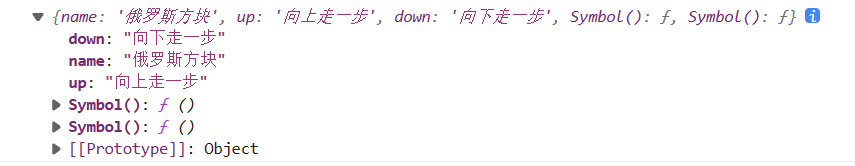

```js
let game = {
    name: '狼人杀',
    [Symbol('say')]:function(){
        console.log('发言');
    },
    [Symbol('kill')]:function(){
        console.log('杀人');
    }
}
console.log(game);
```

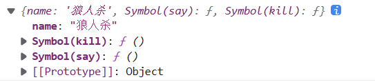

### 10.4 内置属性

除了自定义使用的Symbol值意外，ES6还提供了11个内置的Symbol值，指向语言内部的使用方法

| 属性c                     | 描述                                                         |
| ------------------------- | ------------------------------------------------------------ |
| Symbol.hasInstance        | 当其他对象使用 instanceof 运算符，判断是否为该对象的实例时，会调用这个方法 |
| Symbol.isConcatSpreadable | 对象的 Symbol.isConcatSpreadable 属性等于的是一个 布尔值，表示该对象用于Array.prototype.concat()时， 是否可以展开。 |
| Symbol.species            | 创建衍生对象时，会使用该属性                                 |
| Symbol.match              | 当执行 str.match(myObject) 时，如果该属性存在，会 调用它，返回该方法的返回值。 |
| Symbol.replace            | 当该对象被 str.replace(myObject)方法调用时，会返回 该方法的返回值。 |
| Symbol.search             | 当该对象被 str.search (myObject)方法调用时，会返回 该方法的返回值。 |
| Symbol.spli               | 当该对象被 str.split(myObject)方法调用时，会返回该 方法的返回值。 |
| Symbol.iterator           | 对象进行 for...of 循环时，会调用 Symbol.iterator 方法， 返回该对象的默认遍历器 |
| Symbol.toPrimitive        | 该对象被转为原始类型的值时，会调用这个方法，返 回该对象对应的原始类型值。 |
| Symbol. toStringTag       | 在该对象上面调用 toString 方法时，返回该方法的返 回值        |
| Symbol. unscopables       | 该对象指定了使用 with 关键字时，哪些属性会被 with 环境排除。 |

**演示：**

① Symbol.hasInstance：

```js
class Person {
    static [Symbol.hasInstance](param) {
        console.log(param);
        console.log('被检测！');
        // return false
        return true
    }
}
let o = {};
console.log(o instanceof Person);
```

> {}
> 被检测！
> true

② Symbol.isConcatSpreadable：

```js
const arr = [1, 2, 3]
const arr1 = [4, 5, 6]
console.log(arr.concat(arr1));
arr1[Symbol.isConcatSpreadable] = false
console.log(arr.concat(arr1));
```

> [1, 2, 3, 4, 5, 6]
>
> [1, 2, 3, Array(3)]

## 11 迭代器

遍历器（Iterator）就是一种机制。它是一种接口，为各种不同的数据结构提 供统一的访问机制。任何数据结构只要部署 Iterator 接口，就可以完成遍历操作。 

1. ES6 创造了一种新的遍历命令 for...of 循环，Iterator 接口主要供 for...of 消费

2. 原生具备 iterator 接口的数据(可用 for of 遍历) 
    - Array 
    - Arguments 
    - Set 
    - Map 
    - String 
    - TypedArray 
    - NodeList 

```js
const ram = ['孙悟空', '猪八戒', '沙和尚']
// 使用 for..of遍历数组
for(let v of ram){
    console.log(v);
}
```

> 孙悟空
>
> 猪八戒
>
> 沙和尚

```js
const ram = ['孙悟空', '猪八戒', '沙和尚']
// 使用 for..in遍历数组
for(let v in ram){
    console.log(v);
}
```

> 0
>
> 1
>
> 2

**工作原理：**

1. 创建一个指针对象，指向当前数据结构的起始位置
2. 第一次调用对象的 next 方法，指针自动指向数据结构的第一个成员
3. 接下来不断调用 next 方法，指针一直往后移动，直到指向最后一个成员
4. 每调用 next 方法返回一个包含 value 和 done 属性的对象 

```js
const ram = ['孙悟空', '猪八戒', '沙和尚']
let iterator = ram[Symbol.iterator]();
// 调用对象的next方法
console.log(iterator.next());
console.log(iterator.next());
console.log(iterator.next());
console.log(iterator.next());
```

> {value: '孙悟空', done: false}
> {value: '猪八戒', done: false}
> {value: '沙和尚', done: false}
> {value: undefined, done: true}

注: 需要自定义遍历数据的时候，要想到迭代器。

**应用——自定义遍历数据：**

当我们使用for of需要遍历一个对象中的数组时：

```js
const classroom = {
    name: '高三一班',
    stu: [
        '小明',
        '小红',
        '小兰'
    ]
}
for (let v of classroom) {
    console.log(v);
}
```

此时提示：`Uncaught TypeError: classroom is not iterable`，手动添加iterable，

```js
const classroom = {
    name: '高三一班',
    stu: [
        '小明',
        '小红',
        '小兰'
    ],
    [Symbol.iterator](){

    }
}
for (let v of classroom) {
    console.log(v);
}
```

此时提示：`Uncaught TypeError: Result of the Symbol.iterator method is not an object`，需要我们再iterable方法中返回对象，手动添加一个返回对象

```js
const classroom = {
    name: '高三一班',
    stu: [
        '小明',
        '小红',
        '小兰'
    ],
    [Symbol.iterator](){
        return {}
    }
}
for (let v of classroom) {
    console.log(v);
}
```

此时提示：`Uncaught TypeError: undefined is not a function`，此时我们需要再返回的对象中添加next方法

```js
const classroom = {
    name: '高三一班',
    stu: [
        '小明',
        '小红',
        '小兰'
    ],
    [Symbol.iterator](){
        return {
            next:function(){

            }
        }
    }
}
for (let v of classroom) {
    console.log(v);
}
```

此时提示：`Uncaught TypeError: Iterator result undefined is not an object`，描述了next方法返回的是undefined而不是object，此时我们再next方法中返回一个对象

```js
const classroom = {
    name: '高三一班',
    stu: [
        '小明',
        '小红',
        '小兰'
    ],
    [Symbol.iterator](){
        return {
            next:function(){
                return {value:'abc',done:false}
            }
        }
    }
}
for (let v of classroom) {
    console.log(v);
}
```

此时会不停的遍历，所以需要对返回的结果进行处理：

```js
const classroom = {
    name: '高三一班',
    stu: [
        '小明',
        '小红',
        '小兰'
    ],
    [Symbol.iterator]() {
        // 1.索引遍历
        let index = 0
        // 3. 声明this（箭头函数也可以解决）
        let _this = this
        return {
            next: function () {
                // 2.判断
                if (index < _this.stu.length) {
                    // index小于stu的长度，证明循环还没有结束
                    // 此处的this指向的是上一级return对象
                    const result = { value: _this.stu[index], done: false }
                    index++;
                    // 返回结果
                    return result;
                } else {
                    return { value: 'undefined', done: 'true' }
                }

            }
        }
    }
}
for (let v of classroom) {
    console.log(v);
}
```

箭头函数解决this指向问题：

```js
const classroom = {
    name: '高三一班',
    stu: [
        '小明',
        '小红',
        '小兰'
    ],
    [Symbol.iterator]() {
        // 1.索引遍历
        let index = 0
        return {
            next: () => {
                // 2.判断
                if (index < this.stu.length) {
                    // index小于stu的长度，证明循环还没有结束
                    // 此处的this指向的是上一级return对象
                    const result = { value: this.stu[index], done: false }
                    index++;
                    // 返回结果
                    return result;
                } else {
                    return { value: 'undefined', done: 'true' }
                }

            }
        }
    }
}
for (let v of classroom) {
    console.log(v);
}
```

## 12 生成器

### 12.1 介绍

生成器函数是ES6提供的一种异步编程解决方案，语法行为与传统函数不同

生成器对象常被我们称为**“生成器”**（Generator），而 Generator 函数常称为**“生成器函数”**（Generator Function）。

由于生成器对象是实现了**可迭代协议**和**迭代器协议**的，**因此生成器也是一个迭代器，生成器也是一个可迭代对象。**

```js
// 生成器函数
function* genFn() {}

// 生成器对象
const gen = genFn()

// 生成器对象包含 @@iterator 方法，因此满足可迭代协议
gen[Symbol.iterator] // ƒ [Symbol.iterator]() { [native code] }

// 生成器对象含 next 方法，因此也是满足迭代器协议的
gen.next // ƒ next() { [native code] }

// 生成器对象的 @@iterator 方法返回自身（即迭代器）
gen === gen[Symbol.iterator]() // true
```

**怎样理解 Generator 函数？**

- Generator 函数是一个状态机，封装了多个内部状态。
- Generator 函数返回一个**生成器对象**，该对象也实现了 Iterator 接口（也可供 `for...of` 等消费使用），所以具有了 `next()` 方法。因此，使得生成器对象拥有了开始、暂停和恢复代码执行的能力。
- 生成器对象可以用于自定义迭代器和实现协程（coroutine）。
- Generator 函数从字面理解，形式与普通函数很相似。在函数名称前面加一个星号（`*`），表示它是一个生成器函数。尽管语法上与普通函数相似，但语法行为却完全不同。
- Generator 函数强大之处，感觉很多人没 GET 到。它可以在不同阶段从外部直接向内部注入不同的值来调整函数的行为。

生成器对象，是由 Generator 函数返回的，并且它返回可迭代协议和迭代器协议，因此生成器对象是一个可迭代对象。

### 12.2 Generator 函数语法

**Generator 函数**

与普通函数声明类似，但有两个特有特征：

- 一个是 `function` 关键字与函数名称之间有一个星号 `*`；
- 二是函数体内使用 `yield` 表达式，以定义不同的内部状态。

> 星号 `*` 位置没有明确限制，只要处于关键字与函数名之间即可，空格可用可无，不影响。还有，这里 `yield` 是“产出”的意思。

实际中，基本上使用字面量形式去声明一个 Generator 函数，很少用到构造函数 GeneratorFunction 来声明的。

示例：

```js
// generatorFn 是一个生成器函数
function* generatorFn() {
  console.log('do something...')
  // other statements
}

// 调用生成器函数，返回一个生成器对象。
const gen = generatorFn()

// 注意，上面像平常一样调用函数，并不会执行函数体内部的逻辑/语句。
// 需要（不断地）调用生成器对象的 next() 方法，才会开始（继续）执行内部的语句。
// 具体如何执行，请看下一个示例。
gen.next()
// 执行到这里，才会打印出："do something..."
// 且 gen.next() 的返回值是：{ value: undefined, done: true }
```

上述示例中，调用生成器函数被调用，并不会立即立即执行函数体内部的语句。另外，**函数体内的 `yield` 表达式是可选的，可以不写**，但这就失去了生成器函数本身的意义了。

再看示例：

```js
function* generatorFn() {
  console.log(1)
  yield '100'
  console.log(2)
  yield '200'
  console.log(3)
  return '300'
}

const gen = generatorFn()
```

前面提到，Generator 函数返回一个生成器，它也是一个迭代器。因此生成器内部存在一个指针对象，指向每次遍历结束的位置。每调用生成器的 `next()` 方法，指针对象会从函数头部（首次调用时）或上一次停下来的地方开始执行，直到遇到下一个 `yield` 表达式（或 `return` 语句）为止。执行结果如下：

```js
function * generatorFn() {
    console.log(1)
    yield '100'
    console.log(2)
    yield '200'
    console.log(3)
    return '300'
}
const gen = generatorFn()
console.log(gen.next());
console.log(gen.next());
console.log(gen.next());
console.log(gen.next());
```

> 1
> {value: '100', done: false}
> 2
> {value: '200', done: false}
> 3
> {value: '300', done: true}
> {value: undefined, done: true}

上面一共调用了四次 `next()` 方法，从结果分析：

1. 当首次调用 `gen.next()` 方法，代码执行到 `yield '100'` 会停下来（指针对象指向此处），并返回一个 `IteratorResult` 对象：`{ value: '100', done: false }`，包含 `done` 和 `value` 属性。其中 `value` 属性值就是 `yield` 表达式的返回值 `'100'`，`done` 为 `false` 表示遍历还没结束。
2. 第二次调用 `next()` 方法，它会从上次 `yield` 表达式停下的地方开始执行，直到下一个 `yield` 表达式（指针对象也会指向此处），并返回 `IteratorResult` 对象：`{ value: '200', done: false }`
3. 第三次调用 `next()` 方法，执行过程同理。它遇到 `return` 语句遍历就结束了。返回 `IteratorResult` 对象为：`{ value: '300', done: true }`，其中 `value` 对应 `return` 表达式的返回值。如果 Generator 函数内没有 `return` 语句，那么 `value` 属性值为 `undefined`，因此返回 `{ value: undefined, done: true }`。
4. 第四次调用 next() 方法，返回 `{ value: undefined, done: true }`，原因是生成器对象 `gen` 已遍历结束。当迭代器已遍历结束，无论你再调用多少次 `next()` 方法，都是返回这个值。

### 12.3 yield 表达式

生成器函数返回的迭代器对象，只有调用 `next()` 方法才会遍历下一个内部状态，所以它提供了一种可以暂停执行的函数。而 `yield` 表达式就是暂停标志。

遍历器对象的 `next()` 方法的运行逻辑如下：

1. 遇到 `yield` 表达式，就暂停执行后面的操作，并将紧跟在 `yield` 后面的那个表达式的值，作为返回的对象的 `value` 属性值。
2. 下一次调用`next()`方法时，再继续往下执行，直到遇到下一个 `yield` 表达式。
3. 如果没有再遇到新的 `yield` 表达式，就一直运行到函数结束，直到 `return` 语句为止，并将 `return` 语句后面的表达式的值，作为返回的对象的 `value` 属性值。
4. 如果该函数没有 `return` 语句，则返回的对象的 `value` 属性值为 `undefined`。

需要注意的是，`yield` 表达式后面的表达式，只有在调用 `next()` 方法，且内部指针指向该语句时才会执行，因此相当于为 JavaScript 提供了手动的“惰性求值”（Lazy Evaluation）的语法功能。

```js
function* generatorFn() {
  // 请注意 yield 关键字后面的表达式，是惰性求值的！
  // 为了更明显地说明问题，这里使用 IIFE。
  yield (function () {
    console.log('here here')
    return 1
  })()
}

const gen = generatorFn()
gen.next() // 调用 next 方法才会打印出："here here"
```

上面的示例中，`yield` 后面的立即执行函数表达式，不会在调用 `generatorFn()` 后立即求值，只会在调用 `gen.next()` 方法才会进行求值。

### 12.4 生成器函数的参数传递

我们可以在函数中进行参数传递：

```js
function * generatorFn(arg) {
    console.log(arg)
    yield '100'
    yield '200'
    return '300'
}
const gen = generatorFn('abc')
console.log(gen.next());
```

当我们在第二个 next() 方法中进行传参时，将会作为第一个 yield的返回值，在第三个next()方法中传参，会作为第二个 yield函数中的返回值

```js
function * generatorFn(arg) {
    console.log(arg)
    let one = yield '100'
    console.log(one);
    yield '200'
    yield '300'
}
const gen = generatorFn('AAA')
console.log(gen.next());
console.log(gen.next('BBB'));
```

> AAA
> {value: '100', done: false}
> BBB
> {value: '200', done: false}

### 12.5 生成器函数实例

**需求：1s后输出111，2s后输出222，3s后输出333**

普通写法：

```js
setTimeout(() => {
    console.log(111);
    setTimeout(() => {
        console.log(222);
        setTimeout(() => {
            console.log(333);
        }, 3000)
    }, 2000)
}, 1000)
```

生成器写法：

```js
function one() {
    setTimeout(() => {
        console.log(111);
        iterator.next();
    }, 1000)
}
function two() {
    setTimeout(() => {
        console.log(222);
        iterator.next();

    }, 2000)
}
function three() {
    setTimeout(() => {
        console.log(333);
    }, 3000)
}
function* gen() {
    yield one()
    yield two()
    yield three()
}
// 调用生成器
let iterator = gen()
iterator.next()
```

**需求：模拟获取，用户数据，订单数据，商品数据**

```js
function getUser() {
    setTimeout(() => {
        let data = '用户数据'
        iterator.next(data)
    }, 1000)
}
function getOrder() {
    setTimeout(() => {
        let data = '订单数据'
        iterator.next(data)
    }, 1000)
}
function getGoods() {
    setTimeout(() => {
        let data = '商品数据'
        iterator.next(data)
    }, 1000)
}
function* gen() {
    let user = yield getUser()
    console.log(user);
    let order = yield getOrder()
    console.log(order);
    let goods = yield getGoods()
    console.log(goods);
}
// 调用生成器
let iterator = gen()
iterator.next()
```

## 13 Promise

Promise是ES6引入的异步编程的新解决方法，语法上Promise是一个构造函数，用来封装异步操作并可以获取成功或失败的结果

问题：异步必须通过回调函数来返回结果，回调函数一多，代码就会变的复杂

### 13.1介绍

**Promise是JS中进行异步编程的新的解决方案**

- `promise` 是一个**构造函数**
- `Promise` 的构造函数接收一个函数为参数，并且传入两个参数：**resolve，reject**，分别表示异步操作执行成功后的回调函数和异步操作执行失败后的回调函数。

**为什么要用Promise**

1. 指定回调函数的方法更加灵活
2. 支持链式调用 ，可以解决回调函数问题

Promise就是一个用来存储数据的容器，它拥有着一套特殊的存取数据的方式，这个方式使得它可以存储异步调用的结果

###  13.2 创建Promise

```js
const promise = new Promise((resolve,reject) => {
    resolve("哈哈")
    //reject("哈哈")
})
console.log(promise)
```

- 创建Promise时，构造函数需要一个函数作为参数
- resolve 和 reject 是两个涵数，通过这两个函数可以向Promise中存储数据
- resolve在执行正常时存储数据，reject在执行错误时存储数据
- 通过函数来向Promise中添加数据，好处就是可以用来添加异步调用的数据

### 13.3 Promise的三个实例方法

#### 13.3.1 then() 方法

可以通过Promise的实例方法then来读取Promise中存储数据

```js
const promise = new Promise((resolve,reject) => {
    resolve("哈哈")
    //reject("哈哈")
})
 
Promise.then((result) => {
    console.log("resolve:",result)
},(reason) => {
    console.log("reject:",reason)
})
```

- then需要两个回调函数作为参数，回调函数用来获取Promise中的数据
- 通过resolve存储的数据，会调用第一个函数的返回，可以在该函数中编写处理数据的代码
- 通过reject存储的数据或者出现异常时，会调用第二个函数返回，可以在该函数中编写处理异常的代码

#### 13.3.2 catch() 方法

```js
const promise = new Promise((resolve,reject) => {
    // resolve("哈哈")
    reject("哈哈")
})
promise.catch(reason => {
    console.log(reason)
})
```

- catch() 用法和then类似，但是只需要一个回调函数作为参数
- catch() 中的回调函数只会在Promise被拒绝才会调用
- catch() 相当于then( null, reason => { } )
- catch() 就是一个专门处理异常的方法

#### 13.3.3 finally() 方法

```js
const promise = new Promise((resolve, reject) => {
    resolve("哈哈")
    // reject("哈哈")
})
promise.finally(reason => {
    console.log("没有什么能阻止我执行")
})
```

-  无论是正常存储数据还是出现异常了，finally总会执行
-  但是finally的回调函数中不会接收到数据
-  finally()通常用来编写一些无论成功与否都要执行的代码

### 13.4 Promise中维护的两个隐藏属性


1. PromiseResult：用来存储数据
2. PromiseState：记录Promise的状态（三种状态）
    - pending (进行中)
    - fulfilled (完成)
    - rejected (拒绝，出错了)
3. state只能修改一次，修改以后永远不会在变

流程：

- 当Promise创建时，PromiseState初始值为pending
- 当通过resolve存储数据时，PromiseResult 变为存储的数据 ，PromiseState 变为 fulfilled (完成)
- 当通过reject存储数据时 PromiseState 变为 rejected (拒绝，出错了)，PromiseResult 变为存储的数据或异常对象
- 当我们通过then读取数据时，相当于Promise设置了回调函数，如果PromiseState变为fulfilled, 则调用then的第一个回调函数来返回，如果PromiseState变为rejected,则调用then的第二个回调函数来返回

### 13.5 Promise详解

之前的问题：

```js
function sum(a, b, cb) {
    setTimeout(() => {
        cb(a + b)
    }, 1000)
}

sum(123, 456, (result) => {
    console.log(result);
})
```

异步求sum(123,456)的值通过回调函数返回a+b的值，但是多次嵌套会陷入回调地狱

通过promise去修改代码，直接在函数中`return new promise`，以前的函数代码写在promise中，将异步的结果通过resolve存储到promise中，即

```js
function sum(a, b) {
    return new Promise((resolve, reject) => {
        setTimeout(() => {
            resolve(a + b)
        }, 1000)
    })
}
const result =  sum(123, 456)
console.log(result)
```

通过变量接收sum的值，我们发现result是一个promise对象


我们可以直接调用promise中的then方法读取数据

```js
function sum(a, b) {
    return new Promise((resolve, reject) => {
        setTimeout(() => {
            resolve(a + b)
        }, 1000)
    })
}
sum(123, 456).then(result=>{
    console.log(result); // 579
})
```

但是我们并没有解决回调地狱的问题，若需要用123+456的值加7，我们可以在此调用sum函数，例如

```js
function sum(a, b) {
    return new Promise((resolve, reject) => {
        setTimeout(() => {
            resolve(a + b)
        }, 1000)
    })
}
sum(123, 456).then(result=>{
    sum(result,7).then(result=>{
        sum(result,8).then(result=>{
            console.log(result); //594
        })
    })
})
```

那我们将会再次陷入新的回调地狱中，如何解决这个问题。

### 13.6 Promise链式调用

promise中的then，catch，finally返回的都是promise对象，原因是为了返回数据（promise是用来存储数据的），例如：

```js
function sum(a, b) {
    return new Promise((resolve, reject) => {
        setTimeout(() => {
            resolve(a + b)
        }, 1000)
    })
} 
const p =  sum(123, 456).then(result=>{
    console.log("回调函数",result);
    return result
})
setTimeout(()=>{
    console.log(p); 
},1500)
```

其中，then方法中的return的值会成为新的PromiseResult，catch方法同理

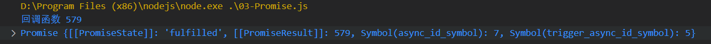

finally方法的返回值不会存储到新的promise中，因为finally方法总会执行

现有这样一段promise函数

```js
const promise = new Promise((resolve, reject) => {
    resolve("锄禾日当午")
})

promise.then(result => {
    console.log("第一个then", result);
    return "汗滴禾下土"
}).then(result => {
    console.log("第二个then", result);
    return "谁知盘中餐"
}).then(result => {
    console.log("第三个then", result);
    return "粒粒皆辛苦"
}).then(result => {
    console.log("第四个then", result);
})
```

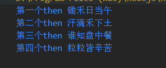

我们发现then方法打印的值是上一个then方法返回的值，我们成为promise的**链式调用**

上述的回调地狱函数：

```js
function sum(a, b) {
    return new Promise((resolve, reject) => {
        setTimeout(() => {
            resolve(a + b)
        }, 1000)
    })
}
sum(123, 456).then(result=>{
    sum(result,7).then(result=>{
        sum(result,8).then(result=>{
            console.log(result); //594
        })
    })
})
```

用promise链式调用进行修改：

```js
function sum(a, b) {
    return new Promise((resolve, reject) => {
        setTimeout(() => {
            resolve(a + b)
        }, 1000)
    })
}
sum(123, 456)
    .then(result => result + 7)
    .then(result => result + 8)
    .then(result => console.log(result)) //594
```

**Promise穿透：**

现有如下代码：

```js
const promise = new Promise((resolve, reject) => {
    resolve("哈哈")
})

promise
    .then(result => "嘿嘿")
    .catch(result => console.log("异常"+result))
    .then(result => console.log("无异常"+result))
```

运行后输出结果为：无异常嘿嘿，发现catch方法获取不到上一个then的返回值，其原因是catch方法获取的是异常处理的返回值，但是整个函数没有异常处理，所有跳过了catch方法

若promise中存错误信息，如下：

```js
const promise = new Promise((resolve, reject) => {
    reject("哈哈")
})

promise
    .then(result => console.log("第一个then" + result))
    .catch(result => console.log("异常" + result))
    .then(result => console.log("第二个then" + result))
```

输出：

```bash
异常哈哈
第二个thenundefined
```

发现第一个then被跳过了，直接找catch方法，这就是**穿透**

但是第二个then的输出为什么是undefined，是应为上一个catch的返回值为undefined，如果给catch设置返回值，那么第二个then输出的值将会之catch的返回值，例如

```js
const promise = new Promise((resolve, reject) => {
    reject("哈哈")
})

promise
    .then(result => console.log("第二个then" + result))
    .catch(result => {
        console.log("异常" + result)
        return "嘻嘻"
    })
    .then(result => console.log("第二个then" + result))
```

输出：

```bash
异常哈哈
第二个then嘻嘻
```

后面的方法（then和catch）读取的是前一个方法的返回值，如果上一步的执行结果不是当前想要的结果，则跳过当前的方法

当promise出现异常时，而整个调用链中没有出现catch，则异常会向外抛出。如：

```js
const promise = new Promise((resolve, reject) => {
    reject("哈哈")
})

promise
    .then(result => console.log("第二个then" + result))
    .then(result => console.log("第二个then" + result))
```

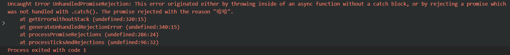

若调用链中的catch出错，他不会自己解决掉问题，而是抛出错误或交给后续的调用处理异常，catch只能解决前面调用出现的异常，例如：

```js
const promise = new Promise((resolve, reject) => {
    reject("哈哈")
})


promise
    .then(result => console.log("第二个then" + result))
    .catch(result =>{
        throw new Error("第一个错误")
        console.log(result);
        return "嘻嘻"

    })
    .then(result => console.log("第二个then" + result))
    .catch(result =>{
        console.log("出错了");
    })
```

输出：

```bash
出错了
```

第一个catch的错误交给了第二个catch解决，所以一般将catch写在最后（根据实际需要选择）

### 13.7 Promise静态方法

#### 13.7.1 resolve方法

方法返回一个以给定值解析后的Promise 对象

定值有以下几种情况：

- 如果这个值是一个 promise ，那么将返回这个 promise
- 参数不是具有then()方法的对象，或根本就不是对象，Promise.resolve()会返回一个新的 Promise 对象，状态为resolved
- 没有参数时，直接返回一个resolved状态的 Promise 对象

Promise.resovle()：创建一个立即完成得分Promise，例如：

`Promise.resovle(10)` 等价于

```js
new Promise((resovle,reject) =>{
	resovle(10)
})
```

可以通过then方法读取数据：

```js
Promise.resovle(10).then(r=> console.log(r))
```

#### 13.7.2 reject()方法

Promise.reject() 方法也会返回一个新的 Promise 实例,该实例的状态为rejected，即创建一个立即拒绝的Promise

```js
Promise.reject("错误信息").catch(r =>console.log(r))
```

#### 13.7.3 all()方法

方法接收一个promise的iterable类型（注：Array，Map，Set都属于ES6的iterable类型）的输入，并且只返回一个`Promise`实例

Promise.all([...]) 方法同时返回多个Promise的执行结果

```js
function sum(a, b) {
    return new Promise((resolve, reject) => {
        setTimeout(() => {
            resolve(a + b)
        }, 1000)
    })
} 

Promise.all([sum(123,456),sum(456,789),sum(789,123)]).then(result =>console.log(result)) 
//[579, 1245, 912]
```

Promise.all()方法有一个特点：其中有一个报错，就会返回错误，例如：

```js
function sum(a, b) {
    return new Promise((resolve, reject) => {
        setTimeout(() => {
            resolve(a + b)
        }, 1000)
    })
} 

Promise.all([
    sum(123,456),
    sum(456,789),
    Promise.reject("错误信息"),
    sum(789,123)
]).then(result =>console.log(result))
```

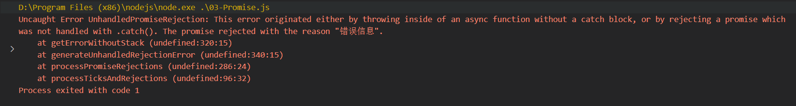

实例的状态由sum(123,456)，sum(456,789)，sum(789,123)决定，分两种情况：

- 只有sum(123,456)，sum(456,789)，sum(789,123)的状态都变成fulfilled，p的状态才会变成fulfilled，此时p1、p2、p3的返回值组成一个数组，传递给p的回调函数
- 只要sum(123,456)，sum(456,789)，sum(789,123)之中有一个被rejected，p的状态就变成rejected，此时第一个被reject的实例的返回值，会传递给p的回调函数

#### 13.7.4 allSettled()方法

Promise.allSettled([...]) 方法同时返回多个Promise的执行结果（无论成功或失败）

例如：

```js
function sum(a, b) {
    return new Promise((resolve, reject) => {
        setTimeout(() => {
            resolve(a + b)
        }, 1000)
    })
} 

Promise.allSettled([
    sum(123,456),
    sum(456,789),
    Promise.reject("错误信息"),
    sum(789,123)
]).then(result =>{
    console.log(result)
}) //在此处打断点进行调试
```

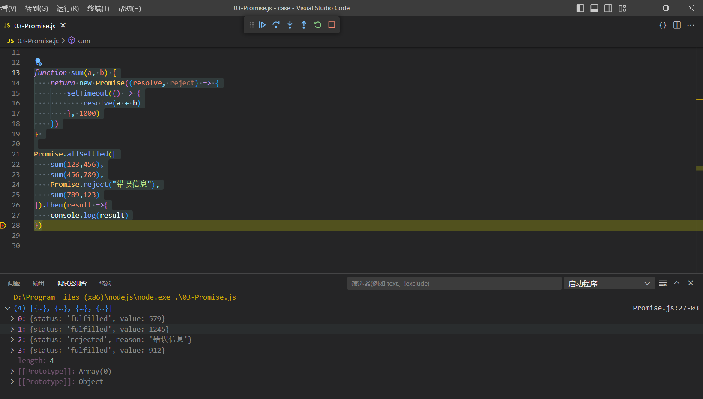

数据结构：

```js
0:{status: 'fulfilled', value: 579}
1:{status: 'fulfilled', value: 1245}
2:{status: 'rejected', reason: '错误信息'}
3:{status: 'fulfilled', value: 912}
//成功返回的value ,失败返回reason
```

#### 13.7.5 race()方法

Promise.race([...]) 返回执行最快的promise（不考虑对错）

该方法同样是将多个 Promise 实例，包装成一个新的 Promise 实例

```js
function sum(a, b) {
    return new Promise((resolve, reject) => {
        setTimeout(() => {
            resolve(a + b)
        }, 1000)
    })
} 

Promise.race([
    sum(123,456),
    sum(456,789),
    sum(789,123)
]).then(result =>{
    console.log(result) //579
})
```

只要sum(123,456)，sum(456,789)，sum(789,123)之中有一个实例率先改变状态，promise的状态就跟着改变

率先改变的 Promise 实例的返回值则传递给的回调函数

若上述代码中加一个立即完成的promise，如：

```js
function sum(a, b) {
    return new Promise((resolve, reject) => {
        setTimeout(() => {
            resolve(a + b)
        }, 1000)
    })
} 

Promise.race([
    sum(123,456),
    sum(456,789),
    Promise.resolve(111),
    sum(789,123)
]).then(result =>{
    console.log(result)
})
```

输出的值为：111

若上述代码中加一个立即拒绝的promise，如：

```js
function sum(a, b) {
    return new Promise((resolve, reject) => {
        setTimeout(() => {
            resolve(a + b)
        }, 1000)
    })
} 

Promise.race([
    sum(123,456),
    sum(456,789),
    Promise.reject(111),
    sum(789,123)
]).then(result =>{
    console.log(result)
}).catch(result=>{
    console.log("错误",result)
})
```

输出的值为：错误 111，若调用中没有catch方法，如：

```js
function sum(a, b) {
    return new Promise((resolve, reject) => {
        setTimeout(() => {
            resolve(a + b)
        }, 1000)
    })
} 

Promise.race([
    sum(123,456),
    sum(456,789),
    Promise.reject(111),
    sum(789,123)
]).then(result =>{
    console.log(result)
})
```

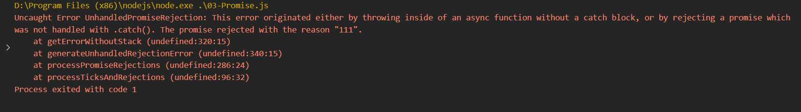

#### 13.7.6 any()方法

Promise.any([...]) 返回执行最快的完成的promise

```js
function sum(a, b) {
    return new Promise((resolve, reject) => {
        setTimeout(() => {
            resolve(a + b)
        }, 1000)
    })
} 

Promise.any([
    Promise.reject(111),
    sum(123,456),
    sum(456,789),
    sum(789,123)
]).then(result =>{
    console.log(result)
})
```

如果都是拒绝的promise，才会调用catch方法例如：

```js
function sum(a, b) {
    return new Promise((resolve, reject) => {
        setTimeout(() => {
            resolve(a + b)
        }, 1000)
    })
}

Promise.any([
    Promise.reject(111),
    Promise.reject(222),
    Promise.reject(333),
]).then(result => {
    console.log(result)
}).catch(result => {
    console.log(result)
})
```

且生成一个独有的错误信息：

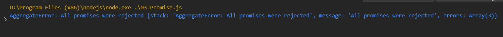

### 13.8 宏任务和微任务

#### 13.8.1 引言

现有如下代码：

```js
setTimeout(()=>{
    console.log(1);
},0)
console.log(2);
```

输出打印：

```bash
2
1
```

先输出的2后输出1，其原因如下：JS是单线程的，它的运行基于事件循环机制（even loop）

1. 调用栈：

    - 栈是一种数据结构，先进后出，后进先出

    - 调用栈中，放的是要执行的代码

2. 任务队列：

    - 队列是一种数据结构，先进先出

    - 任务队列中，放的是将要执行的代码

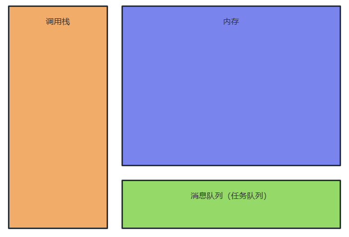

定时器（setTimeout）的作用是间隔一段时间后，将函数放到任务队列中，0毫秒代表立即放到任务队列中，而`console.log(2);`直接放入调用栈中，所以先输出2，后输出1

代码进行改变：

```js
setTimeout(() => {
    console.log(1);
}, 0)

Promise.resolve(1).then(()=>{
    console.log(2);
})

console.log(3);
```

运行后输出：

```
3
2
1
```

如下代码：

```js
setTimeout(() => {
    console.log(1);
}, 0)

Promise.resolve(1).then(()=>{
    console.log(2);
})
/*
2
1
*/
```

同样是异步代码，放在消息队列中，按照代码执行顺序，应该是先输出1，后输出2，为什么先输出2后输出1？

原因如下：

**Promise的执行原理：**Promise在执行时，then就相当于给Promise了回调函数，当Promise的状态从pending变成fulfilled时，then的回调函数会被放入到任务队列（微任务队列）中

#### 13.8.2 介绍

**任务队列由两种任务队列：宏任务队列，微任务队列**

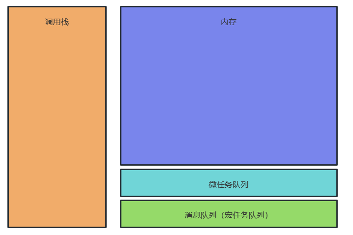

在ES3以及以前的版本中，JavaScript本身没有发起异步请求的能力，也就没有微任务的存在。在ES5之后，JavaScript引入了Promise，这样，不需要浏览器，JavaScript引擎自身也能够发起异步任务了。

ES6 规范中，microtask 称为 jobs，macrotask 称为 task，宏任务是由宿主发起的，而微任务由JavaScript自身发起。

|                    | **宏任务（macrotask）**                                      | **微任务（microtask）**                                      |
| :----------------: | :----------------------------------------------------------- | :----------------------------------------------------------- |
|      谁发起的      | 宿主（Node、浏览器）                                         | JS引擎                                                       |
|      具体事件      | 1. script (可以理解为外层同步代码)<br/>2. setTimeout/setInterval<br/>3. UI rendering/UI事件<br/>4. postMessage，MessageChannel<br/>5. setImmediate，I/O（Node.js） | 1. Promise<br/>2. MutaionObserver<br/>3. Object.observe（已废弃；Proxy 对象替代）<br/>4. process.nextTick（Node.js） |
|      具体事件      | 后运行                                                       | 先运行                                                       |
| 会触发新一轮Tick吗 | 会                                                           | 不会                                                         |

**整个流程：**

1. 执行调用栈中的代码
2. 执行微任务队列中的所有代码
3. 执行宏任务队列中的所有代码

**在 JavaScript 中通过 queueMicrotask() 使用微任务**

例如：

```js
queueMicrotask(()=>{
    console.log(2)
})
```

#### 13.8.3 练习

**例一：**

```js
setTimeout(() => {
    console.log(1);
}, 0)

queueMicrotask(()=>{
    console.log(2)
})

Promise.resolve(1).then(()=>{
    console.log(3);
})

// 2 3 1 
```

分析：

1. 遇到setTimout，异步宏任务，放入宏任务队列中
2. queueMicrotask()和Promise.then都是微任务，谁先调用谁先执行

**例二：**

```js
Promise.resolve(1).then(()=>{
    setTimeout(() => {
        console.log(1);
    }, 0)
})

queueMicrotask(()=>{
    console.log(2)
})
// 2 1
```

分析：

1. 按照微任务代码执行顺序，Promise.resolve(1).then先执行，queueMicrotask()后执行
2. console.log(1);是setTimeout中的函数，通过setTimeout挂载的函数挂在到宏任务队列中
3. 微任务中的代码执行完后才会执行宏任务中的代码

**例三：**

```js
Promise.resolve(1.1).then(()=>{
    Promise.resolve(1.2).then(()=>{
        console.log(1);
    })
})

queueMicrotask(()=>{
    console.log(2)
})

// 2 1 
```

分析：

1. 微任务队列中的由两个任务：Promise.resolve(1.1).then()和queueMicrotask(）
2. 按照代码执行的顺序，先执行Promise.resolve(1.1).then()，该任务向微任务队列添加了一个新的任务，且该任务执行完毕
3. 微任务队列中存在两个任务：queueMicrotask(）和Promise.resolve(1.2).then()
4. 按照代码执行顺序，先输出 2 后输出1

**例四：**

```js
console.log(1);

setTimeout(() => console.log(2));

Promise.resolve().then(() => console.log(3));

Promise.resolve().then(() => setTimeout(() => console.log(4)));

Promise.resolve().then(() => console.log(5));

setTimeout(() => console.log(6));

console.log(7);

// 1735264
```

### 13.9 自定义Promise

#### 13.9.1 Promise雏形

```js
class MyPromise{
    // 定义一个构造函数
    constructor(executor){      
    }
}

const mp = new MyPromise((resolve,reject)=>{

})
```

executor：形参，resolve,reject：实参，实参会传给形参

```js
class MyPromise{
    // 定义一个构造函数
    constructor(executor){
        // 接收一个 执行器 作为参数
        executor() //调用回调函数
    }
}

const mp = new MyPromise((resolve,reject)=>{
    console.log("回调函数执行了");
})

/* 
执行输出：
回调函数执行了
*/
```

下面的newPromise的参数是一个函数，这个函数是上面构造函数的实参，这时候构造函数的形参接收实参，并调用实参函数中的log

但是目前无法通过resolve进行数据存储，所以需要定义两个实例方法，然后将两个实例传递给执行器，如下：

```js
class MyPromise {
    // 定义一个构造函数
    constructor(executor) {
        // 接收一个 执行器 作为参数
        executor(this.resolve,this.reject) //调用回调函数
    }

    resolve() { }
    
    reject() { }
}

const mp = new MyPromise((resolve, reject) => {
    // console.log("回调函数执行了");
})
```

MyPromise中的resovle方法和reject方法是内部方法，不希望外部能够访问到，例如mp.resovle()访问内部方法，需要将两个方法变成私有的方法，如下：

```js
class MyPromise {
    // 定义一个构造函数
    constructor(executor) {
        // 接收一个 执行器 作为参数
        executor(this.#resolve, this.#reject) //调用回调函数
    }
	//私有的resolve()：用来存储成功的数据
    #resolve(value) {

    }
    //私有的reject()：用来存储拒绝的数据
    #reject(reason) {

    }
}

const mp = new MyPromise((resolve, reject) => {
    // console.log("回调函数执行了");
})
```

我们通过调用reslove进行存储数据，可以发现，数据能够传递，但是并没有存储，如下：

```js
class MyPromise {
    // 定义一个构造函数
    constructor(executor) {
        // 接收一个 执行器 作为参数
        executor(this.#resolve, this.#reject) //调用回调函数
    }
    //私有的resolve()：用来存储成功的数据
    #resolve(value) {
        console.log("resolve被调用了，value值:",value);
    }
      //私有的reject()：用来存储拒绝的数据
    #reject(reason) {

    }
}

const mp = new MyPromise((resolve, reject) => {
    // console.log("回调函数执行了");
    resolve("孙悟空")
})

/*
输出：
resolve被调用了，value值: 孙悟空
*/
```

所以我们需要创建一个变量来存储promise的结果，当我们通过resolve将值传递过来后，需要将value存储到result中，但是不能直接通过`this.#result = value`进行数据存储，如下：

```js
class MyPromise {
    // 创建一个变量来存储promise的结果
    #result

    // 定义一个构造函数
    constructor(executor) {
        // 接收一个 执行器 作为参数
        executor(this.#resolve, this.#reject) //调用回调函数
    }
    //私有的resolve()：用来存储成功的数据
    #resolve(value) {
        // console.log("resolve被调用了，value值:",value);
        this.#result = value
    }
      //私有的reject()：用来存储拒绝的数据
    #reject(reason) {

    }
}

const mp = new MyPromise((resolve, reject) => {
    // console.log("回调函数执行了");
    resolve("孙悟空")
})
console.log(mp);
```

控制台会打印错误： Cannot set properties of undefined (setting '#result')

其原因是：this是undefined

this是谁，看函数的调用方式，函数调用：`resolve("孙悟空")`，并不是：`xxx.resolve("孙悟空")`，`xxx.resolve("孙悟空")`中的this就是xxx，`resolve("孙悟空")`中的this在严格模式下就是undefined ，所以需要解决this的问题，其方式由两种：

1.将resolve变为箭头函数：

```
class MyPromise {
    // 创建一个变量来存储promise的结果
    #result

    // 定义一个构造函数
    constructor(executor) {
        // 接收一个 执行器 作为参数
        executor(this.#resolve, this.#reject) //调用回调函数
    }
    //私有的resolve()：用来存储成功的数据


    #resolve = () => {
        console.log(this);
    }
      //私有的reject()：用来存储拒绝的数据
    #reject(reason) {

    }
}

const mp = new MyPromise((resolve, reject) => {
    // console.log("回调函数执行了");
    resolve("孙悟空")
})
console.log(mp);
```


输出的this和mp相同

```js
//通过这种方式是放在原型里的，会省内存一点
#resolve(value) {
    // console.log("resolve被调用了，value值:",value);
    this.#result = value
}
//通过这种方式是放在对象自身里的，会浪费内存一点
#resolve = () => {
    console.log(this);
}
```

2.可以通过bind()解决，可以通过bind将函数的this锁死，bind改变this指向但是不会调用它

```js
class MyPromise {
    // 创建一个变量来存储promise的结果
    #result

    // 定义一个构造函数
    constructor(executor) {
        // 接收一个 执行器 作为参数
        executor(this.#resolve.bind(this), this.#reject.bind(this)) //调用回调函数
    }
    //私有的resolve()：用来存储成功的数据
    #resolve(value) {
        // console.log("resolve被调用了，value值:",value);
        this.#result = value
    }
    //私有的reject()：用来存储拒绝的数据
    #reject(reason) {

    }
}

const mp = new MyPromise((resolve, reject) => {
    // console.log("回调函数执行了");
    resolve("孙悟空")
})
console.log(mp);
```

然后我们就可以通过resolve进行数据存储：


但是我们又有一个新的问题：

若我们调用两此resolve，后调用的resolve会将前面调用的resolve存储的数据进行覆盖

```js
class MyPromise {
    // 创建一个变量来存储promise的结果
    #result

    // 定义一个构造函数
    constructor(executor) {
        // 接收一个 执行器 作为参数
        executor(this.#resolve.bind(this), this.#reject.bind(this)) //调用回调函数
    }
    //私有的resolve()：用来存储成功的数据
    #resolve(value) {
        // console.log("resolve被调用了，value值:",value);
        this.#result = value
    }
    //私有的reject()：用来存储拒绝的数据
    #reject(reason) {

    }
}

const mp = new MyPromise((resolve, reject) => {
    resolve("孙悟空")
    resolve("猪八戒")
})
console.log(mp);
```


正常的promise只能修改一次，但是现在后面的会覆盖掉前面的，所以要静止数据的重复修改，所以需要创建一个变量来记录promise的状态

```js
class MyPromise {
    // 创建一个变量来存储Promise的结果
    #result
    // 创建一个变量来记录Promsie的状态
    #state = 0 //pending:0  fulfilled:1 rejected:2
    // 定义一个构造函数
    constructor(executor) {
        // 接收一个 执行器 作为参数
        executor(this.#resolve.bind(this), this.#reject.bind(this)) //调用回调函数
    }
    //私有的resolve()：用来存储成功的数据
    #resolve(value) {
        // 静止值被重复修改
        // 如果state不等于0，说明值已经被修改
        if(this.#state !== 0 ) return
        this.#result = value
        this.#state = 1 //表示数据填充成功
    }
    //私有的reject()：用来存储拒绝的数据
    #reject(reason) {

    }
}

const mp = new MyPromise((resolve, reject) => {
    resolve("孙悟空")
    resolve("猪八戒")
})
console.log(mp);
```

我们需要添加一个读取数据的then方法：

```js
class MyPromise {
    // 创建一个变量来存储Promise的结果
    #result
    // 创建一个变量来记录Promsie的状态
    #state = 0 //pending:0  fulfilled:1 rejected:2
    // 定义一个构造函数
    constructor(executor) {
        // 接收一个 执行器 作为参数
        executor(this.#resolve.bind(this), this.#reject.bind(this)) //调用回调函数
    }
    //私有的resolve()：用来存储成功的数据
    #resolve(value) {
        // 静止值被重复修改
        // 如果state不等于0，说明值已经被修改
        if (this.#state !== 0) return
        this.#result = value
        this.#state = 1 //表示数据填充成功
    }
    //私有的reject()：用来存储拒绝的数据
    #reject(reason) {

    }
    // 添加一个用来读取数据的then方法
    then(onFulfilled, onRejected) {
        // onFulfilled：用来数据加载成功以后返回数据
        // onRejected：用来数据加载失败以后返回数据
        if(this.#state === 1){
            onFulfilled(this.#result)
        }
    }
}

const mp = new MyPromise((resolve, reject) => {
    resolve("孙悟空")
    resolve("猪八戒")
})
mp.then((result)=>{
    console.log("通过then读取数据:",result);
})
```

但是我们无法通过上述Promise来存储和读取异步的数据

#### 13.9.2 Promise异步存储和读取

通过变量来记录Promise的状态

```js
const PROMISE_STATE = {
    PENDING: 0,
    FULFILLED: 1,
    REJECTED: 1
}

class MyPromise {
    // 创建一个变量来存储Promise的结果
    #result
    // 创建一个变量来记录Promsie的状态
    #state = PROMISE_STATE.PENDING //pending:0  fulfilled:1 rejected:2
    // 定义一个构造函数
    constructor(executor) {
        // 接收一个 执行器 作为参数
        executor(this.#resolve.bind(this), this.#reject.bind(this)) //调用回调函数
    }
    //私有的resolve()：用来存储成功的数据
    #resolve(value) {
        // 静止值被重复修改
        // 如果state不等于0，说明值已经被修改
        if (this.#state !== PROMISE_STATE.PENDING) return
        this.#result = value
        this.#state = PROMISE_STATE.FULFILLED //表示数据填充成功
    }
    //私有的reject()：用来存储拒绝的数据
    #reject(reason) {

    }
    // 添加一个用来读取数据的then方法
    then(onFulfilled, onRejected) {
        // onFulfilled：用来数据加载成功以后返回数据
        // onRejected：用来数据加载失败以后返回数据
        if (this.#state === PROMISE_STATE.FULFILLED) {
            onFulfilled(this.#result)
        }
    }
}

const mp = new MyPromise((resolve, reject) => {
    resolve("孙悟空")
    resolve("猪八戒")
})
mp.then((result) => {
    console.log("通过then读取数据:", result);
})
```

现在的问题是：我们无法存储和读取异步的数据

```js
const mp = new MyPromise((resolve, reject) => {
    setTimeout(() => {
        resolve("孙悟空")
    },1000)
})
```

所以我们需要解决该问题：当resolve执行时，说明数据已经进来了，需要调用then的回调函数，在then中添加判断，当Promise的状态为0时，说明Promise的状态并未改变，此时我们将回调函数存储到一个变量中，然后在resolve中去调用这个变量，如下：

```js
const PROMISE_STATE = {
    PENDING: 0,
    FULFILLED: 1,
    REJECTED: 1
}

class MyPromise {
    // 创建一个变量来存储Promise的结果
    #result
    // 创建一个变量来记录Promsie的状态
    #state = PROMISE_STATE.PENDING //pending:0  fulfilled:1 rejected:2

    // 创建一个变量来存储回调函数
    #callback

    // 定义一个构造函数
    constructor(executor) {
        // 接收一个 执行器 作为参数
        executor(this.#resolve.bind(this), this.#reject.bind(this)) //调用回调函数
    }
    //私有的resolve()：用来存储成功的数据
    #resolve(value) {
        // 静止值被重复修改
        // 如果state不等于0，说明值已经被修改
        if (this.#state !== PROMISE_STATE.PENDING) return
        this.#result = value
        this.#state = PROMISE_STATE.FULFILLED //表示数据填充成功

        // 当resolve执行时，说明数据已经进来了，需要调用then的回调函数
        this.#callback(this.#result)

    }
    //私有的reject()：用来存储拒绝的数据
    #reject(reason) {

    }
    // 添加一个用来读取数据的then方法
    then(onFulfilled, onRejected) {
        // onFulfilled：用来数据加载成功以后返回数据
        // onRejected：用来数据加载失败以后返回数据

        if (this.#state == PROMISE_STATE.PENDING) {
            // 进入判断说明数据还没有进入Promise,将回调函数设置为callback的值
            this.#callback = onFulfilled
        }else if (this.#state === PROMISE_STATE.FULFILLED) {
            onFulfilled(this.#result)
        }
    }
}

const mp = new MyPromise((resolve, reject) => {
    setTimeout(() => {
        resolve("孙悟空")
    }, 1000)
})
mp.then((result) => {
    console.log("通过then读取数据:", result);
})

/*
输出：
通过then读取数据: 孙悟空
*/
```

异步存储读取没有问题，但是同步存储读取会出现问题，同步存储是，resolve直接调用，#callback没有，调用会报错，所以可以做一个判断，如果#callback有才调用，没有就跳过

```js
const PROMISE_STATE = {
    PENDING: 0,
    FULFILLED: 1,
    REJECTED: 1
}

class MyPromise {
    // 创建一个变量来存储Promise的结果
    #result
    // 创建一个变量来记录Promsie的状态
    #state = PROMISE_STATE.PENDING //pending:0  fulfilled:1 rejected:2

    // 创建一个变量来存储回调函数
    #callback

    // 定义一个构造函数
    constructor(executor) {
        // 接收一个 执行器 作为参数
        executor(this.#resolve.bind(this), this.#reject.bind(this)) //调用回调函数
    }
    //私有的resolve()：用来存储成功的数据
    #resolve(value) {
        // 静止值被重复修改
        // 如果state不等于0，说明值已经被修改
        if (this.#state !== PROMISE_STATE.PENDING) return
        this.#result = value
        this.#state = PROMISE_STATE.FULFILLED //表示数据填充成功

        // 当resolve执行时，说明数据已经进来了，需要调用then的回调函数
        this.#callback && this.#callback(this.#result)

    }
    //私有的reject()：用来存储拒绝的数据
    #reject(reason) {

    }
    // 添加一个用来读取数据的then方法
    then(onFulfilled, onRejected) {
        // onFulfilled：用来数据加载成功以后返回数据
        // onRejected：用来数据加载失败以后返回数据

        if (this.#state == PROMISE_STATE.PENDING) {
            // 进入判断说明数据还没有进入Promise,将回调函数设置为callback的值
            this.#callback = onFulfilled
        }else if (this.#state === PROMISE_STATE.FULFILLED) {
            onFulfilled(this.#result)
        }
    }
}

const mp = new MyPromise((resolve, reject) => {
    // setTimeout(() => {
    //     resolve("孙悟空")
    // }, 1000)
    resolve("孙悟空")

})
mp.then((result) => {
    console.log("通过then读取数据:", result);
})

```

#### 13.9.3 Promise微任务队列

自定义的Promise中的方法：如then里面的onFulfilled应该是在微任务队列中执行，当我们调用then或者catch时，应该是放在微任务队列中，所以要解决微任务队列的问题，可以通过queueMicrotask()方法创建微任务，如下：

```js
const PROMISE_STATE = {
    PENDING: 0,
    FULFILLED: 1,
    REJECTED: 1
}

class MyPromise {
    // 创建一个变量来存储Promise的结果
    #result
    // 创建一个变量来记录Promsie的状态
    #state = PROMISE_STATE.PENDING //pending:0  fulfilled:1 rejected:2

    // 创建一个变量来存储回调函数
    #callback

    // 定义一个构造函数
    constructor(executor) {
        // 接收一个 执行器 作为参数
        executor(this.#resolve.bind(this), this.#reject.bind(this)) //调用回调函数
    }
    //私有的resolve()：用来存储成功的数据
    #resolve(value) {
        // 静止值被重复修改
        // 如果state不等于0，说明值已经被修改
        if (this.#state !== PROMISE_STATE.PENDING) return
        this.#result = value
        this.#state = PROMISE_STATE.FULFILLED //表示数据填充成功

        // 当resolve执行时，说明数据已经进来了，需要调用then的回调函数
        queueMicrotask(() => {
            this.#callback && this.#callback(this.#result)
        })
    }

    //私有的reject()：用来存储拒绝的数据
    #reject(reason) {

    }
    // 添加一个用来读取数据的then方法
    then(onFulfilled, onRejected) {
        // onFulfilled：用来数据加载成功以后返回数据
        // onRejected：用来数据加载失败以后返回数据

        if (this.#state == PROMISE_STATE.PENDING) {
            // 进入判断说明数据还没有进入Promise,将回调函数设置为callback的值
            this.#callback = onFulfilled
        } else if (this.#state === PROMISE_STATE.FULFILLED) {
            // then的回调函数，应该是放在微任务队列中执行，而不是直接调用
            queueMicrotask(() => {
                onFulfilled(this.#result)
            })

        }
    }
}

const mp = new MyPromise((resolve, reject) => {
    setTimeout(() => {
        resolve("孙悟空")
    }, 1000)
    // resolve("孙悟空")

})
mp.then((result) => {
    console.log("通过then读取数据:", result);
})

```

#### 13.9.4 Promise反复调用

创建的promise是可以多次读取数据的

```js
const mp = Promise.resolve("孙悟空")
mp.then(r=> console.log("第一次读",r))
mp.then(r=> console.log("第二次读",r))
```

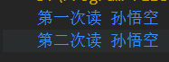

但是自定义的Promise是不能实现这个功能的

```js
const PROMISE_STATE = {
    PENDING: 0,
    FULFILLED: 1,
    REJECTED: 1
}

class MyPromise {
    // 创建一个变量来存储Promise的结果
    #result
    // 创建一个变量来记录Promsie的状态
    #state = PROMISE_STATE.PENDING //pending:0  fulfilled:1 rejected:2

    // 创建一个变量来存储回调函数
    #callback

    // 定义一个构造函数
    constructor(executor) {
        // 接收一个 执行器 作为参数
        executor(this.#resolve.bind(this), this.#reject.bind(this)) //调用回调函数
    }
    //私有的resolve()：用来存储成功的数据
    #resolve(value) {
        // 静止值被重复修改
        // 如果state不等于0，说明值已经被修改
        if (this.#state !== PROMISE_STATE.PENDING) return
        this.#result = value
        this.#state = PROMISE_STATE.FULFILLED //表示数据填充成功

        // 当resolve执行时，说明数据已经进来了，需要调用then的回调函数
        queueMicrotask(() => {
            this.#callback && this.#callback(this.#result)
        })
    }

    //私有的reject()：用来存储拒绝的数据
    #reject(reason) {

    }
    // 添加一个用来读取数据的then方法
    then(onFulfilled, onRejected) {
        // onFulfilled：用来数据加载成功以后返回数据
        // onRejected：用来数据加载失败以后返回数据

        if (this.#state == PROMISE_STATE.PENDING) {
            // 进入判断说明数据还没有进入Promise,将回调函数设置为callback的值
            this.#callback = onFulfilled
        } else if (this.#state === PROMISE_STATE.FULFILLED) {
            // then的回调函数，应该是放在微任务队列中执行，而不是直接调用
            queueMicrotask(() => {
                onFulfilled(this.#result)
            })

        }
    }
}

const mp = new MyPromise((resolve, reject) => {
    setTimeout(() => {
        resolve("孙悟空")
    }, 1000)
    // resolve("孙悟空")

})
mp.then((result) => {
    console.log("第一次通过then读取数据:", result);
})
mp.then((result) => {
    console.log("第二次通过then读取数据:", result);
})
```

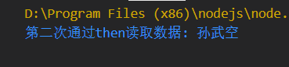

不能读取两次的原因是：

当我们调用then时，函数会传到onFulfilled中，然后会直接赋值设置为#callback，第一次调用时，将函数赋值给了callback，当第二次调用时，又将函数赋值给了callback，后面的覆盖了前面的，同一时刻，可能会有多个函数，我们可以将callback设置数组

```js
const PROMISE_STATE = {
    PENDING: 0,
    FULFILLED: 1,
    REJECTED: 1
}

class MyPromise {
    // 创建一个变量来存储Promise的结果
    #result
    // 创建一个变量来记录Promsie的状态
    #state = PROMISE_STATE.PENDING //pending:0  fulfilled:1 rejected:2

    // 创建一个变量来存储回调函数
    // 由于回调函数可能有多个，所以我们使用数组来存储回调函数
    #callbacks = []

    // 定义一个构造函数
    constructor(executor) {
        // 接收一个 执行器 作为参数
        executor(this.#resolve.bind(this), this.#reject.bind(this)) //调用回调函数
    }
    //私有的resolve()：用来存储成功的数据
    #resolve(value) {
        // 静止值被重复修改
        // 如果state不等于0，说明值已经被修改
        if (this.#state !== PROMISE_STATE.PENDING) return
        this.#result = value
        this.#state = PROMISE_STATE.FULFILLED //表示数据填充成功

        // 当resolve执行时，说明数据已经进来了，需要调用then的回调函数
        queueMicrotask(() => {
            // 调用callbacks中的所有函数
            // 便利然后调用函数
            this.#callbacks.forEach(cb => {
                cb()
            })
        })
    }

    //私有的reject()：用来存储拒绝的数据
    #reject(reason) {

    }
    // 添加一个用来读取数据的then方法
    then(onFulfilled, onRejected) {
        // onFulfilled：用来数据加载成功以后返回数据
        // onRejected：用来数据加载失败以后返回数据

        if (this.#state == PROMISE_STATE.PENDING) {
            // 进入判断说明数据还没有进入Promise,将回调函数设置为callback的值
            // this.#callback = onFulfilled
            this.#callbacks.push(()=>{
                onFulfilled(this.#result)
            })
        } else if (this.#state === PROMISE_STATE.FULFILLED) {
            // then的回调函数，应该是放在微任务队列中执行，而不是直接调用
            queueMicrotask(() => {
                onFulfilled(this.#result)
            })

        }
    }
}

const mp = new MyPromise((resolve, reject) => {
    setTimeout(() => {
        resolve("孙悟空")
    }, 1000)
    // resolve("孙武空")

})
mp.then((result) => {
    console.log("第一次通过then读取数据:", result);
})
mp.then((result) => {
    console.log("第二次通过then读取数据:", result);
})
/*
输出：
第一次通过then读取数据: 孙武空
第二次通过then读取数据: 孙武空
*/
```

#### 13.9.5 Promise链式调用

Promise链式调用：Promise对象的then方法回返回一个全新的Promise对象

```js
const PROMISE_STATE = {
    PENDING: 0,
    FULFILLED: 1,
    REJECTED: 1
}

class MyPromise {
    // 创建一个变量来存储Promise的结果
    #result
    // 创建一个变量来记录Promsie的状态
    #state = PROMISE_STATE.PENDING //pending:0  fulfilled:1 rejected:2

    // 创建一个变量来存储回调函数
    // 由于回调函数可能有多个，所以我们使用数组来存储回调函数
    #callbacks = []

    // 定义一个构造函数
    constructor(executor) {
        // 接收一个 执行器 作为参数
        executor(this.#resolve.bind(this), this.#reject.bind(this)) //调用回调函数
    }
    //私有的resolve()：用来存储成功的数据
    #resolve(value) {
        // 静止值被重复修改
        // 如果state不等于0，说明值已经被修改
        if (this.#state !== PROMISE_STATE.PENDING) return
        this.#result = value
        this.#state = PROMISE_STATE.FULFILLED //表示数据填充成功

        // 当resolve执行时，说明数据已经进来了，需要调用then的回调函数
        queueMicrotask(() => {
            // 调用callbacks中的所有函数
            // 便利然后调用函数
            this.#callbacks.forEach(cb => {
                cb()
            })
        })
    }

    //私有的reject()：用来存储拒绝的数据
    #reject(reason) {

    }
    // 添加一个用来读取数据的then方法
    then(onFulfilled, onRejected) {
        // onFulfilled：用来数据加载成功以后返回数据
        // onRejected：用来数据加载失败以后返回数据

        if (this.#state == PROMISE_STATE.PENDING) {
            // 进入判断说明数据还没有进入Promise,将回调函数设置为callback的值
            // this.#callback = onFulfilled
            this.#callbacks.push(() => {
                onFulfilled(this.#result)
            })
        } else if (this.#state === PROMISE_STATE.FULFILLED) {
            // then的回调函数，应该是放在微任务队列中执行，而不是直接调用
            queueMicrotask(() => {
                onFulfilled(this.#result)
            })

        }
    }
}

const mp = new MyPromise((resolve, reject) => {
    setTimeout(() => {
        resolve("孙悟空")
    }, 1000)
    // resolve("孙武空")

})
let result = mp.then((result) => {
    console.log("第一次通过then读取数据:", result);
})
console.log(result);
/*
输出：
undefined
第一次通过then读取数据: 孙悟空
*/
```

我们要then支持链式调用：then返回的是一个Promise

```js
const PROMISE_STATE = {
    PENDING: 0,
    FULFILLED: 1,
    REJECTED: 1
}

class MyPromise {
    // 创建一个变量来存储Promise的结果
    #result
    // 创建一个变量来记录Promsie的状态
    #state = PROMISE_STATE.PENDING //pending:0  fulfilled:1 rejected:2

    // 创建一个变量来存储回调函数
    // 由于回调函数可能有多个，所以我们使用数组来存储回调函数
    #callbacks = []

    // 定义一个构造函数
    constructor(executor) {
        // 接收一个 执行器 作为参数
        executor(this.#resolve.bind(this), this.#reject.bind(this)) //调用回调函数
    }
    //私有的resolve()：用来存储成功的数据
    #resolve(value) {
        // 静止值被重复修改
        // 如果state不等于0，说明值已经被修改
        if (this.#state !== PROMISE_STATE.PENDING) return
        this.#result = value
        this.#state = PROMISE_STATE.FULFILLED //表示数据填充成功

        // 当resolve执行时，说明数据已经进来了，需要调用then的回调函数
        queueMicrotask(() => {
            // 调用callbacks中的所有函数
            // 便利然后调用函数
            this.#callbacks.forEach(cb => {
                cb()
            })
        })
    }

    //私有的reject()：用来存储拒绝的数据
    #reject(reason) {

    }
    // 添加一个用来读取数据的then方法
    then(onFulfilled, onRejected) {
        // onFulfilled：用来数据加载成功以后返回数据
        // onRejected：用来数据加载失败以后返回数据
        return new MyPromise((resolve, reject) => {
            if (this.#state == PROMISE_STATE.PENDING) {
                // 进入判断说明数据还没有进入Promise,将回调函数设置为callback的值
                // this.#callback = onFulfilled
                this.#callbacks.push(() => {
                    onFulfilled(this.#result)
                })
            } else if (this.#state === PROMISE_STATE.FULFILLED) {
                // then的回调函数，应该是放在微任务队列中执行，而不是直接调用
                queueMicrotask(() => {
                    onFulfilled(this.#result)
                })
            }
        })
    }
}

const mp = new MyPromise((resolve, reject) => {
    setTimeout(() => {
        resolve("孙悟空")
    }, 1000)
    // resolve("孙武空")

})
let result = mp.then((result) => {
    console.log("第一次通过then读取数据:", result);
})
console.log(result);
```

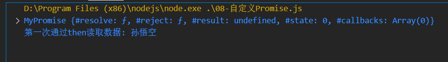

但是#state总是0，Promise里面也没有数据，所以我们要通过resolve和reject给Promise注入数据

谁将成为then返回的新Promise的数据？？   then中回调函数的返回值会成为新的Promise的数据

```js
const PROMISE_STATE = {
    PENDING: 0,
    FULFILLED: 1,
    REJECTED: 1
}

class MyPromise {
    // 创建一个变量来存储Promise的结果
    #result
    // 创建一个变量来记录Promsie的状态
    #state = PROMISE_STATE.PENDING //pending:0  fulfilled:1 rejected:2

    // 创建一个变量来存储回调函数
    // 由于回调函数可能有多个，所以我们使用数组来存储回调函数
    #callbacks = []

    // 定义一个构造函数
    constructor(executor) {
        // 接收一个 执行器 作为参数
        executor(this.#resolve.bind(this), this.#reject.bind(this)) //调用回调函数
    }
    //私有的resolve()：用来存储成功的数据
    #resolve(value) {
        // 静止值被重复修改
        // 如果state不等于0，说明值已经被修改
        if (this.#state !== PROMISE_STATE.PENDING) return
        this.#result = value
        this.#state = PROMISE_STATE.FULFILLED //表示数据填充成功

        // 当resolve执行时，说明数据已经进来了，需要调用then的回调函数
        queueMicrotask(() => {
            // 调用callbacks中的所有函数
            // 便利然后调用函数
            this.#callbacks.forEach(cb => {
                cb()
            })
        })
    }

    //私有的reject()：用来存储拒绝的数据
    #reject(reason) {

    }
    // 添加一个用来读取数据的then方法
    then(onFulfilled, onRejected) {
        // onFulfilled：用来数据加载成功以后返回数据
        // onRejected：用来数据加载失败以后返回数据
        return new MyPromise((resolve, reject) => {
            if (this.#state == PROMISE_STATE.PENDING) {
                // 进入判断说明数据还没有进入Promise,将回调函数设置为callback的值
                // this.#callback = onFulfilled
                this.#callbacks.push(() => {
                    // 将回调函数的返回值作为resolve参数传给新的Promise
                    resolve(onFulfilled(this.#result))
                })
            } else if (this.#state === PROMISE_STATE.FULFILLED) {
                // then的回调函数，应该是放在微任务队列中执行，而不是直接调用
                queueMicrotask(() => {
                    resolve(onFulfilled(this.#result))
                })
            }
        })
    }
}

const mp = new MyPromise((resolve, reject) => {
    setTimeout(() => {
        resolve("孙悟空")
    }, 1000)
})
mp.then((result) => {
    console.log("第一次读取数据:", result);
    return "猪八戒"
}).then(result=>{
    console.log("第二次读取数据:",result);
    return "沙和尚"
}).then(result=>{
    console.log("第二次读取数据:",result);
})

/*
输出：
第一次读取数据: 孙悟空
第二次读取数据: 猪八戒
第二次读取数据: 沙和尚
*/
```

## 14 Set

ES6 提供了新的数据结构 Set（集合）。它类似于数组，但成员的值都是唯一的，集合实现了 iterator 接口，所以可以使用『扩展运算符』和『for…of…』进行遍历，集合的属性和方法：

1) size 返回集合的元素个数 
2) add 增加一个新元素，返回当前集合
3) delete 删除元素，返回 boolean 值 
4) has 检测集合中是否包含某个元素，返回 boolean 值 
5) clear 清空集合，返回 undefined

### 14.1 Set数据结构

Set数据结构类似于数组，但是与数组不同的是，Set中的成员都是唯一的、无序的、并且没有重复

### 14.2 Set实例的属性和方法

#### 14.2.1 set.size( )

set.size( ) ：获取set数据结构的值的个数

```js
const set = new Set([1,2,3,4]);
console.log(set.size);// 4
```

#### 14.2.2 set.add( )

set.add( ) 向set数据结构中添加某个值 返回数据结构本身

```js
const set = new Set([1,2,3,4]);
console.log(set.add(5));// Set(5) {1, 2, 3, 4, 5}
```

#### 14.2.3 set.delete( ) 

set.delete( ) 删除set数据结构中的某个值（包括重复值） 返回一个布尔值表示是否删除成功

```js
const set = new Set([1,2,3,4,5,5]);
console.log(set.delete(5));// true
console.log(set);//{1, 2, 3, 4}
console.log(set.delete(5));// false
```

#### 14.2.4 set.has( )

set.has( ) 表示该参数是否是set的成员 返回一个布尔值

```js
const set = new Set([1,2,3,4,5]);
console.log(set.has(5));//true
console.log(set.has(6));//false
```

#### 14.2.5 set.clear( )

set.clear( ) 清除所有set数据结构成员 没有返回值

```js
 const set = new Set([1,2,3,4,5]);
 set.clear()
 console.log(set);//Set(0) {}
```

### 14.3 Set数据结构的遍历

#### 14.3.1 keys( ) 

keys( ) ：返回键名

```js
const set = new Set([1,2,3,4,5]);
for(let item of set.keys()) {
    console.log(item);
}// 1 2 3 4 5
```

#### 14.3.2 values( )

values( ) ：返回键值

```js
const set = new Set([1,2,3,4,5]);
for(let item of set.values()) {
    console.log(item);
}//1 2 3 4 5
```

#### 14.3.3 entries( )

entries( ) ：返回键值对

```js
const set = new Set([1,2,3,4,5]);
for(let item of set.entries()) {
    console.log(item);
}
//(2) [1, 1]
//(2) [2, 2]
//(2) [3, 3]
//(2) [4, 4]
```

#### 14.3.4 forEach( value,key ) 

forEach( value,key ) ：遍历每个成员，可以直接操作Set数据结构成员

```js
const set = new Set([1,2,3,4,5]);
set.forEach(function(value,key) {
   console.log( item * 2);
})
```

### 14.4 Set数据结构的特点

Set函数可以接收一个数组作为参数来初始化，返回一个set数据结构

```js
const set = new Set(['a','b','c','c']);
console.log(set); //Set(3) {"a", "b", "c"} 
```

Set成员的唯一性，在Set数据结构中每个成员都是唯一的，而且向Set加入值时不会发生类型转换，1和‘1’是两个不同的值，但是向Set中添加两个NaN时，我们都应该知道 默认情况下NaN !==NaN，但是在Set数据结构中只能添加一个NaN，也就是说在Set数据结构中两个NaN被默认认为相等了，但是向Set数据结构中添加两个空对象则总是不想等的；

```js
//1 
const set = new Set(['a','b','c','c']);
    set.add(NaN);
    set.add(NaN);
    console.log(set);//Set(4) {"a", "b", "c", NaN}

//2
const set = new Set(['a','b','c','c']);
    set.add({});
    set.add({});
    console.log(set);//Set(5) {"a", "b", "c", {…}, {…}}
//3
const set = new Set(['a','b','c','c']);
    set.add(1);
    set.add('1');
    console.log(set);//Set(5) {"a", "b", "c", 1, "1"}
```

### 14.5 将Set数据结构转换成数组

#### 14.4.1 Array.from( set ) 

Array.from( set ) 使用Array构造函数的静态方法

```js
const set = new Set([1,2,3,4,5]);
console.log(set);//Set(5) {1, 2, 3, 4, 5}
console.log(Array.from(set));//(5) [1, 2, 3, 4, 5]
```

#### 14.4.2 扩展运算符(…)

```js
const set = new Set([1,2,3,4,5]);
console.log(set);//Set(5) {1, 2, 3, 4, 5}
console.log([...set]);//(5) [1, 2, 3, 4, 5]
```

### 14.6 应用

#### 14.6.1 数组去重

```js
let arr = [1,2,3,4,5,5,3,2,3,1];
const set = new Set(arr);
console.log([...set]);//5) [1, 2, 3, 4, 5]
```

#### 14.6.2 求交集

```js
let arr1 = [1, 3, 4, 6, 8, 9, 9]
let arr2 = [2, 3, 4, 6, 7, 8, 9]
let result = [...new Set(arr1)].filter(item =>{
    let arr3 = new Set(arr2)
    if(arr3.has(item)){
        return true
    }else{
        return false
    }
})
console.log(result);// [3, 4, 6, 8, 9]
```

简化：

```js
let arr1 = [1, 3, 4, 6, 8, 9, 9]
let arr2 = [2, 3, 4, 6, 7, 8, 9]
let result = [...new Set(arr1)].filter(item => new Set(arr2).has(item))
console.log(result);// [3, 4, 6, 8, 9]
```

#### 14.6.3 求并集

```js
let arr1 = [1, 3, 4, 6, 8, 9, 9]
let arr2 = [2, 3, 4, 6, 7, 8, 9]
let result = [...new Set([...arr1,...arr2])]
console.log(result);//[1, 3, 4, 6, 8, 9, 2, 7]
```

#### 14.6.4 求差集

差集：数组arr1对arr2求差集

```js
let arr1 = [1, 3, 4, 6, 8, 9, 9]
let arr2 = [2, 3, 4, 6, 7, 8, 9]
let result = [...new Set(arr1)].filter(item => {
    let arr3 = new Set(arr2)
    if (!arr3.has(item)) {
        return true
    } else {
        return false
    }
})
console.log(result);//1
```

简化：

```js
let arr1 = [1, 3, 4, 6, 8, 9, 9]
let arr2 = [2, 3, 4, 6, 7, 8, 9]
let result = [...new Set(arr1)].filter(item => !new Set(arr2).has(item))
console.log(result);//1
```

## 15 Map

### 15.1 基本概念

ES6 提供了 Map 数据结构。它类似于对象，也是键值对的集合，但是“键”的范围不限于字符串，各种类型的值（包括对象）都可以当作键。也就是说，Object 结构提供了“字符串—值”的对应，Map 结构提供了“值—值”的对应，是一种更完善的 Hash 结构实现。如果你需要“键值对”的数据结构，Map 比 Object 更合适。

### 15.2 特征	

- Map 对象保存键值对，并且能够记住键的原始插入顺序。
- 任何值(对象或者原始值) 都可以作为一个键或一个值。
- Map 是 ES6 中引入的一种新的数据结构，可以参考[3.1.1 ES6 Map 与 Set | 菜鸟教程 (runoob.com)](https://www.runoob.com/w3cnote/es6-map-set.html)

### 15.3 Maps 和 Objects 的区别

- 一个 Object 的键只能是字符串或者 Symbols，但一个 Map 的键可以是任意值。
- Map 中的键值是有序的（FIFO 原则），而添加到对象中的键则不是。
- 关于对象是无序的官方解释： 
    - 1.An object is a member of the type Object. It is an unordered collection of properties each of which contains a primitive value, object, or function. A function stored in a property of an object is called a method. 
    - 2.Chrome Opera 的 JavaScript 解析引擎遵循的是新版 ECMA-262 第五版规范。因此，使用 for-in 语句遍历对象属性时遍历书序并非属性构建顺序。而 IE6 IE7 IE8 Firefox Safari 的 JavaScript 解析引擎遵循的是较老的 ECMA-262 第三版规范，属性遍历顺序由属性构建的顺序决定。
- Map 的键值对个数可以从 size 属性获取，而 Object 的键值对个数只能手动计算。
- Object 都有自己的原型，原型链上的键名有可能和你自己在对象上的设置的键名产生冲突。

15.4 Map属性和方法

#### 15.4.1 Map属性

- `Map.prototype.size` – 返回 Map 对象键/值对的数量。

#### 15.4.2 Map操作方法

- `Map.prototype.clear()` – 移除 Map 对象的所有键/值对 。
- `Map.prototype.set()` – 设置键值对，返回该 Map 对象。
- `Map.prototype.get()` – 返回键对应的值，如果不存在，则返回 undefined。
- `Map.prototype.has()` – 返回一个布尔值，用于判断 Map 中是否包含键对应的值。
- `Map.prototype.delete()` – 删除 Map 中的元素，删除成功返回 true，失败返回 false。

#### 15.4.3 Map循环方法

Map 的遍历顺序就是插入顺序。

- `Map.prototype.keys()`：返回键名的遍历器。
- `Map.prototype.values()`：返回键值的遍历器。
- `Map.prototype.entries()`：返回所有成员的遍历器。
- `Map.prototype.forEach()`：遍历 Map 的所有成员。

#### 15.4.4 其他方法

- `for of` 由于有iterable 所以也可以使用此方法

### 15.4 创建

使用 Map 类型和 new 关键字来创建 Map

不仅仅是数组，任何具有 Iterator 接口、且每个成员都是一个双元素的数组的数据结构 所以 Set Map 数组都可以创建 Map

#### 15.4.1 创建空map再添加

```js
let map1 = new Map();
map1.set('123',123)
console.log(map1);// {'123' => 123}
```

#### 15.4.2 数组创建Map

```js
const m2 = new Map([['baz', 3]]);
console.log(map2);// {'baz' => 3}
```

#### 15.4.3 set 创建Map

```js
const set = new Set([
  ['foo', 1],
  ['bar', 2]
]);

const map3 = new Map(set);
console.log(map3);//{'foo' => 1, 'bar' => 2}
```

#### 15.4.4 map 创建新的map

注意 map4 === map2 //false

```js
const map4 = new Map(map2);
console.log(map4);//{'baz' => 3}
map4.set('baz', 456)
console.log(map4);//{'baz' => 456}
console.log(map4 === map2);//false
```

### 15.5 多类型的key

#### 15.5.1 字符串

```js
var myMap1 = new Map();
var keyString = "a string";
myMap1.set(keyString, "和键'a string'关联的值");
console.log(myMap1);//{'a string' => "和键'a string'关联的值"}
```

#### 15.5.2 对象

```js
var myMap2 = new Map();
var keyObj = {}
myMap2.set(keyObj, "和键 keyObj 关联的值");
console.log(myMap2);//{ {…} => '和键 keyObj 关联的值' }
```

#### 15.5.3 函数

```js
var myMap3 = new Map();
var keyFunc = function () { } // 函数 
myMap3.set(keyFunc, "和键 keyFunc 关联的值");
console.log(myMap3);// {ƒ => '和键 keyFunc 关联的值'}
```

#### 19.5.4 NaN

```js
var myMap4 = new Map(); 
myMap4.set(NaN, "not a number");    
console.log(myMap4);// {NaN => 'not a number'}
```

### 15.6 Map 遍历成员方法

**keys() ， values() ， entries() Map 的遍历顺序就是插入顺序**

```js
const map = new Map([
    ['F', 'no'],
    ['T', 'yes'],
]);

for (let key of map.keys()) {
    console.log(key);
}
// "F"
// "T"

for (let value of map.values()) {
    console.log(value);
}
// "no"
// "yes"

for (let item of map.entries()) {
    console.log(item[0], item[1]);
}
// "F" "no"
// "T" "yes"

// 或者
for (let [key, value] of map.entries()) {
    console.log(key, value);
}
// "F" "no"
// "T" "yes"

// 等同于使用map.entries()
for (let [key, value] of map) {
    console.log(key, value);
}
```

**使用扩展运算符可以快速转数组**

```js
const map = new Map([
    [1, 'one'],
    [2, 'two'],
    [3, 'three'],
]);

console.log([...map.keys()]);
// [1, 2, 3]

console.log([...map.values()]);
// ['one', 'two', 'three']

console.log([...map.entries()]);
// [[1,'one'], [2, 'two'], [3, 'three']]

console.log([...map]);
// [[1,'one'], [2, 'two'], [3, 'three']]
```

**转为数组后，可以使用数组的map，filter方法**

```js
const map0 = new Map()
    .set(1, 'a')
    .set(2, 'b')
    .set(3, 'c');

const map1 = new Map(
    [...map0].filter(([k, v]) => k < 3)
);
console.log(map1);
// 产生 Map 结构 {1 => 'a', 2 => 'b'}

const map2 = new Map(
    [...map0].map(([k, v]) => [k * 2, '_' + v])
);
console.log(map2);
// 产生 Map 结构 {2 => '_a', 4 => '_b', 6 => '_c'}
```

### 15.7 Map 增 删 查 清空

```js
const m = new Map();
const o = { p: 'Hello World' };

console.log(m.set(o, 'content'));
console.log(m.get(o));// "content"
console.log(m.has(o));// true
console.log(m.delete(o));// true
console.log(m.has(o));// false
console.log(m.clear());// undefined
```

### 15.8 与其他数据类型的相互转换

#### 15.8.1 Map <=> 数组

**Map => 数组：**

Map 转为数组最方便的方法，就是使用扩展运算符（`...`）。

```js
const myMap = new Map()
    .set(true, 7)
    .set({ foo: 3 }, ['abc']);
console.log([...myMap]) // [ [ true, 7 ], [ { foo: 3 }, [ 'abc' ] ] ]

```

Array.from()：将类数组对象转换为真正数组

```js
// Array.from将类数组对象转换为真正数组
var outArray = Array.from(myMap);
console.log(outArray); // [ [ true, 7 ], [ { foo: 3 }, [ 'abc' ] ] ]
```

**数组 => Map：**

将数组传入 Map 构造函数，就可以转为 Map。

```js
const map = new Map([
    [true, 7],
    [{ foo: 3 }, ['abc','123']]
])
console.log(map);
// Map {
//   true => 7,
//   Object {foo: 3} => ['abc','123']
// }
```

#### 15.8.2 Map <=> 对象

**Map => 对象：**

如果所有 Map 的键都是字符串，它可以无损地转为对象。

```js
function strMapToObj(strMap) {
    let obj = Object.create(null);
    for (let [k, v] of strMap) {
        obj[k] = v;
    }
    return obj;
}

const myMap = new Map()
    .set('yes', true)
    .set('no', false);

const map = strMapToObj(myMap)
console.log(map); // { yes: true, no: false }
```

如果有非字符串的键名，那么这个键名会被转成字符串，再作为对象的键名。

**对象 => Map：**

对象转为 Map 可以通过`Object.entries()`。

```js
let obj = {"a":1, "b":2};
let map = new Map(Object.entries(obj));
console.log(map)//{'a' => 1, 'b' => 2}
```

此外，也可以自己实现一个转换函数。

```js
function objToStrMap(obj) {
	let strMap = new Map();
	for (let k of Object.keys(obj)) {
		strMap.set(k, obj[k]);
	}
	return strMap;
}

const map = objToStrMap({yes: true, no: false})
console.log(map)// Map {"yes" => true, "no" => false}
```

#### 15.8.3 Map <=>  JSON

**Map =>  JSON：**

Map 转为 JSON 要区分两种情况。一种情况是，Map 的键名都是字符串，这时可以选择转为对象 JSON

```js
function strMapToObj(strMap) {
    let obj = Object.create(null);
    for (let [k, v] of strMap) {
        obj[k] = v;
    }
    return obj;
}

function strMapToJson(strMap) {
    return JSON.stringify(strMapToObj(strMap));
}

let myMap = new Map().set('yes', true).set('no', false);
const map = strMapToJson(myMap)
console.log(map);// '{"yes":true,"no":false}'
```

另一种情况是，Map 的键名有非字符串，这时可以选择转为数组 JSON。

```js
function mapToArrayJson(map) {
    return JSON.stringify([...map]);
}

let myMap = new Map()
    .set(true, 7)
    .set({ foo: 3 }, ['abc']);
const map = mapToArrayJson(myMap)
console.log(map);// '[[true,7],[{"foo":3},["abc"]]]'
```

**JSON =>  Map：**

JSON 转为 Map，正常情况下，所有键名都是字符串。

```js
function objToStrMap(obj) {
    let strMap = new Map();
    for (let k of Object.keys(obj)) {
        strMap.set(k, obj[k]);
    }
    return strMap;
}

function jsonToStrMap(jsonStr) {
    return objToStrMap(JSON.parse(jsonStr));
}

const map = jsonToStrMap('{"yes": true, "no": false}')
console.log(map);// {'yes' => true, 'no' => false}
```

但是，有一种特殊情况，整个 JSON 就是一个数组，且每个数组成员本身，又是一个有两个成员的数组。这时，它可以一一对应地转为 Map。这往往是 Map 转为数组 JSON 的逆操作。

```js
function jsonToMap(jsonStr) {
    return new Map(JSON.parse(jsonStr));
}

const map = jsonToMap('[[true,7],[{"foo":3},["abc"]]]')
console.log(map);// {true => 7, Object {foo: 3} => ['abc']}
```

### 15.9 数组的合并

```js
var first = new Map([[1, 'one'], [2, 'two'], [3, 'three'],]);
var second = new Map([[1, 'uno'], [2, 'dos']]); 
// 合并两个 Map 对象时，如果有重复的键值，则后面的会覆盖前面的，对应值即 uno，dos， three 
var merged = new Map([...first, ...second]);
console.log(merged);// {1 => 'uno', 2 => 'dos', 3 => 'three'}
```

### 15.10 数组的克隆

```js
var myMap1 = new Map([["key1", "value1"], ["key2", "value2"]]);
var myMap2 = new Map(myMap1);
console.log(original === clone); // false。 Map 对象构造函数生成实例，迭代出新的对象。
```

### 15.11 注意事项

注意，只有对同一个对象的引用，Map 结构才将其视为同一个键。这一点要非常小心。

```js
const map = new Map();

map.set(['a'], 555);
console.log(map.get(['a']));// undefined
```

```js
const map = new Map();

map.set('a', 555);
console.log(map.get('a'));// 555
```

虽然`NaN`不严格相等于自身，但 Map 将其视为同一个键。

```js
let map = new Map();
map.set(NaN, 123);
console.log(map.get(NaN));// 123
```

## 16 class

ES6提供了更接近传统语言的写法，引入了Class（类）这个概念，作为对象的模板，通过Class关键字，可以定义类。

基本上，ES6的Class可以看作是一个语法糖，它的绝大部分功能，ES5都可以做到，新的Class写法只是让对象的原型的写法更加清晰，更像面对对象编程的语法而已。

知识点：

1. class 声明类
2. constructor 定义构造函数初始化
3. extends 继承父类
4. super 调用父级构造方法
5. static 定义静态方法和属性
6. 父类方法可以重写

### 16.1 介绍

#### 16.1.1 类的由来

JavaScript 语言中，生成实例对象的传统方法是通过构造函数。下面是一个例子。

```js
function Point(x, y) {
    this.x = x;
    this.y = y;
}

Point.prototype.toString = function () {
    return this.x + '+' + this.y + '=' + (this.x + this.y);
};

var p = new Point(1, 2);
console.log(p.toString());//1+2=3
```

上面这种写法跟传统的面向对象语言（比如 C++ 和 Java）差异很大，很容易让新学习这门语言的程序员感到困惑。

ES6 提供了更接近传统语言的写法，引入了 `Class（类）`这个概念，作为对象的模板。通过`class`关键字，可以定义类。

基本上，ES6 的`class`可以看作只是一个语法糖，它的绝大部分功能，ES5 都可以做到，新的`class`写法只是让对象原型的写法更加清晰、更像面向对象编程的语法而已。上面的代码用 ES6 的`class`改写，就是下面这样。

```js
class Point {
    constructor(x, y) {
        this.x = x;
        this.y = y;
    }

    toString() {
        return this.x + '+' + this.y + '=' + (this.x + this.y);
    }
}
var p = new Point(1, 2)
console.log(p.toString());// 1+2=3
```

上面代码定义了一个“类”，可以看到里面有一个`constructor()`方法，这就是构造方法，而`this`关键字则代表实例对象。这种新的 Class 写法，本质上与本章开头的 ES5 的构造函数`Point`是一致的。

`Point`类除了构造方法，还定义了一个`toString()`方法。注意，定义`toString()`方法的时候，前面不需要加上`function`这个关键字，直接把函数定义放进去了就可以了。另外，方法与方法之间不需要逗号分隔，加了会报错。

ES6 的类，完全可以看作构造函数的另一种写法。

```js
class Point {
  // ...
}

console.log(typeof Point) // "function"
console.log(Point === Point.prototype.constructor) // true
```

上面代码表明，类的数据类型就是函数，类本身就指向构造函数。

使用的时候，也是直接对类使用`new`命令，跟构造函数的用法完全一致。

```js
class Bar {
  doStuff() {
    console.log('stuff');
  }
}

const b = new Bar();
console.log(b.doStuff()) // "stuff"
```

构造函数的`prototype`属性，在 ES6 的“类”上面继续存在。事实上，类的所有方法都定义在类的`prototype`属性上面。

```js
class Point {
  constructor() {
    // ...
  }

  toString() {
    // ...
  }

  toValue() {
    // ...
  }
}

// 约等同于
function Point(){}
Point.prototype = {
  constructor() {},
  toString() {},
  toValue() {},
};
```

上面代码中，`constructor()`、`toString()`、`toValue()`这三个方法，其实都是定义在`Point.prototype`上面。

因此，在类的实例上面调用方法，其实就是调用原型上的方法。差异在于由class产生的类，Point.prototype.constructor === Point，即指向本身。而function产生的，Point.prototype.constructor不等于Point，即仅为普通函数。

```js
class B {}
const b = new B();

b.constructor(即b.__proto__.constructor) === B.prototype.constructor // true
```

上面代码中，`b`是`B`类的实例，它的`constructor()`方法就是`B`类原型的`constructor()`方法。

由于类的方法都定义在`prototype`对象上面，所以类的新方法可以添加在`prototype`对象上面。`Object.assign()`方法可以很方便地一次向类添加多个方法。

```js
class Point {
  constructor(){
    // ...
  }
}

Object.assign(Point.prototype, {
  toString(){},
  toValue(){}
});
```

另外，类的内部所有定义的方法，都是不可枚举的（non-enumerable）。

```js
class Point {
  constructor(x, y) {
    // ...
  }

  toString() {
    // ...
  }
}

Object.keys(Point.prototype)
// []
Object.getOwnPropertyNames(Point.prototype)
// ["constructor","toString"]
```

上面代码中，`toString()`方法是`Point`类内部定义的方法，它是不可枚举的。这一点与 ES5 的行为不一致。

```js
var Point = function (x, y) {
  // ...
};

Point.prototype.toString = function () {
  // ...
};

Object.keys(Point.prototype)
// ["toString"]
Object.getOwnPropertyNames(Point.prototype)
// ["constructor","toString"]
```

上面代码采用 ES5 的写法，`toString()`方法就是可枚举的。

#### 16.1.2 constructor 方法

`constructor()`方法是类的默认方法，通过`new`命令生成对象实例时，自动调用该方法。一个类必须有`constructor()`方法，如果没有显式定义，一个空的`constructor()`方法会被默认添加。

```js
class Point {
}

// 等同于
class Point {
    constructor() {}
}
```

上面代码中，定义了一个空的类`Point`，JavaScript 引擎会自动为它添加一个空的`constructor()`方法。

`constructor()`方法默认返回实例对象（即`this`），完全可以指定返回另外一个对象。

```js
class Foo {
  constructor() {
    return Object.create(null);
  }
}

new Foo() instanceof Foo
// false
```

上面代码中，`constructor()`函数返回一个全新的对象，结果导致实例对象不是`Foo`类的实例。

类必须使用`new`调用，否则会报错。这是它跟普通构造函数的一个主要区别，后者不用`new`也可以执行。

```js
class Foo {
  constructor() {
    return Object.create(null);
  }
}

Foo()
// TypeError: Class constructor Foo cannot be invoked without 'new'
```

#### 16.1.3 类的实例

生成类的实例的写法，与 ES5 完全一样，也是使用`new`命令。前面说过，如果忘记加上`new`，像函数那样调用`Class`，将会报错。

```js
class Point {
  // ...
}

// 报错
var point = Point(2, 3);

// 正确
var point = new Point(2, 3);
```

与 ES5 一样，实例的属性除非显式定义在其本身（即定义在`this`对象上），否则都是定义在原型上。

```js
//定义类
class Point {

  constructor(x, y) {
    this.x = x;
    this.y = y;
  }

  toString() {
    return this.x + '+' + this.y + '=' + (this.x + this.y);
  }

}

var point = new Point(2, 3);

point.toString() // 2+3=5

point.hasOwnProperty('x') // true
point.hasOwnProperty('y') // true
point.hasOwnProperty('toString') // false
point.__proto__.hasOwnProperty('toString') // true
```

上面代码中，`x`和`y`都是实例对象`point`自身的属性（因为定义在`this`对象上），所以`hasOwnProperty()`方法返回`true`，而`toString()`是原型对象的属性，所以`hasOwnProperty()`方法返回`false`。这些都与 ES5 的行为保持一致。

与 ES5 一样，类的所有实例共享一个原型对象。

```js
var p1 = new Point(2,3);
var p2 = new Point(3,2);

p1.__proto__ === p2.__proto__
//true
```

上面代码中，`p1`和`p2`都是`Point`的实例，它们的原型都是`Point.prototype`，所以`__proto__`属性是相等的。

这也意味着，可以通过实例的`__proto__`属性为“类”添加方法。

> `__proto__` 并不是语言本身的特性，这是各大厂商具体实现时添加的私有属性，虽然目前很多现代浏览器的 JS 引擎中都提供了这个私有属性，但依旧不建议在生产中使用该属性，避免对环境产生依赖。生产环境中，我们可以使用 `Object.getPrototypeOf` 方法来获取实例对象的原型，然后再来为原型添加方法/属性。

```js
var p1 = new Point(2,3);
var p2 = new Point(3,2);

p1.__proto__.printName = function () { return 'Oops' };

p1.printName() // "Oops"
p2.printName() // "Oops"

var p3 = new Point(4,2);
p3.printName() // "Oops"
```

上面代码在`p1`的原型上添加了一个`printName()`方法，由于`p1`的原型就是`p2`的原型，因此`p2`也可以调用这个方法。而且，此后新建的实例`p3`也可以调用这个方法。这意味着，使用实例的`__proto__`属性改写原型，必须相当谨慎，不推荐使用，因为这会改变“类”的原始定义，影响到所有实例。

#### 16.1.4 getter和setter

取值函数（getter）和存值函数（setter）

与 ES5 一样，在“类”的内部可以使用`get`和`set`关键字，对某个属性设置存值函数和取值函数，拦截该属性的存取行为。

```js
class MyClass {
  constructor() {
    // ...
  }
  get prop() {
    return 'getter';
  }
  set prop(value) {
    console.log('setter: '+value);
  }
}

const inst = new MyClass();

inst.prop = 123;
// setter: 123

inst.prop
// 'getter'
```

上面代码中，`prop`属性有对应的存值函数和取值函数，因此赋值和读取行为都被自定义了。

存值函数和取值函数是设置在属性的 Descriptor 对象上的。

```js
class CustomHTMLElement {
  constructor(element) {
    this.element = element;
  }

  get html() {
    return this.element.innerHTML;
  }

  set html(value) {
    this.element.innerHTML = value;
  }
}

var descriptor = Object.getOwnPropertyDescriptor(
  CustomHTMLElement.prototype, "html"
);

"get" in descriptor  // true
"set" in descriptor  // true
```

上面代码中，存值函数和取值函数是定义在`html`属性的描述对象上面，这与 ES5 完全一致。

#### 16.1.4 属性表达式

类的属性名，可以采用表达式。

```js
let methodName = 'getArea';

class Square {
  constructor(length) {
    // ...
  }

  [methodName]() {
    // ...
  }
}
```

上面代码中，`Square`类的方法名`getArea`，是从表达式得到的。

#### 16.1.5 Class表达式

与函数一样，类也可以使用表达式的形式定义

```js
const MyClass = class Me {
    getClassName() {
        return Me.name;
    }
};
```

上面代码使用表达式定义了一个类。需要注意的是，这个类的名字是`Me`，但是`Me`只在 Class 的内部可用，指代当前类。在 Class 外部，这个类只能用`MyClass`引用。

```js
let inst = new MyClass();
inst.getClassName() // Me
Me.name // ReferenceError: Me is not defined
```

上面代码表示，`Me`只在 Class 内部有定义。

如果类的内部没用到的话，可以省略`Me`，也就是可以写成下面的形式。

```js
const MyClass = class { /* ... */ };
```

采用 Class 表达式，可以写出立即执行的 Class。

```js
let person = new class {
  constructor(name) {
    this.name = name;
  }

  sayName() {
    console.log(this.name);
  }
}('张三');

person.sayName(); // "张三"
```

上面代码中，`person`是一个立即执行的类的实例。

#### 16.1.6 注意点

**1. 严格模式**

类和模块的内部，默认就是严格模式，所以不需要使用`use strict`指定运行模式。只要你的代码写在类或模块之中，就只有严格模式可用。考虑到未来所有的代码，其实都是运行在模块之中，所以 ES6 实际上把整个语言升级到了严格模式。

**2. 不存在提升**

类不存在变量提升（hoist），这一点与 ES5 完全不同。

```js
new Foo(); // ReferenceError
class Foo {}
```

上面代码中，`Foo`类使用在前，定义在后，这样会报错，因为 ES6 不会把类的声明提升到代码头部。这种规定的原因与下文要提到的继承有关，必须保证子类在父类之后定义。

```js
{
	let Foo = class {};
	class Bar extends Foo {
  	}
}
```

上面的代码不会报错，因为`Bar`继承`Foo`的时候，`Foo`已经有定义了。但是，如果存在`class`的提升，上面代码就会报错，因为`class`会被提升到代码头部，而`let`命令是不提升的，所以导致`Bar`继承`Foo`的时候，`Foo`还没有定义。

**3. name 属性**

由于本质上，ES6 的类只是 ES5 的构造函数的一层包装，所以函数的许多特性都被`Class`继承，包括`name`属性。

```js
class Point {}
Point.name // "Point"
```

`name`属性总是返回紧跟在`class`关键字后面的类名。

**4. Generator 方法**

如果某个方法之前加上星号（`*`），就表示该方法是一个 Generator 函数。

```js
class Foo {
  constructor(...args) {
    this.args = args;
  }
  * [Symbol.iterator]() {
    for (let arg of this.args) {
      yield arg;
    }
  }
}

for (let x of new Foo('hello', 'world')) {
  console.log(x);
}
// hello
// world
```

上面代码中，`Foo`类的`Symbol.iterator`方法前有一个星号，表示该方法是一个 Generator 函数。`Symbol.iterator`方法返回一个`Foo`类的默认遍历器，`for...of`循环会自动调用这个遍历器。

**5. this 的指向**

类的方法内部如果含有`this`，它默认指向类的实例。但是，必须非常小心，一旦单独使用该方法，很可能报错。

```js
class Logger {
  printName(name = 'there') {
    this.print(`Hello ${name}`);
  }

  print(text) {
    console.log(text);
  }
}

const logger = new Logger();
const { printName } = logger;
printName(); // TypeError: Cannot read property 'print' of undefined
```

上面代码中，`printName`方法中的`this`，默认指向`Logger`类的实例。但是，如果将这个方法提取出来单独使用，`this`会指向该方法运行时所在的环境（由于 class 内部是严格模式，所以 this 实际指向的是`undefined`），从而导致找不到`print`方法而报错。

一个比较简单的解决方法是，在构造方法中绑定`this`，这样就不会找不到`print`方法了。

```js
class Logger {
  constructor() {
    this.printName = this.printName.bind(this);
  }

  // ...
}
```

另一种解决方法是使用箭头函数。

```js
class Obj {
  constructor() {
    this.getThis = () => this;
  }
}

const myObj = new Obj();
myObj.getThis() === myObj // true
```

箭头函数内部的`this`总是指向定义时所在的对象。上面代码中，箭头函数位于构造函数内部，它的定义生效的时候，是在构造函数执行的时候。这时，箭头函数所在的运行环境，肯定是实例对象，所以`this`会总是指向实例对象

还有一种解决方法是使用`Proxy`，获取方法的时候，自动绑定`this`。

```js
function selfish (target) {
  const cache = new WeakMap();
  const handler = {
    get (target, key) {
      const value = Reflect.get(target, key);
      if (typeof value !== 'function') {
        return value;
      }
      if (!cache.has(value)) {
        cache.set(value, value.bind(target));
      }
      return cache.get(value);
    }
  };
  const proxy = new Proxy(target, handler);
  return proxy;
}

const logger = selfish(new Logger());
```

### 16.2 静态方法

类相当于实例的原型，所有在类中定义的方法，都会被实例继承。如果在一个方法前，加上`static`关键字，就表示该方法**不会被实例继承**，而是直接通过类来调用，这就称为“静态方法”。

```js
class Foo {
  static classMethod() {
    return 'hello';
  }
}

Foo.classMethod() // 'hello'

const foo = new Foo();
foo.classMethod()
// TypeError: foo.classMethod is not a function
```

上面代码中，`Foo`类的`classMethod`方法前有`static`关键字，表明该方法是一个静态方法，可以直接在`Foo`类上调用（`Foo.classMethod()`），而不是在`Foo`类的实例上调用。如果在实例上调用静态方法，会抛出一个错误，表示不存在该方法。

注意，如果静态方法包含`this`关键字，这个`this`指的是类，而不是实例。

```js
class Foo {
  static bar() {
    this.baz();
  }
  static baz() {
    console.log('hello');
  }
  baz() {
    console.log('world');
  }
}

Foo.bar() // hello
```

上面代码中，静态方法`bar`调用了`this.baz`，这里的`this`指的是`Foo`类，而不是`Foo`的实例，等同于调用`Foo.baz`。另外，从这个例子还可以看出，静态方法可以与非静态方法重名。

父类的静态方法，可以被子类继承。

```js
class Foo {
  static classMethod() {
    return 'hello';
  }
}

class Bar extends Foo {
}

Bar.classMethod() // 'hello'
```

静态方法也是可以从`super`对象上调用的。

```js
class Foo {
  static classMethod() {
    return 'hello';
  }
}

class Bar extends Foo {
  static classMethod() {
    return super.classMethod() + ', too';
  }
}

Bar.classMethod() // "hello, too"
```

### 16.3 实例属性的新写法

实例属性除了定义在`constructor()`方法里面的`this`上面，也可以定义在类的最顶层。

```js
class IncreasingCounter {
  constructor() {
    this._count = 0;
  }
  get value() {
    console.log('Getting the current value!');
    return this._count;
  }
  increment() {
    this._count++;
  }
}
```

上面代码中，实例属性`this._count`定义在`constructor()`方法里面。另一种写法是，这个属性也可以定义在类的最顶层，其他都不变。

```js
class IncreasingCounter {
  _count = 0;
  get value() {
    console.log('Getting the current value!');
    return this._count;
  }
  increment() {
    this._count++;
  }
}
```

上面代码中，实例属性`_count`与取值函数`value()`和`increment()`方法，处于同一个层级。这时，不需要在实例属性前面加上`this`。

这种新写法的好处是，所有实例对象自身的属性都定义在类的头部，看上去比较整齐，一眼就能看出这个类有哪些实例属性。

```js
class foo {
  bar = 'hello';
  baz = 'world';

  constructor() {
    // ...
  }
}
```

上面的代码，一眼就能看出，`foo`类有两个实例属性，一目了然。另外，写起来也比较简洁。

### 16.4 静态属性

静态属性指的是 Class 本身的属性，即`Class.propName`，而不是定义在实例对象（`this`）上的属性。

```js
class Foo {
}

Foo.prop = 1;
Foo.prop // 1
```

上面的写法为`Foo`类定义了一个静态属性`prop`。

目前，只有这种写法可行，因为 ES6 明确规定，Class 内部只有静态方法，没有静态属性。现在有一个[提案]提供了类的静态属性，写法是在实例属性的前面，加上`static`关键字。

```js
class MyClass {
  static myStaticProp = 42;

  constructor() {
    console.log(MyClass.myStaticProp); // 42
  }
}
```

这个新写法大大方便了静态属性的表达。

```js
// 老写法
class Foo {
  // ...
}
Foo.prop = 1;

// 新写法
class Foo {
  static prop = 1;
}
```

上面代码中，老写法的静态属性定义在类的外部。整个类生成以后，再生成静态属性。这样让人很容易忽略这个静态属性，也不符合相关代码应该放在一起的代码组织原则。另外，新写法是显式声明（declarative），而不是赋值处理，语义更好。

### 16.5 私有方法和私有属性

#### 16.5.1 现有的解决方案

私有方法和私有属性，是只能在类的内部访问的方法和属性，外部不能访问。这是常见需求，有利于代码的封装，但 ES6 不提供，只能通过变通方法模拟实现。

一种做法是在命名上加以区别。

```js
class Widget {

  // 公有方法
  foo (baz) {
    this._bar(baz);
  }

  // 私有方法
  _bar(baz) {
    return this.snaf = baz;
  }

  // ...
}
```

上面代码中，`_bar()`方法前面的下划线，表示这是一个只限于内部使用的私有方法。但是，这种命名是不保险的，在类的外部，还是可以调用到这个方法。

另一种方法就是索性将私有方法移出类，因为类内部的所有方法都是对外可见的。

```js
class Widget {
  foo (baz) {
    bar.call(this, baz);
  }

  // ...
}

function bar(baz) {
  return this.snaf = baz;
}
```

上面代码中，`foo`是公开方法，内部调用了`bar.call(this, baz)`。这使得`bar()`实际上成为了当前类的私有方法。

还有一种方法是利用`Symbol`值的唯一性，将私有方法的名字命名为一个`Symbol`值。

```js
const bar = Symbol('bar');
const snaf = Symbol('snaf');

class myClass{

  // 公有方法
  foo(baz) {
    this[bar](baz);
  }

  // 私有方法
  [bar](baz) {
    return this[snaf] = baz;
  }

  // ...
};
```

上面代码中，`bar`和`snaf`都是`Symbol`值，一般情况下无法获取到它们，因此达到了私有方法和私有属性的效果。但是也不是绝对不行，`Reflect.ownKeys()`依然可以拿到它们，并进行使用。

```js
const inst = new myClass();

const prototypeFuns = Reflect.ownKeys(myClass.prototype) 
// [ 'constructor', 'foo', Symbol(bar) ]

inst[prototypeFuns[2]]('myName') // 'myName'
```

上面代码中，Symbol 值的属性名依然可以从类的外部拿到。

#### 16.5.2 私有属性的提案

目前，有一个[提案]，为`class`加了私有属性。方法是在属性名之前，使用`#`表示。同时，私有属性必须在类中先声明。

```js
class IncreasingCounter {
  #count = 0;
  get value() {
    console.log('Getting the current value!');
    return this.#count;
  }
  increment() {
    this.#count++;
  }
}
```

上面代码中，`#count`就是私有属性，只能在类的内部使用（`this.#count`）。如果在类的外部使用，就会报错。

```js
const counter = new IncreasingCounter();
counter.#count // 报错
counter.#count = 42 // 报错
```

上面代码在类的外部，读取私有属性，就会报错。

下面是另一个例子。

```js
class Point {
  #x = 0;

  constructor(x = 0) {
    this.#x += x;
  }

  get x() {
    return this.#x;
  }

  set x(value) {
    this.#x += value;
  }
}
```

上面代码中，`#x`就是私有属性，在`Point`类之外是读取不到这个属性的。由于井号`#`是属性名的一部分，使用时必须带有`#`一起使用，所以`#x`和`x`是两个不同的属性。

之所以要引入一个新的前缀`#`表示私有属性，而没有采用`private`关键字，是因为 JavaScript 是一门动态语言，没有类型声明，使用独立的符号似乎是唯一的比较方便可靠的方法，能够准确地区分一种属性是否为私有属性。另外，Ruby 语言使用`@`表示私有属性，ES6 没有用这个符号而使用`#`，是因为`@`已经被留给了 Decorator。

这种写法不仅可以写私有属性，还可以用来写私有方法。

```js
class Foo {
  #a;
  #b;
  constructor(a, b) {
    this.#a = a;
    this.#b = b;
  }
  #sum() {
    return this.#a + this.#b;
  }
  printSum() {
    console.log(this.#sum());
  }
}
```

上面代码中，`#sum()`就是一个私有方法。

另外，私有属性也可以设置 getter 和 setter 方法。

```js
class Counter {
  #xValue = 0;
  get #x() { return this.#xValue; }
  set #x(value) {
    this.#xValue = value;
  }
  getX() {
  	return this.#x
  }
  setX(value) {
	this.#x = value
  }
}

const newCou = new Counter()
newCou.getX() // 0
newCou.setX(25)
newCou.getX() // 25
```

上面代码中，`#x`是一个私有属性，它的读写都通过`get #x()`和`set #x()`来完成。

私有属性不限于从`this`引用，只要是在类的内部，实例也可以引用私有属性。

```js
class Foo {
  #privateValue = 42;
  static getPrivateValue(foo) {
    return foo.#privateValue;
  }
}

Foo.getPrivateValue(new Foo()); // 42
```

上面代码允许从实例上面引用私有属性。

私有属性和私有方法前面，也可以加上`static`关键字，表示这是一个静态的私有属性或私有方法。

```js
class FakeMath {
  static PI = 22 / 7;
  static #totallyRandomNumber = 4;

  static #computeRandomNumber() {
    return FakeMath.#totallyRandomNumber;
  }

  static random() {
    console.log('I heard you like random numbers…')
    return FakeMath.#computeRandomNumber();
  }
}

FakeMath.PI // 3.142857142857143
FakeMath.random()
// I heard you like random numbers…
// 4
FakeMath.#totallyRandomNumber // 报错
FakeMath.#computeRandomNumber() // 报错
```

上面代码中，`#totallyRandomNumber`是私有属性，`#computeRandomNumber()`是私有方法，只能在`FakeMath`这个类的内部调用，外部调用就会报错。

### 16.6 in 运算符

`try...catch`结构可以用来判断是否存在某个私有属性。

```js
class A {
  #foo
  use(obj) {
    try {
      obj.#foo;
    } catch(err) {
      // 私有属性 #foo 不存在
      console.error(err)
    }
  }
}

const a = new A();
a.use(a); 
a.use({}); // 报错
```

上面示例中，空对象`{}`并不存在私有属性`#foo`，所以`try...catch`报错了。

这样的写法很麻烦，可读性很差，V8 引擎改进了`in`运算符，使它也可以用来判断私有属性。

```js
class A {
  #foo
  use(obj) {
    if (#foo in obj) {
      console.log('私有属性 #foo 存在')
    } else {
      console.log('私有属性 #foo 不存在')
    }
  }
}

const newA = new A()
newA.use(newA) // 私有属性 #foo 存在
newA.use({}) // 私有属性 #foo 不存在
```

上面示例中，`in`运算符判断当前类`A`的实例，是否有私有属性`#foo`。

`in`也可以跟`this`一起配合使用。

```js
class A {
  #foo
  #bar
  m() {
    console.log(#foo in this); // true
    console.log(#bar in this); // true
  }
}
```

注意，判断私有属性时，`in`只能用在定义该私有属性的类的内部。

```js
class A {
  #foo = 0;
  static test(obj) {
    console.log(#foo in obj);
  }
}

A.test(new A()) // true
A.test({}) // false

class B {
  #foo = 0;
}

A.test(new B()) // false
```

上面示例中，类`A`的私有属性`#foo`，只能在类`A`内部使用`in`运算符判断，而且只对`A`的实例返回`true`，对于其他对象都返回`false`。

子类从父类继承的私有属性，也可以使用`in`运算符来判断。

```js
class A {
  #foo = 0;
  static test(obj) {
    console.log(#foo in obj);
  }
}

class SubA extends A {};

A.test(new SubA()) // true
```

上面示例中，`SubA`从父类继承了私有属性`#foo`，`in`运算符也有效。

注意，`in`运算符对于`Object.create()`、`Object.setPrototypeOf`形成的继承，是无效的，因为这种继承不会传递私有属性。

```js
class A {
  #foo = 0;
  static test(obj) {
    console.log(#foo in obj);
  }
}
const a = new A();

const o1 = Object.create(a);
A.test(o1) // false
A.test(o1.__proto__) // true

const o2 = {};
Object.setPrototypeOf(o2, A);
A.test(o2) // false
A.test(o2.__proto__) // false
```

上面示例中，对于修改原型链形成的继承，子类都取不到父类的私有属性，所以`in`运算符无效。

### 16.7 静态块

静态属性的一个问题是，它的初始化要么写在类的外部，要么写在`constructor()`方法里面。

```js
class C {
  static x = 234;
  static y;
  static z;
}

try {
  const obj = doSomethingWith(C.x);
  C.y = obj.y
  C.z = obj.z;
} catch {
  C.y = ...;
  C.z = ...;
}
```

上面示例中，静态属性`y`和`z`的值依赖静态属性`x`，它们的初始化写在类的外部（上例的`try...catch`代码块）。另一种方法是写到类的`constructor()`方法里面。这两种方法都不是很理想，前者是将类的内部逻辑写到了外部，后者则是每次新建实例都会运行一次。

为了解决这个问题，ES2022 引入了[静态块]（static block），允许在类的内部设置一个代码块，在类生成时运行一次，主要作用是对静态属性进行初始化。

```
class C {
  static x = ...;
  static y;
  static z;

  static {
    try {
      const obj = doSomethingWith(this.x);
      this.y = obj.y;
      this.z = obj.z;
    }
    catch {
      this.y = ...;
      this.z = ...;
    }
  }
}
```

上面代码中，类的内部有一个 static 代码块，这就是静态块。它的好处是将静态属性`y`和`z`的初始化逻辑，写入了类的内部，而且只运行一次。

每个类只能有一个静态块，在静态属性声明后运行。静态块的内部不能有`return`语句。

静态块内部可以使用类名或`this`，指代当前类。

```js
class C {
  static x = 1;
  static {
    this.x; // 1
    // 或者
    C.x; // 1
  }
}
```

上面示例中，`this.x`和`C.x`都能获取静态属性`x`。

### 16.8 new.target 属性

`new`是从构造函数生成实例对象的命令。ES6 为`new`命令引入了一个`new.target`属性，该属性一般用在构造函数之中，返回`new`命令作用于的那个构造函数。如果构造函数不是通过`new`命令或`Reflect.construct()`调用的，`new.target`会返回`undefined`，因此这个属性可以用来确定构造函数是怎么调用的。

```js
function Person(name) {
  if (new.target !== undefined) {
    this.name = name;
  } else {
    throw new Error('必须使用 new 命令生成实例');
  }
}

// 另一种写法
function Person(name) {
  if (new.target === Person) {
    this.name = name;
  } else {
    throw new Error('必须使用 new 命令生成实例');
  }
}

var person = new Person('张三'); // 正确
var notAPerson = Person.call(person, '张三');  // 报错
```

上面代码确保构造函数只能通过`new`命令调用。

Class 内部调用`new.target`，返回当前 Class。

```js
class Rectangle {
  constructor(length, width) {
    console.log(new.target === Rectangle);
    this.length = length;
    this.width = width;
  }
}

var obj = new Rectangle(3, 4); // 输出 true
```

需要注意的是，子类继承父类时，`new.target`会返回子类。

```js
class Rectangle {
  constructor(length, width) {
    console.log(new.target === Rectangle);
    // ...
  }
}

class Square extends Rectangle {
  constructor(length, width) {
    super(length, width);
  }
}

var obj = new Square(3); // 输出 false
```

上面代码中，`new.target`会返回子类。

利用这个特点，可以写出不能独立使用、必须继承后才能使用的类。

```js
class Shape {
  constructor() {
    if (new.target === Shape) {
      throw new Error('本类不能实例化');
    }
  }
}

class Rectangle extends Shape {
  constructor(length, width) {
    super();
    // ...
  }
}

var x = new Shape();  // 报错
var y = new Rectangle(3, 4);  // 正确
```

上面代码中，`Shape`类不能被实例化，只能用于继承。

注意，在函数外部，使用`new.target`会报错。

## 17 数值扩展

### 17.1 Number.EPSILON

ES6 在`Number`对象上面，新增一个极小的常量`Number.EPSILON`。根据规格，它表示 1 与大于 1 的最小浮点数之间的差。

对于 64 位浮点数来说，大于 1 的最小浮点数相当于二进制的`1.00..001`，小数点后面有连续 51 个零。这个值减去 1 之后，就等于 2 的 -52 次方。

```js
Number.EPSILON === Math.pow(2, -52)
// true
Number.EPSILON
// 2.220446049250313e-16
Number.EPSILON.toFixed(20)
// "0.00000000000000022204"
```

`Number.EPSILON`实际上是 JavaScript 能够表示的最小精度。误差如果小于这个值，就可以认为已经没有意义了，即不存在误差了。

引入一个这么小的量的目的，在于为浮点数计算，设置一个误差范围。我们知道浮点数计算是不精确的。

```js
0.1 + 0.2
// 0.30000000000000004

0.1 + 0.2 - 0.3
// 5.551115123125783e-17

5.551115123125783e-17.toFixed(20)
// '0.00000000000000005551'
```

上面代码解释了，为什么比较0.1 + 0.2与0.3得到的结果是false。

```js
0.1 + 0.2 === 0.3 // false
```

`Number.EPSILON`可以用来设置“能够接受的误差范围”。比如，误差范围设为 2 的-50 次方（即`Number.EPSILON * Math.pow(2, 2)`），即如果两个浮点数的差小于这个值，我们就认为这两个浮点数相等。

```js
5.551115123125783e-17 < Number.EPSILON * Math.pow(2, 2)
// true
```

因此，`Number.EPSILON`的实质是一个可以接受的最小误差范围。

```js
function withinErrorMargin (left, right) {
  return Math.abs(left - right) < Number.EPSILON * Math.pow(2, 2);
}

0.1 + 0.2 === 0.3 // false
withinErrorMargin(0.1 + 0.2, 0.3) // true

1.1 + 1.3 === 2.4 // false
withinErrorMargin(1.1 + 1.3, 2.4) // true
```

上面的代码为浮点数运算，部署了一个误差检查函数。

### 17.2 二进制和八进制表示法

在ES6中提供了二进制和八进制数值的新的写法，分别用前缀0b（或0B）和0o（或0O）表示。

```js
 //es5中
// 十进制 -> 二进制
const a = 5 // 101
console.log(a.toString(2))// 101

// 二进制 -> 十进制
const b = 101
console.log(parseInt(5.5))// 5
console.log(parseInt(b, 2))// 5
```

从es5开始，严格模式中，八进制就不再允许使用前缀0表示，在es6进一步明确，要使用前缀0o表示。

```js
// ES6中 0B二进制  0O八进制
const a = 0B0101
console.log(a)//5

const b = 0O777
console.log(b)//511
```

### 17.3 Number.isFinite和Number.isNaN()

Number.isFinite()用来检查数值是否为有限的（ finite ）

```js
console.log(Number.isFinite(5))
console.log(Number.isFinite(0.5))
console.log(Number.isFinite(Infinity)) // false
console.log(Number.isFinite('imooc')) // false
console.log(Number.isFinite(true)) // false
```

Number.isNaN()用来检查值是否为NaN。

```js
NaN:not a number
console.log(Number.isNaN(NaN)) // true
console.log(Number.isNaN(15)) // false
```

**`isFinite()`和`isNaN()`区别在于，传统方法会先调用`Number()`将非数值转换为数值，再进行判断。因此这两个方法只对数值有效，对于非数值一律返回false。**

### 17.4 Number.parseInt和Number.parseFloat

在es6中将全局方法parseInt()和parseFloat()，逐渐模块化。移植到 Number 对象上面，行为完全保持不变。

```js
console.log(Number.parseInt(5.5))//5
console.log(Number.parseFloat(5.5))//5.5
console.log(window.parseInt(5.5))//5
console.log(window.parseFloat(5.5))//5.5
```

### 17.5 Number.isInteger()

Number.isInteger()用来判断一个值是否为整数。在 JavaScript 内部，整数和浮点数是同样的储存方法，所以 3 和 3.0 被视为同一个值。

```js
console.log(Number.isInteger(5))// true
console.log(Number.isInteger(5.5))// false
```

### 17.6 Math对象

#### 17.6.1 Math.trunc

`Math.trunc`方法用于去除一个数的小数部分，返回整数部分。

对于非数值，`Math.trunc`内部使用`Number`方法将其先转为数值；

对于空值和无法截取整数的值，返回`NaN`。

```js
console.log(Math.trunc(5.5))// 5
console.log(Math.trunc(-5.5))// -5
console.log(Math.trunc(true)) // 1
console.log(Math.trunc(false)) // 0
console.log(Math.trunc(NaN)) // NaN
console.log(Math.trunc(undefined)) // NaN
console.log(Math.trunc()) // NaN

console.log(Number.parseInt(5.5))// 5
console.log(Number.parseInt(-5.5))// -5
console.log(Number.parseInt(true)) // NaN
```

#### 17.6.2 Math.sign

`Math.sign`方法用来判断一个数到底是正数、负数、还是零。对于非数值，会先将其转换为数值。

- 参数为正数，返回+1
- 参数为负数，返回-1
- 参数为 0，返回0
- 参数为-0，返回-0
- 其他值，返回NaN

```js
 console.log(Math.sign(5)) // 1
 console.log(Math.sign(-5)) // -1
 console.log(Math.sign(0)) // 0
 console.log(Math.sign(NaN)) // NaN
 console.log(Math.sign(true)) // 1
 console.log(Math.sign(false)) // 0
```

#### 17.6.3 Math.cbrt

`Math.cbrt`方法用于计算一个数的立方根。对于非数值，`Math.cbrt`方法内部也是先使用`Number`方法将其转为数值，不能转换，则返回NaN

```js
console.log(Math.cbrt(8))
console.log(Math.cbrt('imooc')) // NaN
```

#### 17.6.4 ES7数值扩展

- 幂运算符： **
- 等同于Math.pow()

```js
//2 10 -> 1024
function pow(x, y) {
    let res = 1
    for (let i = 0; i < y; i++) {
        res *= x
    }
    return res
}
console.log(pow(2, 10))// 1024

console.log(Math.pow(2, 10))// 1024

console.log(2 ** 10)// 1024
```

## 18 对象方法扩展

### 18.1 Object.is

#### 18.1.1 来源

ES5比较两个值是否相等，只有两个运算符：相等运算符（==）和严格相等运算符（===）。他们都有缺点，前者会自动转换数据类型，后者的NaN不等于自身，以及+0等于-0。JavaScript缺乏一种运算，在所有环境中，只要两个值是一样的，他们就应该相等。

ES6提出“Same-value equality”（同值相等）算法，用来解决这个问题。Object.is就是部署这个算法的新方法。它用来比较两个值是否严格相等，与严格比较运算符（===）的行为基本一致。

#### 18.1.2 用法

```js
Object.is（value1, value2）
```

**参数：**

value1 : 需要比较的第一个值。
value2 : 需要比较的第二个值。

**返回值：**

一个 布尔值，指示两个参数是否相同的。

**例子：**

```js
Object.is('foo', 'foo')
// true
Object.is({}, {})
// false
```

#### 18.1.3 Object.is的相同情况

Object.is() 会在下面这些情况下认为两个值是相同的：

- 两个值都是 undefined

- 两个值都是 null

- 两个值都是 true 或者都是 false

- 两个值是由相同个数的字符按照相同的顺序组成的字符串

- 两个值指向同一个对象

- 两个值都是数字并且（如下）

- ```js
    都是正零 +0
    都是负零 -0
    都是 NaN
    都是除零和 NaN 外的其它同一个数字
    ```

这种相等性判断逻辑和传统的 == 运算符所用的不同，== 运算符会对它两边的操作数做隐式的类型转换（如果它们是不同类型的值的话），然后才进行相等性比较，（所以才会有类似 “” == false 为 true 的现象），但Object.is 不会做这种类型转换。

当然，严格相等运算符 === 不会对操作数进行类型转换，但是它会把 -0 和 +0 这两个数值视为相同的，还会把两个 NaN 看成是不相等的。

```js
+0 === -0 //true
NaN === NaN // false

Object.is(+0, -0) // false
Object.is(NaN, NaN) // true
```

#### 18.1.4 Object.is的实现

ES5 可以通过下面的代码，部署Object.is函数。

```js
Object.defineProperty(Object, 'is', {
  value: function(x, y) {
    if (x === y) {
      // 针对+0 不等于 -0的情况
      return x !== 0 || 1 / x === 1 / y;
    }
    // 针对NaN的情况
    return x !== x && y !== y;
  },
  configurable: true,
  enumerable: false,
  writable: true
});
```

#### 18.1.5 示例

```js
console.log(Object.is(120, 120)); // true
console.log(120===120); // true
console.log(Object.is(NaN, NaN)); // true
console.log(NaN === NaN); // false
```

### 18.2 Object.assign

#### 18.2.1 基本用法

`Object.assign()` 方法用于将所有可枚举属性的值从一个或多个源对象`source`复制到目标对象。它将返回目标对象`target`。

```js
const target = { a: 1, b: 2 }
const source = { b: 4, c: 5 }

const returnedTarget = Object.assign(target, source)

target // { a: 1, b: 4, c: 5 }
returnedTarget // { a: 1, b: 4, c: 5 }
```

`Object.assign`方法的第一个参数是目标对象，后面的参数都是源对象。

**注意**：如果目标对象与源对象有同名属性，或多个源对象有同名属性，则后面的属性会覆盖前面的属性。

```js
const target = { a: 1, b: 1 }

const source1 = { b: 2, c: 2 }
const source2 = { c: 3 }

Object.assign(target, source1, source2)
target // {a:1, b:2, c:3}
```

如果只有一个参数，`Object.assign`会直接返回该参数。

```js
const obj = {a: 1}

Object.assign(obj) // {a: 1}
Object.assign(obj) === obj // true
```

如果该参数不是对象，则会先转成对象，然后返回。

```js
typeof Object.assign(2) // "object"
```

由于`undefined`和`null`无法转成对象，所以如果它们作为参数，就会报错。

```js
Object.assign(undefined) // 报错
Object.assign(null) // 报错
```

如果非对象参数出现在源对象的位置（即非首参数），那么处理规则有所不同。首先，这些参数都会转成对象，如果无法转成对象，就会跳过。这意味着，如果`undefined`和`null`不在首参数，就不会报错。

```js
let obj = {a: 1}
Object.assign(obj, undefined) === obj // true
Object.assign(obj, null) === obj // true
```

其他类型的值（即数值、字符串和布尔值）不在首参数，也不会报错。但是，除了字符串会以数组形式，拷贝入目标对象，其他值都不会产生效果。

```js
const v1 = 'abc'
const v2 = true
const v3 = 10

const obj = Object.assign({}, v1, v2, v3)
obj // { "0": "a", "1": "b", "2": "c" }
```

上面代码中，`v1`、`v2`、`v3`分别是字符串、布尔值和数值，结果只有字符串合入目标对象（以字符数组的形式），数值和布尔值都会被忽略。这是因为只有字符串的包装对象，会产生可枚举属性。

```js
Object.assign(true) // {[[PrimitiveValue]]: true}
Object.assign(10)  //  {[[PrimitiveValue]]: 10}
Object.assign('abc') // {0: "a", 1: "b", 2: "c", length: 3, [[PrimitiveValue]]: "abc"}
```

上面代码中，布尔值、数值、字符串分别转成对应的包装对象，可以看到它们的原始值都在包装对象的内部属性 `[[PrimitiveValue]]`上面，这个属性是不会被`Object.assign`拷贝的。只有字符串的包装对象，会产生可枚举的实义属性，那些属性则会被拷贝。

`Object.assign`拷贝的属性是有限制的，只拷贝源对象的自身属性（不拷贝继承属性），也不拷贝不可枚举的属性（`enumerable: false`）。

```js
Object.assign({b: 'c'},
  Object.defineProperty({}, 'invisible', {
    enumerable: false,
    value: 'hello'
  })
)
// { b: 'c' }
```

上面代码中，`Object.assign`要拷贝的对象只有一个不可枚举属性`invisible`，这个属性并没有被拷贝进去。

属性名为 `Symbol` 值的属性，也会被`Object.assign`拷贝。

```js
Object.assign({ a: 'b' }, { [Symbol('c')]: 'd' })
// { a: 'b', Symbol(c): 'd' }
```

#### 18.2.2 注意点

**① 浅拷贝**

`Object.assign`方法实行的是浅拷贝，而不是深拷贝。也就是说，如果源对象某个属性的值是对象，那么目标对象拷贝得到的是这个对象的引用。

```js
const obj1 = {a: {b: 1}}
const obj2 = Object.assign({}, obj1)

obj1.a.b = 2
obj2.a.b // 2
```

上面代码中，源对象`obj1`的`a`属性的值是一个对象，`Object.assign`拷贝得到的是这个对象的引用。这个对象的任何变化，都会反映到目标对象上面。

**② 同名属性的替换**

对于这种嵌套的对象，一旦遇到同名属性，`Object.assign`的处理方法是替换，而不是添加。

```js
const target = { a: { b: 'c', d: 'e' } }
const source = { a: { b: 'hello' } }
Object.assign(target, source)
// { a: { b: 'hello' } }
```

上面代码中，`target`对象的`a`属性被`source`对象的`a`属性整个替换掉了，而不会得到`{ a: { b: 'hello', d: 'e' } }`的结果。这通常不是开发者想要的，需要特别小心。

一些函数库提供 `Object.assign`的定制版本（比如 `Lodash` 的`_.defaultsDeep`方法），可以得到深拷贝的合并。

**③ 数组的处理**

 `Object.assign`可以用来处理数组，但是会把数组视为对象。

```js
Object.assign([1, 2, 3], [4, 5])
// [4, 5, 3]
```

上面代码中，`Object.assign`把数组视为属性名为 `0、1、2` 的对象，因此源数组的 `0` 号属性`4`覆盖了目标数组的 `0` 号属性`1`。

**④ 取值函数的处理**

`Object.assign`只能进行值的复制，如果要复制的值是一个取值函数，那么将求值后再复制。

```js
const source = {
  get foo() { return 1 }
}
const target = {}

Object.assign(target, source)
// { foo: 1 }
```

上面代码中， `source`对象的`foo`属性是一个取值函数，`Object.assign`不会复制这个取值函数，只会拿到值以后，将这个值复制过去。

#### 18.2.3 用法

`Object.assign`方法有很多用处。

**① 为对象添加属性**

```js
class Point {
  constructor(x, y) {
    Object.assign(this, {x, y})
  }
}
```

上面方法通过`Object.assign`方法，将`x`属性和`y`属性添加到`Point`类的对象实例。

**② 为对象添加方法**

```js
Object.assign(SomeClass.prototype, {
  someMethod(arg1, arg2) {
    ···
  },
  anotherMethod() {
    ···
  }
})

// 等同于下面的写法
SomeClass.prototype.someMethod = function (arg1, arg2) {
  ···
}
SomeClass.prototype.anotherMethod = function () {
  ···
}
```

上面代码使用了对象属性的简洁表示法，直接将两个函数放在大括号中，再使用`assign`方法添加到`SomeClass.prototype`之中。

**③ 克隆对象**

```js
function clone(origin) {
  return Object.assign({}, origin)
}
```

上面代码将原始对象拷贝到一个空对象，就得到了原始对象的克隆。

不过，采用这种方法克隆，只能克隆原始对象自身的值，不能克隆它继承的值。如果想要保持继承链，可以采用下面的代码。

```js
function clone(origin) {
  let originProto = Object.getPrototypeOf(origin)
  return Object.assign(Object.create(originProto), origin)
}
```

**④ 合并多个对象**

将多个对象合并到某个对象。

```js
const merge = (target, ...sources) => Object.assign(target, ...sources)
```

如果希望合并后返回一个新对象，可以改写上面函数，对一个空对象合并。

```js
const merge = (...sources) => Object.assign({}, ...sources)
```

**⑤ 为属性指定默认值**

```js
const DEFAULTS = {
  logLevel: 0,
  outputFormat: 'html'
}

function processContent(options) {
  options = Object.assign({}, DEFAULTS, options)
  console.log(options)
  // ...
}
```

上面代码中，`DEFAULTS`对象是默认值，`options`对象是用户提供的参数。`Object.assign`方法将`DEFAULTS`和`options`合并成一个新对象，如果两者有同名属性，则`option`的属性值会覆盖`DEFAULTS`的属性值。

**注意**：由于存在浅拷贝的问题，`DEFAULTS`对象和`options`对象的所有属性的值，最好都是简单类型，不要指向另一个对象。否则，`DEFAULTS`对象的该属性很可能不起作用。

```js
const DEFAULTS = {
  url: {
    host: 'example.com',
    port: 7070
  },
}

processContent({ url: {port: 8000} })
// {
//   url: {port: 8000}
// }
```

上面代码的原意是将 `url.port`改成 `8000`，`url.host`不变。实际结果却是`options.url`覆盖掉`DEFAULTS.url`，所以`url.host`就不存在了。

### 18.3 设置原型对象

#### 18.3.1 Object.setPrototypeOf()

Object.setPrototypeOf方法的作用与**proto**相同，用来设置一个对象的prototype对象，返回参数对象本身。它是 ES6 正式推荐的设置原型对象的方法。

```js
let proto = {};
let obj = { x: 10 };
Object.setPrototypeOf(obj, proto);

proto.y = 20;
proto.z = 40;

obj.x // 10
obj.y // 20
obj.z // 40
```

上面代码将proto对象设为obj对象的原型，所以从obj对象可以读取proto对象的属性。

#### 18.3.2 Object.getPrototypeOf()

该方法与Object.setPrototypeOf方法配套，用于读取一个对象的原型对象。

```js
Object.getPrototypeOf(1) === Number.prototype // true
Object.getPrototypeOf('foo') === String.prototype // true
Object.getPrototypeOf(true) === Boolean.prototype // true
```

##  19 模块化

### 19.1 概念

模块是指将一个系统的各个功能按照某种方式组织起来的架构模式。旨在降低各个功能的依赖度，提高系统的复用性、扩展性。

### 19.2 特点

1. 可维护性
    一个设计良好的模块意在尽可能减少对代码库的依赖，所以它才能单独地扩展和完善。

2. 可重用性
    模块可以被重用，避免多次复制粘贴代码。

3. 重命名空间
    模块可以创建一个私有空间，从而避免全局空间的污染

4. 解决解析的依赖性
    模块相互独立，同时又可以相互访问。由于在加载它们时可以实现异步或按需加载，因此无需考虑加载的顺序。

### 19.3 规范

#### 19.3.1 CommonJS

nodejs里面最好使用CommonJS，因为nodeJS最新版16点几才支持ES6模块化，但是不太稳定。

#### 19.3.2 AMD

异步模块化定义：实现规范的模块库==> RequireJS加载器

AMD的出现代表前端真正有了模块化（国外使用率高）

#### 19.3.3 CMD

公共模块化定义：==>SeaJS加载器

语法兼容，包括了CommonJS和AMD的东西，不仅能用在前端（国内使用率高）

#### 19.3.4 UMD

联合模块化定义：通过市面上的东西自己封装一下来使用

#### 19.3.5  ES6模块

官方模块

**1. 导出模块**

```js
// 导出变量（命名导出）
export let name1, name2, …, nameN; 
export let name1 = …, name2 = …, …, nameN; 

// 导出函数（命名导出）
export function functionName(){...}

// 导出类（命名导出）
export class ClassName {...}

// 导出一组
export { name1, name2, …, nameN };

// 重命名导出
export { variable1 as name1, variable2 as name2, …, nameN };

// 解构赋值后导出
export const { name1, name2: bar } = o;

// 默认导出
export default expression;
export default function (…) { … } // also class, function*
export default function name1(…) { … } // also class, function*
export { name1 as default, … };

// 聚合模块
export * from …; // 将其他模块中的全部内容导出（除了default）
export * as name1 from …; // ECMAScript® 2O20 将其他模块中的全部内容以指定别名导出
export { name1, name2, …, nameN } from …; // 将其他模块中的指定内容导出
export { import1 as name1, import2 as name2, …, nameN } from …; // 将其他模块中的指定内容重命名导出
export { default, … } from …; 
```

**2. 引入模块**

```js
// 引入默认导出
import defaultExport from "module-name";

// 将所有模块导入到指定命名空间中
import * as name from "module-name";

// 引入模块中的指定内容(解构赋值)
import { export1 } from "module-name";
import { export1 , export2 } from "module-name";

// 以指定别名引入模块中的指定内容
import { export1 as alias1 } from "module-name";
import { export1 , export2 as alias2 , [...] } from "module-name";

// 引入默认和其他内容
import defaultExport, { export1 [ , [...] ] } from "module-name";
import defaultExport, * as name from "module-name";

// 引入模块
import "module-name";
```

**3. 特点**

1. ES模块基于文件路径解析
2. 支持加载内置模块
3. 相对/绝对路径均可
4. 没有默认扩展名
5. 文件夹模块没有主文件
6. 支持node_modules加载包

# 三、ES7新特性

## 1 数组方法

### 1.1 Array.prototype.includes

`includes()`的作用，是查找一个值在不在[数组](https://so.csdn.net/so/search?q=数组&spm=1001.2101.3001.7020)里，若在，则返回`true`，反之返回`false`。 基本用法：

```js
['a', 'b', 'c'].includes('a')     // true
['a', 'b', 'c'].includes('d')     // false
```

**Array.prototype.includes()**方法接收两个参数：**要搜索的值和搜索的开始索引**。当第二个参数被传入时，该方法会从索引处开始往后搜索（默认索引值为0）。若搜索值在数组中存在则返回`true`，否则返回`false`。 且看下面示例：

```js
['a', 'b', 'c', 'd'].includes('b')         // true
['a', 'b', 'c', 'd'].includes('b', 1)      // true
['a', 'b', 'c', 'd'].includes('b', 2)      // false
```

那么，我们会联想到ES6里数组的另一个方法indexOf，下面的示例代码是等效的：

```js
['a', 'b', 'c'].includes('a')          //true
['a', 'b', 'c'].indexOf('a') > -1      //true
```

两者使用的都是 === 操作符来做值的比较。但是includes()方法有一点不同，两个NaN被认为是相等的，即使在`NaN === NaN`结果是`false`的情况下。这一点和`indexOf()`的行为不同，`indexOf()`严格使用`===`判断。请看下面示例代码：

```js
let demo = [1, NaN, 2, 3]
 
demo.indexOf(NaN)        //-1
demo.includes(NaN)       //true
```

`includes()`还有一个怪异的点需要指出，在判断 +0 与 -0 时，被认为是相同的。

```js
[1, +0, 3, 4].includes(-0)    //true
[1, +0, 3, 4].indexOf(-0)     //1
```

在这一点上，`indexOf()`与`includes()`的处理结果是一样的，前者同样会返回 +0 的索引值。

### 1.2 指数操作符

在ES7中引入了指数运算符`**` ，`**`具有与`Math.pow(..)`等效的计算结果。

不使用指数操作符

使用自定义的递归函数`calculateExponent`或者`Math.pow()`进行指数运算：

```js
function calculateExponent(base, exponent){
	if(exponent == 1){
		return base;
	}
	else{
		return base * calculateExponent(base, exponent - 1);
	}
}

console.log(calculateExponent);//输出1024
console.log(Math.pow(2, 10));//输出1024
```

使用`**`

```js
console.log(2**10);//输出1024
```

# 四、ES8新特性

## 1 async 和 await

### 1.1 async 

`async` 是“异步”的简写，而 `await` 可以认为是 `async wait` 的简写(就是异步等待)。所以应该很好理解 `async` 用于申明一个 `function` 是异步的，而 `await` 用于等待一个异步方法执行完成。

普通创建异步函数：

```js
function fn(){
    return Promise.resolve(10)
}

fn().then(r =>console.log(10))
```

通过async可以快速创建异步函数，异步函数的返回值会自动封装到一个Promise中返回，Promise对象的结果是由async的返回值决定的

```js
async function fn2(){
    return 10
}

let result = fn2()

console.log(result);
```


```js
async function fn2() {
    return 10
}

fn2().then(r => {
    console.log(r);
})

// 10
```

### 1.2 await

1. await必须写在async函数中
2. await右侧的表达式一般是promise对象
3. await返回的是promise成功的值
4. await的promise失败了，就会抛出异常，需要通过try...catch捕获

在async声明的异步函数中可以使用await关键字来调用异步函数，例如：

```js
function sum(a, b) {
    return new Promise(resolve => {
        setTimeout(() => {
            resolve(a + b)
        }, 1000)
    })
}

async function fn() {
    let result = await sum(123,456)
    console.log(result);
}

fn()
```

await只能用于async声明的异步函数中，或者es模块的顶级作用域中

当我们使用await去调用异步函数时，它会暂停代码的执行，直到异步函数有结果时，才会将结果返回

await阻塞的只是异步函数内部的代码，不会影响外部代码，例如：

```js
function sum(a, b) {
    return new Promise(resolve => {
        setTimeout(() => {
            resolve(a + b)
        }, 1000)
    })
}

async function fn() {
    console.log(111111);
    console.log(222222);
    let result = await sum(123,456)
    console.log(result);
    console.log(444444);    
}

fn()
console.log("全局中的输出");
/*
111111
222222
全局中的输出
579
444444
*/
```

await链式调用：

```js
function sum(a, b) {
    return new Promise(resolve => {
        setTimeout(() => {
            resolve(a + b)
        }, 1000)
    })
}

async function fn() {
    let result = await sum(123,456)
    result = await sum(result,7)
    result = await sum(result,8)
    console.log(result);
}
fn()
```

在Promise中我们可以通过catch处理异常，通过await调用异步代码时，需要通过try-catch来处理异常，如下：

```js
function sum(a, b) {
    return new Promise(resolve => {
        setTimeout(() => {
            resolve(a + b)
        }, 1000)
    })
}

async function fn() {
    try {
        let result = await sum(123, 456)
        result = await sum(result, 7)
        result = await sum(result, 8)
        console.log(result);
    } catch (e) {
        console.log("出错信息", e);
    }
}
fn()
```

如果async声明的函数中没有写await，那么它就和其他的函数没有太大的区别，例如：

```js
async function fn() {
    console.log(1);
    console.log(2);
    console.log(3);
}
fn()
console.log(4);

function fn1() {
    return new Promise(resolve => {
        console.log(1);
        console.log(2);
        console.log(3);
        resolve()
    })
}
fn1()
console.log(4);

/*
两个函数的输出都是：
1
2
3
4
*/
```

当我们使用await调用函数后，**当前函数后面**的所有代码，会在当前函数执行完毕后，被放入到微任务队列里，例如：

```js
async function fn() {
    console.log(1);
    //await后面的所有代码，都会被放入到微任务队列中执行
    await console.log(2);
    console.log(3);
}
fn()
console.log(4);
/*
1
2
4
3
*/
```

等价于：

```js
function fn() {
    return new Promise(resolve =>{
        console.log(1);
        console.log(2);
        resolve()
    }).then(result =>{
        console.log(3);
    })
}
fn()
console.log(4);
```

## 2 对象方法扩展

### 2.1 Object.values()

`object.values()`是一个与`Object.keys()`类似的新函数，但返回的是Object自身属性的所有值，不包括继承的值。

假设我们要遍历如下对象`obj`的所有值：

```js
const obj = {a: 1, b: 2, c: 3};
```

不使用Object.value(): ES7

```js
const vals  = Object.keys(obj).map(key => obj[key]);
console.log(vals);//[1, 2, 3]
```

使用Object.values()：ES8

```js
const values = Object.values(obj1);
console.log(values);//[1, 2, 3]
```

### 2.2 Object.entries()

Object.entries()函数返回一个给定对象自身可枚举属性的键值对的数组。

接下来我们来遍历上文中的obj对象的所有属性的key和value：

不用Object.entries()：ES7

```js
Object.keys(obj).forEach(key => {
	console.log('key:' + key + ' value:' + obj[key]);
})
//key:a value:1
//key:b value:2
//key:c value:3
```

使用Object.entries()：ES8

```js
for(let [key,value] of Object.entries(obj1)){
	console.log(`key:${key} value:${value}`);
}
//key:a value:1
//key:b value:2
//key:c value:3
```

### 2.3 Object.getOwnPropertyDescriptors()

`Object.getOwnPropertyDescriptors` 是 JavaScript 中的一个函数，它返回一个对象的所有自有属性（包括不可枚举属性）的属性描述符。具体来说，它返回一个新的对象，该对象的键是原始对象的属性名，值是一个对象，该对象包含了对应属性的属性描述符。

例如，如果我们有一个对象 `person`：

```js
const person = {
  name: 'John',
  age: 30
}
```

我们可以使用 `Object.getOwnPropertyDescriptors` 来获取 `person` 对象的所有属性的属性描述符：

```js
const descriptors = Object.getOwnPropertyDescriptors(person);
console.log(descriptors);
```

输出结果为：

```js
{
  name: {value: "John", writable: true, enumerable: true, configurable: true},
  age: {value: 30, writable: true, enumerable: true, configurable: true}
}
```

在上面的例子中，`descriptors` 对象的键是 `person` 对象的属性名，值是一个对象，该对象包含了对应属性的属性描述符，例如 `name` 属性的描述符为 `{value: "John", writable: true, enumerable: true, configurable: true}`。这些描述符可以用于修改对象的属性，例如可以通过将 `writable` 属性设置为 `false` 来防止对属性的写入操作。

总的来说，`Object.getOwnPropertyDescriptors` 可以帮助我们更全面地了解一个对象的属性，包括不可枚举属性，并且可以用于更精细的属性操作。

# 五、ES9新特性

## 1 rest参数与扩展运算符

Rest参数与spread扩展运算符在ES6中已经引入了，不过ES6中只针对与数组，在ES9中为对象提供了像数组一样的rest参数和扩展运算符

Rest参数：

```js
function connect({host,port,...user}){
    console.log(host);
    console.log(port);
    console.log(user);
}

connect({
    host:'127.0.0.1',
    port:3306,
    username:'admin',
    password:'123456',
    type:'master'
})
/*
127.0.0.1
3306
{username: 'admin', password: '123456', type: 'master'}
*/
```

扩展运算符：

```js
const skillOne = {
    q: '青莲剑',
    w: '鲨嘴炮'
}
console.log({...skillOne});//{q: '青莲剑', w: '鲨嘴炮'}
```

```js
const skillOne = {
    q: '青莲地心火'
}

const skillTwo = {
    w: '陨落心炎'
}

const skillThree = {
    e: '古灵冷火'
}
const skillFour = {
    r: '海心焰'
}
console.log({ ...skillOne, ...skillTwo, ...skillThree, ...skillFour });
//{q: '青莲地心火', w: '陨落心炎', e: '古灵冷火', r: '海心焰'}
```

## 2 正则扩展

### 2.1 命名捕获分组

假设你在一段陌生的代码中看到这样一个函数： 

```js
function toLocalDate(date) {
  	return date.replace(/(\d{2})-(\d{2})-(\d{4})/, "$2-$1-$3")
}
```

单看这个函数你能知道它是想把“日-月-年”替换成“月-日-年”，还是反过来？匿名捕获分组没法做到这一点，那就该命名捕获分组上场了：

```js
function toLocalDate(date){
  	return date.replace(/(?<month>\d{2})-(?<day>\d{2})-(?<year>\d{4})/, "$<day>-$<month>-$<year>")
}
```

俗话说的好，“一个好的变量名赛过一行注释”，命名捕获分组很大的一个作用就是它能起到注释的作用。

另外，命名捕获分组还有一个好处，那就是假如你在修改一个正则时，在已有分组的左边引入了新的分组，那么你还得记得更新已有的反向引用的数字。比如将 (foo)\1 改成了 (bar)(foo)\1，那你得把原来的 \1 改成 \2，replace() 方法的第二个参数里的 $1 也同样得改，用命名分组不会有这个问题。

**语法：**

命名捕获分组自身的语法是 `(?<name>...)`，比普通的分组多了一个 `?<name>` 字样，其中 name 的起法就和你平时起变量名一样即可（不过在这里关键字也可用）。

反向引用一个命名分组的语法是 `\k<name>`，注意命名分组同样可以通过数字索引来反向引用，比如：

```js
/(?<foo>a)\k<foo>\1/.test("aaa") // true
```

在 replace() 方法的替换字符串中反向引用是用 `$<name>`：

```js
"abc".replace(/(?<foo>a)/, "$<foo>-") // "a-bc"，同样 $1 仍然可用
```

总结一下就是，和命名分组相关的有三种语法，分别是 ?<name>、\k<name>、$<name>，相同点是都用尖括号包裹着分组名。

**在 API 中的使用**

1.在 exec() 和 match() 中的使用：

```js
const groups = "04-25-2017".match(/(?<month>\d{2})-(?<day>\d{2})-(?<year>\d{4})/).groups // {month: "04", day: "25", year: "2017"}

const {day, month, year} = groups
```

exec() 和 match() 方法返回的匹配结果数组上多了一个 groups 属性，里面存放着每个命名分组的名称以及它们匹配到的值，利用 ES6 的解构语法，可以方便的提取出想要的字段。注意这个 groups 属性只有在当前正则里至少存在一个命名分组的前提下才会存在，比如：

```js
/(\d{2})-(\d{2})-(\d{4})/.exec("04-25-2017").groups // undefined，因为没有命名分组
```

2.在 replace(/.../, replacement) 中的使用

replacement 是字符串的情况上面已经举过例子了，这里主要讲它是函数的情况：

```javascript
"04-25-2017".replace(/(?<month>\d{2})-(?<day>\d{2})-(?<year>\d{4})/, (...args) => {
  const groups = args.slice(-1)[0]
  const {day, month, year} = groups
  return `${day}-${month}-${year}`
}) // "25-04-2017"
```

也就是说，在实参列表的最末尾，多传了一个 groups 对象。同样，如果正则里没有命名分组，这个参数不会存在。

**异常情况**

分组名不能有重复项：

```js
/(?<foo>a)(?<foo>b)/ // SyntaxError: Duplicate capture group name
```

反向引用一个不存在的分组名：

```js
/\k<foo>/u // SyntaxError: Invalid named capture referenced

/\k<foo>/.test("k<foo>") // true, 非 Unicode 下为了向后兼容，k 前面的 \ 会被丢弃
```

在 reaplce() 方法的替换字符串中引用一个不存在的分组：

```javascript
"abc".replace(/(?<foo>.*)/, "$<bar>") // SyntaxError: Invalid replacement string

"abc".replace(/(.*)/, "$<bar>") // "$<bar>"，不包含命名分组时会向后兼容
```

**使用**

原写法：

```js
// 声明一个字符串
let str = "<a href='http://www.baidu.com'>百度</a>";

// 提取url与[标签文本]
const reg = /<a href='(.*)'>(.*)<\/a>/;

const result = reg.exec(str)
console.log(result);
console.log(result[1]);
console.log(result[2]);
```

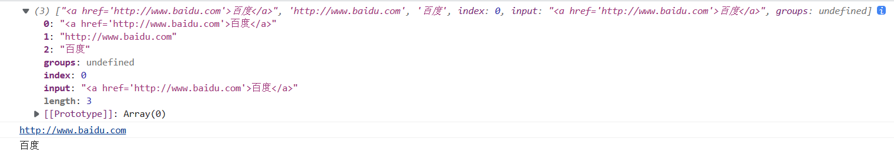

命名分组写法：

```js
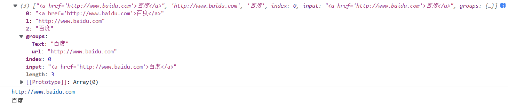// 声明一个字符串
let str = "<a href='http://www.baidu.com'>百度</a>";

// 提取url与[标签文本]
const reg = /<a href='(?<url>.*)'>(?<Text>.*)<\/a>/;

const result = reg.exec(str)
console.log(result);
console.log(result.groups.url);
console.log(result.groups.Text);
```


## 3 断言

### 3.1 正向断言

根据后续内容匹配前面的内容是否合法

提取字符串后面的数字 88987

```js
// \d 数字
// n+ 匹配任何包含至少一个n的字符串
// ?=n 匹配任意字符其后紧接字符为n的字符
let str = 'JS32343434你发个的88987放大'

// 数字后面+放的 
const reg = /\d+(?=放)/   
reg.exec(str)
```

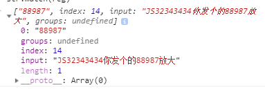

### 3.2 反向断言

根据前边内容匹配后面的内容是否合法

提取字符串后面的数字 的 后面的数字

```js
let str = 'JS32343434你发个的88987放大'

const reg2 = /(?<=的)\d+/
reg2.exec(str)
```

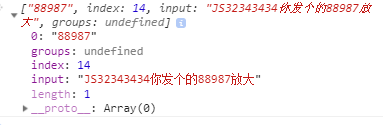

## 4 dotAll模式

JavaScript正则表达式中点（.）是一个特殊字符，它可以匹配除了一下条件的任意字符。

- 四个字节的UTF-16字符
- 换行符（\n）
- 回车符（\r）
- 行分隔符
- 段分隔符

为了使点（.）可以匹配任意字符，ES2018引入新的修饰符s。这种模式被称为dotAll模式，根据字面意思便是dot（.）匹配一切字符。

```js
console.log(/mazey.happy/.test('mazey\nhappy')); // false
console.log(/mazey.happy/s.test('mazey\nhappy')); // true
```

# 六、ES10新特性

## 1 对象扩展方法

### 1.1 Object.fromEntries

Object.entries() 是将对象转成一个自身可枚举属性的键值对数组。同样，我们也可以把**键值对数组**转成了对象。

```js
const keyValuePair = [
  ['cow', '?'],
  ['pig', '?'],
]
 
Object.fromEntries(keyValuePair);
// { cow: '?', pig: '?' }
```

对象结构是一个是有键和值组合体，如下所示：

```js
const object = {
  key: 'value',
};
```

基于这个逻辑，如果我们想将某个东西转成对象，就必须要传递**键和值**。

有两种类型的参数可以满足这些要求：

1. 具有嵌套键值对的数组
2. Map 对象

#### 1.1.1 使用 Object.fromEntries 将数组转成对象

下面是个键-值对嵌套数组

```js
const nestedArray = [
  ['key 1', 'value 1'],
  ['key 2', 'value 2']
]
```

使用Object.fromEntries可以将该数组转成对象:

```js
Object.fromEntries(nestedArray);
// { key 1: "value 1", key 2: "value 2"}
```

#### 1.1.2 使用 Object.fromEntries 将 Map 转成对象

ES6 为我们带来了一个名为 **map** 的新对象，它与对象非常相似。

创建一个map对象

```js
// 使用构造函数 
const map = new Map([ ['key 1', 'value 1'], ['key 2', 'value 2'] ]) 
// 或者我们可以使用实例方法“set” 
const map = new Map() 
map.set('key 1', 'value 1') 
map.set('key 2', 'value 2') 
// 结果 Map(2) {"key 1" => "value 1", "key 2" => "value 2"}
```

使用Object.fromentries将 **map** 转换为一个对象

```js
Object.fromEntries(map);
// { key 1: "value 1", key 2: "value 2"}
```

#### 1.1.3 对象的类型错误

试图使用 Object.fromEntries 将 其它类型 转成对象

| Type               |                                   |
| ------------------ | --------------------------------- |
| Undefined          | Object.fromEntries(undefined)     |
| Null               | Object.fromEntries(null)          |
| Boolean            | Object.fromEntries(true)          |
| Number             | Object.fromEntries(100)           |
| String             | Object.fromEntries("hi")          |
| Object             | Object.fromEntries({ket:"value"}) |
| Single Value Array | Object.fromEntries([1,2,3])       |

确保传递值要有键-值对。

#### 1.1.4 Object.fromEntries vs Object.entries

Object.fromEntries 是 Object.entries 反向。 Object.entries()方法返回一个给定对象自身可枚举属性的键值对数组，而Object.fromEntries() 方法把键值对列表转换为一个对象。

```js
const object = { key1: 'value1', key2: 'value2' }
 
const array = Object.entries(object)
// [ ["key1", "value1"], ["key2", "value2"] ]
 
 
Object.fromEntries(array)
// { key1: 'value1', key2: 'value2' }
```

## 2 字符串扩展方法

### 2.1 trimStart和trimStart

ES2019 对字符串实例新增了`trimStart()`和`trimEnd()`这两个方法。它们的行为与`trim()`一致，`trimStart()`消除字符串头部的空格，`trimEnd()`消除尾部的空格。它们返回的都是新字符串，不会修改原始字符串。

```js
const s = ' abc ';

console.log(s.trim()) // "abc"

console.log(s.trimStart())) // "abc "

console.log(s.trimEnd()) // " abc"
```

上面代码中，`trimStart()`只消除头部的空格，保留尾部的空格。`trimEnd()`也是类似行为。

除了空格键，这两个方法对字符串头部（或尾部）的 tab 键、换行符等不可见的空白符号也有效。

浏览器还部署了额外的两个方法，`trimLeft()`是`trimStart()`的别名，`trimRight()`是`trimEnd()`的别名。

## 3 数组方法扩展

### 3.1 flat()

数组的成员有时还是数组，`Array.prototype.flat()`用于将嵌套的数组“拉平”，变成一维的数组。该方法返回一个新数组，对原数据没有影响。

```js
const res = [1, 2, [3, 4]]
console.log(res.flat());//[1, 2, 3, 4]
```

上面代码中，原数组的成员里面有一个数组，flat()方法将子数组的成员取出来，添加在原来的位置。

flat()默认只会“拉平”一层，如果想要“拉平”多层的嵌套数组，可以将flat()方法的参数写成一个整数，表示想要拉平的层数，默认为1。

```js
const res = [1, 2, [3, 4, [5, 6,7]]]
console.log(res.flat());//[1, 2, 3, 4, [5,6,7]]
console.log(res.flat(2));//[1, 2, 3, 4, 5, 6, 7]
```

上面代码中，flat()的参数为2，表示要拉平两层的嵌套数组。

如果不管有多少层嵌套，都要转成一维数组，可以用Infinity关键字作为参数。

```js
const res = [1, 2, [3, 4, [5, 6,7]]]
console.log(res.flat(Infinity));//[1, 2, 3, 4, 5, 6, 7]
```

如果原数组有空位，flat()方法会跳过空位。

```js
const res = [1, 2, , 3, 4]
console.log(res.flat());//[1, 2, 3, 4]
```

### 3.2 flatMap()

flatMap()方法对原数组的每个成员执行一个函数，相当于执行Array.prototype.map(),然后对返回值组成的数组执行flat()方法。该方法返回一个新数组，不改变原数组。flatMap()只能展开一层数组。

```js
const arr = [1, 2, 3]
const result = arr.flatMap(item => [item * 10])
console.log(result);// [10, 20, 30]
```

## 4 Symbol扩展

### 4.1 Symbol.prototype.description

`Symbol` 的描述只被存储在内部的 `Description` ，没有直接对外暴露，我们只有调用 `Symbol` 的`toString()`时才可以读取这个属性：

```js
const name = Symbol('es')
console.log(name.toString()) // Symbol(es)
console.log(name) // Symbol(es)
console.log(name === 'Symbol(es)') // false
console.log(name.toString() === 'Symbol(es)') // true
```

现在可以通过 description 方法获取 Symbol 的描述:

```js
console.log(Symbol('desc').description);
// "desc"

console.log(Symbol.iterator.description);
// "Symbol.iterator"

console.log(Symbol.for('foo').description);
// "foo"

console.log(`${Symbol('foo').description}bar`);
// "foobar"
```

语法：

```js
Symbol('myDescription').description;
Symbol.iterator.description;
Symbol.for('foo').description;
```

Symbol 对象可以通过一个可选的描述创建，可用于调试，但不能用于访问 symbol 本身。Symbol.prototype.description属性可以用于读取该描述。与 Symbol.prototype.toString() 不同的是它不会包含"Symbol()"的字符串。具体请看实例：

```js
Symbol('desc').toString();   // "Symbol(desc)"
Symbol('desc').description;  // "desc"
Symbol('').description;      // ""
Symbol().description;        // undefined

// well-known symbols
Symbol.iterator.toString();  // "Symbol(Symbol.iterator)"
Symbol.iterator.description; // "Symbol.iterator"

// global symbols
Symbol.for('foo').toString();  // "Symbol(foo)"
Symbol.for('foo').description; // "foo"
```

# 七、ES11新特性

## 1 私有属性和私有属性

[16.5 私有方法和私有属性](#16.5 私有方法和私有属性)

## 2 Promise.allSettled

`Promise.allSettled()` 方法返回一个在所有给定的 promise 都已经 `fulfilled` 或 `rejected` 后的 `promise`，并带有一个对象数组，每个对象表示对应的 promise 结果。

```js
const p1 = new Promise((resolve, reject) => {
    setTimeout(() => {
        resolve('成功-p1')
    })
})
const p2 = new Promise((resolve, reject) => {
    setTimeout(() => {
        resolve('成功-p2')
    })
})

// 调用allsettled方法
const result = Promise.allSettled([p1,p2])
console.log(result);
```

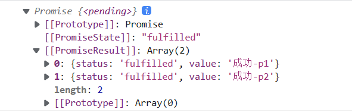

若其中有Promise或着所有的Promise对象都返回的是失败的结果，Promise.allSettled()也会返回成功的结果

```js
// 声明两个Promise对象
const p1 = new Promise((resolve, reject) => {
    setTimeout(() => {
        reject('失败-p1')
    })
})
const p2 = new Promise((resolve, reject) => {
    setTimeout(() => {
        reject('失败-p2')
    })
})

// 调用allsettled方法
const result = Promise.allSettled([p1,p2])
console.log(result);
```

与Promise.all的区别：

Promise.all只会当所有的Promise返回成功的结果是返回成功

```js
// 声明两个Promise对象
const p1 = new Promise((resolve, reject) => {
    setTimeout(() => {
        resolve('成功-1')
    })
})
const p2 = new Promise((resolve, reject) => {
    setTimeout(() => {
        resolve('成功-2')
    })
})

// 调用allsettled方法
const result = Promise.all([p1,p2])
console.log(result);
```

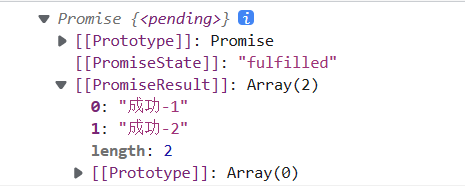

```js
// 声明两个Promise对象
const p1 = new Promise((resolve, reject) => {
    setTimeout(() => {
        reject('失败-p1')
    })
})
const p2 = new Promise((resolve, reject) => {
    setTimeout(() => {
        reject('失败-p2')
    })
})

// 调用allsettled方法
const result = Promise.all([p1,p2])
console.log(result);
```

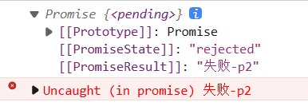

## 3 String.prototype.matchAll

matchAll() 方法返回一个包含所有匹配正则表达式的结果及其分组捕获组的迭代器

语法：str.matchAll(reg)

reg：正则表达式对象。如果不是正则表达式则会使用new RegExp(obj)隐式转换为正则表达式。表达式必须设置为 g (全局模式)否则会报错

返回值：一个迭代器，可以使用for…of…，数组新增的扩展符(…)或Array.from()实现功能

```js
const str = 'hello javascript hello css'
console.log(...str.matchAll(/hello/g))
// [0: "hello", groups: undefined, index: 0, input: "hello javascript hello css"]
// [0: "hello", groups: undefined, index: 17, input: "hello javascript hello css"]

// 0: "hello"  匹配的字符串，如果有使用分组会在后面依次列出来
// groups: undefined  没有使用命名捕获组会返回undefined，否则会返回包含命名捕获组的对象
// index: 0  匹配的结果在当前字符串位置开始的索引
// input: "hello javascript hello css" 当前字符串
```

## 4 可选链操作符

### 4.1 背景

在 ES5 访问对象的深嵌套属性时`obj.a.b`，首先需要检查它的上一个属性是否存在，然后才能获取属性的值，否则就会报错

```js
let obj = {}
console.log(obj.a) //undefined
console.log(obj.a.b) // => undefined.b 会报错
```

ES5中借助 `&&` 来保证程序的健壮性，但当嵌套的对象很深时，则要对每一层进行验证，这样不利于阅读，而且容易出现程序上的错误

```js
var obj = {} 
var b = obj.a && obj.a.b 
console.log(b) // undefined
```

针对上面的场景，ES2020 最新的版本给出了它的解决方案 —— 可选链操作符。

### 4.2 方法详情

可选链操作符使用 **`?.`**  来表示，可以判断操作符之前属性是否有效，从而链式读取对象的属性或返回 `undefined` 。

作用与 `.` 操作符类似。不同的是 `?.` 如果对象链上的引用是 `null` 或者 `undefined` 时， `.` 操作符会像前言中的例子抛出一个错误，而 `?.` 操作符则会按照短路计算的方式进行处理，返回 `undefined`。可选链操作符也可用于函数调用，如果操作符前的函数不存在，也将会返回 `undefined`。下面我们来看它的使用语法：

#### 4.2.1 基本语法

```js
obj?.prop
obj?.[expr]
arr?.[index]
func?.(args)
```

**参数解释：**

| 参数  | 描述                             |
| ----- | -------------------------------- |
| prop  | 对象上的属性                     |
| expr  | 对象上的属性可以是一个表达式     |
| index | 对数组使用时，可以接数组的位置   |
| args  | 对函数使用时，可以接收传入的参数 |

**实例**

```js
var user = {
  name: 'Kira',
  address: {
    city: 'beijing',
    other: {}
  }
}
console.log(user?.name);	// Kira
a?.b);	// => window.a?.b => undefined
console.log(user?.address?.city);		// beijing
console.log(user?.address?.other?.a?.b);	// undefined
```

上面的代码可以看出，使用的方式很简单，在确保上一个值是有效时才会去获取下面的属性，避免程序报错。

对象的引用或函数可能是 `undefined` 或 `null` 时，可选链操作符提供了一种方法来简化被连接对象的值访问。

### 4.3 使用场景

#### 4.3.1 可选链和表达式

当使用方括号与属性名的形式来访问属性时，你也可以使用可选链操作符：

```js
let firstName = obj?.['first' + 'Name'];
```

#### 4.3.2 可选链与函数调用

当尝试调用一个可能不存在的方法时也可以使用可选链。这将是很有帮助的。当函数调用时如果被调用的方法不存在，使用可选链可以使表达式自动返回 `undefined` 而不是抛出一个异常。

```js
var person = {}
var name = person.getName?.();
```

注意：如果属性名不是函数也会报错，可选链只会判断属性是否有效，而不能判断属性的类型。

```js
var person = {getName: ''}
var name = person.getName?.();
// Uncaught TypeError: person.getName is not a function
```

#### 4.3.3 可选链不能用于赋值

可选链是取值操作时所用的安全方法，不能使用在赋值操作上。

```js
let obj = {};
obj?.name = '5axxw';	// Uncaught SyntaxError: Invalid left-hand side in assignment
```

上面的代码第 2 行使用可选链进行赋值操作，控制台会报语法错误，赋值的左侧是无效的。

#### 4.3.4 可选链访问数组元素

可选链也是可以使用在数组取值的前置验证的。

```js
var arr = []
let item = arr?.[5];
```

## 5 动态import

关键字import可以像调用函数一样来动态的导入模块。以这种方式调用，将返回一个 promise

```javascript
import('./hello.js').then(module=>{
}
```

示例：

index.html：

```html
<!DOCTYPE html>
<html lang="en">
<head>
    <meta charset="UTF-8">
    <meta name="viewport" content="width=device-width, initial-scale=1.0">
    <title>动态import </title>
</head>
<body>
    <button id="btn">点击</button>
    <script src="./js/app.js" type="module"></script>
</body>
</html>
```

/js/hello.js：

```js
export function hello(){
    console.log('hello')
}
```

/js/app.js：

```js
// 静态导入  不管用不用 先导入再说
// import * as m1 from './hello.js'

const btn = document.querySelector("#btn")
btn.onclick = function(){
    // 动态导入
    import('./hello.js').then(module=>{
        // module 就是模块里面导出的对象
        module.hello()
    })
}
```

## 6 BigInt类型

### 6.1 概述

BigInt 是一个新型的内置类型，主要是为了表达大于 2^53-1 的整数。

我们定义一个 BigInt 类型的数据时有两种方式，第一个是在数字后面加 n，另外一种是调用 BigInt()方法。

```js
let theBigInt = 9007199254740991n;
let alsoHuge = BigInt(9007199254740991); // 9007199254740991n
复制代码
```

当用 typeof 对其进行类型判断时，返回的是 bigint。

```js
let theBigInt = 9007199254740991n;
typeof theBigInt; // bigint
```

### 6.2 运算

BigInt 支持以下的运算符，+、`*`、`-`、`**`、`%` ，并且支持除了>>> （无符号右移）之外的 其他位运算符。

```js
let previousMaxSafe = BigInt(Number.MAX_SAFE_INTEGER); // 9007199254740991n
let maxPlusOne = previousMaxSafe + 1n; // 9007199254740992n
let maxMinusOne = previousMaxSafe - 1n; // 9007199254740990n
let multi = previousMaxSafe * 2n; // 18014398509481982n
let mod = previousMaxSafe % 10n; // 1n
```

值得注意的是，BigInt 是不支持单目+运算符的。

```js
+previousMaxSafe; // Uncaught TypeError: Cannot convert a BigInt value to a number
```

主要原因还是 BigInt 无法和 Number 类型直接运算，如果想要运算的话必须在同一个类型上，但是有一点值得注意的是，当 BigInt 转为 Number 类型时，有可能会丢失精度。

在比较运算符中，BigInt 和 Nunber 类型的之间不是严格相等的。

```js
10n == 10; // true
10n === 10; // false
```

Number 和 BigInt 是可以进行比较的。

```js
1n < 2; // true
2n > 1; // true
2n >= 2; // true
```

### 6.3 API

BigInt 拥有两个静态方法：

1. BigInt.asIntN(width, bigint)：将 BigInt 值转换为一个-2^width-1 与 2^width-1-1 之间的有符号整数。
2. BigInt.asUintN(width, bigint)：将一个 BigInt 值转换为 0 与 2^width-1 之间的无符号整数。

这两个方法均接受两个参数，width：可存储整数的位数。bigint：要存储在指定位数上的整数。

```js
const max = 2n ** (64n - 1n) - 1n;
BigInt.asIntN(64, max); // 9223372036854775807n

const max = 2n ** 64n - 1n;
BigInt.asUintN(64, max); // 18446744073709551615n
```

同时 BigInt 还拥有三个实例方法：

1. BigInt.prototype.toLocaleString()：返回此数字的 language-sensitive 形式的字符串。覆盖 Object.prototype.toLocaleString() 方法。
2. BigInt.prototype.toString()：返回以指定基数(base)表示指定数字的字符串。覆盖 Object.prototype.toString() 方法。
3. BigInt.prototype.valueOf()：返回指定对象的基元值。 覆盖 Object.prototype.valueOf() 方法。

```js
let bigint = 3500n;
bigint.toLocaleString(); // "3,500"
bigint.toString(); // "3500"
bigint.valueOf(); // 3500n
```

## 7 globalThis

JavaScript 语言存在一个顶层对象，它提供全局环境（即全局作用域），所有代码都是在这个环境中运行。但是，顶层对象在各种实现里面是不统一的。

- 浏览器里面，顶层对象是`window`，但 Node 和 Web Worker 没有`window`。
- 浏览器和 Web Worker 里面，`self`也指向顶层对象，但是 Node 没有`self`。
- Node 里面，顶层对象是`global`，但其他环境都不支持。

同一段代码为了能够在各种环境，都能取到顶层对象，现在一般是使用`this`变量，但是有局限性。

- 全局环境中，`this`会返回顶层对象。但是，Node.js 模块中`this`返回的是当前模块，ES6 模块中`this`返回的是`undefined`。
- 函数里面的`this`，如果函数不是作为对象的方法运行，而是单纯作为函数运行，`this`会指向顶层对象。但是，严格模式下，这时`this`会返回`undefined`。
- 不管是严格模式，还是普通模式，`new Function('return this')()`，总是会返回全局对象。但是，如果浏览器用了 CSP（Content Security Policy，内容安全策略），那么`eval`、`new Function`这些方法都可能无法使用。

综上所述，很难找到一种方法，可以在所有情况下，都取到顶层对象。下面是两种勉强可以使用的方法。

```js
// 方法一
(typeof window !== 'undefined'
   ? window
   : (typeof process === 'object' &&
      typeof require === 'function' &&
      typeof global === 'object')
     ? global
     : this);

// 方法二
var getGlobal = function () {
  if (typeof self !== 'undefined') { return self; }
  if (typeof window !== 'undefined') { return window; }
  if (typeof global !== 'undefined') { return global; }
  throw new Error('unable to locate global object');
};
```

ES2020 在语言标准的层面，引入`globalThis`作为顶层对象。也就是说，任何环境下，`globalThis`都是存在的，都可以从它拿到顶层对象，指向全局环境下的`this`。
