# 一、Git简介

项目的开发是一个不断迭代的过程，开发过程中程序员需要不断的对代码进行编写和更正。这就带来很多的问题。

首先，开发中代码会存在多个版本，我们如何将代码在多个版本间进行切换？

第二，代码上线后，如何在不影响现行开发工作的情况下对代码进行维护？

第三，开发时某段代码被多人修改时，如何处理代码的冲突问题？

除此之外，还有存储效率、远程仓库等问题。

git是一个免费开源的版本控制系统，它被设计用来快速高效地管理项目开发的源码。通过git可以跟踪代码的状态，也可以在修改代码后对代码状态进行存储，还可以在需要时将已经修改过的代码恢复到之前存储的状态。更强大的是使用git管理代码时，可以创建代码分支（branch），代码分支相当于一段独立的代码记录，我们可以在分支上对代码进行任意的修改，而这个修改只会影响当前分支，不会对其他分支产生影响。同时，可以对分支进行合并，合并后一个分支的修改便可在另一分支上生效。总之，git是当今最优秀的版本控制工具！

# 二、安装

## 2.1 下载官网

git下载官网：https://git-scm.com/


## 2.2 安装步骤

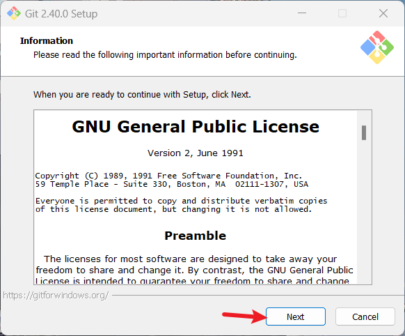

选择安装路径，推荐默认路径，也可以自定义路径，安装路径不要包含中文

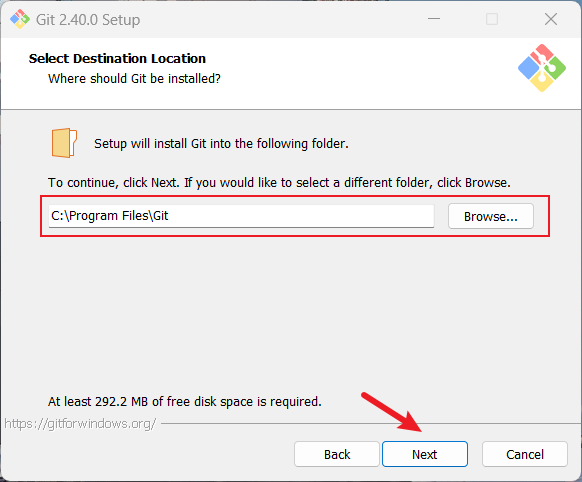

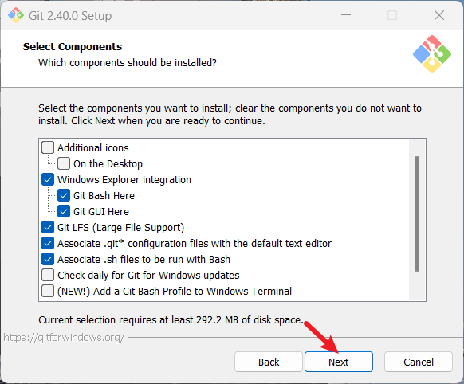

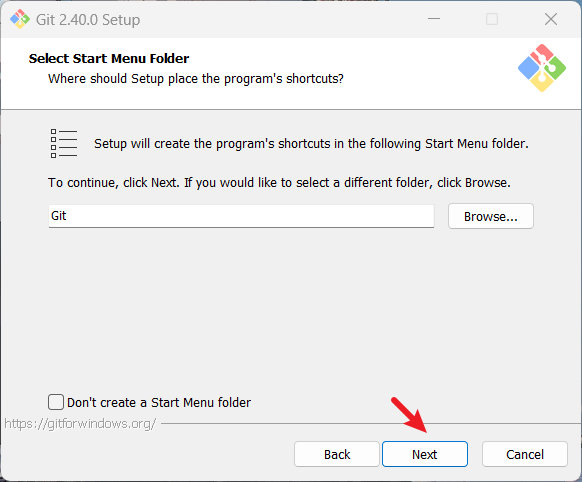

选择git的默认文本编辑器，根据个人使用习惯觉得

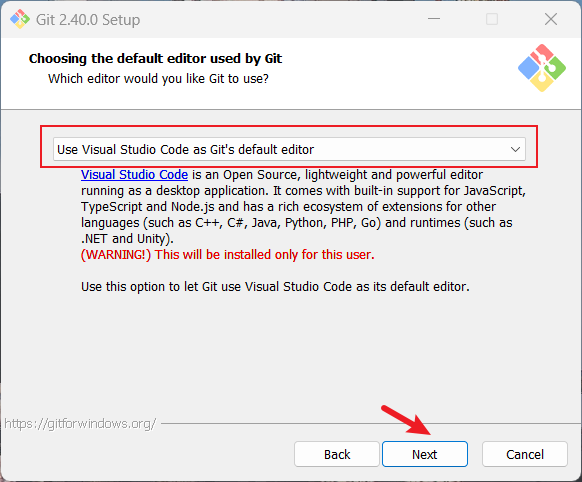

git默认主分支名：master

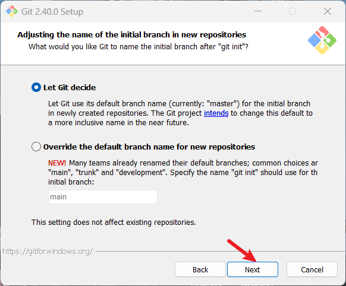

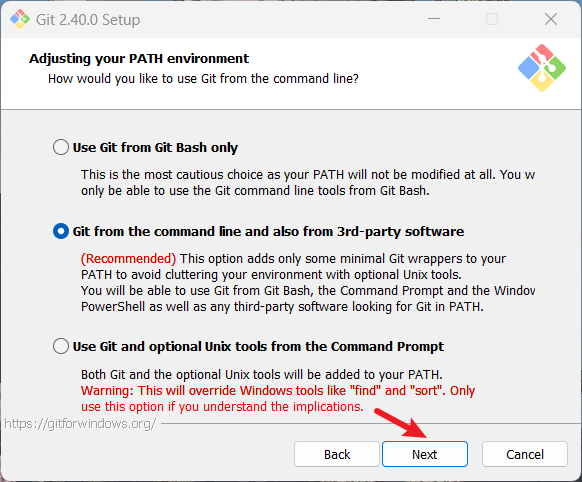

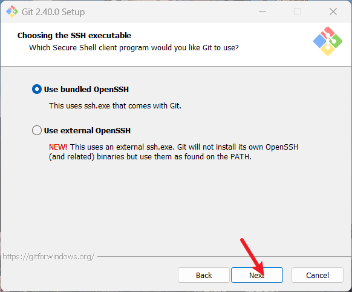

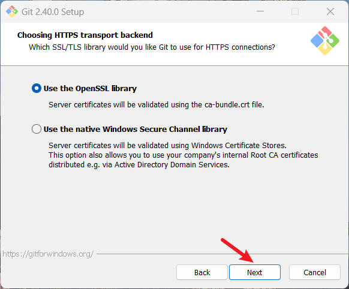

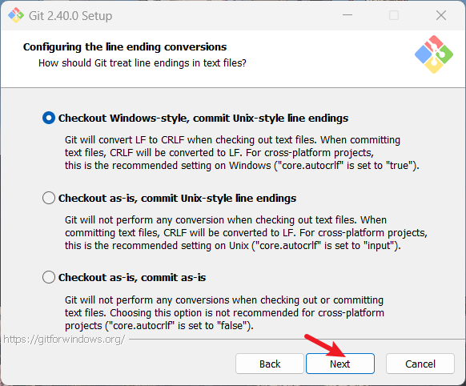

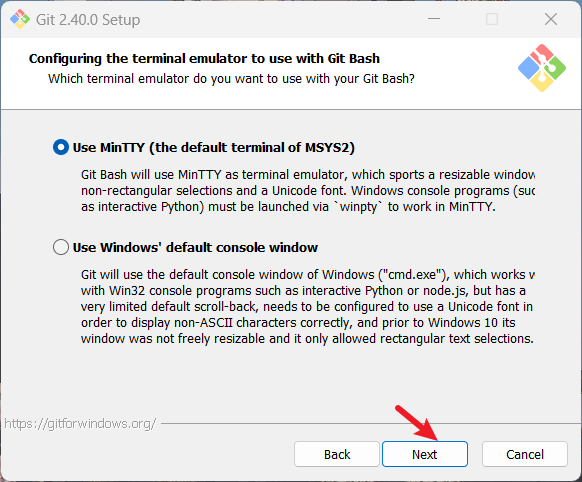

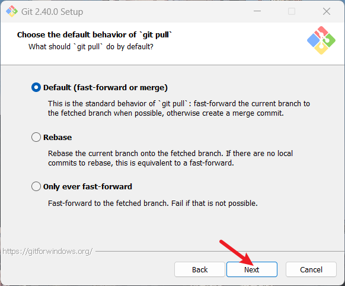

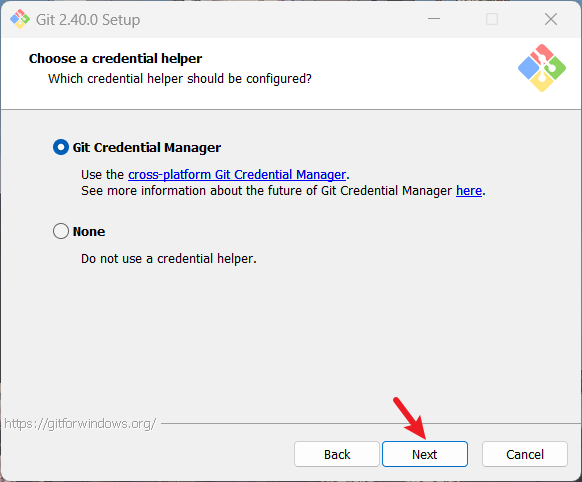

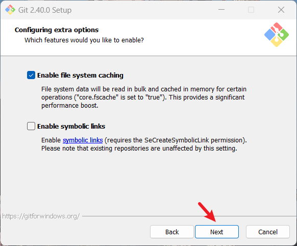

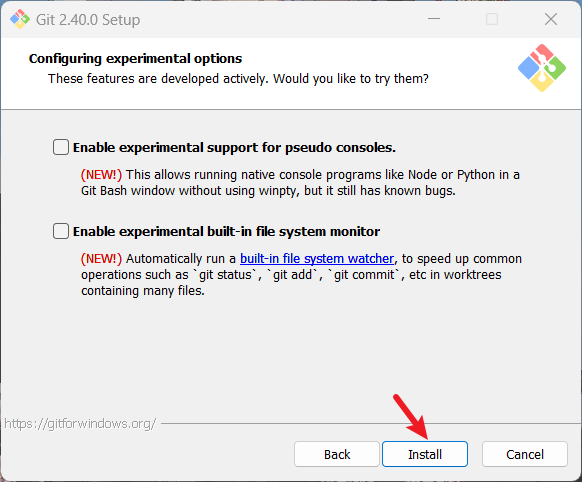

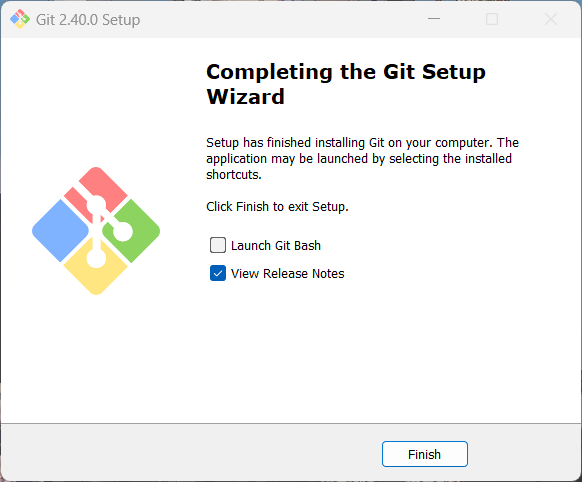

至此git安装完成

使用cmd运行命令 `git -v` 可查看git版本号，若出现git版本号，代表安装成功

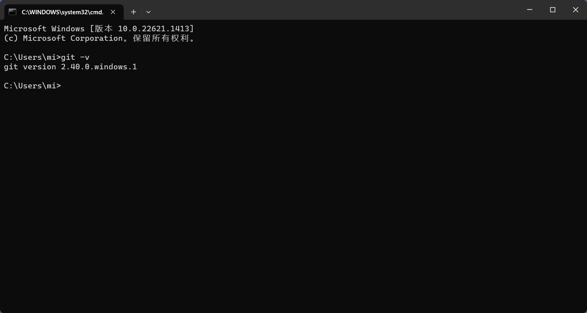

# 三、git配置

通过命令分别配置git姓名和邮箱

> git config --global user.name "xxxxx"

> git config --global user.email "xxxxx@qq.com"

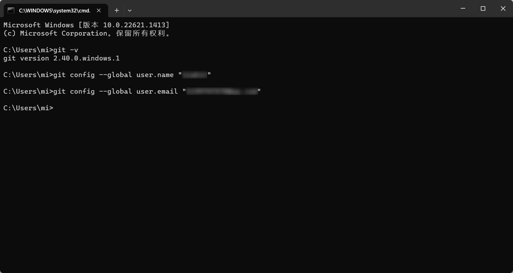

# 四、git使用

## 4.1 初始化仓库

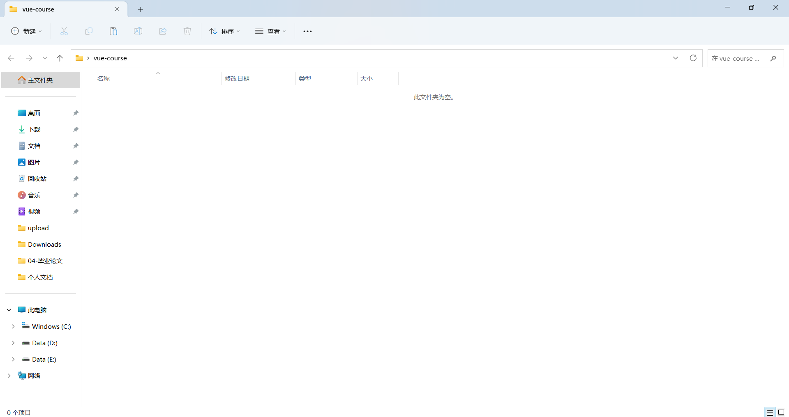

我们新建一个文件夹后，此时我们通过命令 `git status` 查看该文件夹是否被git管理

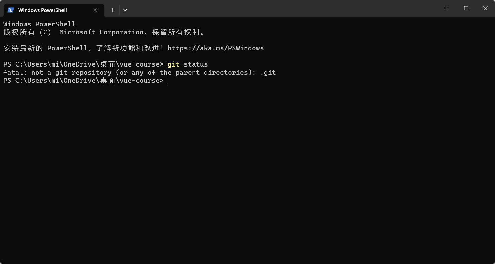

此时提醒：fatal: not a git repository (or any of the parent directories): .git，提示我们该文件夹并未被git管理

可以通过命令 `git init` 初始化仓库，同时文件夹中会出现 .git 命名的隐藏文件夹，可以通过`git status`再次查看是否被git管理

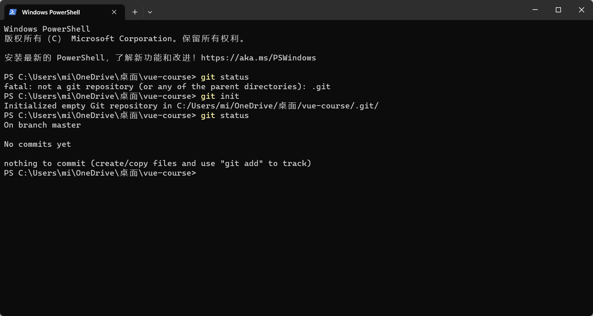

出现以下代码代表git仓库初始化成功：

```
On branch master

No commits yet

nothing to commit (create/copy files and use "git add" to track)
```

## 4.2 git文件状态

git中的文件有两种状态：未跟踪和已跟踪。

未跟踪指文件没有被git所管理，已跟踪指文件已被git管理。已跟踪的文件又有三种状态：未修改、修改和暂存。

暂存，表示文件修改已经保存，但是尚未提交到git仓库。

未修改，表示磁盘中的文件和git仓库中文件相同，没有修改。

已修改，表示磁盘中文件已被修改，和git仓库中文件不同。

可以通过`git status`来查看文件的状态

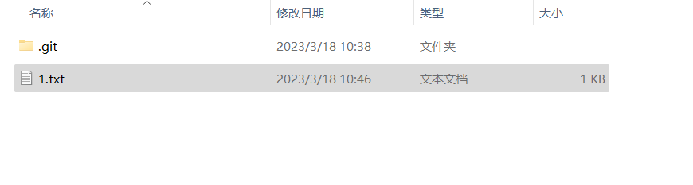

若在文件夹中新建一个1.txt文件，则该文件是未跟踪状态，刚刚添加到项目中的文件处于未跟踪的状态

执行`git status`命令查看文件状态

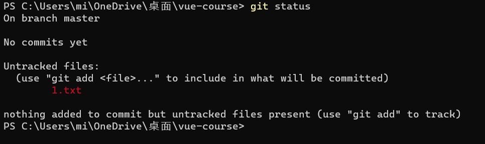

提示有一个文件 1.txt 并未被git管理

可以通过`git add`命令将文件有未跟踪转变为暂存的状态

> `git add <filename>` 将文件切换到暂存的状态，`git add *` 暂存所有文件

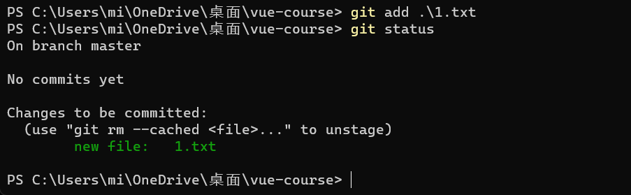

绿色文件代表文件暂存状态，我们可以通过git commit -m命令将暂存的文件存储到仓库中，使用commit提交的文件，其状态时未修改

> `git commit -m "xxxxxx"` 将暂存的文件存储到仓库中，其中xxxx代表提交说明
>
> `git commit -a -m "xxxxx“`  提交所有已修改的文件，未跟踪的文件不会提交

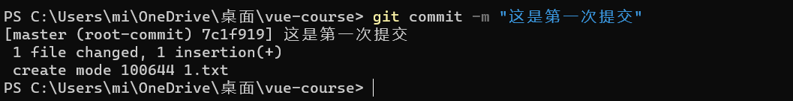

使用`git status`命令查看状态，提示没有文件需要提交，工作树很干净，即本地文件与git仓库中的文件相一致

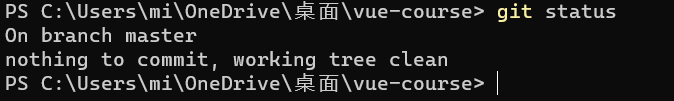

当修改1.txt中的内容时，文件状态就会由未修改变为修改状态

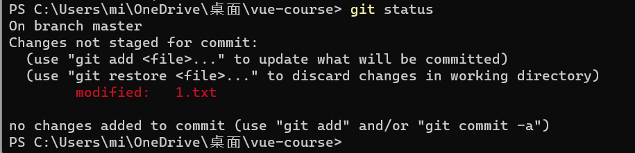

提示1.txt文件有变化

则需要再次通过命名`git add`将文件状态变为暂存状态，然后通过`git commit`命令将文件状态改为未修改状态

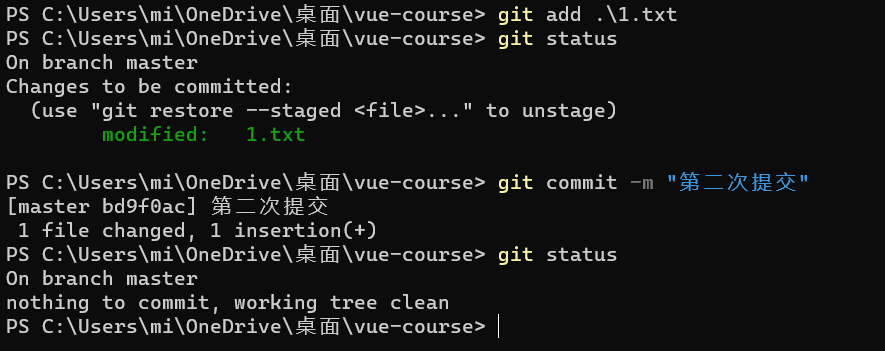

**实际开发中，完成一个功能模块后再提交文件至仓库，实际开发中的提交并不频繁**

当我们修改多个文件后需要将文件变为暂存状态时，可以使用 `git commit -a -m "xxx"`命令直接将文件由已修改状态变为未修改状态，直接跳过 `git add` 命令步骤

# 五、常用命令

## 5.1 重置文件

```bash
git restore <filename> #恢复文件
git restore --staged <filename> #恢复文件
```

## 5.2 删除文件

```bash
git rm <filename> #删除文件
git rm <filename> -f #强制删除文件
```

## 5.3 移动文件

```bash
git mv from to #移动文件 重命名文件
```

例如：重命名文件：`git mv .\01.html .\.2.html` ，将01.html重命名02.html

# 六、分支

git在存储文件时，每一次代码的提交都会创建一个与之对应的节点，git就是通过一个一个的节点来记录代码的状态，节点会构成一个树状结构，树状结构就意味着这个树会存在分支，命名为master ，在使用git时，可以创建多分支，分支与分支之间相互独立，在一个分支上修改代码不会影响其他的分支。

```bash
git branch #查看当前分支
git branch <branch name> #创建新的分支
git branch -d <branch name> #删除分支
git switch <branch name> #切换分支
git switch -c <branch name> #创建并切换分支
```

例如：创建login分支：`git branch login`

在开发中，都是在自己的分支上编写代码，代码编写完成后，再将自己的分支合并到主分支中

合并分支

```bash
git merge <branch name>  #合并分支
```

例如：需要将login分支合并到master分支，需要先切换到主分支，再使用命令合并分支

# 七、变基（rebase）

## 7.1 概念

在开发中除了通过 merge 来合并分支外，还可以通过变基来完成分支的合并。

我们通过 merge 合并分支时，在提交记录中会将所有的分支创建和分支合并的过程全部都显示出来，这样当项目比较复杂，开发过程比较波折时，我必须要反复的创建、合并、删除分支。这样一来将会使得我们代码的提交记录变得极为混乱。

原理（变基时发生了什么）：

1. 当我们发起变基时，git 会首先找到两条分支的最近的共同祖先
2. 对比当前分支相对于祖先的历史提交，并且将它们提取出来存储到一个临时文件中
3. 将当前部分指向目标的基底
4. 以当前基底开始，重新执行历史操作

变基和 merge 对于合并分支来说最终的结果是一样的！但是变基会使得代码的提交记录更整洁更清晰！注意！大部分情况下合并和变基是可以互换的，但是如果分支已经提交给了远程仓库，那么这时尽量不要变基。

## 7.2 示例一

开发任务在B2分叉成两个不同分支，又各自提交了更新。

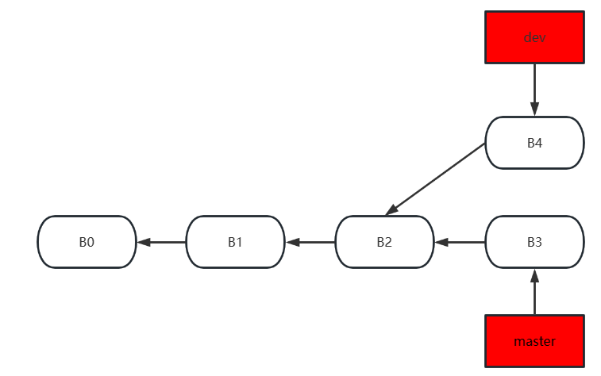

你可以提取在 B4 中引入的补丁和修改，然后在 B3 的基础上应用一次。 在 Git 中，这种操作就叫做 *变基*。 你可以使用 rebase 命令将提交到某一分支上的所有修改都移至另一分支上，就好像“重新播放”一样。

在上面的例子中，运行：

```bash
git checkout dev 
git rebase master
```

或者不用切换分支，采用 git rebase [basebranch] [topicbranch] 的方式，basebranch是目的分支（即本例的 master 分支），topicbranch是源分支（即本例的 dev 分支），总的意思是将 dev 分支中的修改变基到 master 分支上。这样做能省去你先切换到 dev 分支，再对其执行变基命令的多个步骤。

即等价于：

```bash
git rebase master dev
```

它的原理是首先找到这两个分支（即源分支 dev 和目的分支 master）的最近共同祖先 B2，然后源分支 dev 对比当前提交相对于该祖先的历次提交，提取相应的修改并存为临时文件，接着将源分支 dev 指向目标基底 B3, 最后以此将之前另存为临时文件的修改依序应用到 B3，从而产生了B4。

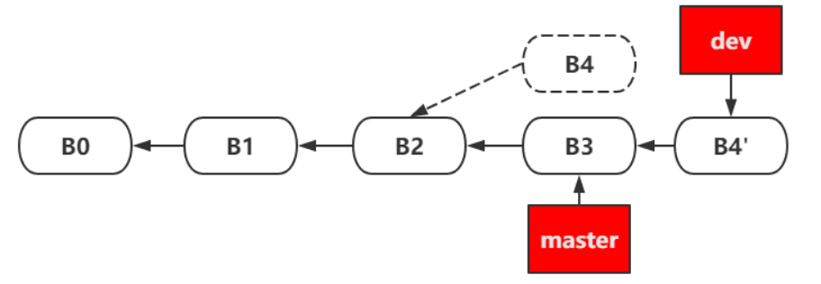

请注意，无论是通过 git rebase 命令变基，还是通过 git merge 命令三方合并，整合的最终结果提交始终是一样的，只不过提交历史不同罢了。 变基是将一系列提交按照原有次序依次应用到另一分支上，然后合并把最终结果合在一起。

## 7.3 示例2

在对两个分支进行变基时，所生成的“重放”并不一定要在目标分支上应用，你也可以指定另外的一个分支进行应用。

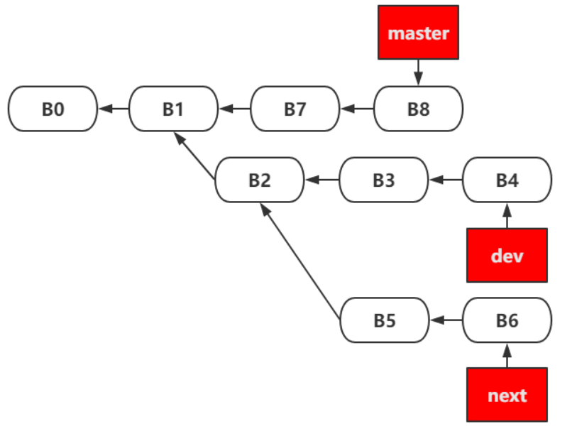

假设你希望将 next 中的修改合并到主分支并发布，但暂时并不想合并 dev 中的修改。 这时，你就可以使用 git rebase 命令的 --onto 选项，选中在 next 分支里但不在 dev 分支里的修改（即 B5 和 B6），将它们在 master 分支上重放：

```bash
git rebase --onto master dev next
```

以上命令的意思是：“取出 next 分支，找出处于 next 分支和 dev 分支的共同祖先之后的修改，然后把它们在 master 分支上重放一遍”。

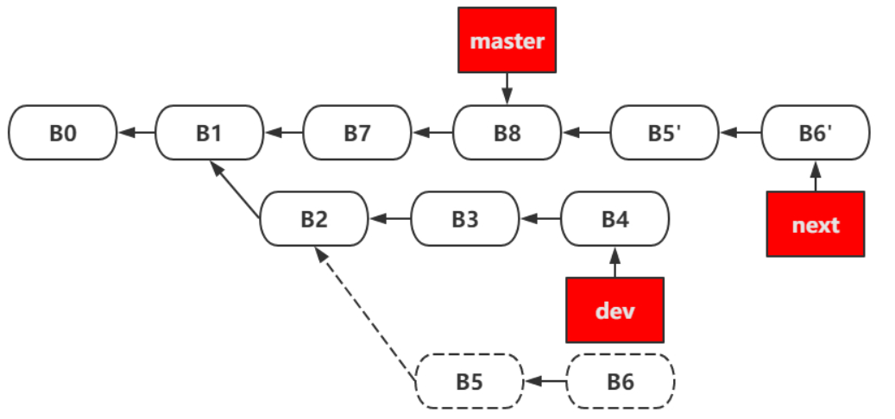

现在回到 master 分支，进行一次快进合并。

```bash
git checkout master
git merge next
```

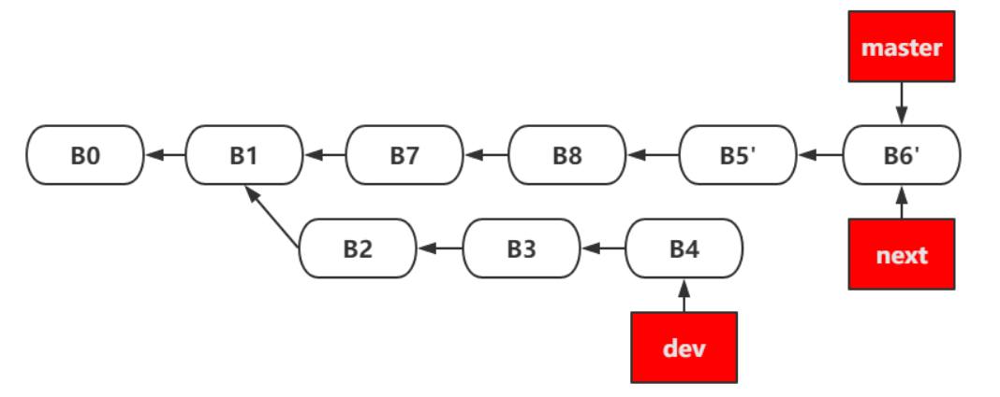

接下来还可以把 dev 分支的修改也整合进来，这里就不演示了，方法和示例一是一样的。

最后，分支中的修改都已经整合到主分支里了，你可以删除这两个分支：

```bash
git branch -d dev
git branch -d next
```

## 7.4 git rebase命令不适用的情况

要使用 git rebase 命令得遵守一条准则：

**不要对在你的仓库外有副本的分支执行变基。**

打个比方，你在本地有 master 分支，在远程库有相应的副本 master 分支，这种情况下就不要对本地 master 在最近一次push之前的提交历史执行变基。

变基操作的实质是丢弃一些现有的提交，然后相应地新建一些内容一样但实际上不同的提交（最明显的就是 commit-id 改变了）。 如果你已经将提交推送至某个仓库，而其他人也已经从该仓库拉取提交并进行了后续工作，此时，如果你用 git rebase 命令重新整理了提交并再次推送，你的同伴因此将不得不再次将他们手头的工作与你的提交进行整合，如果接下来你还要拉取并整合他们修改过的提交，事情就会变得一团糟。

# 八、远程仓库（remote）

目前对于git所有的操作都是在本地上进行的，在开发中显然不能这样，这时我们就需要一个远程的git仓库，远程的仓库和本地的仓库没有什么区别，不同点在于远程的仓库可以被多个人同时访问，方便我们协同开发，在实际工作中，git的服务器通常由公司搭建内部使用或者购买一些公共的私有git服务器，学习阶段可以直接使用一些开放的git仓库，目前我们常用的库有两个：Github和Gitee（码云）

## 8.1 github

注册并登录github官网：https://github.com/

新建一个仓库

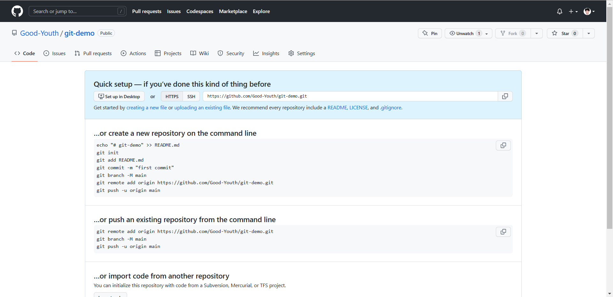

在终端执行一下代码将本地库上传git：

```bash
git remote add origin https://github.com/Good-Youth/git-demo.git
# git remote add <remote name> <url>
git branch -M main
# 修改分支的名字为main
git push -u origin main
```

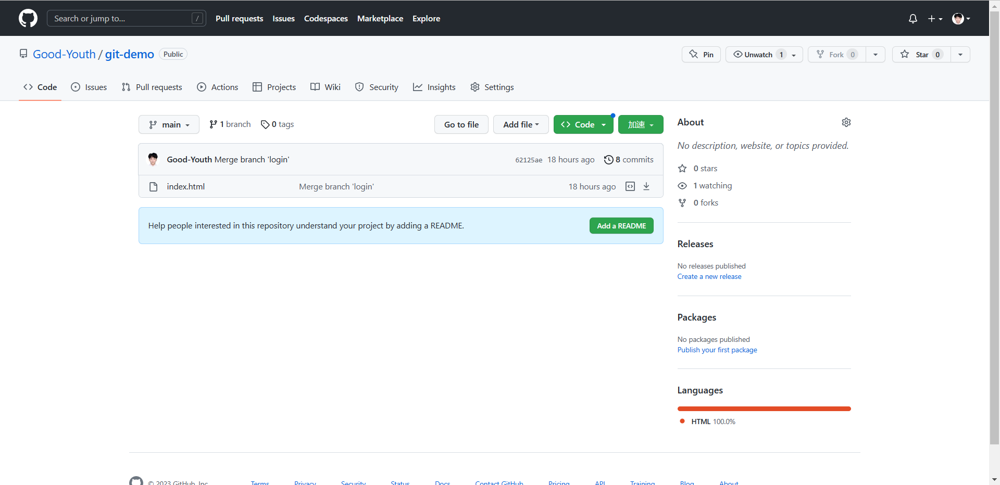


推送成功，首次推送会提示输入账户密码关联仓库

## 8.2 gitee

注册并登录gitee官网：https://gitee.com/

新建一个仓库

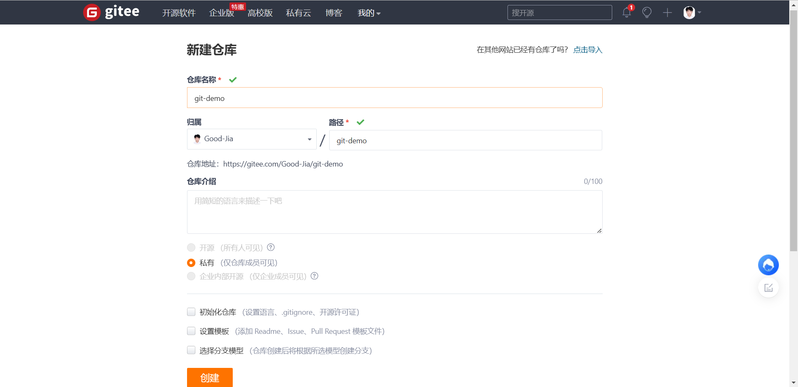

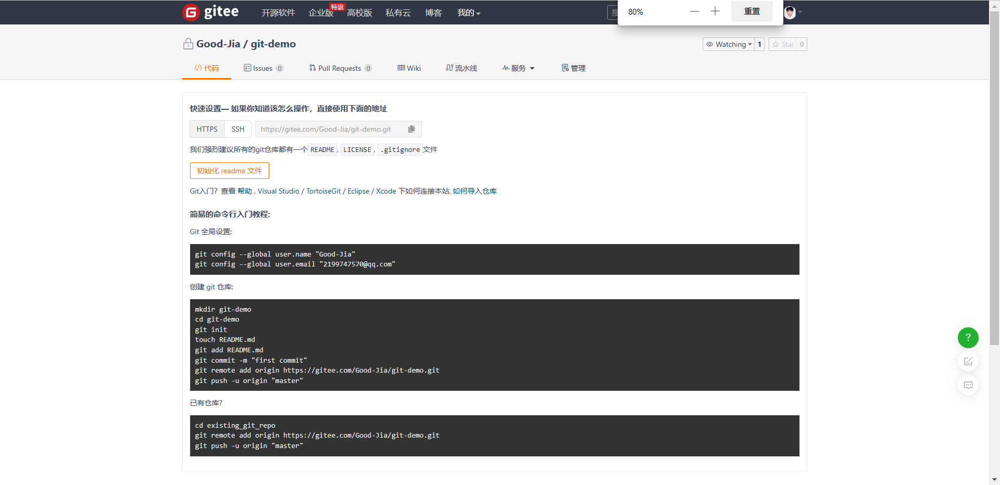

在终端执行一下代码将本地库上传git：

```bash
git remote add origin https://gitee.com/Good-Jia/git-demo.git
git push -u origin "master"
```

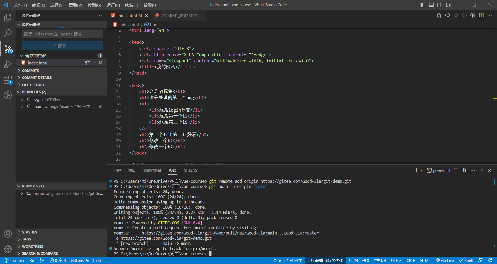

git推送成功

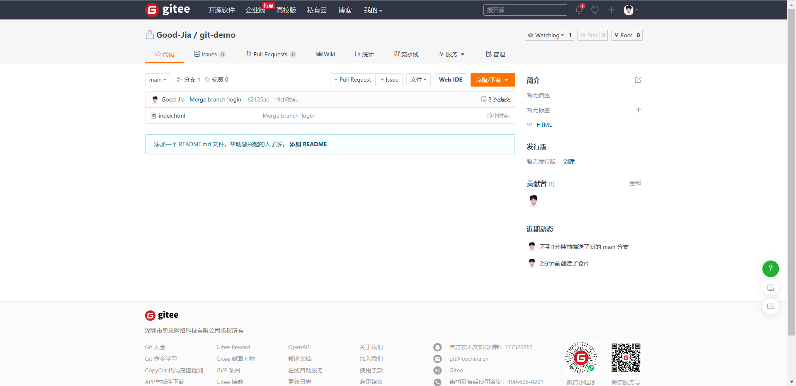

## 8.3 克隆/下载


赋值https链接

再终端执行 `git clone https://gitee.com/Good-Jia/git-demo.git` ，将自动从git仓库拉取代码至本地

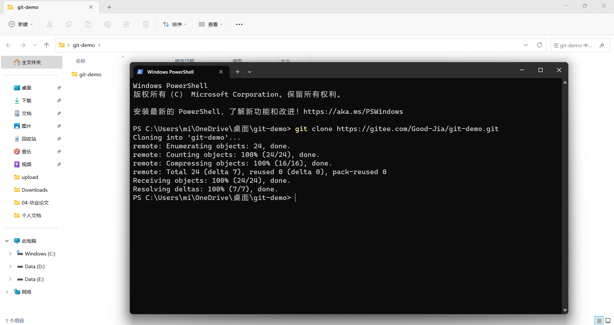

**github相关操作同理**

## 8.4 远程库操作命令

```bash
git remote #列出当前的关联的远程库
git remote add <远程库名> #关联远程仓库，例如：git remote add origin https://gitee.com/Good-Jia/git-demo.git
git remote remove <远程库名> #删除远程库
git push -u <远程库名> <分支名> #向远程仓库推送代码，并和当前分支关联
git push <远程库> <本地分支>:<远程分支> #将本地分支推送到远程库上的远程分支
git clone <url> #从远程库下载代码
git push #如果本地的版本低于远程库，push默认是推不上去的
git fetch #本地的版本低于远程库想要推送成功，必须确保本地库与远程库的版本一致，
          #fetch它会从远程仓库下载所有代码，但是并不会将代码和当前分支自动合并，
          #使用fetch拉取代码后。必须手动对代码进行合并
git pull #从服务器上拉去代码并自动合并
```

> 注意：推送代码时，一定要先从远程库中拉取最新的代码

# 九、分离头指针

通常，我们工作在某一个分支上，比如 master 分支。这个时候 master 指针和 HEAD 指针是一起前进的，每做一次提交，这两个指针就会一起向前挪一步。但是在某种情况下（例如 checkout 了某个具体的 [commit](https://so.csdn.net/so/search?q=commit&spm=1001.2101.3001.7020)），master 指针 和 HEAD 指针这种「绑定」的状态就被打破了，变成了分离头指针（detacged HEAD）状态。

如果执行了 `git checkout tag名` 或 `git checkout 远端分支名` 或 `git checkout 提交记录哈希值` ，则HEAD会指向指向某一提交记录，这都会导致分离头指针。

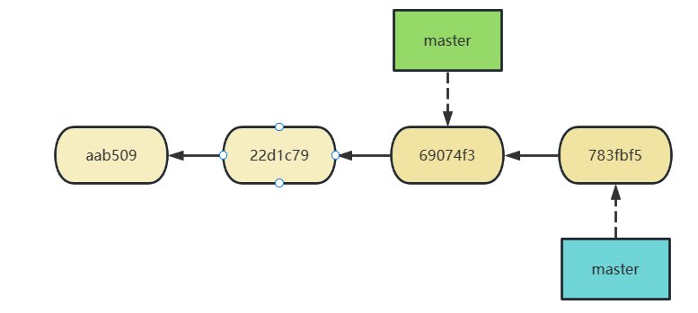

当头指针没有执行某个分支的头部时，这种状态我们称为分离式指针（HEAD defached）,分离式指针的状态下可以操作代码，但是这些操作不会出现在任何分支上，所以注意不要再分离式头指针的状态下来操作仓库。在“分离头指针”的状态的操作（如add）是无效的，没有任何意义。

如果非要回到后面的节点对代码进行操作，则可以选择创建分支后再操作

```bash
git switch -c <分支名> <提交id>
```

# 十、tag标签

## 10.1 什么时tag标签

tag 可以称它为 标签。

简单的理解，tag 就是对某次 commit 的一个标识，相当于起了一个别名。

例如，在项目发布某个版本的时候，针对最后一次 commit 起一个 v2.0 这样的标签来标识里程碑的意义。

tag 有两种类型的标签 ：

- 轻量标签(lightweight)：只是某个 commit 的引用，可以理解为是一个 commit 的别名；
- 附注标签(annotated)：是存储在git仓库中的一个完整对象，包含打标签者的名字、电子邮件地址、日期时间以及其他的标签信息。它是可以被校验的，可以使用 GNU Privacy Guard (GPG) 签名并验证。

## 10.2 tag的简单使用

### 10.2.1本地tag操作

**创建tag标签**

1. 创建轻量标签

    ```bash
    # 直接给当前的提交版本创建一个【轻量标签】
    git tag [标签名]
    
    # 给指定的提交版本创建一个 【轻量标签】
    git tag [标签名] [提交版本]
    ```

    例如：

    ```
    git tag v2.0
    
    git tag v2.0 4489bac3
    ```

2. 创建附注标签

    ```bash
    # 直接给当前的提交版本创建一个 【附注标签】
    $ git tag -a [标签名称] -m [附注信息]
    
    # 给指定的提交版本创建一个【附注标签】
    $ git tag -a [标签名称] [提交版本号] -m [附注信息]
    ```

    -a：理解为 annotated 的首字符，表示附注标签；

    -m：指定附注信息；

    例如：

    ```bash
    git tag -a v2.0 -m "v2.0版本正式发布"
    
    git tag -a v2.0-release 4489bac3 -m "v2.0版本正式发布"
    ```

**查看tag标签**

1. 查看标签列表

    ```bash
    # 查看所有标签列表
    git tag
    
    # 查看模糊匹配的标签列表
    git tag -l [*标签名称筛选字符串*]  
    git tag --list [*标签名称筛选字符串*]
    ```

    例如：

    ```bash
    git tag -l "*v2.0*"
    
    git tag --list "*v2.0*"
    ```

2. 查看标签提交信息

    ```bash
    # 查看标签的信息，（轻量标签 和 附注标签 的信息是不一样的）
    git show [标签名]
    ```

查看轻量标签

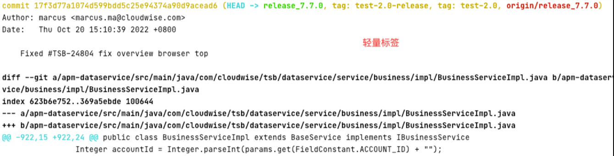

查看附注标签

​		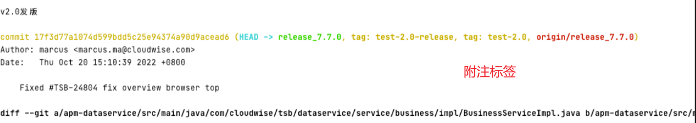

查看历史标签

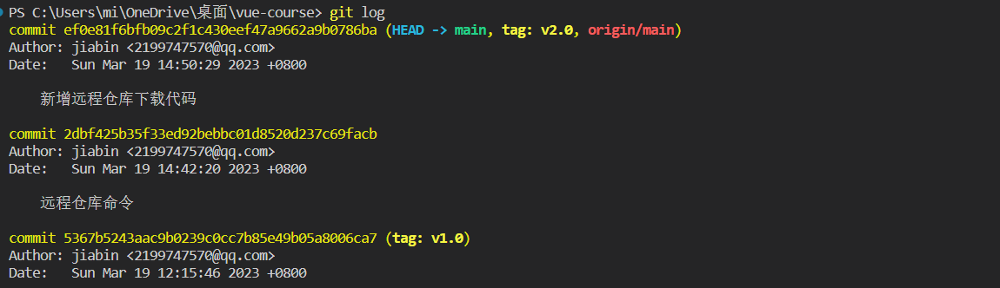

**删除tag标签**

```bash
$ git tag -d [标签名称]
```

例如：

```bash
git tag -d test-2.0
```

### 10.2.2 远程仓库tag操作

**推送tag标签到远程仓库**

```bash
# 将指定的标签上传到远程仓库
git push origin [标签名称]

# 将所有不在远程仓库中的标签上传到远程仓库
git push origin --tags
```

例如：

```bash
git push origin test-2.0
```

> 注：默认情况下，git push 命令并不会把标签推送到远程仓库中，必须手动地将 本地的标签 推送到远程仓库中。

**删除远程仓库tag标签**

```bash
git push origin  :regs/tags/[标签名称]

git push origin --delete [标签名称]
```

例如：

```bash
git push origin :regs/tags/test-2.0

git push origin --delete test-2.0
```

### 10.2.3 检出标签

**检出标签的理解：**是在这个标签的基础上进行其他的开发或操作。

检出标签的操作实质：是以标签指定的版本为基础版本，新建一个分支，继续其他的操作。

因此 ，就是新建分支的操作了。

```bash
git checkout -b [分支名称] [标签名称]
```

# 十一、.gitignore的用法

## 11.1 Git忽略文件.gitignore详解

在工程中，并不是所有文件都需要保存到版本库中的，例如“target”目录及目录下的文件就可以忽略。在Git工作区的根目录下创建一个特殊的.gitignore文件，然后把要忽略的文件名填进去，Git就会自动忽略这些文件或目录。

## 11.2 Git 忽略规则优先级

在 .gitingore 文件中，每一行指定一个忽略规则，Git 检查忽略规则的时候有多个来源，它的优先级如下（由高到低）：

1. 从命令行中读取可用的忽略规则
2. 当前目录定义的规则
3. 父级目录定义的规则，依次递推
4. $GIT_DIR/info/exclude 文件中定义的规则
5. core.excludesfile中定义的全局规则

## 11.3 Git 忽略规则匹配语法

在 .gitignore 文件中，每一行的忽略规则的语法如下：

```.gitignore
* 空格不匹配任意文件，可作为分隔符，可用反斜杠转义
* 开头的文件标识注释，可以使用反斜杠进行转义
* ! 开头的模式标识否定，该文件将会再次被包含，如果排除了该文件的父级目录，则使用 ! 也不会再次被包含。可以使用反斜杠进行转义
* / 结束的模式只匹配文件夹以及在该文件夹路径下的内容，但是不匹配该文件
* / 开始的模式匹配项目跟目录
* 如果一个模式不包含斜杠，则它匹配相对于当前 .gitignore 文件路径的内容，如果该模式不在 .gitignore 文件中，则相对于项目根目录
* ** 匹配多级目录，可在开始，中间，结束
* ? 通用匹配单个字符
* * 通用匹配零个或多个字符
* [] 通用匹配单个字符列表
```

常用匹配示例

```.gitignore
bin/: 忽略当前路径下的bin文件夹，该文件夹下的所有内容都会被忽略，不忽略 bin 文件
/bin: 忽略根目录下的bin文件
/*.c: 忽略 cat.c，不忽略 build/cat.c
debug/*.obj: 忽略 debug/io.obj，不忽略 debug/common/io.obj 和 tools/debug/io.obj
**/foo: 忽略/foo, a/foo, a/b/foo等
a/**/b: 忽略a/b, a/x/b, a/x/y/b等
!/bin/run.sh: 不忽略 bin 目录下的 run.sh 文件
*.log: 忽略所有 .log 文件
config.php: 忽略当前路径的 config.php 文件
```

## 11.4 .gitignore规则不生效

.gitignore只能忽略那些原来没有被track的文件，如果某些文件已经被纳入了版本管理中，则修改.gitignore是无效的。

解决方法就是先把本地缓存删除（改变成未track状态），然后再提交:

```bash
git rm -r --cached .
git add .
git commit -m 'update .gitignore'
```

**你想添加一个文件到Git，但发现添加不了，原因是这个文件被.gitignore忽略了：**

```bash
git add App.class
The following paths are ignored by one of your .gitignore files:
App.class
Use -f if you really want to add them.
```

如果你确实想添加该文件，可以用-f强制添加到Git：

```bash
git add -f App.class
```

或者你发现，可能是.gitignore写得有问题，需要找出来到底哪个规则写错了，可以用git check-ignore命令检查：

```bash
git check-ignore -v App.class
.gitignore:3:*.class    App.class
```

Git会告诉我们，.gitignore的第3行规则忽略了该文件，于是我们就可以知道应该修订哪个规则。
