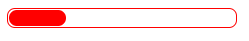
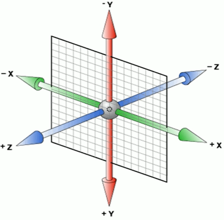
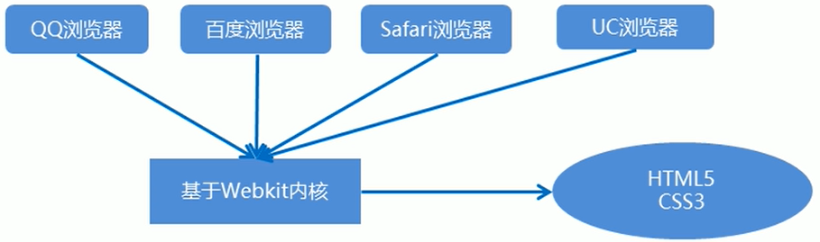

# HTML

# 一、基础认知

## **1.1 HTML页面固定结构**

- 网页类似于一篇文章：

每一页文章的内容是由固定结构的，如：开头，正文，落款等........

网页中也是存在固定结构的。如：整体，头部，标题，主体

- 网页中的固定结构是要通过特殊的**HTML标签**进行描述的

```html
<!DOCTYPE html>
<html lang="en">
<head>
    <meta charset="UTF-8">
    <meta http-equiv="X-UA-Compatible" content="IE=edge">
    <meta name="viewport" content="width=device-width, initial-scale=1.0">
    <title>Document</title>
</head>
<body>

</body>
</html>
```

HTML骨架结构构成：

- html标签：网页的整体
- head标签：网页的头部
- body标签：网页的身体
- title标签：网页的标题

## 1.2 TDK三大标签SEO优化

<font color="red">SEO(Search Engine Optimization)</font>汉译为<font color="red">搜索引擎优化</font>，是一种利用搜索引擎的规则提高网站在有关搜索引擎内自然排名的方式。

SEO的目的是<font color="red">对网站进行深度的优化</font>，从而帮助网站获取免费的流量，进而在搜索引擎上提高网站的排名，提高网站的知名度。

页面必须有三个标签用来符合SEO优化。

**title网站标题**

title具有不可代替性，是我们内页的第一个重要的标签，是搜索引擎了解网页的入口和对网页主题归属的最佳判断点。

建议：<font color="red">网站名(产品名)-网站的介绍</font>（尽量不要超过30个汉字）

例如：

京东(JD.COM)-综合网购首选-正品保证、品质保障、配送及时、轻松购物！

小米商城 - Xiaomi 12、Redmi K50、MIX FOLD，小米电视官方网站

```html
<title>小米商城 - Xiaomi 12、Redmi K50、MIX FOLD，小米电视官方网站</title>
```

**description网站说明**

<font color="red">简要说明网站主要是做什么的</font>

description作为网站的总体业务和主题概括，多采用“我们是...”、“我们提供...”、“***网作为...”、“电话：010...”之类语句。

例如：

```html
<meta name="description" content="京东(JD.COM)-专业的综合网上购物商城,
    销售家电、数码通讯、电脑、家居百货、服装服饰、母婴、图书、食品等数万个
    品牌优质商品.便捷、诚信的服务，为您提供愉悦的网上购物体验">
```

**keywords关键字**

<font color="red">keywords是页面关键字，是搜索引擎的关注点之一。</font>

keywords最好限制为6~8个关键字，关键字之间用英文逗号隔开，采用<font color="red">关键字1,关键字2</font>的形式。

例如：

```html
<meta name="keywords" content="网上购物,网上商城,手机,电脑,笔记本,平板,配件">
```

# 二、语法规范

## **2.1 html的注释：**

注释作用：

- 为代码添加的具有解释性，描述性的信息，主要用来帮助开发人员理解代码
- 浏览器执行代码时会忽略所有注释

注释快捷键：

- 在VS Code中：ctrl+/

## **2.2 html标签的构成：**

标签结构图：

1. 双标签：

​        <font color="red">`<strong>文字要变粗</strong>`</font>

2. 单标签：

   <font color="red"> `<br>`，`<hr>`</font>
   
   

结构说明：

1. 标签有<、>、/、英文单词和字母组成，并且把标签中<>包括起来的英文单词或字母称为**标签名**。
2. 常见标签有两部分组成，我们称之为：**双标签**。前部分交**开始标签**，后部分叫**结束标签**，两部分之间包裹内容。
3. 少部分标签有一部分组成，我们称之为：**单标签**。自成一体，无法包裹内容。

## **2.3 html标签的关系：**

1. 父子关系（嵌套关系）：

```html
<head>
    <title></title>
</head>
```

2. 兄弟关系（并列关系）：

```html
<head></head>
<body></body>
```

# 三、HTML标签

## 3.1 排版标签

### 3.1.1 标题标签

场景：在新闻和文章中，都离不开**标题**，用来突出显示文章主题

代码：h系列标签

```html
<h1>一级标题</h1>， 
<h2>二级标题</h2>
<h3>三级标题</h3>
<h4>四级标题</h4>
<h5>五级标题</h5>
<h6>六级标题</h6>
```

语义：1~6级标题，重要程度依次递减

特点：

- 文字都有加粗
- 文字都变大，并且从h1~h6文字逐渐减小
- 独占一行

### 3.1.2 段落标签

场景：在新闻和文章中，用于分段显示

代码：<font color="red">`<p>我是一段文字</p>`</font>

语义：段落

特点：

- 段落之间存在间隙
- 独占一行

### 3.1.3 换行标签

场景：让文字强制换行显示

代码：<font color="red">`<br>`</font>

语义：换行

特点：

- 单标签
- 让文字强制换行

### 3.1.4 水平线标签

场景：分割不同主题内容的水平线

代码：<font color="red">`<hr>`</font>

语义：主题的分割转换

特点：

- 单标签
- 在页面中显示一条水平线

## 3.2 文本格式化标签

场景：需要让文字**加粗**，<u>下划线</u>，*倾斜*，~~删除线~~等效果

代码：

| 标签  | 说明  |
|:---:|:---:|
| b   | 加粗  |
| u   | 下划线 |
| i   | 倾斜  |
| s   | 删除线 |

| 标签     | 说明  |
|:------:|:---:|
| strong | 加粗  |
| ins    | 下划线 |
| em     | 倾斜  |
| del    | 删除线 |

语义：突出重要性的强调语境

**标签语义化（了解）：**

实际项目开发中选择标签的原则：标签化语义

- 即：根据语义选择正确的标签

- 如：需要写标题，使用h标签

- 如：需要些段落，使用p标签

- ......

好处：

- 对人：好理解，好记忆
- 对机器：有利于机器解析，对搜索引擎（SEO）有帮助

推荐：

- strong，ins，em，del，表示的强调语义更强烈

## 3.3 媒体标签

### 3.3.1 图片标签

场景：在网页中显示图片

代码：<font color="red">``</font>

特点：

- 单标签

- img标签需要展示对应的效果，需要借助标签的属性进行设置

- **<font color="red">属性名=</font><font color="blue">"属性值"</font>**

属性注意点：

- 标签的属性写在**<font color="red">开始标签内</font>**
- 标签上可以存在多个属性
- 属性可以用空格隔开
- 标签名与属性之间<font color="red">**必须以空格隔开**</font>
- 属性之间没有顺序之分

完整格式：

```html

```

**图像标签的属性：**

| 属性     | 属性值  | 说明                 |
| ------ | ---- | ------------------ |
| src    | 图片路径 | 必须属性               |
| alt    | 文本   | 替换文本。图像不能显示时显示的文字  |
| title  | 文本   | 提示文本。鼠标放到图像上，显示的文字 |
| width  | 像素   | 设置图像的宽度            |
| height | 像素   | 设置图像的高度            |
| border | 像素   | 设置图像的边框粗细          |

**图像标签属性注意点：**

1. 图像标签可以拥有多个属性，必需写在标签名的后面。
2. 属性之间不分先后顺序，标签名与属性，属性与属性之间均以空格分开。
3. 属性采取键值对的格式，即key="value"的格式，属性="属性值"。

### 3.3.2 路径

场景：页面需要加载图片，需要先找到对应的图片

路径分类：

- 绝对路径（了解）：

  绝对路径：指目录下的绝对路径，可直接到达目标位置，通常从盘符<font color="red">**开始的路径**</font>。

  例如：

  - 盘符开头：D:\day01\img\1.jpg

- 相对路径（常用）：

  相对路径：从当前<font color="red">**文件开始出发**</font>找目标文件的过程

  相对路径分类

  - 同级目录：当前文件和目标文件在同一目录中

    写法一：``

    写法二：``

  - 下级目录：目标文件在下级目录中

    写法：``

  - 上级目录：目标文件在上级目录中

    写法：

    ``：../ 返回上一级后寻找code.gif

    ``：返回上一级后在img文件夹下寻找code.gif

### 3.3.3 音频标签

场景：在网页中插入音频

代码：<font color="red">`<audio src="./music.mp3" controls><audio>`</font>

常见属性：

| 属性名      | 功能             |
|:--------:|:--------------:|
| src      | 音频的路径          |
| controls | 显示播放的控件        |
| autoplay | 自动播放（部分浏览器不支持） |
| loop     | 循环播放           |

完整格式：

注意点：

- 音频标签目前支持三种格式：<font color="red">**MP3**</font>，Wav，Ogg

### 3.3.4 视频标签

场景：在页面中插入视频

代码：<font color="red">`<video src="./video.mp4" controls></video>`</font>

常见属性：

| 属性名      | 功能                         |
|:--------:|:--------------------------:|
| src      | 音频的路径                      |
| controls | 显示播放的控件                    |
| autoplay | 自动播放（谷歌浏览器中需配合muted实现静音播放） |
| muted    | 静音播放                       |
| loop     | 循环播放                       |

注意点：

视频标签目前支持三种格式：<font color="red">**MP4**</font>，WebM，Ogg

## 3.4 链接标签

**链接标签的介绍**

场景：点击之后，从一个页面跳转到另一个页面

称呼：a标签，超链接，锚标签

代码：<font color="red">`<a href="./目标网页.html">超链接</a>`</font>

特点：

- 双标签，内部可以包裹内容
- 如果需要使用a标签点击之后去指定页面，需要设置a标签的href属性

实现：

```html
<!--href:跳转地址-->
<a href="http://www.baidu.com/">百度一下</a>
<br>
<a href="01.html">跳转至01页面</a>
<br>
<!--网站开发初期，不知道跳转地址时，herf的值书写为#（空链接）-->
<a href="#">空链接，不知道跳转去哪儿</a>
```

********链接标签的target属性****

属性名：target

属性值：目标网页的打开形式

| 取值     | 效果                  |
|:------:|:-------------------:|
| _self  | 默认值，在当前窗口中跳转（覆盖原网页） |
| _blank | 在新窗口中跳转（保留原网页）      |

实现：

```html
<a href="http://www.baidu.com/" targer="_blank">百度一下</a>
```

**链接分类：**

1. 外部链接：例如`<a href="http://www.baidu.com/" >百度一下</a>`。
2. 内部链接：网站内部页面之间有相互链接，直接链接内部页面名称即可，例如`<a href="index.html">首页</a>`。
3. 空链接：如果当时没有确定链接目标时，`<a href="#">首页</a>`。
4. 下载链接：如果href里面地址是一个文件或者压缩包，会下载这个文件。
5. 网页元素链接：在网页中的各种网页元素，如文本，图像，表格，音频，视频等都可以添加超链接。
6. 锚点链接：当我们点击链接，可以快速定位到页面的某个位置。
   - 在链接文本的href属性中，设置属性值为"#名字"的形式，如：`<a href="#two">第二季</a>`。
   - 找到目标位置标签，里面添加一个id属性=刚才的名字，如：`<h3 id="two">第2集介绍</h3>`

## 3.5 列表标签

### 3.5.1 列表的应用场景

场景：在网页中按照行展示关联性的内容，如：新闻列表，排行榜，账单等

特点：按照行的方式，整齐显示内容

种类：无序列表，有序列表，自定义列表

### 3.5.2 无序列表

场景：在网页中表示一组无顺序之分的列表，如：新闻列表

标签组成：

| 标签名 | 说明                    |
|:---:|:---------------------:|
| ul  | 表示无序列表的整体，用于包裹li标签    |
| li  | 表示无序列表的每一项，用于包含每一行的内容 |

显示特点：

- 列表的每一项前默认用圆点标识

注意点：

- ul标签中只允许包含li标签

- li标签可以包含任意内容

实现：

```html
<ul>
    <li>无序列表1</li>
    <li>无序列表2</li>
    <li>无序列表3</li>
</ul>
```


### 3.5.3 有序列表

场景：在网页中表示一组有顺序之分的列表，如：排行榜

标签组成：

| 标签名 | 说明                    |
|:---:|:---------------------:|
| ol  | 表示有序列表的整体，用于包裹li标签    |
| li  | 表示无序列表的每一项，用于包含每一行的内容 |

显示特点：

- 列表的每一项前默认用序号标识

注意点：

- ol标签中只允许包含li标签

- li标签可以包含任意内容

实现：

```html
<ol>
    <li>有序列表1</li>
    <li>有序列表2</li>
    <li>有序列表3</li>
</ol>
```


### 3.5.4 自定义列表

场景：在网页的底部导航中通常会使用自定义列表实现

标签组成：

| 标签名 | 说明                     |
|:---:|:----------------------:|
| dl  | 表示自定义列表的整体，用于包裹dt/dd标签 |
| dt  | 表示自定义列表的主题             |
| dd  | 表示自定义列表的针对主题的每一项内容     |

显示特点：

- dd前会默认显示缩进效果

注意点：

- dl标签中只允许包含dt/dd标签

- dt/dd标签可以包含任意内容

实现：

```html
<dl>
    <dt>帮助中心</dt>
    <dd>账户中心</dd>
    <dd>购物指南</dd>
</dl>
```


## 3.6 表格标签

### 3.6.1 表格基本标签

场景：在网页中以行+列的单元格的方式整齐展示和数据，如：学生成绩表

基本标签：

| 标签名   | 说明             |
|:-----:|:--------------:|
| table | 表格整体，可用于包裹多个tr |
| tr    | 表格每行，可用于包裹td   |
| td    | 表格单元格，可用于包裹内容  |

注意点：

- 标签的嵌套关系：table>tr>td

### 3.6.2 表格相关属性

场景：设置表格基本展示效果

常见相关属性：

| 属性名         | 属性值               | 效果                    |
|:-----------:|:-----------------:|:---------------------:|
| border      | 像素值               | 表格边框                  |
| width       | 像素值/百分比           | 表格宽度                  |
| height      | 像素值/百分比           | 表格高度                  |
| align       | left、center、right | 表格相对周围元素的对齐方式         |
| cellpadding | 像素值               | 规定单元边沿与其内容之间的空白，默认1像素 |
| cellspacing | 像素值               | 规定单元格之间的空白，默认2像素      |

注意点：

- 实际开发时针对样式效果<font color="red">**推荐使用css样式**</font>

实现：

```html
<!-- 实际开发时针对样式效果推荐使用css样式 -->
<table border="1px" width="500px" height="100px">
    <tr>
        <td>姓名</td>
        <td>成绩</td>
        <td>评语</td>
    </tr>
    <tr>
        <td>小哥哥</td>
        <td>100分</td>
        <td>真帅气</td>
    </tr>
    <tr>
        <td>小姐姐</td>
        <td>100分</td>
        <td>真漂亮</td>
    </tr>
    <tr>
        <td>总结</td>
        <td>郎才女貌</td>
        <td>郎才女貌</td>
    </tr>
</table>
```


### 3.6.3 表格标题和表头单元格标签

场景：在表格中表示整体大标题和一列小标题

其他标签：

| 标签名     | 名称    | 说明                              |
|:-------:|:-----:|:-------------------------------:|
| caption | 表格大标题 | 表示表格整体大标题，默认在表格整体顶部居中位置显示       |
| th      | 表头单元格 | 表示一列小标题，通常用于表格第一行，默认内部文字加粗并居中显示 |

注意点：

- caption标签书写在table标签内部

- th标签书写在tr标签内部（用于替换td标签）

实现：

```html
<!-- 实际开发时针对样式效果推荐使用css样式 -->
<table border="1px" width="500px" height="100px">
    <caption>学生成绩单</caption>
    <tr>
        <th>姓名</th>
        <th>成绩</th>
        <th>评语</th>
    </tr>
    <tr>
        <td>小哥哥</td>
        <td>100分</td>
        <td>真帅气</td>
    </tr>
    <tr>
        <td>小姐姐</td>
        <td>100分</td>
        <td>真漂亮</td>
    </tr>
    <tr>
        <td>总结</td>
        <td>郎才女貌</td>
        <td>郎才女貌</td>
    </tr>
</table>
```


### 3.6.4 表格的结构标签（了解）

场景：让表格的内容结构分组，突出表格的不同部分（头部，主题，底部），使语义更加清晰

其他标签：

| 标签名   | 名称   |
|:-----:|:----:|
| thead | 表格头部 |
| tbody | 表格主体 |
| tfoot | 表格底部 |

注意点：

- 表格结构标签内部用于包裹tr标签

- 表格的结构标签可以忽略

实现：

```html
<!-- 实际开发时针对样式效果推荐使用css样式 -->
<table border="1px" width="500px" height="100px">
    <caption>学生成绩单</caption>
    <thead>
       <tr>
            <th>姓名</th>
            <th>成绩</th>
            <th>评语</th>
       </tr>  
    </thead>
    <tbody>
       <tr>
            <td>小哥哥</td>
            <td>100分</td>
            <td>真帅气</td>
       </tr>
       <tr>
            <td>小姐姐</td>
            <td>100分</td>
            <td>真漂亮</td>
       </tr>  
    </tbody>
    <tfoot>
       <tr>
            <td>总结</td>
            <td>郎才女貌</td>
            <td>郎才女貌</td>
       </tr>
   </tfoot> 
</table>
```

### 3.6.5 合并单元格

场景：将水平或垂直多个单元格合并成一个单元格

合并单元格步骤：

1. 明确合并哪几个单元格

2. 通过左上原则，确定保留谁删除谁

   - 上下合并，只保留最上的，删除其他

   - 左右合并，只保留最左的，删除其他

3. 给保留的单元格设置：跨行合并（rowspan）或跨列合并（colspan）

| 属性名     | 属性值      | 说明               |
|:-------:|:--------:|:----------------:|
| rowspan | 合并单元格的个数 | 跨行合并，将多行的单元格垂直合并 |
| colspan | 合并单元格的个数 | 跨列合并，将多列的单元格水平合并 |

注意点：

- 只有同一个结构标签中的单元格才能合并，不能夸结构标签合并（不能跨：thead，tbody，tfoot）

## 3.7 表单标签

### 3.7.1 input系列标签

**input系列标签**

场景：在网页中显示收集用户信息的表单效果，如：登录页，注册页

标签名：**<font color="red">input</font>**

- input标签可以通过<font color="red">**type属性值的不同**</font>，展示不同的效果

type属性值：

| 属性值      | 描述                                |
| -------- | --------------------------------- |
| button   | 定义可点击按钮（多数情况下，用于通过JavaScript启动脚本） |
| checkbox | 定义复选框                             |
| file     | 定义输入字段和“浏览”按钮，供文件上传               |
| hidden   | 定义隐藏的输入字段                         |
| image    | 定义图像形式的提交按钮                       |
| passowrd | 定义密码字段，该字段中的字符被掩码                 |
| radio    | 定义单选按钮                            |
| reset    | 定义重置按钮。重置按钮会清除表单中的所有数据            |
| submit   | 定义提交按钮，提交按钮会把表单数据发送到服务器           |
| text     | 定义单行的输入字段，用户可在其中输入文本，默认宽度为20个字符   |

**input系列标签—占位符**

场景：在网页中显示<font color="red">**输入单行文本**</font>的表单控件

type属性值：text

常用属性：

| 属性名         | 说明              |
|:-----------:|:---------------:|
| placeholder | 占位符，提示用户输入文本的内容 |

**input系列标签—单选框**

场景：在网页中显示<font color="red">**多选一的单选**</font>表单控件

type属性值：radio

常用属性：

| 属性名     | 说明                                 |
|:-------:|:----------------------------------:|
| name    | 分组，有相同name属性值的单选框为一组，一组中同时只能有一个被选中 |
| checked | 默认选中                               |

注意点：

- name属性对于单选框有分组功能

- 有相同name属性值的单选框为一组，一组中同时只能有一个被选中

实现：

```html
<form action="">
    <input type="radio" name="gender" value="male"> 男
    <input type="radio" name="gender" value="female"> 女
</form>
```


**input系列标签—多选框**

场景：在网页中显示<font color="red">**多选**</font>表单控件

type属性值：checkbox

常用属性：

| 属性名     | 说明                                 |
|:-------:|:----------------------------------:|
| name    | 分组，有相同name属性值的单选框为一组，一组中同时只能有一个被选中 |
| checked | 默认选中                               |

注意点：

- name属性对于单选框有分组功能

- 有相同name属性值的单选框为一组，一组中能有多个被选中

实现：

```html
<form action="">
    车型：
    <input type="checkbox" name="car" value="car1">雅阁
    <input type="checkbox" name="car" value="car2">思域
    <input type="checkbox" name="car" value="car3">特斯拉
    <input type="checkbox" name="car" value="car4">拉克萨斯
</form>
```


**input系列标签—文件选择**

场景：在网页中显示<font color="red">**文件选择的**</font>表单控件

type属性值：file

常用属性：

| 属性名      | 说明    |
|:--------:|:-----:|
| multiple | 多文件选择 |

实现：

```html
<input type="file">
```


**input按钮**

场景：在网页中显示<font color="red">**不同功能的按钮**</font>表单控件

type属性值：

| 标签名   | type属性值 | 说明                    |
|:-----:|:-------:|:---------------------:|
| input | submit  | 提交按钮，点击之后提交数据给后端服务器   |
| input | reset   | 重置按钮，点击之后恢复表单默认值      |
| input | button  | 普通按钮，默认无功能，之后配合js添加功能 |

注意点：

- 如果需要实现以上按钮空间，需要配合from标签使用

- form使用方法：用from标签吧表单标签一起包裹起来即可

用法：

```html
<form action=""> 
    用户名：<input type="text">
    <br>
    <br>
    密码：<input type="password">
    <br>
    <br>
    <!-- 按钮 -->
    <!-- value：自定义按钮名称，默认为提交 -->
    <input type="submit" value="提交">
    <input type="reset">
</form>
```


### 3.7.2 button系列标签

场景：在网页中显示用户点击的按钮

标签名：button

type属性值（同input的按钮系列）

| 标签名   | type属性值 | 说明                    |
|:-----:|:-------:|:---------------------:|
| input | submit  | 提交按钮，点击之后提交数据给后端服务器   |
| input | reset   | 重置按钮，点击之后恢复表单默认值      |
| input | button  | 普通按钮，默认无功能，之后配合js添加功能 |

注意点：

- 谷歌浏览器中的button默认是提交按钮

- button标签是双标签，更便于包裹其他内容：文字，图片等

实现：

```html
<button>按钮</button>
<button type="submit">提交按钮</button>
<button type="reset">重置按钮</button>
<button type="button">普通按钮，无功能</button>
```


### 3.7.3 select下拉菜单标签

场景：在网页中提供多个选择项的下拉菜单表单空间

标签组成：

- select标签：下拉菜单的整体

- option标签：下拉菜单的每一项

常见属性：

- selected：下拉菜单的默认选中

```html
<select name="" id="" >
    <option value="">北京</option>
    <option value="">上海</option>
    <option value="">深圳</option>
    <option value="" selected>广州</option>
</select>
```


### 3.7.4 textarea文本域标签

场景：在网页中提供可输入多行文本的表单空间

标签名：textarea

常见熟悉：

- cols：规定了文本域内可见宽度

- rows：规定了文本域内可见行数

注意点：

- 右下角可以拖拽改变大小

- 实际开发中针对样式效果推荐<font color="red">使用CSS设置</font>

实现：

```html
<textarea name="" id="" cols="30" rows="10"></textarea>
```


### 3.7.5 label标签

场景：常用语绑定内容与表单标签的关系

标签名：lable

使用方法①：

1. 使用lable标签把内容（如：文本）包裹起来
2. 在表单标签上添加id属性
3. 在lable标签的for中设置相对于的id属性值

使用方法②：

1. 直接使用lable标签把内容（如：文本）和表单标签一起包裹起来
2. 需要把lable标签的for属性删除即可

实现：

```html
性别：
<!-- 即点文字也可以实现选中 -->
<input type="radio" name="sex" id="nan"> <label for="nan">男</label>
<label><input type="radio" name="sex">女</label>
```


## 3.8 语义化标签

### 3.8.1 没有语义的标签-div和span

场景：实际开发网页是会大量的使用到div和span这两个没有语义的布局标签

div标签：一行只显示一个（独占一行）

span标签：一行可以显示多个

### 3.8.2 有语义化的标签（了解）

场景：在HTML5新版本中，推出了一些有语义的布局标签供开发者使用

标签：

| 标签名     | 语义    |
| ------- | ----- |
| header  | 网页头部  |
| nav     | 网页导航  |
| footer  | 网页底部  |
| aside   | 网页侧边栏 |
| section | 网页区块  |
| article | 网页文章  |


注意点：

- 以上标签显示特点和div一致，但是比div多了不同的语义

## 3.9 字符实体

场景：在网页中展示特殊符号效果时，需要使用字符实体代替

结构：&英文;

常见字符实体：

| 显示结果 | 描述              | 实体名称       | 实体编号 |
| :------- | :---------------- | :------------- | :------- |
|          | 空格              | ` `            | ` `      |
| <        | 小于号            | `<`            | `<`      |
| >        | 大于号            | `>`            | `>`      |
| &        | 和号              | `&`            | `&`      |
| "        | 引                | `"`            | `"`      |
| '        | 撇号              | `'` (IE不支持) | `'`      |
| ￠       | 分（cent）        | `¢`            | `¢`      |
| £        | 镑（pound）       | `£`            | `£`      |
| ¥        | 元（yen）         | `¥`            | `¥`      |
| €        | 欧元（euro）      | `€`            | `€`      |
| §        | 小节              | `§`            | `§`      |
| ©        | 版权（copyright） | `©`            | `©`      |
| ®        | 注册商标          | `®`            | `®`      |
| ™        | 商标              | `™`            | `™`      |
| ×        | 乘号              | `×`            | `×`      |
| ÷        | 除号              | `÷`            | `÷`      |

## 3.10 HTML综合案例

```html
<body>
    <h1>青春不常在，抓紧谈恋爱</h1>
    <hr>
    <form>
        昵称：<input type="text" placeholder="请输入昵称">
        <br>
        <br>
        性别：
        <label><input type="radio" name="sex" checked>男</label>
        <label><input type="radio" name="sex">女</label>
        <br>
        <br>
        所在城市：
        <select >
            <option>陕西</option>
            <option>四川</option>
            <option>重庆</option>
            <option>广州</option>
            <option>上海</option>
            <option selected>北京</option>
        </select>
        <br>
        <br>
        婚姻状况：
        <label><input type="radio" name="marriage">未婚</label>
        <label><input type="radio" name="marriage">已婚</label>
        <label><input type="radio" name="marriage">保密</label>
        <br>
        <br>
        喜欢的类型：
        <label><input type="checkbox" checked>可爱</label>
        <label><input type="checkbox" checked>性感</label>
        <label><input type="checkbox" >御姐</label>
        <label><input type="checkbox" >萝莉</label>
        <label><input type="checkbox" >小鲜肉</label>
        <label><input type="checkbox" >大叔</label>
        <br>
        <br>
        个人介绍：
        <br>
        <textarea name="" id="" cols="60" rows="10"></textarea>
        <br>
        <br>
        <h3>我承诺</h3>
        <ul>
            <li>年满18岁，单身</li>
            <li>抱着严肃的态度</li>
            <li>真诚寻找另一半</li>
        </ul>
        <label><input type="checkbox">我同意所有条款</label>
        <br>
        <br>
        <input type="submit" value="免费注册">
        <button type="reset">重置</button>
    </form>
</body>
```


# 四、HTML的class命名规范（前端类名取名）

## 4.1 常见class关键词

- 布局类：header, footer, container, main, content, aside, page, section
- 包裹类：wrap, inner
- 区块类：region, block, box
- 结构类：hd, bd, ft, top, bottom, left, right, middle, col, row, grid, span
- 列表类：list, item, field
- 主次类：primary, secondary, sub, minor
- 大小类：s, m, l, xl, large, small
- 状态类：active, current, checked, hover, fail, success, warn, error, on, off
- 导航类：nav, prev, next, breadcrumb, forward, back, indicator, paging, first, last
- 交互类：tips, alert, modal, pop, panel, tabs, accordion, slide, scroll, overlay
- 星级类：rate, star
- 分割类：group, seperate, divider
- 等分类：full, half, third, quarter
- 表格类：table, tr, td, cell, row
- 图片类：img, thumbnail, original, album, gallery
- 语言类：cn, en
- 论坛类：forum, bbs, topic, post
- 方向类：up, down, left, right
- 其他语义类：btn, close, ok, cancel, switch; link, title, info, intro, more, icon; form, label, search, contact, phone, date, email, user; view, loading…

## 4.2 页面结构

- 容器: container/wrap
- 整体宽度：wrapper
- 页头：header
- 内容：content
- 页面主体：main
- 页尾：footer
- 导航：nav
- 侧栏：sidebar
- 栏目：column
- 中间内容：center

## 4.3 导航

- 导航：nav
- 导航：mainnav/globalnav
- 子导航：subnav
- 顶导航：topnav
- 边导航：sidebar
- 左导航：leftsidebar
- 右导航：rightsidebar
- 边导航图标：sidebarIcon
- 菜单：menu
- 子菜单：submenu
- 标题: titl

## 4.4 功能

- 标志：logo
- 登录：login
- 登录条：loginbar
- 注册：regsiter
- 产品：products
- 产品价格：productsPrices
- 产品评论：productsReview
- 编辑评论：editor-review
- 最新产品：news-release
- 广告/标语：banner
- 摘要:summary
- 生产商：publisher
- 缩略图：screenshot
- 常见问题：faqs
- 关键词：keyword
- 博客：blog
- 论坛：forum
- 搜索：search
- 搜索输入框：search-input
- 搜索输出：search-output
- 搜索结果：search-results
- 加入我们：joinus
- 状态：status
- 按钮：btn
- 滚动：scroll
- 标签页：tab
- 文章列表：list
- 提示信息：msg/message
- 当前的: current
- 小技巧：tips
- 皮肤：skin
- 充值：pay
- 活动：activities
- 推广：promotion
- 公告：announcement
- 排行：ranking
- 公司简介：companyProfile
- 公司设备：equipment
- 公司荣誉：glories
- 企业文化：culture
- 企业规模：scaleScale
- 营销网络：salesNetwork
- 组织机构：organization
- 技术力量：technology
- 分支机构：branches
- 企业资质：EnterpriseQualification
- 公司实力：strengthStrength
- 经营理念：operationPrinciple
- 经理致辞：manager_oration
- 发展历程：developmentHistory
- 工程案例：EngineeringProjects
- 分类浏览：browseByCategory
- 应用领域：applicationFields
- 人力资源：humanResourceHr
- 领导致辞： leader_oration
- 客户留言：customerMessage
- 客户服务：customerService
- 您的要求：yourRequirements
- 销售信息：salesInformation
- 招商：EnterpriseEstablishing
- 教育培训：EducationTraining
- 在线交流：onlineCommunication
- 质量认证：qualityCertification
- 合作加盟：joinInCooperation
- 产品描述：productsDescription
- 业务范围：businessScope
- 产品销售：salesSales
- 联系我们：contactUs
- 信息发布：Information
- 返回首页：homepage
- 产品定购：order
- 电子商务：E-business
- 版权所有：copy Right
- 友情连结：hot Link
- 行业新闻：tradeNews
- 行业动态：trends
- 邮编：postalCodeZipcode
- 新闻动态：newsTrends
- 公司名称：companyName
- 销售热线：salesHot_Line
- 联系人：contactPerson
- 建设中：InConstruction
- 证书：certificate
- 地址：ADD/Add
- 电话：TEL/Tel
- 传真：FAX/Fax
- 产品名称：productName
- 产品说明：description
- 价格：price
- 品牌：brand
- 规格：specification
- 尺寸：size
- 生产厂家：manufacuturer
- 型号：model
- 产品标号：Item No
- 技术指标：techniqueData
- 产品描述：description
- 产地：productionPlace
- 用途：application
- 论坛：Forum
- 在线订购：on_lineOrder
- 招标：bidInviting
- 综述：general
- 业绩：achievements
- 大事：greatEvent
- 动态：trends
- 服务：service
- 投资：Investment
- 行业：Industry
- 规划：programming
- 环境：environment
- 发送：delivery
- 提交：submit
- 重写：reset
- 社区：community
- 业务：business
- 在线调查：onlineInquiry
- 下载中心：download
- 意见反馈：feedback
- 常见问题：FAQ
- 中心概况：generalProfile
- 游乐园：amusementPark
- 专题报道：specialReport
- 图标: icon
- 注释：note
- 指南：guild
- 服务：service
- 热点：hot
- 新闻：news
- 下载：download
- 投票：vote
- 商标：label/branding
- 当前位置：breadcrumb/loc
- 购物车：shop
- 标签：tag
- 信誉：siteinfo-credits
- 网站信息：siteinfo
- 法律声明：siteinfo-legal
- 合作伙伴：partner
- 友情链接：friendlink
- 版权：copyright

## 4.5 规则

- 以中划线连接，如 .item-img
- 使用两个中划线表示特殊化，如 .item-img.item-img—small 表示在 .item-img 的基础上特殊化
- 状态类直接使用单词，参考上面的关键词，如 .active, .checked
- 图标以 icon- 为前缀（字体图标采用.icon-font.i-name方式命名）
- 模块采用关键词命名，如.slide, .modal, .tips, .tabs，特殊化采用上面两个- 中划线表示，如 .imgslide—full, .modal—pay, .tips—up, .tabs—simple
- js 操作的类统一加上 js- 前缀
- 不要超过四个 class 组合使用，如 .a.b.c.d


# CSS

# 一、基础认知

## 1.1 CSS的介绍

CSS：层叠样式表(Cascading style sheets)

CSS作用：给页面中的HTML标签设置样式

写在哪里：卸载style标签中，style标签一般写在head标签里面，title标签下面

写法：CSS 规则集（rule-set）由选择器和声明块组成：

- 选择器指向您需要设置样式的 HTML 元素。

- 声明块包含一条或多条用分号分隔的声明。

- 每条声明都包含一个 CSS 属性名称和一个值，以冒号分隔。

- 多条 CSS 声明用分号分隔，声明块用花括号括起来。


实例：

```css
p {
  color: red;
  text-align: center;
}
```

解释：

- `p` 是 CSS 中的*选择器*（它指向要设置样式的 HTML 元素：`<p>`）
- `color` 是属性，`red` 是属性值
- `text-align` 是属性，`center` 是属性值

## 1.2 CSS引入方式

**内嵌式：**CSS卸载style标签中

- 提示：style标签虽然可以卸载页面任意位置，但是通常约定写在<font color="red">**head标签**</font>中

```css
<!DOCTYPE html>
<html>
<head>
<style>
body {
  background-color: linen;
}

h1 {
  color: maroon;
  margin-left: 40px;
} 
</style>
</head>
<body>
    <h1>This is a heading</h1>
    <p>This is a paragraph.</p>
</body>
</html>
```

**外联式：**CSS写在一个单独的.CSS文件中

- 提示：需要通过<font color="red">**link标签**</font>在网页中引入
- href="CSS文件路径"

```css
<link rel="stylesheet" type="text/css" href="mystyle.css">
```

**行内式：**CSS写在标签的style属性中

- 提示：之后会配合js使用

```CSS
<!DOCTYPE html>
<html>
<body>

<h1 style="color:blue;text-align:center;">This is a heading</h1>
<p style="color:red;">This is a paragraph.</p>

</body>
</html>
```

## 1.3 CSS书写顺序

1. 位置属性(position, top, right, z-index, display, float等)
2. 大小(width, height, padding, margin)
3. 文字系列(font, line-height, letter-spacing, color- text-align等)
4. 背景(background, border等)
5. 其他(animation, transition等)

# 二、CSS基础

## 2.1 基础选择器

### 2.1.1 标签选择器

结构：<font color="red">**标签名**</font>｛css属性名：属性值;｝

作用：通过标签名，找到页面中所有这类标签，设置样式

注意点：

- 标签选择器选择的是一类标签，而不是单独某一个

- 标签选择器无论是嵌套关系有多深，都能找到对应的标签

实例：

在这里，页面上的所有 `<p>` 元素都将居中对齐，并带有红色文本颜色：

```css
p {
  text-align: center;
  color: red;
}
```

### 2.1.2 类选择器

结构：<font color="red">**类名**</font>｛css属性名：属性值;｝

作用：通过类名，找到页面中所有带有这个类名的标签，设置样式

注意点：

- 所有标签上都有class属性，class属性的属性值称为<font color="red">类名</font>（类似于名字）

- 类名可以有数字，字母，下划线，中划线组成，但不能以数字或中划线开头

- 一个标签可以同时有多个类名，类名之间用空格隔开

- 类名可以重复，一个类选择器可以同时选中多个标签

实例1：

在此例中，所有带有 class="center" 的 HTML 元素将为红色且居中对齐：

```css
.center {
  text-align: center;
  color: red;
}
```

您还可以指定只有特定的 HTML 元素会受类的影响。

实例2:

在这个例子中，只有具有 class="center" 的 `<p>` 元素会居中对齐：

```css
p.center {
  text-align: center;
  color: red;
}
```

### 2.1.3 id选择器

结构：<font color="red">**#id属性值**</font>｛css属性名：属性值;｝

作用：通过id属性值，找到页面中带有id属性值的标签，设置样式

注意点：

- 所有标签上都有id属性

- id属性值类似于身份证号码，在一个页面中是唯一的，不可重复

- 一个标签上只能有一个id属性值

- 一个id选择器只能选中一个标签

- id名称不能以数字开头

实例：

这条 CSS 规则将应用于 id="para1" 的 HTML 元素：

```css
#para1 {
  text-align: center;
  color: red;
}
```

### 2.1.4 通配符选择器

结构：<font color="red">*****</font>｛css属性名：属性值;｝

作用：找到页面中所有的标签，设置样式

注意点：

开发者极少使用，只会在极特殊情况下才会用到

实例：

下面的 CSS 规则会影响页面上的每个 HTML 元素：

```css
* {
  text-align: center;
  color: blue;
}
```

### 2.1.5 分组选择器

实例：

分组选择器选取所有具有相同样式定义的 HTML 元素。

请看下面的 CSS 代码（h1、h2 和 p 元素具有相同的样式定义）：

```css
h1 {
  text-align: center;
  color: red;
}

h2 {
  text-align: center;
  color: red;
}

p {
  text-align: center;
  color: red;
}
```

最好对选择器进行分组，以最大程度地缩减代码。

如需对选择器进行分组，请用逗号来分隔每个选择器。

在这个例子中，我们对上述代码中的选择器进行分组：

```css
h1, h2, p {
  text-align: center;
  color: red;
}
```

### 2.1.6 选择器的权重

当有多个选择器，选中的是同一个元素，且都为他们定义了样式，如果属性发生冲生冲突了。<font color="red">会选择权重高的来执行。</font>

| 个数  | 选择器                                     | 权重，CSS中用四位数表示权重，权重的表达式如：0,0,0,0                                    |
|:---:|:--------------------------------------- |:------------------------------------------------------------------ |
| 1   | 类型（元素）选择器                               | 0001                                                               |
| 2   | Class选择器（类选择器）                          | 0010                                                               |
| 3   | id选择器                                   | 0100                                                               |
| 4   | 包含选择器                                   | 为包含选择符的权重之和                                                        |
| 5   | 内联样式                                    | 1000                                                               |
| 6   | !import                                 | 10000                                                              |
|     | <font color="red">CSS选择器解析规则1：  </font> | <font color="red">当不同选择符的样式设置有冲突的时候，高权重选择符的样式会覆盖低权重选择符的样式。</font>  |
|     | <font color="red">CSS选择器解析规则2：  </font> | <font color="red">相同权重的选择符，样式遵循就近原则：哪个选择符最后定义，就采用哪个选择符样式。  </font> |

## 2.2 文字样式

### 2.2.1 字体大小

属性值：<font color="red">**font-size**</font>

取值：<font color="red">数字+px</font>

注意点：

- 谷歌浏览器默认文字大小是16px

- 单位需要设置，否则无效

### 2.2.2 字体粗细

属性值：<font color="red">**font-weight**</font>

取值：

- 关键字

| 正常  | normal |
| --- | ------ |
| 加粗  | bold   |

- 纯数字：100~900的整百数：

| 正常  | 400 |
| --- | --- |
| 加粗  | 700 |

注意点：

- 不是所有字体都提供了九种粗细，因此部分取值页面中无变化

- 实际开发中：正常，加粗两种取值使用最多

### 2.2.3 字体样式（是否倾斜）

属性名：<font color="red">**font-style**</font>

取值：

- 正常（默认值）：normal

- 倾斜：italic

实例：

```html
<!DOCTYPE html>
<html lang="en">
<head>
    <meta charset="UTF-8">
    <meta http-equiv="X-UA-Compatible" content="IE=edge">
    <meta name="viewport" content="width=device-width, initial-scale=1.0">
    <title>Document</title>
    <style>
    div {
        /* 倾斜 */
        font-style:italic;
    }

    em { 
        /* 正常不倾斜 */
        font-style: normal;
    }
    </style>
</head>
<body>
    <div>div文字</div>
    <!-- em可以单独实现倾斜 -->
    <em>div文字</em>
</body>
</html>
```

### 2.2.4 字体系列 font-family

属性名：<font color="red">**font-family**</font>

常见取值：<font color="red">具体字体1，具体字体2，.....字体系列</font>

- 具体系列：微软黑雅，黑体，宋体......

- 字体系列：sans-serif，serif等.....

渲染规则：

1. 从左往右按照顺序查找，如果电脑中未安装该字体，则显示下一个字体
2. 如果都不支持，此时会根据操作系统，显示最后字体系列的默认字体

注意点：

1. 如果字体名称中存在多个单词，推荐使用引号包裹
2. 最后一项<font color="red">字体系列不需要引号包裹</font>
3. 网页开发时，尽量使用系统常见字体，保证不同用户浏览网页都可以正确显示

### 2.2.5 常见字体系列（了解）

**无衬线字体（sans-serif）:**

1. 特点：文字笔画粗细均匀，并且首尾无装饰
2. 场景：网页中大多采用无衬线字体
3. 常见该系列字体：黑体，Arial

**衬线字体（serif）:**

1. 特点：文字笔画粗细不均，并且首尾有笔锋装饰
2. 场景：报刊书籍中广泛采用
3. 常见该系列字体：宋体，Time New Roman

**等宽字体（monospace）:**

1. 特点：每个字母或者文字的宽度相等
2. 场景：一般用于程序代码编写，有利于代码的阅读和编写
3. 常见该系列字体：Consolas，fira code

### 2.2.6 层叠性

问题：

给同一个标签设置了相同的样式，此时浏览器会如何渲染?

结果：

如果给同一个标签设置了相同的属性，此时样式会层叠（覆盖），写在最下面的会生效

tip:

- CSS（Cascading style sheets）**层叠样式表**

- 所谓的层叠即叠加的意思，表示样式可以一层一层的层叠覆盖

### 2.2.7 字体font相关属性的连写

属性名：<font color="red">**font（符合属性）**</font>

取值：

- font：style weight size family;

省略要求：

- 只能省略前两个，如果省略了相当于设置了默认值

注意点：如果需要同时设置<font color="red">单独和连写</font>形式

- 要么把单独的样式写在连写下面

- 要么把单独的样式写在连写的里面

## 2.3 文本样式

### 2.3.1 文本缩进

属性名：<font color="red">**text-indent**</font>

取值：

- 数字+px

- 数字+em（推荐：1em=当前标签的font-size的大小）

### 2.3.2 文本水平对齐方式

属性名：<font color="red">**text-alignt**</font>

取值：

| 属性值    | 效果   |
|:------:|:----:|
| left   | 左对齐  |
| center | 居中对齐 |
| right  | 右对齐  |

注意点：

- 如果需要让文本水平居中，text-alignt属性给<font color="red">文本所在标签（文本的父元素）</font>设置

**水平居中方法总结text-align：center**

text-align：center能让哪些元素水平居中？

1. 文本
2. span标签，a标签
3. input标签，img标签

注意点：

- 如果需要让以上元素水平居中，text-align:center需要给以上的<font color="red">父元素</font>设置。

### 2.3.3 文本修饰

属性名：<font color="red">**text-decoration**</font>

取值：

| 属性值          | 效果   |
|:------------:|:----:|
| underline    | 下划线  |
| line-through | 删除线  |
| overline     | 上划线  |
| none         | 无装饰线 |

注意点：

- 开发中会使用<font color="red">text-decoration：none;</font>清除a标签默认的下划线

### 2.3.4 行高

作业：控制一行的上下间距

属性名：<font color="red">**line-height**</font>

取值：

- 数字+px

- 倍数（当前标签font-size的倍数）

应用：

1. 当<font color="red">单行文本</font>垂直居中可以设置<font color="red">line-height:文字父元素高度</font>

2. 网页精准布局时，会设置<font color="red">line-height:1</font>可以取消上下间距

行高与font连写的注意点：

- 如果同时设置了行高和font连写，注意覆盖问题：

- font:style weight size/line-height family;

### 2.3.5 拓展 颜色常见取值

属性名：

- 如：文字颜色：color

- 如：背景颜色：background-color

属性值：

| 颜色表示方法  | 表示含义                   | 属性值                                            |
|:-------:|:----------------------:|:----------------------------------------------:|
| 关键词     | 预定义的颜色名                | red，green，blue，yellow......                    |
| rgb表示法  | 红绿蓝三原色。每项取值范围：0~255    | rgb(0,0,0)，rgb(255,255,255)，rgb(255,0,0)...... |
| rgba表示法 | 红绿蓝三原色+a表示透明度，取值范围是0~1 | rgab(255,255,255,0.5),rgab(255,0,0,0.3)......  |
| 十六进制表示法 | #开头，将数字转换为十六进制表示       | #000000，#ff0000，#e92322，简写：#000，#f00           |

### 2.3.6 拓展 标签水平居中方法总结

标签水平居中方法总结 `margin:0 auto`

如果需要让div，p，h（大盒子）水平居中？

- 可以通过`margin:0 auto;`实现

注意点：

1. 如果需要让div，p，h（大盒子）水平居中，直接给<font color="red">当前元素本身</font>设置即可
2. margin:0 auto 一般针对于固定宽度的盒子，如果大盒子没有设置宽度，此时会默认占满父元素的宽度

# 三、CSS进阶

## 3.1 复合选择器

### 3.1.1 后代选择器：空格

作用：根据HTML标签的嵌套关系，选择父元素<font color="red">后代中</font>满足条件的元素

选择器语法：<font color="red">选择器1 选择器2｛css｝</font>

- 结果：在选择器1所找到标签的后代（儿子，孙子，重孙子......）中，找到满足选择器2的标签，设置样式

注意点：

1. 后代包括：儿子，孙子，重孙子......
2. 后代选择器中，选择器与选择器之间通过<font color="red">空格</font>隔开

实例：

```html
<!DOCTYPE html>
<html lang="zn-CH">
<head>
    <meta charset="UTF-8">
    <meta http-equiv="X-UA-Compatible" content="IE=edge">
    <meta name="viewport" content="width=device-width, initial-scale=1.0">
    <title>Document</title>
    <style>
        /* 找到div的儿子p设置文字颜色是红色 */
        /* 父选择器 后代选择器{} */
        div p{
            color: red;
        }
    </style>
</head>
<body>
    <!-- 后代：儿子，孙子，重孙子...... -->
    <p>这是一个p标签</p>
    <div>
        <p>这是div的儿子</p>  
    </div>
</body>
</html>
```


### 3.1.2 子代选择器：>

作用：根据HTML标签的嵌套关系，选择父元素<font color="red">子代中</font>满足条件的元素

选择器语法：<font color="red">选择器1>选择器2{css}</font>

结果：

- 在选择器1所找到标签的子代（儿子）中，找到满足选择器2的标签，设置样式

注意点：

1. 子代只包括：儿子
2. 子代选择器中，选择器与选择器之间通过<font color="red">**>**</font>隔开

实例：

```html
<!DOCTYPE html>
<html lang="zn-CH">

<head>
    <meta charset="UTF-8">
    <meta http-equiv="X-UA-Compatible" content="IE=edge">
    <meta name="viewport" content="width=device-width, initial-scale=1.0">
    <title>Document</title>
    <style>
        /* 空格隔开的是后代：儿子，孙子，重孙 */
        /* div a {
            color: red;
        } */

        /* 只想选中儿子 */
        /* div的儿子a文字是红色 */
        div>a {
            color: red;
        }
    </style>
</head>

<body>
    <div>
        父级：
        <a href="">这是div里面的a标签</a>
        <p>
            <a href="">这是div里面的p里面的a标签</a>
        </p>
    </div>
</body>

</html>
```


### 3.1.3 并集选择器：,

作用：同时选择多组标签，设置相同的样式

选择器语法：<font color="red">选择器1,选择器2｛css｝</font>

结果：

- 找到选择器1和选择器2选中的标签，设置样式

注意点：

1. 并集选择器的每组选择器之间通过<font color="red">**,**</font>分隔
2. 并集选择器中的每组选择器可以是基础选择器或者复合选择器
3. 并集选择器中的每组选择器通常一行写一个，提高代码的可读性

实例：

```html
<!DOCTYPE html>
<html lang="zn-CH">

<head>
    <meta charset="UTF-8">
    <meta http-equiv="X-UA-Compatible" content="IE=edge">
    <meta name="viewport" content="width=device-width, initial-scale=1.0">
    <title>Document</title>
    <style>
        p,div,span,h1{
            color:red;
        }
    </style>
</head>

<body>
    <p>p</p>
    <div>div</div>
    <span>span</span>
    <h1>h1</h1>

    <h2>h2</h2>
</body>

</html>
```


### 3.1.4  交集选择器：紧挨着

作用：选中页面中<font color="red">同时满足</font>多个选择器的标签

选择器语法：<font color="red">**选择器1选择器2｛css｝**</font>

结果：

- （既又原则）找到页面中**既**能被选择器1选中，**又**能被选择器2选中的标签，设置样式

注意点：

1. 交集选择器中的选择器之间是紧挨着的，没有东西分隔
2. 交集选择器如果有标签选择器，标签选择器必须卸载最前面

实例：

```html
<!DOCTYPE html>
<html lang="zn-CH">

<head>
    <meta charset="UTF-8">
    <meta http-equiv="X-UA-Compatible" content="IE=edge">
    <meta name="viewport" content="width=device-width, initial-scale=1.0">
    <title>Document</title>
    <style>
        /* 必须是p标签，而且添加了box类 */
        /* .box作为一个整体为类选择器 */
        p.box{
            color:red;
        }
    </style>
</head>

<body>
    <!-- 找到第一个P，带box类的，设置文字颜色为红色 -->
    <p class="box">这是p标签：box</p>
    <p>pppppp</p>
    <div class="box">这是div标签：box</div>
</body>

</html>
```


### 3.1.5 :hover 伪类选择器

作用：鼠标<font color="red">悬停</font>在元素上的<font color="red">状态</font>，设置样式

选择器语法：选择器:<font color="red">hover</font>{css}

注意点：

1. 伪类选择器选中的元素的<font color="red">某种状态</font>

实例：

```html
<!DOCTYPE html>
<html lang="zn-CH">

<head>
    <meta charset="UTF-8">
    <meta http-equiv="X-UA-Compatible" content="IE=edge">
    <meta name="viewport" content="width=device-width, initial-scale=1.0">
    <title>Document</title>
    <style>
        /* 悬停的时候，字的颜色变成红色 */
        a:hover{
            color:red;
        }
    </style>
</head>

<body>
    <a href="http://www.baidu.com">百度</a>
</body>
</html>
```


### 3.1.6 :focus 伪类选择器

作用：用于选取获得焦点的表单元素

选择器语法：选择器:<font color="red">focus</font>{css}

注意点：

- 焦点就是光标，一般情况`<input>`类表单元素才能获取，因此这个选择器也主要针对于表单元素来说。

```css
input:focus {
    background-color:yellow;
}
```

实例：

```html
<!DOCTYPE html>
<html lang="zn-CH">

<head>
    <meta charset="UTF-8">
    <meta http-equiv="X-UA-Compatible" content="IE=edge">
    <meta name="viewport" content="width=device-width, initial-scale=1.0">
    <title>Document</title>
    <style>
        input:focus {
            background-color:yellow;
        }
    </style>
</head>

<body>
    <input type="text">
    <input type="text">
    <input type="text">
</body>
</html>
```

### 3.1.7 Emmet语法

作用：通过简写语法，快速生成代码

语法：

- 类似于刚刚学习的选择器的写法

| 记忆    | 示例             | 效果                                     |
| ----- | -------------- | -------------------------------------- |
| 标签名   | div            | `<div></div>`                          |
| 类选择器  | .red           | `<div class="red"></div>`              |
| id选择器 | #one           | `<div id="one"></div>`                 |
| 交集选择器 | p.red#one      | `<div class="red" id="one"></div>`     |
| 子代选择器 | ul>li          | `<ul><li></li></ul>`                   |
| 内部文件  | ul>li{我是li的内容} | `<ul><li>我是li的内容</li></ul>`            |
| 创建多个  | ul>li*3        | `<ul><li></li><li></li><li></li></ul>` |

## 3.2 背景

### 3.2.1 背景颜色

属性名：<font color="red">**background-color**</font>（bgc）

属性值：

- 颜色取值：关键字，rgb表示法，rgba表示法，十六进制......

注意点：

- 背景颜色默认值是**透明**：rgb(0,0,0,0)，transparent
- 背景颜色不会影响盒子的大小，并且还能看清盒子的大小和位置，一般在布局中会习惯先给盒子设置背景颜色

**背景半透明：**

`background-clolr:rgba(0,0,0,0.3)`

- 最后一个参数是alpha透明度，取值范围在0~1之间

### 3.2.2 背景图片

属性名：<font color="red">**background-image**</font>（bgi）

属性值：`background-image:url('图片的路径');`

注意点：

- 背景图片中的url可以省略引号
- 背景图片默认是在水平和垂直方向平铺的
- 背景图片仅仅是指给盒子起到装饰效果，类似于背景颜色，是不能撑开盒子的

### 3.2.3 背景平铺

属性名：<font color="red">**background-repeat**</font>（bgr）

属性值：

| 取值        | 效果              |
|:---------:|:---------------:|
| repeat    | （默认值）水平和垂直方向都平铺 |
| no-repeat | 不平铺             |
| repeat-x  | 沿水平方向（x轴）平铺     |
| repeat-y  | 沿垂直方向（y轴）平铺     |

### 3.2.4 背景位置

属性名：<font color="red">**background-position**</font>（bgr） 

属性值：background-position:水平方向位置 垂直方向位置;


注意点：

- 方位名词取值和坐标取值可以混使用，第一个取值表示水平，第二个取值表示垂直
- 背景图片位置如果是英文单词可以颠倒顺序：
  - `background-position:center bottom;`和`background-position:bottom center;`效果相同
- 背景图片位置如果是数值不可以颠倒顺序：
  - `background-position:100px 50px;`和`background-position:50px 100px;`效果不相同

### 3.2.5 背景固定（背景附着）

属性名：<font color="red">**background-attachment**</font>（bg）

属性值：

| 属性值    | 说明           |
| ------ | ------------ |
| scroll | 背景图像是随对象内容滚动 |
| fixed  | 背景图像固定       |

作用：

1. 设置背景图像是否固定或者随页面的其余部分滚动
2. 后期可以制作视差滚动的效果

### 3.2.6 背景（background）相关属性的连写形式

属性名：<font color="red">**background**</font>（bg）

属性值：

- 单个属性的合写，取值之间以空格隔开

书写顺序：

- 推荐：background:color image repeat position

省略问题：

- 可以按照需求省略
- 特殊情况：在pc端，如果盒子大小和背景图片大小一样，此时可以直接写成background:url()

注意点：

- 如果需要设置单独的样式和连写

- 要么把单独的样式写在连写下面

- 要么把单独的样式写在连写的里面

### 3.2.7 背景图和img标签的区别

需求：需要在网页上展示一张图片的效果？

方法一：直接写上img标签即可

- img标签是一个标签，不设置宽高默认会以原尺寸显示

方法二：div标签+背景图片

- **需要设置div的宽高**，因为背景图片知识装饰CSS的样式，不能撑开div标签

## 3.3 元素显示方式

### 3.3.1 块级元素

显示特点：

1. 独占一行（一行只能显示一个）
2. 宽度默认是父元素的宽度，高度默认由内容撑开
3. 可以设置宽高

代表标签：

- **div，p，h系列**，ul，li，dl，dt，dd，form，header，nav，footer......

### 3.3.2 行内元素

显示特点：

1. 一行可以显示多个
2. 宽度和高度默认由内容撑开
3. 不可以设置宽高

代表标签：

- **a，span**，b，u，i，s，strong，ins，em，del......

### 3.3.3 行内块元素

显示特点：

1. 一行可以显示多个
2. 可以设置宽高

代表标签：

- **input，textarea**，buttom，select......
- 特殊情况：img标签内有行内块元素特点，但是Chrome调试工具 

### 3.3.4 元素显示模式转换

目的：改变元素默认的显示特点，让元素符合布局要求

语法：

| 属性                     | 效果       | 使用频率 |
|:----------------------:|:--------:|:----:|
| `display:block`        | 转换成块级元素  | 较多   |
| `display:inline-block` | 转换成行内块元素 | 较多   |
| `display:inline`       | 转换成行内元素  | 较少   |

### 3.3.5 HTML 嵌套规范注意点

1. 块级元素一般作为大容器，可以嵌套：文本，块级元素，行内元素，行内块元素......
   - 但是：<font color="red">p标签中不要嵌套div，p，h等块级元素</font>
2. a标签内部可以嵌套任意元素
   - 但是：<font color="red">a标签不能嵌套a便签</font>

## 3.4 CSS特性

### 3.4.1 继承性

特性：子元素有默认继承父元素样式的特点（子承父业）

可以继承的常见属性（<font color="red">文字控制继承都可以继承,</font>）

1. color
2. font-style，font-weight，font-size，font-family
3. text-indent，text-align
4. line-height
5. ......

注意点：

- 可以通过调试工具来判断样式是否可以继承

继承失效的特殊情况：如果元素有浏览器默认样式，此时继承性依然存在，但是优先显示浏览器默认样式

- a标签的color会继承失效
- h系列标签的font-size会继承失效

### 3.4.2 层叠性

特性：

1. 给同一个标签设置不同的样式，此时样式会层叠叠加，会共同作用在标签上
2. 给同一个标签设置相同的样式，此时样式会层叠覆盖，最终写在最后的样式会生效

注意点：

1. 当样式冲突时，只有当选择器优先级相同时，才能通过层叠性判断结果

### 3.4.3 优先级

 **优先级—基本测试**

特性：不同选择器具有不同的优先级，优先级高的选择器样式会覆盖优先级低的选择器样式

优先级公式：

- 继承＜通配符选择器＜标签选择器＜类选择器＜id选择器＜行内样式＜!important

注意点：

1. !important写在属性值的后面，分号写在前面！
2. !important不能提升继承的优先级，<font color="red">只要是继承优先级最低</font>
3. 实际开发中不建议使用!important

实例：

```html
<!DOCTYPE html>
<html lang="zh-CH">

<head>
    <meta charset="UTF-8">
    <meta http-equiv="X-UA-Compatible" content="IE=edge">
    <meta name="viewport" content="width=device-width, initial-scale=1.0">
    <title>Document</title>
    <style>
        #test {
            color: yellow;
        }

        .box {
            color: green;
        }

        div {
            color: blue !important;
        }

        body {
            color: red;
        }
    </style>
</head>
<body>
    <!-- 继承＜通配符选择器＜标签选择器＜类选择器＜id选择器＜行内样式＜!important -->
    <div class="box" id="test" style="color: orange;">优先级测试</div>
</body>

</html>
```

 **优先级—权重叠加计算**

场景：如果是符合选择器，此时需要通过权重叠加计算的方法，判断最终哪个选择器优先级最高会生效

权重叠加计算公式：(每一级之间不存在进位)


比较规则：

1. 先比较第一级数字，如果比较出来了，之后的通通不看
2. 如果第一级数字相同，此时再去比较第二个数字，如果比较出来了，之后的通通不看
3. ......
4. 如果最终所有的数字都相同，表示优先级相同，则比较层叠性（谁写在下面，谁说了算！）

注意点：<font color="red">!important如果不是**继承**，则权重最高，天下第一！</font>

## 3.5 综合案例

```html
<!DOCTYPE html>
<html lang="zh-CH">
<head>
    <meta charset="UTF-8">
    <meta http-equiv="X-UA-Compatible" content="IE=edge">
    <meta name="viewport" content="width=device-width, initial-scale=1.0">
    <title>Document</title>
    <style>
        a {
            text-decoration: none;
            width: 100px;
            height: 50px;
            background-color: red;
            /* a显示模式是行内，加宽高默认不生效，转显示模式：行内块 */
            display: inline-block;
            color: white;
            text-align: center;
            line-height: 50px;
        }

        a:hover {
            background-color: rgb(102, 58, 172);
        }
    </style>
</head>
<body>
    <a href="#">导航1</a>
    <a href="#">导航2</a>
    <a href="#">导航3</a>
    <a href="#">导航4</a>
    <a href="#">导航5</a>
</body>
</html>
```


## 3.6 盒子模型

### 3.6.1 盒子模型介绍

盒子的概念：

1. 页面中的每一个标签，都可以看作一个<font color="red">盒子</font>，通过盒子的视角更方便的布局
2. 浏览器在渲染（显示）网页时，会将网页中的元素看作是一个个的矩形区域，我们也形象的称之为<font color="red">盒子</font>

盒子模型：

CSS中规定每个盒子分别由：<font color="red">内容区域（content），内边距区域（padding），边框区域（border），外边距区域（margin）</font>构成，这就是<font color="red">盒子模型</font>

记忆：可以联想现实生活中的包装盒


### 3.6.2 内容（content）的宽度和高度

作用：利<font color="red">width</font>和<font color="red">height</font>属性默认设置是盒子<font color="red">内容区域</font>的大小

属性：width/height

常见取值：数字+px


### 3.6.3 边框（border）

属性名：border

属性值：单个取值的连写，取值之间以空格隔开

- 如：border:10px solid red;

快捷键：bd+tab 

**边框（border）—单方向设计：**

场景：只给盒子的某个方向单独设置边框

属性名：border-方位名词

- 上：top，下：bottom，左：left，右：right

属性值：连写的取值

**边框（border）—单个属性：**

作用：给设置边框粗细，边框样式，边框颜色效果

单个属性：

| 作用   | 属性名            | 属性值                          |
|:----:|:--------------:|:----------------------------:|
| 边框粗细 | `border-width` | 数字+px                        |
| 边框样式 | `border-style` | 实线：soild，虚线：dashed，点线：dotted |
| 边框颜色 | `border-color` | 颜色取值                         |

**边框（border）—合并边框：**

作用：<font color="red">border-collapse</font>属性控制浏览器绘制表格边框的方式。它控制相邻单元格的边框

语法：

`border-collapse:collapse;`

- collapse单词是合并的意思
- border-collapse:collapse;表示相邻边框合并在一起

### 3.6.4 综合案例（新浪导航）

```html
<!DOCTYPE html>
<html lang="zn-CH">
<head>
    <meta charset="UTF-8">
    <meta http-equiv="X-UA-Compatible" content="IE=edge">
    <meta name="viewport" content="width=device-width, initial-scale=1.0">
    <title>Document</title>
    <style>
        .box{
            height: 40px;
            border-top:3px solid #ff8500;
            border-bottom: 1px solid #edeef0;

        }
        .box a{
            /* 将行内元素转换为行内块元素 */
            display:inline-block;
            background-color:#edeef0;
            width:80px;
            height: 40px;
            text-align: center;
            line-height: 40px;
            color:#4c4c4c;
            font-size: 12px;
            text-decoration: none;
        }
        a:hover{
            color: #ff8400;
        }
    </style>
</head>
<body>
    <div class="box">
        <a href="#">新浪导航</a>
        <a href="#">新浪导航</a>
        <a href="#">新浪导航</a>
        <a href="#">新浪导航</a>
    </div>
</body>
</html>
```


### 3.6.5 内边距（padding）

padding添加了四个方向的内边距

padding属性可以当作符合属性使用，表示单独设置某个方向的内边距

padding最多取四个值

`padding:10px 20px 40px 80px;`：四值：上 右 下 左；

`padding:10px 40px 80px;`：三值：上 左右 下；

`padding:10px 80px`;：两值：上下 左右；

`padding:10px;`：一值：上 下 左 右；

实例（新浪导航-padding优化）：

```html
<!DOCTYPE html>
<html lang="zn-CH">
<head>
    <meta charset="UTF-8">
    <meta http-equiv="X-UA-Compatible" content="IE=edge">
    <meta name="viewport" content="width=device-width, initial-scale=1.0">
    <title>Document</title>
    <style>
        .box{
            height: 40px;
            border-top:3px solid #ff8500;
            border-bottom: 1px solid #edeef0;

        }
        .box a{
            /* 将行内元素转换为行内块元素 */
            display:inline-block;
            background-color:#edeef0;
            /* width:80px; */
            height: 40px;
            text-align: center;
            line-height: 40px;
            color:#4c4c4c;
            font-size: 12px;
            text-decoration: none;
            padding-left: 16px;
            padding-right: 16px;
        }
        a:hover{
            color: #ff8400;
        }
    </style>
</head>
<body>
    <div class="box">
        <a href="#">导航</a>
        <a href="#">新浪导航新浪导航</a>
        <a href="#">新浪导航</a>
        <a href="#">新浪导航</a>
    </div>
</body>
</html>
```


### 3.6.6 CSS3盒模型（自动内减）

需求：盒子尺寸300*300，背景粉色，边框10px实线黑色，上下左右20px内边距，如何完成？

- 给盒子设置border和padding时，盒子会被撑大，如果不想盒子被撑大？

解决方法1：手动内减

- 操作：自己计算多余大小，手动在内容中减去
- 缺点：项目中计算量太大，很麻烦

解决方法2：自动内减

- 操作：给盒子设置属性<font color="red">`box-sizing:border-box;`</font>即可
- 优点：浏览器会自动计算多余大小，自动在内容中减去

### 3.6.7 外边距（margin）

`margin` 属性为给定元素设置所有四个（上下左右）方向的外边距属性。

也就是 `margin-top`，`margin-right`，`margin-bottom`，和 `margin-left`四个外边距属性设置的[简写](https://developer.mozilla.org/zh-CN/docs/Web/CSS/Shorthand_properties)。

```css
/* 应用于所有边 */
margin: 1em;
margin: -3px;

/* 上边下边 | 左边右边 */
margin: 5% auto;

/* 上边 | 左边右边 | 下边 */
margin: 1em auto 2em;

/* 上边 | 右边 | 下边 | 左边 */
margin: 2px 1em 0 auto;

/* 全局值 */
margin: inherit;
margin: initial;
margin: unset;
```

`margin` 属性接受 1~4 个值。每个值可以是 `length`，`percentage`或 `auto`。取值为负时元素会比原来更接近临近元素。

- 当只指定**一个**值时，该值会统一应用到**全部四个边**的外边距上。

- 指定**两个**值时，第一个值会应用于**上边和下边**的外边距，第二个值应用于**左边和右边**。

- 指定**三个**值时，第一个值应用于**上边**，第二个值应用于**右边和左边**，第三个则应用于**下边**的外边距。

- 指定**四个**值时，依次（顺时针方向）作为**上边**，**右边**，**下边**，和**左边**的外边距。

length：以固定值为外边距

percentage：相对于包含块的*宽度*，以百分比值为外边距。

auto：让浏览器自己选择一个合适的外边距。有时，在一些特殊情况下，该值可以使**元素居中。**

**版心居中（元素居中）：**

```html
<!DOCTYPE html>
<html lang="en">
<head>
    <meta charset="UTF-8">
    <meta http-equiv="X-UA-Compatible" content="IE=edge">
    <meta name="viewport" content="width=device-width, initial-scale=1.0">
    <title>Document</title>
    <style>
        div{
            width: 1000px;
            height: 300px;
            background-color: pink;
            margin: 0 auto;
        }
    </style>
</head>
<body>
    <!-- 网页的有效内容 -->
    <!-- 版心居中 -->
    <div>版心</div>
</body>
</html>
```


**外边距合并问题：**

1. 相邻块元素垂直外边距的合并

​        当上下相邻的两个块级元素（兄弟关系）相遇时，如果上面的元素有下外边距margin-bottom，下面的元素有上外边距margin-top，则他们之间的垂直间距不是margin-bottom与margin-top之和，而是<font color="red">取两个值中的较大者。</font>


解决方法：尽量只给一个盒子添加margin值

2. 嵌套块元素垂直外边距的塌陷

​    对于两个嵌套关系（父子关系）的块元素，父元素有上外边距同时子元素也有上外边距，此时父元素会塌陷较大的外边距值。


解决方法：

1. 可以为父元素定义上边框。
2. 可以为父元素定义上内边距。
3. 可以为父元素添加overflow:hidden
4. 还有浮动，固定，绝对定位等方法。

### 3.6.8 清楚默认样式

场景：浏览器会默认给部分标签设置默认的margin和padding，但一般在项目开始前需要先清除这些标签默认的margin和padding，后续自己设置

- 比如：body标签默认有margin:8px
- 比如：p标签默认有上下的margin
- 比如：ul标签默认由上下的margin和padding-left
- ......

解决方法：

```
*{
    margin:0px;
    padding:0px;
}
```

### 3.6.9 综合案例（新闻列表）

```html
<!DOCTYPE html>
<html lang="zh-CN">

<head>
    <meta charset="UTF-8">
    <meta http-equiv="X-UA-Compatible" content="IE=edge">
    <meta name="viewport" content="width=device-width, initial-scale=1.0">
    <title>Document</title>
    <style>
        * {
            margin: 0px;
            padding: 0px;
            /* 所有标签都可能添加padding和margin，都内减模式 */
            box-sizing: border-box;
        }

        .news {
            width: 500px;
            height: 400px;
            border: 1px solid #ccc;
            margin: 50px auto;
            padding: 42px 30px 0;
        }

        .news h1 {
            /* 文字下的实现 */
            border-bottom: 1px solid #ccc;
            font-size: 30px;
            /* 行高是1倍，就是字号的大小 */
            line-height: 1;
            padding-bottom: 9px;
        }

        /* 去除列表的符号 */
        ul {
            list-style: none;
        }

        /* li{} */
        .news li {
            height: 50px;
            /* 文字下的虚线 */
            border-bottom: 1px dashed #ccc;
            line-height: 50px;
            padding-left: 28px;
        }

        .news a {
            /* 去除超链接下划线 */
            text-decoration: none;
            font-size: 18px;
            color: #666666;
        }
    </style>
</head>

<body>
    <div class="news">
        <h1>最新文章/New Articles</h1>
        <ul>
            <li><a href="#">北京招聘网页设计，平面设计，php</a></li>
            <li><a href="#">体验JavaScript的魅力</a></li>
            <li><a href="#">jquery世界来临</a></li>
            <li><a href="#">网页设计师的梦想</a></li>
            <li><a href="#">jquery中链式编程是什么</a></li>
        </ul>
    </div>
</body>

</html>
```


### 3.6.10 外边距折叠现象

**合并现象**

场景：<font color="red">垂直布局</font>的<font color="red">块级元素</font>，上下的margin会合并

结果：最终两者的距离为margin的最大值

解决方法：避免就好

- 只给其中一个盒子设置margin即可

**塌陷现象**

场景：<font color="red">互相嵌套</font>的<font color="red">块级元素</font>，子元素的<font color="red">margin-top</font>

结果：导致父元素一起往下移动

解决方式：

1. 给父元素设置border-top或者padding-top（分隔父子的margin-top）
2. 给父元素设置overflow:hidden
3. 转换成行内块元素
4. 设置浮动

### 3.6.11 行内元素的内外边距问题

行内元素 内外边距： margin padding

- 如果想要通过margin和padding改变行内标签的垂直位置，无法生效
- 行内标签的margin-top和margin-bottom    不生效
- 行内标签的padding-top和padding-bottom    不生效

可通过设置行高来改变垂直位置：`line-height:100px;`

## 3.7 CSS浮动

### 3.7.1 结构伪类选择器

**作用与优势**

1. 作用：根据元素在HTML中的结构关系查找元素
2. 优势：减少对于HTML中类的依赖，有利于保持代码整洁
3. 场景：常用于查找某父级选择器中的子元素

**选择器**

| 选择器                     | 说明                    |
|:-----------------------:|:---------------------:|
| `E:first-child{}`       | 匹配父元素中第一个子元素，并且是E元素   |
| `E:last-child{}`        | 匹配父元素中最后一个子元素，并且是E元素  |
| `E:nth-child(n){}`      | 匹配父元素中第n个子元素，并且是E元素   |
| `E:nth-last-child(n){}` | 匹配父元素中倒数第n个子元素，并且是E元素 |

实例：

```html
<!DOCTYPE html>
<html lang="zh-CN">

<head>
    <meta charset="UTF-8">
    <meta http-equiv="X-UA-Compatible" content="IE=edge">
    <meta name="viewport" content="width=device-width, initial-scale=1.0">
    <title>Document</title>
    <style>
        /* E:first-child{} */
        /* 匹配父元素中第一个子元素，并且是E元素 */
        li:first-child {
            background-color: green;
        }

        /* E:last-child{} */
        /* 匹配父元素中最后一个子元素，并且是E元素 */
        li:last-child {
            color: red;
        }

        /* E:nth-child(n){} */
        /* 匹配父元素中第n个子元素，并且是E元素 */
        li:nth-child(5) {
            background-color: aqua;
        }

        /* E:nth-last-child(n){} */
        /* 匹配父元素中倒数第n个子元素，并且是E元素 */
        li:nth-last-child(3) {
            color: coral;
        }
    </style>
</head>

<body>
    <ul>
        <li>这是第1个li</li>
        <li>这是第2个li</li>
        <li>这是第3个li</li>
        <li>这是第4个li</li>
        <li>这是第5个li</li>
        <li>这是第6个li</li>
        <li>这是第7个li</li>
        <li>这是第8个li</li>
    </ul>
</body>

</html>
```


**n的注意点**

1. n为：0、1、2、3、4、5、6、7、8、9、......
2. 通过n可以组成常见公式

| 功能       | 公式            |
|:--------:|:-------------:|
| 偶数       | 2n，even       |
| 奇数       | 2n+1，2n-1，odd |
| 找到前5个    | -n+5          |
| 找到从第五个往后 | n+5           |

### 3.7.2 伪元素

伪元素：一般页面中的非主体内容可以使用伪元素

区别：

1. 元素：HTML设置的标签
2. 伪元素：由CSS模拟出的标签效果

种类：

| 伪元素        | 作业               |
|:----------:|:----------------:|
| `::before` | 在父元素内容的最前添加一个伪元素 |
| `::after`  | 在父元素内容的最后添加一个伪元素 |

注意点：

1. 必须设置content属性才能生效
2. 伪元素默认是行内元素

实例：

```html
 <!DOCTYPE html>
<html lang="en">

<head>
    <meta charset="UTF-8">
    <meta http-equiv="X-UA-Compatible" content="IE=edge">
    <meta name="viewport" content="width=device-width, initial-scale=1.0">
    <title>Document</title>
    <style>
        .father {
            width: 300px;
            height: 300px;
            background-color: pink;
        }

        .father::before {
            /* 内容 */
            /* content元素必须添加，否则伪元素不生效 */
            content: '老鼠';
            color: red;
            /* 默认行内元素，所以宽高不生效，转换为行内块元素 */
            display: block;
            width: 100px;
            height: 100px;
            background-color: bisque;
        }

        .father::after {
            /* 内容 */
            content: '大米';
        }
    </style>
</head>

<body>
    <!-- 伪元素 通过css创建标签，装饰性不重要的小图-->
    <!-- 找父级，在这个父级里面创建子级标签 -->
    <div class="father">爱</div>
    <!-- 老鼠爱大米 -->
</body>

</html>
```


### 3.7.3 标准流

标准流：又称<font color="red">文档流</font>，是浏览器在渲染网页内容时默认采用的一套排版规则，规定了应该以何种方式排列元素

常见标准流排版规则：

1. 块级元素：从上往下，<font color="red">垂直布局</font>，独占一行
2. 行内元素 或 行内块元素：从左往右，<font color="red">垂直布局</font>，空间不够自动折行

### 3.7.4 浮动

1. 浮动元素会脱离标准流（简称：脱标），在标准流中不占位置

- 相当于从地面飘到了空中

1. 浮动元素比标准高半个级别，可以覆盖标准流中的元素
2. 浮动找浮动，下一个浮动元素会在上一个浮动元素后面左右浮动

- 浮动元素有特殊的显示效果
- 一行可以显示多个

可以设置宽高

**注意点：**

浮动的元素不能通过`text-align:center`或者`margin:0 auto`

### 3.7.5 综合案例（小米布局）

```html
<!DOCTYPE html>
<html lang="zh-CN">

<head>
    <meta charset="UTF-8">
    <meta http-equiv="X-UA-Compatible" content="IE=edge">
    <meta name="viewport" content="width=device-width, initial-scale=1.0">
    <title>小米布局</title>
    <style>
        * {
            margin: 0px;
            padding: 0px;
        }

        .top {
            height: 40px;
            background-color: #333;
        }

        .header {
            width: 1226px;
            height: 100px;
            background-color: #ffc0cb;
            margin: 0 auto;
        }

        .content {
            width: 1226px;
            height: 460px;
            background-color: green;
            margin: 0 auto;
        }

        .content_left {
            width: 234px;
            height: 460px;
            background-color: #ffa500;
            float: left;
        }

        .content_right {
            width: 992px;
            height: 460px;
            background-color: #87ceeb;
            float: left;
        }
    </style>
</head>

<body>
    <!-- 通栏的盒子，宽度与浏览器一致 -->
    <div class="top"></div>
    <div class="header">头部</div>
    <div class="content">
        <div class="content_left">left</div>
        <div class="content_right">right</div>
    </div>
</body>

</html>
```


### 3.7.6 CSS属性（书写）顺序

1. 浮动/display
2. 盒子模型：margin border padding 宽度高度背景色
3. 文字样式

### 3.7.7 综合案例（小米产品）

```html
<!DOCTYPE html>
<html lang="zh-CN">

<head>
    <meta charset="UTF-8">
    <meta http-equiv="X-UA-Compatible" content="IE=edge">
    <meta name="viewport" content="width=device-width, initial-scale=1.0">
    <title>小米产品</title>
    <style>
        * {
            margin: 0px;
            padding: 0px;
        }

        .box {
            margin: 0 auto;
            width: 1226px;
            height: 614px;
            /* background-color: aquamarine; */
        }

        .left {
            float: left;
            width: 234px;
            height: 614px;
            background-color: #800080;
        }

        .right {
            float: right;
            /* margin-left: 14px; */
            width: 978px;
            height: 614px;
            /* background-color: rgb(58, 165, 58); */
        }

        ul {
            /* 去掉无序列表符号 */
            list-style: none;
        }

        .right li {
            float: left;
            margin-right: 14px;
            margin-bottom: 14px;
            width: 234px;
            height: 300px;
            background-color: #87ceeb;
        }

        /* 清楚第四个和第八个li的右边距 */
        .right li:nth-child(4n) {
            margin-right: 0px;
            margin-bottom: 0px;
        }
    </style>
</head>

<body>
    <div class="box">
        <div class="left"></div>
        <div class="right">
            <ul>
                <li>这是第1个标签</li>
                <li>这是第2个标签</li>
                <li>这是第3个标签</li>
                <li>这是第4个标签</li>
                <li>这是第5个标签</li>
                <li>这是第6个标签</li>
                <li>这是第7个标签</li>
                <li>这是第8个标签</li>
            </ul>
        </div>
    </div>
</body>

</html>
```


### 3.7.8 综合案例（导航）

```html
<!DOCTYPE html>
<html lang="zh-CN">

<head>
    <meta charset="UTF-8">
    <meta http-equiv="X-UA-Compatible" content="IE=edge">
    <meta name="viewport" content="width=device-width, initial-scale=1.0">
    <title>导航</title>
    <style>
        * {
            margin: 0px;
            padding: 0px;
        }

        .nav {
            margin: 50px auto;
            width: 640px;
            height: 50px;
            background-color: pink;

        }

        ul {
            list-style: none;
        }

        .nav li {
            float: left;
            width: 80px;
            text-align: center;
            line-height: 50px;
        }

        .nav li a {
            text-decoration: none;
            color: white;
            font-size: 16px;

        }

        li:hover {
            background-color: skyblue;
        }
    </style>

<body>
    <!-- 导航 -->
    <div class="nav">
        <ul>
            <li><a href="#">新闻1</a></li>
            <li><a href="#">新闻2</a></li>
            <li><a href="#">新闻3</a></li>
            <li><a href="#">新闻4</a></li>
            <li><a href="#">新闻5</a></li>
            <li><a href="#">新闻6</a></li>
            <li><a href="#">新闻7</a></li>
            <li><a href="#">新闻8</a></li>
        </ul>
    </div>
</body>

</html>
```


### 3.7.9 清除浮动

**（1）清除浮动的介绍**

含义：<font color="red">清楚浮动带来的影响</font>

- 影响：如果子元素浮动了，此时子元素不能撑开标准流的块级父级元素

原因：

- 子元素浮动后脱标→不占位置

目的：

- 需要父元素有高度，从而不影响其他网页元素的布局

**（2）清除浮动的方法：**

①直接设置父元素的高度

特点：

- 优点：简单粗暴，方便
- 缺点：有些布局中不能设置固定父元素高度。如：新闻列表，京东推荐模块

②额外标签法

操作：

1. 给父元素内容的最后添加一个块级元素

   `<div class="clearfix"></div>`

   ```css
   .clearfix{
       clear:both;
   }
   ```

2. 给添加的块级元素设置`clear:both`

特点：

- 缺点：会在页面中添加额外的标签，会让页面的HTML结构变得复杂

③单伪元素清除法

操作：用伪元素代替了额外标签（即用css去实现）

基本写法：

```css
.clearfix::after{
    content: '';
    display: block;
    clear: both;
}
```

补充写法：

```css
.clearfix::after{
    content: '';
    display: block;
    clear: both;
    /* 补充代码：在网页中看不到伪元素*/
    height: 0px;
    visibility: hidden;
}
```

特点：

- 优点：在项目中使用，直接给标签加类即可清除浮动

④双伪元素清除法

操作：

```css
/*.clearfix::before作用：解决外边距塌陷问题*/
/*外边距塌陷：父子元素，都是块级，子级加margin会影响父级的位置*/

/*清除浮动*/
.clearfix::before,.clearfix::after{
    content:'';
    display:table;
}
/*真正清除浮动的标签*/
.clearfix::after{
    clear:both;
}
```

特点：

- 优点：项目中使用，直接给标签加类即可清除浮动

⑤给父元素设置：`overflow:hidden`

操作：

1. 直接给父元素设置`overflow:hidden`

特点：

- 优点：方便

## 3.8 CSS定位

### 3.8.1 定位的基本介绍

#### 网页常见布局方式

**标准流**

1. 块级元素独占一行→垂直布局
2. 行内元素/行内块元素一行显示多个→水平布局

**浮动**

可以让原本垂直布局的<font color="red">块级元素变成水平布局</font>

**定位**

可以让元素自由的摆放在网页的任意位置

一般用于<font color="red">盒子之间的层叠情况</font>

#### 定位常见的应用场景

1. 可以解决盒子与盒子之间的层叠问题
   - 定位之后的元素层级更高，可以层叠在其他盒子上面
2. 可以让盒子始终固定在屏幕中的某个位置

### 3.8.2 定位的基本使用

#### 使用定位的步骤

**设置定位方式**

属性名：position

常见属性值：

| 定位方式 | 属性值      |
|:----:|:--------:|
| 静态定位 | static   |
| 相对定位 | relative |
| 绝对定位 | absolute |
| 固定定位 | fixed    |

**设置偏移值**

偏移值设置分为两个方向，水平和垂直方向各选一个使用即可<font color="red">（ 如果left和right都有, 以left为准; top和bottom都有以top 为准）</font>

选取的原则一般是就近原则（离哪边近用哪个）

| 方向  | 属性名    | 属性值   | 含义      |
|:---:|:------:|:-----:|:-------:|
| 水平  | left   | 数字+px | 距离左边的距离 |
| 水平  | right  | 数字+px | 距离右边的距离 |
| 垂直  | top    | 数字+px | 距离上边的距离 |
| 垂直  | bottom | 数字+px | 距离下边的距离 |

#### 静态定位 static

HTML元素的默认值，即没有定位，元素出现在正常的流中。

静态定位的元素不会受到top, bottom, left, right影响。

实例：

```html
<!DOCTYPE html>
<html lang="en">
<head>
    <meta charset="UTF-8">
    <meta http-equiv="X-UA-Compatible" content="IE=edge">
    <meta name="viewport" content="width=device-width, initial-scale=1.0">
    <title>Document</title>
    <style>
        /* css书写: 1. 定位 / 浮动 / display ; 2. 盒子模型; 3. 文字属性 */
        .box {
            /* 静态定位, 默认值, 标准流 */
            position: static;
            left: 100px;
            top: 200px;

            width: 200px;
            height: 200px;
            background-color: pink;
        }
    </style>
</head>
<body>
    <p>测试定位测试定位测试定位测试定位测试定位测试定位测试定位测试定位测试定位测试定位</p>
    <p>测试定位测试定位测试定位测试定位测试定位测试定位测试定位测试定位测试定位测试定位</p>
    <p>测试定位测试定位测试定位测试定位测试定位测试定位测试定位测试定位测试定位测试定位</p>
    <p>测试定位测试定位测试定位测试定位测试定位测试定位测试定位测试定位测试定位测试定位</p>
    <p>测试定位测试定位测试定位测试定位测试定位测试定位测试定位测试定位测试定位测试定位</p>
    <div class="box">box</div>
    <p>测试定位测试定位测试定位测试定位测试定位测试定位测试定位测试定位测试定位测试定位</p>
    <p>测试定位测试定位测试定位测试定位测试定位测试定位测试定位测试定位测试定位测试定位</p>
    <p>测试定位测试定位测试定位测试定位测试定位测试定位测试定位测试定位测试定位测试定位</p>
    <p>测试定位测试定位测试定位测试定位测试定位测试定位测试定位测试定位测试定位测试定位</p>
    <p>测试定位测试定位测试定位测试定位测试定位测试定位测试定位测试定位测试定位测试定位</p>
    <p>测试定位测试定位测试定位测试定位测试定位测试定位测试定位测试定位测试定位测试定位</p>
    <p>测试定位测试定位测试定位测试定位测试定位测试定位测试定位测试定位测试定位测试定位</p>
    <p>测试定位测试定位测试定位测试定位测试定位测试定位测试定位测试定位测试定位测试定位</p>
    <p>测试定位测试定位测试定位测试定位测试定位测试定位测试定位测试定位测试定位测试定位</p>
    <p>测试定位测试定位测试定位测试定位测试定位测试定位测试定位测试定位测试定位测试定位</p>
    <p>测试定位测试定位测试定位测试定位测试定位测试定位测试定位测试定位测试定位测试定位</p>
    <p>测试定位测试定位测试定位测试定位测试定位测试定位测试定位测试定位测试定位测试定位</p>
    <p>测试定位测试定位测试定位测试定位测试定位测试定位测试定位测试定位测试定位测试定位</p>
</body>
</html>
```


#### 相对定位 relative

介绍：自恋型定位，相对于自己之前的位置进行移动

代码：<font color="red">`position:relative;`</font>

特点：

1. 需要配合方位属性实现移动
2. 相对于自己原来的位置进行移动
3. 在页面中占位置→没有脱标

应用场景：

1. 配合绝对定位组CP（子绝父相）
2. 用于小范围的移动

实例：

```html
<!DOCTYPE html>
<html lang="zh-CN">

<head>
    <meta charset="UTF-8">
    <meta http-equiv="X-UA-Compatible" content="IE=edge">
    <meta name="viewport" content="width=device-width, initial-scale=1.0">
    <title>Document</title>
    <style>
        /* 如果left和right都有, 以left为准; top和bottom都有以top 为准 */
        /* css书写: 1. 定位 / 浮动 / display ; 2. 盒子模型; 3. 文字属性 */
        .box {
            position: relative;
            right: 200px;
            bottom: 400px;
            left: 100px;
            top: 200px;
            /* 
                1. 占有原来的位置
                2. 仍然具体标签原有的显示模式特点
                3. 改变位置参照自己原来的位置
            */
            width: 200px;
            height: 200px;
            background-color: pink;
        }
    </style>
</head>

<body>
    <p>测试定位测试定位测试定位测试定位测试定位测试定位测试定位测试定位测试定位测试定位</p>
    <p>测试定位测试定位测试定位测试定位测试定位测试定位测试定位测试定位测试定位测试定位</p>
    <p>测试定位测试定位测试定位测试定位测试定位测试定位测试定位测试定位测试定位测试定位</p>
    <p>测试定位测试定位测试定位测试定位测试定位测试定位测试定位测试定位测试定位测试定位</p>
    <p>测试定位测试定位测试定位测试定位测试定位测试定位测试定位测试定位测试定位测试定位</p>
    <div class="box">box</div>
    <p>测试定位测试定位测试定位测试定位测试定位测试定位测试定位测试定位测试定位测试定位</p>
    <p>测试定位测试定位测试定位测试定位测试定位测试定位测试定位测试定位测试定位测试定位</p>
    <p>测试定位测试定位测试定位测试定位测试定位测试定位测试定位测试定位测试定位测试定位</p>
    <p>测试定位测试定位测试定位测试定位测试定位测试定位测试定位测试定位测试定位测试定位</p>
    <p>测试定位测试定位测试定位测试定位测试定位测试定位测试定位测试定位测试定位测试定位</p>
    <p>测试定位测试定位测试定位测试定位测试定位测试定位测试定位测试定位测试定位测试定位</p>
    <p>测试定位测试定位测试定位测试定位测试定位测试定位测试定位测试定位测试定位测试定位</p>
</body>

</html>
```


#### 绝对定位 absolute

介绍：拼爹型定位，相对于非静态定位的父元素进行定位移动，先找已经定位的父级, 如果有这样的父级就以这个父级为参照物进行定位;有父级, 但父级没有定位, 以浏览器窗口为参照为进行定位

代码：<font color="red">`position:absolute;`</font>

特点：

1. 需要配合方位属性实现移动
2. 默认相对于浏览器可视区域进行移动
3. 在页面中不占位置 →以及脱标
4. 改变标签的显示模式特点: 具体行内块特点(在一行共存, 宽高生效)

应用场景：

1. 配合绝对定位组CP（子绝父相）

#### 子绝父相

即：父级采用相对定位，子级采用绝对定位

```html
<!DOCTYPE html>
<html lang="en">
<head>
    <meta charset="UTF-8">
    <meta http-equiv="X-UA-Compatible" content="IE=edge">
    <meta name="viewport" content="width=device-width, initial-scale=1.0">
    <title>Document</title>
    <style>
        .father {
            position: relative;

            width: 400px;
            height: 400px;
            background-color: pink;
        }

        .son {
            /*  相对, 绝对 */
            /* 父级相对定位; 子级绝对定位 -- 子绝父相 */
            /* position: relative; */
            /* position: absolute; */
            /* right: 100px; */

            width: 300px;
            height: 300px;
            background-color: skyblue;
        }

        .sun {
            position: absolute;
            /* left: 20px;
            top: 30px; */
            right: 20px;
            bottom: 50px;

            width: 200px;
            height: 200px;
            background-color: green;
        }

        /* 绝对定位查找父级的方式: 就近找定位的父级, 如果逐层查找不到这样的父级, 就以浏览器窗口为参照进行定位 */
    </style>
</head>
<body>
    <div class="father">
        <div class="son">
            <div class="sun"></div>
        </div>
    </div>
</body>
</html>
```


#### 固定定位 fixed

介绍：死心眼型定位，相对于浏览器进行定位移动

代码：<font color="red">`position:fixed`</font>

特点：

1. 需要配合方位属性实现移动
2. 相对于浏览器可视区域进行移动
3. 在页面中不占位置→已经脱标

应用场景：

1. 让盒子固定在屏幕中的某个位置

实例：

```html
<!DOCTYPE html>
<html lang="zh-CN">
<head>
    <meta charset="UTF-8">
    <meta http-equiv="X-UA-Compatible" content="IE=edge">
    <meta name="viewport" content="width=device-width, initial-scale=1.0">
    <title>Document</title>
    <style>
        /* css书写: 1. 定位 / 浮动 / display ; 2. 盒子模型; 3. 文字属性 */
        .box {
            position: fixed;
            left: 0;
            top: 0;

            /* 
                1. 脱标-不占位置
                2. 改变位置参考浏览器窗口
                3. 具备行内块特点
            */


            width: 200px;
            height: 200px;
            background-color: pink;
        }
    </style>
</head>
<body>
    <p>测试定位测试定位测试定位测试定位测试定位测试定位测试定位测试定位测试定位测试定位</p>
    <p>测试定位测试定位测试定位测试定位测试定位测试定位测试定位测试定位测试定位测试定位</p>
    <p>测试定位测试定位测试定位测试定位测试定位测试定位测试定位测试定位测试定位测试定位</p>
    <p>测试定位测试定位测试定位测试定位测试定位测试定位测试定位测试定位测试定位测试定位</p>
    <p>测试定位测试定位测试定位测试定位测试定位测试定位测试定位测试定位测试定位测试定位</p>
    <div class="box">box</div>
    <p>测试定位测试定位测试定位测试定位测试定位测试定位测试定位测试定位测试定位测试定位</p>
    <p>测试定位测试定位测试定位测试定位测试定位测试定位测试定位测试定位测试定位测试定位</p>
    <p>测试定位测试定位测试定位测试定位测试定位测试定位测试定位测试定位测试定位测试定位</p>
    <p>测试定位测试定位测试定位测试定位测试定位测试定位测试定位测试定位测试定位测试定位</p>
    <p>测试定位测试定位测试定位测试定位测试定位测试定位测试定位测试定位测试定位测试定位</p>
    <p>测试定位测试定位测试定位测试定位测试定位测试定位测试定位测试定位测试定位测试定位</p>
    <p>测试定位测试定位测试定位测试定位测试定位测试定位测试定位测试定位测试定位测试定位</p>
    <p>测试定位测试定位测试定位测试定位测试定位测试定位测试定位测试定位测试定位测试定位</p>
    <p>测试定位测试定位测试定位测试定位测试定位测试定位测试定位测试定位测试定位测试定位</p>
    <p>测试定位测试定位测试定位测试定位测试定位测试定位测试定位测试定位测试定位测试定位</p>
    <p>测试定位测试定位测试定位测试定位测试定位测试定位测试定位测试定位测试定位测试定位</p>
    <p>测试定位测试定位测试定位测试定位测试定位测试定位测试定位测试定位测试定位测试定位</p>
    <p>测试定位测试定位测试定位测试定位测试定位测试定位测试定位测试定位测试定位测试定位</p>
    <p>测试定位测试定位测试定位测试定位测试定位测试定位测试定位测试定位测试定位测试定位</p>
    <p>测试定位测试定位测试定位测试定位测试定位测试定位测试定位测试定位测试定位测试定位</p>
    <p>测试定位测试定位测试定位测试定位测试定位测试定位测试定位测试定位测试定位测试定位</p>
    <p>测试定位测试定位测试定位测试定位测试定位测试定位测试定位测试定位测试定位测试定位</p>
    <p>测试定位测试定位测试定位测试定位测试定位测试定位测试定位测试定位测试定位测试定位</p>
    <p>测试定位测试定位测试定位测试定位测试定位测试定位测试定位测试定位测试定位测试定位</p>
    <p>测试定位测试定位测试定位测试定位测试定位测试定位测试定位测试定位测试定位测试定位</p>
    <p>测试定位测试定位测试定位测试定位测试定位测试定位测试定位测试定位测试定位测试定位</p>
    <p>测试定位测试定位测试定位测试定位测试定位测试定位测试定位测试定位测试定位测试定位</p>
    <p>测试定位测试定位测试定位测试定位测试定位测试定位测试定位测试定位测试定位测试定位</p>
    <p>测试定位测试定位测试定位测试定位测试定位测试定位测试定位测试定位测试定位测试定位</p>
    <p>测试定位测试定位测试定位测试定位测试定位测试定位测试定位测试定位测试定位测试定位</p>
    <p>测试定位测试定位测试定位测试定位测试定位测试定位测试定位测试定位测试定位测试定位</p>
    <p>测试定位测试定位测试定位测试定位测试定位测试定位测试定位测试定位测试定位测试定位</p>
    <p>测试定位测试定位测试定位测试定位测试定位测试定位测试定位测试定位测试定位测试定位</p>
    <p>测试定位测试定位测试定位测试定位测试定位测试定位测试定位测试定位测试定位测试定位</p>
    <p>测试定位测试定位测试定位测试定位测试定位测试定位测试定位测试定位测试定位测试定位</p>
    <p>测试定位测试定位测试定位测试定位测试定位测试定位测试定位测试定位测试定位测试定位</p>
    <p>测试定位测试定位测试定位测试定位测试定位测试定位测试定位测试定位测试定位测试定位</p>
    <p>测试定位测试定位测试定位测试定位测试定位测试定位测试定位测试定位测试定位测试定位</p>
    <p>测试定位测试定位测试定位测试定位测试定位测试定位测试定位测试定位测试定位测试定位</p>
    <p>测试定位测试定位测试定位测试定位测试定位测试定位测试定位测试定位测试定位测试定位</p>
    <p>测试定位测试定位测试定位测试定位测试定位测试定位测试定位测试定位测试定位测试定位</p>
    <p>测试定位测试定位测试定位测试定位测试定位测试定位测试定位测试定位测试定位测试定位</p>
</body>
</html>
```


#### 粘性定位 sticky

粘性定位可以被认为是相对定位和固定定位的混合。

语法：<font color="red">`选择器 { position: stciky; top: 10px }`</font>

特点：

1. 以浏览器的可视化窗口为参照点移动元素（固定定位特点）
2. 粘性定位<font color="red">占有原先的位置</font>（相对定位特点）
3. 必须添加top，left，right，bottom其中一个才有效

#### 定位总结

| 定位模式         | 是否脱标     | 移动位置      |
| ------------ | -------- | --------- |
| static静态定位   | 否        | 不能使用边偏移   |
| relative相对定位 | 否（占有位置）  | 相对于自身位置移动 |
| absolute绝对定位 | 是（不占有位置） | 带有定位的父级   |
| fixed固定定位    | 是（不占有位置） | 浏览器可视区    |
| sticky粘性定位   | 否（占有位置）  | 浏览器可视区    |

#### 元素的层级关系

**元素层级问题**

不同布局方式元素的层级关系：

- 标准流 < 浮动 < 定位

不同定位之间的层级关系：

- 相对，绝对，固定默认层级相同

- 此时HTML中卸载下面的元素层级最高，会覆盖上面的元素

```HTML
<!DOCTYPE html>
<html lang="zh-CN">

<head>
    <meta charset="UTF-8">
    <meta http-equiv="X-UA-Compatible" content="IE=edge">
    <meta name="viewport" content="width=device-width, initial-scale=1.0">
    <title>Document</title>
    <style>
        div {

            width: 200px;
            height: 200px;
        }

        .one {
            position: absolute;
            left: 20px;
            top: 50px;

            z-index: 1;

            background-color: pink;
        }

        .two {
            position: absolute;
            left: 50px;
            top: 100px;

            background-color: skyblue;
        }

        /* 
            默认情况下, 定位的盒子  后来者居上 ,
            z-index:整数; 取值越大, 显示顺序越靠上, z-index的默认值是0
            注意: z-index必须配合定位才生效
        */
    </style>
</head>

<body>
    <div class="one">one</div>
    <div class="two">two</div>
</body>

</html>
```


### 3.8.3 定位拓展

#### 绝对定位的盒子居中算法

需求：使用子绝父相，让子盒子在父盒子中水平居中（父子元素任意宽度下都能实现）

```html
<!DOCTYPE html>
<html lang="en">
<head>
    <meta charset="UTF-8">
    <meta http-equiv="X-UA-Compatible" content="IE=edge">
    <meta name="viewport" content="width=device-width, initial-scale=1.0">
    <title>Document</title>
    <style>
        .box {
            /* 1. 绝对定位的盒子不能使用左右margin auto居中 */
            position: absolute;
            /* margin: 0 auto; */
            /* left: 50%, 整个盒子移动到浏览器中间偏右的位置 */
            left: 50%;
            /* 把盒子向左侧移动: 自己宽度的一半 */
            /* margin-left: -150px; */

            top: 50%;
            /* margin-top: -150px; */

            /* 位移: 自己宽度高度的一半 */
            transform: translate(-50%, -50%);

            width: 400px;
            height: 300px;
            background-color: pink;
        }
    </style>
</head>
<body>

    <div class="box"></div>
</body>
</html>
```

#### 定位特殊特性

绝对定位和固定定位也和浮动类似

1. 行内元素添加绝对定位或者固定定位，可以直接设置高度和宽度。
2. 块级元素添加绝对定位或者固定定位，如果不给设置宽度和高度，默认大小是内容的大小。

#### 脱标的盒子不会触发外边距塌陷

浮动元素，绝对定位（固定定位）元素的都不会触发外边距合并的问题。

#### 绝对定位（固定定位）会完全压住盒子

浮动元素不同，指挥压住下面标准流的盒子，但是不会压住下面标准流盒子里面的文字（图片）。

但是绝对（固定定位）会压住下面标准流所有的内容。

浮动之所以不会压住文字，因为浮动产生的目的最初是为了做文字环绕效果的。文字会围绕浮动元素。

## 3.9 显示隐藏元素

类似网站广告，当我们点击关闭就不见了，但是我们重新刷新页面，会重新出现！

本质：<font color="red">让一个元素在页面中隐藏或者显示出来</font>。

### 3.9.1 display 显示隐藏

display属性用于设置一个元素应如何显示。

- `display:none;` 隐藏对象
- `display:block;` 除了转换为块级元素之外，同时还有显示元素的意思

<font color="red">display隐藏元素后，不在占有原来的位置。</font>

应用及其广泛，可以搭配js做很多的网页特效。

实例：

```html
<!DOCTYPE html>
<html lang="zh-CN">

<head>
    <meta charset="UTF-8">
    <meta http-equiv="X-UA-Compatible" content="IE=edge">
    <meta name="viewport" content="width=device-width, initial-scale=1.0">
    <title>display属性</title>
    <style>
        .peppa {
            display: none;
            /* display: block; */
            width: 200px;
            height: 200px;
            background-color: pink;
        }

        .george {
            width: 200px;
            height: 200px;
            background-color: skyblue;
        }
    </style>
</head>

<body>
    <div class="peppa">佩琪</div>
    <div class="george">乔治</div>
</body>

</html>
```


### 3.9.2 visibility 显示隐藏

<font color="red">visibility</font>属性用于指定一个元素应可见还是隐藏

- `visibility:visible;` 元素可视
- `visibility:hidden;` 元素隐藏

<font color="red">visibility隐藏元素后，继续占有原来的位置</font>

如果隐藏元素想要原来的位置，就用`visibility:hidden;` 

如果隐藏元素不想要原来的位置，就用`display:none;`（用处更多 重点）

实例：

```html
<!DOCTYPE html>
<html lang="zh-CN">

<head>
    <meta charset="UTF-8">
    <meta http-equiv="X-UA-Compatible" content="IE=edge">
    <meta name="viewport" content="width=device-width, initial-scale=1.0">
    <title></title>
    <style>
        .peppa {
            /* 元素隐藏 */
            visibility: hidden;
            /* 元素可视 */
            /* visibility: visible; */
            width: 200px;
            height: 200px;
            background-color: pink;
        }

        .george {
            width: 200px;
            height: 200px;
            background-color: skyblue;
        }
    </style>
</head>

<body>
    <div class="peppa">佩琪</div>
    <div class="george">乔治</div>
</body>

</html>
```


### 3.9.3 overflow 溢出显示隐藏

**溢出部分显示效果**

溢出部分：指的是盒子<font color="red">内容部分</font>所超出盒子范围的区域

场景：控制内容溢出部分的显示效果，如：显示，隐藏，滚动条......

属性名：<font color="red">overflow</font>

常见属性值：

| 属性值     | 效果                |
|:-------:|:-----------------:|
| visible | 默认值，溢出部分可见        |
| hidden  | 溢出部分隐藏            |
| scroll  | 无论是否溢出，都显示滚动条     |
| auto    | 根据是否溢出，自动显示或隐藏滚动条 |

注意：

- 一般情况下，我们都不想让溢出的内容显示出来，因为溢出的部分会影响布局。
- 但是如果有定位的盒子，请慎用`overflow:hidden;`，因为它会隐藏多余的部分。

实例：

```html
<!DOCTYPE html>
<html lang="zh-CN">

<head>
    <meta charset="UTF-8">
    <meta http-equiv="X-UA-Compatible" content="IE=edge">
    <meta name="viewport" content="width=device-width, initial-scale=1.0">
    <title>Document</title>
    <style>
        .box {
            width: 300px;
            height: 300px;
            background-color: pink;

            /* 溢出隐藏 */
            /* overflow: hidden; */

            /* 滚动: 无论内容是否超出都显示滚动条的位置 */
            /* overflow: scroll; */

            /* auto: 根据内容是否超出, 判断是否显示滚动条 */
            overflow: auto;
        }
    </style>
</head>

<body>
    <div class="box">
        我是div,测试溢出显示效果,我是div,测试溢出显示效果,我是div,测试溢出显示效果,我是div,测试溢出显示效果,我是div,测试溢出显示效果,我是div,测试溢出显示效果,我是div,测试溢出显示效果,我是div,测试溢出显示效果,我是div,测试溢出显示效果,我是div,测试溢出显示效果,我是div,测试溢出显示效果,我是div,测试溢出显示效果,我是div,测试溢出显示效果,我是div,测试溢出显示效果,我是div,测试溢出显示效果,我是div,测试溢出显示效果,我是div,测试溢出显示效果,我是div,测试溢出显示效果,我是div,测试溢出显示效果,我是div,测试溢出显示效果,我是div,测试溢出显示效果,我是div,测试溢出显示效果,我是div,测试溢出显示效果,我是div,测试溢出显示效果,我是div,测试溢出显示效果,我是div,测试溢出显示效果,我是div,测试溢出显示效果,我是div,测试溢出显示效果,我是div,测试溢出显示效果,我是div,测试溢出显示效果,我是div,测试溢出显示效果,我是div,测试溢出显示效果,我是div,测试溢出显示效果,我是div,测试溢出显示效果,我是div,测试溢出显示效果,我是div,测试溢出显示效果,我是div,测试溢出显示效果,我是div,测试溢出显示效果,我是div,测试溢出显示效果,我是div,测试溢出显示效果,我是div,测试溢出显示效果,我是div,测试溢出显示效果,我是div,测试溢出显示效果,我是div,测试溢出显示效果,我是div,测试溢出显示效果,我是div,测试溢出显示效果,我是div,测试溢出显示效果,我是div,测试溢出显示效果,我是div,测试溢出显示效果,我是div,测试溢出显示效果,我是div,测试溢出显示效果,我是div,测试溢出显示效果,
    </div>
</body>

</html>
```

## CSS装饰

### 3.9.3 边框圆角

场景：让盒子四个角变得圆润，增加页面细节， 提升用户体验

属性名：<font color="red">border-radius</font>

常见取值：数字+px，百分比

原理：


赋值规则：从左上角开始赋值，然后顺时针赋值，没有赋值的看对角

```html
<!DOCTYPE html>
<html lang="zh-CN">
<head>
    <meta charset="UTF-8">
    <meta http-equiv="X-UA-Compatible" content="IE=edge">
    <meta name="viewport" content="width=device-width, initial-scale=1.0">
    <title>Document</title>
    <style>
        .box {
            margin: 50px auto;
            width: 200px;
            height: 200px;
            background-color: pink;

            /* 一个值: 表示4个角是相同的 */
            border-radius: 10px;

            /* 4值: 左上  右上   右下   左下 -- 从左上顺时针转一圈 */
            /* border-radius: 10px 20px 40px 80px; */

            /* border-radius: 10px 40px 80px; */

            /* border-radius: 10px 80px; */
        }
    </style>
</head>
<body>
    <div class="box"></div>
</body>
</html>
```

**工作中常用的圆角形式：**

画一个正圆：

1. 盒子必须是正方形
2. 设置边框圆角为盒子宽高的一半→`border-radius:50%`

胶囊按钮：

1. 盒子要求是长方形
2. 设置`border-radius:盒子高度的一半`

实例：

```html
<!DOCTYPE html>
<html lang="zh-CN">
<head>
    <meta charset="UTF-8">
    <meta http-equiv="X-UA-Compatible" content="IE=edge">
    <meta name="viewport" content="width=device-width, initial-scale=1.0">
    <title>Document</title>
    <style>
        .one {
            width: 200px;
            height: 200px;
            background-color: pink;

            /* border-radius: 100px; */
            /* 50% : 取盒子尺寸的一半 */
            border-radius: 50%;
        }

        /* 胶囊状: 长方形, border-radius取值是高度的一半 */
        .two {
            width: 400px;
            height: 200px;
            background-color: skyblue;

            border-radius: 100px;
        }
    </style>
</head>
<body>
    <div class="one"></div>

    <div class="two"></div>
</body>
</html>
```


### 3.9.6 元素整体透明度

场景：让某元素整体（包括内容）一起变透明

属性名：<font color="red">opacity</font>

属性值：0~1之间的数字

- 1：表示完全不透明
- 0：表示完全透明

注意点：

- opacity会让元素整体透明，包括里面的内容，如：文字，子元素等......

实例：

```html
<!DOCTYPE html>
<html lang="zh-CN">
<head>
    <meta charset="UTF-8">
    <meta http-equiv="X-UA-Compatible" content="IE=edge">
    <meta name="viewport" content="width=device-width, initial-scale=1.0">
    <title>Document</title>
    <style>
        div {
            width: 400px;
            height: 400px;
            background-color: green;

            opacity: 0.2;
        }
    </style>
</head>
<body>
    <div>
        这个字透明吗？
    </div>
</body>
</html>
```


### 3.9.8 盒子阴影

场景：为盒子添加阴影

属性：<font color="red">`box-shadow: h-shadow v-shadow blur spread color insert;`</font>

属性值：

| 属性值      | 说明                      |
| -------- | ----------------------- |
| h-shadow | 可选。水平阴影的位置。允许负值。        |
| v-shadow | 可选。垂直阴影的位置。允许负值。        |
| blur     | 可选。模糊距离。                |
| spread   | 可选。阴影的尺寸。               |
| color    | 可选。阴影的颜色。               |
| insert   | 可选。将外部阴影（outset）改为内部阴影。 |

实例：

```html
<!DOCTYPE html>
<html lang="zh-CN">
<head>
    <meta charset="UTF-8">
    <meta http-equiv="X-UA-Compatible" content="IE=edge">
    <meta name="viewport" content="width=device-width, initial-scale=1.0">
    <title>Document</title>
    <style>
        div{
            width: 200px;
            height: 200px;
            margin: 0 auto;;
            background-color: skyblue;
            box-shadow: 10px 10px 2px rgba(0,0,0,0.3);
        }
    </style>
</head>
<body>
    <div></div>
</body>
</html>
```


### 3.9.9 文字阴影

场景：将阴影应用于文本

语法：<font color="red">`box-shadow: h-shadow v-shadow blur color;`</font>

属性值：

| 属性值      | 说明               |
| -------- | ---------------- |
| h-shadow | 可选。水平阴影的位置。允许负值。 |
| v-shadow | 可选。垂直阴影的位置。允许负值。 |
| blur     | 可选。模糊距离。         |
| color    | 可选。阴影的颜色。        |

# 四、CSS高级

## 4.1 精灵图

### 4.1.1 什么是精灵图？

一个网页中往往会应用很多很小的背景图像作为修饰，当网页中的图像过多时，服务器就会频繁地接收和发送请求图片，造成服务器请求压力过大，这将大大的降低页面的加载速度。

因此，<font color="red">为了有效的减少服务器接受和发送请求的次数，提高页面的加载速度</font>，出现了<font color="red">CSS精灵技术</font>（也称sprites，CSS雪碧）。

<font color="red">核心原理：将网页中的一些小背景图像整合到一张大图中，这样服务器只需要一次请求就可以了</font>


### 4.1.2 精灵图的使用

使用精灵图的核心：

1. 精灵技术主要针对背景图片的使用，就是把多个小背景图片整合到一张大图片中。
2. 这个大图片也成为sprites 精灵图 或者 雪碧图
3. 移动背景图片的位置，此时可以使用<font color="red">background-position</font>
4. 移动的距离就是这个目标图片的x和y坐标，注意网页中的坐标有所不同。
5. 因为一般情况下都是往上往左移动，所以数值是负值

## 4.2 字体图标

### 4.2.1 字体图标的产生

字体图标的使用场景：主要用于显示网页中通用，常用的一些小图标。

精灵图是有诸多优点的，但是缺点很明显。

1. 图片文件还是比较大的。
2. 图片本身放大和缩小会失真。
3. 一旦图片制作完毕想要更换非常复杂。

此时，有一种技术的出现很好的解决了以上问题，就是<font color="red">字体图标iconfont</font>。

<font color="red">字体图标</font>可以为前端工程师提供一种高效的图标使用方式，<font color="red">展示的是图标，本质属于字体</font>。

### 4.2.2 字体图标的优点

- 轻量型：一个图标字体要比一系列的图像要小。一旦字体加载了，图标马上就会渲染出来，减少了服务器请求
- 灵活性：本质其实是文字，可以很随意的改变文字，产生阴影，透明效果，旋转等
- 兼容性：几乎支持所有的浏览器，请放心使用

注意：字体图标不能替代精灵技术，只是对工作中部分技术的提升和优化。

**总结：**

1. 如果遇到一些结构和样式比较简单的小图标，就用字体图标
2. 如果遇到一些结构和样式复杂一点的小图标，就用精灵图。

### 4.2.3 字体图标的下载

字体图标是网页常见的小图标，我们直接网上下载即可。因此使用可以分为：

1. 字体图标的下载
2. 字体图标的引入（引入到我们的html页面中）
3. 字体图标的追加（以后添加新的小图标）

**推荐下载网站：**

- icomoon字库    http://icomoon.io 

IcoMoon成立于2011年，推出了第一个自定义图标字体生成器，它允许用户选择所需要的图标，使它成一字型。该字型内容种类繁多，非常全面，唯一的遗憾就是国外服务器，打开网速较慢。

- 阿里iconfont字库      http://www.iconfont.cn/

这是阿里巴巴M2UX的iconfont字体图标字库，包含了淘宝图标库和阿里巴巴图标库，可以使用AI制作图标上传生成，免费

### 4.4.4 字体图标的引入

**①选取字体图标**


**②将选取的字体图标添加至项目**


**③下载字体图标压缩包文件**


**④将字体文件以及CSS文件导入Web项目**


**⑤修改CSS文件字体文件索引路径以及删除默认字体大小**

```css
@font-face {
  font-family: "iconfont"; /* Project id 3272961 */
  src: url('../fonts/iconfont.woff2?t=1648085640271') format('woff2'),
       url('../fonts/iconfont.woff?t=1648085640271') format('woff'),
       url('../fonts/iconfont.ttf?t=1648085640271') format('truetype');
}

.iconfont {
  font-family: "iconfont" !important;
  font-style: normal;
  -webkit-font-smoothing: antialiased;
  -moz-osx-font-smoothing: grayscale;
}

.icon-zhaoxiangji:before {
  content: "\e663";
}
```

**⑥添加span标签以及添加字体属性（字体属性名称在CSS文件中查找）注意：设置字体font-size**

```html
<!DOCTYPE html>
<html lang="en">
<head>
    <meta charset="UTF-8">
    <meta http-equiv="X-UA-Compatible" content="IE=edge">
    <meta name="viewport" content="width=device-width, initial-scale=1.0">
    <link rel="stylesheet" href="css/iconfont.css">
    <title>Document</title>
    <style>
        span {
            font-size: 40px;
        }
    </style>
</head>
<body>
    <span class="iconfont icon-zhaoxiangji"></span>
</body>
</html>
```

**⑦添加字体图标成功**


## 4.3 CSS三角

网页中常见一些三角形，使用CSS直接画出来就可以，不必做成图标或者字体图标。

例如：京东页面三角


CSS三角实现方式：

使用 CSS 绘制三角形的第一种方法就是使用 **border** 属性。

给定一个宽度和高度都为 0 的元素，其 border 的任何值都会直接相交，我们可以利用这个交点来创建三角形。也就是说，border属性是三角形组成的，下面给每一边都提供不同的边框颜色：

```html
<!DOCTYPE html>
<html lang="zh-CN">

<head>
    <meta charset="UTF-8">
    <meta http-equiv="X-UA-Compatible" content="IE=edge">
    <meta name="viewport" content="width=device-width, initial-scale=1.0">
    <title>CSS三角</title>
    <style>
        .div1{
            width: 0px;
            height: 0px;
            border-top: 10px solid pink;
            border-right: 10px solid skyblue;
            border-bottom: 10px solid red;
            border-left: 10px solid yellow;
        }
        .div2{
            width: 0px;
            height: 0px;
            border: 10px solid transparent;
            border-left: 10px solid yellow;
        }
    </style>
</head>

<body>
    <div class="div1"></div>
    <div class="div2"></div>
</body>

</html>
```


CSS三角案例：

```html
<!DOCTYPE html>
<html lang="zh-CN">

<head>
    <meta charset="UTF-8">
    <meta http-equiv="X-UA-Compatible" content="IE=edge">
    <meta name="viewport" content="width=device-width, initial-scale=1.0">
    <title>CSS三角案例</title>
    <style>
       .jd{
        position: relative;
        margin-top: 100px;
        width: 200px;
        height: 200px;
        background-color: skyblue;
        /* margin: 0 auto; */
       }
       .jd span{
        position: absolute;
        top:-20px;
        left: 160px;
        width: 0px;
        height: 0px;
        /* 照顾兼容性 */
        line-height: 0px;
        font-size: 0px;
        border: 10px solid transparent;
        border-bottom-color:  rgb(0, 0, 0);
       }
    </style>
</head>

<body>
    <div class="jd">
        <span></span>
    </div>
</body>

</html>
```


## 4.4 用户界面样式

所谓的<font color="red">界面样式</font>，就是更改一些用户操作样式，以便提高更好的用户体验。

- 更改用户的鼠标样式
- 表单轮廓
- 防止表单域拖拽

### 4.4.1 鼠标样式 cursor

```css
li {cursor: pointer; }
```

设置或检索在对象上移动的鼠标指针采用何种系统预定义的光标类型。

| 属性值      | 描述                       |
| :---------- | :------------------------- |
| default     | 小白，默认                 |
| pointer     | 小手，提示用户可以点击     |
| move        | 移动，提示用户可以移动     |
| text        | 文本，提示用户可以选择文字 |
| not-allowed | 禁止                       |

实例：

```html
<!DOCTYPE html>
<html lang="zh-CN">
<head>
    <meta charset="UTF-8">
    <meta http-equiv="X-UA-Compatible" content="IE=edge">
    <meta name="viewport" content="width=device-width, initial-scale=1.0">
    <title>鼠标样式 cursor</title>
    <style>
        div {
            width: 200px;
            height: 200px;
            background-color: pink;

            /* 手型 */
            /* cursor: pointer; */

            /* 工字型, 表示可以复制 */
            /* cursor: text; */

            /* 十字型, 表示可以移动 */
            cursor: move;

        }
    </style>
</head>
<body>
    <div>div</div>
</body>
</html>
```

### 4.4.2 轮廓线 outline

给表单添加outline:0; 或者outline:none; 样式之后，既可以去掉默认的选中边框。

```css
input { outline:none; }
```

实例：

```html
<!DOCTYPE html>
<html lang="zh-CN">

<head>
    <meta charset="UTF-8">
    <meta http-equiv="X-UA-Compatible" content="IE=edge">
    <meta name="viewport" content="width=device-width, initial-scale=1.0">
    <title>表单轮廓线</title>
    <style>
       input{
        width: 200px;
        height: 20px;
        /* 去掉选中后的轮廓线 */
        outline: none;
       }
    </style>
</head>

<body>
    <input type="text">
</body>

</html>
```

### 4.2.3 防止拖拽文本域

实际开发中，我们文本域右下角是不可以拖拽的。

```css
textarea{ resize:none; }
```

实例：

```html
<!DOCTYPE html>
<html lang="zh-CN">

<head>
    <meta charset="UTF-8">
    <meta http-equiv="X-UA-Compatible" content="IE=edge">
    <meta name="viewport" content="width=device-width, initial-scale=1.0">
    <title>防止拖拽文本域</title>
    <style>
       textarea{
        /* 去掉选中后的轮廓线 */
        outline: none;
        /* 防止拖拽文本域 */
        resize: none;
       }
    </style>
</head>

<body>
    <textarea name="" id="" cols="30" rows="10"></textarea>
</body>

</html>
```

### 4.2.4 vertical-align实现行内块和文本垂直居中

**认识基线**

基线：浏览器文字类型元素排版中存在用于对齐的基线


**文字对齐问题**

场景：解决行内/行内块元素垂直对齐问题

问题：当图片和文字在一行中显示时，其实底部是不对称的


**垂直对齐方式**

属性名：

属性值：

|  属性值  |                   说明                   |
| :------: | :--------------------------------------: |
| baseline |     默认。元素放置在父元素的基线上。     |
|   top    |  把元素的顶端与行中最高元素的顶部对齐。  |
|  middle  |       把此元素放置在父元素的中部。       |
|  bottom  | 把元素的顶端与行中最低的元素的顶端对齐。 |

**解决图片底部默认空白缝隙问题**

bug：图片底侧会有一个空白缝隙，原因是行内块元素会和文字的基线对齐。

主要解决方法有两种：

1. 给图片添加<font color="red">`vertical-align:middle/top/bottom`</font>等。（提倡使用）
2. 给图片转换为块级元素<font color="red">`display:block;`</font>

### 4.2.5 溢出的文字省略号显示

**单行文本溢出省略号显示（必须满足三个条件）：**

```css
/* 1.先强制一行内显示文本 */
/* ( 默认normal自动换行 ) */
white-space: nowrap;
/* 2.超出的部分隐藏 */
overflow: hidden;
/* 3.文字用省略号代替超出部分 */
text-overflow: ellipsis;
```

实例：

```html
<!DOCTYPE html>
<html lang="zh-CN">

<head>
    <meta charset="UTF-8">
    <meta http-equiv="X-UA-Compatible" content="IE=edge">
    <meta name="viewport" content="width=device-width, initial-scale=1.0">
    <title>单行文本溢出省略号显示</title>
    <style>
        div {
            width: 150px;
            height: 80px;
            background-color: pink;
            margin: 100px auto;
            /* 1.先强制一行内显示文本 */
            /* ( 默认normal自动换行 ) */
            /* white-space: normal; */
            white-space: nowrap;
            /* 2.超出的部分隐藏 */
            overflow: hidden;
            /* 3.文字用省略号代替超出部分 */
            text-overflow: ellipsis;
        }
    </style>
</head>

<body>
    <div>此处省略一万字此处省略一万字</div>
</body>

</html>
```


**多行文本溢出显示省略号**

多行文本溢出显示省略号，有较大兼容性问题，适合于webkit浏览器或移动端（移动端大部分是webkit内核）

需要设置文本盒子的宽度

<font color="red">更推荐让后台人员来做这个效果，因为后台人员可以设置显示多少个字，操作更简单。</font>

```css
overflow: hidden;
text-overflow: ellipsis;
/* 弹性伸缩盒子模型显示 */
display: -webkit-box;
/* 限制在一个块级元素显示的文本的行数 */
-webkit-line-clamp: 2;
/* 设置或检索伸缩盒对象的子元素的排列方式 */
-webkit-box-orient: vertical;
```

实例：

```html
<!DOCTYPE html>
<html lang="zh-CN">

<head>
    <meta charset="UTF-8">
    <meta http-equiv="X-UA-Compatible" content="IE=edge">
    <meta name="viewport" content="width=device-width, initial-scale=1.0">
    <title>多行文本溢出省略号显示</title>
    <style>
        div {
            width: 150px;
            height: 65px;
            background-color: pink;
            margin: 100px auto;
            overflow: hidden;
            text-overflow: ellipsis;
            /* 弹性伸缩盒子模型显示 */
            display: -webkit-box;
            /* 限制在一个块级元素显示的文本的行数 */
            -webkit-line-clamp: 3;
            /* 设置或检索伸缩盒对象的子元素的排列方式 */
            -webkit-box-orient: vertical;
        }
    </style>
</head>

<body>
    <div>此处省略一万字此处省略一万字此处省略一万字此处省略一万字</div>
</body>

</html>
```


## 4.5 布局技巧

#### 4.5.1 margin负值的巧妙运用

margin取负值，可以让边框实现1+1=1的效果

实例：

```html
<!DOCTYPE html>
<html lang="zh-CN">

<head>
    <meta charset="UTF-8">
    <meta http-equiv="X-UA-Compatible" content="IE=edge">
    <meta name="viewport" content="width=device-width, initial-scale=1.0">
    <title>margin负值的巧妙运用</title>
    <style>
        ul li{
            float: left;
            list-style: none;
            width: 150px;
            height: 200px;
            border: 1px solid red;
             /* 让每个盒子margin往左移动-1px,正好压住相邻盒子边框 */
            margin-left: -1px;
        }
    </style>
</head>

<body>
    <ul>
        <li>1</li>
        <li>2</li>
        <li>3</li>
        <li>4</li>
        <li>5</li>
    </ul>
</body>

</html>
```


若需要实现鼠标经过显示当前元素边框时，则

1. 如果盒子没有定位，则鼠标进过添加相对定位即可 
2. 如果li里面都有定位，则使用z-index提高层级

实例：

```html
<!DOCTYPE html>
<html lang="zh-CN">

<head>
    <meta charset="UTF-8">
    <meta http-equiv="X-UA-Compatible" content="IE=edge">
    <meta name="viewport" content="width=device-width, initial-scale=1.0">
    <title>margin负值的巧妙运用</title>
    <style>
        ul li {
            float: left;
            list-style: none;
            width: 150px;
            height: 200px;
            border: 1px solid red;
            /* 让每个盒子margin往左移动-1px,正好压住相邻盒子边框 */
            margin-left: -1px;
        }

        ul li:hover {
            /* 1.如果盒子没有定位，则鼠标进过添加相对定位即可 */
            position: relative;
            border: 1px solid blue;
        }
        ul li:hover {
            /* 2.如果li里面都有定位，则使用z-index提高层级 */
            z-index: 1;
            border: 1px solid yellow;
        }
    </style>
</head>

<body>
    <ul>
        <li>1</li>
        <li>2</li>
        <li>3</li>
        <li>4</li>
        <li>5</li>
    </ul>
</body>

</html>
```


#### 4.5.2 文字围绕浮动元素巧妙运用


巧妙运用浮动元素不会压住文字的特性

实例：

```html
<!DOCTYPE html>
<html lang="en">

<head>
    <meta charset="UTF-8">
    <meta http-equiv="X-UA-Compatible" content="IE=edge">
    <meta name="viewport" content="width=device-width, initial-scale=1.0">
    <title>文字围绕浮动元素巧妙运用</title>
    <style>
        * {
            margin: 0px;
            padding: 0px;
        }

        .box {
            width: 300px;
            height: 70px;
            background-color: pink;
            margin: 0 auto;
            padding: 5px;
        }

        .pic {
            float: left;
            width: 120px;
            height: 60px;
            margin-right: 5px;
        }

        .pic img {
            float: left;
            width: 100%;
            height: 100%;
        }
    </style>
</head>

<body>
    <div class="box">
        <div class="pic">
            
        </div>
        <p>【锦集】热身赛-阿根廷4-0墨西哥 劳塔罗22分钟上演帽子戏法</p>
    </div>
</body>

</html>
```


#### 4.5.3 行内块巧妙运用

 

实现：

```html
<!DOCTYPE html>
<html lang="en">

<head>
    <meta charset="UTF-8">
    <meta http-equiv="X-UA-Compatible" content="IE=edge">
    <meta name="viewport" content="width=device-width, initial-scale=1.0">
    <title>行内块巧妙运用</title>
    <style>
        * {
            margin: 0px;
            padding: 0px;
        }

        .box {
            /* margin: 0 auto; */
            text-align: center;
            font-size: 14px;
        }

        .box a {
            display: inline-block;
            width: 36px;
            height: 36px;
            background-color: #f7f7f7;
            border: 1px solid #ccc;
            /* margin: 0 auto; */
            text-align: center;
            line-height: 36px;
            text-decoration: none;
            /* font-size: 14px; */
            color: black;

        }

        .box .prev,
        .box .next {
            width: 82px;

        }

        .box .current,
        .box .elp {
            background-color: white;
            border: 0px;
        }

        .box input {
            text-align: center;
            width: 36px;
            height: 36px;
            border: 1px solid #ccc;
            /* 去掉选中后的提示边框 */
            outline: none;
        }

        .box button {
            width: 50px;
            height: 36px;
            background-color: #f7f7f7;
            border: 1px solid #ccc;
            /* font-size:14px ; */
            color: black;
        }
    </style>
</head>

<body>
    <div class="box">
        <a href="#" class="prev">&lt;&lt;上一页</a>
        <a href="#" class="current">2</a>
        <a href="#">3</a>
        <a href="#">4</a>
        <a href="#">5</a>
        <a href="#">6</a>
        <a href="#">7</a>
        <a href="#" class="elp">...</a>
        <a href="#" class="next">&gt;&gt;上一页</a>
        <span>到第</span>
        <input type="text" name="" id="">
        <span>页</span>
        <button>提交</button>
    </div>
</body>

</html>
```

#### 4.5.4 CSS三角强化


**原理：**


**代码：**

```css
width: 0px;
height: 0px;
border-color: transparent red transparent transparent;
border-style: solid;
border-width: 22px 8px 0 0;
```

**实例：**


```html
<!DOCTYPE html>
<html lang="en">

<head>
    <meta charset="UTF-8">
    <meta http-equiv="X-UA-Compatible" content="IE=edge">
    <meta name="viewport" content="width=device-width, initial-scale=1.0">
    <title>CSS三角强化实例</title>
    <style>
        * {
            margin: 0px;
            padding: 0px;
        }

        .price {
            width: 160px;
            height: 24px;
            border: 1px solid red;
            margin: auto;
            line-height: 24px;
        }

        .price .miaosha {
            position: relative;
            float: left;
            width: 90px;
            height: 100%;
            background-color: red;
            text-align: center;
            color: white;
            margin-right: 6px;

        }

        .price .miaosha i {
            position: absolute;
            right: 0px;
            /* top: 0px; */
            width: 0px;
            height: 0px;
            border-color: transparent white transparent transparent;
            border-style: solid;
            border-width: 24px 10px 0 0;
        }

        .price .yuanjia {
            font-size: 12px;
            color: gray;
            text-decoration: line-through;
        }
    </style>
</head>

<body>
    <div class="price">
        <span class="miaosha">￥1650
            <i></i>
        </span>
        <span class="yuanjia">￥2650</span>
    </div>
</body>

</html>
```

## 4.6 CSS初始化

不同浏览器对有些标签的默认值是不同的，为了消除不同浏览器对HTML文本呈现的差异性，照顾浏览器的的兼容，我们需要对CSS初始化

简单理解：CSS初始化是指重设浏览器的样式。（也成为CSS reset）

每个网页都必须首先进行CSS初始化

**Unicode编码字体**

把中文字体的名称用相应的Unicode编码来代替，这样就可以有效的避免浏览器解释CSS代码时候出现乱码的问题，比如：

黑体 \9ED1\4F53

宋体 \5B8B\4F53

微软雅黑 \5FAE\8F6F\96C5\9ED1

**CSS初始化模版**

```css
@charset "UTF-8";
/*css 初始化 */
html, body, ul, li, ol, dl, dd, dt, p, h1, h2, h3, h4, h5, h6, form, fieldset, legend, img {
    margin: 0;
    padding: 0;
}

fieldset, img, input, button {             /*fieldset组合表单中的相关元素*/
    border: none;
    padding: 0;
    margin: 0;
    outline-style: none;
}

ul, ol {
    list-style: none;                /*清除列表风格*/
}

input {
    padding-top: 0;
    padding-bottom: 0;
    font-family: "SimSun", "宋体";
}

select, input {
    vertical-align: middle;
}

select, input, textarea {
    font-size: 12px;
    margin: 0;
}

textarea {
    resize: none;
}

/*防止多行文本框拖动*/
img {
    border: 0;
    vertical-align: middle;
}

/*  去掉图片低测默认的3像素空白缝隙*/
table {
    border-collapse: collapse;            /*合并外边线*/
}


body {
    font: 12px/150% Arial, Verdana, "\5b8b\4f53";    /*宋体，Unicode，统一码*/
    color: #666;
    background: #fff
}

.clearfix:before, .clearfix:after {
    content: "";
    display: table;
}

.clearfix:after {
    clear: both;
}

.clearfix {
    *zoom: 1; /*IE/7/6*/
}

a {
    color: #666;
    text-decoration: none;
}

a:hover {
    color: #C81623;
}

h1, h2, h3, h4, h5, h6 {
    text-decoration: none;
    font-weight: normal;
    font-size: 100%;
}

s, i, em {
    font-style: normal;
    text-decoration: none;
}

.col-red {
    color: #C81623 !important;
}
```

# **HTML5+CSS3提高**

# 一、HTML5新特性

<font color="red">HTML5</font>的新增特性主要针对于以前的不足，增加了一些<font color="red">新的标签，新的表单</font>和<font color="red">新的表单属性</font>等

这些新特性都有兼容性问题，基本是IE9+以上版本的浏览器才支持，如果不考虑兼容性问题，可以大量使用这些新特性。

## 1.1 HTML5新增的语义化标签

以前布局，我们基本用div来做，div对于搜索引擎来说，是没有语义的。

```html
<div class="header"></div>
<div class="nav"></div>
<div class="content"></div>
<div class="footer"></div>
```

新增的语义化标签

```html
<header>：头部标签
<nav>：导航标签
<article>：内容标签
<section>：定义文档某个区域
<aside>：侧边栏标签啊
<footer>：尾部标签
```


<font color="red">**注意：**</font>

- 这些语义化标准主要针对<font color="red">搜索引擎</font>的
- 这些新标签页面中可以使用<font color="red">多次</font>
- 在IE9中，需要把这些元素抓换为<font color="red">块级元素</font>
- 其实，启动端更喜欢使用这些标签
- HTML5还增加了很多其他标签

## 1.2 HTML新增的多媒体标签

新增的多媒体标签主要有两个：

1. <font color="red">音频：`<audio>`</font>
2. <font color="red">视频：`<video>`</font>
   
   

使用他们可以很方便的在页面中嵌入音频和视频。而不在去使用flash和其他浏览器插件。

**①视频`<video>`**

HTML5在不使用插件的情况下，也可以支持原生的音频格式文件的播放，当然，支持的格式是有限的。

当前`<video>`元素支持三种视频格式：尽量使用mp4格式


语法：

```html
<video src="文件地址" controls="controls"></video>
```

实例：

```html
<video width="320" height="240" controls="controls">
  <source src="movie.mp4" type="video/mp4" />
  <source src="movie.ogg" type="video/ogg" />
  <source src="movie.webm" type="video/webm" />
  <object data="movie.mp4" width="320" height="240">
    <embed src="movie.swf" width="320" height="240" />
  </object>
</video>
```

常见属性：

| 属性     | 值                                        | 描述                                                         |
| -------- | ----------------------------------------- | ------------------------------------------------------------ |
| autoplay | autoplay                                  | 视频就绪自动播放（谷歌浏览器需要添加muted来解决自动播放问题） |
| controls | controls                                  | 向用户显示播放控件                                           |
| width    | pixels(像素)                              | 设置播放器宽度                                               |
| height   | pixels(像素)                              | 设置播放器高度                                               |
| loop     | loop                                      | 播放完是否继续播放该视频，循环播放                           |
| preload  | auto(预先加载视频)<br/>none(不应加载视频) | 规定是否预先加载视频（如果有了autoplay就忽略该属性）         |
| src      | url                                       | 视频url地址                                                  |
| poster   | lmgurl                                    | 加载等待的画面图片                                           |
| muted    | muted                                     | 静音播放                                                     |

**②音频`<audio>`**

当前`<audio>`元素支持三种音频格式：

| 浏览器            | MP3  | Wav  | Ogg  |
| ----------------- | ---- | ---- | ---- |
| Internet Explorer | YES  | NO   | NO   |
| Chrome            | YES  | YES  | YES  |
| Firefox           | YES  | YES  | YES  |
| Safari            | YES  | YES  | NO   |
| Opera             | YES  | YES  | YES  |

语法：

```html
<audio src="文件地址" autoplay="autoplay" controls="controls" loop="loop"></audio>
```

实例：

```html
<audio controls="controls">
  <source src="song.mp3" type="audio/mp3" />
  <source src="song.ogg" type="audio/ogg" />
Your browser does not support this audio format.
</audio>
```

属性：

| 属性     | 值       | 描述                                           |
| -------- | -------- | ---------------------------------------------- |
| autoplay | autoplay | 如果出现该属性，则音频在就绪后马上播放         |
| controls | controls | 如果出现该属性，则向用户显示控件，比如播放按钮 |
| loop     | loop     | 如果出现该属性，则每当音频结束时重新开始播放   |
| src      | url      | 要播放的音频的URL                              |

**③多媒体标签总结**

- 音频标签和视频标签使用方法基本一致
- 浏览器支持情况不同
- <font color="red">谷歌浏览器把音频和视频自动播放禁止了</font>
- 我们可以给视频标签添加muted属性来静音播放视频，音频不可以（可以通过JavaScript解决）
- 视频便签是重点，我们经常设置自动播放，不适用controls控件，循环和设置大小属性

## 1.3 HTML5新增的input属性

| 属性值        | 说明                            |
| ------------- | ------------------------------- |
| type="email"  | 限制用户输入类型必须为Email类型 |
| type="url"    | 限制用户输入必须为URL类型       |
| type="date"   | 限制用户输入必须为日期类型      |
| type="time"   | 限制用户输入必须为时间类型      |
| type="month"  | 限制用户输入必须为月类型        |
| type="week"   | 限制用户输入必须为周类型        |
| type="number" | 限制用户输入必须为数字类型      |
| type="tel"    | 手机号码                        |
| type="search" | 搜索框                          |
| type="color"  | 生成一个颜色选择菜单            |

实例：

```html
<!DOCTYPE html>
<html lang="en">
<head>
    <meta charset="UTF-8">
    <meta http-equiv="X-UA-Compatible" content="IE=edge">
    <meta name="viewport" content="width=device-width, initial-scale=1.0">
    <title>新增input属性</title>
</head>
<body>
    <!-- 我们验证的时候必须添加form表单域 -->
    <form action="">
        <ul>
            <li>邮箱：<input type="email"></li>
            <li>网址：<input type="url"></li>
            <li>日期：<input type="date"></li>
            <li>时间：<input type="time"></li>
            <li>数量：<input type="number"></li>
            <li>手机号码：<input type="tel"></li>
            <li>搜索：<input type="search"></li>
            <li>颜色：<input type="color"></li>
            <!-- 当我们点击提交按钮就可以验证表单了 -->
            <li><input type="submit" value="提交"></li>   
        </ul>
    </form>
</body>
</html>
```

## 1.4 HTML5新增的表单属性

| 属性            | 值        | 说明                                                         |
| --------------- | --------- | ------------------------------------------------------------ |
| required        | required  | 表单拥有该属性表示其内容不能为空，必填                       |
| **placeholder** | 提示文本  | 表单的提示信息，存在默认值将不显示                           |
| autofocus       | autofocus | 自动聚焦属性，页面加载完成自动聚焦到指定表单                 |
| autocomplete    | off/on    | 当用户在字段开始键入时，浏览器基于之前键入过的值，应该显示出在字段中填写的选项<br/>默认已经打开，如autocomplete="on",关闭autocomplete="off"<br/>需要放在表单内，同时加上name属性，同时成功提交 |
| **multiple**    | multiple  | 可以多选文件提交                                             |

<font color="red">可以通过以下设置方式修改placeholder里面的字体颜色：</font>

```css
input::placeholder{
	color:pink;
}
```

# 二、CSS3新特性

CSS3新增了选择器，可以更加便捷，更加自由的选择目标元素。

1. 属性选择器
2. 结构伪类选择器
3. 伪元素选择器

## 2.1 属性选择器

属性选择器可以根据元素特点的属性来选择元素。这样就可以不用借助于类或者id选择器。

| 选择符        | 简介                                  |
| ------------- | ------------------------------------- |
| E[att]        | 选择具有att属性的E元素                |
| E[att="val"]  | 选择具有att属性且属性值等于val的E元素 |
| E[att^="val"] | 匹配具有att属性且值以val开头的E元素   |
| E[att$="val"] | 匹配具有att属性且值以val结尾的E元素   |
| E[att*="val"] | 匹配具有att属性且值中含有val的E元素   |

<font color="red">类选择器，属性选择器，伪类选择器权重都为10。</font>

上述中，E为类选择器，[ ...]为属性选择器，两个选择器权重加起来为11。

实例：

```html
<!DOCTYPE html>
<html lang="en">
<head>
    <meta charset="UTF-8">
    <meta http-equiv="X-UA-Compatible" content="IE=edge">
    <meta name="viewport" content="width=device-width, initial-scale=1.0">
    <title>CSS3新增属性选择器</title>
    <style>
        /* 1. E[att]，必须是input，但是同时具有value这个属性，选择这个元素 */
        /* input[value]{
            color: aqua;
        } */
        
        /* 2. E[att="val"]，必须是input，同时具有value="password"(value=password)这个属性，选择这个元素 */
        /* input[type="password"]{
            color: blue;
        } */
        
        /* 3. E[att^="val"]，选择首先是div，然后具有class属性，并且属性值必须是icon开头的这些元素 */
        /* div[class^="icon"]{
            color: blueviolet;
        } */
        
        /* 4. E[att$="val"]，选择首先是section，然后具有class属性，并且属性值必须是data开头的这些元素 */
        /* section[class$="data"]{
            color: pink;
        } */
        
        /* 5. E[att*="val"]，选择首先是div，然后匹配class属性，并且值中含有icon的这些元素 */
        div[class*="icon"]{
            color: chocolate;
        }
    </style>
</head>
<body>
    <!-- 1. 利用属性选择器就可以不用借助于类或者id选择器 -->
    <!-- <input type="text" value="请输入用户名">
    <input type="text"> -->
    
    <!-- 2. 属性选择器还可以选择属性=值的某些元素（重点，务必掌握） -->
    <!-- <input type="text" >
    <input type="password"> -->
    
    <!-- 3. 属性选择器可以选择属性值开头的某些元素 -->
    <!-- <div class="icon1">小图标1</div>   
    <div class="icon2">小图标2</div>
    <div class="icon3">小图标3</div>  
    <div class="icon4">小图标4</div>  
    <div >打酱油</div>     -->
    
    <!-- 4. 属性选择器可以选择属性值结尾的某些元素 -->
    <!-- <section class="icon1-data">data结尾1</section>
    <section class="icon2-data">data结尾2</section>
    <section class="icon1-ico">ico结尾</section> -->
    
    <!-- 5. 属性选择器可以选择含有相同值的元素 -->
    <div class="icon1">小图标1</div>   
    <div class="icon2">小图标2</div>
    <div class="icon3">小图标3</div>  
    <div class="icon4">小图标4</div>  
    <div >打酱油</div>    
    <div class="icon1-data">data结尾1</div>
    <div class="icon2-data">data结尾2</div>
    <div class="ico">ico结尾</div> 
</body>
</html>
```

## 2.2 结构伪类选择器

结构伪类选择器主要根据<font color="red">文档结构</font>来选择器元素，常用于根据父级选择器里面的子元素

| 选择符           | 简介                        |
| ---------------- | --------------------------- |
| E:first-child    | 匹配父元素中的第一个子元素E |
| E:last-child     | 匹配父元素中的最后一个E元素 |
| E:nth-child(n)   | 匹配父元素中的第n个子元素E  |
| E:first-of-type  | 指定类型E的第一个           |
| E:last-of-type   | 指定类型E的最后一个         |
| E:nth-of-type(n) | 指定类型E的第n个            |

<font color="red">`nth-child(n)`</font>选择某个父元素的一个或多个特定的子元素

- n可以是数字，关键字和公式
- n如果是数字，就是选择第n个元素，里面数字从1开始...

- n可以是关键字：even:偶数，odd:奇数
- n可以是公式：常见的公式如下（如果n是公式，则从0开始计算，但是第0个元素或者超出了元素的个数会被忽略）

| 公式 | 取值                            |
| ---- | ------------------------------- |
| 2n   | 偶数                            |
| 2n+1 | 奇数                            |
| 5n   | 5 10 15 ...                     |
| n+5  | 从第5个开始（包含第五个）到最后 |
| -n+5 | 前5个（包含第五个）...          |

实例1：

```html
<!DOCTYPE html>
<html lang="en">
<head>
    <meta charset="UTF-8">
    <meta http-equiv="X-UA-Compatible" content="IE=edge">
    <meta name="viewport" content="width=device-width, initial-scale=1.0">
    <title>结构伪类选择器</title>
    <style>
        /* 1. 选择ul里面的第一个孩子：li */
        ul li:first-child{
            background-color: pink;
        }
        /* 2. 选择ul里面的最后一个孩子：li */
        ul li:last-child{
            background-color: skyblue;
        }
        /* 3. 选择ul里面的第2个孩子：li */
        ul li:nth-child(2){
            background-color: aqua;
        }
        /* 4. 选择ul里面所有的偶数(even)孩子：li */
        ul li:nth-child(even){
            color:red;
        }
        /* 5. 选择ul里面所有的奇数(odd)孩子：li */
        ul li:nth-child(odd){
            color: blue;
        }
        /* 6.  选择ul里面第2n个孩子：li */
        ul li:nth-child(2n){
            font-size: 14px;
        }
    </style>
</head>
<body>
    <ul>
        <li>我是第1个孩子</li>
        <li>我是第2个孩子</li>
        <li>我是第3个孩子</li>
        <li>我是第4个孩子</li>
        <li>我是第5个孩子</li>
        <li>我是第6个孩子</li>
        <li>我是第7个孩子</li>
        <li>我是第8个孩子</li>
    </ul>
</body>
</html>
```

实例2：

```html
<!DOCTYPE html>
<html lang="en">
<head>
    <meta charset="UTF-8">
    <meta http-equiv="X-UA-Compatible" content="IE=edge">
    <meta name="viewport" content="width=device-width, initial-scale=1.0">
    <title>结构伪类选择器</title>
    <style>
        /* 1. 选择ul里面的第一个孩子：li */
        ul li:first-of-type{
            background-color: pink;
        }
        /* 2. 选择ul里面的最后一个孩子：li */
        ul li:last-of-type{
            background-color: skyblue;
        }
        /* 3. 选择ul里面的第2n个孩子：li */
        ul li:nth-of-type(2n){
            background-color: yellow;
        }
    </style>
</head>
<body>
    <ul>
        <li>我是第1个孩子</li>
        <li>我是第2个孩子</li>
        <li>我是第3个孩子</li>
        <li>我是第4个孩子</li>
        <li>我是第5个孩子</li>
        <li>我是第6个孩子</li>
        <li>我是第7个孩子</li>
        <li>我是第8个孩子</li>
    </ul>
</body>
</html>
```

**<font color="red">nth-child和nth-of-type的区别</font>**：

- <font color="red">nth-child对父元素里面所有的孩子排序选择（序号是固定的）先找到第n个孩子，然后看看是否和E匹配</font>
- <font color="red">nth-of-type对父元素里面所有的子元素进行排序选择，先去匹配E，然后在根据E找到第n个孩子</font>

```html
<!DOCTYPE html>
<html lang="en">
<head>
    <meta charset="UTF-8">
    <meta http-equiv="X-UA-Compatible" content="IE=edge">
    <meta name="viewport" content="width=device-width, initial-scale=1.0">
    <title>结构伪类选择器</title>
    <style>
        /* nth-child会把所有的盒子都排列序号 */
        /* 执行的时候首先看：nth-child(1)，然后再看前面的div */
        section div:nth-child(1){
            background-color: red;
        }
        /* nth-of-type 会把指定元素的盒子排列序号 */
        /* 执行的时候首先看div指定的元素，之后回去看：nth-of-type(1) 第几个孩子 */
        section div:nth-of-type(1){
            background-color: aqua;
        }
    </style>
</head>
<body>
    <section>
        <p>p标签</p>
        <div>第一个div标签</div>
        <div>第二个div标签</div>
    </section>
</body>
</html>
```

## 2.3 伪元素选择器

伪元素选择器可以帮助我们利用CSS创建新标签元素，而不需要HTML标签，从而简化HTML结构

| 选择符   | 简介                     |
| -------- | ------------------------ |
| ::before | 在元素内部的前面插入内容 |
| ::after  | 在元素内部的后面插入内容 |

<font color="red">**注意：**</font>

- <font color="red">before</font>和<font color="red">after</font>创建一个元素，但是属于行内元素
- 新创建的这个元素在文档树中是找不到的，所以我们称为<font color="red">伪元素</font>
- <font color="red">语法：element::before{}</font> 权重为2，element元素权重为1，::before权重为1，总和为2
- before和after必须有<font color="red">content属性</font>
- before在父元素内容的前面创建元素，after在父元素内容的后面插入元素
- <font color="red">伪元素选择器</font>和<font color="red">标签选择器</font>一样，权重为1

**基本用法：**

```html
<!DOCTYPE html>
<html lang="en">
<head>
    <meta charset="UTF-8">
    <meta http-equiv="X-UA-Compatible" content="IE=edge">
    <meta name="viewport" content="width=device-width, initial-scale=1.0">
    <title>伪元素</title>
    <style>
        div{
            width: 200px;
            height: 200px;
            background-color: pink;
        }
        div::before{
            content:"我" ;
            display: inline-block;
            width: 50px;
            height: 50px;
            background-color: red;

        }
        div::after{
            content: "小猪佩奇";
        }

    </style>
</head>
<body>
    <div>
        是
    </div>
</body>
</html>
```

**遮罩效果：**

```html
<!DOCTYPE html>
<html lang="en">

<head>
    <meta charset="UTF-8">
    <meta http-equiv="X-UA-Compatible" content="IE=edge">
    <meta name="viewport" content="width=device-width, initial-scale=1.0">
    <title>伪元素</title>
    <style>
        div {
            position: relative;
            width: 200px;
            height: 200px;
            background-color: skyblue;
        }

        div::before {
            content: '111';
            display: none;
            position: absolute;
            top: 0;
            left: 0;
            width: 200px;
            height: 200px;
            background-color: rgba(0, 0, 0, 0.4) ;

        }
        div:hover::before{
            display: block;
        }
    </style>
</head>

<body>
    <div>
    </div>
</body>

</html>
```

## 2.4 CSS3盒子模型

CSS3中可以通过<font color="red">box-sizing</font>来指定盒模型，有2个值：及可指定为<font color="red">content-box、boder-box</font>，这样我们计算盒子大小的方式就发生了改变。

可以分成两种情况：

1. box-sizing:content-box 盒子大小为width+padding+border（以前默认的）
2. box-sizing:border-box 盒子大小为width

如果盒子模型改为了box-sizing:border-box，那padding和border就不会撑大盒子了（前提是padding和border不会超过width宽度）

```html
<!DOCTYPE html>
<html lang="en">
<head>
    <meta charset="UTF-8">
    <meta http-equiv="X-UA-Compatible" content="IE=edge">
    <meta name="viewport" content="width=device-width, initial-scale=1.0">
    <title>Document</title>
    <style>
        div{
            width: 200px;
            height: 200px;
            background-color: skyblue;
            border: 20px solid pink;
            padding: 20px;
            box-sizing:content-box;
        }
        p{
            width: 200px;
            height: 200px;
            background-color: skyblue;
            border: 20px solid pink;
            padding: 20px;
            box-sizing:border-box;
        }
    </style>
</head>
<body>
   <div></div>
   <p></p>
</body>

</html>
```

可以在css中添加如下代码实现，即可无需担心盒子撑大问题

```css
*{
    padding: 0px;
    margin: 0px;
    box-sizing:border-box;
}
```

## **2.5 CSS3滤镜filter**

​	filter CSS属性将模糊或颜色偏移等图形效果应用于元素。

​	**filter：函数();	例如：filter:blur(5px);	blur模糊处理，数值越大越模糊**

```css
img{
    /* blur模糊处理，数值越大越模糊 */
	filter:blur(5px);  
}
img:hover{
    /* blur模糊处理，数值越大越模糊 */
	filter:blur(5px);  
}
```

## 2.6 CSS3 calc函数

calc() 此CSS函数让你在声明CSS属性值时执行一些计算。

```css
width:calc(100%-80px)
```

括号里可以使用 加(**+**) 减(-) 乘(*****) 除(**/**) 来进行计算

## 2.7 CSS3过渡（重点）

过渡（transition）是CSS3中具有颠覆性的特性之一，我们可以在不使用Flash动画或JS的情况下，当元素从一种样式变换为另一种样式时为元素添加效果。

过渡动画：是从一个状态渐渐的过渡到另一个状态

可以让我们的页面更好看，更动感十足，虽然低版本的浏览器（ie9一下版本）不支持，但是不会影响页面布局。

<font color="red">现在经常和`:hover`一起搭配使用</font>

```css
transition:要过渡的属性 花费时间 运动曲线 何时开始;
```

1. **属性：**想要变化的css属性，宽度高度 背景颜色 内外边距都可以。如果想要所有的属性都变化过渡，写一个all即可。
2. **花费时间：**单位是 秒（必须写单位）比如：0.5s。
3. **运动曲线：**默认是ease（可以省略）
   - linear（匀速）ease（逐渐慢下来）ease-in（加速）ease-out（减速） ease-in-out（先加速后减速）
4. **何时开始：**单位是 秒（必须写单位） 可以设置延迟触发时间 默认是0s（可以省略）

实例：

```html
<!DOCTYPE html>
<html lang="en">
<head>
    <meta charset="UTF-8">
    <meta http-equiv="X-UA-Compatible" content="IE=edge">
    <meta name="viewport" content="width=device-width, initial-scale=1.0">
    <title>Document</title>
    <style>
        div{
            width: 200px;
            height: 200px;
            background-color: skyblue;
            /* transition:要过渡的属性 花费时间 运动曲线 何时开始; */
            transition: width 1s ease-in-out 0.5s;
        }
        div:hover{
            width: 400px;
        }
    </style>
</head>
<body>
    <div></div>
</body>
</html>
```

实例（进度条）：



```html
<!DOCTYPE html>
<html lang="en">
<head>
    <meta charset="UTF-8">
    <meta http-equiv="X-UA-Compatible" content="IE=edge">
    <meta name="viewport" content="width=device-width, initial-scale=1.0">
    <title>进度条</title>
    <style>
        .bar{
            width: 200px;
            height: 14px;
            border: 1px solid red;
            border-radius: 7px;
            padding: 1px;
        }
        .bar_in{
            width: 50px;
            height: 100%;
            background-color: red;
            border-radius: 7px;
            /* 谁变化给谁加属性 */
            transition: width 1s ease-in-out;
        }
        .bar:hover .bar_in{
            width: 150px;
        }
    </style>
</head>
<body>
    <div class="bar">
        <div class="bar_in"></div>
    </div>
</body>
</html>
```


## 2.4 2D转换

<font color="red">转换（transform）</font>是CSS3中具有颠覆性的特征之一，可以实现元素的位移，旋转，缩放等效果。

转换（transform）可以简单理解成变形

- 移动：translate
- 旋转：rotate
- 缩放：scale

### 2.4.1 2D转换之移动 <font color="red">translate</font>

2D移动是2D转换里面的一种功能，可以改变元素在页面中的位置，类似<font color="red">定位</font>。

**语法：**

```css
transform:translate(x,y);//或者分开写
transform:translateX(n);
transform:translateY(n);
```

**重点：**

- 定义2D转换中的移动，沿着X和Y轴移动元素
- translate最大的优点：不会影响到其他元素的位置
- translate中的百分比单位相对于自身元素的translate:(50%,50%);
- 对行内标签没有效果

- translate里面的参数是可以用%，如果里面的参数是%，那么移动距离是由盒子自身的宽度或高度决定的（根据此特点可以实现让盒子水平垂直居中，如下）

```html
<!DOCTYPE html>
<html lang="en">
<head>
    <meta charset="UTF-8">
    <meta http-equiv="X-UA-Compatible" content="IE=edge">
    <meta name="viewport" content="width=device-width, initial-scale=1.0">
    <title>Document</title>
    <style>
        *{
            margin: 0px;
            padding: 0px;
        }
        /* 移动盒子的位置：定位，盒子的外边距，2d转换移动 */
        div{
            position: relative;
            width: 500px;
            height: 500px;
            background-color: pink;
        }
        div p{
            position: absolute;
            top: 50%;
            left: 50%;
            width: 200px;
            height: 200px;
            background-color: skyblue;
            /* translate()函数是css3的新特性.在不知道自身宽高的情况下，可以利用它来进行水平垂直居中.。
            当使用：top: 50%;left: 50%;， 是以左上角为原点，故不处于中心位置
            translate(-50%,-50%) 作用是，往上（x轴）,左（y轴）移动自身长宽的 50%，以使其居于中心位置。*/
            transform: translate(-50%,-50%);
        }
        span{
            /* translate对于行内元素是无效的 */
            transform: translate(300px,300px);
        }
    </style>
</head>
<body>
    <div>
        <p></p>
    </div>
    <span>11111</span>
</body>
</html>
```

### 2.4.2 2D旋转之旋转 <font color="red">rotate</font>

2D旋转指的是让元素在二维平面内顺时针旋转或者逆时针旋转。

**语法：**

```css
transform:rotate(度数)
```

**重点：**

- rotate里面跟度数，单位是deg 比如rotate(45deg)
- 角度是正时，顺时针，负时，为逆时针
- 默认旋转的中心点是元素的中心点

**实例：**

```html
<!DOCTYPE html>
<html lang="en">
<head>
    <meta charset="UTF-8">
    <meta http-equiv="X-UA-Compatible" content="IE=edge">
    <meta name="viewport" content="width=device-width, initial-scale=1.0">
    <title>Document</title>
    <style>
        div{
            margin: 200px auto;
            width: 250px;
            height: 250px;
            background-color: pink;
            /* 过渡写到本身上，谁变化给谁加 */
            transition: all 1s;   
        }
        div:hover{
            transform: rotate(45deg);
        }
    </style>
</head>
<body>
    <div>2222</div>
</body>
</html>
```

### 2.4.3 设置转换中心点 <font color="red">transform-origin</font>

我们可以设置元素转换的中心点

**语法：**

```css
transform-origin:x y;	
```

**重点：**

- 注意后面的参数x和y用空格隔开
- x y默认转换的中心点是元素的中心点（50% 50%）
- 还可以给x y设置 像素 或者 方位名词（top bottom left right center）

**实例：**

```html
<!DOCTYPE html>
<html lang="en">
<head>
    <meta charset="UTF-8">
    <meta http-equiv="X-UA-Compatible" content="IE=edge">
    <meta name="viewport" content="width=device-width, initial-scale=1.0">
    <title>Document</title>
    <style>
        div{
            margin: 200px auto;
            width: 250px;
            height: 250px;
            background-color: pink;
            /* 过渡写到本身上，谁变化给谁加 */
            transition: all 1s;   
            /* 像素自定义旋转点 */
            transform-origin: 100px 150px;  
            /* 以右下角为中心点旋转 */
            /* transform-origin: 100% 100%;   */
        }
        div:hover{
            transform: rotate(45deg);
        }
    </style>
</head>
<body>
    <div></div>
</body>
</html>
```

### 2.4.4 2D旋转之缩放<font color="red">scale</font>

缩放，顾名思义，可以放大和缩小，只要给元素添加上了这个属性就能控制它是放大还是缩小。

**语法：**

```css
transform:scale(x,y);
```

**注意：**

- 注意其中的x和y用逗号分隔
- transform:scale(1,1)：宽和高都放大一倍，相当于没有放大
- transform:scale(2,2)：宽和高都放大了2倍
- transform:scale(2)：只写了一个参数，第二个参数和第一个参数一样，相当于scale(2,2)
- transform:scale(0.5,0.5)：缩小
- scale缩放最大的优势可以设置转换中心点缩放，默认以中心点缩放，而且不影响其他盒子

**实例：**

```html
<!DOCTYPE html>
<html lang="en">
<head>
    <meta charset="UTF-8">
    <meta http-equiv="X-UA-Compatible" content="IE=edge">
    <meta name="viewport" content="width=device-width, initial-scale=1.0">
    <title>Document</title>
    <style>
 
        div{
            margin: 200px auto;
            width: 250px;
            height: 250px;
            background-color: pink;
            /* 过渡写到本身上，谁变化给谁加 */
            transition: all 1s;   
        }
        div:hover{
            /* 里面写的数字不跟单位，就是倍数的意思 */
            transform: scale(0.5,0.5);
        }
    </style>
</head>
<body>
    <div></div>
</body>
</html>
```

**分页按钮实例：**

```html
<!DOCTYPE html>
<html lang="en">
<head>
    <meta charset="UTF-8">
    <meta http-equiv="X-UA-Compatible" content="IE=edge">
    <meta name="viewport" content="width=device-width, initial-scale=1.0">
    <title>Document</title>
    <style>
        li{
            float: left;
            width: 30px;
            height: 30px;
            margin: 10px;
            border: 1px solid red;
            text-align: center;
            line-height: 30px;
            list-style: none;
            border-radius: 50%;
            transition: all 0.2s;
        }
        li:hover{
            transform: scale(1.5);
        }

    </style>
</head>
<body>
    <ul>
        <li>1</li>
        <li>2</li>
        <li>3</li>
        <li>4</li>
        <li>5</li>
        <li>6</li>
        <li>7</li>
    </ul>
</body>
</html>
```

### 2.4.5 2D转换综合写法

- 同时使用多个转换，其格式为：transform:translate() rotate() scale()...等
- 其顺序会影响转换的效果（先旋转会改变坐标轴的方向）
- **当同时有位移和其他属性的时候，记得要将位移放在最前面**

**实例：**

```html
<!DOCTYPE html>
<html lang="en">
<head>
    <meta charset="UTF-8">
    <meta http-equiv="X-UA-Compatible" content="IE=edge">
    <meta name="viewport" content="width=device-width, initial-scale=1.0">
    <title>Document</title>
    <style>
        div{
            width: 200px;
            height: 200px;
            background-color: red;
            transition: all 1s;
        }
        div:hover{
            transform: translate(100px) rotate(45deg) scale(0.5);
        }
    </style>
</head>
<body>
    <div></div>
</body>
</html>
```

## 2.5 CSS3动画

<font color="red">动画（animation）</font>是CSS3具有颠覆性的特征之一，可通过设置多个节点来精确一个或一组动画，常用来实现复杂的动画效果。

相比较过渡，动画可以实现更多变化，更多控制，连续自动播放等效果。

### 2.5.1 动画的基本使用

制作动画分为两步：

- 先定义动画
- 再使用（调用）动画

**1. 用keyframes定义动画（类似定义类选择器）**

```css
@keyframes 动画名称{
	0% {
		width:100px;
	}
	100% {
		width:200px;
	}
}
```

**动画序列**

1. 0%是动画的<font color="red">开始</font>，100%是动画的<font color="red">完成</font>，这样的规则就是动画序列
2. 在<font color="red">@keyframes</font>中规定某项CSS样式，就能够创建当前样式逐渐改为新样式的动画效果
3. 动画是使元素从一种样式逐渐变化为另一种样式的效果，你可以改变任意多的样式任意多的<font color="red">次数</font>
4. 请用百分比来规定变化的时间，或用关键字"<font color="red">from</font>"和"<font color="red">to</font>"，等同于<font color="red">0%</font>和<font color="red">100%</font>。2.2.

**2.元素使用动画**

```css
div{
    width:200px
    height:200px
    background-color:aqua;
    margin:100px auto;
    /* 调用动画 */
    animation-name:动画名称;
    /* 持续时间 */
    animation-duration:持续时间;
}
```

**实例：**

```html
<!DOCTYPE html>
<html lang="en">

<head>
    <meta charset="UTF-8">
    <meta http-equiv="X-UA-Compatible" content="IE=edge">
    <meta name="viewport" content="width=device-width, initial-scale=1.0">
    <title>Document</title>
    <style>
        /* from 和 to 等价于 0% 和 100%*/
        @keyframes move {
            0% {
                transform: translateX(1000PX);
                /* width: 100px; */
            }

            100% {
                transform: translateX(0PX);
            }
        }
        div {
            width: 200px;
            height: 200px;
            background-color: red;
            transition: all 1s;
            /* 调用动画 */
            animation-name: move;
            /* 持续时间 */
            animation-duration: 2s;
        }   
    </style>
</head>

<body>
    <div></div>
</body>

</html>
```

**多阶段动画：**

```html
<!DOCTYPE html>
<html lang="en">

<head>
    <meta charset="UTF-8">
    <meta http-equiv="X-UA-Compatible" content="IE=edge">
    <meta name="viewport" content="width=device-width, initial-scale=1.0">
    <title>Document</title>
    <style>
        @keyframes move {
            0% {
                transform: translate(0px,0px);
                /* width: 100px; */
            }
            25%{
                transform: translate(800px,0px);
            }

            50%{
                transform: translate(800px,800px);
            }    
            75%{
                transform: translate(0px ,800px);
            }
            100% {
                transform: translate(0px ,0px);
            }
        }
        div {
            width: 200px;
            height: 200px;
            background-color: red;
            transition: all 1s;
            /* 调用动画 动画名称 */
            animation-name: move;
            /* 持续时间 */
            animation-duration: 5s;
             /* 无限次播放 */
            animation-iteration-count:infinite;
        }      
    </style>
</head>
<body>
    <div></div>
</body>
</html>
```

### 2.5.2 动画属性

|           属性            | 描述                                                         |
| :-----------------------: | :----------------------------------------------------------- |
|        @keyframes         | 规定动画                                                     |
|         animation         | 所有动画属性的简写属性，除了animation-play-state属性         |
|      animation-name       | 规定@keyframes动画的名称（必须）                             |
|    animation-duration     | 规定动画完成一个周期所花费的秒(s)或毫秒(ms)，默认是0（必须） |
| animation-timing-function | 规定动画的速度曲线。默认是”ease“                             |
|      animation-delay      | 规定动画何时开始，默认是0                                    |
| animation-iteration-count | 规定动画被播放的次数，默认是1，还有infinite                  |
|    animation-direction    | 规定动画是否在下一周期逆向播放，默认是”normal“ ,alternate逆播放 |
|   animation-play-state    | 规定动画是否正在运行或暂停。默认是”running“，还有”pause“     |
|    animation-fill-mode    | 规定动画结束后的状态，保持状态forwords /回到起始backwards    |

**速度曲线细节(animation-timing-function)**：规定动画的速度曲线，默认是“ease”

| 值          | 描述                                                    |
| ----------- | ------------------------------------------------------- |
| linear      | 动画从头到尾的速度是相同的。匀速                        |
| ease        | 默认。动画以低俗开始，然后加快，在结束前变慢            |
| ease-in     | 动画以低俗开始                                          |
| ease-out    | 动画以低俗结束                                          |
| ease-in-out | 动画以低俗开始和结束                                    |
| steps()     | 指定了时间函数中的间隔数量（步长）,即总的动画分几步完成 |

### 2.5.3 动画属性的简写

**animation: 动画名称 持续时间 运动曲线 何时开始 播放次数 是否反方向 动画起始或者结束的状态;**

```css
animation: myfirst 5s linear 2s infinite alternate;
```

- 简写属性里面不包含animation-play-state
- 赞同动画：animation-play-state:puased; 经常和鼠标进过等其他配合使用
- 想要动画走回来，而不是直接跳回来：animation-direction:alternate
- 盒子动画结束后，停在结束位置：animation-fill-mode:forwards

**多个动画属性写法**

```css
animation: myfirst 5s linear 2s infinite alternate, mysecond 5s linear 2s infinite alternate;
```

## 2.6 3D转换

### 2.6.1 三维坐标系 

三维坐标系其实就是指立体空间，立体空间是由3个轴共同组成的。

x轴：水平向右  <font color="red">注意：x右边是正值，左边是负值</font>

y轴：垂直向下 <font color="red">注意：y下面是正值，上面是负值</font>

z轴：垂直屏幕 <font color="red">注意：网外面是正值，往里面是负值</font>



### 2.6.2 3D移动 translate3d

3D移动在2D移动的基础上多加了一个可以移动的方向，就是z轴方向

- translform:translateX(100px):仅仅是在x轴上移动
- translform:translateY(100px):仅仅是在y轴上移动
- translform:translateZ(100px):仅仅是在z轴上移动（注意：translateZ一般用px单位）
- transform:translate3d(x,y,z):其中x、y、z分别指要移动的轴的方向的距离

### 2.6.3 透视 perspective

在2D平面产生近大远小视觉立体，但是只要效果二维的

- 如果想要在网页产生3D效果需要透视（理解成3D物体投影在2D平面内）
- 模拟人类的视觉位置，可认为安排一只眼镜去看
- 透视我们也成为视距：视距就是人的眼镜到屏幕的距离
- 距离视觉点越近的在电脑平面成像越大，越远成像越小
- 透视的单位的像素

<font color="red">**透视写在被观察元素的父盒子上面的**</font>

d：就是视距，视距就是一个距离人的眼镜到屏幕的距离。

z：就是z轴，物体距离屏幕的距离，z轴越大（正值）我们看到的物体就越大。

### 2.6.4 3D旋转 rotate3d

3D旋转指可以让元素在三维平面内沿着x轴，y轴，z轴或者自定义轴进行旋转。

**语法**

- transform:rotateX(45deg)：沿着x轴正方向旋转45度
- transform:rotateY(45deg)：沿着y轴正方向旋转45deg
- transform:rotateZ(45deg)：沿着z轴正方向旋转45deg
- transform:rotate3d(x,y,z,deg)：沿着自定义轴旋转deg为角度（了解即可）

对于元素旋转的方向的判断 先学习一个左手准则

**左手准则**

- 左手的手拇指指向x轴的正方向
- 其余手指的弯曲方向就是该元素沿着x轴旋转的方向（正值）

### 2.6.5 3D呈现 transfrom-style

控制子元素是否开启三维立体环境

- transform-style:flat; 子元素不开启3d立体空间 默认的
- transform-style: preserve-3d; 子元素开启3D立体空间
- 代码写给父级，但是影响的是子盒子
- 这个属性很重要，后面必用

**3D旋转实例：**

```html
<!DOCTYPE html>
<html lang="en">
<head>
    <meta charset="UTF-8">
    <meta http-equiv="X-UA-Compatible" content="IE=edge">
    <meta name="viewport" content="width=device-width, initial-scale=1.0">
    <title>3D旋转</title>
    <style>
        .box{
            position: relative;
            width: 200px;
            height: 200px;
            /* background-color: pink; */
            margin: 200px auto;
            /* 透视 */
            perspective: 500px;
            /* 子元素开启3D立体空间 */
            transform-style: preserve-3d;
            transition: all 2s;
        }
        .box:hover{
            transform: rotateY(360deg);
        }
        .box div{
            position: absolute;
            top: 0;
            left: 0;
            width: 100%;
            height: 100%;
            background-color: skyblue;
        }
        .box div:last-child{
            background-color: red;
            transform: rotateX(45deg);
        }
    </style>
</head>
<body>
    <div class="box">
        <div></div>
        <div></div>
    </div>
</body>
</html>
```

### 2.6.6 两面翻转盒子举例

```html
<!DOCTYPE html>
<html lang="en">

<head>
    <meta charset="UTF-8">
    <meta http-equiv="X-UA-Compatible" content="IE=edge">
    <meta name="viewport" content="width=device-width, initial-scale=1.0">
    <title>两面翻转实例</title>
    <style>
        .box {
            position: relative;
            width: 300px;
            height: 300px;
            margin: 300px auto;
            /* background-color: aliceblue; */
            /* 让背面的盒子保持3D立体空间 */
            transform-style: preserve-3d;
            transition: all 1s;
            /* 前面的盒子转到后面要进行隐藏 */
            backface-visibility: hidden;

        }

        .box:hover {
            transform: rotateY(180deg);
        }

        .front,
        .back {
            position: absolute;
            top: 0;
            left: 0;
            width: 100%;
            height: 100%;
            border-radius: 50%;
            font-size: 30px;
            color: #fff;
            text-align: center;
            line-height: 300px;
        }

        .front {
            background-color: red;
            z-index: 1;
        }

        .back {
            background-color: blue;
            /*  翻转180°，实现两个div背对背 */
            transform: rotateY(180deg);
        }
    </style>
</head>

<body>
    <div class="box">
        <div class="front">欢迎来到</div>
        <div class="back">陕西汉中</div>
    </div>
</body>

</html>
```

### 2.6.7 3D导航栏距离

```html
<!DOCTYPE html>
<html lang="en">

<head>
    <meta charset="UTF-8">
    <meta http-equiv="X-UA-Compatible" content="IE=edge">
    <meta name="viewport" content="width=device-width, initial-scale=1.0">
    <title>3D导航栏</title>
    <style>
        * {
            margin: 0px;
            padding: 0px;
        }

        ul {
            margin: 100px;
        }

        ul li {
            float: left;
            margin: 0px 5px;
            width: 100px;
            height: 50px;
            list-style: none;
            text-align: center;
            line-height: 50px;
            /* 透视效果（front和bottom都需要透视效果） */
            perspective: 500px
        }

        .box {
            position: relative;
            width: 100%;
            height: 100%;
            /* 让背面的盒子保持3D立体空间 */
            transform-style: preserve-3d;
            transition: all 0.5s;
        }

        .box:hover {
            transform: rotateX(90deg);
        }

        .front,
        .bottom {
            position: absolute;
            top: 0px;
            left: 0px;
            width: 100%;
            height: 100%;
        }

        .front {
            background-color: skyblue;
            z-index: 1;
            transform: translateZ(25px);
        }

        .bottom {
            background-color: pink;
            transform: translateY(25px) rotateX(-90deg);
        }
    </style>
</head>

<body>
    <ul>
        <li>
            <div class="box">
                <div class="front">欢迎来到</div>
                <div class="bottom">陕西汉中</div>
            </div>
        </li>
        <li>
            <div class="box">
                <div class="front">欢迎来到</div>
                <div class="bottom">陕西汉中</div>
            </div>
        </li>
        <li>
            <div class="box">
                <div class="front">欢迎来到</div>
                <div class="bottom">陕西汉中</div>
            </div>
        </li>
        <li>
            <div class="box">
                <div class="front">欢迎来到</div>
                <div class="bottom">陕西汉中</div>
            </div>
        </li>
        <li>
            <div class="box">
                <div class="front">欢迎来到</div>
                <div class="bottom">陕西汉中</div>
            </div>
        </li>
    </ul>

</body>

</html>
```

### 2.6.7 旋转木马举例

```html
<!DOCTYPE html>
<html lang="en">

<head>
    <meta charset="UTF-8">
    <meta http-equiv="X-UA-Compatible" content="IE=edge">
    <meta name="viewport" content="width=device-width, initial-scale=1.0">
    <title>旋转木马</title>
    <style>
        body {
            perspective: 2000px
        }

        section {
            position: relative;
            width: 300px;
            height: 200px;
            margin: 100px auto;
            /* 让背面的盒子保持3D立体空间 */
            transform-style: preserve-3d;
            animation: rotate 10s linear infinite;
        }

        @keyframes rotate {
            0% {
                transform: rotateY(0deg);
            }

            100% {
                transform: rotateY(360deg);
            }
        }

        div {
            position: absolute;
            top: 0;
            left: 0;
            width: 100%;
            height: 100%;
            /* 可将背景色改为图片 */
            background-color: pink;
        }

        section div:nth-child(1) {
            /* 先旋转在移动 */
            transform: rotateY(60deg) translateZ(320px);
        }

        section div:nth-child(2) {
            transform: rotateY(120deg) translateZ(320px);
        }

        section div:nth-child(3) {
            transform: rotateY(180deg) translateZ(320px);
        }

        section div:nth-child(4) {
            transform: rotateY(240deg) translateZ(320px);
        }

        section div:nth-child(5) {
            transform: rotateY(300deg) translateZ(320px);
        }

        section div:nth-child(6) {
            transform: rotateY(360deg) translateZ(320px);
        }
    </style>
</head>

<body>
    <section>
        <div>111</div>
        <div>222</div>
        <div>333</div>
        <div>444</div>
        <div>555</div>
        <div>666</div>
    </section>
</body>

</html>
```

## 2.7 浏览器的私有前缀

浏览器私有前缀是为了兼容老版本的写法，比较新版本的浏览器无需添加

### 2.7.1 私有前缀

- -moz-：代表firefox浏览器私有属性
- -ms-：代表ie浏览器私有属性
- -webkit-：代表safari、chrome私有属性
- -o-：代表Opera私有属性

### 2.7.2 提倡写法

```css
-moz-border-radius:10px;
-ms-border-radius:10px;
-webkit-border-radius:10px;
-o-border-radius:10px;
border-radius:10px;
```

# 移动WEB开发流式布局

# 一、移动端基础

## 1.1 视口

<font color="red">视口（viewport）</font>就是浏览器显示页面内容的屏幕区域。视口可以分为布局视口，视觉视口和理想视口

### 1.1.1 视口种类

 **布局视口 <font color="red">layout viewport</font>**

- 一般移动设备的浏览器都默认设置了一个布局视口，用于解决早期的PC端页面在手机上显示的问题。

- IOS，Android基本都将这个视口分辨率设置为980px，所以PC上的网页大多都能在手机上呈现，只不过元素看上去很小，一般默认可以通过手动缩放网页

**视觉视口 <font color="red">visual viewport</font>**

- 字面意思，它是用户正在看到的网站的区域。<font color="red">注意：是网站的区域</font>
- 可以通过缩放去操作视觉视口，但不会影响布局视口，布局视口仍保持原来的宽度

**理想视口 <font color="red">ideal viewport</font>**

- 为了使网站在移动端有最理想的浏览和阅读宽度而设定
- 理想视口，对设备来讲，是最理想的视口尺寸
- 需要手动添写meta视口标签通知浏览器操作
- meta视口标签的主要目的：布局视口的宽度应该与理想视口的宽度一致，简单理解就是设备有多宽，布局的视口就有多宽

### 1.1.2 meta视口标签

```html
<meta name="viewport" content="width=device-width, user-scable=no, initial-scale=1.0, maximum-scale=1.0, minimum-scale=1.0">
```

| 属性          | 解释说明                                             |
| ------------- | ---------------------------------------------------- |
| width         | 宽度设置的诗viewport宽度，可以设置device-width特殊值 |
| initial-scale | 初始缩放比，大于0的数字                              |
| maximum-scale | 最大缩放比，大于0的数字                              |
| minimum-scale | 最小缩放比，大于0的数字                              |
| user-scalable | 用户是都可以缩放，yes或no(1或0)                      |

### 1.1.3 标准的viewport设置

- 视口宽度和设备保持一致
- 视口的默认缩放比例1.0
- 不允许用户自行缩放
- 最大允许的缩放比例1.0
- 最小允许的缩放比例1.0

## 1.2 物理像素

### 1.2.1 物理像素&物理像素比

- 物理像素点指的是屏幕显示的最小颗粒，是物理真实存在的，这是厂商在出厂时就设置好了，比如苹果6/7/8是750*1334
- 开发的时候1px不是一定等于1个物理像素的
- PC端页面，1个px等于1个物理像素的，但是移动端就不尽相同
- 一个px的能显示的物理像素点的个数，成为物理像素比或屏幕像素比

## 1.3 二倍图

- 对于一张50px*50px的图片，在手机Retina屏中打开，按照刚才的物理像素比会放大倍数，这样会造成图片模糊
- 在标准的viewport设置中，使用倍图来提高图片质量，解决在高清设备中的模糊问题
- 通常使用二倍图，因为iphone6/7/8的影响，但是现在还存在3倍图4倍图的情况，实际开发看公司需求
- 背景图片，注意图片缩放问题

```css
/* 在iphone8下面 */
img{
	/* 原始图片100px*100px */
	width: 50px;
	height: 50px;
}

.box{
	/* 原始图片100px*100px */
	background-size: 50px 50px;
}
```

**二倍精灵图的做法**

- 把精灵图等比例缩放为原来的一半
- 之后根据大小测量坐标
- 注意代码里面background-size也要写：精灵图原来宽度的一半

### 1.3.1 背景缩放 background-size

background-size 属性规定背景图片的尺寸

```css
background-size: 背景图片宽度 背景图片高度;
```

- 单位：长度\百分比\cover\contain;
- cover把背景图像扩展至足够大，以使背景图像完全覆盖背景区域
- contain把背景图像扩展至最大尺寸，以使其宽度和高度完全适应区域内容

## 1.4 移动端开发选择

### 1.4.1 移动端主流方案

**单独制作移动端页面（主流）**

如：京东商城手机版，淘宝触屏版，苏宁易购手机版......

通常情况下，网址域名前面加<font color="red">m(mobile)</font>可以打开移动端。通过判断设备，如果是移动端设备打开，则跳到<font color="red">移动端页面</font>，如：淘宝（m.taobao.com），京东（m.jd.com），苏宁（m.suning.com）

**响应式页面兼容移动端（其次）**

三星手机官网......

三星电子官网：www.samsung.com/cn/ ，通过判断屏幕宽度来改变样式，以适应不同终端。

缺点：制作麻烦，需要花费很大精力去调兼容性问题

## 1.5 移动端技术解决方案

### 1.5.1 移动端浏览器

移动端浏览器基本以webkit内核为主，因此就考虑webkit兼容性问题

可以放心使用H5和CSS3样式

同时浏览器的私有前缀我们只需要考虑添加webkit即可



### 1.5.2 CSS初始化 normalize.css

移动端CSS初始化推荐使用 normalize.css/

- Normalize.css：保护了有价值的默认值
- Normalize.css：修复了浏览器的bug
- Normalize.css：是模块化的
- Normalize.css：拥有详细的文档

官网地址：https://necolas.github.io/normalize.css/

### 1.5.3 CSS3盒子模型 box-sizing

- 传统模式宽度计算：盒子的宽度=CSS中的width+border+padding
- CSS3盒子模型：盒子的宽度=CSS中设置的宽度width里面包含了border和padding，也就是说，我们的CSS3中的盒子模型，padding和border不会撑大盒子了

```css
/* CSS3盒子模型 */
box-sizing:border-box;
/* 传统盒子模型 */
box-sizing:cntent-box;
```

- 移动端可以全部用CSS3盒子模型
- PC端如果完全需要兼容，就用传统模式，如果不考虑兼容性，就可以选择CSS3盒子模型

### 1.5.4 特殊样式

```css
/* CSS3盒子模型 */
box-sizing:border-box;
-webkit-box-sizing:border-box;
/* 点击高亮我们需要清除 设置为transparent 完成透明 */
-webkit-tap-highlight-color: transparent;
/* 在移动端浏览器默认的外观在IOS上加上这个属性才能给按钮和输入框自定义样式 */
-webkit-appearance: none;
/* 禁用长按页面时的弹出菜单 */
img,a{ -webkit-touch-callout: none; }
```

## 1.6 移动端常见布局

移动端布局和pc端的布局有所区别

**单独制作移动端页面（主流）**

- 流式布局（百分比布局）
- flex弹性布局（强烈推荐）
- less+rem+媒体查询布局
- 混合布局

**响应式页面兼容移动端（其次）**

- 媒体查询
- bootstarp

### 1.6.1 流式布局（百分比布局）

- 流式布局，就是百分比布局，也成为非固定像素布局。
- 通过盒子的宽度设置成百分比来根据屏幕的宽度来进行伸缩，不受固定像素的限制，内容向两侧填充
- 流式布局方式是移动web开发使用的比较常见的布局方式
- max-width 最大宽度（max-height最大高度）
- min-width 最小宽度（min-height最小高度）

```html
<!DOCTYPE html>
<html lang="en">

<head>
    <meta charset="UTF-8">
    <meta http-equiv="X-UA-Compatible" content="IE=edge">
    <meta name="viewport" content="width=device-width, initial-scale=1.0">
    <title>流式布局</title>
    <style>
        *{
            margin: 0px;
            padding: 0px;
        }
        section{
            width: 100%;
            height: 300px;
            max-width: 1200px;
            min-width: 100px;
        }
        section div{
            float: left;
            width: 50%;
            height: 100%;
            
        }
        section div:nth-child(1){
            background-color: pink;
        }
        section div:nth-child(2){
            background-color: skyblue;
        }
    </style>
</head>

<body>
    <section>
        <div></div>
        <div></div>
    </section>
</body>

</html>
```

### 1.6.2 flex布局

#### **传统布局与flex布局**

**传统布局**

- 兼容性好
- 布局繁琐
- 局限性，不能再移动端很好的布局

**flex弹性布局**

- 操作方便，布局极为简单，移动端应用很广泛
- PC端浏览器支持的情况较差
- IE11或更低版本，不支持或仅部分支持

**建议：**

- 如果是PC端页面布局，选择传统布局
- 如果是移动端或者不考虑兼容性问题的PC端页面布局，使用flex弹性布局

**体验：**

```html
<!DOCTYPE html>
<html lang="en">

<head>
    <meta charset="UTF-8">
    <meta http-equiv="X-UA-Compatible" content="IE=edge">
    <meta name="viewport" content="width=device-width, initial-scale=1.0">
    <title>flex布局</title>
    <style>
        div {
            /* flex布局 */
            display: flex;
            width: 80%;
            height: 300px;
            background-color: skyblue;
            justify-content: space-around;
        }

        div span {
            width: 100px;
            height: 50px;
            background-color: pink;

            /* flex: 1; */
        }
    </style>
</head>

<body>
    <div>
        <span>1</span>
        <span>2</span>
        <span>3</span>
    </div>
</body>

</html>
```

#### flex布局原理

flex 是flexible Box的缩写，意为”弹性布局“，用来为盒状模型提供最大的灵活性，任何一个容器都可以指定为flex布局

- 当我们为父盒子设为flex布局以后，子元素的float、clear和vertical-align属性将失效
- 名字：伸缩布局=弹性布局=伸缩盒布局=弹性盒布局=flex布局

采用Flex布局的元素，称为Flex容器（flex container），简称”容器“。它的所有子元素自动生成容器成员，称为Flex项目（flex item）,简称”项目“

- ① 体验中div就是flex父容器
- ① 体验中span就是子容器flex项目
- 子容器可以横向排列也可以纵向排列

flex布局原理：就是通过给父盒子添加flex属性，来控制子盒子的位置和排列方式

#### flex布局父项常见属性

以下6个属性是对父元素设置的

**<font color="red">flex-direction</font>：设置主轴方向**

主轴与侧轴

在flex布局中，是分为主轴和侧轴两个方向，同样的叫法有：行和列，x轴和y轴

- 默认主轴方向就是x轴方向，水平向右

- 默认侧轴方向就是y轴方向，水平向下

属性值

flex-direction属性决定主轴的方向（即项目的排列方向）

注意：主轴和侧轴是会变化的，就看flex-direction设置谁为主轴，剩下的就是侧轴，而我们的子元素就是跟着主轴来排列的

|     属性值     | 说明           |
| :------------: | -------------- |
|      row       | 默认值从左到右 |
|  row-reverse   | 从右到左       |
|     column     | 从上到下       |
| column-reverse | 从下到上       |

**<font color="red">justify-content</font>：设置主轴上的子元素的排列方式**

justify-content属性定义了项目在主轴上的对齐方式

注意：使用这个属性之前一定要确定好主轴是哪一个

|    属性值     | 说明                                          |
| :-----------: | --------------------------------------------- |
|  flex-start   | 默认值，从头部开始，如果主轴是x轴，则从左到右 |
|   flex-end    | 从尾部开始排列                                |
|    center     | 在主轴居中对齐（如果主轴是x轴则水平居中）     |
| space-around  | 平分剩余空间                                  |
| space-between | 先两遍贴边，在平分剩余空间（重要）            |

**<font color="red">flex-wrap</font>：设置子元素是否换行**

默认情况下，项目都排在一条线（又称“轴线”）上。flex-wrap属性定义，flex布局中默认是不换行的

| 属性值 | 说明           |
| :----: | -------------- |
| nowrap | 默认值，不换行 |
|  wrap  | 换行           |

**<font color="red">align-items</font>：设置侧轴上的子元素的排列方式（单行）**

该属性是控制子项在侧轴（默认是y轴）上的排列方式，在子项为单项的时候使用

|   属性值   | 说明                     |
| :--------: | ------------------------ |
| flex-start | 从上到下                 |
|  flex-end  | 从下到上                 |
|   center   | 挤在一起居中（垂直居中） |
|  stretch   | 拉伸（默认值）           |

**<font color="red">align-content</font>：设置侧轴上的子元素的排列方式（多行）**

设置子项在侧轴上的排列方式并且只能用于子项出现换行的情况（多行），在单行的下是没有效果的

|    属性值     | 说明                                   |
| :-----------: | -------------------------------------- |
|  flex-start   | 默认值在侧轴的头部开始排列             |
|   flex-end    | 在侧轴的尾部开始排列                   |
|    center     | 在侧轴中间显示                         |
| space-around  | 子项在侧轴平分剩余空间                 |
| space-between | 子项在侧轴先分布在两头，再平分剩余空间 |
|    stretch    | 设置子项元素高度平分父元素高度         |

align-content和align-items区别：

- align-items适用于单行情况下，只有上对齐，下对齐，居中和拉伸
- align-content适应于<font color="red">换行</font>（多行）的情况下（单行情况下无效），可以设置上对齐，下对齐，居中，拉伸以及平均分配剩余空间等属性值
- 总结就是单行找align-items，多行找align-content

**<font color="red">flex-flow</font>：复合属性，相当于同时设置了flex-direction和flex-wrap** 

flex-flow属性是flex-direction和flex-wrap属性的复合属性

```css
flex-flow:row wrap;
```

#### flex布局子项常见属性

**<font color="red">flex</font>属性**

flex属性定义子项目分配剩余空间，用flex来表示占多少<font color="red">份数</font>

```css
.item{
    flex:<number>;/* default 0 */
}
```

**<font color="red">align-self</font>控制子项在自己侧轴上的排列方式**

align-self属性允许单个项目有与其他项目不一样的对齐方式，可覆盖align-items属性。

默认值为auto，表示继承父元素的align-items属性，如果没有父元素，则等同于stretch。

```css
span:nth-child(2){
    /* 设置自己在侧轴上的排列方式 */
    align-self:flex-end;
}
```

**<font color="red">order</font>属性定义项目的排列顺序**

数值越小，排列越靠前，默认为0。

注意：和z-index不一样。

```css
span:nth-child(2){
    /* 默认是0，-1比0小，所以在前面 */
    order: -1;
}
```

### 1.6.3 rem布局方式

#### rem单位

rem(root em)是一个相对单位，类似于em，em是父元素字体大小。

不同的是rem的基准是相对于html元素的字体大小

比如，根元素（html）设置font-size: 12px，非根元素设置width: 2rem;则转换成px就表示24px。

#### 媒体查询

媒体查询（<font color="red">Media Query</font>）是CSS3新语法

- 使用@media查询，可以针对不同的媒体类型定义不同的样式
- <font color="red">@media可以针对不同的屏幕尺寸设置不同的样式</font>z
- 当你重置浏览器大小的过程中，页面也会根据浏览器的高度和宽度重新渲染页面
- 目前针对很多苹果手机，Android手机，平板等设备都用得到多媒体查询

**语法规范**

```css
@media mediatype and|not|only (media feature){
    CSS-Code;
}
```

- 用@media开头 注意@符号
- mediatype 媒体类型
- 关键字 and not only
- media feature 媒体特性 必须有小括号包含

**语法规范**

**① mediatype 查询类型**

将不同的终端设备划分成不同的类型，成为媒体类型

|               值               | 解释说明                                                    |
| :----------------------------: | ----------------------------------------------------------- |
|              all               | 用于所有设备                                                |
|             print              | 用于打印机和打印预览                                        |
| <font color="red">scree</font> | <font color="red">用于电脑屏幕，平板电脑，智能手机等</font> |

**② 关键字**

关键字将多媒体类型或多个媒体特性连接到一起作为媒体查询的条件。

- and：可以将多个媒体特性连接到一起，相当于“且”的意思。
- not：排除某个媒体类型，相当于“非”的意思，可以省略。
- only：制定某个特定的媒体类型，可以省略。

**③ 媒体特性**

每种媒体特性类型都具体各自不同的特性，根据不腰痛的媒体特性设置不同的展示风格，暂且了解三个，注意他们要加小括号包含

|    值     | 说明                               |
| :-------: | ---------------------------------- |
|   width   | 定义输出设备中压面的课件区域宽度   |
| min-width | 定义输出设备中页面最小可见区域宽度 |
| max-width | 定义输出设备中页面最大可见区域宽度 |

注意：为了防止混乱，媒体查询我们要按照从小到大或者从大到小的顺序来写，推荐从小到大来写，这样代码更简洁!

实例：

```html
<!DOCTYPE html>
<html lang="en">
<head>
    <meta charset="UTF-8">
    <meta http-equiv="X-UA-Compatible" content="IE=edge">
    <meta name="viewport" content="width=device-width, initial-scale=1.0">
    <title>Document</title>
    <style>
        /* 这句话的意思就是：在我们屏幕上，并且最大的宽度是800px,设置我们想要的样式 */
        /* max-width:800px;  小于等于800px*/
        /* 媒体查询可以根据不同的屏幕尺寸在改变不同的样式 */
        /* 注意：为了防止混乱，媒体查询我们要按照从小到大或者从大到小的顺序来写，推荐从小到大来写，这样代码更简洁 */
        @media screen and (max-width:599px){
            body{
                background-color: skyblue;
            }
        }
        @media screen and (min-width:600px) and (max-width:799px){
            body{
                background-color: yellow;
            }
        }
        @media screen and (min-width:800px) and (max-width:1600px){
            body{
                background-color: green;
            }
        }
/* 
        @media screen and (max-width:599px){
            body{
                background-color: skyblue;
            }
        }
        @media screen and (min-width:600px) {
            body{
                background-color: yellow;
            }
        }
        @media screen and (min-width:800px) {
            body{
                background-color: green;
            }
        } */
    </style>
</head>
<body>
    
</body>
</html>
```

元素动态大小实例：

```html
<!DOCTYPE html>
<html lang="en">
<head>
    <meta charset="UTF-8">
    <meta http-equiv="X-UA-Compatible" content="IE=edge">
    <meta name="viewport" content="width=device-width, initial-scale=1.0">
    <title>Document</title>
    <style>
        *{
            margin: 0;
            padding: 0;
        }

        @media screen and (min-width:500px){
            html{
                font-size: 60px;
            }
        }
        @media screen and (min-width:640px){
            html{
                font-size: 100px;
            }
        }

        .top{
            height: 1rem;
            font-size: .5rem;
            background-color: green;
            color: #fff;
            text-align: center;
            line-height: 1rem;
        }
    </style>
</head>
<body>
    <div class="top">购物车</div>
</body>
</html>
```

#### 引入资源

当样式比较繁多的时候，我们可以针对不同的媒体使用不同的stylesheets（样式表）。

原理，就是直接在link中判断设备的尺寸，然后引用不同的css文件。

**① 语法规范**

```html
<link rel="stylesheet" media="mediatype and|not|only (media feature)" href="mystylesheet.css" >
```

例如：

```html
<link rel="stylesheet" media="screen and (min-width:320px)" href="style320.css" >
<link rel="stylesheet" media="screen and (min-width:640px)" href="style640.css" >
```

根据浏览器不同的尺寸大小选择不同的css样式

#### Less基础

**① 维护CSS的弊端**

CSS是一门非程序式语言，没有变量，函数，SCOPE（作用域）等概念。

- CSS需要书写大量看似没有 逻辑的代码，CSS冗余度是比较高的。
- 不方便维护及扩展， 不利于复用
- CSS没有很好的计算能力
- 非前端开发工程师来讲，往往会因为缺少css编写经验而很难写出组织良好且易于维护的CSS代码项目。

**② Less介绍**

Less（Leaner Style Sheets的缩写）是一门CSS扩展语言，也成为CSS预处理器。

作为CSS的一种形式的扩展，它并没有减少CSS的功能，而是在现有的CSS语法上，为CSS加入程序式语言的特性。

它在CSS的语法基础之上，引入了变量，Mixin（混入），运算以及函数等功能，打打简化了CSS的编写，并且降低了CSS的维护成本，就像它的名称所说的那样，Less可以让我们用更少的代码做更多的事情。

Less中文网址：http://lesscss.cn/

常见的CSS预处理器：Sass,Less,Stylus

**③ Less使用**

less变量：

变量是没有固定的值，可以改变的。因为我们CSS中的一些颜色和数值等经常使用。

```less
@变量名:值;
```

变量命名规范：

- 必须有@为前缀
- 不能包含特殊字符
- 不能以数字开头
- 大小写敏感

```less
//定义一个粉色的变量
@color:pink;
//错误的变量名 @1color @color-@#
//变量名区分大小写 @color 和 @Color 是两个不同的变量
@font14:14px;
body{
    background-color:@color;
}
div{
    color:@color;
}
a{
 	font-size:@font14;   
}
```

当 *.less文件保存后，会自动生成一个 *.css的文件。html中应用css文件即可。

**④ Less嵌套**

实例：

01.html：

```less
<!DOCTYPE html>
<html lang="en">
<head>
    <meta charset="UTF-8">
    <meta http-equiv="X-UA-Compatible" content="IE=edge">
    <meta name="viewport" content="width=device-width, initial-scale=1.0">
    <link rel="stylesheet" href="./01.css">
    <title>Document</title>
    
</head>
<body>
    <div class="header">
        <a href="#">文字</a>
    </div>
    <div class="nav">
        <div class="logo">logo</div>
    </div>
</body>
</html>
```

01.less：

```less
.header{
    width: 200px;
    height: 200px;
    background-color: pink;
    //less嵌套，子元素的样式直接写到父元素里面就好了
    a{
        color:red;
        //如果有交集|伪类|伪元素选择器时，我们的内层选择器前面要加&
         &:hover{
            color: yellow;
        }
    }
}

}
.nav{
    .logo{
        color: green;
    }
    &::before{
        content: '';
    }
}

```

01.css：

```css
.header {
  width: 200px;
  height: 200px;
  background-color: pink;
}
.header a {
  color: red;
}
.nav .logo {
  color: green;
}

```

如果遇见（交集|伪类|伪元素选择器）

- 内层选择器的前面没有&符号，则它被解析为父选择器的后代；
- 如果有&符号，它就被解析为父元素自身或父元素的伪类。

**⑤Less运算**

任何数字，颜色或者变量都可以参加运算。就是Less提供了加(+)、减(-)、乘(*)、除(/)算数运算。

```less
/* Less里面写 */
@width: 10px + 5;
div{
    border: @width solid red;
}
```

生成的css文件：

```css
div{
	border: 15px solid red;
}
```

Less还可以这样写：

```less
width: 200px - 50;
width: 200px * 2;
width: (@width + 5) * 2;
width: (82 / 50)rem;
background-color: #666 - #222;
```

<font color="red">注意：</font>

- 乘号(*)和除号(/)的写法
- 运算符中间左右有个空格隔开1px + 5
- 对于两个不同的单位的值之间的运算，运算结果的值取第一个值的单位
- 如果两个值之间只有一个值有单位，则运算结果就取该单位

#### rem适配方案

让一些不能等比自适应的元素，达到当设备尺寸发生改变的时候，等比例适配当前设备。

使用媒体查询根据不同设备按比例设置html的字体大小，然后页面元素使用rem做尺寸单位，当html字体大小变化，元素尺寸也会发生变化，从而达到等比缩放的适配。

**① rem实际开发适配方案**

- 按照设计稿与设备宽度的比例，动态计算并设置html根标签的font-size大小；（媒体查询）
- CSS中，设计稿元素的宽，高，相对位置等取值，按照同比例换算为rem为单位的值；

**② rem适配方案技术使用（市场主流）**

技术方案1：less，媒体查询，rem

技术方案2（推荐）：flexible.js，rem

**③ rem实际开发适配方案1**

rem+媒体查询+less技术

**设计稿常见尺寸宽度**

| 设备         | 常见宽度                                                     |
| ------------ | ------------------------------------------------------------ |
| iphone 4.5   | 640px                                                        |
| iphone 6.7.8 | 750px                                                        |
| Android      | 常见320px，360px，375px，384px，400px，414px，500px，720px<br>大部分4.7~5寸的安卓设备为720px |

**动态设置html标签font-size大小**

1. 假设设计稿是750px
2. 假设我们把整个屏幕划分为15等份（标准等份不一，也可以20等份，也可以10等份）
3. 每一份作为html字体大小，这就是50px
4. 那么在320px设备的时候，字体大小为320/15就是21.33px
5. 那我们页面元素的大小除以不同的html字体大小会发现他们的比例还是相同的
6. 比如我们以750为标准设计稿
7. 一个100*100像素的页面元素在750屏幕下就是100/50，转换为rem是2rem * 2rem 比例是1比1
8. 320屏幕下，html字体大小为21.33，则2rem=42.66px ，此时宽和高都是42.66 但是宽和高的比例还是1比1
9. 但是已经能实现不同屏幕下，页面元素盒子等比例缩放的效果

**元素大小取值方法**

1. 最后的公式：页面元素的rem值=页面元素值(px) / (屏幕宽度/划分的份数)
2. 屏幕宽度 / 划分的份数 就是html font-size的大小
3. 或者：页面元素的rem值 = 页面元素值(px) / html font-size字体大小

### 1.6.4 响应式布局

##### **响应式开发原理**

就是使用媒体查询针对不同宽度的设备进行布局和样式的设置，从而适配不同设备的目的

| 设备划分                 | 尺寸区间            |
| ------------------------ | ------------------- |
| 超小屏幕（手机）         | < 768px             |
| 小屏设备（平板）         | >= 768px ~ < 92px   |
| 中等屏幕（桌面显示器）   | >= 992px ~ < 1200px |
| 宽屏设备（大桌面显示器） | >= 1200px           |

##### **响应式布局容器**

响应式需要一个父级做为布局容器，来配合子级元素来实现变化效果。

原理就是在不同屏幕下，通过媒体查询来改变这个布局容器的大小，再改变里面子元素的排列方式和大小，从而实现不同屏幕下，看到不同的页面布局和样式变化。

平时的响应式尺寸划分：

- 超小屏幕（手机，小于768px）：设置宽度为100%
- 小屏幕（平板，大于等于768px）：设置宽度为750px
- 中等屏幕（桌面显示器，大于等于992px）：宽度设置为970px
- 大屏幕（大桌面显示器，大于等于1200px）：宽度设置为1170px

实例1：

```html
<!DOCTYPE html>
<html lang="en">

<head>
    <meta charset="UTF-8">
    <meta http-equiv="X-UA-Compatible" content="IE=edge">
    <meta name="viewport" content="width=device-width, initial-scale=1.0">
    <title>响应式布局容器</title>
    <style>
        .container {
            height: 150px;
            background-color: aqua;
            margin: 0 auto;
        }

        /* 超小屏幕（手机，小于768px）：设置宽度为100% */
        @media screen and (max-width:767px) {
            .container {
                width: 100%;
            }
        }

        /* 小屏幕（平板，大于等于768px）：设置宽度为750px*/
        @media screen and (min-width:768px) {
            .container {
                width: 750px;
            }
        }

        /* 中等屏幕（桌面显示器，大于等于992px）：宽度设置为970px */
        @media screen and (min-width:992) {
            .container {
                width: 970px;
            }
        }

        /* 大屏幕（大桌面显示器，大于等于1200px）：宽度设置为1170px */
        @media screen and (min-width:1200px) {
            .container {
                width: 1170px;
            }
        }
    </style>
</head>

<body>
    <!-- 响应式开发里面，首先需要一个布局容器 -->
    <div class="container"></div>
</body>

</html>
```

实例2：

```html
<!DOCTYPE html>
<html lang="en">

<head>
    <meta charset="UTF-8">
    <meta http-equiv="X-UA-Compatible" content="IE=edge">
    <meta name="viewport" content="width=device-width, initial-scale=1.0">
    <title>响应式导航栏</title>
    <style>
        * {
            margin: 0;
            padding: 0;
        }

        ul {
            list-style: none;
        }

        .container {
            width: 750px;
            margin: 0 auto;
        }

        .container ul li {
            float: left;
            width: 93.75px;
            height: 30px;
            background-color: bisque;
        }

        /* 超小屏幕（手机，小于768px）：设置宽度为100% */
        @media screen and (max-width:767px) {
            .container {
                width: 100%;
            }

            .container ul li {
                width: 33.33%;
            }
        }
    </style>
</head>

<body>
    <!-- 响应式开发里面，首先需要一个布局容器 -->
    <div class="container">
        <ul>
            <li>导航栏</li>
            <li>导航栏</li>
            <li>导航栏</li>
            <li>导航栏</li>
            <li>导航栏</li>
            <li>导航栏</li>
            <li>导航栏</li>
            <li>导航栏</li>
        </ul>
    </div>
</body>

</html>
```

### 1.6.5 Bootstrap前端开发框架

####  **Bootstrap简介**

Bootstrap来自Twitter（推特），是目前最受欢迎的前端框架。 Bootstrap是基于HTML，CSS，JavaScript的，它简洁灵活，使得Web开发更加敏捷。

中文网站：https://www.bootcss.com/

框架：就是一套架构，他有一套比较完整的网页功能解决方案，而且控制权在框架本身，有预制样式库，组件和插件。使用者要按照框架所规定的某种规范进行开发。

优点：

- 标准化的html+css编码规范
- 提供了一套简洁，直观，强悍的组件
- 有自己的生态圈，不断的更新迭代
- 让开发更简单，提高了开发效率

版本：

- 2.x.x：停止维护，兼容性好，代码不够简洁，功能不够完善
- 3.x.x：目前使用最多，稳定，但是放弃了IE6-IE7，对IE8支持但是界面效果不好，偏向用于响应式布局，移动设备优先的WEB项目
- 4.x.x：最新版，目前还不是流行

#### Bootstrap使用

<font color="red">**以下所有关于Bootstrap的实例，需提前导入相关文件**</font>

现阶段未接触js，只考虑使用它的样式库

控制权在框架本身，使用者按照框架所规定的某种规范进行开发

Bootstrap使用四部曲：1.创建文件夹结构，2.创建html骨架结构，3.引入相关样式文件，4.书写内容

实例：

```html
<!DOCTYPE html>
<html lang="en">

<head>
    <meta charset="UTF-8">
    <meta http-equiv="X-UA-Compatible" content="IE=edge">
    <meta name="viewport" content="width=device-width, initial-scale=1.0">
    <title>Document</title>
    <!-- HTML5 shim 和 Respond.js 是为了让 IE8 支持 HTML5 元素和媒体查询（media queries）功能 -->
    <!-- 警告：通过 file:// 协议（就是直接将 html 页面拖拽到浏览器中）访问页面时 Respond.js 不起作用 -->
    <!-- [if lt IE 9]> -->
    <!-- 解决ie9一下浏览器对html5新增标签的不识别，并导致css不起作用的问题 -->
    <script src="https://cdn.jsdelivr.cn/npm/html5shiv@3.7.3/dist/html5shiv.min.js"></script>
    <!-- 解决ie9一下浏览器对css3 Media Query的不识别 -->
    <script src="https://cdn.jsdelivr.cn/npm/respond.js@1.4.2/dest/respond.min.js"></script>
    <!-- <![endif] -->
    <!-- 引入bootstrap样式文件 -->
    <link rel="stylesheet" href="./bootstrap/css/bootstrap.min.css">
    <style>
        /* 自定义样式覆盖官网bootstrap样式 */
        .login{
            width: 80px;
            height: 45px;
        }
    </style>
</head>

<body>
    <div class="btn-group" role="group" aria-label="...">
        <button type="button" class="btn btn-default">Success</button>
        <button type="button" class="btn btn-default login">登陆</button>
        <button type="button" class="btn btn-default">注册</button>
    </div>
</body>

</html>
```

#### Bootstrap布局容器

Bootstrap需要为页面内容和栅格系统包裹一个.container容器，Bootstrap预先定义好了这个类，叫.container，它提供了两个作此用处的类

**<font color="red">container类</font>**

- 响应式布局容器 固定宽度
- 大屏（>= 1200px） 宽度固定为 1170px
- 中屏（>= 992px）宽度固定为 970px
- 小屏（>= 768px）宽度固定为 750px
- 超小屏（100%）

**<font color="red">container-fluid类</font>**

- 流式布局容器 百分百宽度
- 占据全部视口（viewport）的容器
- 适合于单独做移动端开发

#### Bootstrap栅格系统

**① 栅格系统简介**

<font color="red">栅格系统</font>英文“grid systems”，也有人翻译为“网格系统”，它是指将页面布局划分为等宽的列，然后通过列数的定义来模块化页面布局。

Bootstrap提供了一套响应式，移动设备优先的流畅栅格系统，随着屏幕或视口（viewport）尺寸的增加，系统会自动分为最多<font color="red">12列</font>。

Bootstrap里面containter宽度是固定的，但是不同屏幕下，containter的宽度不同，我们再把container的宽度不同，我们再吧container划分为12等份

**② 栅格选项参数**

栅格系统用于通过一系列的行（row）和列（column）的组合来创建页面布局，你的内容就可以放入这些创建好的布局中

|                     | 超小屏幕（手机） <768px | 小屏设备（平板） >=768px | 中屏设备（桌面显示器）>=992px | 宽屏设备（大桌面显示器）>=1200px |
| ------------------- | ----------------------- | ------------------------ | ----------------------------- | -------------------------------- |
| .container 最大宽度 | 自动（100%）            | 750px                    | 970px                         | 1170px                           |
| 类前缀              | .col-xs-                | .col-sm-                 | .col-md-                      | .col-lg-                         |
| 列（column）数      | 12                      | 12                       | 12                            | 12                               |

- 行（row）必须放到container布局容器里面
- 我们实现列的平均划分，需要给列添加<font color="red">类前缀</font>
- xs-extra small：超小；sm-small：小，md-medium：中等，lg-large：大
- 列（column）大于12，多余的“列（column）”所在的元素将被作为一个整体另起一行排列
- 每一列默认有左右15像素的padding
- 可以同时为一列指定多个设备的类名，以便划分不同份数，例如：class="col-md-4 col-sm-6"

实例：

```html
<!DOCTYPE html>
<html lang="en">

<head>
    <meta charset="UTF-8">
    <meta name="viewport" content="width=device-width, initial-scale=1.0">
    <meta http-equiv="X-UA-Compatible" content="ie=edge">
    <!--[if lt IE 9]>
      <script src="https://oss.maxcdn.com/html5shiv/3.7.2/html5shiv.min.js"></script>
      <script src="https://oss.maxcdn.com/respond/1.4.2/respond.min.js"></script>
    <![endif]-->
    <!-- 一定不要忘记引入bootstrap 的样式文件 -->
    <link rel="stylesheet" href="bootstrap/css/bootstrap.min.css">
    <title>Document</title>
    <style>
        [class^="col"] {
            border: 1px solid #ccc;
        }
        
        .row:nth-child(1) {
            background-color: pink;
        }
    </style>
</head>

<body>
    <div class="container">
        <div class="row">
            <div class="col-lg-3 col-md-4 col-sm-6 col-xs-12">1</div>
            <div class="col-lg-3 col-md-4 col-sm-6 col-xs-12">2</div>
            <div class="col-lg-3 col-md-4 col-sm-6 col-xs-12">3</div>
            <div class="col-lg-3 col-md-4 col-sm-6 col-xs-12">4</div>
        </div>
        <!-- 如果孩子的份数相加等于12 则孩子能占满整个 的container 的宽度 -->
        <div class="row">
            <div class="col-lg-6">1</div>
            <div class="col-lg-2">2</div>
            <div class="col-lg-2">3</div>
            <div class="col-lg-2">4</div>
        </div>
        <!-- 如果孩子的份数相加 小于 12 则会？ 则占不满整个container 的宽度 会有空白 -->
        <div class="row">
            <div class="col-lg-6">1</div>
            <div class="col-lg-2">2</div>
            <div class="col-lg-2">3</div>
            <div class="col-lg-1">4</div>
        </div>
        <!-- 如果孩子的份数相加 大于 12 则会？多于的那一列会 另起一行显示  -->
        <div class="row">
            <div class="col-lg-6">1</div>
            <div class="col-lg-2">2</div>
            <div class="col-lg-2">3</div>
            <div class="col-lg-3">4</div>
        </div>
    </div>
</body>

</html>
```

**③ 栅格系统列嵌套**

栅格系统内置的栅格系统将内容再次嵌套，简单理解就是一个列内在分成若干份小列，我们可以通过添加一个新的.row元素和一系列 .col-sm-* 和一系列 .col-sm-* 元素到已经存在的 .col-sm-* 元素内。

我们列嵌套最好加1个row这样可以取消父元素的padding值，而且高度自动和父元素一样高

```html
<!-- 列嵌套 -->
<div class="col-sm-4">
	<div class="row">
   	 	<div class="col-sm-6">小列</div>
    	<div class="col-sm-6">小列</div>
	</div>
</div>
```

实例：

```html
<!DOCTYPE html>
<html lang="en">

<head>
    <meta charset="UTF-8">
    <meta name="viewport" content="width=device-width, initial-scale=1.0">
    <meta http-equiv="X-UA-Compatible" content="ie=edge">
    <!--[if lt IE 9]>
      <script src="https://oss.maxcdn.com/html5shiv/3.7.2/html5shiv.min.js"></script>
      <script src="https://oss.maxcdn.com/respond/1.4.2/respond.min.js"></script>
    <![endif]-->
    <!-- 一定不要忘记引入bootstrap 的样式文件 -->
    <link rel="stylesheet" href="bootstrap/css/bootstrap.min.css">
    <title>Document</title>
    <style>
        .row>div {
            height: 50px;
            background-color: pink;
            /* margin: 0 10px; */
        }
    </style>
</head>

<body>
    <div class="container">
        <div class="row">
            <div class="col-md-4">
                <!-- 我们列嵌套最好加1个行 row 这样可以取消父元素的padding值 而且高度自动和父级一样高 -->
                <div class="row">
                    <div class="col-md-4">a</div>
                    <div class="col-md-8">b</div>
                </div>
            </div>
            <div class="col-md-4">2</div>
            <div class="col-md-4">3</div>
        </div>
    </div>
</body>

</html>
```

**④ 栅格系统列偏移**

使用 .col-md-offset-* 类可以将列向右偏移，这些类实际是通过使用*选择器为当前元素增加了左侧的边距（margin）。

```html
<!-- 列偏移 -->
<div class="row">
    <div class="col-lg-4">1</div>
    <div class="col-lg-4 col-lg-offset-4">2</div>
</div>
```

实例：

```html
<!DOCTYPE html>
<html lang="en">

<head>
    <meta charset="UTF-8">
    <meta name="viewport" content="width=device-width, initial-scale=1.0">
    <meta http-equiv="X-UA-Compatible" content="ie=edge">
    <!--[if lt IE 9]>
      <script src="https://oss.maxcdn.com/html5shiv/3.7.2/html5shiv.min.js"></script>
      <script src="https://oss.maxcdn.com/respond/1.4.2/respond.min.js"></script>
    <![endif]-->
    <!-- 一定不要忘记引入bootstrap 的样式文件 -->
    <link rel="stylesheet" href="bootstrap/css/bootstrap.min.css">
    <title>Document</title>
    <style>
        .row div {
            height: 50px;
            background-color: pink;
        }
    </style>
</head>

<body>
    <div class="container">
        <div class="row">
            <div class="col-md-3">左侧</div>
            <!-- 偏移的份数 就是 12 - 两个盒子的份数 = 6 -->
            <div class="col-md-3 col-md-offset-6">右侧</div>
        </div>
        <div class="row">
            <!-- 如果只有一个盒子 那么就偏移 = (12 - 8) /2 -->
            <div class="col-md-8 col-md-offset-2">中间盒子</div>
        </div>

    </div>
</body>

</html>
```

**⑤ 栅格系统列排序**

通过使用 .col-md-push-* 和 .col-md-pull-* 类就可以很容易的改变列（column）的顺序。

```html
<div class="row">
     <div class="col-md-4 col-md-push-8">左侧</div>
     <div class="col-md-8 col-md-pull-4">右侧</div>
</div>
```

实例：

```html
<!DOCTYPE html>
<html lang="en">

<head>
    <meta charset="UTF-8">
    <meta name="viewport" content="width=device-width, initial-scale=1.0">
    <meta http-equiv="X-UA-Compatible" content="ie=edge">
    <!--[if lt IE 9]>
      <script src="https://oss.maxcdn.com/html5shiv/3.7.2/html5shiv.min.js"></script>
      <script src="https://oss.maxcdn.com/respond/1.4.2/respond.min.js"></script>
    <![endif]-->
    <!-- 一定不要忘记引入bootstrap 的样式文件 -->
    <link rel="stylesheet" href="bootstrap/css/bootstrap.min.css">
    <title>Document</title>
    <style>
        .row div {
            height: 50px;
            background-color: pink;
        }
    </style>
</head>

<body>
    <div class="container">
        <div class="row">
            <div class="col-md-4 col-md-push-8">左侧</div>
            <div class="col-md-8 col-md-pull-4">右侧</div>
        </div>
    </div>
</body>

</html>
```

**⑥ 栅格系统响应式工具**

为了加快对移动设备的友好的页面开发工作，利用媒体查询功能，并使用这些工具类可以方便的针对不同设备展示或隐藏页面内容。

| 类名       | 超小屏 | 小屏 | 中屏 | 大屏 |
| ---------- | ------ | ---- | ---- | ---- |
| .hidden-xs | 隐藏   | 可见 | 可见 | 可见 |
| .hidden-sm | 可见   | 隐藏 | 可见 | 可见 |
| .hidden-md | 可见   | 可见 | 隐藏 | 可见 |
| .hidden-lg | 可见   | 可见 | 可见 | 隐藏 |

与之相反的，是visible-xs，visible-sm，visible-md，visible-lg是显示某个页面内容
