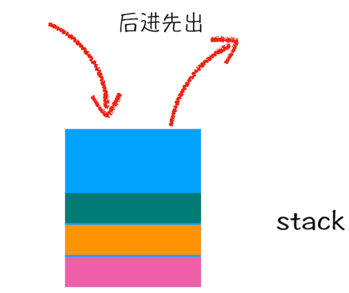

# JavaScript

# 一、JS基础

## 1 Hello World

```html
<!DOCTYPE html>
<html lang="en">
<head>
    <meta charset="UTF-8">
    <meta http-equiv="X-UA-Compatible" content="IE=edge">
    <meta name="viewport" content="width=device-width, initial-scale=1.0">
    <title>Hello World</title>
    <script>
        // (警告框)弹窗
        alert("Hello World")
        
        // 控制台输出
        console.log('Hello World')
        
        // (网页输出)打印
        document.write('Hello World')
        
    </script>
</head>
<body>
    
</body>
</html>
```

## 2 javascript的三种引入方式

**行内引入:**

<开始标签 on+事件类型=“js代码”></结束标签>

行内引入方式必须结合事件来使用，但是内部js和外部js可以不结合事件

```html
<body>
	<input type="button" onclick="alert('行内引入')" value="button" name="button">
	<button onclick="alert(123)">点击我</button>
    <a href="javascript:alert(123)">超链接</a>
</body>
```

**内部引入：**

在head或body中，定义script标签，然后在script标签里面写js代码

```html
<script>
    alert("这是js的内部引入");
</script>
```

**外部引入：**

定义外部js文件(.js结尾的文件)

```html
<script type="text/javascript" src="demo.js"></script>
```

注:

1. script标签一般定义在head或body中

2. script标签要单独使用，要么引入外部js，要么定义内部js，不要混搭使用

外部的JS文件，它具有维护性高、可缓存(加载一次，无需加载)、方便未来扩展、复用性高等特点

新建外部的js文件demo.js文件

```javascript
alert("外部引入")
```

在head或者body中，添加以下代码

```html
<script  type="text/javascript" src="js/demo.js"></script>
```

## **3 基本语法**

```html
<script>
    /*
        1.多行注释
         -注释中的内容会被解释器忽略
         -可以通过注释来对代码进行解释说明
         -也可以通过注释来注释掉不想执行的代码
    */
    //  2.单行注释
    //  alert(123)

    /*
        3. js严格区分大小写
    */
        alert(123);
        Alert(123);

    /*
        4. 在js中多个空格和换行会被忽略，可以利用这个特点进行代码格式化
    */

        alert(  123  );
     	alert(  
            123
        );
        alert
        (  
            123
        );

    /*
        5. js每条语句都应该以分号结尾,
        js有自动添加分号的机制，如果不写分号，
        解释器会自动添加分号（建议手写，培养习惯，自动添加可能出错）
    */
        alert(123);
    </script>
```

## 4 字面量和变量

**字面量：**是一些不可改变的值。比如：1 2 3 4 "h"。字面量都是可以直接使用的，但是我们一般不会直接使用字面量

**变量：**可以用来保存字面量，而且变量的值是可以任意改变的。变量更加方便我们使用，所以在开发中都是通过变量去保存一个字面量而很少直接使用字面量，所以可以通过变量对字面量进行描述。

在JS中，我们通常使用var关键字来声明一个变量：

```javascript
var a;
//为变量赋值
a=123;
a=456;

//声明和赋值同时进行
var b=789;
var c=9;
 
console.log(a);
```

但是 ES6 中新增了命令**let** 和 **const** ，是用于解决 ES5 中使用 var 命令声明变量的一些问题而出现的。那么var主要有哪些问题呢？

- 没有块级作用域
- 重复声明
- 绑定全局作用域
- 变量提升

let、const和var都可以定义变量，那么let、const和var的区别是什么？这也是我们前端在面试时可能会遇到的面试题。

-  var：没有块级作用域，创建和初始化的时候有变量提升，可以重复声明，

-  let：有块级作用域，不允许重复声明，暂时性死区

-  const：有块级作用域，不允许重复声明，**暂时性死区**，const声明的变量不能直接修改值，但是const定义是指向这个对象的地址，地址不变，引用的数据可以改变。

**暂时性死区：创建了变量但是没有初始化，没法使用变量，只在变量创建阶段有变量提升，在初始化阶段没有提升，形成了暂时性死区。**

## 5 变量的内存结构

**什么是内存？**

**内存**通俗的说就是计算机中一个存储数据的地方。当要执行程序中的代码时，计算机会先将硬盘中的代码**加载到内存**当中，再由CPU读取内存中的数据，最后CPU执行内存中的代码并返回结果。

当我们在JS当中，声明一个变量并赋值时。

```html
<script>
    /* 
        JS中，变量中并不存储任何值，而是存储值的内存地址！
    */
    let a = '哈哈哈'
    let b = '嘿嘿嘿'
    console.log(a);
    console.log(b);
</script>   
```

直观上，是把a和b两个变量当成盒子，分别将值 ‘123’ 存储在两个盒子中。但实际上并非如此，且内存的结构比较复杂。

当声明一个变量时，在内存中分配的空间是固定的。但是它所存储的值是一个随时改变的量。

**如果数据过大，存储时分配的空间不足够使用，会造成内存溢出。**

**如果数据过小，那么已分配的空间不能够充分利用，就会造成空间浪费。**

因此，JS中变量的值，并不是直接与变量存储在一起。而是开辟了两个空间分别存放。


**那么变量和它所对应存储的值，是如何联系起来的呢？**

事实上，内存当中存储的每一个数据，都有其唯一一个内存地址，通过内存地址就可以找到存放在内存中的数据。
因此，为了使变量和存储的值联系在一起，所以在变量中，存放的是 值的内存地址。地址指向存放在内存当中的数据。这就很像C语言当中的指针。


当声明一个新的变量时，变量的值与已经存在的变量的值相同时，新的变量值不会重新在内存中开辟空间存放，而是共用同一个变量值，**存放同一个值的内存地址。**


## 6 常量

**javascript中，一旦被定义就无法再被修改的变量称之为常量。**

常量表示一些固定不变的数据，是不能修改的值；常量只能读取，不能修改。

**常量的关键字是const：**

const 可定义一个或多个常量，定义时必须进行初始化，且初始化后值不可再修改。

语法：

```js
const 变量名=值;
const 变量名1=值1,变量名2=值3,...,变量名n=值n;
```

注：常量与变量一样均是用于存储数据的容器，只不过常量的值在程序的运行中不可以发生改变，否则运行时会报错。

```js
const NUM = 666;
// NUM = 888; //尝试修改NUM这个常量的取值，会发现报错了，常量一旦定义就不能再去改变值了
console.log(NUM);
```

**扩展知识：JavaScript中常量的分类**

**整型常量**

整型常量其实就是正数, 在JavaScript中随便写一个整数都是整型常量

```js
1 / 666 / 99
```

**实型常量**

实型常量其实就是小数, 在JavaScript中随便写一个小数都是实型常量

```js
3.14 / 6.66
```

**字符串常量**

- 字符串常量其实就是用单引号或者双引号括起来的内容, 我们就称之为字符串常量
- 'a'
- 'abc'
- “1”
- “BNTang”
- 注意点: 无论用单引号或者双引号括起来了多少个字符, 在JavaScript中都是字符串常量

**布尔常量**

- 布尔常量其实就是真或者假, 在JavaScript中通过true和false来表达
- 在JavaScript中布尔常量只有两个取值, 真(true)或者假(false)

**自定义常量**

在ES6中新增的

```js
const 常量名称 = 常量取值;
```

## 7 标识符

```js
let a = '哈哈哈'
```

其中：a就是标识符

在JS中，所有可以由我们自主命名的内容，都可以认为是一个标识符，像：变量名 函数名 类名...

使用标识符需要遵循以下的命名规范：

1. 标识符只能含有字母，数字，下划线，$，且不能以数字开头
2. 标识符不能是JS中的关键字和保留字，也不建议使用内置的函数或类名作为变量名	
3. 标识符命名规范：
   - 通常会使用驼峰命名法
     - 首字母小写，每个单词开头大写  如：maxLength，borderLeftWidth
   - 类名会使用大驼峰命名法
     - 首字母大写，每个单词开头大写，如：MaxLength，BorderLeftWidth
   - 常量的字母会全部大写
     - MAXLENGTH

# 二、数据类型

## 1 类型检查

typeof 运算符

- typeof 用来检查不同的值的类型
- 它会根据不同的值返回不同的结果

```html
<script>
	let a = 10
    let b = 10n
     
    console.log(typeof a) //number
    console.log(typeof b) //bigint
</script>
```

## 2 数据类型

数据类型， 指哪些可以赋值给变量的值，JS中的数据类型由原始值和对象共同组成。

JavaScript中一共有其中原始值：

**数值（Number）大整数（BigInt）字符串（String）布尔值（Boolean）空值（Null）未定义（Undefined）符号（Symbol）**

七种原始值是构成各种数据的基石，原始值在JS中是不可变类型，一旦创建就不能修改

### 2.1 数值(Number)

- 在JS中所有的整数和浮点数都是Number类型

 - JS中的数值并不是无限大的，当数值超过一定范围后会显示近似值

 - Infinity是一个特殊的数值表示无穷
 - 所以在JS中进行一些精度比较高的运算时要十分注意

### 2.2 大整数(BigInt)

- 大整数用来表示一些比较大的整数

- 大整数使用n结尾，它可以表示的数字范围是无限大

- a=99999999999999999999n

  其它进制的数字：

  二进制 0b ：a = 0b1010

  八进制 0o ：a = 0o10

  十六进制 0x : a = 0xff

### 2.3 字符串(String)

- 在JS中使用单引号或双引号来表示字符串
- 使用typeof检查一个字符串时会返回 "string"

**转义字符** \

- `\" -->"`
- `\' --> '`  
- `\\ --> \\`
- `\t --> 制表符`
- `\n --> 换行`

**模板字符串**

- 使用反单引号` 来表示模板字符串
- 模板字符串中可以嵌入变量

```html
<script>
	let a = "hello"
    a = "你好"
    a = "这是一个\"字\\\\符串
    a = "呵呵\t哈哈哈"
    a = "呵呵\n哈哈哈"
	
    a = "今天天气真不错！"
    a = `今天天气挺好的！`
    
    let name = "猪八戒"
    let str = `你好，${name}`
    console.log(str)
    
    let b = 10
    console.log(`b = ${b}`)
    
    let c = "5"
    c = "hhh"
    c = `aaa`
    // 使用typeof检查一个字符串时会返回 "string"
    console.log(typeof c)
</script>
```

### 2.4 布尔值(Boolean)

- 布尔值主要用来进行逻辑判断
- 布尔值只有两个 true 和 false
- 使用typeof检查一个布尔值时会返回 "boolean"

```js
let bool = true
bool = false
let num = 1
console.log(typeof bool,bool)
```

### 2.5 空值(Null)

- 空值用来表示空对象
- 空值只有一个 null
- 使用typeof检查一个空值时会返回 "object"
- 使用typeof无法检查一个空值

```js
let a = null
console.log(typeof a,a)
```

### 2.6 未定义(Undefined)

- 当声明一个变量而没有赋值时，它的值就是 Undefined
- Undefined类型检查的值只有一个就是 undefined
- 使用typeof检查一个Undefined类型的值时，会返回"undefined"

```js
let a
conlose.log(typeof a)
let b = undefined
conlose.log(typeof b)
```

### 2.7 符号(Symbol)

- 用来创建一个唯一的标识
- 使用typeof检查符号时会返回 "symbol"

```js
let c = Symbol()//调用Symbol()创建了一个符号
console.log(typeof c,c)
```

## 3 类型转换

类型转换指将一种数据类型转换为其他类型

### 3.1 类型转换—字符串

**1. 调用toString( )方法将其它类型转换为字符串**

调用xxx的yyy方法-->xxx.yyy( )

由于null和undefined中没有toString( )，所有String( )函数将其他类型转换为字符串

```js
let a = 10 //"10"
a = true //"true"
a = 11n //"11"
a = undefined
console.log(typeof a,a)
a = a.toString()
console.log(typeof a,a)
```

**2. 调用String( )函数将其他类型转换为字符串**

调用xxx函数-->xxx( )

原理：

1. 对于拥有toString( )方法的值调用String( )函数时，实际上就是直接在调用toString( )方法

2. 对于null，则直接转换为"null"

3. 对于undefined，则直接转换为"undefined"

```js
let b = 33 //"33"
b = null //"null"
b = undefined //"undefined"
b = true
console.log(typeof b,b)
b = String(b)
console.log(typeof b,b)
```

### 3.2 类型转换—数值

**1. 使用Number( )函数来将其他类型转换为数值**

**字符串：**

1. 如果字符串是一个合法的数字，则会自动转换为对于的数字
2. 如果字符串不是合法数字，则会转换为NaN
3. 如果字符串是空串或者纯空格的字符串，则转换为0

```js
let a = '123' //123
a = 'abc' //NaN
a = '3.1415926' //3.1415926
a = '' //0
a = '    ' //0
console.log(typeof a,a)

a = Number(a)
console.log(typeof a,a)
```

**布尔值** true转换为1，false转换为0

**null** 转换为 0

**undefined** 转换为NaN	

**2. 专门用来将字符串转换为数值的两个方法**

**parseInt( )** — 将一个字符串转换为一个整数

- 解析时，会自左向右读取一个字符串，直到读取到字符串中所有的有效整数
- 当传入的值不是字符串时，parseInt会将值转换为字符串，然后再去转换为number
- 我们也可以使用parseInt( )来对一个数字进行取整

```js
let b = '123px'
console.log(typeof b,b)
b = Number(b)
console.log(typeof b,b) //number NaN
b = parseInt(b)
console.log(typeof b,b) //number 123

let b = 'p123px'
console.log(typeof b,b)
b = parseInt(b)
console.log(typeof b,b) //number NaN

let b = '123.123'
console.log(typeof b,b)
b = parseInt(b)
console.log(typeof b,b) //number 123
```

**parseFloat( )** — 将一个字符串转换为浮点数

- 解析时，会自左向右读取一个字符串，直到读取到字符串中所有的有效的小数

### 3.3 类型转换—布尔值

使用Boolean( )函数来将其他类型转换为布尔值

转换的情况：

1. 数字：

   - ​	0和NaN转换为false

   - ​	其余都是true

2. 字符串：
   - 空串 转换为false
   - 其余是true

3. null 和 undefined都转换为false
4. 对象：对象会抓换为true

所有表示空性的没有错误的值都会转换为false

​	0、NaN、空串、null、undefined、false

```js
let a = 1 
a = -1 //true
a = 0 //false
a = NaN //false
a = Infinity //true

a = 'abc' //true
a = 'true' //true
a = 'false' //true
a = '' //false
a = " " //true
a = null
a = undefined
console.log(typeof a, a)

a = Boolean(a)
console.log(typeof a, a)
```

# 三、运算符(操作符)

运算符（操作符），运算符可以用来对一个或者多个操作数（值）进行运算

## 1 算数运算符

- " + "：加法运算符
- " - "：减法运算符
- " * "：乘法运算符
- " / "：除法运算符
- " ** "：幂运算符
- " % "：模运算符，两个数相除取余数

注意：

- 算术运算时，除了字符串的加法，其他运算的操作数是非数值时，都会转换为数值然后再运算
- JS是一门弱类型语言，当进行运算时会通过自动的类型转换来完成运算
- 当任意一个值和字符串做<font color="red">加法运算</font>时，它先会将其他值转换为字符串，然后再做拼串的操作，可以利用这一特点来完成类型转换

```js
let a = 1 + 1
a = 10 - 5
a = 2 * 4 
a = 10 / 5
a = 10 / 3 
a = 10 / 0 //Infinity
a = 10 ** 4
a = 9 ** .5 //开方
a = 10 % 2
a = 10 % 3
a = 10 % 4 

// JS是一门弱类型语言，当进行运算时会通过自动的类型转换来完成运算 
a = 10 - '5' //10 - 5
a = 10 + true //10 + 1
a = 5 + null //5 + 0
a = 6 - undefined // 6 -NaN

// 当任意一个值和字符串做加法运算时，它先会将其他值转换为字符串，然后再做拼串的操作
/* 可以利用这一特点来完成类型转换，可以通过为任意类型 + 一个空串的形式来将其转换为字符串，其原理和String()函数相同，但使用起来更加简洁 */
a = 'hello' + 'world' //helloworld
a = '1' + 2 //"1" + "2"

a = true
a = a + ''
console.log(typeof a, a)
```

## 2 赋值运算符

赋值运算符用来将一个值赋值给一个变量

- = ：将符号右侧的值赋给左侧的变量
- ??=：空赋值，只有当变量的值为null和undefined时才会对变量进行赋值
- +=：a += n 等价于 a = a + n
- -=：a -= n 等价于 a = a - n
- *=：a *= n 等价于 a = a * n
- /=：a /= n 等价于 a = a / n
- %=：a %= n 等价于 a = a % n
- **=：a * *= n 等价于 a = a * * n

```js
let a = 10
a = 5 //将右边的值 赋值 给左边的变量
let b = a //一个变量只有在=左边时才是变量，在=右边时它是值

a = 66
a = a + 11 //大部分的运算符都不会改变变量的值，赋值运算符除外

a = 5
// a = a + 5 //10
a += 5 //在a原来值的基础上增加5

a = null
a ??= 101 

console.log(a)
```

## 3 一元的正负

+正号：不会改变数值的符号

-符号：可以对数值进行符号位取反

当我们对非数值类型进行正负运算时，会先将其转化为数值然后再运算

```js
let a = -10
a = -a
console.log(typeof a, a)

let b = '123'
b = +b //b = Number(b)
console.log(typeof b, b)
```

## 4 自增和自减

**++ 自增运算符**

1. ++ 使用后会使得原来的变量立刻增加1
2. 自增分为前自增(++a)和后自增(a++)
3. 无论是++a还是a++都会使原变量立刻增加1
4. 不同的是++a和a++所返回的值不同
   - a++ 是自增前的值 旧值
   - ++a 是自增后的值 新值

```js
let a = 10
console.log(a)

let b = a++
console.log("a++ =",b)

let c = ++a
console.log("a++ =",c)

let n = 5
let result = n++ + ++n + n
//            5  +  7  + 7

console.log(result)
```

**-- 自减运算符**

1. -- 使用后会使得原来的变量立刻减少1
2. 自增分为前自减(--a)和后自减(a--)
3. 无论是--a还是a--都会使原变量立刻减少1
4. 不同的是--a和a--所返回的值不同
   - a-- 是自减前的值 旧值
   - --a 是自减后的值 新值

```js
a = 5
console.log("a:" ,a)
//console.log("a--:" ,a--)
console.log("--a:" ,--a)
```

## 5 逻辑运算符

### 5.1 ! 逻辑非

! 可以用来对一个值进行非运算

它可以对一个布尔值进行取反操作

- true->false，false->rue

如果对一个非布尔值进行取反，它会先将其转化为布尔值然后在取反，可以利用这一特点将其他类型转化为布尔值

类型转换：

1. 转换为字符串：
   - 显式转换：String( )
   - 隐式转换：+ " "
2. 转换为数值：
   - 显式转换：Number( )
   - 隐式转换：+
3. 转换为布尔值：
   - 显示转换：Boolean( )
   - 隐式转换：!!

```js
let a = true
a = !a
//console.log(a)

a = 123
a = !!a
console.log(typeof a,a)
```

### 5.2 && 逻辑与

1. 可以对两个值进行与运算

2. 当&&左右都为true时，则返回true，否则返回false

3. 与运算时短路的与，如果第一个值为false，则不看第二个值

4. 与运算是找false的，如果找到false则直接返回，没有false才会返回true

5. 对于非布尔值进行与运算，它会转换为布尔值然后运算，但是最终会返回原值

   - 如果第一个值为false，则会直接返回第一个值

   - 如果第一个之为true，则返回第二个值

```js
let result = true && true //true
result = true && false //false
result = false && true //false
result = false && false //false

//true && alert(123) //第一个值为true ，alert会执行
false && alert(123) //第一个值为false，alert不会执行

//     true && true -> true
result = 1 && 2 //2
//     true && false -> false
result = 1 && 0 //0
//     false && false -> false
result = 0 && NaN //0

console.log(result)
```

### 5.3 || 逻辑或

1. 可以对两个值进行或运算
2. 当||左右有true时，则返回true，否则返回false
3. 或运算也是短路的或，如果第一个值为true，则不看第二个值
4. 或运算是找true，如果找到true则直接返回，没有true才会返回false
5. 对于非布尔值或运算，它会转化为布尔值然后运算，但是最终会返回原值
   - 如果第一个值为true，则返回第一个
   - 如果第一个值为false，则返回第二个

```js
let result = true || false //true
result = false || true //true
result = true || true //true
result = false || false //false

// false || alert(123) //第一个值为false ,alert会执行
true || alert(123) //第一个值为true ,alert不会执行

result = 1 || 2 //1
result = "hello" || NaN //"hello"
result = NaN || 1 //1
result = NaN || null //null

console.log(result)
```

## 6 关系运算符

关系运算符用来检查两个值之间的关系是否成立

成立返回true，不成立返回false

- " > " ：用来检查左值是否大于右值
- " >= "：用来检查左值是否大于或等于右值
- " < "：用来检查左值是否小于右值
- " <= "：用来检查左值是否小于或等于右值

注意：

- 当对非数值进行关系运算时，它会先将前转换为数值然后再比较
- 当关系运算符的两端是两个字符串，它不会将字符串转换为数值，而是逐位的比较字符的Unicode编码，利用这个特点可以对字符串按照字母排序
- 注意比较两个字符串格式的数字时一定要进行类型转换

```js
let result = 10 > 5 //true
result = 5 > 5 //false
result = 5 >= 5 //true

result = 5 < "10" //true
result = "1" > false //true

result = "a" < "b" //true
result = "z" < "f" //false
result = "abc" < "b" //true

result = "12" < "2"  //true
result = +"12" < "2"  //false


//检查num是否在5和10之间
let num = 6
//result = 5 < num < 10 //错误的写法
result = num > 5 && num <10 

console.log(result)
```

## 7 相等运算符

### 7.1 相等运算符(==)

相等运算符，用来比较两个值是否相等

使用相等运算符比较两个不同类型的值时，它会将其转换为相同的类型（通常转换为数值）然后再比较，类型转换后值相同也会返回true

null和undefined进行相等比较时会返回true

NaN不和任何值相等，包括它自身

```js
let result = 1 == 1 //true
result = 1 == 2 //false
result == 1 == '1' //true
result = true == "1" //true

result = null == undefined //true
result = NaN == NaN //false

console.log(result)
```

### 7.2 全等运算符(===)

全等运算符，用来比较两个值是否全等

它不会自动进行的类型转换，如果两个值的类型不同直接返回false

null和undefined进行全等比较时会返回false

```js
let result = 1 === "1" //false
result = null ===undefined //fasle
console.log(result)
```

### 7.3 不等运算符(!=)

不等运算符，用来检查两个值是否不相等

会自动的进行类型转换

```js
let result = 1 !=1 //false
result = 1 != "1" //false
console.log(result)
```

### 7.4 不全等运算符(!==)

不全等，比较两个值是否不全等

不会自动的类型转换

```js
let result = 1 !== "1" //true
console.log(result)
```

## 8 条件运算符

 条件表达式 ? 表达式1 : 表达式2

执行顺序：

1. 条件运算符在执行时，会先对条件表达式进行求职判断
2. 如果结果为true，则执行表达式1
3. 如果结果为false，则执行表达式2

```js
let a = 100
let b = 20
// a > b ? alert("a大1") : alert("b大！")
let max = a > b ? a : b
alert(max)
```

## 9 运算符的优先级

JavaScript中的运算符优先级是一套规则。该规则在计算表达式时控制运算符执行的顺序。具有较高优先级的运算符先于较低优先级的运算符执行。例如，乘法的执行先于加法。

下表按从最高到最低的优先级列出JavaScript运算符。具有相同优先级的运算符按从左至右的顺序求值。

| 运算符                             | 描述                                         |
| ---------------------------------- | -------------------------------------------- |
| . [] ()                            | 字段访问、数组下标、函数调用以及表达式分组   |
| ++ -- - ~ ! delete new typeof void | 一元运算符、返回数据类型、对象创建、未定义值 |
| * / %                              | 乘法、除法、取模                             |
| + - +                              | 加法、减法、字符串连接                       |
| << >> >>>                          | 移位                                         |
| < <= > >= instanceof               | 小于、小于等于、大于、大于等于、instanceof   |
| == != === !==                      | 等于、不等于、严格相等、非严格相等           |
| &                                  | 按位与                                       |
| ^                                  | 按位异或                                     |
| \|                                 | 按位或                                       |
| &&                                 | 逻辑与                                       |
| \|\|                               | 逻辑或                                       |
| ?:                                 | 条件                                         |
| = oP=                              | 赋值、运算赋值                               |
| ,                                  | 多重求值                                     |

圆括号可用来改变运算符优先级所决定的求值顺序。这意味着圆括号中的表达式应在其用于表达式的其余部分之前全部被求值。

`z = 78 * (96 + 3 + 45)`

在该表达式中有五个运算符： =, *, (), +, 以及另一个 +。根据运算符优先级的规则，它们将按下面的顺序求值： (), +, +, *, =。 

首先对圆括号内的表达式求值。圆括号中有两个加法运算符。因为两个加法运算符具有相同的优先级，从左到右求值。先将 96 和 3 相加，然后将其和与 45 相加，得到的结果为 144。 
然后是乘法运算。78 乘以 144，得到结果为 11232。 
A最后是赋值运算。将 11232 赋给 z。

# 四、流程控制

## 1 代码块

使用 { } 来创建代码块，代码块可以用来对代码块进行分组，同一个代码中的代码，就是同一组代码，一个代码块中的代码要么都执行要么都不执行

```js
{
    let a = 10
    console.log(a)
}
{
    console.log(111)
    alert("Hello World")
}
```

**let和var：**

- 在js中，使用let声明的变量具有块作用域，在代码块声明的变量无法在代码块的外部访问

```js
{
    let a = 10
}
// 使用let声明的变量，具有块作用域，控制台不能输出a
consolr.log(a)
```

- 使用var声明的变量，不具有块作用域

```js
{
    var a = 10
}
// 使用var声明的变量，不具有块作用域，控制台可以输出a
consolr.log(a)
```

## 2 if语句

语法：

```js
if(条件表达式){
    语句...
}
```

执行流程：

- if语句在执行时会对if后的条件表达式进行求职判断，如果结果为true，则执行if后的语句，如果为false则不执行
- if语句只会控制紧随其后的那一行代码，如果希望控制多行代码，可以使用 { } 将语句括起来
  - 最佳实践：即是if后面只有1行代码，我们也应该编写代码，这样结构会更加的清晰
- 如果if后添加的表达式不是布尔值，会转换为布尔值然后再运算

```js
if(false){
    alert("哈哈哈")
}

let a = 20
if(a > 10){
    alert("a比10大")
}

if(a == 10){
    alert("a的值时10")
}
```

## 3 if-else语句

**if-else语句：**

语法：

```js
if(条件表达式){
    语句...
}else{
    语句...
}
```

执行流程：

if-else执行时，先对条件表达式进行求值判断，如果结果为true，则执行if后的语句，如果结果为false，则执行else后的语句

```js
let age = 70
if(age >= 60){
    alert("你已经退休了！")
}else{
    alert("你还没有退休！")
}
```

**if-else  if-else语句：**

语法：

```js
if(条件表达式){
    语句...
}else if(条件表达式){
    语句...
}else if(条件表达式){
    语句...
}else{
    语句...
}
```

执行流程：

1. if-else if-else语句，会自上而下依次对if后的条件表达式进行求职判断
2. 如果条件表达式的结果为true，则执行当前if后的语句，执行完毕语句结束
3. 如果条件表达式结果为false，则继续向下判断，知道找到true为止
4. 如果所有的条件表达式都是false，则执行else后的语句

注意：

if-else if-else语句中只会有一个代码块被执行，一旦有执行的代码块，下边的条件都不会在继续判断了，所以一定要注意，条件的编写顺序

```js
let age = 6

if (age >= 100) {
    alert("长寿！")
} else if (age >= 80) {
    alert("你即将步入老年！")
} else if (age >= 60) {
    alert("你退休了！")
} else if (age >= 30) {
    alert("你要步入中年！")
} else if (age >= 18) {
    alert("你成年了！")
} else {
    alert("你还未成年！")
}
```

## 4 练习

### 4.1 练习1

编写一个程序，获取一个用户输入的整数。然后通过程序显示这个数是奇数还是偶数。

```js
let num = +prompt("请输入一个整数")
// 对用户输入的小数进行取整（抹去小数）
//let num = parseInt(+prompt("请输入一个整数"))

//验证一下，用户的输入是否合法，只有是有效数字时，才去检查它是奇数还是偶数
// 不能使用==或===来检查一个值是否NaN
// 可以是哟isNaN()函数来检查一个值是否NaN
if(isNaN(num) || num % 1 !==0){
   alert("你的输入有问题，请输入整数！")
}else{
   if(num % 2 ===0){
      alert(`${num} 是偶数`)
   }else{
       alert(`${num} 是奇数`)
   }
}
```

### 4.2 练习2

从键盘输入小明的期末成绩: *当成绩为100时，'奖励一辆BMW'；  *当成绩为[80-99]时，'奖励一台iphone'； *当成绩为[60-79]时，'奖励一本参考书'*； 其他时，什么奖励也没有

```js
 //从键盘输入小明的期末成绩
let score = +prompt('请输入小明的期末成绩：')

// 检查score是否合法
if(isNaN(score) || score<0 || score>100){
	alert('请输入一个合法的分数')
}else{
	// 当成绩为100时，'奖励一辆BMW'
	if(score === 100){
		alert('汽车一辆~')
	}else if(score >= 80){
		// 当成绩为[80-99]时，'奖励一台iphone'
 		alert('手机一台~')
	}else if(score >= 60){
		// 当成绩为[60-79]时，'奖励一本参考书'
		alert('参考书一本~')
	}else{
		// 其他时，什么奖励也没有
		alert('啥也没有~')
	}
}
```

### 4.3 练习3

大家都知道，男大当婚，女大当嫁。那么女方家长要嫁女儿，当然要提出一定的条件： 高：180cm以上; 富:1000万以上; 帅:500以上;
如果这三个条件同时满足，则:'我一定要嫁给他'； 如果三个条件有为真的情况，则:'嫁吧，比上不足，比下有余。' ；如果三个条件都不满足，则:'不嫁！'

```js
 // 获取男生的数据（身高、财富、颜值）
let height = +prompt('请输入你的身高（厘米）：')
let money = +prompt('请输入你的身价（万）：')
let face = +prompt('请输入你的颜值（像素）：')
        
// height 180↑  money 1000↑ face 500↑
if(height>180 && money>1000 && face>500){
	// 如果这三个条件同时满足，则:'我一定要嫁给他'
	alert('我一定要嫁给他！')
}else if(height>180 || money>1000 || face>500){
	// 如果三个条件有为真的情况，则:'嫁吧，比上不足，比下有余。'
	alert('嫁吧，比上不足，比下有余。')
}else{
    // 如果三个条件都不满足，则:'不嫁！'
	alert('不嫁！')
}
```

## 5 switch语句

语法：

```js
switch(表达式){
    case 表达式:
        代码...
        break
    case 表达式:
        代码...
        break
    default:
        代码...
        break
}
```

执行流程：

1. switch语句在执行时，会依次将switch后的表达式和case后的表达式进行全等比较
2. 如果比较结果为true，则自当前case处开始执行代码
3. 如果比较结果为false，则继续比较其他case后的表达式，直到找到true为止

注意：

- 当比较结果为true时，会从当前case处开始执行代码，也就是说case是代码执行的起始位置
- 这就意味着只要是当前case后的代码，都会执行
- 可以使用break来避免执行其他的case

总结：

-  switch语句和if语句的功能是重复，switch能做的事if也能做，反之亦然。
-  它们最大的不同在于，switch在多个全等判断时，结构比较清晰

```js
// 根据用户输入的数字显示中文
let num = +prompt("请输入一个数字")
 /* 
1 壹
2 贰
3 叁
*/
// if (num === 1) {
//     alert("壹")
// } else if (num === 2) {
//     alert("贰")
// } else if (num === 3) {
//     alert("叁")
// }

switch (num) {
	case 1:
		alert("壹")
		break // break可以用来结束switch语句
	case 2:
		alert("贰")
		break
	case 3:
		alert("叁")
		break
	default:
		alert("我是default")
		break
}
```

## 6 while循环

语法：

```js
while(条件表达式){
	语句...
}
```

执行流程：

- while语句在执行时，会先对条件表达式进行判断，
- 如果结果为true，则执行循环体，执行完毕，继续判断
- 如果为true，则再次执行循环体，执行完毕，继续判断，如此重复
- 知道条件表达式结果为false时，循环结束

 当一个循环的条件表达式恒为true时，这个循环就是一个死循环，会一直执行（慎用）

```js
while(true){
	alert('哈哈')
}
```

通常编写一个循环，要有三个要件：

1. 初始化表达式（初始化变量）
2. 条件表达式（设置循环运行的条件）
3. 更新表单式（修改初始化变量）

```js
// 初始化表达式
let a = 0

// 条件表达式
while(a < 3){
	console.log(a)
	// 更新表达式
 	a++
}
```

```js
let i = 0
while(1){
    console.log(i)
    i++
	if(i >= 5){
   		break
    }
}
```

练习：

假设银行存款的年利率为5%，问1000块存多少年可以变成5000块

```js
// 创建一个变量表示钱数
let money = 1000

// 1000 存一年是多少钱？
// money *= 1.05
// money *= 1.05
// money *= 1.05

// 创建一个计数器来记录循环执行的次数
let year = 0

// 编写循环，计算存款的年数
while(money < 5000){
	money *= 1.05 // 循环没执行一次，就相当于钱存了一年
	year++
}
        
console.log(`需要存${year}年，最终的钱数为${money}元！`)
```

## 7 do-while循环

语法：

```js
do{
	语句...
}while(条件表达式)
```

执行流程：

1. do-while语句在执行时，会先执行do后的循环体，
2. 执行完毕后，会对while后的条件表达式进行判断
3. 如果为false，则循环终止
4. 如果为true，则继续执行循环体，以此类推

和while的区别：

- while语句是先判断再执行
- do-while语句是先执行再判断
- 实质的区别：do-while语句可以确保循环至少执行一次             

```js
let i = 10

while(i < 5){
	console.log(i)
	i++
}
```

```js
let i = 10
do{
	console.log(i)
	i++
}while(i < 5)
```

## 8 for循环

- for循环和while没有本质区别，都是用来反复执行代码
- 不同点就是语法结构，for循环更加清晰

语法：

```js
for(①初始化表达式; ②条件表达式; ④更新表达式){
	③语句...
}
```

执行流程：

1. 执行初始化表达式，初始化变量
2. 执行条件表达式，判断循环是否执行（true执行，false终止）
3. 判断结果为true，则执行循环体
4. 执行更新表达式，对初始化变量进行修改
5. 重复②，知道判断为false为止

注意:

- 初始化表达式，在循环的整个的生命周期中只会执行1次
- for循环中的三个表达式都可以省略
- 使用let在for循环的()中声明的变量是局部变量，只能在for循环内部访问
- 使用var在for循环的()中声明的变量可以在for循环的外部访问

- 创建死循环的方式：while(1){ }；for(;;){ }

```js
// let i = 0
// while(i < 5){
//     console.log(i)
//     i++
// }

        
for(let i=0; i<5; i++){
    console.log(i)
}

// console.log(i)
        

// 死循环
// for(;;){
//     alert(1)
// }

// let i = 0
// for(;i < 5;){
//     console.log(i)
//     i++
// }
```

## 9 练习

### 9.1 练习1

求100以内所有3的倍数（求它们个数的总和）

```js
let count = 0 //计数器
let sum = 0 //求和

//100以内的所有的数
for (let i = 1; i <= 100; i++) {
	//获取3的倍数
    if (i % 3 === 0) {
		count++
        sum += i
    }
}

document.write(`3的倍数一共有${count}个，总和为${sum}`)
```

```js
let count = 0 //计数器
let sum = 0 //求和

for(let i = 3; i <= 100; i += 3){
    count++
    sum += i
}
document.write(`3的倍数一共有${count}个，总和为${sum}`)
```

### 9.2 练习2

求1000以内的水仙花数

水仙花数：一个n位数（n>=3），如果它各个位上的数字的n次幂之和还等于这个数，那么这个数就是一个水仙花数

即：153—>1 5 3—>1 125 27—>1+125+27=153

```js
 //获取所有的三位数
for (let i = 100; i < 1000; i++) {
	// 如果i的百位数字，十位数字，个位数字的立方和还等于i，则i就是水仙花数
	// 获取百位数
	let bai = parseInt(i / 100)

	// 获取十位数
	let shi = parseInt((i - bai * 100) / 10)

	// 获取个位数
	let ge = i % 10

	// 控制台输出
	// console.log(i,"-->",bai,shi,ge)

	// 判断i是否为水仙花数
	if (bai ** 3 + shi ** 3 + ge ** 3 === i) {
		document.write(i + "</br>")       
	}
}
```

```js
for (let i = 100; i < 1000; i++) {
	let strI = i + " "
	// console.log(strI) 
	if (strI[0] ** 3 + strI[1] ** 3 + strI[2] ** 3 === i) {
		document.write(i + "</br>")
	}
}
```

### 9.3 练习3

获取用户输入的大于1的整数（暂时不考虑输入错误的情况），然后编写代码检查这个数字是否是质数，并打印结果

质数：

- 一个数如果只能被1和它本身整除，那么这个数就是质数
- 1既不是质数也不是合数

分析：

```js
/* 
编写代码检查9是否是质数
	- 检查9有没有1和9以外的其他因数
		如果有，说明9不是质数
		如果没有，说明9是质数

	- 获取所有的可能整除9的数（1-9）
		2 3 4 5 6 7 8

	- 检查这一堆数中是否有能整除9的数
*/
// 获取所有的可能整除9的数
// for (let i = 2; i < 9; i++) {
//     if(9 % i !== 0){
//         // 如果9 % i !== 0 成立，说明9不能被i整除
//         // 9 不能被 i 整除 能不能说明9是质数？ 不能 
//         // 9 必须不能被所有的i整除，才能说明9是质数
//         // alert("9是质数")
//     }

// }
 // let flag = true

for(let i=2; i<9; i++){
	if(9 % i === 0){
      // 如果9能被i整除，说明9一定不是质数   
      // 当循环执行时，如果从来没有进入过判断（判断代码没有执行），则说明9是质数
      // 如果判断哪怕只执行了一次，也说明 9 不是质数  
      flag = false
   }
}

if(flag){
    alert('9是质数！')
}else{
    alert('9不是质数！')
}
```

解答：

```js
// 获取用户输入的数值
let num = +prompt("请输入一个大于1的整数：")

// 用来记录num的状态，默认为true，num是质数
let flag = true

for(let i=2; i<num; i++){
	if(num % i === 0){
    // 如果num能被i整除，说明num一定不是质数   
    // 当循环执行时，如果从来没有进入过判断（判断代码没有执行），则说明9是质数
    // 如果判断哪怕只执行了一次，也说明 9 不是质数  
	flag = false
	}
}

if(flag){
    alert(`${num}是质数！`)
}else{
	alert(`${num}不是质数！`)
}
```

## 10 循环嵌套

在循环中也可以嵌套其他的循环

当循环发生嵌套时，外层循环每执行一次，内层循环就会执行一个完整的周期

希望在网页中打印出如下图形：

```js
*****
*****
*****
*****
*****
```

```js
// 这个for循环，可以用来控制图形的高度
for (let i = 0; i < 5; i++) {
// 创建一个内层循环来控制图形的宽度
	for (let j = 0; j < 5; j++) {
		document.write("*&nbsp;&nbsp;")
	}
	document.write("<br>")
}
```

希望在网页中打印出如下图形：

```js
*     j<1    i=0
**    j<2    i=1
***   j<3    i=2
****  j<4    i=3
***** j<5    i=4
```

```js
for (let i = 0; i < 5; i++) {
	for (let j = 0; j < i + 1; j++) {
		document.write("*&nbsp;&nbsp;")
    }

    document.write("<br>")
}
```

希望在网页中打印出如下图形：

```js
***** j<5   i=0
****  j<4   i=1
***   j<3   i=2
**	  j<2   i=3
*	  j<1   i=4
```

```js
for (let i = 0; i < 5; i++) {
	for (let j = 0; j < 5 - i; j++) {
		document.write("*&nbsp;&nbsp;")
	}
	document.write("<br>")
}
```

## 11 练习

### 11.1 练习1

在网页中打印99乘法口诀表

```html
<style>
	span{
		display: inline-block;
		width: 100px;
	}
</style>
<script>
	//创建一个外侧循环，控制图形高度
	for (let i = 0; i < 10; i++) {
		//创建内层循环图形的宽度
		for (let j = 1; j < i + 1; j++) {
			document.write(`<span>${j} × ${i} = ${i * j}</span>`)
		}
		//打印换行
		document.write( "<br>" ) 
	}
</script>
```

### 11.2 练习2

求100以内所有的质数

```js
for(let i=2; i<100; i++){         
	// 检查i是否是质数，是质数则输出
	// 创建一个变量，记录i的状态，默认i是质数
	let flag = true

	// 获取 1-i 之间的数
	for(let j=2; j<i; j++){
		// 判断i能不能被j整除
		if(i % j === 0){
			// 进入判断，说明i不是质数，修改flag为false
			flag = false
		}
	}
	// 判断结果
	if(flag){
		console.log(i)
	}
}
```

## 12 break和continue

### break

- break用来终止switch和循环语句
- break执行后，当前的switch或循环会立刻停止
- break会终止离他最近的循环

```js
for (let i = 0; i < 5; i++) {
	if(i === 3){
		break//break作用域for循环，而不是if
	}
	console.log(i)
}

if(i === 3){
	break//break单独作用于if时，break会报错
}
```

```js
for (let i = 0; i < 5; i++) {
	console.log(i)
	for(let j=0; j<5; j++){
		if(j === 1) break
		console.log('内层循环--->', j)
	}
}
```

### continue

continue用来跳过当次循环

```js
for (let i = 0; i < 5; i++) {
	if (i === 3) {
    	 continue//当i===3时，会跳过这次循环
    }
    console.log(i)
}
```

```js
for (let i = 0; i < 5; i++) {
	console.log(i)

    for (let j = 0; j < 5; j++) {
    	if (j === 1) continue//会跳过j===1的循环
        console.log("内层循环--->", j)
    }
}
```

### 练习

修改质数练习

```js
 /* 
优化前
	1. 10000以内：290ms
	2. 100000以内：28202ms

第一次优化：
	1. 10000以内：30ms
	2. 100000以内：2331ms

            
问题：如何修改代码，提升其性能
*/

// 开始一个计时器
console.time('质数练习')

for (let i = 2; i < 1000000; i++) {
	let flag = true

	for (let j = 2; j < i; j++) {
		if (i % j === 0) {
			flag = false
			// 进入判断说明i一定不是质数，后续检查没有执行的必要
			break
		}
	}

	if (flag) {
		//console.log(i)
	}
}

// 停止计时器
console.timeEnd('质数练习')
```

再次优化代码，使其提升性能？

```js
 /* 
优化前
	1. 10000以内：290ms
	2. 100000以内：28202ms
第一次优化：
	1. 10000以内：30ms
	2. 100000以内：2331ms
	3. 1000000以内：192003ms
第二次优化：
	1. 10000以内：3ms
	2. 100000以内：220ms
	3. 1000000以内：394ms
            
问题：如何修改代码，提升其性能
*/

// 开始一个计时器
console.time('质数练习')

for (let i = 2; i < 1000000; i++) {
	let flag = true

	for (let j = 2; j <= i ** .5; j++) {
		if (i % j === 0) {
			flag = false
			// 进入判断说明i一定不是质数，后续检查没有执行的必要
			break
		}
	}

	if (flag) {
		//console.log(i)
	}
}

// 停止计时器
console.timeEnd('质数练习')
```

# 五 对象

## 1 对象

数据类型：

1. 原始值
   - 数值 Number
   - 大整数 BigInt
   - 字符串 String
   - 布尔值 Boolean
   - 空值 Null
   - 未定义 Undefined
   - 符号 Symbol
2. 对象
   - 对象是JS中的一种复合数据类型，它相当于一个容器，在对象中可以存储各种不同类型数据

原始值只能用来表示一些简单的数据，不能表示复杂数据

对象中可以存储多个各种类型的数据，对象中存储的数据，我们称为属性

向对象中添加属性：对象.属性名 = 属性值

读取对象中的属性：对象.属性名

如果读取的是一个对象中没有的属性，不会报错而是返回undefined

```js
// 比如：现在需要在程序中表示一个人的信息
// 创建对象
let obj = Object()

/*
let name = "孙悟空"
let age = 18
let gender = "男" 

对象中可以存储多个各种类型的数据
对象中存储的数据，我们称为属性
            
向对象中添加属性：
对象.属性名 = 属性值

读取对象中的属性
对象.属性名
- 如果读取的是一个对象中没有的属性
不会报错而是返回undefined
*/

obj.name = "孙悟空"
obj.age = 18
obj.gender = "男"

// 修改属性
obj.name = "Tom sun"

// 删除属性
delete obj.name

console.log(obj.name)
```

## 2 对象的属性

属性名：

- 通常属性名就是一个字符串，所以属性名可以是任何值，没有什么特殊要求，但是如果你的属性名太特殊了，不能直接使用，需要使用 [ ] 来设置，虽然如此，但是我们还是强烈建议属性名也按照标识符的规范命名
- 也可以使用符号（symbol）作为属性名，来添加属性 ，获取这种属性时，也必须使用symbol，使用symbol添加的属性，通常是那些不希望被外界访问的属性
- 使用 [ ] 去操作属性时，可以使用变量

属性值：

- 对象的属性值可以是任意的数据类型，也可以是一个对象

使用typeof检查一个对象时，会返回object

in 运算符：

- 用来检查对象中是否含有某个属性
- 语法 属性名 in obj
- 如果有返回true，没有返回false

```js
let obj = Object()
//---属性名---
obj.name = "孙悟空"
// obj.if = "哈哈" // 不建议
// obj.let = "嘻嘻"// 不建议
// obj["1231312@#@!#!#!"] = "呵呵"// 不建议

// let mySymbol = Symbol()
// let newSymbol = Symbol()
// // 使用symbol作为属性名
// obj[mySymbol] = "通过symbol添加的属性"
// console.log(obj[mySymbol])

obj.age = 18
obj["gender"] = "男"

let str = "address"

obj[str] = "花果山" // 等价于 obj["address"] = "花果山"

obj.str = "哈哈" // 使用.的形式添加属性时，不能使用变量

obj.a = 123
obj.b = 'hello'
obj.c = true
obj.d = 123n
obj.f = Object()
obj.f.name = "猪八戒"
obj.f.age = 28

// console.log(obj.f.name)
        
// console.log(obj.gender)
// console.log(obj["gender"])
        
// console.log(typeof obj)

//---in运算符---
console.log("name" in obj)        
```

## 3 对象字面量

可以直接使用 { } 来创建对象

使用 { } 所创建的对象，可以直接向对象中添加属性

语法：

```js
{
    属性名:属性值
    [属性名]:属性值
}
```

```js
let obj = Object{}
let mySymbol = Symbol()

let obj2 = {
    name:"孙悟空",
    age:18,
    ["gender"]:"男"
    [mySymbol]:"特殊的属性"
    hello:{
    	a:1,
    	b:true
	}
}
console.log(obj)
console.log(obj2)
```

## 4 枚举属性

枚举属性，指将对象中的所有的属性全部获取

**for-in语句**

语法：

```js
for(let propName in 对象){
    语句...
}
```

for-in的循环体会执行多次，有几个熟悉就会执行几次，每次执行时，都会将一个属性名赋值给我们所定义的变量

注意：并不是所有的属性都可以枚举，比如：使用符号添加的属性

```js
let obj = {
    name:"孙悟空",
    age:18,
    gender:"男",
    address:"花果山"
    [Symbol()]:"测试的性能"//符号添加的属性不能被枚举
}

for(let propName in obj){
    console.log(propName, obj[propName])
}
```

## 5 可变类型

原始值都属于不可变类型，一旦创建就无法修改，在内存中不会创建重复的原始值

```js
let a = 10 
let b = 10
a = 12 // 当我们为一个变量重新赋值时，绝对不会影响其他变量
// console.log("a =", a)
// console.log("b =", b)
```

对象属于可变类型

对象创建完成后，可以任意的添加删除修改对象中的属性

注意：

- 当对两个对象进行相等或全等比较时，比较的是对象的内存地址
- 如果有两个变量同时指向一个对象，通过一个变量修改对象时，对另外一个变量也会产生影响

```js
// let obj = {name:"孙悟空"}
let obj = Object()
obj.name = "孙悟空"
obj.age = 18

let obj2 = Object()
let obj3 = Object()


// console.log(obj2 == obj3) // false

let obj4 = obj

obj4.name = "猪八戒" // 当修改一个对象时，修改的是内存地址所指向的值，所有指向该对象的变量都会收到影响

console.log("obj", obj)
console.log("obj4", obj4)
console.log(obj === obj4)  //比较的是指向该对象的内存地址，内存地址相同，所以true   
```

## 6 (改)变量和对象

修改对象

- 修改对象时，如果有其他变量指向该对象，则所有指向该对象的变量都会受到影响

 修改变量

- 修改变量时，只会影响当前的变量

 在使用变量存储对象时，很容易因为改变变量指向的对象，提高代码的复杂度，所以通常情况下，声明存储对象的变量时会使用const

注意：

-  const只是禁止变量被重新赋值，对对象的修改没有任何影响

```js
const obj = {
	name: "孙悟空",
}

const obj2 = obj

// obj2 = {}

obj2.name = "猪八戒" // 修改对象

// obj2 = null // 修改变量

// console.log(obj)
  // console.log(obj2)

const obj3 = {
    name:"猪八戒"
}

obj3.name = "沙和尚"

console.log(obj3)
```

## 7 方法

方法(method)

当一个对象的属性指向一个函数，那么我们就成为这个函数是该对象的方法，调用函数就成为调用对象的方法

```js
let obj = {}
obj.name = "孙悟空"
obj.age = 18
console.log(obj)
```

```js
//函数也可以成为一个对象的属性
let obj = {}
obj.sayHello = function(){
    alert("hello")
}
obj.sayHello()
```

# 六 函数

## 1 函数

函数(Function)：

- 函数也是一个对象
- 它具有其他对象所有的功能
- 函数中可以存储代码，且可以在需要时间调用这些代码

语法：

```js
function 函数名(){
    语句...
}
```

调用函数：调用函数就是执行函数中存储的代码

语法：函数对象()

使用typeof检查函数对象时会返回function

```js
//创建一个函数对象
function fn(){
    console.log("你好！")
    console.log("Hello！") 
}
//调用函数
fn()

//检查函数对象
console.log(typeof fn)
```

## 2 函数的创建方法

函数的定义方式：

1. 函数声明：

   ```js
   function 函数名(){
       语句...
   }
   ```

2. 函数表达式：

   ```js
   const 变量 = function(){
       语句...
   }
   ```

3. 箭头函数：

   ```js
   () => {
       语句...
   }
   ```

```js
function fn(){
	console.log("函数声明所定义的函数~")
}

const fn2 = function(){
	console.log("函数表达式")
}

const fn3 = () => {
	console.log("箭头函数")
}

const fn4 = () => console.log("箭头函数")


console.log(typeof fn)
console.log(typeof fn2)
console.log(typeof fn3)
console.log(typeof fn4)

fn4()
```

## 3 函数的参数

形式参数（形参）

- 在定义函数时，可以在函数中指定数量不等的形式参数（形参）

- 在函数中定义形参，就相当于在函数内部声明了对于的变量但是没有赋值

  ```js
  function sum(){
  	let a = 123
  	let b = 456
  	console.log(a + b)
  }
  ```

实际参数（实参）

- 在调用函数时，可以在函数的 ( ) 中传递数量不等的实参
- 实参会赋值给其对应的形参
- 参数：
  1. 如果实参和形参的数量相同，则对应的实参赋值给对应的形参
  2. 如果实参多余形参，则多余的实参不会使用
  3. 如果形参多余实参，则多余的形参为undefined

- 参数的类型：
  - JS中不会检查参数的类型，可以传递任何类型的值作为参数

```js
 function fn(a, b){
     console.log("a =", a, a.name)
     console.log("b =", b)
 }

// fn(1)	
// fn(true, "hello")
// fn(null, 11n)
// fn({name:"孙悟空"},"hello")

function sum(a, b){
    console.log(a + b)
}

sum(123, 456)
```

## 4 箭头函数的参数

当箭头函数中只有一个参数时，可以省略 ( ) ，即：

```js
const fn = a => {
    console.log("a= ", a);
}
//const fn = a =>console.log("a= ", a);
fn(123)
```

定义参数时，可以为参数指定默认值，默认值会在没有对应实参时生效

```js
const fn = (a=10,b=20,c=30)=>{//a=10,b=20,c=30为默认值，没有传入实参时默认值生效
    console.log("a= ", a);
    console.log("b= ", b);
    console.log("c= ", c);
}
fn(1,2)//此时传值a=1,b=2,c未传值，c使用默认值，即c=30
```

## 5 使用对象作为参数

对象可以作为参数传递，传递实参时，传递的并不是变量本身，而是变量中存储的值

```js
function fn(a){
    console.log("a = ", a)//{name:"孙悟空"}
    console.log(a.name)//此时输出：孙悟空
}
let obj = {name:"孙悟空"}
fn(obj)
```

修改为：

```js
function fn(a){
    a.name = "猪八戒"//修改对象时，如果有其他变量指向该对象则所有指向该对象的变量都会收到影响
    conlose.log(a)//此时输出：猪八戒
}
let obj = {name:"孙悟空"}
fn(obj)
```

修改为：

```js
function fn(a) {
    a={ }//修改变量时，只会影响当前的变量
    console.log(a)//此时输出：{}
}
let obj = { name: "孙悟空" }
fn(obj)
```

函数每次调用，都会重新创建默认值，如下：

```js
function fn(a = {name:"沙和尚"}){
    console.log("a = ", a)
    a.name = "唐僧"
    console.log("a = ", a)
}
fn()//沙和尚 唐僧
fn()//沙和尚 唐僧
```

若修改为：

```js
let obj = {name:"沙和尚"}
function fn(a = obj){
    console.log("a = ", a)
    a.name = "唐僧"
    console.log("a = ", a)
}
fn()//沙和尚 唐僧
fn()//唐僧 唐僧
```

## 6 函数作为参数

在JS中，函数也是一个对象（一等函数），别的对象能做的事情，函数也可以

```js
function fn(a){
    console.log("a=", a)//a= {name: '孙悟空'}
}
let obj = {name:"孙悟空"}
fn(obj)
```

将函数作为参数传递：

```js
function fn(a) {
    console.log("a=", a)
    a()
}
function fn1(){
    console.log("我是fn2")
}
fn(fn1)
/*
输出结果：
a= ƒ fn1(){
	console.log("我是fn2")
}
我是fn2
*/
```

通过匿名函数进行参数传递：

```js
function fn(a) {
    console.log("a=", a)
    a()
}
fn(function(){
    console.log("我是匿名函数")
})

/*
输出结果：
a= ƒ (){
	console.log("我是匿名函数")
}
我是匿名函数
*/
```

通过箭头函数进行参数传递：

```js
function fn(a) {
    console.log("a=", a)
    a()
}
fn(()=>console.log("我是箭头函数"))

/*
输出结果：
a= ()=>console.log("我是箭头函数")
我是箭头函数
*/
```

## 7 函数的返回值

```js
function sum(a, b) {
    console.log(a + b)
    // 计算完成后，将计算的结果返回而不是直接打印
}
sum(1,2)
```

一个函数计算完成后，有时需要将计算的结果返回，而不是直接打印

在函数中，可以通过return关键字来指定函数的返回值，返回值就是函数的执行结果，函数调用完毕返回值便会作为结果返回

```js
function sum(a, b) {
    // console.log(a + b)
    // 计算完成后，将计算的结果返回而不是直接打印
    return a + b
}
let result = fn()//创建一个变量去接收返回值，然后再去打印
//result = sum(123,456)
//result = sum(10, result)
console.log("result =", result)
```

 任何值都可以作为返回值使用（包括对象和函数之类）

- 如果return后不跟任何值，则相当于返回undefined
- 如果不写return，那么函数的返回值依然是undefined

```JS
function fn() {
	return {name:"孙悟空"}
	//return ()=>alert(123)
}
let result = fn()
console.log("result =", result)
```

```js
function fn(){
    return
}
let result = fn()
console.log("result =", result)//此时打印undefined
```

return一执行函数立即结束

```js
function fn() {
    alert(123)
    return
    alert(456)
}
//return一执行，函数立即结束，此代码中，只会执行alert(123)
```

## 8 箭头函数的返回值

箭头函数的返回值可以直接写在箭头后

```js
const sum = (a , b)=>a + b
let result = sum(123,456)
console.log(result);
```

如果直接写在箭头后设置对象字面量为返回值时，对象字面量必须使用 ( ) 括起来

```js
const fn = () =>({name:"孙悟空"})
result = fn()
console.log(result);
```

## 9 作用域

作用域指的是一个变量的可见区域

作用域有两种：

1. 全局作用域：
   - 全局作用域在网页运行时创建，在网页关闭时消耗
   - 所有直接编写到script标签中的代码都位于全局作用域中
   - 全局作用域中的变量是全局变量，可以在任意位置访问
2. 局部作用域
   - 块作用域
     - 块作用域是一种局部作用域
     - 块作用域在代码块执行时创建，代码块执行完毕它就销毁

```js
let a = "变量a"
{
    let b = "变量b"
    {
        {
            console.log(b)//能访问到b
        }
    }
}
console.log(b)//不能访问到b
```

## 10 函数作用域

函数作用域

- 函数作用域也是一种局部作用域
- 函数作用域在函数**调用时产生**，调用**结束后销毁**
- 函数在每次调用时都会产生一个**全新的函数作用域**

```js
function fn(){
    let a = "fn中的变量a" //此时a是局部变量
    console.log(a)
}
fn()
console.log(a)//提示a没有定义，访问不到fn的函数作用域
```

## 11 作用域链

当我们使用一个变量时，JS解释器会优先在当前作用域中寻找变量

如果找到了，则直接使用

如果没找到，则去上一层作用域中寻找，找到了则使用

如果没找到，则继续去上一层寻找，以此类推

如果一直到全局作用域都没找到，则报错 xxx is not defined

```js
let a = 10
{
    let a = "第一代码块中的a"
    {
        let a = "第二代码块中的a"
        console.log(a)
    }
}
```

```js
let b = 33
function fn(){
    function f1(){
        let b = 55
        console.log(b)
    }
    f1()
}
fn()
```

## 12 windows对象

1. 在浏览器中，浏览器为我们提供了一个windows对象，可以直接访问

2. windows对象代表的是浏览器窗口，通过该对象可以对浏览器窗口进行各种操作，除此之外，windows对象还负责存储JS中的内置对象和浏览器的宿主对象

3. windows对象的属性可以通过window对象访问，也可以直接访问

   ```js
   alert(windows)
   
   alert(123)
   //window.alert(123)
   
   console.log("哈哈")
   //window.console.log("哈哈")
   ```

4. 函数就可以认为是window对象的方法

```js
window.a = 10 //向window对象中添加的属性会自动生成为全局变量
//console.log(a)
```

var 用来声明变量，作用和 let 相同，但是 var 不具有块作用域

1. 在全局中使用 var 声明的变量，都会作为window对象的属性保存
2. 使用function声明的函数，都会作为window的方法保存
3. 使用let声明的变量不会存储在window对象中，而是存在一个秘密的小地方
4. var虽然没有块作用域，但是有函数作用域

```js
var b = 20 //window.b = 20
function fn(){
    alert('我是fn')
}
console.log(window.b)
window.fn()
```

```js
let c =33
window.c = 44
console.log(c)//会优先找let里的c，如果没有，才会找weindow里面的c
```

```js
function fn2() {
    //var d = 10 
    //var虽然没有块作用域，但是有函数作用域,此时console无法访问
    d = 10
    //在局部作用域中，如果没有使用var或let声明变量，
    //则变量会自动成为window对象的属性，也就是全局变量，所以变量在使用之前，一定要声明
}
fn2()
console.log(d)
```

## 13 提高

**变量的提升**

使用var声明的变量，它会在所有代码执行前被声明（不包括赋值），所以我们可以在变量声明前就访问变量

```js
console.log(a) //此时a的值undefined
var a = 10
```

let 声明的变量实际也会提升，但是在赋值之前解释器禁止对该变量的访问

```js
console.log(b)//Cannot access 'b' before initialization（初始化前无法访问“b”）
let b = 10
```

```js
console.log(b)//b is not defined（b没有定义）
b = 10
```

**函数的提升**

使用函数声明(function)创建的函数，会在其他代码执行前被创建，所以我们可以在函数声明前调用函数

```js
fn()

function fn(){
    alert("我是fn函数~")//此函数会被提前创建，所以可以执行
}
```

```js
fn2
var fn2 = function(){}//此函数用var创建，并不会被提前执行
```

## 14 练习

```js
var a = 1
function fn(){
    a = 2//将2赋值a，此时函数作用域中没有找到a，去上一个作用域中找a并赋值
    console.log(a)//2
}
fn()
console.log(a)//2
```

```js
var a = 1
function fn(){
    console.log(a)//undefined
    var a = 2
    //使用var声明的变量，它会在所有代码执行前被声明（不包括赋值）
    console.log(a) //2
}
fn()
console.log(a) //1
```

```js
//定义形参就相当于在函数中声明了对应的变量，但是没有赋值
var a = 1
function fn(a){
    console.log(a)//undefined
    a = 2//此时a改变的是局部变量
    console.log(a)//2
}
fn()
console.log(a)//1
```

```js
var a = 1
function fn(a){
    console.log(a)//10
    a = 2
    console.log(a)//2
}
fn(10)
console.log(a)//1
```

```js
var a = 1
function fn(a){
    console.log(a)//1
    a = 2
    console.log(a)//2
}
fn(a)
console.log(a)//1
```

```js
//使用函数声明(function)创建的函数，会在其他代码执行前被创建
//使用var声明的变量，它会在所有代码执行前被声明（不包括赋值）
//函数声明(function)创建的函数比var声明的变量优先级高
console.log(a) 

var a = 1

console.log(a) 

function a() {
    alert(2)
}

console.log(a) 

var a = 3

console.log(a) 

var a = function () {
    alert(4)
}

console.log(a)

var a

console.log(a) 

/*
执行结果：

ƒ a() {
	alert(2)
}
1
1
3
ƒ () {
	alert(4)
}
ƒ () {
	alert(4)
}

*/
```

## 15 debug

在 JavaScript 开发过程中，代码可能存在一些语法或者逻辑上的错误，导致程序不能得到我们想要的结果，这时就需要我们找到并修复这些错误，我们将查找和修复错误的过程称为调试或代码调试。

调试是程序开发过程中必不可少的一个环节，熟练掌握各种调试技巧，能在我们的工作中起到事半功倍的效果。

在前端开发中，想要快速定位错误，可以借助浏览器内置的调试工具（控制台），通常按键盘上的 F12 就能启动，借助调试工具我们不仅可以很轻松的找到代码出错的位置，还可以通过设置断点（代码执行到断点处会暂停），来检查代码执行过程中变量的变化。

**控制台**

控制台中能够显示代码中的语法错误和运行时错误，其中包括错误类型、错误描述以及错误出现的位置（即错误所在的行），如下图所示：


借助控制台提供的信息，我们可以轻松的定位代码中的错误，不过有一点需要注意，就是控制台提供的错误信息不一定百分之百正确，因为某些错误可能是由于另外一个错误直接或间接引起的，所以控制台提示有错误的地方不一定真有问题。

**如何调试 JavaScript 代码**

有多种方法可以调试 JavaScript 代码，最简单的方法就是使用 console.log()、document.write()、alert() 等方法来打印程序中各个变量、对象、表达式的值，以确保程序每个阶段的运行结果都是正确的，推荐使用 console.log()，如下例所示：

```js
<!DOCTYPE html>
<html lang="en">
<head>
    <meta charset="UTF-8">
    <title>JavaScript</title>
</head>
<body>
    <div id="box"></div>
    <script>
        var box = document.getElementById('box');
        console.log(box);
        var a = 'Hello', b = 'JavaScript';
        var c = a + ' ' + b;
        console.log(c);
        box.innerHTML = c;
    </script>
</body>
</html>
```

运行结果如下图所示：

 来调试程序.gif)

使用这种方法调试代码有一个弊端，那就是这些输出语句并不是代码中需要的，虽然它们不会影响代码的运行，但是为了代码更加整洁，在调试完程序后我们需要手动清理干净。

**断点调试**

断点是浏览器内置调试工具的重要功能之一，通过设置断点可以让程序在我们需要的地方中断（暂停），从而方便我们对该处代码进行分析和逻辑处理。以 Chrome 浏览器为例，要进行断点调试首先需要打开浏览器内置的开发者工具（按 F12 或者单击鼠标右键，在弹出的菜单中选择“检查”），然后在找到并选择“Sources”，如下图所示：


1. 找到要调试的文件

​		打开调试工具后，需要在工具的左侧找到要调试的文件并单击打开该文件，如下图所示：


2) 打断点

​		给代码打断点非常简单，只需要在单击要调试代码前面的行号即可，若行号被标记为蓝色，则说明已经成功打了断点，如下图所示（在代码的第 11 行和第 14 行打了断点）：


3) 断点调试

​		打好断点后，刷新页面即可进入调试模式，代码执行到断点的位置会暂停，此时我们可以点击页面中的箭头会按 F8 来使代码继续执行到下个断点，如下图所示：


4) 逐语句执行

​		在调试过程中，我们还可以选择让代码逐句执行，只需要点击下图所示的按钮，或者按 F10 即可：


**debugger关键字**

除了可以借助浏览器的调试工具来给代码设置断点外，也可以使用 debugger 关键字在代码中设置断点（类似于 PHP 中的 die 和 exit），效果与在调试工具中设置断点是一样的，示例代码如下：

```js
<!DOCTYPE html>
<html lang="en">
<head>
    <meta charset="UTF-8">
    <title>JavaScript</title>
</head>
<body>
    <div id="box"></div>
    <script>
        var x = 15 * 5;
        debugger;
        document.getElementById('box').innerHTML = x;
    </script>
</body>
</html>
```

运行上面的代码，浏览器会自动进入调试模式，并在执行到 debugger 关键字时（代码第 12 行）暂停。

## 16 立即执行函数

立即执行函数是不需要调用，马上能够自己执行的函数

**立即执行函数的写法**

1. ( function() { }) ()

   ```js
   (function() {
       console.log(2)
   })();//这个小括号可以看做是调用函数里面可以写实参
   
   (function(a) {
       cnsole.log(a)// 打印1 a是形参
   })(1)// 1为实参 可传递多个参数 中间逗号隔开
   ```

2. (function(){}())

   ```js
   (function(a,b) {
       console.log(a + b);// 5
   }(2,3))
   
   // 函数也可以有名字
   (function sum(a,b) {
       console.log(a + b);
   }(1,2))
   ```

**立即执行函数的作用**

创建了一个独立的作用域，里面所有的变量都是局部变量，避免了命名冲突的问题。

## 17 this

函数在执行时，JS解析器每次都会传递进一个隐含的参数

这个参数就叫做 this

this 会指向一个对象

this 所指向的对象会根据函数的调用方式的不同而不同

1. 以函数形式调用时，this指向的是window

2. 以方法的形式调用时，this指向的是调用方法的对象

   ...

通过this可以在方法中调用方法的对象

```js
function fn() {
	// console.log(this === window)
	console.log("fn打印", this)
}

const obj = { name: "孙悟空" }
obj.test = fn

const obj2 = { name: "猪八戒", test: fn }

// fn()
// window.fn()
// obj.test() // {name:"孙悟空"}
// obj2.test() // {name:"猪八戒", test:fn}
```

```js
const obj3 = {
    name: "沙和尚",
    sayHello: function () {
        console.log(this.name)
    },
}
const obj4 = { 
    name: "唐僧",
    sayHello: function(){
        console.log(this.name)
    }
}

// 为两个对象添加一个方法，可以打印自己的名字
obj3.sayHello()
obj4.sayHello()
```

## 18 箭头函数的this

箭头函数：([参数] ) => 返回值

例子 ：

- 无参箭头函数：( ) => 返回值

- 一个参数的：a => 返回值

- 多个参数的：（a, b） => 返回值

- 

- 只有一个语句的函数：( ) => 返回值

- 只返回一个对象的函数：( ) => ({...})

- 有多行语句的函数：

  ( ) => {

  ​	......

  ​	return 返回值

  }

箭头函数没有自己的 this ，它的 this 由外层作用域决定，箭头函数的 this 和它的调用方式无关

```js
function fn() {
	console.log("fn -->", this)
}

const fn2 = () => {
	console.log("fn2 -->", this) // 总是window
}

// fn() // window
// fn2() // window
```

```js
function fn() {
    console.log("fn -->", this)
}

const fn2 = () => {
    console.log("fn2 -->", this) // 总是window
}

// fn() // window
// fn2() // window

const obj = {
    name:"孙悟空",
    fn, // fn:fn
    fn2,// fn2:fn2
    sayHello(){
        console.log(this.name)

        // function t(){
        //     console.log("t -->", this)
        // }
        // t()//以函数形式调用，this指向的对象为window

        const t2 = () => {
            console.log("t2 -->", this)
        }

        t2()//箭头函数的调用由它外层决定，this指向外层对象
    }
}

// obj.fn() // obj
// obj.fn2() // window
```

## 19 严格模式

**JS运行代码的模式有两种：**

**1. 正常模式：**

- 默认情况下代码都运行在正常模式中，在正常模式，语法检查并不严格，它的原则是：能不报错的地方尽量不报错
- 这种处理方式导致代码的运行性能较差

**2. 严格模式：**

​	在严格模式下，语法的检查变得严格

- 禁止一些语法
- 更容易报错
- 提升了性能

在开发中，应该尽量使用严格模式，这样可以将一些隐藏的问题消灭在萌芽阶段，同时也能提升代码的运行性能

```js
"use strict" // 全局的严格模式

let a = 10

console.log(a)

function fn(){
    "use strict" // 函数的严格的模式
}
```

# 七 面向对象

## 1 面向对象

面向对象编程(OOP)

程序是干嘛的？

- 程序就是对显示世界的抽象（比如：照片就是对人的抽象）

对象是干嘛的？

- 一个事物抽象到程序中后就变成了对象
- 在程序的世界中，一切皆为对象

面向对象编程

- 面向对象的编程指，程序中所有的操作都是通过对象来完成的
- 做任何事情之前都需要先找到它的对象，然后通过对象来完成各种操作

一个事物的通常分两部分组成：数据和功能

一个对象由两部分组成：属性和方法

事物的数据到了对象中，体现为属性

事物的功能到了对象中，体现为方法

```js
/*
数据：
	姓名
	年龄
	身高
	体重
功能：
	睡
	吃
*/

const five ={
    //添加属性
    name:"王老五",
    age:48,
    height:180,
    weight:50,
    
    //添加方法
    sleep(){
        console.log(this.name + "睡觉了...")
    }
    eat(){
        console.log(this.name + "吃饭了...")
    }
}
```

## 2 类

使用Object创建对象的问题：

1. 无法区分出不同类型的对象
2. 不方便批量创建对象

在JS中可以通过类（class）来解决这个问题：

- 类是对象模版，可以将对象中的属性和方法直接定义在类中，定以后，就可以直接通过类来创建对象
- 通过同一个类创建的对象，我们成为同类对象，可以使用instanceof来检查一个对象是否由某个类创建，如果某个对象是由某个类创建，则我们成为该对象是这个类的实例

语法：

```js
class 类名{} //类名要使用大驼峰命名
const 类名 = class{}
//通过类创建对象：
new 类()
```

```js
// const Person = class {}

// Person类专门用来创建人的对象
class Person{

}

// Dog类式专门用来创建狗的对象
class Dog{

}
```

```js
const p1 = new Person()  // 调用构造函数创建对象
const p2 = new Person()

const d1 = new Dog()
const d2 = new Dog()

console.log(p1 instanceof Person) // true
console.log(d1 instanceof Person) // false
```

```js
const five = {
    // 添加属性
    name: "王老五",
    age: 48,
    height: 180,
    weight: 100,

    // 添加方法
    sleep() {
        console.log(this.name + "睡觉了~")
    },

    eat() {
        console.log(this.name + "吃饭了~")
    },
}


const yellow = {
    name: "大黄",
    age: 3,
    sleep() {
        console.log(this.name + "睡觉了~")
    },

    eat() {
        console.log(this.name + "吃饭了~")
    },
}
```

## 3 属性

类是创建对象的模板，要创建的第一件事就是定义类

类的代码块，默认就是严格模式，类的代码块是用来设置对象的属性的，不是什么代码都能写

```js
class Person{
    name = "孙悟空" //Person的实例属性name ,p1.name
    age = 18 //实例属性只能通过实例访问 p1.age
    
    static test = "test静态属性" //使用static声明的属性，是静态属性（类属性） Person.test
    static hh = "静态属性" //静态属性只能通过类去访问 Person.hh
}

const p1 = new Person()
const p2 = new Person()

console.log(p1)
console.log(p2)
```

## 4 方法

```js
 class Person{

     name = "孙悟空"

     // sayHello = function(){

     // } // 添加方法的一种方式

     sayHello(){
         console.log('大家好，我是' + this.name)
     } // 添加方法（实例方法） 实例方法中this就是当前实例

     static test(){
         console.log("我是静态方法", this)
     } // 静态方法（类方法） 通过类来调用 静态方法中this指向的是当前类

 }

const p1 = new Person()

// console.log(p1)

Person.test()

p1.sayHello()
```

## 5 构造函数

在类中可以添加一个特殊的方法constructor
该方法我们称为构造函数（构造方法）

构造函数会在我们调用类创建对象时执行

```js
class Person{
            
    // 在类中可以添加一个特殊的方法constructor
    // 该方法我们称为构造函数（构造方法）
    // 构造函数会在我们调用类创建对象时执行
    constructor(name, age, gender){
        // console.log("构造函数执行了~", name, age, gender)
        // 可以在构造函数中，为实例属性进行赋值
        // 在构造函数中，this表示当前所创建的对象
        this.name = name
        this.age = age
        this.gender = gender

    }

}

const p1 = new Person("孙悟空", 18, "男")
const p2 = new Person("猪八戒", 28, "男")
const p3 = new Person("沙和尚", 38, "男")

console.log(p1)
console.log(p2)
console.log(p3)

```

## 6 封装

面向对象的特点：封装，继承和多态

**封装：**

对象就是一个用来存储不同属性的容器

对象不仅存储属性，还要负责数据的安全

直接添加到对象的属性，并不安全，因为它们可以被任意的修改

**如何确保数据的安全：**

1. 私有化数据
   - 将需要保护的数据设置为私有，只能在类内部使用
2. 提供setter和getter方法来开方对数据的操作
   - 属性设置私有，通过getter setter方法操作属性带来的好处
   - 可以控制属性的读写权限
   - 可以在方法中对属性的值进行验证

封装主要用来保证数据的安全

实现封装的方法：

1. 属性私有化 加#

2. 通过 getter 和 setter 方法来操作属性

   ```js
   get 属性名(){
       return this.#属性
   }
   
   set 属性名(参数){
       this.#属性 = 参数
   }
   ```

```js
class Person {
    // #address = "花果山" // 实例使用#开头就变成了私有属性，私有属性只能在类内部访问

    #name
    #age
    #gender

    constructor(name, age, gender) {
        this.#name = name
        this.#age = age
        this.#gender = gender
    }

    sayHello() {
        console.log(this.#name)
    }

    // getter方法，用来读取属性
    getName(){
        return this.#name
    }

    // setter方法，用来设置属性
    setName(name){
        this.#name = name
    }

    getAge(){
        return this.#age
    }

    setAge(age){

        if(age >= 0){
            this.#age = age
        }
    }

    get gender(){
        return this.#gender
    }

    set gender(gender){
        this.#gender = gender
    }
}

const p1 = new Person("孙悟空", 18, "男")

// p1.age = "hello"

// p1.getName()
p1.setAge(-11) // p1.age = 11  p1.age

// p1.setName('猪八戒')


p1.gender = "女"
console.log(p1.gender)
```

## 7 多态

在JS中不会检查参数的类型，所以就意味着任何数据都可以作为参数传递

要调用某个函数，无需指定的类型，只要对象满足某些条件即可

多态为我们提供了灵活性

```js
class Person{
    constructor(name){
        this.name = name
    }
}
class Dog{
    constructor(name){
        this.name = name
    }
}

const person = new Person("孙悟空")
const dog = new Dog("旺财")
// console.log(p)
function sayHello(obj){
    console.log("Hello" + obj.name)
}
sayHello(dog)
```

## 8 继承

可以通过 extends 关键字来完成继承

当一个类继承另一个类时，就相当于将另一个类中的代码复制到了当前类中（简单理解）

继承发生时，被继承的类成为 **父类**（超类），继承的类成为 **子类**

通过继承可以减少重复的代码，并且可以不修改一个类的前提对其进行扩展

封装—安全性，继承—扩展性，多态—灵活性

```js
class Animals {
    constructor(name) {
        this.name = name
    }
    sayHello() {
        console.log(this.name + "在叫~")
    }
}
class Dog extends Animals {

}
class Cat extends Animals {

}
const dog = new Dog("旺财")
const cat = new Cat("汤姆")
dog.sayHello();
cat.sayHello();
```

继承：

通过继承可以在不修改一个类的情况下对其进行扩展

OCP 开闭原则：程序应该对修改关闭，对扩展开放

```js
class Animals {
    constructor(name) {
        this.name = name
    }
    sayHello() {
        console.log(this.name + "在叫~")
    }

}
class Dog extends Animals {
    sayHello() {
        console.log(this.name + "在旺旺叫~")
    }
}
class Cat extends Animals {
    // 重写构造函数
    constructor(name, age) {
        // 重写构造函数时，构造函数的第一行代码必须是super()
        super(name)//调用父类的构造函数
        this.age = age
    }
    // 在子类中，可以通过创建同名方法来重写父类的方法
    sayHello() {
        console.log(this.age + "岁的" + this.name + "在喵喵叫~")

    }
}
const dog = new Dog("旺财")
const cat = new Cat("汤姆", 18)
dog.sayHello();
cat.sayHello();
```

## 9 对象的结构

对象中存储属性的区域实际有两个：

1. 对象自身
   1. 直接通过对象所添加的属性，位于对象自身中
   2. 在类中通过 x = y 的形式添加的属性，位于对象自身中
2. 原型对象（prototype）
   1. 对象中还有一些内容，会存储到其他的对象里（原型对象）
   2. 在对象中还会有一个属性用来存储原型对象，这个属性叫做 _ _ proto _ _
   3. 原型对象也负责作为对象存储属性，当我们访问对象中的属性时，会优先访问对象自身的属性，对象自身不包含该属性时，才去原型对象中寻找
   4. 会添加到原型对象中的情况：
      1. 在类中通过xxx( ){ }方式添加的方法，位于原型中
      2. 主动向原型中添加的属性或方法

```js
 class Person {
     name = "孙悟空"
     age = 18

     // constructor(){
     //     this.gender = "男"
     // }

     sayHello() {
        console.log(`我是${this.name},已经${this.age}岁了`)
     }
 }

const p = new Person()
p.sayHello()
// p.address = "花果山"
// p.sayHello = "hello"

console.log(p.sayHello)
```

## 10 原型

访问一个对象的原型对象

```js
对象.__proto__
Object.getPrototypeOf(对象)
```

原型对象中的数据

1. 对象中的数据（属性、方法等）
2. constructor（对象的构造函数）

注意：

原型对象也有原型，这样就构成了一条原型链，根据对象的复杂程度不同，原型链的长度也不同

- p对象的原型链：p对象 —> 原型 —> 原型 —> null
- obj对象的原型链：obj对象 —> 原型 —> null

```js
class Person {
    name = "孙悟空"
    age = 18

    sayHello() {
        console.log("Hello，我是", this.name)
    }
}

const p = new Person()
console.log(p.__proto__)
console.log(p.__proto__.__proto__)
console.log(p.__proto__.__proto__.__proto__)//null
console.log(p.constructor)

// console.log(Object.getPrototypeOf(p) === p.__proto__)

const obj = {} // obj.__proto__
```

 原型链：

- 读取对象属性时，会优先考虑对象的自身属性，如果对象有，则使用，没有则去对象的原型中寻找，如果原型中有，则使用，没有则去原型的原型中寻找，直到找到Object对象的原型（Object的原型没有原型（为null）），如果依然没有找到，则返回undefined
- 作用域链，是找变量的链，找不到则会报错
- 原型链，是找属性的链，找不到会返回undefined

```js
class Person {
    constructor(name) {
        this.name = name;
    }
    drink() {
        console.log("喝水");
    }
}

class Teacher extends Person {
    constructor(name, subject) {
        super(name);
        this.subject = subject;
    }
    teach() {
        console.log(`我是${this.name},教${this.subject}`)
    }
}

const teacher = new Teacher("哈默", "前端开发");
console.log('teacher', teacher);
teacher.teach();
teacher.drink();
```

原型链：


可以通过`hasOwnProperty()`在控制台中检查这个属性或者方法是否是自身所拥有的，例如：

```js
teacher.hasOwnProperty('name');//true
teacher.hasOwnProperty('teach');//false
```

完整原型链：


解释说明：

​		这个原型链是有俩个概念的一个显式原型和隐式原型。先有个Person这个类，类里面有喝水这个方法（函数），Person这个类里面的所有方法（函数）看做为显示原型。好，Person这里是这样理解的，再来看Teacher，Teacher这个地方开始真的分为隐式和显式了，因为Teacher的类继承了Person所以Person的显式原型变成了Teacher的隐式原型。最后再被new出来的teacher的显式原型是自己的几个参数，然后隐式原型指向着Teacher，Teacher又继承了Person，然后特性就是调用方法（函数）的时候自己没有会去隐式原型里面找，找不到就又会去上一级找直到最上面。

当我们的变量 instanceof 一个类的时候，它的返回值如果能在对象的原型上，找到这个类的prototype，返回值即为true，即：

```js
teacher instanceof Teacher //true
teacher instanceof Person //true
teacher instanceof Object //true
teacher instanceof Array //false
```

## 11 原型的作用

所有的同类型对象它们的原型对象都是同一个，也就意味着，同类型对象的原型链是一样的

**原型的作用：**

- 原型就相当于一个公告的区域，可以被所有该类的实例访问，可以将该类实例中，所有的公共属性（方法）统一存储到原型中，这样我们只需要创建一个属性，级可以被所有实例访问
- JS中的继承就是通过原型来实现的，当继承是，子类的原型就是一个父类的实例

在对象中有些值是对象独有的，像属性（name，age，gender）每个对象都应该有自己的值，但是有些值对于每个对象来说都是一样的，像各种方法，对于一样的值没必要重复的创建

```js
class Animal{

}

class Cat extends Animal{

}

class TomCat extends Cat{

}

// TomCat --> cat --> Animal实例 --> object --> Object原型 --> null

// cat --> Animal实例 --> object --> Object原型 --> null
// p对象 --> object --> Object原型 --> null
const cat = new Cat()

console.log(cat.__proto__.__proto__.__proto__.__proto__)
```

## 12 修改原型

大部分情况下，我们是不需要修改原型的

**注意：**

千万不要通过类的实例去修改原型

1. 通过一个对象影响所有同类对象，这么做不合适
2. 修改原型先得创建实例，麻烦
3. 危险

处理通过`__proto__`能访问对象的原型外，还可以通过类的prototype属性，来访问实例的原型

修改原型时，最好通过类去修改

**好处：**

1. 一修改就是修改所有实例的原型
2. 无需创建实例即可完成对类的修改

**原则：**

1. 原型尽量不要手动改
2. 要改也不要通过实例对象去改
3. 通过类.prototype 属性去修改
4. 最好不要直接给prototype去赋值

```js
class Person {
	name = "孙悟空"
	age = 18

	sayHello() {
		console.log("Hello，我是", this.name)
	}
}

Person.prototype.fly = () => {
	console.log("我在飞！")
}

class Dog{

}

const p = new Person()
const p2 = new Person()

// 通过对象修改原型，向原型中添加方法，修改后所有同类实例都能访问该方法 不要这么做
// p.__proto__.run = () => {
//     console.log('我在跑~')
// }

// p.__proto__ = new Dog() // 直接为对象赋值了一个新的原型 不要这么做


// console.log(p)
// console.log(p2)

// p.run()
// p2.run()

// console.log(Person.prototype) // 访问Person实例的原型对象


p.fly()
p2.fly()
```

## 13 instanceof ，in和 hasOwn

in：判断这个对象里面有没有某个属性和方法（所有，包括自己本身的属性和方法，包括从原型链中获取的属性和方法）

hasOwnProperty： 判断这个对象里面有没有某个属性和方法 （这里是指通过自己创建的属性和方法）

instanceof ：判断该对象是否通过这个构造函数创造出来的

```js
function test() {
    this.name='张三';
}
function foo() {
    this.name= '李四';
}

foo.prototype.sex = '男'; //向foo的原型对象添加属性sex
let f1 = new foo();
f1.age = 18;  //给f1添加属性age

//in:不仅找自身的，还会去原型链上找
console.log('sex' in f1);   //true
console.log('age' in f1);   //true

//hasOwnProperty:仅找自身的
console.log(f1.hasOwnProperty('age'));  //true    
console.log(f1.hasOwnProperty('sex'));  //false

//instanceof:
console.log(f1 instanceof foo);  //true  判断f1是不是由构造函数foo创建出来的
console.log(f1 instanceof test);  //false  判断f1是不是由构造函数test创建出来的
```

## 14 旧类

早期JS中，直接通过函数来定义类

一个函数如果直接调用 xxx( ) ，那么这个函数就是一个普通函数

一个函数如果 new调用 new xxx( ) 那么这个函数就是一个构造函数

```js
var Person = (function () {
    function Person(name, age) {
        // 在构造函数中，this表示新建的对象
        this.name = name
        this.age = age

        // this.sayHello = function(){
        //     console.log(this.name)
        // }
    }

    // 向原型中添加属性（方法）
    Person.prototype.sayHello = function () {
        console.log(this.name)
    }

    // 静态属性
    Person.staticProperty = "xxx"
    // 静态方法
    Person.staticMethod = function () {}

    return Person
})()

const p = new Person("孙悟空", 18)

 // console.log(p)

//-----继承-----
var Animal = (function(){
    function Animal(){

    }

    return Animal
 })()


var Cat = (function(){
    function Cat(){

    }
    // 继承Animal
    Cat.prototype = new Animal()

    return Cat
})()

var cat = new Cat()

console.log(cat)
```

## 15 new运算符

使用new时，到底发生了什么事情？

当使用一个new去调用一个构造函数时，这个函数将会作为构造函数调用，使用new调用函数时，将会发生这些事情：

1. 创建一个普通的JS对象（Object对象{}），为了方便，称其为新对象

2. 将构造函数的prototype属性设置为新对象的原型

3. 使用实参来执行构造函数，并且将新对象设置为函数中的this

4. 如果构造函数返回的是一个非原始值，则该值会作为new运算的返回值返回（千万不要这么做）

   如果构造函数的返回值是一个原始值或者没有指定的返回值，则新的对象将会作为返回值返回，

   通常不会为构造函数指定返回值

```js
 function MyClass(){

	// var newInstance = {}
	// newInstance.__proto__ = MyClass.prototype
}

var mc = new MyClass()

// console.log(mc)

class Person{

	constructor(){

	}

}

new Person()
```

## 16 总结

面向对象本质就是，编写代码时所有的操作都是通过对象来进行的。

面向对象的编程的步骤：

1. 找对象
2. 搞对象

学习对象：

1. 明确这个对象代表什么，有什么用
2. 如何获取这个对象
3. 如何使用这个对象（对象中的属性和方法）

对象的分类：

1. 内建对象：
   - 由浏览器提供的对象
   - BOM 、DOM
2. 宿主对象：
   - 由ES标准所定义的对象
   - 比如 Object Function String Number ...
3. 自定义对象：
   - 由开发人员自己创建的对象

# 八 数组

## 1 数组简介

数组也是一种符合数据类型，在数组可以存储多个不同类型的数据

数组中存储的是有序的数据，数组中的每个数据都有一个唯一的索引，可以通过索引来操作获取数据

数组中存储的数据叫做元素

索引（index）是一组大于0的整数

**创建数组：**通过 Array( ) 来创建数组，也可以通过 [ ] 来创建数组

**向数组中添加元素：**语法：<font color="red">`数组[索引] = 元素`</font>

**读取数组中的元素：**语法：<font color="red">`数组[索引]`</font> ，如果读取了一个不存在的元素，不会报错而是返回undefined

**length:**

1. 获取数组的长度
2. 获取的实际值就是数组的最大索引+1
3. 向数组最后添加元素：<font color="red">`数组[数组.length] = 元素`</font>
4. length（数组长度）是可以修改的

```js
const obj = { name: "孙悟空", age: 18 }

const arr = new Array()
const arr2 = [1, 2, 3, 4, 5] // 数组字面量

arr[0] = 10
arr[1] = 22
arr[2] = 44
arr[3] = 88
arr[4] = 99

// 使用数组时，应该避免非连续数组，因为它性能不好
// arr[100] = 99

// console.log(arr[1])

// console.log(typeof arr) // object

// console.log(arr.length)

arr[arr.length] = 33
arr[arr.length] = 55

//修改后的数组长度小于原先长度，会舍去多余的数组
arr.length = 5
//修改后的数组长度大于原先长度，会增加空数组
arr.length = 10

console.log(arr)
```

## 2 数组的遍历

任何类型的值都可以成为数组中的元素

```js
let arr = [1, "hello", true, null, {name:"孙悟空"},()=>{} ]
```

创建数组时尽量要确保数组中存储的数据类型是相同的

```js
let arr = ["唐僧", "孙悟空", "猪八戒", "沙和尚"]
console.log(arr)
```

**遍历数组：**

for循环遍历数组

```js
let arr = ["唐僧", "孙悟空", "猪八戒", "沙和尚", "白龙马"]

//正向遍历
for (let i = 0; i < arr.length; i++) {
	console.log(arr[i])
}
//反向遍历
for (let i = arr.length-1; i >=0; i--) {
    console.log(arr[i])
}
```

**案例：**

定义一个Person类，类中有两个属性name和age，然后创建几个Person对象，将其添加到一个数组中，遍历数组，并打印未成年人的信息。

```js
class Person {
    constructor(name, age) {
        this.name = name;
        this.age = age;
    }
}
const personArr = [
    new Person("孙悟空", 18),
    new Person("沙和尚", 28),
    new Person("红孩儿", 8),
    new Person("白龙马", 17)
]
for (let i = 0; i < personArr.length; i++) {
    // console.log(personArr[i].age)
    if (personArr[i].age < 18) {
        console.log(personArr[i])
    }
}
```

## 3 for-of语句

for-of语句可以用来遍历可迭代对象，正向遍历（从前往后）

**语法：**

```js
for(变量 of 可迭代的对象){
    语句...
}
```

**执行流程：**

for-of 的循环体会执行多次，数组中有几个元素就会执行几次

每次执行时都会将一个元素赋值给变量

```js
let arr = ["唐僧", "孙悟空", "猪八戒", "沙和尚", "白龙马"]

for (value of arr) {
    console.log(value);
}
```

也可以遍历字符串：

```js
for (value of "hello") {
    console.log(value);
}
```

## 4 数组方法介绍

### 非破坏性方法：

对原数组不产生影响（变化）

### 4.1 Array.isArray( )：

用来检查一个对象是否是数组

```js
console.log(Array.isArray({ name: "孙悟空" }));//false
console.log(Array.isArray([1, 2, 3]));//true
```

### 4.2 at( )：

表示根据索引获取数组中的指定的元素

```js
let arr = ["唐僧", "孙悟空", "猪八戒", "沙和尚", "白龙马"]

console.log(arr.at(0))//唐僧
console.log(arr.at(1))//孙悟空
console.log(arr[arr.length-2]);//沙和尚
```

### 4.3 concat( )：

用来连接两个或多个数组

非破坏性方法，不会影响原数组，而是返回一个新数组

```js
let arr = ["唐僧", "孙悟空"]
let arr1 = ["猪八戒", "沙和尚", "白龙马"]
let arr3 = ["牛魔王", "铁扇公主"]

const result = arr.concat(arr1)
const result1 = arr.concat(arr1, arr3)
const result2 = arr.concat(arr1,["观世音","杨戬"])

console.log(result);
// ['唐僧', '孙悟空', '猪八戒', '沙和尚', '白龙马']
console.log(result1);
//['唐僧', '孙悟空', '猪八戒', '沙和尚', '白龙马', '牛魔王', '铁扇公主']
console.log(result2);
//['唐僧', '孙悟空', '猪八戒', '沙和尚', '白龙马', '观世音', '杨戬']
```

### 4.4 indexOf( )：

获取元素在数组中**第一次**出现的索引

参数：

1. 要查询的元素
2. 查询的起始位置

```js
let arr = ["唐僧", "孙悟空", "猪八戒", "沙和尚", "孙悟空"]

let result = arr.indexOf("孙悟空")
let result1 = arr.indexOf("沙和尚")
let result2 = arr.indexOf("孙悟空", 2)

console.log(result);//1
console.log(result1);//3
console.log(result2);//4
```

### 4.5 lastIndexOf( )：

获取元素在数组中最后一次出现的位置

找到了则返回元素的索引

没有找到返回-1

参数：

1. 要查询的元素
2. 查询的起始位置

```js
let arr = ["唐僧", "孙悟空", "猪八戒", "猪八戒", "孙悟空"]

let result = arr.lastIndexOf("猪八戒")
let result1 = arr.lastIndexOf("唐僧",2)//起始从索引为2的开始查找，查不到"唐僧"最后一次出现，所以返回0
let result2 = arr.lastIndexOf("白骨精")

console.log(result);//3
console.log(result1);//0
console.log(result2);//-1
```

### 4.6 join( )：

将一个数组中的元素连接为一个字符串：["唐僧", "孙悟空", "猪八戒"] => "孙悟空,孙悟空,猪八戒"

可以指定一个字符串为连接符，如：join("-")

```js
let arr = ["唐僧", "孙悟空", "猪八戒"]

let result = arr.join("-")

console.log(result);//唐僧-孙悟空-猪八戒
```

### 4.7 slice( )：

用来截取数组（非破坏性方法）

参数：

1. 截取的起始位置（包括改位置）
2. 截取的结束位置（不包括该位置）
   - 第二个参数可以省略不写，如果省略则会一直截取到最后
   - 索引可以是负值，即从后往前
3. 如果将两个参数全都省略，则可以对数组进行**浅拷贝（浅复制）**

```js
let arr = ["唐僧", "孙悟空","猪八戒", "沙和尚", "白龙马"]
    
let result = arr.slice(1,3)
let result1 = arr.slice(2)
let result2 = arr.slice(1,-3) 
let result3 = arr.slice()

console.log(result);//['孙悟空', '猪八戒']
console.log(result1);//['猪八戒', '沙和尚', '白龙马']
console.log(result2);//['孙悟空']
console.log(result3);//['唐僧', '孙悟空', '猪八戒', '沙和尚', '白龙马']
```

**对象的复制：**

`const arr = ["唐僧", "孙悟空","猪八戒"]`

```js
const arr = ["唐僧", "孙悟空","猪八戒"]
//const arr2 = arr //不是复制
//arr[0] = "唐僧"

//如何去复制一个对象，复制必须要产生新的对象
//当调用slice时，会产生一个新的数组对象，从而完成对数组的复制
const arr3 = arr.slice( )

//conlose.log(arr == arr2)
//console.log(arr2)

console.log(arr[0] == arr3[0]);//true

arr3[0] = "白龙马"
        
console.log(arr[0]);//唐僧
console.log(arr3[0]);//白龙马
console.log(arr[0] == arr3[0]);//false
```


**浅复制（拷贝）和深复制（拷贝）：**

浅拷贝（shallow copy）:

1. 通常对对象的拷贝都是浅拷贝
2. 浅拷贝顾名思义，只对对象的浅层进行赋值（只复制一层）
3. 如果对象中存储的数据是原始值，那么拷贝的深浅是不重要的
4. 浅拷贝只会对对象本身进行复制，不会复制对象中的属性（或元素）

```js
//创建一个数组
const arr = [{name:"孙悟空"},{name:"猪八戒"}]
const arr2 = arr.slice() //浅拷贝

console.log(arr);
console.log(arr2);
console.log(arr[0] === arr2[0]);//true
console.log(arr === arr2);//false
```


深拷贝（）：

1. 深拷贝指不仅复制对象本身，还复制对象中的属性和方法
2. 因为性能问题，通常情况不太使用深拷贝

```js
const arr = [{ name: "孙悟空" }, { name: "猪八戒" }]     
const arr2 = structuredClone(arr)//专门用来深拷贝的方法

console.log(arr)
console.log(arr2)
console.log(arr === arr2) //false
console.log(arr[0] === arr2[0]) //false
```


...（展开运算符）：

- 可以将一个数组中的元素展开到另一个数组中或者作为函数的参数传递
- 通过它也可以对数组进行浅复制

```js
const arr = ["孙悟空", "猪八戒", "沙和尚"]

const arr2 = arr.slice()

// console.log(arr === arr2)
// const arr3 = [arr[0], arr[1], arr[2]]
const arr3 = [...arr]
// const arr3 = ["唐僧", ...arr, "白骨精"]

console.log(arr)
console.log(arr3)
```

```js
function sum(a, b, c) {
    return a + b + c
}

const arr4 = [10, 20, 30]

let result = sum(arr4[0], arr4[1], arr4[2])
let result1 = sum(...arr4) 
console.log(result);
console.log(result1);
```

对象的复制：

- Object.assign(目标对象, 被复制的对象)
- 将被复制的对象中的属性复制到目标对象里，并将目标对象返回
- 也可以使用展开运算符对对象进行复制

```js
const obj = { name: "孙悟空", age: 18 }

// const obj2 = Object.assign({}, obj)
const obj2 = { address: "花果山", age: 28 }

Object.assign(obj2, obj)
// console.log(obj2)

const obj3 = { address: "高老庄", ...obj, age: 48 } // 将obj中的属性在新对象中展开,若有重复的对象，后者覆盖前者
```

### 破坏性方法：

对原数组产生影响（变化）

### 4.8 push( )

向数组的末尾添加一个或多个元素，并返回新数组的长度

```js
const arr = ["孙悟空", "猪八戒"]

arr.push("唐僧")
arr.push( "沙和尚","白龙马")
console.log(arr);//['孙悟空', '猪八戒', '唐僧', '沙和尚', '白龙马']
```

### 4.9 pop( )

删除并返回数组的最后一个元素

```js
const arr = ["孙悟空", "猪八戒", "唐僧", "沙和尚", "白龙马"]

console.log(arr);//['孙悟空', '猪八戒', '唐僧', '沙和尚', '白龙马']

const result = arr.pop()

console.log(arr);//['孙悟空', '猪八戒', '唐僧', '沙和尚']
console.log(result);//白龙马
```

### 4.10 unshift( )

向数组的开头添加一个或多个元素，并返回新的长度

```js
const arr = ["孙悟空", "猪八戒", "唐僧", "沙和尚", "白龙马"]
arr.unshift("白骨精")
console.log(arr);//['白骨精', '孙悟空', '猪八戒', '唐僧', '沙和尚', '白龙马']
```

### 4.11 shift( )

删除并返回数组的第一个元素

```js
const arr = ["孙悟空", "猪八戒", "唐僧", "沙和尚", "白龙马"]
arr.shift()
console.log(arr);//['猪八戒', '唐僧', '沙和尚', '白龙马']
```

### 4.12 splice( )

可以删除，插入，替换数组中的元素

参数：

1. 删除的起始位置
2. 删除的数量
3. 要插入的元素

```js
//删除元素
const arr = ["孙悟空", "猪八戒", "唐僧","沙和尚","白龙马"]
const arr1 = arr.splice(1,2)//返回删除的元素

console.log(arr);//['孙悟空', '沙和尚', '白龙马']
console.log(arr1);// ['猪八戒', '唐僧']
```

```js
//删除并替换元素
const arr = ["孙悟空", "猪八戒", "唐僧","沙和尚","白龙马"]

const arr1 = arr.splice(1,2,"白骨精")//返回删除的元素并替换新元素

console.log(arr);// ['孙悟空', '白骨精', '沙和尚', '白龙马']
console.log(arr1);// ['猪八戒', '唐僧']
```

```js
//插入元素 
const arr = ["孙悟空", "猪八戒", "唐僧","沙和尚","白龙马"]

const arr1 = arr.splice(0,0,"白骨精")//起始索引为0，删除元素为0，插入"白骨精"

console.log(arr);//['白骨精', '孙悟空', '猪八戒', '唐僧', '沙和尚', '白龙马']
console.log(arr1);//[]
```

### 4.13 reverse( )

反转数组

```js
const arr = ["孙悟空", "猪八戒", "唐僧","沙和尚","白龙马"]

console.log(arr);// ['孙悟空', '猪八戒', '唐僧', '沙和尚', '白龙马']

arr.reverse()

console.log(arr);// ['白龙马', '沙和尚', '唐僧', '猪八戒', '孙悟空']
```

## 5 数组去重

有如下一个数组 arr = [1, 2, 1, 3, 2, 4, 5, 5, 6, 7]

编写代码，去除数组中重复的元素 --> [1, 2, 3, 4, 5, 6, 7] 

```js
const arr = [1, 2, 1, 3, 2, 2, 4, 5, 5, 6, 7]
//分别获取数组中的元素
for (let i = 0; i < arr.length; i++) {
    // console.log(arr);
    //获取当前值后面的所有值
    for (let j = i + 1; j < arr.length; j++) {
        //出现重复的元素，删除该元素
        if (arr[i] === arr[j]) {
            arr.splice(j, 1)
            /*
            	当arr[i]和arr[j]相同时，它会自动的删除j位置的元素，然后j+1位置的元素，会变成j位置的元素，
            	而j位置的元素已经比较过了，不会重复比较，所以会出现漏比较的情况

				解决办法，当删除一个元素后，需要将改位置的元素再比较一次
            */
            j--
        }
    }
}

console.log(arr);//[1, 2, 3, 4, 5, 6, 7]
```

```js
const arr = [1, 2, 1, 3, 2, 2, 4, 5, 5, 6, 7]
//分别获取数组中的元素
for (let i = 0; i < arr.length; i++) {
    const index = arr.indexOf(arr[i],i+1)//获取元素在数组中第一次出现的索引,无重复值返回-1
    if(index !== -1){
        //出现重复的内容
        arr.splice(index,1)
        i--
    }
}

console.log(arr);
```

```js
const arr = [1, 2, 1, 3, 2, 2, 4, 5, 5, 6, 7]
        
const newArr = []
//对数组进行遍历        
for(let ele of arr){
    //如果新数组中有当前（ele）元素，即newArr.indexOf(ele)不等于-1
    //若返回值为-1，即新数组中没有当前元素，通过push()方法插入该元素
    if(newArr.indexOf(ele) === -1){//
        newArr.push(ele)
    }
}
console.log(newArr);
```

## 6 排序

### 6.1 冒泡排序

有一个数组[9, 1, 3, 2, 8, 0, 5, 7, 6, 4]

编写代码对数组进行排序 —> [0, 1, 2, 3, 4, 5, 6, 7, 8, 9]

- 比较相邻的两个元素，然后根据大小来决定是否交换它们的位置

     第一次排序：1, 3, 2, 8, 0, 5, 7, 6, 4, 9
     第二次排序：1, 2, 3, 0, 5, 7, 6, 4, 8, 9
     第三次排序：1, 2, 0, 3, 5, 6, 4, 7, 8, 9
     ...
     倒数第二次 0, 1, 2, 3, 4, 5, 6, 7, 8, 9

- 这种排序方式，被称为冒泡排序，冒泡排序是最慢的排序方式， 数字少还可以凑合用，不适用于数据量较大的排序

```js
const arr = [9, 1, 3, 2, 8, 0, 5, 7, 6, 4]
for (let j = 0; j < arr.length - 1; j++) {
    for (let i = 0; i < arr.length - 1 - j; i++) {
        // arr[i] 前边的元素 arr[i+1] 后边元素
        if (arr[i] > arr[i + 1]) {
            // 大数在前，小数在后，需要交换两个元素的位置
            let temp = arr[i] // 临时变量用来存储arr[i]的值
            arr[i] = arr[i + 1] // 将arr[i+1]的值赋给arr[i]
            arr[i + 1] = temp // 修改arr[i+1]的值
        }
    }
}

console.log(arr)
```

### 6.2 选择排序

有一个数组[9, 1, 3, 2, 8, 0, 5, 7, 6, 4]

编写代码对数组进行排序 —> [0, 1, 2, 3, 4, 5, 6, 7, 8, 9]

- 取出一个元素，然后将其他元素和该元素进行比较，如果其他元素比该元素小则交换两个元素的位置

- 例子：

  - 0, 9, 3, 2, 8, 1, 5, 7, 6, 4

  - 0, 1, 9, 3, 8, 2, 5, 7, 6, 4

  - 0, 1, 2, 9, 8, 3, 5, 7, 6, 4

  - ...

- 选择排序

```js
const arr = [9, 1, 3, 2, 8, 0, 5, 7, 6, 4]
for (let j = 0; j < arr.length - 1; j++) {
    for (let i = 0; i < arr.length - 1; i++) {
        // arr[i] 前边的元素 arr[i+1] 后边元素
        if (arr[i] < arr[i + 1]) {
            // 大数在前，小数在后，需要交换两个元素的位置
            let temp = arr[i] // 临时变量用来存储arr[i]的值
            arr[i] = arr[i + 1] // 将arr[i+1]的值赋给arr[i]
            arr[i + 1] = temp // 修改arr[i+1]的值
        }
    }
}

console.log(arr)
```

## 7 函数封装

### 7.1 实例1

```js
const arr = [9, 1, 3, 2, 8, 0, 5, 7, 6, 4]
for (let j = 0; j < arr.length - 1; j++) {
    for (let i = 0; i < arr.length - 1; i++) {
        // arr[i] 前边的元素 arr[i+1] 后边元素
        if (arr[i] < arr[i + 1]) {
            // 大数在前，小数在后，需要交换两个元素的位置
            let temp = arr[i] // 临时变量用来存储arr[i]的值
            arr[i] = arr[i + 1] // 将arr[i+1]的值赋给arr[i]
            arr[i + 1] = temp // 修改arr[i+1]的值
        }
    }
}

console.log(arr)
```

进行封装：

```js
const arr = [9, 1, 3, 2, 8, 0, 5, 7, 6, 4]
const arr2 = [9, 1, 3, 2, 8, 0, 5, 7, 6, 4,10,11,]

function sort(array) {
    const arr = [...array]
    // const arr = array.slice()
    for (let j = 0; j < arr.length - 1; j++) {
        for (let i = 0; i < arr.length - 1 - j; i++) {
            // arr[i] 前边的元素 arr[i+1] 后边元素
            if (arr[i] > arr[i + 1]) {
                // 大数在前，小数在后，需要交换两个元素的位置
                let temp = arr[i] // 临时变量用来存储arr[i]的值
                arr[i] = arr[i + 1] // 将arr[i+1]的值赋给arr[i]
                arr[i + 1] = temp // 修改arr[i+1]的值
            }
        }
    }
    return arr

}
let result = sort(arr)

console.log(result)
```

### 7.2 实例2：

```js
class Person {
    constructor(name, age) {
        this.name = name;
        this.age = age;
    }
}
const personArr = [
    new Person("孙悟空", 18),
    new Person("沙和尚", 28),
    new Person("红孩儿", 8),
    new Person("白龙马", 17)
]
for (let i = 0; i < personArr.length; i++) {
    // console.log(personArr[i].age)
    if (personArr[i].age < 18) {
        console.log(personArr[i])
    }
}
```

函数封装：

```js
class Person {
    constructor(name, age) {
        this.name = name;
        this.age = age;
    }
}
const personArr = [
    new Person("孙悟空", 18),
    new Person("沙和尚", 28),
    new Person("红孩儿", 8),
    new Person("白龙马", 17)
]
// filter()函数用来对数组进行过滤
// 目前函数只适用于年龄小于18的
function filter(arr) {
    const newArr = []
    for (let i = 0; i < arr.length; i++) {
        // console.log(personArr[i].age)
        if (arr[i].age < 18) {
            newArr.push(arr[i])
        }
    }
    return newArr
}
let result = filter(personArr)
console.log(result);
```

目前我们的函数只能过滤出数组中age属性小于18的对象，
                    我们希望过滤更加灵活：
                        比如：过滤数组中age大于18的对象
                                     age大于60的对象
                                     age大于n的对象
                             过滤数组中name为xxx的对象
                             过滤数组中的偶数
                             ...

一个函数的参数也可以是函数，  如果将函数作为参数传递，那么我们就称这个函数为回调函数（callback）

```js
class Person {
    constructor(name, age) {
        this.name = name;
        this.age = age;
    }
}
const personArr = [
    new Person("孙悟空", 18),
    new Person("沙和尚", 28),
    new Person("红孩儿", 8),
    new Person("白龙马", 17)
]
// filter()函数用来对数组进行过滤
function filter(arr, cb) {
    const newArr = []
    for (let i = 0; i < arr.length; i++) {
        // console.log(personArr[i].age)
        if (cb(arr[i])) {
            newArr.push(arr[i])
        }
    }
    return newArr
}
function fn(a) {
    return a.age < 18
}
let result = filter(personArr,fn)
console.log(result);
```

## 8 高阶函数

如果一个函数的参数或返回值是函数，则这个函数就成为高阶函数

为什么要将函数作为参数传递？（回调函数有什么作用？）：将函数作为参数，意味着可以对另一个函数动态的传递代码

```js
class Person {
    constructor(name, age) {
        this.name = name
        this.age = age
    }
}

const personArr = [
    new Person("孙悟空", 18),
    new Person("沙和尚", 38),
    new Person("红孩儿", 8),
    new Person("白骨精", 16),
]

function filter(arr, cb) {
    const newArr = []

    for (let i = 0; i < arr.length; i++) {
        if (cb(arr[i])) {
            newArr.push(arr[i])
        }
    }

    return newArr
}

// 我们这种定义回调函数的形式比较少见，通常回调函数都是匿名函数

// function fn(a) {
//     return a.name === "孙悟空"
// }

result = filter(personArr, a => a.name === "孙悟空")
result = filter(personArr, a => a.age >= 18)

const arr = [1, 2, 3, 4, 5, 6, 7, 8, 9, 10]
result = filter(arr, a => a % 2 === 0)

console.log(result)
```

希望在someFn()函数执行时，可以记录一条日志

在不修改原函数的基础上，为其增加记录日志的功能

可以通过高阶函数，来动态的生成一个新函数

```js
function someFn() {
    return "hello"
}

function outer(cb){
    return () => {
        console.log("记录日志~~~~~")
        const result = cb()//获取somFn()的返回值
        return result
    }
}

let result = outer(someFn)

// console.log(result)


function test(){
    console.log("test~~~~")
    return "test"
}

let newTest = outer(test)

newTest()
```

## 9 闭包

### 9.1 闭包简介

创建一个函数，第一次调用时打印1，第二次调用打印2，以此类推

```js
let num = 0

function fn(){
    num++
    console.log(num)
}

fn()
```

该函数的num为全局变量，存在易被外部因素修改的情况，可以利用函数，来隐藏不希望被外部访问到的变量，即

```js
 function outer(){
     let num = 0 // 位于函数作用域中

     return () => {
         num++
         console.log(num)
     }
 }

const newFn = outer()

// console.log(newFn)
newFn()
newFn()
newFn()
```

 **闭包：**

- 你不知道的javaScript》对于闭包是这么定义的：**函数创建和函数执行不在同一个作用域下就会形成闭包。**
- MDN对于闭包的定义为：**闭包是指那些能够访问自由变量的函数**。
- 《JS高级程序设计-第3版》对于闭包的定义: **闭包是指有权访问另外一个函数作用域中的变量的函数**

- 闭包就是能访问到外部函数作用域中变量的函数

什么时候使用：

- 当我们需要隐藏一些不希望被别人访问的内容时就可以使用闭包

构成闭包的要件：

1. 函数的嵌套

2. 内部函数要引用外部函数中的变量

3. 内部函数要作为返回值返回

### 9.2 闭包原理

案例1：

```js
let a = "全局变量a"
function fn(){
    console.log(a)
}

fn()
//控制台输出：全局变量a
```

案例2：

```js
let a = "全局变量a"
function fn() {
    console.log(a)
}

function fn2(){
    let a = "fn2中的a"

    fn()
}

fn2()
//控制台输出：全局变量a
```

案例3：

```js
let a = "全局变量a"
        
function fn3() {
     let a = "fn3中的a"

     function fn4() {
         console.log(a)
     }

     return fn4
 }

let fn4 = fn3()

fn4()
//控制台输出：fn3中的a
```

函数在作用域，在函数创建时就已经确定的（词法作用域），和调用的位置无关

闭包利用的就是**词法作用域**，它是一种规则，规定了我们的js程序按照特定方式去查找变量。词法作用域又叫静态作用域，**函数的作用域在函数定义的时候就规定了**。这个规则其实粗俗的理解就是**就近原则**，通过上述三个案例可以体现出。

### 9.3 闭包的注意事项

```js
function outer(){
    let someVariable = "someValue"

    return function(){
        console.log(someVariable)
    }
}
```

**闭包的生命周期：**

1. 闭包在外部函数调用时产生，外部函数每次调用都会产生一个全新的闭包
2. 在内部函数丢失时销毁（内部函数被垃圾回收了，闭包才会消失）

**注意事项：**

1. 闭包主要用来隐藏一些不希望被外部访问的内容，就意味着闭包需要占用一定的内存空间
2. 相较于类来说，闭包比较浪费内存空间（类可以使用原型而闭包不能）， 需要执行次数较少时，使用闭包，需要大量创建实例时，使用类

```js
 function outer2(){
     let num = 0
     return () => {
         num++
         console.log(num)
     }
 }

let fn1 = outer2() // 独立闭包
let fn2 = outer2() // 独立闭包

fn1()
fn2()

fn1 = null
fn2 = null
```

## 10 递归    

就是函数自己调用自己。是循环运算的一种算法模式。常用于解决一些数学运算，如阶乘函数、幂函数和[斐波那契数](https://so.csdn.net/so/search?q=斐波那契数&spm=1001.2101.3001.7020)列。

调用自身的函数称为递归函数

递归的作用和循环是一致的

例如：创建一个函数，可以用来求任意数的阶乘

​	1! 1
​	2! 1 x 2 = 2
​	3! 1 x 2 x 3 = 6
​	...
​	10! 1 x 2 x 3 x 4 x 5 x 6 x 7 x 8 x 9 x 10 = xxx

```js
function jiecheng(num) {
    let result = 1
    
    for (let i = 2; i <= num; i++) {
        result *= i
    }
    
    return result
}

let result = jiecheng(5)

console.log(result);
```

如果用递归来解决阶乘的问题？

​	5! = 4! x 5
​	4! = 3! x 4
​	3! = 2! x 3
​	2! = 1! x 2
​	1! = 1

递归的核心思想就是将一个大的问题拆分为一个一个小的问题，小的问题解决了，大的问题也就解决了

**编写递归函数，一定要包含两个要件:**

1. 基线条件 ——  递归的终止条件
2. 递归条件 ——  如何对问题进行拆分

在没有限制的情况下，递归运算会无终止地自身调用，所以 在递归运算中要结合 条件语句（if）进行控制，只有在某个条件成立时才允许执行递归，否则不允许调用自身。

```js
function jiecheng(num) {
	if (num === 1) {
		return 1
    }
    return jiecheng(num - 1) * num
}

let result = jiecheng(3)

console.log(result);
```

在开发中，一般的问题都可以通过循环解决，也是尽量去使用循环，少用递归，只在一些使用循环解决比较麻烦的场景下，才使用递归

**注意：**递归容易堆栈溢出。递归非常耗费内存，因为需要同时保存成千上百个调用帧，当数据规模较大的时候很容易发生“栈溢出”错误。所以要谨慎使用递归

**练习：**

一对兔子出生后的两个月后每个月都能生一对小兔子，编写一个函数，可以用来计算第n个月的兔子的数量

1   2   3   4   5   6   7   8   9   10  11  12
1   1   2   3   5   8  13 21 34 ....

规律，当前数等于前两个数之和（斐波那契数列）

```js
// 求斐波那契数列中的第n个数
function fib(n) {
    // 确定基线条件
    if (n < 3) {
        return 1
    }

    // 设置递归条件
    // 第n个数 = 第n-1个数 + 第n-2个数
    return fib(n - 1) + fib(n - 2)
}

let result = fib(10)

console.log(result)
```

## 11 数组方法(基于高阶函数)

### 11.1 sort( )

sort用来对数组进行排序（会改变原数组）

```js
let arr = ["b", "f", "a", "c", "e", "d", "g"]

console.log(arr)//['b', 'f', 'a', 'c', 'e', 'd', 'g']

arr.sort()

console.log(arr)//['a', 'b', 'c', 'd', 'e', 'f', 'g']
```

sort默认会将数组升序排列

注意：sort默认会按照Unicode编码进行排序，所以如果直接通过sort对数字进行排序，可能会得到一个不正确的结果

```js
let arr = [2,3,4,6,5,1,9,8,7,10]

console.log(arr)// [2, 3, 4, 6, 5, 1, 9, 8, 7, 10]

arr.sort()

console.log(arr)//[1, 10, 2, 3, 4, 5, 6, 7, 8, 9]
```

参数：可以传递一个回调函数作为参数，通过回调函数来指定排序规则

- (a, b) => a - b：升序排列
- (a, b) => b - a：降序排列

```js
let arr = [2,3,4,6,5,1,9,8,7,10]

console.log(arr)//[2, 3, 4, 6, 5, 1, 9, 8, 7, 10]

arr.sort((a,b) => a - b)//升序排列
// arr.sort((a,b) => b - a)//降序排列
console.log(arr)//[1, 2, 3, 4, 5, 6, 7, 8, 9, 10]
```

### 11.2 forEach( )

用来遍历数组

它需要一个回调函数作为参数，这个回调函数会被调用多次，数组中有几个元素，就会被调用多次，每次调用，都会将数组中的数据作为参数传递

回调函数中有三个参数：

1. element：当前的元素
2. index：当前元素的索引
3. array：被遍历的数组

```js
let arr = ["孙悟空", "猪八戒", "沙和尚", "唐僧"];
        
arr.forEach((element,index,array) => {
    console.log(element,index,array);
})
// arr.forEach((element,index,array) => console.log(element,index,array))
//输出结果：
/*
孙悟空 0 ['孙悟空', '猪八戒', '沙和尚', '唐僧']
猪八戒 1 ['孙悟空', '猪八戒', '沙和尚', '唐僧']
沙和尚 2 ['孙悟空', '猪八戒', '沙和尚', '唐僧']
唐僧 3 ['孙悟空', '猪八戒', '沙和尚', '唐僧']
*/
```

### 11.3 filter( )

将数组中符合条件的元素保存到一个新数组中返回

需要一个回调函数作为参数，会为每一个元素去调用回调函数，并根据返回值来决定是否将元素添加到新数组中

非破坏性方法，不会影响原数组

```js
let arr = [1, 2, 3, 4, 5, 6, 7, 8, 9, 10]

//获取数组中的偶数
let result = arr.filter(ele => ele % 2 === 0)

console.log(result)//[2, 4, 6, 8, 10]
```

### 11.4 map( )

根据当前数组生成一个新数组

需要一个回调函数作为参数，回调函数的返回值回成为新数组中的元素

非破坏性方法不会影响原数组

```js
let arr = [1, 2, 3, 4, 5, 6]

let result = arr.map(ele => 123)
	// [123, 123, 123, 123, 123, 123]
    result = arr.map(ele => "hello")
	// ['hello', 'hello', 'hello', 'hello', 'hello', 'hello'] 
    result = arr.map(ele => ele *2)
	// [2, 4, 6, 8, 10, 12]

console.log(result)
```

```js
let arr = ["孙悟空","沙和尚","猪八戒","唐僧"]
let result = arr.map(ele => "<li>" + ele + "</li>")
console.log(result)
```

### 11.5 reduce( )

可以用来将一个数组中的所有元素整合为一个值

参数：

1. 回调函数，通过回调函数来指定合并的规则
2. 可选参数，初始值

```js
let arr = [1,2,3,4,5,6]
let result = arr.reduce((a,b) => {
    return a+b
})
let result1 = arr.reduce((a,b) => a + b,10)
console.log(result)//21
console.log(result1)//31
```

## 12 可变参数

**arguments**

- arguments是函数中又一个隐含参数
- arguments是一个类数组对象（伪数组），和数组相似，可以通过索引来读取元素，也可以通过for循环变量，但它不是一个数组对象，不能调用数组的方法
- arguments用来存储函数的实参，无论用户是否定义形参，实参都会存储到arguments对象中，可以通过该对象直接访问

```js
 function fn() {
     //输出索引为1的元素
     console.log(arguments[1]);
     //用来检查一个对象是否是数组
     console.log(Array.isArray(arguments));
     //遍历
     for (let i = 0; i < arguments.length; i++) {
         console.log(arguments[i])
     }
     //遍历
     for (let v of arguments) {
         console.log(v)
     }
     //变量数组（报错）：arguments不是函数
     arguments.forEach((ele) => console.log(ele))
 }

fn(1, 2, 3, 4)
```

定义一个函数，可以求任意数值的和

```js
function fn() {
    //通过arguments，可以不受参数数量的限制更加灵活的创建函数
    let result = 0
    
    for(let num of arguments){
        result += num
    }
    
    return result
}

let result = fn(1, 2, 3, 4)
console.log(result);
```

缺点：

- 由于不受参数数量限制，不能够确定是否需要传参，直接调用会有问题
- arguments不是数组，所以无法调用数组的方法

解决方法：JS中提供了可变参数

**可变参数**

可变参数，在定义函数时可以将参数指定为可变参数

可变参数可以接收任意数量实参，并将他们统一存储到一个数组中返回

可变参数的作用和arguments基本是一致，但是也具有一些不同点：

1. 可变参数的名字可以自己指定
2. 可变参数就是一个数组，可以直接使用数组的方法
3. 可变参数可以配合其他参数一起使用

当可变参数和普通参数一起使用时，需要将可变参数写到最后

```js
function fn2(...abc) {
    console.log(abc)
}
```

```js
function sum(...num) {
	return num.reduce((a, b) => a + b, 0)
}

let result = sum(1, 2, 3)

console.log(result);
```

```js
function fn3(a, b) {
    for (let v of arguments) {
        console.log(v)
    }

    // console.log(args)
}

fn3(123, 456)
/*
输出结果：
123
456
*/
```

```js
//当可变参数和普通参数一起使用时，需要将可变参数写到最后
function fn3(a, b, ...args) {
     // for (let v of arguments) {
     //     console.log(v)
     // }

     console.log(args)
 }

fn3(123, 456, "hello", true, "1111")
/*
输出结果：
a = : 123
b = : 456
args = :  ['hello', true, '1111']
*/
```

## 13 call 和 apply

 根据函数调用方式的不同，this的值也不同：

1. 以函数形式调用，this是window
2. 以方法形式调用，this是调用方法的对象
3. 构造函数中，this是新建的对象
4. 箭头函数没有自己的this，由外层作用域决定
5. 通过call和apply调用的函数，它们的第一个参数就是函数的this

```js
function fn() {
    console.log("函数执行了~", this)
}

const obj = { name: "孙悟空", fn }

fn(obj)
```

调用函数除了通过 函数() 这种形式外，还可以通过其他的方式来调用函数
比如，我们可以通过调用函数的call()和apply()来个方法来调用函数

1. 函数.call()

2. 函数.apply()

   - call 和 apply除了可以调用函数，还可以用来指定函数中的this

   - call和apply的第一个参数，将会成为函数的this

   - 通过call方法调用函数，函数的实参直接在第一个参数后一个一个的列出来

   - 通过apply方法调用函数，函数的实参需要通过一个数组传递

```js
function fn() {
    console.log("函数执行了~", this)
}
const obj = { name: "孙悟空", fn }
function fn2(a, b) {
    console.log("a =", a, "b =", b, this)
}

// fn2.call(obj, "hello", true)//a = hello b = true {name: '孙悟空', fn: ƒ}
fn2.apply(obj, ["hello", true])//a = hello b = true {name: '孙悟空', fn: ƒ}
```

## 14 bind

 根据函数调用方式的不同，this的值也不同：

1. 以函数形式调用，this是window
2. 以方法形式调用，this是调用方法的对象
3. 构造函数中，this是新建的对象
4. 箭头函数没有自己的this，由外层作用域决定
5. 通过call和apply调用的函数，它们的第一个参数就是函数的this
6. 通过bind返回的函数，this由bind第一个参数决定（无法修改）

bind() 是函数的方法，可以用来创建一个新的函数

1. bind可以为新函数绑定this

   ```js
   function fn() {
       console.log("fn执行了~~~~", this)
   
   }
   const obj = { name: "孙悟空" }
   const newFn = fn.bind(obj)
   newFn()//fn执行了~~~~ {name: '孙悟空'}
   ```

2. bind可以为新函数绑定参数

   ```js
   function fn(a, b, c) {
       console.log("fn执行了~~~~", this)
       console.log(a, b, c)
   }
   const obj = { name: "孙悟空" }
   const newFn = fn.bind(obj, 10, 20, 30)//a,b,c的参数被绑定，无法传入新值
   newFn()
   ```

箭头函数没有自身的this，它的this由外层作用域决定，也无法通过call apply 和 bind修改它的this，箭头函数中没有arguments

```js
const arrowFn = () => {
    console.log(this)
}

//arrowFn.call(obj)//Window

const newArrowFn = arrowFn.bind(obj)

newArrowFn()//Window
```

```js
class MyClass{
    fn = () => {
        console.log(this)
    }
}

const mc = new MyClass()

// mc.fn.call(window)
```

# 九 内建对象

## 1.解构赋值

**解构赋值**语法是一种 Javascript 表达式。可以将数组中的值或对象的属性取出，赋值给其他变量。

```js
let [a, b, c] = [12, 5, 6]; // 左边的结构 = 右边的结构
console.log(a, b, c); // 12 5 6
```

本质上，这种写法属于 “模式匹配”，只要等号**两边的模式相同**，左边的变量就会被赋予对应的值

**变量 = 值**

### 1.1 数组的解构

#### 1.1.1 数组的解构赋值

```js
const arr = ["孙悟空", "猪八戒", "沙和尚"];
let a, b, c;
a = arr[0];
b = arr[1];
c = arr[2];
console.log(a, b, c);
```

```js
const arr = ["孙悟空", "猪八戒", "沙和尚"];
let a, b, c;

[a, b, c] = arr;
console.log(a, b, c);//解构赋值

let [d, e, f] = ["唐僧", "白骨精", "蜘蛛精"];//声明且同时解构
console.log(d, e, f);
```

```js
let [d, e, f, g] = ["唐僧", "白骨精", "蜘蛛精", "嫦娥"];//声明且同时解构
console.log(d, e, f, g);//"唐僧" "白骨精" "蜘蛛精" "嫦娥"

[d, e, f, g] = [1, 2, 3];
console.log(d, e, f, g);//1 2 3 undefined
```

**变量 < 值 - - - 不完全解构：左边模式，只匹配右边模式的一部分。这种情况下，仍可成功解构**

**变量 > 值 - - - 解构不成功，变量的值就等于 `undefined`**

**... ：将值赋给变量，成为数组**

**模式不匹配 - - - 报错 TypeError**

```js
let [a, b, c] = [1, 2];
console.log(a, b, c);//1 2 undefined

let [d, e, f] = [1, 2, 3, 4, 5];
console.log(d, e, f);//1 2 3

let [g, h, ...i] = [1, 2, 3, 4, 5];
console.log(g, h, i);//1 2 [3 4 5]
```

```js
//报错 TypeError
let [foo] = 1;
let [foo] = false;
let [foo] = NaN;
let [foo] = undefined;
let [foo] = null;
let [foo] = {};
```

对函数进行解构赋值：

```js
function fn() {
    return ["二郎神", "猪八戒"]
}
let [name1, name2] = fn()
console.log(name1, name2);//二郎神 猪八戒
```

可以通过解构赋值来快速交换两个变量的值： 

```js
//常规操作
let a = 10;
let b = 20;

let temp = a;
a = b;
b = temp;

console.log("a = ",a);
console.log("b = ",b);
```

```js
//解构赋值
let a = 10;
let b = 20;

[a, b] = [b, a];//变量在左边表示变量，在右边表示的是值，即a,b所对应的值

console.log("a = ", a);
console.log("b = ", b);
```

数组交换值：

```js
const arr = ["孙悟空", "猪八戒"];
console.log(arr);//['孙悟空', '猪八戒']

[arr[0], arr[1]] = [arr[1], arr[0]]
console.log(arr);//['猪八戒', '孙悟空']
```

数组中可以存储任意类型的数据，也可以存数组，如果一个数组中的元素还是数组，则这个数组我们就成为是二维数组。

```js
const arr = [["孙悟空",18,"男"],["猪八戒",19,"男"]]

//对二维数组遍历
for(let stu of arr){
    for(let v of stu){
        console.log(v)
    }
}
```

对二维数组进行解构复制：

```js
const arr = [["孙悟空", 18, "男"], ["猪八戒", 19, "男"]]

let [[name, age, gender], obj] = arr
console.log(name, age, gender);//孙悟空 18 男
console.log(obj);//['猪八戒', 19, '男']
```

#### 1.1.2 默认值

我们可以给变量设置默认值，格式：`变量名 = 默认值`

```js
let [a, b, c = "暂无数据"] = ["aa", "bb", "cc"]; // c 设置了默认值
console.log(a, b, c); // aa bb cc

let [a, b, c = "暂无数据"] = ["aa"]; // b 没有默认值
console.log(a, b, c); // aa undefined 暂无数据
```

ES6 使用**严格相等运算符 `===`**，来判断一个位置是否有值。所以，如果数值是 `undefined`，就会使用默认值

```js
// 我们也可以选择性使用 undefined，来使用默认值
let [a, b = "暂无数据", c] = ["aa", undefined, "cc"];
console.log(a, b, c); // aa 暂无数据 cc

// 如果传入的是 null，则不会使用默认值：undefined == null，undefined !== null
let [a, b = "暂无数据", c] = ["aa", null, "bb"];
console.log(a, b, c); // aa null bb
```

**默认值可以是表达式**

如果默认值是表达式，那这个表达式是**惰性求值**的，即只有在用到时，才会求值

```js
function f() {
    console.log(2); // 不会输出
    return 2;
}

let [x = f()] = [1];
console.log(x); // 1
```

- 默认值生效时，才会调用 `f()`

```js
function f() {
    console.log(2);
    return 2;
}

let [x = f()] = [];
console.log(x); // 2 2
```

**默认值可以是解构赋值的其他变量**

```js
let [x = 1, y = x] = [1, 2]; // x = 1;  y = 2
let [x = 1, y = x] = [2]; // x = 2;  y = 2
let [x = 1, y = x] = []; // x = 1;  y = 1
```

- 被引用的变量必须是已经声明了的，否则会报错：

```js
let [x = y, y = 1] = []; // ReferenceError: Cannot access 'y' before initialization
```

`y=1` 之前的区域为 `y` 的暂时性死区

**作用：可以很方便地交换两个值**

```js
let a = 12, b = 5;
console.log(a, b); // 12 5
[a, b] = [b, a];
console.log(a, b); // 5 12
```

### 1.2 对象的解构

#### 1.2.1 对象的解构赋值

数组的元素是按次序排列的，变量的取值由它的位置决定

对象的属性没有次序，所以属性名必须对应，才能取到正确的值

对象的属性没有次序，所以不限获取的位置 & 次数

```js
let obj = { // 定义对象
    name: "superman",
    age: 18,
    sex: "男"
};

let {
    name: nam,
    age: ag,
    sex:se
} = obj;

console.log(nam, ag,se); // superman 18
```

对于对象，解构赋值的内部机制，是先找到同名属性，再赋值给对应的变量。**真正被赋值的是后面的变量**

根据 ES6 的对象定义，属性名与变量名一样时，对象的解构赋值可以简写：

```js
let obj = { // 定义对象
    name: "superman",
    age: 18,
    sex: "男"
};

let {
    name: name,
    age: age,
    sex: sex
} = obj;

console.log(name, age, sex); // superman 18 男
```

```js
let obj = { // 定义对象
    name: "superman",
    age: 18,
    sex: "男"
};

let {
    name,
    age,
    sex
} = obj;

console.log(name, age, sex); // superman 18 男
```

**注意**：对于对象，`let` 后面的 `{}` 是用于解构的，不会形成块级作用域，在同一作用域中不能重复 `let`

```js
let a;
let { a } = { a: "apple" };  // SyntaxError: Identifier 'a' has already been declared
```

#### 1.2.2 默认值

变量默认值生效的条件：属性值严格等于 `===` `undefined`

```js
let { x = 3 } = {};
console.log(x); // 3
```

上述 `{}` 中没有 `x` 属性，默认给变量 `x` 赋值为 `3`

```js
let { x, y = 5 } = { x: 1 };
console.log(x, y); // 1 5
```

上述 `{ x: 1 }` 中，找到属性 `x`，再将属性值 `1` 赋值给变量 `x`；找不到属性 `y`，默认给变量 `y` 赋值为 `5`

```js
let { x: y = 3 } = {}; // x 是属性名，y 才是变量
console.log(y); // 3
```

上述 `{}` 中，找不到属性 `x`，默认给变量 `y` 赋值为 `3`

```js
let { x: y = 3 } = { x: 5 }; // x 是属性名，y 才是变量
console.log(y); // 5
```

上述 `{ x: 5 }` 中，找到属性 `x`，将 属性值 `5` 赋给变量 `y`

#### 1.2.3 数组的特殊解构

数组的本质是特殊的对象，所以可以对数组进行对象属性的解构

```js
let arr = [1, 2, 3];
let { 0: first, [arr.length - 1]: last } = arr;
console.log(first, last); // 1 3
```

**默认值可以是其他变量**

```js
let { x = 3, y = x } = {};
console.log(x, y); // 3 3
```

### 1.3 基本类型数据的解构

#### 1.3.1 字符串的解构

字符串有 `length` 属性，可以看做是类数组（对象）

```js
const [a, b, c, d, e] = 'hello';
console.log(a, b, c, d, e) // h e l l o
```

本质上，类数组是有 `length` 属性的对象，因此还可以对 `length` 属性进行解构赋值

```js
let {
    length: len
} = 'hello';
console.log(len); // 5
```

说明类数组可以使用正常的数组 / 对象的解构方式

#### 1.3.2 数值、布尔值的解构

```js
let toString = Object.prototype.toString;
// 等价于
let {toString} = Object.prototype; // 对象的解构赋值
```

解构赋值时，如果等号右边是数值 / 布尔值，会先转为包装类的对象

```js
let { toString: s } = 123; // 123 转成对象 Number(123)
console.log(s === Number.prototype.toString) // true

let { toString: s } = true; // true 转成对象 Boolean(true)
s === Boolean.prototype.toString // true
```

### 1.4 函数的解构

#### 1.4.1 配合函数参数

说到底就是数组 / 对象的解构赋值，只是写到函数参数的位置而已

- 数组参数

```js
function add([a, b]) {
    console.log(a + b);
}
add([2, 3]) // 5
```

- 对象参数：

```js
function fn({ a, b }) {
    console.log(a, b); // 1 2
}
fn({ a: 1, b: 2 })
```

**对象参数的默认值 & 对象参数属性的默认值**

```js
function move({
    x = 0, // 对象参数的属性设置了默认值
    y = 0
} = {}) { // 对象参数设置了默认值
    console.log([x, y]);
}

move({ x: 3, y: 8 }); // [3, 8]

move({ x: 3 }); // [3, 0]

// 因为对象参数的属性设置了默认值，所以可以传空对象
move({}); // [0, 0]

// 因为对象参数设置了默认值，所以可以不传参
move(); // [0, 0]
```

- 如果只有对象参数的默认值：

```js
function move({ x, y } = { x: 0, y: 0 }) { // 这里只给对象参数设置了默认值
    return [x, y]; // 没有给对象参数的属性设置默认值
}

move({ x: 3, y: 8 }); // [3, 8]

move({ x: 3 }); // [3, undefined]

// 没有设置对象参数的默认属性值，所以输出 undefined
move({}); // [undefined, undefined]

// 需要不传参才能使用默认对象参数
move(); // [0, 0]
```

#### 1.4.2 配合函数返回值

```js
function getPos() {
    return {
        left: 10,
        _top: 20 // top 是保留字，不能用作变量名
    };
}
let {
    left,
    _top
} = getPos();
console.log(left, _top); // 10 20
```

### 1.5 解构嵌套的结构

```js
let obj = { // 解构对象，则按属性名赋值
    p: [
        'Hello',
        {
            y: 'World'
        }
    ]
};

let {
    p, // ["Hello", {…}]
    p: [
        a, b  // Hello {y: "World"}
    ],
    p: [
        a, { // Hello
            y // World
        }
    ]
} = obj;
```

## 2 对象的序列化

### 2.1 什么是对象序列化：

1. 对象的状态转换成字符串
2. 对象的状态信息转换为可以存储或传输的形式的过程

### 2.2 为什么会有对象序列化：

1. 希望把对象obj的内容保存在磁盘上 — 对象obj序列化
2. 序列化：obj的内容转换成一个字符串的形式，保存在磁盘上存储
3. 反序列化：字符串还原成对象传输

### 2.3 序列化的用途：

1. 对象转换为字符串后，可以将字符串在不同的语言之间进行传递，甚至人可以直接对字符串进行读写操作，使得JS对象可以在不同的语言之间传递
2. 用途：
   - 作为数据交换的格式
   - 同来编写配置文件

### 2.4 JavaScript中的对象序列化：

`JSON.stringify()` 和 `JSON.parse()`

`JSON.stringify()`：可以将一个对象转换为JSON字符串

`JSON.parse()`：可以将一个JSON格式的字符串转换为JS对象

规则：

五种原始类型：

1. JSON不支持undefined

2. 不支持函数
3. 除了RegExp、Error对象，JSON语法支持其他所有对象
4.  JSON.stringify()只能序列化对象的可枚举的自有属性
5. NaN、Infinity和 -Infinity序列化的结果是null
6. 日期对象序列化的结果是ISO格式的字符串，但JSON.parse()依然保留它们字符串形态，并不会为其还原为日期对象

### 2.5 如何进行序列化：

1. 在JS中有一个工具类 JSON（JavaScript Object Notation）JS对象表示法
2. JS对象序列化后会换一个字符串这个字符串我们成为JSON字符串

```js
const obj = {
    name: "孙悟空",
    age: 18
};

//将obj转换为JSON字符串
const str = JSON.stringify(obj);//JSON.stringify() 可以将一个对象转换为JSON字符串
//将为JSON字符串转换JS对象
const str1 = JSON.parse(str);//JSON.parse() 可以将一个JSON字符串转换为JS对象

console.log(typeof obj, obj);//object {name: '孙悟空', age: 18}
console.log(typeof str, str);//string {"name":"孙悟空","age":18}
console.log(typeof str1, str1);//object {name: '孙悟空', age: 18}
```

### 2.6 编写JSON字符串：

可以手动编写JSON字符串，在很多程序的配置文件就是使用JSON编写的

编写JSON的注意事项：

1. JSON字符串有两种类型：

   - JSON对象  { }

   - JSON数组  [ ]

2. JSON字符串的属性名必须使用**双引号**引起来

3. JSON中可以使用的属性值（元素）

   - 数字（Number）
   - 字符串（String）必须使用双引号
   - 布尔值（Boolean）
   - 控制（Null）
   - 对象（Object）

```js
const str1 = '{}'
const str2 = '[]'
const str3 = '{"name":"猪八戒","age",18}'
const str4 = '[ ]'
```

4. JSON的格式和JS对象的格式基本上是一致的

   注意：JSON字符串如果属性是最后一个，则不要再加

### 2.7 使用JSON进行深复制

原理：将JS对象转换为JSON字符串，再将JSON字符串转换为全新的JS对象（新生成）

```js
const obj = {
    name: "孙悟空",
    friend: {
        name: "猪八戒"
    },
};

// 对obj进行浅复制
const obj2 = Object.assign({}, obj);
// 对obj进行深复制
const obj3 = structuredClone(obj);

// 利用JSON来完成深复制
const str = JSON.stringify(obj);
const obj4 = JSON.parse(str);

// 利用JSON来完成深复制（简写方式）
const obj5 = JSON.parse(JSON.stringify(obj));
```

## 3 Map

Map用来存储键值对结构的数据（key-value）

Object中存储的数据就可以认为是一种键值对结构

Map和Object的主要区别：

1. Object中的属性名只能是字符串或符号，如果传递了一个其他类型的属性名，JS解释器会自动将其转换为字符串
2. Map中任何类型的值都可以称为数据的key

**属性和方法：**

| 方法      | 描述                           |
| --------- | ------------------------------ |
| new Map() | 创建新的Map对象。              |
| set()     | 为Map对象中的键设置值。        |
| get()     | 获取 Map 对象中键的值。        |
| entries() | 返回 Map 对象中键/值对的数组。 |
| keys()    | 返回 Map 对象中键的数组。      |
| values()  | 返回 Map 对象中值的数组。      |
| clear()   | 删除 Map 中的所有元素。        |
| delete()  | 删除由键指定的元素。           |
| has()     | 如果键存在，则返回 true。      |
| forEach() | 为每个键/值对调用回调。        |
| size      | 获取 Map 中键的值。            |

```js
const obj2 = {}

const obj = {
    "name":"孙悟空",
    'age':18,
    [Symbol()]:"哈哈",
    [obj2]:"嘻嘻"
}

// console.log(obj)

// 创建一个Map
const map = new Map()

map.set("name", "孙悟空")
map.set(obj2, "呵呵")
map.set(NaN, "哈哈哈")

map.delete(NaN)
// map.clear()

console.log(map)
console.log(map.get("name"))
console.log(map.has("name"))
```

**将Map转换为数组：**

```js
const map = new Map()

map.set("name", "孙悟空")
map.set("age", 18)
map.set({}, "呵呵")

// 将map转换为数组
const arr1 = Array.from(map) // [["name","孙悟空"],["age",18]]
const arr2 = [...map]

console.log(arr1)
console.log(arr2)
```

```js
const map2 = new Map([
    ["name", "猪八戒"],
    ["age", 18],
    [{}, () => {}],
])

console.log(map2)//{'name' => '猪八戒', 'age' => 18, {…} => ƒ}
```

**遍历Map：**

```js
const map = new Map([
    ["name", "猪八戒"],
    ["age", 18],
    [{}, () => { }],
])

console.log(map)

// 遍历map
for (const [key, value] of map) {
    // const [key, value] = entry
    console.log(key, value)
}

map.forEach((key, value)=>{
    console.log(key, value)
})
```

## 4 Set

Set 是唯一值（不重复）的集合。

每个值在 Set 中只能出现一次。

一个 Set 可以容纳任何数据类型的任何值。

它的功能和数组类似，不同于在于Set中不能存储重复的数据

创建：

- new Set( )
- new Set([...])

```js
//创建一个set
const set = new Set()

//向set中添加数据
set.add(10);
set.add("孙悟空");
set.add(10);//set中不出现重复值

console.log(set);//{10, '孙悟空'}

//遍历set
for(const item of set){
    console.log(item);
}
```

**Set 对象的方法和属性**

| 方法（属性） | 描述                      |
| ------------ | ------------------------- |
| new Set()    | 创建新的 Set 对象。       |
| add()        | 向 Set 添加新元素。       |
| clear()      | 从 Set 中删除所有元素。   |
| delete()     | 删除由其值指定的元素。    |
| entries()    | 返回 Set 对象中值的数组。 |
| has()        | 如果值存在则返回 true。   |
| forEach()    | 为每个元素调用回调。      |
| keys()       | 返回 Set 对象中值的数组。 |
| values()     | 与 keys() 相同。          |
| size         | 返回元素计数。            |

**用Set实现去重：**

```js
const arr2 = [1, 2, 3, 2, 1, 3, 4, 5, 4, 6, 7, 7, 8, 9, 10];

const set2 = new Set(arr2);

console.log(set2);//{1, 2, 3, 4, 5, …}
console.log([...set2]);//[1, 2, 3, 4, 5, 6, 7, 8, 9, 10]
```

## 5 Math

Math 是一种工具类。

Math 是一个内置对象，它拥有一些数学常数属性和数学函数方法。

Math 不是一个函数对象。

Math 用于 Number 类型。他不支持 BigInt。

**描述：**

与其他全局对象不同的是，Math 不是一个构造器。Math 的所有属性与方法都是静态的。引用圆周率的写法是 Math.PI，调用正余弦函数的写法是 Math.sin(x)，x 是要传入的参数。Math 的常量是使用 JavaScript 中的全精度浮点数来定义的。

**属性：**

| 属性           | 描述                                                         |
| -------------- | ------------------------------------------------------------ |
| `Math.E`       | 欧拉常数，也是自然对数的底数，约等于 `2.718`。               |
| `Math.LN2`     | `2` 的自然对数，约等于 `0.693`。                             |
| `Math.LN10`    | `10` 的自然对数，约等于 `2.303`。                            |
| `Math.LOG2E`   | 以 `2` 为底的 `E` 的对数，约等于 `1.443`。                   |
| `Math.LOG10E`  | 以 `10` 为底的 `E` 的对数，约等于 `0.434`。                  |
| `Math.PI`      | 圆周率，一个圆的周长和直径之比，约等于 `3.14159`。           |
| `Math.SQRT1_2` | 二分之一 ½ 的平方根，同时也是 `2` 的平方根的倒数 1 / √2 ，约等于 `0.707`。 |
| `Math.SQRT2`   | `2` 的平方根，约等于 `1.414`。                               |

**方法：**

**备注：** 需要注意的是，三角函数 `sin()`、`cos()`、`tan()`、`asin()`、`acos()`、`atan()` 和 `atan2()` 返回的值是*弧度*而非角度。若要转换，弧度除以 `(Math.PI / 180)` 即可转换为角度，同理，角度乘以这个数则能转换为弧度。

**备注：** 需要注意的是，很多 `Math` 函数都有一个精度，而且这个精度在不同实现中也是不相同的。这意味着不同的浏览器会给出不同的结果，甚至，在不同的系统或架构下，相同的 JS 引擎也会给出不同的结果！

| 方法                          | 描述                                                         |
| ----------------------------- | ------------------------------------------------------------ |
| `Math.abs(x)`                 | 返回一个数的绝对值。                                         |
| `Math.acos(x)`                | 返回一个数的反余弦值。                                       |
| `Math.acosh(x)`               | 返回一个数的反双曲余弦值。                                   |
| `Math.asin(x)`                | 返回一个数的反正弦值。                                       |
| `Math.asinh(x)`-              | 返回一个数的反双曲正弦值。                                   |
| `Math.atan(x)`                | 返回一个数的反正切值。                                       |
| `Math.atanh(x)`               | 返回一个数的反双曲正切值。                                   |
| `Math.atan2(y, x)`            | 返回 `y/x` 的反正切值。                                      |
| `Math.cbrt(x)`                | 返回一个数的立方根。                                         |
| `Math.ceil(x)`                | 返回大于一个数的最小整数，即一个数向上取整后的值。           |
| `Math.clz32(x)`               | 返回一个 32 位整数的前导零的数量。                           |
| `Math.cos(x)`                 | 返回一个数的余弦值。                                         |
| `Math.cosh(x)`                | 返回一个数的双曲余弦值。                                     |
| `Math.exp(x)`                 | 返回欧拉常数的参数次方，`E^x`，其中 `x` 为参数，`E` 是欧拉常数（2.718...，自然对数的底数）。 |
| `Math.expm1(x)`               | 返回 `exp(x) - 1` 的值。                                     |
| `Math.floor(x)`               | 返回小于一个数的最大整数，即一个数向下取整后的值。           |
| `Math.fround(x)`              | 返回最接近一个数的单精度浮点型表示。                         |
| `Math.hypot([x[, y[, …\]]])`] | 返回其所有参数平方和的平方根。                               |
| `Math.imul(x, y)`             | 返回 32 位整数乘法的结果。                                   |
| `Math.log(x)`                 | 返回一个数加 1 的和的自然对数（㏒e，即 ㏑）。                |
| `Math.log10(x)`               | 返回一个数以 10 为底数的对数。                               |
| `Math.log2(x)`                | 返回一个数以 2 为底数的对数。                                |
| `Math.max([x[, y[, …\]]])`    | 返回零到多个数值中最大值。                                   |
| `Math.min([x[, y[, …\]]])`    | 返回零到多个数值中最小值。                                   |
| `Math.pow(x, y)`              | 返回一个数的 y 次幂。                                        |
| `Math.random()`               | 返回一个 0 到 1 之间（包括0但是不包括1）的伪随机数。         |
| `Math.round(x)`               | 返回四舍五入后的整数。                                       |
| `Math.sign(x)`                | 返回一个数的符号，得知一个数是正数、负数还是 0。             |
| `Math.sin(x)`                 | 返回一个数的正弦值。                                         |
| `Math.sinh(x)`                | 返回一个数的双曲正弦值。                                     |
| `Math.sqrt(x)`                | 返回一个数的平方根。                                         |
| `Math.tan(x)`                 | 返回一个数的正切值。                                         |
| `Math.tanh(x)`                | 返回一个数的双曲正切值。                                     |
| `Math.toSource()`             | 返回字符串 `"Math"`。                                        |
| `Math.trunc(x)`               | 返回一个数的整数部分，直接去除其小数点及之后的部分。         |

举例：

```js
//圆周率
console.log(Math.PI);// 3.141592653589793

//返回一个数的绝对值。
console.log(Math.abs(-6));// 6

//返回一组数中的最小值
console.log(Math.min(1, 2, 5, 4, 6, 9, 7, 10));// 1

//返回一组数中的最小值
console.log(Math.max(1, 2, 5, 4, 6, 9, 7, 10));// 10

//返回一个数的 y 次幂。
console.log(Math.pow(4, 2));// 16 等价于 4 ** 2 => console.log(4 ** 2);
//返回一个数的平方根。
console.log(Math.sqrt(16));// 4

//返回小于一个数的最大整数，即一个数向下取整后的值。
console.log(Math.floor(1.2));// 1

//返回大于一个数的最小整数，即一个数向上取整后的值。
console.log(Math.ceil(1.2));// 2 

//返回四舍五入后的整数。
console.log(Math.round(1.4));// 1

//返回一个数的整数部分，直接去除其小数点及之后的部分。
console.log(Math.trunc(1.5));// 1
```

```js
for (let i = 0; i < 50; i++) {
    /* 
    	生成0-5之间的随机数
    	Math.random() --> 0 - 1
    	生成 0-x之间的随机数：
    		Math.round(Math.random() * x)
   			 Math.floor(Math.random() * (x + 1))

   		 生成 x-y 之间的随机数
   		 Math.round(Math.random() * (y-x) + x)
    */
    // result = Math.round(Math.random() * 5)
    // result = Math.floor(Math.random() * 6)

    // 1-6
    // result = Math.round(Math.random() * 5 + 1)

    // 11 - 20
    result = Math.round(Math.random() * 9 + 11)

    console.log(result)
}
```

## 6 Date

### 6.1 Date介绍

创建一个 JavaScript `Date` 实例，该实例呈现时间中的某个时刻。`Date` 对象则基于 [Unix Time Stamp](https://pubs.opengroup.org/onlinepubs/9699919799/basedefs/V1_chap04.html#tag_04_16)，即自 1970 年 1 月 1 日（UTC）起经过的毫秒数。

在JS中所有的和时间相关的数据都由Date对象来表示

```js
let d = new Date(); // 直接通过new Date()创建时间对象时，它创建的是当前的时间的对象
console.log(d);
```

可以在Date()的构造函数中，传递一个表示时间的字符串

- 字符串的格式：

  - 月/日/年 时:分:秒

  - 年-月-日T时:分:秒

```js
let d = new Date();
d = new Date("2019-12-23T23:34:35");
console.log(d);
```

```js
let d = new Date();
// new Date(年份, 月, 日, 时, 分, 秒, 毫秒)
d = new Date(2016, 0, 1, 13, 45, 33);
console.log(d);
```

**基础方法：**

| 方法          | 描述                                                         |
| ------------- | ------------------------------------------------------------ |
| getFullYear() | 获取4位年份                                                  |
| getMonth()    | 返当前日期的月份（索引）（0-11）                             |
| getDate()     | 返回当前是几日                                               |
| getDay()      | 返回当前日期是周几（0-6） 0表示周日                          |
| getTime()     | 返回当前日期对象的时间戳<br>时间戳：自1970年1月1日0时0分0秒到当前时间所经历的毫秒数<br/>计算机底层存储时间时，使用都是时间戳 |
| Date.now()    | 获取当前的时间戳                                             |

```js
let d = new Date();
d = new Date("2019-12-23T23:34:35");

console.log(d.getFullYear());//2019
console.log(d.getMonth());//11
console.log(d.getDate());//14 23
console.log(d.getDay());//15 1
console.log(d.getTime());//16 1577115275000
```

### 6.2 日期的格式化：

**日期对象：**

在javascript中并没有日期型的数据类型,提供了一个日期对象可以操作日期和时间。

**日期对象转换为字符串：**

- `date.toString( )`：将日期对象转换为字符串时,采用的是本地时间
- `date.toLocalString( )`：将日期对象转换为字符串,采用的是本地时间,显示的是地方日期的格式
- `date.toUTCString( )`：将日期对象转换为字符串时,采用的是世界时间。

`date.toLocalString( )`：

可以将一个日期转换为本地时间的格式的字符串

参数：

1. 描述语言和国家信息的字符串：zh-CN（中文中国） zh-HK （中文香港） en-US（英文美国）
2. 需要一个对象作为参数，在对象中可以通过对象的属性来对日期的格式进行配置
   - dateStyle 日期的风格
   - timeStyle 时间的风格：full long medium short
   - hour12 是否采用12小时值：true false
   - weekday 星期的显示方式：long short narrow
   - year：numeric 2-digit
   - ...

```js
const d = new Date()
// 将日期转换为本地的字符串 
let result = d.toLocaleDateString() //2022/11/29
// 将时间转换为本地的字符串
result = d.toLocaleTimeString() //11:42:02

result = d.toLocaleString("zh-CN", {
    year: "numeric",
    month: "long",
    day: "2-digit",
    weekday: "short",
})//2022年11月29日周二

console.log(result)
```

**日期对象中的日期和时间转换为字符串：**

- `date.toDateString()`：将日期部分转换为字符串,本地时间
- `date.toLocalDateString()`：将日期部分转换为字符串,采用的是本地时间,显示的是地方日期的格式date.toTimeString0://将时间部分转换为字符串,本地时间
- `date.getFullYear( )`：获取年份，, 以四位数显式,建议使用
- `date.getMonth( )`：获取月份,值为0-11 ,一月份为0 ,二月份为1... date.getDate0;//获取天数,即一个月中的某一天
- `date.getDay( )`：获取-周中的第几天,值为0-6 ,周日为0... :

**日期对象中的时间：**

- `date.getHours( )`：返回小时部分date.getMinutes(://返回分钟部分date.getSeconds0://只返回日期对象时刻的秒部分
- `date.getMilliseconds( )`：只返回日期对象时刻的毫秒部分
- `date.getTime( )`：返回日期对象中的时间与1970年1月1日0时0分0秒所间隔的毫秒数
- `date.getTimezoneoffset( )`：返回日期对象中的时间与UTC之间的时差数,单位为秒。

## 7 包装类

​		为了便于操作基本类型值，JS 提供了三个特殊的引用类型：**Boolean**、**Number**、**String（undefined和null没有自己的包装类）**。这些类型和其他引用类型相似，但同时也具备与各自基本类型相应的特殊行为。实际上：每当读取一个基本类型值的时候， “后台就会创建一个对应的基本包装类型的对象”，从而能够调用一些方法来操作这些数据。

**JS数据类型分类：**

- 基本数据类型：Stiring、Number、Boolean、Undefined、Null、Symbol、BigInt（ES6新增）
- 引用数据类型：Object

在学习JavaScript时，我们是否会有一个疑问，在JS中不仅引用类型（如Object、Array等）有属性和方法，而且连基本类型（如String、Number）也有属性和方法，这是怎么回事呢？

其实啊，JS为我们提供了三个包装类，通过这三个包装类可以将基本数据类型的数据转换为对象：

- String( )：可以基本数据类型字符串转换为String对象
- Number( )：可以基本数据类型数字转换为Number对象
- Boolean( )：可以基本数据类型布尔值转换为Boolean对象 

**创建基本数据类型的对象：**

```js
var str = new String('hello')　　//　str是一个值为'hello'的对象　即：String{'hello'}

var str1 = 'hello'

var num = new Number(3)　　//　num是一个值为3的对象　即：String{'hello'}

var num1 = 3

var bool = new Boolean(true)　　//　bool是一个值为true的对象　即：String{'hello'}

var bool2 = true

console.log(str)　　//　String {'hello'}

console.log(num)　　//　Number {3}

console.log(bool)　　//　Boolean {true}

console.log(typeof str)　　//　object

console.log(str === str1)　　//　false　　(str是对象，而str1是字符串)
```

我们在实际应用中不会使用基本数据类型的对象，使用基本数据类型的对象，在做一些比较时可能会带来一些不可预期的结果

那么问题来了，既然实际开发中不用，JS为什么要提供这三个包装类呢？

在回答这个问题之前，我们先来了解了解为什么基本类型String、Number、Boolean也有属性和方法呢？

如字符串的 charAt() 方法

- charAt 方法 接收一个参数，基于0的字符位置

- charAt 方法 是以单字符串的形式返回给定位置的那个字符

  ```js
  var str = 'hello world'
  
  console.log(str.charAt(1))　　//　e
  ```

这是为什么呢？好像有点有悖常理，那么现在我们就一探究竟，看看到底是怎么回事？

说回上面，JS为我们提供了三个包装类，但是实际开发中，我们又不会使用基本类型的对象。

其实，三个包装类的是给后台使用的，比如浏览器，当我们调用比如字符串的方法时，后台会临时通过包装类来创建对象，然后通过对象调用方法，完成之后就会立即销毁，

```js
//我们平常写程序的过程：

var str = 'sunwukong'　　//　string 基本类型

var s2 = str.charAt(0)

console.log(s2)　　//　s

console.log(str)　　//　sunwukong
```

实际上在执行　var s2 = str.charAt(0)　这行代码时，后台做了很多工作：

JavaScript高级程序设计里是这样描述的：

1. 创建 String 类的一个实例
2. 在实例上调用指定的方法
3. 销毁这个实例

​	代码说明如下：

```js
var _str = new String('sunwukong')　　//　1.找到对应的包装类，然后通过包装类临时创建一个和基本类型值相同的对象

var s2 = _str.charAt(0)　　//　2.然后这个对象就可以调用包装对象下的方法，并且返回给 s2

_str = null　　//　3.最后自动销毁这个临时创建的对象
```

所以，此刻我们也就深度理解了为什么基本类型能够调用方法和属性了，原来都是后台在默默的工作，也明白了JS中包装类的作用了，就是提供给后台使用的

最后注意一点，虽然后台会将通过包装类，将基本数据类型转换为实例对象，但是，由于它也会自动销毁该实例，所以我们不能对基本数据类型添加属性和方法，这也符合常理。

如：

```js
var dashixiong = 'sunwukong'

dashixiong.age = 18

console.log(dashixiong.age)　　//　undefined
```

执行到第二行代码属性赋值时，后台通过包装类创建了一个实例，这个age属性确实挂到这个临时的实例上去了，但是紧跟着，这个实例就被销毁了，执行到第三行时，又通过包装类重新创建了一个新的实例，这个新实例是没有 age 属性的。

## 8 字符串的方法

String 类型提供了很多方法，用于辅助完成对字符串的解析和操作。操作字符串的方法主要有以下：

1. charAt() 和 charCodeAt()
2. indexOf() 和 lastIndexOf()
3. concat()
4. slice()
5. substr()
6. substring()
7. trim()
8. toLowerCase() 和 toUpperCase()
9. match()
10. search()
11. replace()
12. split()
13. localeCompare()
14. fromCharCode()

下面分别介绍各个方法的具体使用方法。

### 8.1 charAt() 和 charCodeAt()

charAt()：接收一个参数：索引位置，返回指定索引位置的字符。需要注意的是：在JavaScript中没有char类型，所以返回的返回的是长度为1的字符串。

charCodeAt()：与charAt()方法类似，不过返回的不是字符而是对应索引位置的字符编码。

```js
var str = "hello world";
console.log(str.charAt(4)); // o

console.log(str.charCodeAt(4)); //111

console.log(str[4]); //o
```

上述代码通过charAt(4)找到索引为4处的字符“o”，通过charCodeAt(4)找到索引为4处字符“o”的字符编码“111”。 ES5 还定义了另一个访问个别字符的方法，可以使用方括号加数字索引来访问字符串中的特定字符。

### 8.2 indexOf() 和 lastIndexOf()

indexOf()：在一个字符串中从字符串的开头向后搜索给定的子字符串，然后返子字符串的位置（如果没有找到该子字符串，则返回-1）。

lastIndexOf()：作用与indexOf()一样，不同的是lastIndexOf()从字符串的末尾向前搜索子字符串。

这两个方法都可以接收两个参数：第一个是需要搜索的子字符串，第二个是从字符串中的哪个位置开始搜索（可选）。

```js
var str = "hello world";

console.log(str.indexOf("l")); //2
console.log(str.lastIndexOf("l")); //9

console.log(str.indexOf("l",4)); //9
console.log(str.lastIndexOf("l",4)); //3
```

### 8.3 concat()

concat()：用于将一或多个字符串拼接起来，返回拼接得到的新字符串。可以接收多个参数，表示需要拼接的字符串。

```js
var str = "hello world";
var strConcat = str.concat("!"," Welcome to my blog!");
console.log(str); // hello world （原字符串不变）
console.log(strConcat); // hello world! Welcome to my blog!
```

在实际应用中，如果要拼接字符串，我们最常用到的还是加号操作符“+”，这种方法比concat()更简便。

```js
var str = "hello world";
var strConcat2 = str + "!" + " Welcome to my blog!";
console.log(strConcat2); // hello world! Welcome to my blog!
```

### 8.4 slice()

slice()：从字符串中截取一段子字符串，接收两个参数：第一个参数指定子字符串的开始位置，第二个参数指定的是子字符串最后一个字符后面的位置（如果没有指定第二个参数，则一直到字符串结尾）。该方法对原字符串没有影响。

```js
var str = "hello world";
console.log(str.slice(2)); //llo world
console.log(str.slice(2,8)); //llo wo

console.log(str.slice(-9)); //llo world
console.log(str.slice(2,-3)); //llo wo
```

上述代码中，当传入的参数为负数时，会将该负数加上字符串的长度转换成正数，再进行截取。如果传入的负数的绝对值大于字符串的长度，则用0替代。

### 8.5 substr()

substr()：也是从一个字符串中截取一段子字符串，该方法也接收两个参数：一个也是截取的起始位置，第二个参数是截取的子字符串长度（如果不设置的话，截取到字符串最后）。该方法对原字符串没有影响。

```js
var str = "hello world";
console.log(str.substr(2)); //llo world
console.log(str.substr(2,8)); //llo worl

console.log(str.substr(-9)); //llo world
console.log(str.substr(-9,8)); //llo worl
console.log(str.substr(-9,-8)); // 空字符串
```

当传入两个参数时，第二个参数表示截取子字符串的长度。当第一个参数传入的是负数时，同样将其加上字符串的长度转化成正数，但是第二个参数代表截取字符串的长度，如果传入的是负数，则截取的是空字符串。

### 8.6 substring()

substring()：同样是从字符串中截取一段子字符串，接收的参数也和slice()一样，但是如果传入的参数是负数时，处理方式与slice()不一样。该方法对原字符串没有影响。

```js
var str = "hello world";
console.log(str.substring(2)); //llo world
console.log(str.substring(2,8)); //llo wo

console.log(str.substring(-9)); //hello world
console.log(str.substring(-9,8)); //hello wo
console.log(str.substring(-9,-8)); // 空字符串
```

当传入参数为正数时，结果与slice()方法一样。如果传入的参数是负数时，不论负数为多少，都将负数转变为0。

### 8.7 trim()

trim()：该方法是ES5新增方法，用来删除字符串前置及后缀的所有空格。

```js
var str = "   hello world   ";
var strCopy = str.trim();
console.log(str); //"   hello world   "
console.log(strCopy); //"hello world"
```

由于是ES5新增的方法，使用时需要注意浏览器的兼容性：目前支持这个方法的浏览器版本有IE9+、 Firefox 3.5+、 Safari 5+、 Opera 10.5+和 Chrome，另外，Firefox 3.5+、 Safari 5+和 Chrome 8+还支持非标准的 trimLeft()和 trimRight()方法，分别用于删除字符串开头和末尾的空格。

### 8.8 toLowerCase() 和 toUpperCase()

toLowerCase() ：将整个字符串转成小写字母。
toUpperCase()：将整个字符串转成大写字母。

另外还有两个方法：toLocaleLowerCase()和 toLocaleUpperCase()方法则是针对特定地区的实现。对大部分地区来说，针对地区的方法与其通用方法得到的结果相同，但少数语言（如土耳其语）会为 Unicode 大小写转换应用特殊的规则，这时候就必须使用针对地区的方法来保证实现正确的转换。因此，在不知道自己的代码将在哪种语言环境中运行的情况下，还是使用针对地区的方法更稳妥一些。

```js
var str = "HellO WoRlD"; 
console.log(str.toLowerCase()); //hello world
console.log(str); //HellO WoRlD(原字符串不变)
console.log(str.toLocaleLowerCase()); //hello world

console.log(str.toUpperCase()); //HELLO WORLD
console.log(str.toLocaleUpperCase()); // HELLO WORLD
```

### 8.9 match()

match()：检查一个字符串是否匹配一个正则表达式。只在第一个匹配发生被返回。如果没有找到匹配，将返回空值。

```js
var myString = "welcome to my blog blog blog...";
var myPattern = /.og/;
var myResult = myString.match(myPattern); 
console.log(myResult);// ["log", index: 15, input: "welcome to my blog blog blog..."] 
console.log(myResult[0]); // "log"
console.log(myResult.index);// 15 
console.log(myResult.input);// "welcome to my blog blog blog..."

var myPattern2 = /.oog/;
var myResult2 = myString.match(myPattern2);
console.log(myResult2); //null
```

上述代码中的 match()方法返回了一个数组：数组的第一项是与整个模式匹配的字符串，第二项是该匹配字符串的索引，第三项是原始输入的字符串。该方法与 RegExp 对象的 exec()方法相似。有关正则表达式的内容将在下一博文中介绍。

### 8.10 search()

search()：该方法与 match()方法类似，传入一个字符串或一个正则表达式，来进行匹配查找。如果查找成功，返回字符串中匹配的索引值。否则返回 -1 。与match()方法不同的是：search()方法只返回一个数值而不是一个数组。

```js
var myString = "welcome to my blog blog blog...";
var myPattern = /.og/;
var myResult = myString.search(myPattern); 
console.log(myResult);// 15
```

### 8.11 replace()

replace()：用来查找匹配的字符串，然后使用新字符串代替匹配的字符串。这个方法接受两个参数：第一个参数可以是一个 RegExp 对象或者一个字符串（这个字符串不会被转换成正则表达式），第二个参数可以是一个字符串或者一个函数。

如果第一个参数是字符串，那么只会替换第一个子字符串。要想替换所有子字符串，唯一的办法就是提供一个正则表达式，而且要指定全局（g）标志。

```js
var str = "cat, bat, sat, fat";
var result = str.replace("at", "ond");
console.log(result); //"cond, bat, sat, fat"
result = str.replace(/at/g, "ond");
console.log(result); //"cond, bond, sond, fond"
```

replace()方法的第二个参数也可以是一个函数。该函数接受 3 个参数：模式的匹配项、模式匹配项在字符串中的位置和原始字符串。

```js
var str = "cat, bat, sat, fat";
str.replace("at", function(match, index, originalText){
    console.log(match+":"+index+":"+originalText);
});
// at:1:cat, bat, sat, fat

str.replace(/at/g, function(match, index, originalText){
    console.log(match+":"+index+":"+originalText);
});
// at:1:cat, bat, sat, fat
// at:6:cat, bat, sat, fat
// at:11:cat, bat, sat, fat
// at:16:cat, bat, sat, fat
```

### 8.12 split()

split()：基于指定的分隔符将一个字符串分割成多个子字符串，并将结果放在一个数组中。该方法是将字符串转成数组常用的方法。split()方法接收两个参数：第一个参数是分隔符，可以是字符串，也可以是一个 RegExp 对象（这个方法不会将字符串看成正则表达式）；第二个参数是返回数组的大小。

```js
var str = "cat, bat, sat, fat";
var strArr = str.split(",");
console.log(strArr); // ["cat", " bat", " sat", " fat"]
var strArr2 = str.split(",",2);
console.log(strArr2); // ["cat", " bat"]
```

### 8.13 localeCompare()

localeCompare()：比较两个字符串，并根据比较结果返回一个值。该方法接收一个参数，即要与之比较的字符串参数。

- 如果字符串在字母表中应该排在字符串参数之前，则返回一个负数（大多数情况下是-1）
- 如果字符串等于字符串参数，则返回 0；
- 如果字符串在字母表中应该排在字符串参数之后，则返回一个正数（大多数情况下是 1）

```js
var str = "sean";
console.log(str.localeCompare("lily")); // 1
console.log(str.localeCompare("sean")); // 0
console.log(str.localeCompare("Tom"));  // -1
```

### 8.14 fromCharCode()

fromCharCode()：接收一或多个字符编码，然后将它们转换成一个字符串。该方法是String 构造函数本身的静态方法。该方法与前面介绍的charCodeAt()方法作用正好相反。

```js
console.log(String.fromCharCode(104, 101, 108, 108, 111)); //"hello"
```

## 9 正则表达式

### 9.1 介绍

**正则表达式**是用于匹配字符串中字符组合的模式。

在 JavaScript中，正则表达式也是对象，要使用正则表达式，需要先创建正则表达式的对象。这些模式被用于 RegExp 的 exec 和 test 方法, 以及 String 的 match、matchAll、replace、search 和 split 方法。

正则表达式用来定义一个规则，通过这个规则计算机可以检查一个字符串是否符合规则，或者将字符串中符合规则的内容提取出来

**创建正则表达式：**

1. 字面量方式

   ```js
   //字面量方式，其由包含在斜杠之间的模式组成，如下所示：
   var re = /ab+c/;
   ```

2. 构造函数方式

   ```js
   //构造函数方式，调用RegExp对象的构造函数，如下所示：
   var re = new RegExp("ab+c");
   ```

**test(字符串)：**

测试字符是否满足正则表达式规则，如果测试到有，则返回true；没有则返回flase

语法：正则表达式.test(字符串） 正则表达式提供的方法

```js
var reg=/[123]/
var str='1'
var result=reg.test(str)
console.log(result)//true
```

**exec(字符串）:**

exec() 方法在一个指定字符串中执行一个搜索匹配。返回一个结果数组或 null。 正则表达式提供的方法

```js
var reg=/\d/  
var str="abcd456efg"
var res=reg.exec(str)
console.log(res)//返回一个数组，内容是4
//字符串中满足正则表达式的部分提取出来
//遇到满足条件的就返回，所以只返回4
```

```js
let str = "abcaecafcacc"

// 提取出str中符合axc格式的内容

//i 表示忽略大小写
// g表示全局匹配
let re = /a(([a-z])c)/ig

let result = re.exec(str)

//    console.log(result)


while(result){
    console.log(result[0], result[1], result[2])
    result = re.exec(str)
}
```

### 9.2 正则表达式中的字符

1. 在正则表达式中大部分字符都可以直接写

2. | 在正则表达式中表示或

```js
let re = /abc|bcd/;
let result = re.test('abc');
console.log(result);//true
```

3. [] 表示或（字符集）

   - [a-z] 任意的小写字母

   - [A-Z] 任意的大写字母

   - [a-zA-Z] 任意的字母

   - [0-9]任意数字

```js
let re = /[a-z]/ //true
re = /[A-Z]/ //false
re = /[A-Za-z]/ //true
re = /[a-z]/i // 匹配模式i表示忽略大小写 //true
let result = re.test('abc');
console.log(result);
```

4. [^] 表示除了
   - [^x] 除了x

```js
let re = /[^a-z]/ // 匹配包含小写字母以外内容的字符串
let result = re.test('abc');
console.log(result); // false
```

5. 表示除了换行外的任意字符

```js
let re = /./;
let result = re.test('a')

console.log(result)//true
```

6. 在正则表达式中使用\作为转义字符

```JS
let re = /\./;
let result = re.test('.');

console.log(result);//true
```

7. 其他的字符集
   - \w 任意的单词字符 [ A-Za-z0-9_ ]
   - \W 除了单词字符 [ ^A-Za-z0-9_ ]
   - \d 任意数字 [ 0-9 ]
   - \D 除了数字 [ ^0-9 ]
   - \s 空格
   - \S 除了空格
   - \b 单词边界
   - \B 除了单词边界

```js
let re = /\w/;
let result = re.test('aa')

console.log(result)//true
```

8. 开头和结尾
   - ^ 表示字符串的开头
   -  $ 表示字符串的结尾

```js
let re = /^a/ // 匹配开始位置的a true

re = /a$/ // 匹配结束位置的a true

re = /^a$/ // 只匹配字母a，完全匹配，要求字符串必须和正则完全一致 false

re = /^abc$/ //false

let result = re.test('aa')

console.log(result)
```

### 9.3 量词

通过量词可以设置一个内容出现的次数，量词只对它前边的一个内容起作用

- {n}：正好出现n次
- {m,n}：出现m-n次
- {m,}：m次以上
- +：至少一个，相当于{1,}
- *：0个或多个，相当于{0,}
- ?：0个或1个，相当于{0,1}

```js
/*
* 创建一个正则表达式检查一个字符串中是否含有aaa
*/
 
var reg = /a{3}/;

reg = /(ab){3}/;	//ababab为true，表示ab出现刚好三次

reg = /b{3}/;     //bbb 为true,表示b恰好出现3次

reg = /ab{1,3}c/; //abc  abbc   abbbc 都为true，表示b出现1到3次

reg = /ab{3,}c/; //abbbc abbbbc 都为true，表示b出现3次以上

reg = /ab+c/; //abc abbc abbc 都为true  +表示至少一次以上，相当于{1，}

reg = /ab*c/; //ac abc abbc 都为true *表示0个或多个

reg = /ab?c/; //abc ac两种情况下为true ？表示0个或1个

```

### 9.4 练习

找手机号：

dajsdh13715678903jasdlakdkjg13457890657djashdjka13811678908sdadadasd

用自己的语言来把描述出来
1    3         501789087
1    3到9之间   任意数字 x 9

```js
let str = "dajsdh13715678903jasdlakdkjg13457890657djashdjka13811678908sdadadasd";
        
let re = /1[3-9]\d{9}/g;

let result

while (result = re.exec(str)) {
    console.log(result[0]);
}
/*
控制台输出：
13715678903
13457890657
13811678908
*/
```

将手机号中间四位数屏蔽：`138****8908`

```js
let str = "dajsdh13715678903jasdlakdkjg13457890657djashdjka13811678908sdadadasd";
        
let re = /(1[3-9]\d)(\d{4})(\d{4})/g;

let result

while (result = re.exec(str)) {
    console.log(result[1]+"****"+result[2]);
}

/*
控制台输出：
137****1567
134****5789
138****1167
*/
```

手机号匹配：

```js
re = /^1[3-9]\d{9}$/

console.log(re.test("13456789042"))//true
```

### 9.5 字符串

#### 9.5.1 split()

可以根据正则表达式来对一个字符串进行拆分

```js
let str = "a@b@c@d"
let result = str.split("@")
console.log(result);
/*
控制台输出：
['a', 'b', 'c', 'd']
*/
```

```js
let str = "孙悟空abc猪八戒adc沙和尚"

let result = str.split(/a[bd]c/)

console.log(result);
/*
控制台输出：
 ['孙悟空', '猪八戒', '沙和尚']
*/
```

#### 9.5.2 search()

可以去搜索符合正则表达式的内容**第一次**在字符串中出现的位置

```js
let str ="dajsdh13715678903jaabcakdkjg13457890657djashdjka13811678908sdadadasd";
let result = str.search("abc");
console.log(result);//19
```

```js
let str ="dajsdh13715678903jaabcakdkjg13457890657djashdjka13811678908sdadadasd";

let  result = str.search(/1[3-9]\d{9}/);

console.log(result);//6
```

#### 9.5.3 replace()

根据正则表达式替换字符串中的指定内容

```js
let str = "dajsdh13715678903jaabcakdkjg13457890657djashdjka13811678908sdadadasd";

let result = str.replace(/1[3-9]\d{9}/g, "哈哈哈")

console.log(result);
//dajsdh哈哈哈jaabcakdkjg哈哈哈djashdjka哈哈哈sdadadasd
```

#### 9.5.4 match()

根据正则表达式去匹配字符串中符合要求的内容

```js
let str = "dajsdh13715678903jaabcakdkjg13457890657djashdjka13811678908sdadadasd";

let result = str.match(/1[3-9]\d{9}/g);

console.log(result);//['13715678903', '13457890657', '13811678908']
```

#### 9.5.5 matchAll()

根据正则表达式去匹配字符串中符合要求的内容(必须设置g 全局匹配)

```js
let str = "dajsdh13715678903jaabcakdkjg13457890657djashdjka13811678908sdadadasd";

let result = str.matchAll(/1[3-9](\d{9})/g);

for(let item of result){
    console.log(item)
}
```

## 10 垃圾回收

和生活一样，生活时间长了以后会产生生活垃圾，程序运行一段时间后也会产生垃圾
在程序的世界中，什么是垃圾？

- 如果一个对象没有任何的变量对其进行引用，那么这个对象就是一个垃圾
- 垃圾对象的存在，会严重的影响程序的性能
- 在JS中有自动的垃圾回收机制，这些垃圾对象会被解释器自动回收，我们无需手动处理
- 对于垃圾回收来说，我们唯一能做的事情就是将不再使用的变量设置为null

# 十、DOM

## 1 DOM介绍

DOM是JS操作网页的接口，全称为“文档对象模型”（Document Object Model）。它的作用是将网页转为一个JS对象，从而可以用脚本进行各种操作（比如增删内容）。

**DOM提供了一种表述形式将文档作为一个结构化的节点组以及包含属性和方法的对象**。从本质上说，它将web页面和脚本或编程语言连接起来了。

**DOM可以理解成网页的编程接口**。

**节点：**

DOM最小的单位叫做节点。文档的树形结构（DOM树），就是各种不同类型的节点组成的。

节点类型有七种：Document、DocumentType、Element、Text、Comment、DocumentFragment。

常用节点：

1. **文档节点（Document）：**整个HTML文档document对象作为window对象的属性存在，不用获取直接使用
2. **元素节点（Element）：**HTML文档中的标签
3. **属性节点（Attribute）:**标签里面的属性，非元素节点的子节点，而是元素节点的一部分。
4. **文本节点（Text）:**HTML文档中的文本内容

其他节点：

1. **DocumentType：**doctype标签（如<!DOCTYPE html>）。
2. **Comment：**注释
3. **DocumentFragment：**文档的片段

**节点数：**

一个文档的所有节点，按照所在的层级，可以抽象成一种树状结构。这种树状结构就是DOM。除了根节点外，其他节点对于周围的节点都存在三种关系：

1.父节点关系（parentNode）：当前元素的那个上级节点

2.子节点关系（childNode）：当前元素的下级节点

3.同级节点（sibling）：用有同一个父节点的节点

DOM提供操作接口，其中，子节点接口包括firstChild（第一个节点）和lastChild（最后一个节点）等属性，同级节点接口包括nextSibling（紧挨着在后面的那个同级节点）和previousSilbling（紧邻在前面的那个同级节点）属性。

**初写文档：**

要使用DOM来操作网页，我们需要浏览器至少得先给我一个对象，才能去完成各种操作

所以浏览器已经为我们提供了一个document对象，它是一个全局变量可以直接使用，document代表的是整个的网页

```HTML
<!DOCTYPE html>
<html lang="zh-CN">

<head>
    <meta charset="UTF-8">
    <meta http-equiv="X-UA-Compatible" content="IE=edge">
    <meta name="viewport" content="width=device-width, initial-scale=1.0">
    <title>Document</title>
</head>

<body>
    <button id="btn">点我一下</button>
    <script>
        //获取btn对象
        const btn = document.getElementById("btn");
        // 修改btn中的文字
        btn.innerText= "Click ME";
    </script>
</body>

</html>
```

## 2 document对象    

document对象表示的是整个网页

document对象的原型链：HTMLDocument -> Document -> Node -> EventTarget -> Object.prototype -> null

凡是在原型链上存在的对象的属性和方法都可以通过Document去调用

当浏览器载入 HTML 文档, 它就会成为 **Document 对象**。

Document 对象是 HTML 文档的根节点。

Document 对象使我们可以从脚本中对 HTML 页面中的所有元素进行访问。

**Document 对象属性和方法：**

HTML文档中可以使用以下属性和方法:

| 属性/方法                         | 描述                                                         |
| --------------------------------- | ------------------------------------------------------------ |
| document.activeElement            | 返回当前获取焦点元素                                         |
| document.addEventListener()       | 向文档添加句柄                                               |
| document.adoptNode(node)          | 从另外一个文档返回 adapded 节点到当前文档。                  |
| document.anchors                  | 返回对文档中所有 Anchor 对象的引用。                         |
| document.applets                  | 返回对文档中所有 Applet 对象的引用。**注意:** HTML5 已不支持 `<applet>` 元素。 |
| document.baseURI                  | 返回文档的绝对基础 URI                                       |
| document.body                     | 返回文档的body元素                                           |
| document.close()                  | 关闭用 document.open() 方法打开的输出流，并显示选定的数据。  |
| document.cookie                   | 设置或返回与当前文档有关的所有 cookie。                      |
| document.createAttribute()        | 创建一个属性节点                                             |
| document.createComment()          | createComment() 方法可创建注释节点。                         |
| document.createDocumentFragment() | 创建空的 DocumentFragment 对象，并返回此对象。               |
| document.createElement()          | 创建元素节点。                                               |
| document.createTextNode()         | 创建文本节点。                                               |
| document.doctype                  | 返回与文档相关的文档类型声明 (DTD)。                         |
| document.documentElement          | 返回文档的根节点                                             |
| document.documentMode             | 返回用于通过浏览器渲染文档的模式                             |
| document.documentURI              | 设置或返回文档的位置                                         |
| document.domain                   | 返回当前文档的域名。                                         |
| document.domConfig                | **已废弃**。返回 normalizeDocument() 被调用时所使用的配置。  |
| document.embeds                   | 返回文档中所有嵌入的内容（embed）集合                        |
| document.forms                    | 返回对文档中所有 Form 对象引用。                             |
| document.getElementsByClassName() | 返回文档中所有指定类名的元素集合，作为 NodeList 对象。       |
| document.getElementById()         | 返回对拥有指定 id 的第一个对象的引用。                       |
| document.getElementsByName()      | 返回带有指定名称的对象集合。                                 |
| document.getElementsByTagName()   | 返回带有指定标签名的对象集合。                               |
| document.images                   | 返回对文档中所有 Image 对象引用。                            |
| document.implementation           | 返回处理该文档的 DOMImplementation 对象。                    |
| document.importNode()             | 把一个节点从另一个文档复制到该文档以便应用。                 |
| document.inputEncoding            | 返回用于文档的编码方式（在解析时）。                         |
| document.lastModified             | 返回文档被最后修改的日期和时间。                             |
| document.links                    | 返回对文档中所有 Area 和 Link 对象引用。                     |
| document.normalize()              | 删除空文本节点，并连接相邻节点                               |
| document.normalizeDocument()      | 删除空文本节点，并连接相邻节点的                             |
| document.open()                   | 打开一个流，以收集来自任何 document.write() 或 document.writeln() 方法的输出。 |
| document.querySelector()          | 返回文档中匹配指定的CSS选择器的第一元素                      |
| document.querySelectorAll()       | document.querySelectorAll() 是 HTML5中引入的新方法，返回文档中匹配的CSS选择器的所有元素节点列表 |
| document.readyState               | 返回文档状态 (载入中……)                                      |
| document.referrer                 | 返回载入当前文档的文档的 URL。                               |
| document.removeEventListener()    | 移除文档中的事件句柄(由 addEventListener() 方法添加)         |
| document.renameNode()             | 重命名元素或者属性节点。                                     |
| document.scripts                  | 返回页面中所有脚本的集合。                                   |
| document.strictErrorChecking      | 设置或返回是否强制进行错误检查。                             |
| document.title                    | 返回当前文档的标题。                                         |
| document.URL                      | 返回文档完整的URL                                            |
| document.write()                  | 向文档写 HTML 表达式 或 JavaScript 代码。                    |
| document.writeln()                | 等同于 write() 方法，不同的是在每个表达式之后写一个换行符。  |

**警告 !!!**

在 W3C DOM核心，文档对象 继承节点对象的所有属性和方法。

很多属性和方法在文档中是没有意义的。

**HTML 文档对象可以避免使用这些节点对象和属性：**

| 属性 / 方法              | 避免的原因                  |
| ------------------------ | --------------------------- |
| document.attributes      | 文档没有该属性              |
| document.hasAttributes() | 文档没有该属性              |
| document.nextSibling     | 文档没有下一节点            |
| document.nodeName        | 这个通常是 #document        |
| document.nodeType        | 这个通常是 9(DOCUMENT_NODE) |
| document.nodeValue       | 文档没有一个节点值          |
| document.ownerDocument   | 文档没有主文档              |
| document.ownerElement    | 文档没有自己的节点          |
| document.parentNode      | 文档没有父节点              |
| document.previousSibling | 文档没有兄弟节点            |
| document.textContent     | 文档没有文本节点            |

## 3 文本节点

在DOM中，网页中所有的文本内容都是文本节点对象，可以通过元素来获取其中的文本节点对象，但是通常不会这么做

我们可以直接通过元素去修改其中的文本，修改文本的三个属性

### 3.1 element.textContent

element.textContent属性可以获取或更新包含元素（及其子元素）中的文本。

获取的是标签中的内容，不会考虑css样式。

```html
<!DOCTYPE html>
<html>

<head>
    <title>textContent获取和修改</title>
    <meta charset="UTF-8">
    <meta name="viewport" content="width=device-width, initial-scale=1.0">
</head>

<body>
    <ul id="ul">
        <li id="ali">油条</li>
        <li id="bli">包子</li>
        <li id="cli">米饺</li>
        <li id="dli">鱼粉</li>
    </ul>
    <!--按钮 onclick当点击按钮时，执行一段JavaScript代码-->
    <button onclick="gaibianyangshi()">点击</button>

    <script>
        function gaibianyangshi() {
            //获取ID为dli元素
            var a = document.getElementById('dli');
            //获取刚获取的值 ---鱼粉
            var value = a.textContent;

            //alert() 方法用于显示带有一条指定消息和一个 OK 按钮的警告框
            alert("获取到的值是：" + value);

            //当你按下提示框中的"确定"时,鱼粉将修改成三鲜粉
            a.textContent = "三鲜粉";

        }
    </script>
</body>

</html>
```

### 3.2 element.innerText

element.innerText 获取或修改元素中的文本内容

element.innerText 会去除html标签，同时如果内容有空格和换行也会去掉（非标准）

通过element.innerText获取内容时，会考虑css样式

当字符串中有标签时，会自动对标签进行转义 `<li>` —> `&lt;li&gt;`

```html
<!DOCTYPE html>
<html>

<head>
    <meta charset="UTF-8">
    <meta name="viewport" content="width=device-width, initial-scale=1.0">
    <title>innerText改变元素内容</title>
</head>

<body>
    <div>我叫小茗</div>
    <button id="onclick">替换人名</button>
    <script>
        //返回文档中匹配指定的CSS选择器的第一元素
        var nav = document.querySelector("div");
        //返回文档中匹配指定的CSS选择器的第一元素
        var btn = document.querySelector("button");
        //通过函数进行替换
        btn.onclick = function () {
            nav.innerText = "我叫翠花";
        }
    </script>
</body>

</html>
```

### 3.3 element.innerHTML

element.innerHTML 获取或修改元素中的html代码，包括html标签，同时如果内容有空格和换行会保留（W3C标准）

可以直接向元素中添加html代码

innerHTML 插入内容时，有被xss注入的风险

```HTML
<!DOCTYPE html>
<html>

<head>
    <meta charset="UTF-8">
    <meta name="viewport" content="width=device-width, initial-scale=1.0">
    <title>innerHTML改变元素内容</title>
</head>

<body>
    <div>我叫小茗</div>
    <button>改名</button>
    <script>
        var nav = document.querySelector("div");
        var btn = document.querySelector("button");
        btn.onclick = function () {
            // 包括html标签，因此翠花会加粗显示
            nav.innerHTML = "我叫<strong>翠花</strong>"; 
            // 不会加粗显示，会去除html标签，输出：我叫<strong>翠花</strong>
            nav.innerText = "我叫<strong>翠花</strong>"; 
        }
    </script>
</body>

</html>
```

## 4 属性节点

在DOM也是一个对象，通常不需要获取对象而是直接通过元素即可完成对其的各种操作

如何操作属性节点：

**方式一：**

- 读取：元素.属性名（注意，class属性需要使用className来读取）  读取一个布尔值时，会返回true或false

  ```html
  <input class="a" type="text" name="username" value="admin">
  <script>
  	// const input = document.getElementsByName("username")[0] 
  	//getElementsByName 中getElements加s是因为有多个属性，[0]代表获取第一个
  	const input = document.querySelector("[name=username]");
      
  	console.log(input.type)//text
  	console.log(input.value)//'admin'
  	console.log(input.name)//'username'
  	console.log(input.className);//a  读取class，使用className来进行获取
  </script>
  ```

- 修改：元素.属性名 = 属性值

  ```html
  <input disabled="disabled" class="a" type="text" name="username" value="admin">
  <script>
      const input = document.querySelector("[name=username]");
      input.value = "孙悟空";
      input.disabled = false;
  </script>
  ```

**方式二：**

- 读取：元素.getAttribute(属性名)

  ```html
  <input disabled="disabled" class="a" type="text" name="username" value="admin">
  <script>
      const input = document.querySelector("[name=username]");
  	console.log(input.getAttribute("type"));//text
  	console.log(input.getAttribute("value"));//admin
  </script>
  ```

- 修改：元素.setAttribute(属性名, 属性值)

  ```html
  <input  class="a" type="text" name="username" value="admin">
  <script>
      const input = document.querySelector("[name=username]");
      input.setAttribute("value", "孙悟空");
      // 添加禁用
      input.setAttribute("disabled", "disabled");
  </script>
  ```

- 删除：元素.removeAttribute(属性名)        

  ```html
  <input  class="a" type="text" name="username" value="admin">
  <script>
      const input = document.querySelector("[name=username]");
      input.setAttribute("value", "孙悟空");
      // 添加禁用
      input.setAttribute("disabled", "disabled");
      //删除禁用
      input.removeAttribute("disabled");
  </script>
  ```


## 5 事件

事件（event）：

事件就是用户和页面之间发生的交互行为，比如：点击按钮，鼠标移动，敲击键盘，松开按键...

可以通过为绑定事件响应函数（回调函数），来完成和用户之间的交互

绑定响应函数的方式：

1. 可以直接在元素的属性中设置

   ```html
   <button id="btn1" onclick="alert('单击')">单击</button>
   <br>
   <br>
   <button id="btn2" ondblclick="alert('双击')">双击</button>
   <br>
   <br>
   <button id="btn2" onmouseenter="alert('鼠标经过')">鼠标经过</button>
   <br>
   <br>
   ```

2. 可以通过为元素的指定属性设置回调函数的形式来绑定事件（一个事件只能绑定一个响应函数）

   ```html
   <button id="btn">按钮</button>
   <script>
       //获取按钮对象
       const btn = document.getElementById("btn");
       //为按钮对象的事件属性设置响应函数
       btn.onclick = function () {
           alert("单击1");
       }
       btn.onclick = function () {
           alert("单击2");
       }//此时第二个函数会覆盖第一个函数
   </script>
   ```

3. 可以通过元素addEventListener( )方法来绑定事件（一个事件只能绑定多个响应函数）

   ```html
   <button id="btn">按钮</button>
   <script>
       //获取按钮对象
       const btn = document.getElementById("btn");
       //为按钮对象的事件属性设置响应函数
       btn.addEventListener("click",function(){
           alert("哈哈哈");
       })
       btn.addEventListener("click",function(){
           alert("嘻嘻嘻");
       })
   
   </script>
   ```

## 6 文档的加载

网页是自上向下加载的，如果将js代码编写到网页的上边，js代码在执行时，网页还没有加载完毕，这时会出现无法获取到DOM对象的情况。

如何解决这个问题：

- 将script标签编写到body的最后（*）

  ```html
  <!DOCTYPE html>
  <html lang="zh">
  
  <head>
      <meta charset="UTF-8" />
      <meta http-equiv="X-UA-Compatible" content="IE=edge" />
      <meta name="viewport" content="width=device-width, initial-scale=1.0" />
      <title>Document</title>
  </head>
  
  <body>
      <button id="btn">点我一下</button>
      <script>
              const btn = document.getElementById("btn")
              console.log(btn)
      </script>
  </body>
  
  </html>
  ```

- 将代码编写到window.onload的回调函数中

  ```html
  <!DOCTYPE html>
  <html lang="zh">
  
  <head>
      <meta charset="UTF-8" />
      <meta http-equiv="X-UA-Compatible" content="IE=edge" />
      <meta name="viewport" content="width=device-width, initial-scale=1.0" />
      <title>Document</title>
      <script>
          window.onload = function () {
              const btn = document.getElementById("btn")
              console.log(btn)
          }
      </script>
  </head>
  
  <body>
      <button id="btn">点我一下</button>
  </body>
  
  </html>
  ```

  ```html
  <!DOCTYPE html>
  <html lang="zh">
  
  <head>
      <meta charset="UTF-8" />
      <meta http-equiv="X-UA-Compatible" content="IE=edge" />
      <meta name="viewport" content="width=device-width, initial-scale=1.0" />
      <title>Document</title>
      <script>
          window.addEventListener("load", function () {
              const btn = document.getElementById("btn")
              alert(btn)
          })         
      </script>
  </head>
  
  <body>
      <button id="btn">点我一下</button>
  </body>
  
  </html>
  ```

- 将代码编写到document对象的DOMContentLoaded的回调函数中（执行时机更早）

  ```html
  <!DOCTYPE html>
  <html lang="zh">
  
  <head>
      <meta charset="UTF-8" />
      <meta http-equiv="X-UA-Compatible" content="IE=edge" />
      <meta name="viewport" content="width=device-width, initial-scale=1.0" />
      <title>Document</title>
      <script>
          document.addEventListener("DOMContentLoaded", function () {
              const btn = document.getElementById("btn")
              alert(btn)
          })
      </script>
  </head>
  
  <body>
      <button id="btn">点我一下</button>
  </body>
  
  </html>
  ```

- 将代码编写到外部的js文件中，然后以defer的形式进行引入（执行时机更早，早于DOMContentLoaded）（*）

  ```html
  <!DOCTYPE html>
  <html lang="zh">
  
  <head>
      <meta charset="UTF-8" />
      <meta http-equiv="X-UA-Compatible" content="IE=edge" />
      <meta name="viewport" content="width=device-width, initial-scale=1.0" />
      <title>Document</title>
      <script defer src="./script/script.js"></script>
  </head>
  
  <body>
      <button id="btn">点我一下</button>
  </body>
  
  </html>
  ```

  ```js
  document.addEventListener("DOMContentLoaded", function () {
      const btn = document.getElementById("btn")
      alert(btn)
  })
  ```

## 7 练习

### 7.1 图片切换练习

```html
<!DOCTYPE html>
<html lang="zh">
    <head>
        <meta charset="UTF-8" />
        <meta http-equiv="X-UA-Compatible" content="IE=edge" />
        <meta name="viewport" content="width=device-width, initial-scale=1.0" />
        <title>Document</title>
        <style>
            .outer {
                width: 640px;
                margin: 50px auto;
                text-align: center;
            }
        </style>
        <script>
            window.onload = function () {
                /* 
                    点击按钮切换图片
                */

                // 获取info
                const info = document.getElementById("info")

                // 获取到图片
                const img = document.getElementsByTagName("img")[0]

                // 获取两个按钮
                const prev = document.getElementById("prev")
                const next = document.getElementById("next")

                // 创建一个数组来存储图片的路径
                const imgArr = [
                    "./images/1.png",
                    "./images/2.png",
                    "./images/3.png",
                    "./images/4.png",
                    "./images/5.png",
                ]

                // 创建一个变量记录当前图片的索引
                let current = 0

                info.textContent = `总共 ${imgArr.length} 张图片，当前第 ${current + 1} 张`

                // 上一张
                prev.onclick = function () {
                    current--

                    //检查current的值是否合法
                    if(current < 0){
                        // current = 0
                        current = imgArr.length - 1
                    }

                    img.src = imgArr[current]

                    info.textContent = `总共 ${imgArr.length} 张图片，当前第 ${current + 1} 张`

                }

                // 点击next按钮后，切换图片
                next.onclick = function () {
                    current++

                    if(current > imgArr.length - 1){
                        // current = imgArr.length - 1
                        current = 0
                    }

                    // 切换图片 --> 2.png 就是修改img的src属性
                    img.src = imgArr[current]

                    info.textContent = `总共 ${imgArr.length} 张图片，当前第 ${current + 1} 张`

                }
            }
        </script>
    </head>
    <body>
        <div class="outer">
            <p id="info">
                总共n张图片，当前第m张        
            </p>
            <div class="img-wrapper">
                
            </div>

            <div class="btn-wrapper">
                <button id="prev">上一张</button>
                <button id="next">下一张</button>
            </div>
        </div>
    </body>
</html>
```

### 7.2 选中按钮练习

```html
<!DOCTYPE html>
<html lang="zh">

<head>
    <meta charset="UTF-8" />
    <meta http-equiv="X-UA-Compatible" content="IE=edge" />
    <meta name="viewport" content="width=device-width, initial-scale=1.0" />
    <title>Document</title>

    <script>
        window.onload = function () {

            //获取全部爱好
            const hobbies = document.getElementsByName("hobby");
            //获取全选按钮
            const allBtn = document.getElementById("all");
            //获取全选框
            const checkAllBox = document.getElementById("check-all");

            //为全选按钮绑定单击事件
            allBtn.onclick = function () {
                //将多选框设置为选中状态    
                // hobbies[0].checked = true;

                for (let i = 0; i < hobbies.length; i++) {
                    hobbies[i].checked = true;
                }
                checkAllBox.checked = true;
            }
            //获取取消全选按钮
            const noBtn = document.getElementById("no");

            // 为取消全选按钮绑定单击事件
            noBtn.onclick = function () {
                //将选中的多选框取消选中
                for (let i = 0; i < hobbies.length; i++) {
                    hobbies[i].checked = false;
                }
                checkAllBox.checked = false;
            }

            //获取反选按钮
            const reverseBtn = document.getElementById("reverse");

            //为反选按钮绑定单击事件
            reverseBtn.onclick = function () {
                for (let i = 0; i < hobbies.length; i++) {
                    hobbies[i].checked = !hobbies[i].checked;
                }
                //获取所有选中的checkbox
                const checkedBox = document.querySelectorAll("[name=hobby]:checked");
                // alert(checkedBox.length);
                if (checkedBox.length === hobbies.length) {
                    checkAllBox.checked = true;
                } else { checkAllBox.checked = false; }
            }

            // 点击按钮，将获取的值打印
            //获取提交按钮
            const sendBtn = document.getElementById("send");
            //为提交按钮绑定单击事件
            sendBtn.onclick = function () {
                for (let i = 0; i < hobbies.length; i++) {
                    if (hobbies[i].checked) { //hobbies[i].checked === true
                        alert(hobbies[i].value);
                    }
                    // hobbies[i].checked && alert(hobbies[i].value);
                }
            }


            //全选框和全选按钮同步
            checkAllBox.onclick = function () {
                //实现方法一
                // if (checkAllBox.checked === true) {
                //     for (let i = 0; i < hobbies.length; i++) {
                //         hobbies[i].checked = true;
                //     }
                // }else{
                //     for (let i = 0; i < hobbies.length; i++) {
                //         hobbies[i].checked = false;
                //     }
                // }

                //实现方法二
                // console.log(this);
                // 在事件的响应函数中，响应函数绑定给谁，this就是谁（箭头函数除外）
                for (let i = 0; i < hobbies.length; i++) {
                    // hobbies[i].checked = checkAllBox.checked;
                    hobbies[i].checked = this.checked;
                }

            }

            /* 使全选checkbox和四个checkbox进行同步，
                如果四个全选了，则全选checkbox也选中，
                如果四个没全选，则全选checkbox也不选中
            */
            for (let i = 0; i < hobbies.length; i++) {
                hobbies[i].onchange = function () {
                    //判断hobbies是否全选
                    //获取所有选中的checkbox
                    const checkedBox = document.querySelectorAll("[name=hobby]:checked");
                    // alert(checkedBox.length);
                    if (checkedBox.length === hobbies.length) {
                        checkAllBox.checked = true;
                    } else { checkAllBox.checked = false; }
                }
            }
        }
    </script>
</head>

<body>
    <div>
        <form action="#">
            <div>
                请选择你的爱好：
                <input type="checkbox" id="check-all" /> 全选
            </div>
            <div>
                <input type="checkbox" name="hobby" value="乒乓球" /> 乒乓球
                <input type="checkbox" name="hobby" value="篮球" /> 篮球
                <input type="checkbox" name="hobby" value="羽毛球" /> 羽毛球
                <input type="checkbox" name="hobby" value="足球" /> 足球
            </div>
            <div>
                <button type="button" id="all">全选</button>
                <button type="button" id="no">取消全选</button>
                <button type="button" id="reverse">反选</button>
                <button type="button" id="send">提交</button>
            </div>
        </form>
    </div>
</body>

</html>
```

## 8 DOM的修改

```html
<!DOCTYPE html>
<html lang="zh">
    <head>
        <meta charset="UTF-8" />
        <meta http-equiv="X-UA-Compatible" content="IE=edge" />
        <meta name="viewport" content="width=device-width, initial-scale=1.0" />
        <title>Document</title>
    </head>
    <body>
        <button id="btn01">按钮1</button>
        <button id="btn02">按钮2</button>

        <hr />

        <ul id="list">
            <li id="swk">孙悟空</li>
            <li id="zbj">猪八戒</li>
            <li id="shs">沙和尚</li>
        </ul>

        <script>
            /* 
                点击按钮后，向ul中添加一个唐僧
            */

            // 获取ul
            const list = document.getElementById("list")

            // 获取按钮
            const btn01 = document.getElementById("btn01")
            btn01.onclick = function () {
                // <li id="shs">沙和尚</li>

                // 创建一个li
                const li = document.createElement("li")
                // 向li中添加文本
                li.textContent = "唐僧"
                // 给li添加id属性
                li.id = "ts"

                // appendChild() 用于给一个节点添加子节点
                // list.appendChild(li)

                //insertAdjacentElement()可以向元素的任意位置添加元素
                //两个参数：1.要添加的位置 2.要添加的元素
                // beforeend 标签的最后 afterbegin 标签的开始  
                // beforebegin 在元素的前边插入元素（兄弟元素） afterend 在元素的后边插入元素（兄弟元素）
                // list.insertAdjacentElement("afterend", li)

                list.insertAdjacentHTML("beforeend", "<li id='bgj'>白骨精</li>")

            }


            const btn02 = document.getElementById("btn02")
            btn02.onclick = function(){
                // 创建一个蜘蛛精替换孙悟空
                const li = document.createElement("li")
                li.textContent = "蜘蛛精"
                li.id = "zzj"

                // 获取swk
                const swk = document.getElementById("swk")

                // replaceWith() 使用一个元素替换当前元素
                // swk.replaceWith(li)

                // remove()方法用来删除当前元素
                swk.remove()

            }
        </script>
    </body>
</html>
```

## 9 练习（员工信息添加删除）

```html
<!DOCTYPE html>
<html lang="zh">

<head>
    <meta charset="UTF-8" />
    <meta http-equiv="X-UA-Compatible" content="IE=edge" />
    <meta name="viewport" content="width=device-width, initial-scale=1.0" />
    <title>Document</title>
    <style>
        .outer {
            width: 400px;
            margin: 100px auto;
            text-align: center;
        }

        table {
            width: 400px;
            border-collapse: collapse;
            margin-bottom: 20px;
        }

        td,
        th {
            border: 1px black solid;
            padding: 10px 0;
        }

        form div {
            margin: 10px 0;
        }
    </style>
    <script>
        window.addEventListener("load", function () {
            // -------删除-------
            // 点击删除超链接时，删除当前的员工信息
            function delEmpHandler() {
                /*
                    本练习中的超链接，不希望他发生跳转，但是跳转行为时超链接的默认行为
                    只要点击超链接就会出发页面的跳转，事件中可以通过取消默认行为来阻止超链接的跳转
                    使用return false来取消默认行为，只在 xxx.xxx = function(){} 这种形式绑定的事件中才适用
                    return false
                */
                /*
                 links[i].addEventListener("click",function(){
                     alert(123)
                     return false //无法取消默认行为
                 })
                */
                //-------------------------
                //删除当前元素信息
                //console.log(this); //this表示当前点击的超链接
                //获取this当前点击的超链接
                const tr = this.parentNode.parentNode;

                //获取要删除的员工和姓名
                //const empName = tr.getElementByTagName("td")[0].textContent;
                const empName = tr.firstElementChild.textContent;

                //弹出一个确认删除提示
                if (confirm("确认删除【" + empName + "】！")) {
                    //删除tr
                    tr.remove();
                }
            }
            //获取所有删除超链接
            const links = document.links;
            //为他们绑定单击响应函数
            for (let i = 0; i < links.length; i++) {
                links[i].onclick = delEmpHandler;
            }


            // -------添加-------
            //点击按钮后，将用户的信息插入到表格中
            //获取tbody
            const tbody = document.querySelector("tbody");
            //获取按钮
            const btn = document.getElementById("btn");
            btn.onclick = function () {
                //获取用户输入的数据
                const name = document.getElementById("name").value;
                const email = document.getElementById("email").value;
                const salary = document.getElementById("salary").value;
                //console.log(name + email + salary);

                //将获取的数据转换为DOM对象
                /*
                    <tr>
                    <td>name</td>
                    <td>email</td>
                    <td>salary</td>
                    <td><a href="javascript:;">删除</a></td>
                </tr>
                */

                // tbody.insertAdjacentHTML("beforeend", 
                //     `
                //     <tr>
                //         <td>${name}</td>
                //         <td>${email}</td>
                //         <td>${salary}</td>
                //         <td><a href="javascript:;">删除</a></td>
                //     </tr>
                //     `
                // )
                //这种写法，容易被xss注入攻击

                //创建元素
                const tr = document.createElement("tr");
                //创建id
                const nameTd = document.createElement("td");
                const emailTd = document.createElement("td");
                const salaryTd = document.createElement("td");
                //添加文本
                nameTd.innerText = name;
                emailTd.textContent = email;
                salaryTd.textContent = salary;
                //将三个td添加到tr中
                tr.appendChild(nameTd);
                tr.appendChild(emailTd);
                tr.appendChild(salaryTd);
                tr.insertAdjacentHTML("beforeend", ` <td><a href="javascript:;">删除</a></td>`)

                tbody.appendChild(tr)
                //由于上边的超链接是新添加的，所以它的上边并没有绑定单击响应函数，所以新添加的员工无法删除
                //解决方式：为新添加的超链接单独绑定响应函数
                links[links.length - 1].onclick = delEmpHandler;

            }
        })
    </script>
</head>

<body>
    <div class="outer">
        <table>
            <tbody>
                <tr>
                    <th>姓名</th>
                    <th>邮件</th>
                    <th>薪资</th>
                    <th>操作</th>
                </tr>
                <tr>
                    <td>孙悟空</td>
                    <td>swk@hgs.com</td>
                    <td>10000</td>
                    <td><a href="javascript:;">删除</a></td>
                </tr>
                <tr>
                    <td>猪八戒</td>
                    <td>zbj@glz.com</td>
                    <td>8000</td>
                    <td><a href="javascript:;">删除</a></td>
                </tr>
                <tr>
                    <td>沙和尚</td>
                    <td>shs@lsh.com</td>
                    <td>6000</td>
                    <td><a href="javascript:;">删除</a></td>
                </tr>
            </tbody>
        </table>

        <form action="#">
            <div>
                <label for="name">姓名</label>
                <input type="text" id="name" />
            </div>
            <div>
                <label for="email">邮件</label>
                <input type="email" id="email" />
            </div>
            <div>
                <label for="salary">薪资</label>
                <input type="number" id="salary" />
            </div>
            <button id="btn">添加</button>
        </form>
    </div>
</body>

</html>
```

## 10 节点的复制

cloneNode() 方法可创建指定的节点的精确拷贝。

cloneNode() 方法 拷贝所有属性和值。

该方法将复制并返回调用它的节点的副本。

如果传递给它的参数是 true，它还将递归复制当前节点的所有子孙节点。

否则（也就是默认值，或者false），它只复制当前节点。

```html
<!DOCTYPE html>
<html lang="en">

<head>
    <meta charset="UTF-8">
    <meta http-equiv="X-UA-Compatible" content="IE=edge">
    <meta name="viewport" content="width=device-width, initial-scale=1.0">
    <title>节点的复制</title>
</head>

<body>
    <button id="btn">复制</button>

    <ul id="list1">
        <li id="l1">孙悟空</li>
        <li id="l2">猪八戒</li>
        <li id="l3">沙和尚</li>
    </ul>

    <ul id="list2">
        <li>蜘蛛精</li>
    </ul>

    <script>
        //点击按钮后，将id为l1的元素添加到list2中
        const list2 = document.getElementById("list2");
        const l1 = document.getElementById("l1");
        const btn = document.getElementById("btn");
        btn.onclick = function () {
            const newL1 = l1.cloneNode(true);//用来对节点进行复制
            // 对新元素重新命名id
            newL1.id = "newL1";
            // 将复制的元素插入到id为list2中
            list2.appendChild(newL1);
        }

    </script>
</body>

</html>
```

## 11 修改CSS样式

直接设置style的属性

**元素.style.样式名 = 样式值**

直接设置style的属性 某些情况用这个设置 !important值无效

如果属性有'-'号，就写成驼峰的形式（如textAlign）  如果想保留 - 号，就中括号的形式  element.style['text-align'] = '100px';

```js
element.style.height = '100px';
```

```html
<!DOCTYPE html>
<html lang="zh">

<head>
    <meta charset="UTF-8" />
    <meta http-equiv="X-UA-Compatible" content="IE=edge" />
    <meta name="viewport" content="width=device-width, initial-scale=1.0" />
    <title>Document</title>
    <style>
        .box1 {
            width: 200px;
            height: 200px;
            background-color: #bfa;
        }
    </style>
</head>

<body>
    <button id="btn">点我一下</button>

    <hr />

    <div class="box1"></div>

    <script>
        /* 
            点击按钮后，修改box1的宽度
        */

        const btn = document.getElementById("btn")
        const box1 = document.querySelector(".box1")

        btn.onclick = function () {
            // 修改box1的样式
            // 修改样式的方式：元素.style.样式名 = 样式值
            // 如果样式名中含有-，则需要将样式表修改为驼峰命名法
            // background-color --> backgroundColor
            box1.style.width = "400px"
            box1.style.height = "400px"
            box1.style.backgroundColor = "yellow"
        }
    </script>
</body>

</html>
```

## 12 读取CSS样式

### 12.1 getComputedStyle()

getComputedStyle() 方法用于获取指定元素的 CSS 样式。

获取的样式是元素在浏览器中最终渲染效果的样式。

**语法：**

```js
window.getComputedStyle(element, pseudoElement)
```

**参数说明：**

- element: 必需，要获取样式的元素。
- pseudoElement: 可选，伪类元素，当不查询伪类元素的时候可以忽略或者传入 null。

**返回值：**

返回的对象是 CSSStyleDeclaration 类型的对象。

**演示：**

```html
<!DOCTYPE html>
<html lang="zh">

<head>
    <meta charset="UTF-8" />
    <meta http-equiv="X-UA-Compatible" content="IE=edge" />
    <meta name="viewport" content="width=device-width, initial-scale=1.0" />
    <title>Document</title>
    <style>
        .box1 {
            height: 200px;
            background-color: #bfa;
        }

        .box1::before {
            content: "hello";
            color: red;
        }
    </style>
</head>

<body>
    <button id="btn">点我一下</button>

    <hr />

    <div class="box1"></div>

    <script>
        /* 
            点击按钮后，读取元素的css样式
        */

        const btn = document.getElementById("btn")
        const box1 = document.querySelector(".box1")

        btn.onclick = function () {
            /* 
                getComputedStyle()
                    - 它会返回一个对象，这个对象中包含了当前元素所有的生效的样式
                    - 参数：
                        1. 要获取样式的对象
                        2. 要获取的伪元素
                    - 返回值：
                        返回的一个对象，对象中存储了当前元素的样式

                    - 注意：
                        样式对象中返回的样式值，不一定能来拿来直接计算
                            所以使用时，一定要确保值是可以计算的才去计算
            */
            const styleObj = getComputedStyle(box1)

            console.log(styleObj.width)
            console.log(styleObj.left)

            // console.log(parseInt(styleObj.width) + 100)
            // box1.style.width = parseInt(styleObj.width) + 100 + "px"

            // console.log(styleObj.backgroundColor)

            const beforeStyle = getComputedStyle(box1, "::before")
            // console.log(beforeStyle.color)

            console.log(box1.firstElementChild)
        }
    </script>
</body>

</html>
```

### 12.2 clientHeight/clientWidth

获取元素内部的宽度和高度（包括内容区和内边距）

1. clientWidth：元素内容区宽度+元素左右内边距
2. clientHeight：元素内容区高度+元素上下内边距

```html
<!DOCTYPE html>
<html lang="zh">

<head>
    <meta charset="UTF-8">
    <meta http-equiv="X-UA-Compatible" content="IE=edge">
    <meta name="viewport" content="width=device-width, initial-scale=1.0">
    <title>Document</title>
    <style>
        #box1 {
            width: 200px;
            height: 200px;
            padding: 50px;
            margin: 50px;
            border: 10px red solid;
            background-color: #bfa;

        }
    </style>
</head>

<body>
    <button id="btn">点我一下</button>
    <hr>
    <div>
        <div id="box1"></div>
    </div>

    <script>

        const btn = document.getElementById("btn")
        const box1 = document.getElementById("box1")

        btn.onclick = function () {
            console.log(box1.clientWidth);//300
            console.log(box1.clientHeight);//300
        }

    </script>
</body>

</html>
```

### 12.3 offsetHeight/offsetWidth

获取元素的可见框的大小（包括内容区、内边距和边框）

1. offsetWidth：元素的布局宽度。
2. offsetHeight：元素的布局高度。
3. offsetWidth、offsetHeight 的计算：width/height + padding + border

```html
<!DOCTYPE html>
<html lang="zh">

<head>
    <meta charset="UTF-8">
    <meta http-equiv="X-UA-Compatible" content="IE=edge">
    <meta name="viewport" content="width=device-width, initial-scale=1.0">
    <title>Document</title>
    <style>
        #box1 {
            width: 200px;
            height: 200px;
            padding: 50px;
            margin: 50px;
            border: 10px red solid;
            background-color: #bfa;

        }
    </style>
</head>

<body>
    <button id="btn">点我一下</button>
    <hr>
    <div>
        <div id="box1"></div>
    </div>

    <script>

        const btn = document.getElementById("btn")
        const box1 = document.getElementById("box1")

        btn.onclick = function () {
            console.log(box1.offsetWidth);//320
            console.log(box1.offsetHeight);//320
        }

    </script>
</body>

</html>
```

### 12.4 scrollHeight/ scrollWidth

滚动大小（scroll dimension）

滚动大小指的是包含滚动内容元素的大小。

以下是与元素滚动内容大小相关的属性：

1. scrollWidth：在没有滚动条的情况下，元素内容的总宽度。
2. scrollHeight：在没有滚动条的情况下，元素内容的总高度。
3. scrollTop：被隐藏在内容区域左侧的像素数。设置该值可以改变元素的滚动位置。
4. scrollLeft：被隐藏在内容区域上方的像素数。设置该值可以改变元素的滚动位置。

```html
<!DOCTYPE html>
<html lang="zh">
<head>
    <meta charset="UTF-8">
    <meta http-equiv="X-UA-Compatible" content="IE=edge">
    <meta name="viewport" content="width=device-width, initial-scale=1.0">
    <title>Document</title>
    <style>
        #box1{
            width: 200px;
            height: 200px;
            padding: 50px;
            margin: 50px;
            border: 10px red solid;
            background-color: #bfa;
            overflow: auto;
        }

        #box2{
            width: 100px;
            height: 500px;
            background-color: orange;
        }

    </style>
</head>
<body>
    <button id="btn">点我一下</button>
    <hr>
    <div>
        <div id="box1">
            <div id="box2"></div>
        </div>
    </div>
    
    <script>

        const btn = document.getElementById("btn")
        const box1 = document.getElementById("box1")

        btn.onclick = function(){
            console.log(box1.scrollWidth);//283
            console.log(box1.scrollHeight);//600
        }
        

    </script>
</body>
</html>
```

### 12.5 offsetParent

获取元素的定位父元素

定位父元素：离当前元素最近的开启了定位的祖先元素，如果所有的元素都没有开启定位则返回body

```html
<!DOCTYPE html>
<html lang="zh">

<head>
    <meta charset="UTF-8">
    <meta http-equiv="X-UA-Compatible" content="IE=edge">
    <meta name="viewport" content="width=device-width, initial-scale=1.0">
    <title>Document</title>
    <style>
        #box1 {
            width: 200px;
            height: 200px;
            padding: 50px;
            margin: 50px;
            border: 10px red solid;
            background-color: #bfa;
            overflow: auto;
        }

        #box2 {
            width: 100px;
            height: 500px;
            background-color: orange;
        }
    </style>
</head>

<body>
    <button id="btn">点我一下</button>
    <hr>
    <div style="position:relative">
        <div id="box1">
            <div id="box2"></div>
        </div>
    </div>

    <script>

        const btn = document.getElementById("btn")
        const box1 = document.getElementById("box1")

        btn.onclick = function () {
            console.log(box1.offsetParent);
        }
    </script>
</body>

</html>
```

### 12.6 offsetTop/offsetLeft

获取元素相对于其定位**父元素**的偏移量

```html
<!DOCTYPE html>
<html lang="zh">

<head>
    <meta charset="UTF-8">
    <meta http-equiv="X-UA-Compatible" content="IE=edge">
    <meta name="viewport" content="width=device-width, initial-scale=1.0">
    <title>Document</title>
    <style>
        #box1 {
            width: 200px;
            height: 200px;
            padding: 50px;
            margin: 50px;
            border: 10px red solid;
            background-color: #bfa;
            overflow: auto;
        }

        #box2 {
            width: 100px;
            height: 500px;
            background-color: orange;
        }
    </style>
</head>

<body>
    <button id="btn">点我一下</button>
    <hr>
    <div style="position:relative">
        <div id="box1">
            <div id="box2"></div>
        </div>
    </div>

    <script>

        const btn = document.getElementById("btn")
        const box1 = document.getElementById("box1")

        btn.onclick = function () {
            console.log(box1.offsetTop);//0
            console.log(box1.offsetLeft);//50

        }
    </script>
</body>

</html>
```

### 12.7 scrollTop/scrollLeft

获取或设置元素滚动条的偏移量

```html
<!DOCTYPE html>
<html lang="zh">

<head>
    <meta charset="UTF-8">
    <meta http-equiv="X-UA-Compatible" content="IE=edge">
    <meta name="viewport" content="width=device-width, initial-scale=1.0">
    <title>Document</title>
    <style>
        #box1 {
            width: 200px;
            height: 200px;
            padding: 50px;
            margin: 50px;
            border: 10px red solid;
            background-color: #bfa;
            overflow: auto;
        }

        #box2 {
            width: 100px;
            height: 500px;
            background-color: orange;
        }
    </style>
</head>

<body>
    <button id="btn">点我一下</button>
    <hr>
    <div style="position:relative">
        <div id="box1">
            <div id="box2"></div>
        </div>
    </div>

    <script>

        const btn = document.getElementById("btn")
        const box1 = document.getElementById("box1")

        btn.onclick = function () {
            console.log(box1.scrollTop);
            console.log(box1.scrollLeft);
        }
    </script>
</body>

</html>
```

## 13 修改Class样式

除了直接修改样式外，也可以通过修改class属性来间接的修改样式

通过class修改样式的好处：

1. 可以一次性修改多个样式
2. 对JS和CSS进行解耦

```html
<!DOCTYPE html>
<html lang="zh">

<head>
    <meta charset="UTF-8" />
    <meta http-equiv="X-UA-Compatible" content="IE=edge" />
    <meta name="viewport" content="width=device-width, initial-scale=1.0" />
    <title>Document</title>
    <style>
        .box1 {
            width: 200px;
            height: 200px;
            background-color: #bfa;
        }
        .box2 {
            background-color: yellow;
            width: 300px;
            height: 500px;
            border: 10px greenyellow solid;
        }
    </style>
</head>

<body>
    <button id="btn">点我一下</button>

    <hr />

    <div class="box1"></div>

    <script>
        /* 
            点击按钮后，修改box1的宽度
        */
        const btn = document.getElementById("btn")
        const box1 = document.querySelector(".box1")

        btn.onclick = function () {
            //在类名为box1的类名中添加类名box2
            box1.className += " box2";
        }
    </script>
</body>

</html>
```

**元素.classList** 是一个对象，对象中提供了对当前元素的类的各种操作方法

### 13.1 classList.add()

**元素.classList.add( newClassName )；**

添加新的类名，如已经存在，取消添加

```html
<!DOCTYPE html>
<html lang="zh">

<head>
    <meta charset="UTF-8" />
    <meta http-equiv="X-UA-Compatible" content="IE=edge" />
    <meta name="viewport" content="width=device-width, initial-scale=1.0" />
    <title>Document</title>
    <style>
        .box1 {
            width: 200px;
            height: 200px;
            background-color: #bfa;
        }

        .box2 {
            background-color: yellow;
            width: 300px;
            height: 500px;
            border: 10px greenyellow solid;
        }
    </style>
</head>

<body>
    <button id="btn">点我一下</button>

    <hr />

    <div class="box1"></div>

    <script>
        /* 
            点击按钮后，修改box1的宽度
        */
        const btn = document.getElementById("btn")
        const box1 = document.querySelector(".box1")

        btn.onclick = function () {
            box1.classList.add("box2");
        }
    </script>
</body>

</html>
```

### 13.2 classList.remove()

**classList.remove( oldClassName )；**

移除已经存在的类名;

```html
<!DOCTYPE html>
<html lang="zh">

<head>
    <meta charset="UTF-8" />
    <meta http-equiv="X-UA-Compatible" content="IE=edge" />
    <meta name="viewport" content="width=device-width, initial-scale=1.0" />
    <title>Document</title>
    <style>
        .box1 {
            width: 200px;
            height: 200px;
            background-color: #bfa;
        }

        .box2 {
            background-color: yellow;
            width: 300px;
            height: 500px;
            border: 10px greenyellow solid;
        }
    </style>
</head>

<body>
    <button id="btn">点我一下</button>

    <hr />

    <div class="box1 box2"></div>

    <script>
        /* 
            点击按钮后，修改box1的宽度
        */
        const btn = document.getElementById("btn")
        const box1 = document.querySelector(".box1")

        btn.onclick = function () {
            box1.classList.remove("box2");//会将box2移除
        }
    </script>
</body>

</html>
```

### 13.3 classList.toggle()

**classList.toggle( className )；**

如果classList中存在给定的值，删除它，否则，添加它；

```html
<!DOCTYPE html>
<html lang="zh">

<head>
    <meta charset="UTF-8" />
    <meta http-equiv="X-UA-Compatible" content="IE=edge" />
    <meta name="viewport" content="width=device-width, initial-scale=1.0" />
    <title>Document</title>
    <style>
        .box1 {
            width: 200px;
            height: 200px;
            background-color: #bfa;
        }

        .box2 {
            background-color: yellow;
            width: 300px;
            height: 500px;
            border: 10px greenyellow solid;
        }
    </style>
</head>

<body>
    <button id="btn">点我一下</button>

    <hr />

    <div class="box1 box2"></div>

    <script>
        /* 
            点击按钮后，修改box1的宽度
        */
        const btn = document.getElementById("btn")
        const box1 = document.querySelector(".box1")

        btn.onclick = function () {
            box1.classList.toggle("box2");//box2已存在，会被移除
            box1.classList.toggle("box3");//box3不存在，会被添加
        }
    </script>
</body>

</html>
```

### 13.4 classList.replace()

**classList.replace( oldClassName，newClassName )；**

类名替换

```html
<!DOCTYPE html>
<html lang="zh">

<head>
    <meta charset="UTF-8" />
    <meta http-equiv="X-UA-Compatible" content="IE=edge" />
    <meta name="viewport" content="width=device-width, initial-scale=1.0" />
    <title>Document</title>
    <style>
        .box1 {
            width: 200px;
            height: 200px;
            background-color: #bfa;
        }

        .box2 {
            background-color: yellow;
            width: 300px;
            height: 500px;
            border: 10px greenyellow solid;
        }
    </style>
</head>

<body>
    <button id="btn">点我一下</button>

    <hr />

    <div class="box1"></div>

    <script>
        /* 
            点击按钮后，修改box1的宽度
        */
        const btn = document.getElementById("btn")
        const box1 = document.querySelector(".box1")

        btn.onclick = function () {
            box1.classList.replace("box1", "box2");//box2替换box1
        }
    </script>
</body>

</html>
```

### 13.5 classList.contains()

**classList.contains( oldClassName );**
确定元素中是否包含指定的类名，返回值为true 、false；

```html
<!DOCTYPE html>
<html lang="zh">

<head>
    <meta charset="UTF-8" />
    <meta http-equiv="X-UA-Compatible" content="IE=edge" />
    <meta name="viewport" content="width=device-width, initial-scale=1.0" />
    <title>Document</title>
    <style>
        .box1 {
            width: 200px;
            height: 200px;
            background-color: #bfa;
        }

        .box2 {
            background-color: yellow;
            width: 300px;
            height: 500px;
            border: 10px greenyellow solid;
        }
    </style>
</head>

<body>
    <button id="btn">点我一下</button>

    <hr />

    <div class="box1 box2"></div>

    <script>
        /* 
            点击按钮后，修改box1的宽度
        */
        const btn = document.getElementById("btn")
        const box1 = document.querySelector(".box1")

        btn.onclick = function () {
            let result = box1.classList.contains("box2");
            console.log(result);
        }
    </script>
</body>

</html>
```

## 14 事件对象

### 14.1 事件对象简介

Event 对象代表事件的状态，比如事件在其中发生的元素、键盘按键的状态、鼠标的位置、鼠标按钮的状态。

- 什么时候会产生Event 对象呢?
  - 例如: 当用户单击某个元素的时候,我们给这个元素注册的事件就会触发,该事件的本质就是一个函数,而该函数的形参接收一个event对象.
- 事件通常与函数结合使用，函数不会在事件发生前被执行！

```html
<!DOCTYPE html>
<html lang="zh">

<head>
    <meta charset="UTF-8" />
    <meta http-equiv="X-UA-Compatible" content="IE=edge" />
    <meta name="viewport" content="width=device-width, initial-scale=1.0" />
    <title>Document</title>
    <style>
        #box1 {
            width: 300px;
            height: 300px;
            border: 10px greenyellow solid;
        }
    </style>
</head>

<body>
    <div id="box1"></div>
    <script>
        const box1 = document.getElementById("box1")

        // box1.onmousemove = event => {
        //     console.log(event)
        // }

        box1.addEventListener("mousemove", event => {
            console.log(event.clientX, event.clientY);
            box1.textContent = event.clientX + "," + event.clientY;
        })
    </script>
</body>

</html>
```

### 14.2 事件和事件流

1. 什么是事件：

   **事件是可以被 JavaScript 侦测到的行为。** 鼠标点击、鼠标移动、鼠标滚动、按下键盘，浏览器窗口大小的改变，网页加载完成，关闭网页等等都会发生事件。

2. 什么是事件流：

   **事件流，描述的是页面中接受事件的顺序。**

   

   一个完整的JS事件流是从window开始，最后回到window的一个过程。

   事件流被分为三个阶段(1~ 5)捕获过程、(5~ 6)事件触发过程、(6~ 10)冒泡过程。

### 14.3 事件响应

在DOM中存在着多种不同类型的事件对象

多种事件对象有一个共同的祖先 Event

1.  event.target：触发事件的对象
2.  event.currentTarget：绑定事件的对象（同this）
3.  event.stopPropagation()：停止事件的传
4.  event.preventDefault()：取消默认行为

```html
<!DOCTYPE html>
<html lang="zh">

<head>
    <meta charset="UTF-8" />
    <meta http-equiv="X-UA-Compatible" content="IE=edge" />
    <meta name="viewport" content="width=device-width, initial-scale=1.0" />
    <title>Document</title>
    <style>
        #box1 {
            width: 300px;
            height: 300px;
            background-color: greenyellow;
        }

        #box2 {
            width: 250px;
            height: 250px;
            background-color: #ff0;
        }

        #box3 {
            width: 200px;
            height: 200px;
            background-color: orange;
        }
    </style>
</head>

<body>
    <div id="box1">
        <div id="box2">
            <div id="box3"></div>
        </div>
    </div>

    <a id="baidu" href="https://lilichao.com">www.baidu.com</a>

    <script>
        const box1 = document.getElementById("box1")
        const box2 = document.getElementById("box2")
        const box3 = document.getElementById("box3")
        const baidu = document.getElementById("baidu")

        baidu.addEventListener("click", (event) => {

            event.preventDefault() // 取消默认行为

            alert("被点了~~~")

        })

        box1.addEventListener("click", function (event) {
            // alert(event)
            /* 
            在事件的响应函数中：
                event.target 表示的是触发事件的对象
                this 绑定事件的对象
        */
            // console.log(event.target)
            // console.log(this)

            console.log(event.currentTarget)

            // alert("Hello 我是box1")
        })

        box2.addEventListener("click", function (event) {
            event.stopPropagation()
            alert("我是box2")
        })

        box3.addEventListener("click", function (event) {
            event.stopPropagation() // 取消事件的传到
            alert("我是box3")
        })
    </script>
</body>

</html>
```

### 14.4 事件冒泡

**事件冒泡**：

1. js中事件会以冒泡的形式由内到外的向上传递。由最内层点击元素向外扩散到最外层元素，激活外层元素注册的相应事件，这就是**事件冒泡**。
2. 事件冒泡是js语言中事件的传递过程，传递方式，我们会需要用到它来做一下事情，但有时它的存在也会影响我们的操作。

**禁用：阻止事件冒泡**

1. **为什么要阻止事件冒泡**：在一些场景中，比如当外层元素包裹内层按钮，点击内层按钮事件会以冒泡的形式传递到外层元素上，同时激活外层元素的相应事件，而这并不是我们想要的，我们只是想激活内层按钮的事件，这种场景就需要阻止事件冒泡。
2. **怎么阻止事件冒泡**：使用HTML DOM 的 event对象，**e.stopPropagation()**
3. **什么是event对象**：Event 对象代表事件的状态，比如事件在其中发生的元素、键盘按键的状态、鼠标的位置、鼠标按钮的状态。

**默认事件**

1. 默认事件，即是元素默认会触发的事件，如：a标签的跳转，button(type=submit)按钮的提交行为，input输入框默认的点击获取焦点等，有的时候你可能不想要触发执行默认事件，那么需要阻止元素的默认事件：**e.preventDefault()**

```html
<!DOCTYPE html>
<html lang="zh">

<head>
    <meta charset="UTF-8" />
    <meta http-equiv="X-UA-Compatible" content="IE=edge" />
    <meta name="viewport" content="width=device-width, initial-scale=1.0" />
    <title>Document</title>
    <style>
        #box1 {
            width: 100px;
            height: 100px;
            background-color: greenyellow;
            border-radius: 50%;
            position: absolute;
        }

        #box2 {
            width: 500px;
            height: 500px;
            background-color: orange;
        }

        #box3 {
            width: 200px;
            height: 200px;
            background-color: tomato;
        }

        #box4 {
            width: 100px;
            height: 100px;
            background-color: skyblue;
            position: absolute;
            bottom: 0;
        }
    </style>
</head>

<body>
    <div id="box1"></div>

    <div id="box2"></div>

    <div id="box3" onclick="alert(3)">
        <div id="box4" onclick="alert(4)"></div>
    </div>

    <script>
        /*
            使小绿球可以跟随鼠标一起移动
            
            事件的冒泡和元素的样式无关，之和结构相关
        */

        const box1 = document.getElementById("box1")
        const box2 = document.getElementById("box2")

        document.addEventListener("mousemove", (event) => {
            box1.style.left = event.x + "px"
            box1.style.top = event.y + "px"
        })

        box2.addEventListener("mousemove", event => {
            event.stopPropagation()
        })
    </script>
</body>

</html>
```

### 14.5 事件委派

在介绍JS中事件委派之前先来看看一个简单的需求：为每一个超链接绑定一个单击响应函数并在打印，下面是这个需求的代码：

```html
<!DOCTYPE html>
 <html lang="en">
 <head>
     <meta charset="UTF-8">
     <meta name="viewport" content="width=device-width, initial-scale=1.0">
     <meta http-equiv="X-UA-Compatible" content="ie=edge">
     <title>Document</title>
     <script>
        //  需求：为每一个超链接绑定一个单机响应函数
         window.onload = function() {
            // 获取页面中所有的 a 标签
            var allA = document.getElementsByTagName('a');
            for(var i = 0; i < allA.length; i++) {
                allA[i].onclick = function() {
                    alert(event.target.textContent);
                }
            }
         }
     </script>
 </head>
 <body>
     <ul id="ul">
         <li><a href="javascript:;">超链接1</a></li>
         <li><a href="javascript:;">超链接2</a></li>
         <li><a href="javascript:;">超链接3</a></li>
     </ul>
 </body>
 </html>
```

在浏览器中打开上部分代码，点击相应的超链接， 都可以打印。感觉好像是够用了，其实还没完。

在此基础上升级，现在要做的是点击添加按钮追加一个 ul 的子元素 li。被新添加进去的 li 也能触发循环绑定的事件方法，下面是具体代码：

```html
<!DOCTYPE html>
<html lang="en">

<head>
    <meta charset="UTF-8">
    <meta name="viewport" content="width=device-width, initial-scale=1.0">
    <meta http-equiv="X-UA-Compatible" content="ie=edge">
    <title>Document</title>
    <script>
        window.onload = function () {
            var ul = document.getElementById('ul');
            var allA = document.getElementsByTagName('a');
            var btn = document.getElementById('btn');
            btn.onclick = function () {
                //    创建一个li标签 
                var li = document.createElement('li');
                li.innerHTML = '<a href="javascript:;" class="link">新添加的超链接</a>';
                ul.appendChild(li);
            }
            for (var i = 0; i < allA.length; i++) {
                allA[i].onclick = function () {
                    alert(event.target.textContent);
                }
            }
        }
    </script>
</head>

<body>
    <button id="btn">点击添加</button>
    <ul id="ul">
        <li><a href="javascript:;">超链接1</a></li>
        <li><a href="javascript:;">超链接2</a></li>
        <li><a href="javascript:;">超链接3</a></li>
    </ul>
</body>

</html>
```

在浏览器打开，点击添加一个子元素，可以看到之前循环绑定事件的函数不管用了，被新添加的元素不会触发 onclick 事件方法，不能打印 ，这里就涉及到事件委派了，先来看看事件委派的原理。

**事件委派：将事件统一绑定给元素共同的祖先元素（后代元素事件触发时，通过冒泡，通过祖先元素的响应函数来处理事件），这样可以只绑定一次，即可应用到多个元素上。事件的委派利用了冒泡，通过委派可以减少事件绑定的次数，提高程序的性能event中的target表示的触发事件的对象 ，使用它对触发事件的元素进行判断。**

现在的需求是：只需要绑定一次事件并可以应用到多个元素上，即使元素是后添加的，也能触发这个事件方法。具体代码如下：

```html
<!DOCTYPE html>
<html lang="en">

<head>
    <meta charset="UTF-8">
    <meta name="viewport" content="width=device-width, initial-scale=1.0">
    <meta http-equiv="X-UA-Compatible" content="ie=edge">
    <title>Document</title>
</head>

<body>
    <!-- 需求：为每一个li绑定一个函数 -->
    <button id="btn">点击添加超链接</button>
    <ul id="ul" style="background-color: pink">
        <li><a href="javascript:;" class="link">超链接1</a></li>
        <li><a href="javascript:;" class="link">超链接2</a></li>
        <li><a href="javascript:;" class="link">超链接3</a></li>
    </ul>
    <script>
        window.onload = function () {
            var ul = document.getElementById('ul');
            var btn = document.getElementById('btn');
            btn.onclick = function () {
                //    创建一个li标签 
                var li = document.createElement('li');
                li.innerHTML = '<a href="javascript:;" class="link">新添加的超链接</a>';
                ul.appendChild(li);
            }
            var allA = document.getElementsByTagName('a');

            ul.onclick = function (event) {
                if (event.target.className == 'link') {
                  	alert(event.target.textContent);
                }
            }

        }    
    </script>
</body>

</html>
```

target 返回目标元素，表示触发事件的对象。

**相同实例**：

```html
<!DOCTYPE html>
<html lang="zh">
    <head>
        <meta charset="UTF-8" />
        <meta http-equiv="X-UA-Compatible" content="IE=edge" />
        <meta name="viewport" content="width=device-width, initial-scale=1.0" />
        <title>Document</title>
    </head>
    <body>
        <button id="btn">点我一下</button>

        <hr />

        <ul id="list">
            <li><a href="javascript:;">链接一</a></li>
            <li><a href="javascript:;">链接二</a></li>
            <li><a href="javascript:;">链接三</a></li>
            <li><a href="javascript:;">链接四</a></li>
        </ul>

        <script>
            /* 
                我一个希望：
                    只绑定一次事件，既可以让所有的超链接，包括当前的和未来新建的超链接都具有这些事件

                思路：
                    可以将事件统一绑定给document，这样点击超链接时由于事件的冒泡，
                        会导致document上的点击事件被触发，这样只绑定一次，所有的超链接都会具有这些事件
            */

            const links = document.querySelectorAll("ul a")
            const list = document.getElementById("list")
            const btn = document.getElementById("btn")

            document.addEventListener("click", (event) => {
                alert(event.target.textContent)
            })

            // 点击按钮后，在ul中添加一个新的li
            btn.addEventListener("click", () => {
                list.insertAdjacentHTML(
                    "beforeend",
                    "<li><a href='javascript:;'>新超链接</a></li>"
                )
            })
        </script>
    </body>
</html>
```

由于上述代码，在执行后点击空白处也能触发事件，所以进行改变：

```html
<!DOCTYPE html>
<html lang="zh">
    <head>
        <meta charset="UTF-8" />
        <meta http-equiv="X-UA-Compatible" content="IE=edge" />
        <meta name="viewport" content="width=device-width, initial-scale=1.0" />
        <title>Document</title>
    </head>
    <body>
        <button id="btn">点我一下</button>

        <hr />

        <ul id="list">
            <li><a href="javascript:;">链接一</a></li>
            <li><a href="javascript:;">链接二</a></li>
            <li><a href="javascript:;">链接三</a></li>
            <li><a href="javascript:;">链接四</a></li>
        </ul>

        <script>
            /* 
                我一个希望：
                    只绑定一次事件，既可以让所有的超链接，包括当前的和未来新建的超链接都具有这些事件

                思路：
                    可以将事件统一绑定给document，这样点击超链接时由于事件的冒泡，
                        会导致document上的点击事件被触发，这样只绑定一次，所有的超链接都会具有这些事件

                委派就是将本该绑定给多个元素的事件，统一绑定给document，这样可以降低代码复杂度方便维护
            */

            const list = document.getElementById("list")
            const btn = document.getElementById("btn")

            // 获取list中的所有链接
            const links = list.getElementsByTagName("a")


            document.addEventListener("click", (event) => {
                // 在执行代码前，先来判断一下事件是由谁触发
                // 检查event.target 是否在 links 中存在

                // console.log(Array.from(links))

                if([...links].includes(event.target)){
                    alert(event.target.textContent)
                }                
            })

            // 点击按钮后，在ul中添加一个新的li
            btn.addEventListener("click", () => {
                list.insertAdjacentHTML(
                    "beforeend",
                    "<li><a href='javascript:;'>新超链接</a></li>"
                )
            })
        </script>
    </body>
</html>
```

### 14.6 事件捕获

讲事件捕获之前先了解下**addEventListener()**方法：

**addEventListener()定义与用法**

- document.addEventListener() 方法用于向文档添加事件句柄。
- 提示： 可以使用 document.removeEventListener() 方法来移除 addEventListener() 方法添加的 事件句柄。
- 提示：使用 element.addEventListener() 方法为指定元素添加事件句柄。

**语法:**

```js
document.addEventListener(event, function, useCapture);
```

**参数值:**

| 参数       | 描述                                                         |
| ---------- | ------------------------------------------------------------ |
| event      | 必需。描述事件名称的字符串。 注意： 不要使用 “on” 前缀。例如，使用 “click” 来取代 “onclick”。  提示： 所有 HTML DOM 事件，可以查看我们完整的 HTML DOM Event 对象参考手册。 |
| function   | 必需。描述了事件触发后执行的函数。  	当事件触发时，事件对象会作为第一个参数传入函数。事件对象的类型取决于特定的事件。例如， “click” 事件属于 MouseEvent(鼠标事件) 对象。 |
| useCapture | 可选。布尔值，指定事件是否在捕获或冒泡阶段执行。  可能值：    true - 事件句柄在捕获阶段执行    false - 默认。事件句柄在冒泡阶段执行 |

从上面的表格中，可以看到参数值`useCapture`，为`true`的时候，事件在捕获过程中就会执行。 用代码感受下：

```html
<div class="div1" id="div1">
    <div class="div2" id="div2"></div>
</div>

<script>
    var div1 = document.getElementById("div1");
    var div2 = document.getElementById("div2");
    
    div1.addEventListener("click",function () {
        alert("你点击了div1")
    },false);  //false 在冒泡阶段执行

    div2.addEventListener("click",function () {
        alert("你点击了div2")
    },false);
</script>
```

 当点击子元素 **div2** 的时候，会先弹出 `你点击了div2` 的弹框后，再弹出 `你点击了div1` 的弹框。

如果将**div1**的**addEventListener**方法中的最后的布尔参数值改成true，来看看什么效果：

```html
<div class="div1" id="div1">
    <div class="div2" id="div2"></div>
</div>

<script>
    var div1 = document.getElementById("div1");
    var div2 = document.getElementById("div2");
    
    div1.addEventListener("click",function () {
        alert("你点击了div1")
    },true);  //false 在捕获阶段执行

    div2.addEventListener("click",function () {
        alert("你点击了div2")
    },false);
</script>
```

当点击子元素 **div2** 的时候，会先弹出 `你点击了div1` 的弹框后，再弹出 `你点击了div2` 的弹框。,和之前的顺序就不一样了。

**事件的传播机制：**

在DOM中，事件的传播可以分为三个阶段：

1. 捕获阶段 （由祖先元素向目标元素进行事件的捕获）（默认情况下，事件不会在捕获阶段触发）
2. 目标阶段 （触发事件的对象）
3. 冒泡阶段 （由目标元素向祖先元素进行事件的冒泡）

```html
<!DOCTYPE html>
<html lang="zh">
    <head>
        <meta charset="UTF-8" />
        <meta http-equiv="X-UA-Compatible" content="IE=edge" />
        <meta name="viewport" content="width=device-width, initial-scale=1.0" />
        <title>Document</title>
        <style>
            #box1 {
                width: 300px;
                height: 300px;
                background-color: greenyellow;
            }

            #box2 {
                width: 200px;
                height: 200px;
                background-color: orange;
            }

            #box3 {
                width: 100px;
                height: 100px;
                background-color: tomato;
            }
        </style>
    </head>
    <body>
        <div id="box1">
            <div id="box2">
                <div id="box3"></div>
            </div>
        </div>

        <script>
            const box1 = document.getElementById("box1")
            const box2 = document.getElementById("box2")
            const box3 = document.getElementById("box3")

            box1.addEventListener("click", event => {
                alert("1" + event.eventPhase) // eventPhase 表示事件触发的阶段
                //1 捕获阶段 2 目标阶段 3 冒泡阶段
            })

            box2.addEventListener("click", event => {

                alert("2" + event.eventPhase)
            })

            box3.addEventListener("click", event => {
                alert("3" + event.eventPhase)
            })

        </script>
    </body>
</html>
```

# 十一、BOM 

## 1 BOM对象

BOM（Browser Object Mode）浏览器对象模型，是Javascript的重要组成部分。它提供了一系列对象用于与浏览器窗口进行交互，这些对象通常统称为BOM。一张图了解一下先


### 1.1 window 对象—BOM核心

浏览器对象模型（Browser Object Model，简称 BOM）是 JavaScript 的组成部分之一，BOM 赋予了 JavaScript 程序与浏览器交互的能力。

window 对象是 BOM 的核心，用来表示当前浏览器窗口，其中提供了一系列用来操作或访问浏览器的方法和属性。另外，JavaScript 中的所有全局对象、函数以及变量也都属于 window 对象，甚至我们前面介绍的 document 对象也属于 window 对象。

注意：如果 HTML 文档中包含框架（`<frame>` 或 `<iframe>` 标签），浏览器会为 HTML 文档创建一个 window 对象的同时，为每个框架创建一个额外的 window 对象。

**window 对象中的属性**

下表中列举了 window 对象中提供的属性及其描述：

| 属性           | 描述                                                         |
| -------------- | ------------------------------------------------------------ |
| closed         | 返回窗口是否已被关闭                                         |
| defaultStatus  | 设置或返回窗口状态栏中的默认文本                             |
| document       | 对 Document 对象的只读引用                                   |
| frames         | 返回窗口中所有已经命名的框架集合，集合由 Window 对象组成，每个 Window 对象在窗口中含有一个 <frame> 或 <iframe> 标签 |
| history        | 对 History 对象的只读引用，该对象中包含了用户在浏览器中访问过的 URL |
| innerHeight    | 返回浏览器窗口的高度，不包含工具栏与滚动条                   |
| innerWidth     | 返回浏览器窗口的宽度，不包含工具栏与滚动条                   |
| localStorage   | 在浏览器中以键值对的形式保存某些数据，保存的数据没有过期时间，会永久保存在浏览器中，直至手动删除 |
| length         | 返回当前窗口中 <iframe> 框架的数量                           |
| location       | 引用窗口或框架的 Location 对象，该对象中包含当前 URL 的有关信息 |
| name           | 设置或返回窗口的名称                                         |
| navigator      | 对 Navigator 对象的只读引用，该对象中包含当前浏览器的有关信息 |
| opener         | 返回对创建此窗口的 window 对象的引用                         |
| outerHeight    | 返回浏览器窗口的完整高度，包含工具栏与滚动条                 |
| outerWidth     | 返回浏览器窗口的完整宽度，包含工具栏与滚动条                 |
| pageXOffset    | 设置或返回当前页面相对于浏览器窗口左上角沿水平方向滚动的距离 |
| pageYOffset    | 设置或返回当前页面相对于浏览器窗口左上角沿垂直方向滚动的距离 |
| parent         | 返回父窗口                                                   |
| screen         | 对 Screen 对象的只读引用，该对象中包含计算机屏幕的相关信息   |
| screenLeft     | 返回浏览器窗口相对于计算机屏幕的 X 坐标                      |
| screenTop      | 返回浏览器窗口相对于计算机屏幕的 Y 坐标                      |
| screenX        | 返回浏览器窗口相对于计算机屏幕的 X 坐标                      |
| sessionStorage | 在浏览器中以键值对的形式存储一些数据，数据会在关闭浏览器窗口或标签页之后删除 |
| screenY        | 返回浏览器窗口相对于计算机屏幕的 Y 坐标                      |
| self           | 返回对 window 对象的引用                                     |
| status         | 设置窗口状态栏的文本                                         |
| top            | 返回最顶层的父窗口                                           |

示例代码如下：

```html
<!DOCTYPE html>
<html lang="en">
<head>
    <meta charset="UTF-8">
    <title>JavaScript</title>
</head>
<body>
    <script type="text/javascript">
        window.defaultStatus = "JavaScript"
        document.write(window.defaultStatus + "<br>");    // 输出：JavaScript
        document.write(window.innerHeight + "<br>");      // 输出：314
        document.write(window.innerWidth + "<br>");       // 输出：539
        document.write(window.length + "<br>");           // 输出：0
        document.write(window.location + "<br>");         // 输出：file:///F:/code/index.html
        document.write(window.opener + "<br>");           // 输出：null
        document.write(window.outerHeight + "<br>");      // 输出：558
        document.write(window.outerWidth + "<br>");       // 输出：555
        document.write(window.parent + "<br>");           // 输出：[object Window]
        document.write(window.screenLeft + "<br>");       // 输出：2263
        document.write(window.screenTop + "<br>");        // 输出：401
        document.write(window.screenX + "<br>");          // 输出：2263
        document.write(window.screenY + "<br>");          // 输出：401
    </script>
</body>
</html>
```

**window 对象中的方法**

下表中列举了 window 对象中提供的方法及其描述：

| 方法               | 描述                                                         |
| ------------------ | ------------------------------------------------------------ |
| alert()            | 在浏览器窗口中弹出一个提示框，提示框中有一个确认按钮         |
| atob()             | 解码一个 base-64 编码的字符串                                |
| btoa()             | 创建一个 base-64 编码的字符串                                |
| blur()             | 把键盘焦点从顶层窗口移开                                     |
| clearInterval()    | 取消由 setInterval() 方法设置的定时器                        |
| clearTimeout()     | 取消由 setTimeout() 方法设置的定时器                         |
| close()            | 关闭某个浏览器窗口                                           |
| confirm()          | 在浏览器中弹出一个对话框，对话框带有一个确认按钮和一个取消按钮 |
| createPopup()      | 创建一个弹出窗口，注意：只有 IE 浏览器支持该方法             |
| focus()            | 使一个窗口获得焦点                                           |
| getSelection()     | 返回一个 Selection 对象，对象中包含用户选中的文本或光标当前的位置 |
| getComputedStyle() | 获取指定元素的 CSS 样式                                      |
| matchMedia()       | 返回一个 MediaQueryList 对象，表示指定的媒体查询解析后的结果 |
| moveBy()           | 将浏览器窗口移动指定的像素                                   |
| moveTo()           | 将浏览器窗口移动到一个指定的坐标                             |
| open()             | 打开一个新的浏览器窗口或查找一个已命名的窗口                 |
| print()            | 打印当前窗口的内容                                           |
| prompt()           | 显示一个可供用户输入的对话框                                 |
| resizeBy()         | 按照指定的像素调整窗口的大小，即将窗口的尺寸增加或减少指定的像素 |
| resizeTo()         | 将窗口的大小调整到指定的宽度和高度                           |
| scroll()           | 已废弃。您可以使用 scrollTo() 方法来替代                     |
| scrollBy()         | 将窗口的内容滚动指定的像素                                   |
| scrollTo()         | 将窗口的内容滚动到指定的坐标                                 |
| setInterval()      | 创建一个定时器，按照指定的时长（以毫秒计）来不断调用指定的函数或表达式 |
| stop()             | 停止页面载入                                                 |
| postMessage()      | 安全地实现跨源通信                                           |

示例代码如下：

```html
<!DOCTYPE html>
<html lang="en">
<head>
    <meta charset="UTF-8">
    <title>JavaScript</title>
</head>
<body>
    <p id="show_tag">此处显示点击按钮的效果</p>
    <button onclick="myBtoa()">btoa()</button>
    <button onclick="myAtob()">atob()</button>
    <button onclick="myAlert()">alert()</button>
    <button onclick="myConfirm()">confirm()</button>
    <button onclick="myOpen()">open()</button>
    <button onclick="myMoveBy()">moveBy()</button>
    <button onclick="myMoveTo()">moveTo()</button>
    <button onclick="myPrint()">print()</button>
    <button onclick="myPrompt()">prompt()</button>
    <button onclick="myResizeBy()">resizeBy()</button>
    <button onclick="myClose()">close()</button>
    <script type="text/javascript">
        var ptag = document.getElementById('show_tag');
        var str;
        function myBtoa(){
            str = btoa("JavaScript");
            ptag.innerHTML = str;
        }
        function myAtob(){
            ptag.innerHTML = typeof str;
            if(str == undefined){
                ptag.innerHTML = "请先点击 btoa() 按钮";
                return;
            }
            ptag.innerHTML = atob(str);
        }
        function myAlert(){
            alert("这是一个提示框！");
        }
        function myConfirm(){
            var x;
            var r = confirm("按下按钮!");
            if (r == true){
                x = "你按下了\"确定\"按钮!";
            }
            else{
                x = "你按下了\"取消\"按钮!";
            }
            ptag.innerHTML = x;
        }
        var myWin;
        function myOpen(){
            if(myWin == undefined || (myWin != undefined && myWin.closed == true)){
                myWin = window.open('', '', 'width=200,height=100');
            }else{
                return;
            }
        }
        function myMoveBy(){
            if(myWin == undefined || myWin.closed == true) myOpen();
            myWin.moveBy(200, 200);
        }
        function myMoveTo(){
            if(myWin == undefined || myWin.closed == true) myOpen();
            myWin.moveTo(0, 0);
        }
        function myPrint(){
            print();
        }
        function myPrompt(){
            var name = prompt("请输入你的名字。")
            if (name != null && name != ""){
                ptag.innerHTML = "你好 " + name  + "! 今天感觉如何?";
            } else {
                ptag.innerHTML = "你没有输入任何内容";
            }
        }
        function myResizeBy(){
            if(myWin == undefined || myWin.closed == true) myOpen();
            myWin.resizeBy(100, 100);
        }
        function myClose(){
            if(myWin == undefined) return;
            if(myWin != undefined && myWin.closed == false) myWin.close();
        }
        //点击页面中的按钮即可实现相应功能。
    </script>
  
</body>
</html>
```

### 1.2 location 对象

JavaScript location 对象中包含了有关当前页面链接（URL）的信息，例如当前页面的完整 URL、端口号等，我们可以通过 window 对象中的 location 属性来获取 location 对象。由于 window 对象是一个全局对象，因此在使用`window.location`时可以省略 window 前缀，例如`window.location.href`可以简写为`location.href`。

**location 对象中的属性**

下表中列举了 JavaScript location 对象中常用的属性及其描述：

| 属性     | 描述                                                         |
| -------- | ------------------------------------------------------------ |
| hash     | 返回一个 URL 中锚的部分，例如：http://c.biancheng.net#js 中的 #js。 |
| host     | 返回一个 URL 的主机名和端口号，例如 http://c.biancheng.net:8080。 |
| hostname | 返回一个 URL 的主机名，例如 http://c.biancheng.net。         |
| href     | 返回一个完整的 URL，例如 http://c.biancheng.net/javascript/location-object.html。 |
| pathname | 返回一个 URL 中的路径部分，开头有个`/`。                     |
| port     | 返回一个 URL 中的端口号，如果 URL 中不包含明确的端口号，则返回一个空字符串`' '`。 |
| protocol | 返回一个 URL 协议，即 URL 中冒号`:`及其之前的部分，例如 http: 和 https:。 |
| search   | 返回一个 URL 中的查询部分，即 URL 中`?`及其之后的一系列查询参数。 |

示例代码如下：

```html
<!DOCTYPE html>
<html lang="en">
<head>
    <meta charset="UTF-8">
    <title>JavaScript</title>
</head>
<body>
    <a href="http://c.biancheng.net:8080/javascript/location-objcet.html?course=javascript&title=location#content" id="url"></a>
    <script type="text/javascript">
        var url = document.getElementById('url');
        document.write("<b>hash：</b>" + url.hash + "<br>");
        document.write("<b>host：</b>" + url.host + "<br>");
        document.write("<b>hostname：</b>" + url.hostname + "<br>");
        document.write("<b>href：</b>" + url.href + "<br>");
        document.write("<b>pathname：</b>" + url.pathname + "<br>");
        document.write("<b>port：</b>" + url.port + "<br>");
        document.write("<b>protocol：</b>" + url.protocol + "<br>");
        document.write("<b>search：</b>" + url.search + "<br>");
    </script>
</body>
</html>
```

运行结果如下：

```
hash：#content
host：c.biancheng.net:8080
hostname：c.biancheng.net
href：http://c.biancheng.net:8080/javascript/location-objcet.html?course=javascript&title=location#content
pathname：/javascript/location-objcet.html
port：8080
protocol：http:
search：?course=javascript&title=location
```

**location 对象中的方法**

下表中列举了 JavaScript location 对象中常用的方法及其描述：

| 方法       | 说明                                                         |
| ---------- | ------------------------------------------------------------ |
| assign()   | 加载指定的 URL，即载入指定的文档。                           |
| reload()   | 重新加载当前 URL。                                           |
| replace()  | 用指定 URL 替换当前的文档，与 assign() 方法不同的是，使用 replace() 替换的新页面不会保存在浏览历史中，用户不能使用后退来返回该页面。 |
| toString() | 与 href 属性的效果相同，以字符串的形式返回当前完整的 URL。   |

示例代码如下：

```html
<!DOCTYPE html>
<html lang="en">
<head>
    <meta charset="UTF-8">
    <title>JavaScript</title>
</head>
<body>
    <a href="http://c.biancheng.net:8080/javascript/location-objcet.html?course=javascript&title=location#content" id="url"></a>
    <button onclick="myAssign()">assign()</button>
    <button onclick="myReload()">reload()</button>
    <button onclick="myReplace()">replace()</button>
    <button onclick="myToString()">toString()</button>
    <script type="text/javascript">
        var url = 'http://c.biancheng.net';
        function myAssign(){
            location.assign(url);
        }
        function myReload(){
            location.reload();
        }
        function myReplace(){
            location.replace(url);
        }
        function myToString(){
            var url = document.getElementById('url');
            var str = url.toString();
            alert(str);
        }
    </script>
</body>
</html>
```

### 1.3 navigator 对象

JavaScript navigator 对象中存储了与浏览器相关的信息，例如名称、版本等，我们可以通过 window 对象的 navigator 属性（即 window.navigator）来引用 navigator 对象，并通过它来获取浏览器的基本信息。

由于 window 对象是一个全局对象，因此在使用`window.navigator`时可以省略 window 前缀，例如`window.navigator.appName`可以简写为`navigator.appName`。

**navigator 对象中的属性**

下表中列举了 JavaScript navigator 对象中常用的属性及其描述：

| 属性          | 描述                                                         |
| ------------- | ------------------------------------------------------------ |
| appCodeName   | 返回当前浏览器的内部名称（开发代号）                         |
| appName       | 返回浏览器的官方名称                                         |
| appVersion    | 返回浏览器的平台和版本信息                                   |
| cookieEnabled | 返回浏览器是否启用 cookie，启用返回 true，禁用返回 false     |
| onLine        | 返回浏览器是否联网，联网则返回 true，断网则返回 false        |
| platform      | 返回浏览器运行的操作系统平台                                 |
| userAgent     | 返回浏览器的厂商和版本信息，即浏览器运行的操作系统、浏览器的版本、名称 |

**navigator 对象中的方法**

下表中列举了JavaScript navigator 对象中提供的方法及其描述：

| 方法          | 描述                                                         |
| ------------- | ------------------------------------------------------------ |
| javaEnabled() | 返回浏览器是否支持运行 Java Applet 小程序，支持则返回 true，不支持则返回 false |
| sendBeacon()  | 向浏览器异步传输少量数据                                     |

示例代码如下所示：

```js
document.write("navigator.appCodeName：" + navigator.appCodeName + "<br>");
document.write("navigator.appName：" + navigator.appName + "<br>");
document.write("navigator.appVersion：" + navigator.appVersion + "<br>");
document.write("navigator.cookieEnabled：" + navigator.cookieEnabled + "<br>");
document.write("navigator.onLine：" + navigator.onLine + "<br>");
document.write("navigator.platform：" + navigator.platform + "<br>");
document.write("navigator.userAgent：" + navigator.userAgent + "<br>");
document.write("navigator.javaEnabled()：" + navigator.javaEnabled() + "<br>");
```

运行结果如下所示：

```
navigator.appCodeName：Mozilla
navigator.appName：Netscape
navigator.appVersion：5.0 (Windows NT 10.0; Win64; x64) AppleWebKit/537.36 (KHTML, like Gecko) Chrome/91.0.4472.124 Safari/537.36
navigator.cookieEnabled：true
navigator.onLine：true
navigator.platform：Win32
navigator.userAgent：Mozilla/5.0 (Windows NT 10.0; Win64; x64) AppleWebKit/537.36 (KHTML, like Gecko) Chrome/91.0.4472.124 Safari/537.36
navigator.javaEnabled()：false
```

### 1.4 screen 对象

JavaScript screen 对象中包含了有关计算机屏幕的信息，例如分辨率、宽度、高度等，我们可以通过 window 对象的 screen 属性来获取它。由于 window 对象是一个全局对象，因此在使用`window.screen`时可以省略 window 前缀，例如`window.screen.width`可以简写为`screen.width`。

**screen 对象中的属性**

下表中列举了 JavaScript screen 对象中常用的属性及其描述：

| 属性        | 说明                                                         |
| ----------- | ------------------------------------------------------------ |
| availTop    | 返回屏幕上方边界的第一个像素点（大多数情况下返回 0）         |
| availLeft   | 返回屏幕左边边界的第一个像素点（大多数情况下返回 0）         |
| availHeight | 返回屏幕的高度（不包括 Windows 任务栏）                      |
| availWidth  | 返回屏幕的宽度（不包括 Windows 任务栏）                      |
| colorDepth  | 返回屏幕的颜色深度（color depth），根据 CSSOM（CSS 对象模型）视图，为兼容起见，该值总为 24。 |
| height      | 返回屏幕的完整高度                                           |
| pixelDepth  | 返回屏幕的位深度/色彩深度（bit depth），根据 CSSOM（CSS 对象模型）视图，为兼容起见，该值总为 24 |
| width       | 返回屏幕的完整宽度                                           |
| orientation | 返回当前屏幕的方向                                           |

示例代码如下：

```js
document.write(screen.availTop + "<br>");   // 输出：0
document.write(screen.availLeft + "<br>");  // 输出：0
document.write(screen.availHeight + "<br>");// 输出：1050
document.write(screen.availWidth + "<br>"); // 输出：1920
document.write(screen.height + "<br>");     // 输出：1080
document.write(screen.width + "<br>");      // 输出：1920
document.write(screen.colorDepth + "<br>"); // 输出：24
document.write(screen.pixelDepth + "<br>"); // 输出：24
console.log(screen.orientation);            // 输出：ScreenOrientation {angle: 0, type: "landscape-primary", onchange: null}
```

**获取屏幕的宽度和高度**

```html
<!DOCTYPE html>
<html lang="en">
<head>
    <meta charset="UTF-8">
    <title>JavaScript</title>
</head>
<body>
    <button type="button" onclick="getResolution();">获取屏幕的宽度和高度</button>
    <script type="text/javascript">
        function getResolution() {
            alert("您计算机屏幕的尺寸为：" + screen.width + "x" + screen.height);
        }
    </script>
</body>
</html>
```

**获取屏幕的颜色深度**

您可以使用 screen 对象的 colorDepth 属性来获取用户计算机屏幕的颜色深度，示例代码如下：

提示：颜色深度表示屏幕能够产生多少中颜色，例如，颜色深度为 8 的屏幕可以产生 256 种颜色（即 28），目前大部分屏幕的颜色深度为 24 或 32，一些较旧的显示器的颜色深度为 8 或 16。

```html
<!DOCTYPE html>
<html lang="en">
<head>
    <meta charset="UTF-8">
    <title>JavaScript</title>
</head>
<body>
    <button type="button" onclick="getColorDepth();">获取颜色深度</button>
    <script type="text/javascript">
        function getColorDepth() {
            alert("您计算机屏幕的颜色深度为：" + screen.colorDepth);
        }
    </script>
</body>
</html>
```


### 1.5 history 对象

JavaScript history 对象中包含了用户在浏览器中访问过的历史记录，其中包括通过浏览器浏览过的页面，以及当前页面中通过`<iframe>`加载的页面。我们可以通过 window 对象中的 history 属性来获取 history 对象，由于 window 对象是一个全局对象，因此在使用`window.history`时可以省略 window 前缀，例如`window.history.go()`可以简写为`history.go()`。

**history 对象中的属性**

下表中列举了 JavaScript history 对象中常用的属性及其描述：

| 属性              | 说明                                                         |
| ----------------- | ------------------------------------------------------------ |
| length            | 返回浏览历史的数目，包含当前已经加载的页面。                 |
| scrollRestoration | 利用浏览器特性，使我们在返回上一页或者下一页时，将页面滚动到之前浏览的位置，该属性有两个值，分别是 auto（表示滚动）与 manual（表示不滚动）。 |
| state             | 返回浏览器在当前 URL 下的状态信息，如果没有调用过 pushState() 或 replaceState() 方法，则返回默认值 null。 |

示例代码如下：

```html
<!DOCTYPE html>
<html lang="en">
<head>
    <meta charset="UTF-8">
    <title>JavaScript</title>
</head>
<body>
    <script type="text/javascript">
        document.write(history.length + "<br>");
        document.write(history.scrollRestoration + "<br>");
        document.write(history.state + "<br>");
    </script>
</body>
</html>
```

运行结果如下：

```
1
auto
null
```

**history 对象中的方法**

下表中列举了 JavaScript history 对象中常用的方法及其描述：

| 方法           | 说明                                                         |
| -------------- | ------------------------------------------------------------ |
| back()         | 参照当前页面，返回历史记录中的上一条记录（即返回上一页），您也可以通过点击浏览器工具栏中的`←`按钮来实现同样的效果。 |
| forward()      | 参照当前页面，前往历史记录中的下一条记录（即前进到下一页），您也可以通过点击浏览器工具栏中的`→`按钮来实现同样的效果。 |
| go()           | 参照当前页面，根据给定参数，打开指定的历史记录，例如 -1 表示返回上一页，1 表示返回下一页。 |
| pushState()    | 向浏览器的历史记录中插入一条新的历史记录。                   |
| replaceState() | 使用指定的数据、名称和 URL 来替换当前历史记录。              |

示例代码如下：

```html
<!DOCTYPE html>
<html lang="en">
<head>
    <meta charset="UTF-8">
    <title>JavaScript</title>
</head>
<body>
    <button onclick="myBack()">back()</button>
    <button onclick="myForward()">forward()</button>
    <button onclick="myGo()">go()</button>
    <button onclick="myPushState()">pushState()</button>
    <button onclick="myReplaceState()">replaceState()</button>
    <script type="text/javascript">
        function myBack(){
            history.back();
        }
        function myForward(){
            history.forward();
        }
        function myGo(){
            var num = prompt('请输入一个整数', '1');
            history.go(num);
        }
        function myPushState(){
            var state = { 'page_id': 1, 'user_id': 5 }
            var title = 'JavaScript'
            var url = 'index.html'

            history.pushState(state, title, url)
            console.log(history.state);
        }
        function myReplaceState(){
            var state = { 'page_id': 3, 'user_id': 5 }
            var title = 'history'
            var url = 'index.html'

            history.replaceState(state, title, url)
            console.log(history.state);
        }
    </script>
</body>
</html>
```

## 2 定时器

JavaScript 定时器，有时也称为“计时器”，用来在经过指定的时间后执行某些任务，类似于我们生活中的闹钟。

在 JavaScript 中，我们可以利用定时器来延迟执行某些代码，或者以固定的时间间隔重复执行某些代码。例如，您可以使用定时器定时更新页面中的广告或者显示一个实时的时钟等。

JavaScript 中提供了两种方式来设置定时器，分别是 setTimeout() 和 setInterval()，它们之间的区别如下：

| 方法          | 说明                                                         |
| ------------- | ------------------------------------------------------------ |
| setTimeout()  | 在指定的时间后（单位为毫秒），执行某些代码，代码只会执行一次 |
| setInterval() | 按照指定的周期（单位为毫秒）来重复执行某些代码，定时器不会自动停止，除非调用 clearInterval() 函数来手动停止或着关闭浏览器窗口 |

### 2.1 setTimeout()

JS setTimeout() 函数用来在指定时间后执行某些代码，代码仅执行一次。

JS setTimeout() 函数的语法格式如下：

```js
setTimeout(function[, delay, arg1, arg2, ...]);
setTimeout(function[, delay]);
setTimeout(code[, delay]);
```

参数说明如下：

- function：一个函数（通常使用匿名函数），其中定义了定时器中要执行的代码；
- code：字符串类型的代码，这些代码会在定时器到期后被编译执行，出于安全考虑不建议使用；
- delay：可选参数，定时器在执行的其中代码之前，要等待的时间，单位为毫秒（1秒 = 1000毫秒），如果省略此参数，则表示立即执行；
- arg1、arg2、...、argN：要传递给函数的参数。

示例代码如下：

```html
<!DOCTYPE html>
<html lang="en">
<head>
    <meta charset="UTF-8">
    <title>JavaScript</title>
</head>
<body>
    <script type="text/javascript">
        var myFun = function (str = 'JavaScript'){
            document.write(str + "<br>");
        };

        setTimeout(myFun, 500, 'Hello');
        setTimeout(myFun, 1000);
        setTimeout(function(){
            document.write("定时器<br>");
        }, 1500)
        setTimeout("document.write(\"setTimeout()\")", 2000);
    </script>
</body>
</html>
```

运行上面的代码，会间隔 500 毫秒，依次输出下面的内容：

```
Hello
JavaScript
定时器
setTimeout()
```

### 2.2 setInterval():

JS setInterval() 函数可以定义一个能够重复执行的定时器，每次执行需要等待指定的时间间隔。

JS setInterval() 函数的语法格式如下：

```html
setInterval(function, delay, [arg1, arg2, ...]);
setInterval(code, delay);
```

参数说明如下：

- function：一个函数（通常使用匿名函数），其中定义了定时器中要执行的代码；
- code：字符串类型的代码，这些代码会在定时器到期后被编译执行，出于安全考虑不建议使用；
- delay：可选参数，定时器在执行的其中代码之前，要等待的时间，单位为毫秒（1秒 = 1000毫秒），如果省略此参数，则表示立即执行；
- arg1、arg2、...、argN：要传递给函数的参数。

提示：通过 setInterval() 函数定义的定时器不会自动停止，除非调用 clearInterval() 函数来手动停止或着关闭浏览器窗口。

示例代码如下：

```html
<!DOCTYPE html>
<html lang="en">
<head>
    <meta charset="UTF-8">
    <title>JavaScript</title>
</head>
<body>
    <p id="one"></p>
    <p id="two"></p>
    <script type="text/javascript">
        var num = 1;
        var myFun = function (){
            document.getElementById('one').innerHTML += num + "&nbsp;";
            num ++;
        };

        setInterval(myFun, 500);
        setInterval(function(){
            var d = new Date();
            document.getElementById('two').innerHTML = d.toLocaleTimeString();
        }, 1000);
    </script>
</body>
</html>
```

运行结果如下：

```
1 2 3 4 5 6 7 8 9
下午4:01:13
```

### 2.3 JS 取消定时器

当使用 setTimeout() 或 setInterval() 设置定时器时，这两个方法都会产生一个定时器的唯一 ID，ID 为一个正整数值，也被称为“定时器标识符”，通过这个 ID，我们可以清除 ID 所对应的定时器。

我们可以借助 clearTimeout() 或 clearInterval() 函数来分别清除由 setTimeout() 或 setInterval() 函数创建的定时器。调用 clearTimeout() 或 clearInterval() 函数需要提供定时器的唯一 ID 作为参数，示例代码如下：

```html
<!DOCTYPE html>
<html lang="en">
<head>
    <meta charset="UTF-8">
    <title>JavaScript</title>
</head>
<body>
    <p>当前时间为：<span id="clock"></span></p>
    <button onclick="stopClock(this);">停止</button><hr>
    <button onclick="delayedAlert(this);">2秒后弹出一个提示框</button>
    <button onclick="clearAlert();">取消</button>
    <script type="text/javascript">
        var intervalID;
        function showTime() {
            var d = new Date();
            document.getElementById("clock").innerHTML = d.toLocaleTimeString();
        }

        function stopClock(e) {
            clearInterval(intervalID);
            e.setAttribute('disabled', true)
        }
        intervalID = setInterval(showTime, 1000);

        var timeoutID;
        var that;
        function delayedAlert(e) {
            that = e;
            timeoutID = setTimeout(showAlert, 2000);
            e.setAttribute('disabled', true)
        }
        function showAlert() {
            alert('这是一个提示框。');
            that.removeAttribute('disabled');
        }
        function clearAlert() {
            clearTimeout(timeoutID);
            that.removeAttribute('disabled');
        }
    </script>
</body>
</html>
```

### 2.4 定时器（补充）

定时器的本质，就是在指定时间后将函数添加到消息队列中

```js
console.time()
setTimeout(function(){
	console.timeEnd()
	console.log("定时器执行了~")
}, 3000)

// 使程序卡6s
const begin = Date.now()
while (Date.now() - begin < 6000) {}
```

setInterval() 没间隔一段时间就将函数添加到消息队列中， 但是如果函数执行的速度比较慢，它是无法确保每次执行的间隔都是一样的

```js
console.time("间隔")
setInterval(function(){
	console.timeEnd("间隔")

     // console.log("定时器执行了~~")
 	alert("定时器执行~")

	console.time("间隔")
}, 3000)
```

希望可以确保函数每次执行都有相同间隔

```js
console.time("间隔")
setTimeout(function fn() {
	console.timeEnd("间隔")
	alert("哈哈")

	console.time("间隔")
	// 在setTimeout的回调函数的最后，在调用一个setTimeout
	setTimeout(fn, 3000)
}, 3000)
```

```js
setTimeout(()=>{
                console.log(11111)
            }, 0)

console.log(222222)
/*
控制台输出：
222222
111111
*/
```

## 3 调用栈

为什么JavaScript代码会出现栈溢出？

当一段代码被执行时，JavaScript 引擎先会对其进行编译，并创建执行上下文。但是并没有明确说明到底什么样的代码才算符合规范。
那么接下来我们就来明确下，哪些情况下代码才算是“一段”代码，才会在执行之前就进行编译并创建执行上下文。一般说来，有这么三种情况：

1. 当 JavaScript 执行全局代码的时候，会编译全局代码并创建全局执行上下文，而且在整个页面的生存周期内，全局执行上下文只有一份。
2. 当调用一个函数的时候，函数体内的代码会被编译，并创建函数执行上下文，一般情况下，函数执行结束之后，创建的函数执行上下文会被销毁。
3. 当使用 eval 函数的时候，eval 的代码也会被编译，并创建执行上下文。

又进一步理解了执行上下文，那本节我们就在这基础之上继续深入，一起聊聊调用栈。学习调用栈至少有以下三点好处：

1. 当 JavaScript 执行全局代码的时候，会编译全局代码并创建全局执行上下文，而且在整个页面的生存周期内，全局执行上下文只有一份。
2. 当调用一个函数的时候，函数体内的代码会被编译，并创建函数执行上下文，一般情况下，函数执行结束之后，创建的函数执行上下文会被销毁。
3. 当使用 eval 函数的时候，eval 的代码也会被编译，并创建执行上下文。

比如你在写 JavaScript 代码的时候，有时候可能会遇到栈溢出的错误，如下图所示：


那为什么会出现这种错误呢？这就涉及到了调用栈的内容。你应该知道 JavaScript 中有很多函数，经常会出现在一个函数中调用另外一个函数的情况，调用栈就是用来管理函数调用关系的一种数据结构。因此要讲清楚调用栈，你还要先弄明白**函数调用**和**栈结构**。

### 3.1 什么是函数调用

函数调用就是运行一个函数，具体使用方式是使用函数名称跟着一对小括号。下面我们看个简单的示例代码：

```js
var a = 2
function add(){
	var b = 10
	return  a+b
}
add()
```

这段代码很简单，先是创建了一个 add 函数，接着在代码的最下面又调用了该函数。

那么下面我们就利用这段简单的代码来解释下函数调用的过程。

在执行到函数 add() 之前，JavaScript 引擎会为上面这段代码创建全局执行上下文，包含了声明的函数和变量，你可以参考下图：


从图中可以看出，代码中全局变量和函数都保存在全局上下文的变量环境中。

执行上下文准备好之后，便开始执行全局代码，当执行到 add 这儿时，JavaScript 判断这是一个函数调用，那么将执行以下操作：

- 首先，从全局执行上下文中，取出 add 函数代码。
- 其次，对 add 函数的这段代码进行编译，并创建该函数的执行上下文和可执行代码。
- 最后，执行代码，输出结果。

完整流程你可以参考下图：


就这样，当执行到 add 函数的时候，我们就有了两个执行上下文了——全局执行上下文和 add 函数的执行上下文。

也就是说在执行 JavaScript 时，可能会存在多个执行上下文，那么 JavaScript 引擎是如何管理这些执行上下文的呢？

答案是通过一种叫栈的数据结构来管理的。那什么是栈呢？它又是如何管理这些执行上下文呢？

### 3.2 什么是栈

关于栈，你可以结合这么一个贴切的例子来理解，一条单车道的单行线，一端被堵住了，而另一端入口处没有任何提示信息，堵住之后就只能后进去的车子先出来，这时这个堵住的单行线就可以被看作是一个栈容器，车子开进单行线的操作叫做入栈，车子倒出去的操作叫做出栈。

在车流量较大的场景中，就会发生反复的入栈、栈满、出栈、空栈和再次入栈，一直循环。

所以，栈就是类似于一端被堵住的单行线，车子类似于栈中的元素，栈中的元素满足后进先出的特点。你可以参看下图：



### 3.3 什么是 JavaScript 的调用栈

JavaScript 引擎正是利用栈的这种结构来管理执行上下文的。在执行上下文创建好后，JavaScript 引擎会将执行上下文压入栈中，通常把这种用来管理执行上下文的栈称为执行上下文栈，又称调用栈。

为便于你更好地理解调用栈，下面我们再来看段稍微复杂点的示例代码：

```js
var a = 2
function add(b,c){
  return b+c
}
function addAll(b,c){
	var d = 10
	result = add(b,c)
	return  a+result+d
}
addAll(3,6)
```

在上面这段代码中，你可以看到它是在 addAll 函数中调用了 add 函数，那在整个代码的执行过程中，调用栈是怎么变化的呢？

下面我们就一步步地分析在代码的执行过程中，调用栈的状态变化情况。

**第一步**，创建全局上下文，并将其压入栈底。如下图所示：


从图中你也可以看出，变量 a、函数 add 和 addAll 都保存到了全局上下文的变量环境对象中。

全局执行上下文压入到调用栈后，JavaScript 引擎便开始执行全局代码了。首先会执行 a=2 的赋值操作，执行该语句会将全局上下文变量环境中 a 的值设置为 2。设置后的全局上下文的状态如下图所示：


接下来，**第二步**是调用 addAll 函数。当调用该函数时，JavaScript 引擎会编译该函数，并为其创建一个执行上下文，最后还将该函数的执行上下文压入栈中，如下图所示：


addAll 函数的执行上下文创建好之后，便进入了函数代码的执行阶段了，这里先执行的是 d=10 的赋值操作，执行语句会将 addAll 函数执行上下文中的 d 由 undefined 变成了 10。

然后接着往下执行，第三步，当执行到 add 函数调用语句时，同样会为其创建执行上下文，并将其压入调用栈，如下图所示：


当 add 函数返回时，该函数的执行上下文就会从栈顶弹出，并将 result 的值设置为 add 函数的返回值，也就是 9。如下图所示：


紧接着 addAll 执行最后一个相加操作后并返回，addAll 的执行上下文也会从栈顶部弹出，此时调用栈中就只剩下全局上下文了。最终如下图所示：


至此，整个 JavaScript 流程执行结束了。

好了，现在你应该知道了调用栈是 JavaScript 引擎追踪函数执行的一个机制，当一次有多个函数被调用时，通过调用栈就能够追踪到哪个函数正在被执行以及各函数之间的调用关系。

### 3.4 在开发中，如何利用好调用栈

鉴于调用栈的重要性和实用性，那么接下来我们就一起来看看在实际工作中，应该如何查看和利用好调用栈。

**如何利用浏览器查看调用栈的信息**

当你执行一段复杂的代码时，你可能很难从代码文件中分析其调用关系，这时候你可以在你想要查看的函数中加入断点，然后当执行到该函数时，就可以查看该函数的调用栈了。

这么说可能有点抽象，这里我们拿上面的那段代码做个演示，你可以打开“开发者工具”，点击“Source”标签，选择 JavaScript 代码的页面，然后在第 3 行加上断点，并刷新页面。你可以看到执行到 add 函数时，执行流程就暂停了，这时可以通过右边“call stack”来查看当前的调用栈的情况，如下图：


从图中可以看出，右边的“call stack”下面显示出来了函数的调用关系：栈的最底部是 anonymous，也就是全局的函数入口；中间是 addAll 函数；顶部是 add 函数。这就清晰地反映了函数的调用关系，所以在分析复杂结构代码，或者检查 Bug 时，调用栈都是非常有用的。

除了通过断点来查看调用栈，你还可以使用 console.trace() 来输出当前的函数调用关系，比如在示例代码中的 add 函数里面加上了 console.trace()，你就可以看到控制台输出的结果，如下图：


### 3.5 栈溢出（Stack Overflow）

现在你知道了调用栈是一种用来管理执行上下文的数据结构，符合后进先出的规则。不过还有一点你要注意，调用栈是有大小的，当入栈的执行上下文超过一定数目，JavaScript 引擎就会报错，我们把这种错误叫做栈溢出。

特别是在你写递归代码的时候，就很容易出现栈溢出的情况。比如下面这段代码：

```js
function division(a,b){
    return division(a,b)
}
console.log(division(1,2))
```

当执行时，就会抛出栈溢出错误，如下图：


从上图你可以看到，抛出的错误信息为：超过了最大栈调用大小（Maximum call stack size exceeded）。

那为什么会出现这个问题呢？这是因为当 JavaScript 引擎开始执行这段代码时，它首先调用函数 division，并创建执行上下文，压入栈中；然而，这个函数是递归的，并且没有任何终止条件，所以它会一直创建新的函数执行上下文，并反复将其压入栈中，但栈是有容量限制的，超过最大数量后就会出现栈溢出的错误。

理解了栈溢出原因后，你就可以使用一些方法来避免或者解决栈溢出的问题，比如把递归调用的形式改造成其他形式，或者使用加入定时器的方法来把当前任务拆分为其他很多小任务。

## 4 消息队列

消息队列负责存储将要执行的函数

当我们触发一个事件时，其响应函数并不是直接就添加到调用栈中的

因为调用栈中有可能会存在一些还没有执行完的代码

事件触发后，JS引擎是将事件响应函数插入到消息队列中排队

## 5 练习

```html
<!DOCTYPE html>
<html lang="zh">
    <head>
        <meta charset="UTF-8" />
        <meta http-equiv="X-UA-Compatible" content="IE=edge" />
        <meta name="viewport" content="width=device-width, initial-scale=1.0" />
        <title>Document</title>
        <style>
            .outer {
                width: 640px;
                margin: 50px auto;
                text-align: center;
            }
        </style>
        <script>
            window.onload = function () {
                /* 
                    点击按钮切换图片
                */

                // 获取info
                const info = document.getElementById("info")

                // 获取到图片
                const img = document.getElementsByTagName("img")[0]

                // 获取两个按钮
                const prev = document.getElementById("prev")
                const next = document.getElementById("next")

                // 创建一个数组来存储图片的路径
                const imgArr = [
                    "./images/1.png",
                    "./images/2.png",
                    "./images/3.png",
                    "./images/4.png",
                    "./images/5.png",
                ]

                // 创建一个变量记录当前图片的索引
                let current = 0

                /* 
                    图片自动切换的功能
                */
                const autoBtn = document.getElementById("autoBtn")


                // 创建一个变量来存储定时器的id
                let timer

                autoBtn.onclick = () => {
                    // 关闭定时器
                    clearTimeout(timer)

                    // 开启定时器，切换图片
                    timer = setTimeout(function auto() {
                        next.onclick()
                        timer = setTimeout(auto, 3000)
                    }, 3000)
                }

                info.textContent = `总共 ${imgArr.length} 张图片，当前第 ${
                    current + 1
                } 张`

                // 上一张
                prev.onclick = function () {
                    // 关闭定时器
                    clearTimeout(timer)
                    
                    current--

                    //检查current的值是否合法
                    if (current < 0) {
                        // current = 0
                        current = imgArr.length - 1
                    }

                    img.src = imgArr[current]

                    info.textContent = `总共 ${imgArr.length} 张图片，当前第 ${
                        current + 1
                    } 张`
                }

                // 点击next按钮后，切换图片
                next.onclick = function () {
                    // 关闭定时器
                    clearTimeout(timer)

                    current++

                    if (current > imgArr.length - 1) {
                        // current = imgArr.length - 1
                        current = 0
                    }

                    // 切换图片 --> 2.png 就是修改img的src属性
                    img.src = imgArr[current]

                    info.textContent = `总共 ${imgArr.length} 张图片，当前第 ${
                        current + 1
                    } 张`
                }
            }
        </script>
    </head>
    <body>
        <div class="outer">
            <p id="info">总共n张图片，当前第m张</p>
            <div class="img-wrapper">
                
            </div>

            <div class="btn-wrapper">
                <button id="prev">上一张</button>
                <button id="autoBtn">自动</button>
                <button id="next">下一张</button>
            </div>
        </div>
    </body>
</html>
```

由于上述代码运行在本地，图片加载快，感觉不出图片加载的过程，如果是客户端访问服务器，受网速影响时，会感觉到图片下载带来的延迟，所以对代码进行优化，让网站在加载时就把图片缓存到本地

```html
<!DOCTYPE html>
<html lang="zh">
    <head>
        <meta charset="UTF-8" />
        <meta http-equiv="X-UA-Compatible" content="IE=edge" />
        <meta name="viewport" content="width=device-width, initial-scale=1.0" />
        <title>Document</title>
        <style>
            * {
                margin: 0;
                padding: 0;
            }

            img {
                vertical-align: top;
            }

            ul {
                list-style: none;
            }

            .outer {
                width: 640px;
                height: 390px;
                margin: 100px auto;
            }

            .img-list {
                height: 390px;
            }

            .img-list li {
                position: absolute;
                opacity: 0;
                transition: opacity 1s;
            }

            li.current {
                z-index: 1;
                opacity: 1;
            }
        </style>
    </head>
    <body>
        <div class="outer">
            <ul class="img-list">
                <li class="current">
                    <a href="#">
                        
                    </a>
                </li>
                <li>
                    <a href="#">
                        
                    </a>
                </li>
                <li>
                    <a href="#">
                        
                    </a>
                </li>
                <li>
                    <a href="#">
                        
                    </a>
                </li>
                <li>
                    <a href="#">
                        
                    </a>
                </li>
            </ul>
        </div>

        <script>
            /* 
            自动切换图片
        */
            setTimeout(function auto() {
                // 获取当前显示的图片
                const current = document.querySelector(".img-list .current")

                // 获取下一个图片
                const next = current.nextElementSibling || document.getElementsByTagName("li")[0]

                // 切换显示状态
                current.classList.remove("current")
                next.classList.add("current")

                setTimeout(auto, 3000)
            }, 3000)
        </script>
    </body>
</html>
```

上述代码在运行后，仅有自动播放的功能，现添加按钮实现上一张下一张的功能：

```html
<!DOCTYPE html>
<html lang="zh">
    <head>
        <meta charset="UTF-8" />
        <meta http-equiv="X-UA-Compatible" content="IE=edge" />
        <meta name="viewport" content="width=device-width, initial-scale=1.0" />
        <title>Document</title>
        <style>
            * {
                margin: 0;
                padding: 0;
            }

            img {
                vertical-align: top;
            }

            ul {
                list-style: none;
            }

            .outer {
                width: 640px;
                height: 390px;
                margin: 100px auto;
                position: relative;
            }

            .img-list {
                height: 390px;
            }

            .img-list li {
                position: absolute;
                opacity: 0;
                transition: opacity 1s;
            }

            li.current {
                z-index: 1;
                opacity: 1;
            }

            /* 
                设置两个箭头的样式
            */
            .prev-next a {
                font-size: 60px;
                color: #fff;
                font-weight: bold;
                text-decoration: none;
                position: absolute;
                height: 60px;
                top: 0;
                bottom: 0;
                margin: auto;
                z-index: 2;
                opacity: 0.5;
            }

            .prev-next a:hover {
                opacity: 1;
            }

            #next {
                right: 0;
            }
        </style>
    </head>
    <body>
        <div class="outer">
            <ul class="img-list">
                <li class="current">
                    <a href="#">
                        
                    </a>
                </li>
                <li>
                    <a href="#">
                        
                    </a>
                </li>
                <li>
                    <a href="#">
                        
                    </a>
                </li>
                <li>
                    <a href="#">
                        
                    </a>
                </li>
                <li>
                    <a href="#">
                        
                    </a>
                </li>
            </ul>

            <!-- 
                添加切换按钮
             -->

            <div class="prev-next">
                <a id="prev" href="javascript:;"><</a>
                <a id="next" href="javascript:;">></a>
            </div>
        </div>

        <script>
           
            /* 
            自动切换图片
        */
            setTimeout(function auto() {
                // 获取当前显示的图片
                const current = document.querySelector(".img-list .current")

                // 获取下一个图片
                const next =
                    current.nextElementSibling ||
                    document.getElementsByTagName("li")[0]

                // 切换显示状态
                current.classList.remove("current")
                next.classList.add("current")

                setTimeout(auto, 3000)
            }, 3000)

            /* 
                点击按钮切换图片
            */

            const prev = document.getElementById("prev")
            const next = document.getElementById("next")

            prev.onclick = () => {
                // 获取当前显示的图片
                const current = document.querySelector(".img-list .current")

                // 获取下一个图片
                const next =
                    current.previousElementSibling ||
                    document.querySelector("li:last-child")

                // 切换显示状态
                current.classList.remove("current")
                next.classList.add("current")
            }


            next.onclick = () => {
                // 获取当前显示的图片
                const current = document.querySelector(".img-list .current")

                // 获取下一个图片
                const next =
                    current.nextElementSibling ||
                    document.getElementsByTagName("li")[0]

                // 切换显示状态
                current.classList.remove("current")
                next.classList.add("current")
            }
        </script>
    </body>
</html>                     
```

问题1：能不能简化一下代码，问题2：如何控制图片自动切换的关闭和开启

```html
<!DOCTYPE html>
<html lang="zh">

<head>
    <meta charset="UTF-8" />
    <meta http-equiv="X-UA-Compatible" content="IE=edge" />
    <meta name="viewport" content="width=device-width, initial-scale=1.0" />
    <title>Document</title>
    <style>
        * {
            margin: 0;
            padding: 0;
        }

        img {
            vertical-align: top;
        }

        ul {
            list-style: none;
        }

        .outer {
            width: 640px;
            height: 390px;
            margin: 100px auto;
            position: relative;
        }

        .img-list {
            height: 390px;
        }

        .img-list li {
            position: absolute;
            opacity: 0;
            transition: opacity 1s;
        }

        li.current {
            z-index: 1;
            opacity: 1;
        }

        /* 
                设置两个箭头的样式
            */
        .prev-next a {
            font-size: 60px;
            color: #fff;
            font-weight: bold;
            text-decoration: none;
            position: absolute;
            height: 60px;
            top: 0;
            bottom: 0;
            margin: auto;
            z-index: 2;
            opacity: 0.5;
        }

        .prev-next a:hover {
            opacity: 1;
        }

        #next {
            right: 0;
        }
    </style>
</head>

<body>
    <div class="outer">
        <ul class="img-list">
            <li class="current">
                <a href="#">
                    
                </a>
            </li>
            <li>
                <a href="#">
                    
                </a>
            </li>
            <li>
                <a href="#">
                    
                </a>
            </li>
            <li>
                <a href="#">
                    
                </a>
            </li>
            <li>
                <a href="#">
                    
                </a>
            </li>
        </ul>

        <!-- 
                添加切换按钮
             -->

        <div class="prev-next">
            <a id="prev" href="javascript:;">
                << /a>
                    <a id="next" href="javascript:;">></a>
        </div>
    </div>

    <script>
        /* 
            自动切换图片
        */

        const toggleChange = (function () {
            let timer = null

            return () => {
                // 判断timer是否是null
                if (timer === null) {
                    timer = setTimeout(function auto() {
                        changeImg("next")
                        timer = setTimeout(auto, 3000)
                    }, 3000)
                } else {
                    clearTimeout(timer)
                    timer = null
                }
            }
        })()

        toggleChange()

        // 获取outer
        const outer = document.getElementsByClassName("outer")[0]
        outer.onmouseenter = () => {
            toggleChange()
        }

        outer.onmouseleave = () => {
            toggleChange()
        }

        /* 
            点击按钮切换图片
        */

        const prev = document.getElementById("prev")
        const next = document.getElementById("next")

        prev.onclick = () => {
            changeImg("prev")
        }

        next.onclick = () => {
            changeImg("next")
        }

        /* 
            changeImg 用来切换图片
                参数：
                    dir 切换图片的方向
                        next
                        prev
        
        */
        function changeImg(dir) {
            // 获取当前显示的图片
            const current = document.querySelector(".img-list .current")

            // 获取下一个图片
            let next
            if (dir === "next") {
                next =
                    current.nextElementSibling ||
                    document.getElementsByTagName("li")[0]
            } else if (dir === "prev") {
                next =
                    current.previousElementSibling ||
                    document.querySelector("li:last-child")
            }

            // 切换显示状态
            current.classList.remove("current")
            next.classList.add("current")
        }
    </script>
</body>

</html>
```

新问题：在底部加上导航点，并且点击能够跳转图片

```html
<!DOCTYPE html>
<html lang="zh">
    <head>
        <meta charset="UTF-8" />
        <meta http-equiv="X-UA-Compatible" content="IE=edge" />
        <meta name="viewport" content="width=device-width, initial-scale=1.0" />
        <title>Document</title>
        <style>
            * {
                margin: 0;
                padding: 0;
            }

            img {
                vertical-align: top;
            }

            ul {
                list-style: none;
            }

            .outer {
                width: 640px;
                height: 390px;
                margin: 100px auto;
                position: relative;
            }

            .img-list {
                height: 390px;
            }

            .img-list li {
                position: absolute;
                opacity: 0;
                transition: opacity 1s;
            }

            li.current {
                z-index: 1;
                opacity: 1;
            }

            /* 
                设置两个箭头的样式
            */
            .prev-next a {
                font-size: 60px;
                color: #fff;
                font-weight: bold;
                text-decoration: none;
                position: absolute;
                height: 60px;
                top: 0;
                bottom: 0;
                margin: auto;
                z-index: 2;
                opacity: 0.5;
            }

            .prev-next a:hover {
                opacity: 1;
            }

            #next {
                right: 0;
            }

            /* 
                设置导航点的样式
            */
            .dot {
                position: absolute;
                display: flex;
                justify-content: center;
                z-index: 3;
                left: 0;
                right: 0;
                bottom: 5px;
                margin: auto;
            }
            .dot a {
                width: 20px;
                height: 20px;
                margin: 5px;
                border-radius: 50%;
                background-color: #fff;
                opacity: 0.5;
            }

            .dot a:hover,
            .dot .active {
                opacity: 1;
            }
        </style>
    </head>
    <body>
        <div class="outer">
            <ul class="img-list">
                <li class="current">
                    <a href="#">
                        
                    </a>
                </li>
                <li>
                    <a href="#">
                        
                    </a>
                </li>
                <li>
                    <a href="#">
                        
                    </a>
                </li>
                <li>
                    <a href="#">
                        
                    </a>
                </li>
                <li>
                    <a href="#">
                        
                    </a>
                </li>
            </ul>

            <!-- 
                添加切换按钮
             -->

            <div class="prev-next">
                <a id="prev" href="javascript:;"><</a>
                <a id="next" href="javascript:;">></a>
            </div>

            <!-- 
                导航点
             -->
            <div class="dot">
                <a class="active" href="javascript:;"></a>
                <a href="javascript:;"></a>
                <a href="javascript:;"></a>
                <a href="javascript:;"></a>
                <a href="javascript:;"></a>
            </div>
        </div>

        <script>
            /* 
                获取5个小点
            
            */
            const dots = Array.from(document.querySelectorAll(".dot a"))
            const imgArr = Array.from(document.querySelectorAll(".img-list li"))

            document.addEventListener("click", (event) => {
                const index = dots.indexOf(event.target)

                if (index !== -1) {
                    changeImg(index)
                }
            })

            /* 
                自动切换图片
            */

            const toggleChange = (function () {
                let timer = null

                return () => {
                    // 判断timer是否是null
                    if (timer === null) {
                        timer = setTimeout(function auto() {
                            changeImg("next")
                            timer = setTimeout(auto, 3000)
                        }, 3000)
                    } else {
                        clearTimeout(timer)
                        timer = null
                    }
                }
            })()

            toggleChange()

            // 获取outer
            const outer = document.getElementsByClassName("outer")[0]
            outer.onmouseenter = () => {
                toggleChange()
            }

            outer.onmouseleave = () => {
                toggleChange()
            }

            /* 
                点击按钮切换图片
            */

            const prev = document.getElementById("prev")
            const next = document.getElementById("next")

            prev.onclick = () => {
                changeImg("prev")
            }

            next.onclick = () => {
                changeImg("next")
            }

            /* 
                changeImg 用来切换图片
                    参数：
                        dir 切换图片的方向
                            next
                            prev
            
            */
            function changeImg(dir) {
                // 获取当前显示的图片
                const current = document.querySelector(".img-list .current")

                // 获取下一个图片
                let next
                if (dir === "next") {
                    next = current.nextElementSibling || imgArr[0]
                } else if (dir === "prev") {
                    next = current.previousElementSibling || imgArr.at(-1)
                } else if (typeof dir === "number") {
                    next = imgArr[dir]
                }

                // 获取要显示的图片的索引
                const index = imgArr.indexOf(next)

                // 切换显示状态
                current.classList.remove("current")
                next.classList.add("current")

                // 切换active
                const currentActive = document.querySelector(".active")
                currentActive.classList.remove("active")

                // 获取到当前要显示的小点
                dots[index].classList.add("active")
            }
        </script>
    </body>
</html>
```

## 6 贪吃蛇练习

```html
<!DOCTYPE html>
<html lang="en">

<head>
    <meta charset="UTF-8">
    <meta http-equiv="X-UA-Compatible" content="IE=edge">
    <meta name="viewport" content="width=device-width, initial-scale=1.0">
    <title>Gluttonous Snake</title>
    <style>
        * {
            margin: 0;
            padding: 0;

        }

        #main {
            width: 360px;
            height: 420px;
            border: 10px #000000 solid;
            border-radius: 10%;
            background-color: #b7d4a8;
            margin: 100px auto;
        }

        #stage {
            position: relative;
            width: 304px;
            height: 304px;
            border: 2px #000000 solid;
            margin: 20px auto;
        }

        #snake>div {
            position: absolute;
            width: 10px;
            height: 10px;
            border: 1px solid #b7d4a8;
            background-color: #000;
        }

        #food {
            position: absolute;
            width: 10px;
            height: 10px;
            border-radius: 50%;
            background-color: #000;
            top: 100px;
            left: 120px;
        }

        #info {
            width: 304px;
            margin: 35px auto;
            display: flex;
            justify-content: space-between;
            font: bold 20px courier;
        }
    </style>
</head>

<body>
    <div id="main">
        <div id="stage">
            <div id="food"></div>
            <div id="snake">
                <div></div>
                <!-- <div></div>   -->
            </div>
        </div>
        <div id="info">
            <div>SCORE：<span id="score">0</span></div>
            <div>LEVEL：<span id="level">1</span></div>
        </div>
    </div>

    <script>
        // 获取蛇的容器
        const snake = document.getElementById("snake");
        // 获取蛇的各个部分
        const snakes = snake.getElementsByTagName("div");
        // 获取蛇头
        const head = snakes[0];
        // 获取食物
        const food = document.getElementById("food");
        // 获取分数和蛇长度的span
        const scoreSpan = document.getElementById("score");
        const levelSpan = document.getElementById("level");

        // 创建变量存储分数和等级
        let score = 0;
        let level = 0;

        // 随机生成食物的坐标应该是0-290之间，且是10的倍数
        function changeFood() {
            // 生成0 - 29 的随机数
            const x = Math.floor(Math.random() * 30) * 10;
            const y = Math.floor(Math.random() * 30) * 10;
            // console.log(x, y);

            // 设置食物的坐标
            food.style.left = x + "px";
            food.style.top = y + "px";
        }
        // changeFood();

        // 定义一个变量，用来存储蛇的移动方向
        let dir;

        // 创建一个变量，记录按键状态
        let keyActive = true;

        // 将相关按键存放在一个数组中，然后根据键盘输入判读是否与数组中相匹配，避免其他按键的干扰
        const keyArr = ["ArrowUp", "ArrowDown", "ArrowLeft", "ArrowRight"];
        // 创建一个对象
        const reObj = {
            ArrowUp: "ArrowDown",
            ArrowDown: "ArrowUp",
            ArrowLeft: "ArrowRight",
            ArrowRight: "ArrowLeft"
        }
        // 绑定键盘事件
        // 键盘事件只能绑定给可以获取焦点的元素或者document
        document.addEventListener("keydown", () => {
            // 通过事件对象可以读取到用户按的是哪个键
            // console.log(event.keyCode);
            // console.log(event.key);

            // if(event.key === "ArrowUp"){
            //     console.log("↑");
            // }
            if (keyActive && keyArr.includes(event.key)) {
                // 游戏禁止掉头，
                //构成条件：
                // 1 身体长度 >= 2
                // 2 不能是相反的方向
                // 处理：保持原来的移动方向不变（不修改dir的值）  

                if (snake.length < 2 || reObj[dir] !== event.key) {
                    dir = event.key;
                    keyActive = false;
                }
                // } else {
                //     // 判断蛇是否掉头
                //     if (reObj[dir] !== event.key) {
                //         dir = event.key
                //     }
                // }
            }
        });

        // 要使蛇头和蛇身体一起移动，只需要在蛇移动时，变换蛇尾的位置
        setTimeout(function move() {
            // 获取蛇头
            const head = snakes[0];
            // 获取蛇头的坐标
            let x = head.offsetLeft;
            let y = head.offsetTop;
            switch (dir) {
                case "ArrowUp":
                    // 向上移动蛇
                    // console.log("↑");
                    y -= 10;
                    break;
                case "ArrowDown":
                    // 向下移动蛇
                    // console.log("↓");
                    y += 10;
                    break;
                case "ArrowLeft":
                    // 向左移动蛇
                    // console.log("←");
                    x -= 10;
                    break;
                case "ArrowRight":
                    // 向右移动蛇
                    // console.log("→");
                    x += 10;
                    break;
            }
            // 判断蛇是否吃到事物
            // 判断方法：蛇头的坐标 === 食物的坐标
            if (
                head.offsetTop === food.offsetTop &&
                head.offsetLeft === food.offsetLeft
            ) {
                // console.log("吃到食物了");
                // 改变食物的位置
                changeFood();
                // 增加蛇的长度
                snake.insertAdjacentHTML("beforeend", "<div/>");
                score++;
                scoreSpan.textContent = score;

                // 检查等级
                if (score % 5 === 0 && level < 14) {
                    level++;
                    levelSpan.textContent = level;
                }
            };

            /*
                判断游戏是否结束：
                    1. 撞墙
                    2. 撞自己
            */
            // 判断撞墙    
            if (x < 0 || x > 290 || y < 0 || y > 290) {
                alert("游戏结束！");
                return;
            }
            // 判断是否撞到自己
            for (let i = 0; i < snakes.length - 1; i++) {
                if (
                    snakes[i].offsetLeft === x &&
                    snakes[i].offsetTop === y
                ) {
                    alert("游戏结束！")
                    return;
                }
            }

            // 移动蛇的位置
            // 获取尾巴
            const tail = snakes[snakes.length - 1];
            // 移动蛇的位置
            tail.style.left = x + "px";
            tail.style.top = y + "px";
            // 将尾巴移动到蛇头的位置
            //将蛇尾设置为第一个子元素（即蛇头） 
            snake.insertAdjacentElement("afterbegin", tail);
            keyActive = true;
            setTimeout(move, 300 - level * 10);
        }, 300);


    </script>
</body>

</html>
```

# jQuery（了解）

# 十二、jQuery

## 1 jQuery介绍

jQuery是一个快速的、小型的、具有丰富功能的JavaScript库。它的出现使得网页中的DOM、事件、动画、Ajax等操作变得更加简单。“写更少的代码，做更多的事儿”是jQuery一直坚信的开发理念。

库就是一组代码，这组代码中包含了一些已经定义好的对象和函数。只需要将库引入到页面中，即可直接使用这些对象和函数。库中的代码通常是为了解决一些我们开发中的一些不便。jQuery中的代码就是为了简化原生JS的操作，同样一个功能使用原生JS你也许要编写五行代码，使用jQuery一行就可以搞定，同时jQuery还可以帮助我们处理掉浏览器的兼容问题。

**JQuery —— 一个过时的库**

所有的库都是为了解决我们开发时的痛点而存在的。jQuery解决的问题主要有两个：简化DOM操作、解决浏览器兼容问题。然而随着前端的发展、DOM标准的更新、IE的消亡。DOM操作和浏览器兼容性早已不是什么大问题了，再加上React、Vue、Angular这些大型框架的出现，在实际项目中使用jQuery的机会可以说是少之又少。

## 2 引入jQuery

上文说过，库就是一组现成的JS代码，要使用库就需要先把这组代码引入到页面中，也就是引入库。实际的操作就是通过script标签引入一个外部的js文件，这一点所有的库都是一样的。

引入jQuery，可以直接下载jQuery脚本文件，然后放入本地服务器，并在网页中通过script标签进行引入。也可以通过公共的cdn来引入。

**CDN**

使用公共cdn比较简单，以字节跳动静态资源为例，要引入3.x版本的jQuery，只需要将如下代码粘贴到网页中即可：

```html
<script src="https://lf9-cdn-tos.bytecdntp.com/cdn/expire-1-M/jquery/3.6.0/jquery.js"></script>
```

或者：

```html
<script src="https://lf26-cdn-tos.bytecdntp.com/cdn/expire-1-M/jquery/3.6.0/jquery.min.js"></script>
```

**开发环境版（jquery.js）**是未经压缩过的jQuery代码，文件格式略大，需要查看jQuery源代码时可以引用这个版本。

**生产环境版（jquery.min.js）**是经过压缩的jQuery代码，文件较小，不方便查看代码，一般用于生产环境中。如果不需要查看源代码建议使用生产环境版。

## 3 jQuery核心函数

引入jQuery后，它会自动在全局作用域添加一个名为`jQuery`的新函数，新函数还有一个别名`$`。

换句话说，通过`jQuery`和`$`都可以访问到这个函数，这个函数我们称为jQuery的**核心函数**。

我们引入jQuery目的就是得到这个函数，学习jQuery也就是在学习这个核心函数。

核心函数的作用：

**1.将它作为工具类使用**

在核心函数中jQuery为我们提供了多个工具方法

```html
<script>
    console.log(jQuery);

    // 通过jQuery判断是否为函数
    var num = 10;
    function fn() { };

    console.log($.isFunction(num)); //false
    console.log($.isFunction(fn)); //false
    // 通过typeof判断是否为函数
    console.log(typeof fn === "function");  //true
</script>
```

**2.将它作为函数使用**，根据参数的不同可以会发挥不同的作用。

- jQuery(函数)
- jQuery(选择器)
- jQuery(DOM对象)
- jQuery(HTML代码)

注意：上述编写代码时可以使用$代替jQuery。

**① 函数作为参数**：

当使用函数作为jQuery的参数时，jQuery会使该函数在文档加载完毕后执行，比如：

```html
<script>
    $(function () {
        console.log("jQuery");
    })

    console.log("普通");
</script>

<!--
控制台输出：
普通
jQuery      
-->
```

`$(function(){})` 等价于 `document.addEventListener("DOMContentLoaded", function(){})`

**② 选择器字符串作为参数：**

如果将一个选择器字符串作为参数传递给核心函数，则jQuery会根据选择器去页面中查询元素，并将查询到的元素返回，作用类似于`document.querySelectorAll("...")` ，比如：

```js
var $box1 = $("#box1") // 获取id为box1的元素
var $news = $(".news") // 获取class为news的元素
var $hello = $("[title=hello]") // 获取title属性为hello的元素
```

```html
<button id="btn">按钮</button>
<script>
    $(function () {
        $("#btn").click(function () {
            alert("点击")
        })
    })
</script>
```

注意！通过jQuery核心函数获取到的对象并不是我们所熟悉的DOM对象，而是一个由jQuery定义的新对象，为了和我们熟悉的DOM对象做区分，这个对象我们称之为jQuery对象。记住！通过jQuery核心函数获取到的对象是jQuery对象。

```html
<button id="btn">按钮</button>
<script>
    $(function () {
        $("#btn").click(function () {
            // alert("点击")
            var btn = document.getElementById("btn")
            var $btn = $("#btn")

            alert(btn);// [object HTMLButtonElement]
            alert($(btn));// [object Object] //传入的是原生DOM对象，然后转换为jQuery对象
        })
    })
</script>
```

jQuery对象中为我们提供了很多新的方法，方便我们做各种DOM操作，但是jQuery对象不能直接调用原生DOM对象的方法，通过我们为jQuery对象命名时，就使用$开头，加以区分。

DOM对象本身存在着一些不足，比如兼容问题、操作不方便等，为了解决这些问题，jQuery设计了一个新的对象，jQuery对象。可以将jQuery对象理解为DOM对象的升级版，为DOM对象增加了许多功能，同时解决了DOM对象的兼容性问题

**③ 将DOM对象作为参数：**

可以将DOM对象转换为jQuery对象，从而使用jQuery对象的方法，如②中的

```js
alert(btn);// [object HTMLButtonElement]
alert($(btn));// [object Object] //传入的是原生DOM对象，然后转换为jQuery对象
```

如果将一个DOM对象作为参数，核心函数会将其转换为jQuery对象并返回

```js
var box1 = document.getElementById("box1") // 获取DOM对象
var $box1 = $(box1) // 转换为jQuery对象
```

**④ HTML代码作为参数：**

如果将一段HTML代码作为参数，核心函数会根据HTML代码创建**jQuery对象**。

```html
<div></div>
<button id="btn">按钮</button>
<script>
    $(function () {
        $("#btn").click(function () {
            var $h1 = $("<h1>这是一个h1标签</h1>"); //会根据html代码创建元素
            $("div").append($h1)
        })
    })
</script>
```

## 4 jQuery对象

jQuery对象时jQuery中新定义的对象，它像是一个用来存储DOM对象的数组（类型并不是Array）。可以通过length来获取其中DOM元素的数量，也可以通过索引来获取其中的某个元素。

但是jQuery对象又并不是那么的简单，在它里边为我们提供了很多好用的方法，使我们可以快速的操作其中的DOM对象。

使用jQuery对象进行DOM操作时，无需再调用原生DOM的方法，直接调用jQuery对象的方法即可。通过jQuery对象进行修改操作时，会同时修改jQuery对象中的所有DOM对象，举个例子：

```html
<button id="btn">按钮</button>
<ul>
    <li>唐僧</li>
    <li>猪八戒</li>
    <li>沙和尚</li>
    <li>孙悟空</li>
    <li>白龙马</li>
</ul>
<script>
    $(function () {
        $("#btn").click(function () {
            var $li = $("li");
            $li.text("如来佛祖")
        })
    })
</script>
```

上例中，页面中有四个li，`$("li")`通过选择器获取页面中的所有li，`text()`是jQuery对象的方法用于获取或修改元素内部的文本内容。`$("li").text("新值")`调用后会修改所有的li中的文本内容。

这一特性被称为**隐式迭代**，隐式迭代的存在使得我们在修改多个DOM元素时不再需要遍历，一个方法即可修改所有元素。但是隐式迭代并不意外着不迭代不遍历，实际的遍历操作在jQuery对象内部完成。

```html
<button id="btn">按钮</button>
<ul>
    <li id="ts">唐僧</li>
    <li id="zbj">猪八戒</li>
    <li id="shs">沙和尚</li>
    <li id="suk">孙悟空</li>
    <li id="blm">白龙马</li>
</ul>
<script>
    $(function () {
        $("#btn").click(function () {
            var $li = $("li");

            var text = $li.text(); // 获取所有文本
            console.log(text); //唐僧猪八戒沙和尚孙悟空白龙马

            var id = $li.attr("id"); // 获取第一个id
            console.log(id); //ts
        })
    })
</script>
```

jQuery对象的大部分方法都会将jQuery对象自身作为返回值，这意味着通过jQuery对象调用方法后，可以继续调用其他的方法，比如这样：

```html
<button id="btn">按钮</button>
<ul>
    <li id="ts">唐僧</li>
    <li id="zbj">猪八戒</li>
    <li id="shs">沙和尚</li>
    <li id="suk">孙悟空</li>
    <li id="blm">白龙马</li>
</ul>
<script>
    $(function () {
        $("#btn").click(function () {
            var $li = $("li");
            $li.text("如来佛祖").css({ color: "red" })
        })
    })
</script>
```

`$("li").text("新的内容").css({color:"red"})`在修改文本后继续修改jQuery对象的样式，这一特性被称为链式调用，通过链式调用可以一次性对jQuery对象做多个操作。链式调用不宜过长，易降低代码可读性。

## 5 常用方法

| 方法           | 描述                                              |
| :------------- | :------------------------------------------------ |
| addClass()     | 为jQuery对象添加一个或多个class                   |
| hasClass()     | 检查jQuery对象是否含有某个class                   |
| removeClass()  | 删除jQuery对象的指定class                         |
| toggleClass()  | 切换jQuery对象的指定class                         |
| clone()        | 复制jQuery元素                                    |
| unwrap()       | 去除父元素                                        |
| wrap()         | 添加父元素                                        |
| wrapAll()      | 添加父元素                                        |
| wrapInner()    | 在元素内部增加一层                                |
| append()       | 添加子元素                                        |
| appendTo()     | 添加到父元素                                      |
| prepend()      | 向前添加子元素                                    |
| prependTo()    | 添加到父元素前                                    |
| html()         | 读取或设置html代码                                |
| text()         | 读取或设置文本内容                                |
| after()        | 向后边添加元素                                    |
| insertAfter()  | 将元素添加到某元素的后边                          |
| before()       | 向前边添加元素                                    |
| insertBefore() | 将元素添加到某元素的前边                          |
| detach()       | 删除元素（保留元素上的事件）                      |
| empty()        | 删除所有子元素                                    |
| remove()       | 删除元素                                          |
| replaceAll()   | 替换某个元素                                      |
| replaceWith()  | 被某个元素替换                                    |
| attr()         | 设置/获取元素的指定属性<br>布尔值属性会返回实际值 |
| prop()         | 设置/获取元素的指定属性<br>布尔值属性会返回布尔值 |
| removeAttr()   | 移除属性                                          |
| removeProp()   | 移除属性                                          |
| val()          | 设置/获取元素的value属性                          |
| css()          | 读取/设置元素的css样式                            |
| height()       | 读取/设置元素的高度                               |
| width()        | 读取/设置元素的宽度                               |
| innerHeight()  | 读取/设置元素的内部高度                           |
| innerWidth()   | 读取/设置元素的内部宽度                           |
| outerHeight()  | 读取/设置元素可见框的高度                         |
| outerWidth()   | 读取/设置元素可见框的宽度                         |
| offset()       | 读取/设置元素的偏移量                             |
| position()     | 读取元素相当于包含块的偏移量                      |
| scrollLeft()   | 读取/设置元素水平滚动条的位置                     |
| scrollTop()    | 读取/设置元素垂直滚动条的位置                     |
| eq()           | 获取指定索引的元素                                |
| even()         | 获取索引为偶数的元素                              |
| odd()          | 获取索引为奇数的元素                              |
| filter()       | 筛选元素                                          |
| first()        | 获取第一个元素                                    |
| last()         | 获取最后一个元素                                  |
| has()          | 获取含有指定后代的元素                            |
| is()           | 检查是否含有某元素                                |
| map()          | 获取对象中的指定数据                              |
| slice()        | 截取元素（切片）                                  |
| add()          | 创建包含当前元素的新的jQuery对象                  |
| addBack()      | 将之前操作的集合中的元素添加到当前集合中          |
| contents()     | 获取当前jQuery对象的所有子节点（包括文本节点）    |
| end()          | 将筛选过的列表恢复到之前的状态                    |
| not()          | 从列表中去除符合条件的元素                        |
| children()     | 获取子元素                                        |
| closest()      | 获取离当前元素最近的指定元素                      |
| find()         | 查询指定的后代元素                                |
| next()         | 获取后一个兄弟元素                                |
| nextAll()      | 获取后边所有的兄弟元素                            |
| nextUntil()    | 获取后边指定位置的兄弟元素                        |
| offsetParent() | 获取定位父元素                                    |
| parent()       | 获取父元素                                        |
| parents()      | 获取所有的祖先元素                                |
| parensUntil()  | 获取指定的祖先元素                                |
| prev()         | 获取前边的兄弟元素                                |
| prevAll()      | 获取前边所有的兄弟元素                            |
| prevUntil()    | 获取指定的兄弟元素                                |
| siblings()     | 获取所有的兄弟元素                                |

