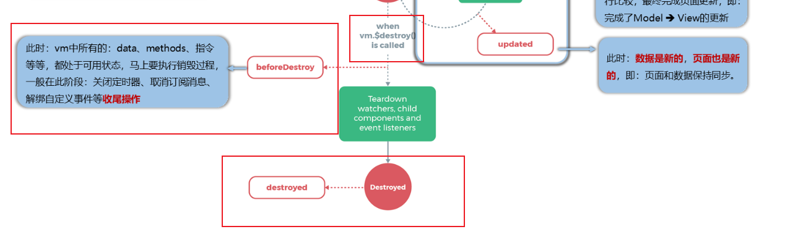
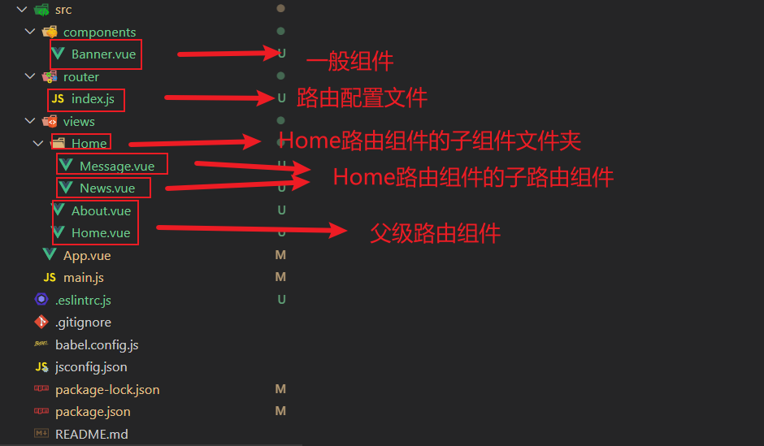

# 一、Vue核心

Vue (读音 /vjuː/，类似于 **view**) 是一套用于构建用户界面的**渐进式框架**。与其它大型框架不同的是，Vue 被设计为可以自底向上逐层应用。Vue 的核心库只关注视图层，不仅易于上手，还便于与第三方库或既有项目整合。另一方面，当与现代化的工具链以及各种支持类库结合使用时，Vue 也完全能够为复杂的单页应用提供驱动。

Vue2官网：https://v2.cn.vuejs.org/

Vue3官网：https://vuejs.org/

**Vue引入：**

1. 直接用`<script>`标签引入：

   直接下载并用 `<script>` 标签引入，`Vue` 会被注册为一个全局变量。

   注意：在开发环境下不要使用压缩版本，不然你就失去了所有常见错误相关的警告!

2. CDN：

   对于制作原型或学习，你可以这样使用最新版本：

```html
<script src="https://cdn.jsdelivr.net/npm/vue@2.7.14/dist/vue.js"></script>
```

​		对于生产环境，我们推荐链接到一个明确的版本号和构建文件，以避免新版本造成的不可预期的破坏：

```html
<script src="https://cdn.jsdelivr.net/npm/vue@2.7.14"></script>
```

​		如果你使用原生 ES Modules，这里也有一个兼容 ES Module 的构建文件：

```html
<script type="module">
  import Vue from 'https://cdn.jsdelivr.net/npm/vue@2.7.14/dist/vue.esm.browser.js'
</script>
```

​		你可以在 [-cdn.jsdelivr.net/npm/vue- 浏览 NPM 包的源代码。

​		Vue 也可以在 unpkg- 和 cdnjs 上获取 (cdnjs 的版本更新可能略滞后)。

​		请确认了解**不同构建版本**并在你发布的站点中使用**生产环境版本**，把 `vue.js` 换成 `vue.min.js`。这是一个更小的构建，可以带来比开发环境下更快的速度体验。

## 1 Hello World

Vue.js 的核心是一个允许采用简洁的模板语法来声明式地将数据渲染进 DOM 的系统：

```html
<div id="app">
  {{ message }}
</div>
```

```js
var app = new Vue({
  el: '#app',
  data: {
    message: 'Hello Vue!'
  }
})
```

实例：

```html
<!-- 准备好一个容器 -->
<div id="test">
    <h1>{{name}}</h1>
</div>

<script>
    // 创建Vue实例
    new Vue({
        el: '#test', // el用于指定当前Vue实例为那个容器服务，值通常为css选择器字符串。
        data:{ // data中用于存储数据，数据供el所指定的容器去使用，值我们暂时先写成一个对象
            name: 'Hello World!'
        },
    })
</script>
```

我们已经成功创建了第一个 Vue 应用！

1. 想让Vue工作，就必须创建一个Vue实例，且要传入一个配置对象；
2. root容器里的代码依然符合html规范，只不过混入了一些特殊的Vue语法；
3. root容器里的代码被称为【Vue模板】；
4. Vue实例和容器是一一对应的；
5. 真实开发中只有一个Vue实例，并且会配合着组件一起使用；
6. {{xxx}}中的xxx要写js表达式，且xxx可以自动读取到data中的所有属性；
7. 一旦data中的数据发生改变，那么页面中用到该数据的地方也会自动更新；

## 2 模版语法

Vue模板语法有2大类：

1. 插值语法：

   - 功能：用于解析标签体内容。

   - 写法：{{xxx}}，xxx是js表达式，且可以直接读取到data中的所有属性。

2. 指令语法：

   - 功能：用于解析标签（包括：标签属性、标签体内容、绑定事件.....）。

   - 举例：v-bind:href="xxx" 或  简写为 :href="xxx"，xxx同样要写js表达式，且可以直接读取到data中的所有属性。

   - 备注：Vue中有很多的指令，且形式都是：v-????，此处我们只是拿v-bind举个例子。

```html
<!-- 准备好一个容器 -->
<div id="root">
    <h1>插值语法</h1>
    <h3>Hello,{{name}}</h3>
    <hr />
    <h1>指令语法</h1>
    <a v-bind:href="school.url.toUpperCase()" x="hello">点我去{{school.name}}学习1</a>
    <a :href="school.url" x="hello">点我去{{school.name}}学习2</a>
</div>

<script>
    Vue.config.productionTip = false //阻止 vue 在启动时生成生产提示。

    // 创建Vue实例
    new Vue({
        el: '#root', // el用于指定当前Vue实例为那个容器服务，值通常为css选择器字符串。
        data: { // data中用于存储数据，数据供el所指定的容器去使用，值我们暂时先写成一个对象
            name: 'World!',
            school: {
                url: 'http://www.baidu.com',
                name: '北京大学'
            }
        },
    })
</script>
```

## 3 数据绑定

Vue中有2种数据绑定的方式：

1. 单向绑定(v-bind)：数据只能从data流向页面。
2. 双向绑定(v-model)：数据不仅能从data流向页面，还可以从页面流向data。

**备注：**

- 双向绑定一般都应用在表单类元素上（如：input、select等）
- v-model:value 可以简写为 v-model，因为v-model默认收集的就是value值。

```html
<!-- 准备好一个容器 -->
<div id="root">
    单项数据绑定：<input type="text" v-bind:value="name">
    <!-- 
简写：
<input type="text" :value="name">
-->
</div>

<div id="root1">
    双向数据绑定：<input type="text" v-model:value="name">
    <!-- 
简写：
<input type="text" v-model="name">
-->

    <!-- 如下代码是错误的，因为v-model只能应用在表单类元素（输入类元素）上 -->
    <!-- <h2 v-model:x="name">你好啊</h2> -->
</div>
<script>
    Vue.config.productionTip = false //阻止 vue 在启动时生成生产提示。
    // 创建Vue实例
    new Vue({
        el: '#root',
        data: {
            name: 'Vue'
        },
    })
    new Vue({
        el: '#root1',
        data: {
            name: 'Vue1'
        },
    })
</script>
```

## 4 el和data的两种写法

**el有2种写法**

- new Vue时候配置el属性。

  ```js
  new Vue({
  	el:'#root',
  	data:{
  		name:'Vue'
  	}
  })
  ```

- 先创建Vue实例，随后再通过vm.$mount('#root')指定el的值。

  ```js
  // 我们使用 v，来接住了这个Vue({})实例
  const v = new Vue({
  	data:{
  		name:'尚硅谷'
  	}
  })
  console.log(v)
  
  // 给 v 这个储存了 Vue({})实例的家伙，挂载一个连接
  // 让它能和html代码中的v-bind或者v-model等建立联系
  v.$mount('#root')
  ```

**data有2种写法**

- 对象式

  ```js
  new Vue({
      el:'#root',
      //data的第一种写法：对象式
      data:{
          name:'尚硅谷'
      } 
  })
  ```

- 函数式

  ```js
  new Vue({
      el:'#root',
      //data的第二种写法：函数式
      data(){
          console.log('@@@',this) //此处的this是Vue实例对象
          return{
              name:'尚硅谷'
          }
      }
  })
  ```

- 如何选择：目前哪种写法都可以，以后学习到组件时，data必须使用函数式，否则会报错

一个重要的原则：由Vue管理的函数，一定不要写箭头函数，一旦写了箭头函数，this就不再是Vue实例了。

## 5 MVVM模型

MVVM模型

- M：模型(Model) ：data中的数据
- V：视图(View) ：模板代码
- VM：视图模型(ViewModel)：Vue实例

观察发现：

- data中所有的属性，最后都出现在了vm身上。
- vm身上所有的属性 及 Vue原型上所有属性，在Vue模板中都可以直接使用。

```html
<!-- 准备好一个容器-->
<div id="root">
    <h1>学校名称：{{name}}</h1>
    <h1>学校地址：{{address}}</h1>
    <!-- 
	<h1>测试一下1：{{1+1}}</h1>
	<h1>测试一下2：{{$options}}</h1>
	<h1>测试一下3：{{$emit}}</h1>
	<h1>测试一下4：{{_c}}</h1>
	-->
</div>
</body>

<script type="text/javascript">
    Vue.config.productionTip = false //阻止 vue 在启动时生成生产提示。

    const vm = new Vue({
        el:'#root',
        data:{
            name:'Vue',
            address:'北京',
        }
    })
    console.log(vm)
</script>
```

## 6 数据代理

### 6.1 Object.defineProperty()语法说明：

`Object.defineProperty()`的作用就是直接在一个对象上定义一个新属性，或者修改一个已经存在的属性

```js
Object.defineProperty(obj, prop, desc);
```

1. obj 需要定义属性的当前对象
2. prop 当前需要定义的属性名
3. desc 属性描述符

一般通过为对象的属性赋值的情况下，对象的属性可以修改也可以删除，但是通过Object.defineProperty()定义属性，通过描述符的设置可以进行更精准的控制对象属性。

**属性描述符**

通过Object.defineProperty()为对象定义属性，有两种形式，且不能混合使用，分别为数据描述符，存取描述符，下面分别描述下两者的区别：

1. 数据描述符 --特有的两个属性（value,writable）

```js
let Person = {}
Object.defineProperty(Person, 'name', {
   value: 'jack',
   writable: true // 是否可以改变
})
```

2. 存取描述符 --是由一对 getter、setter 函数功能来描述的属性

   get：一个给属性提供getter的方法，如果没有getter则为undefined。该方法返回值被用作属性值。默认为undefined。
   set：一个给属性提供setter的方法，如果没有setter则为undefined。该方法将接受唯一参数，并将该参数的新值分配给该属性。默认值为undefined。

```js
let number = 18
let person = {
    name:'张三',
    sex:'男',
}

Object.defineProperty(person,'age',{
    // value:18,
    // enumerable:true, //控制属性是否可以枚举，默认值是false
    // writable:true, //控制属性是否可以被修改，默认值是false
    // configurable:true //控制属性是否可以被删除，默认值是false

    //当有人读取person的age属性时，get函数(getter)就会被调用，且返回值就是age的值
    get(){
        console.log('有人读取age属性了')
        return number
    },

    //当有人修改person的age属性时，set函数(setter)就会被调用，且会收到修改的具体值
    set(value){
        console.log('有人修改了age属性，且值是',value)
        number = value
    }

})

// console.log(Object.keys(person))

console.log(person)
```

**存取器描述**

当使用存取器描述属性的特性的时候，允许设置以下特性属性：

```js
var obj = {};
Object.defineProperty(obj,"newKey",{
    get:function (){} | undefined,
    set:function (value){} | undefined
    configurable: true | false
    enumerable: true | false
});
```

​	注意：当使用了getter或setter方法，不允许使用writable和value这两个属性

**getter/setter**

当设置或获取对象的某个属性的值的时候，可以提供getter/setter方法。

- getter 是一种获得属性值的方法
- setter是一种设置属性值的方法。

在特性中使用get/set属性来定义对应的方法。

```js
var obj = {};
var initValue = 'hello';
Object.defineProperty(obj,"newKey",{
    get:function (){
        //当获取值的时候触发的函数
        return initValue;    
    },
    set:function (value){
        //当设置值的时候触发的函数,设置的新值通过参数value拿到
        initValue = value;
    }
});
//获取值
console.log( obj.newKey );  //hello

//设置值
obj.newKey = 'change value';

console.log( obj.newKey ); //change value
```

注意：get或set不是必须成对出现，任写其一就可以。如果不设置方法，则get和set的默认值为undefined

### 6.2 何为数据代理

通过一个对象代理对另一个对象中的属性的操作（读/写），就是数据代理。

JS有一个内置对象Object数据代理的方法为：`Object.defineProperty(obj, prop, descriptor)`，通过这个方法即可实现数据代理。
参数解析：

- obj----------------------------------->要定义属性的对象
- prop--------------------------------->要定义或修改的属性的名称或 Symbol
- descriptor-------------------------->要定义或修改的属性描述符

```js
let obj1 = {x:100};
let obj2 = {y:200};

Object.defineProperty(obj2, 'x', {
    // 当读取obj2的x属性时，get函数（getter）就会被调用，且返回值就是x的值
    get() {
        console.log('拿obj1的x了');
        return obj1.x
    },
    // 当修改obj2的x属性时，set函数（setter）就会被调用，且会收到一个具体修改的值value
    set(value) {
        console.log('给obj1的x赋值');
        obj1.x = value
    }
})
```

### 6.3 Vue中的数据代理

1. Vue中的数据代理：

   - 通过vm对象来代理data对象中属性的操作（读/写）

2. Vue中数据代理的好处：

   - 更加方便的操作data中的数据

3. 基本原理：

   - 通过Object.defineProperty()把data对象中所有属性添加到vm上。

   - 为每一个添加到vm上的属性，都指定一个getter/setter。

   - 在getter/setter内部去操作（读/写）data中对应的属性。

```html
<body>
    <!-- 准备好一个容器-->
    <div id="root">
        <h2>学校名称：{{name}}</h2>
        <h2>学校地址：{{address}}</h2>
    </div>
</body>

<script type="text/javascript">
    Vue.config.productionTip = false //阻止 vue 在启动时生成生产提示。

    const vm = new Vue({
        el:'#root',
        data:{
            name:'尚硅谷',
            address:'宏福科技园'
        }
    })
</script>
```

数据代理图示：


## 7 事件处理

### 7.1 事件的基本使用

1. 使用v-on:xxx 或 @xxx 绑定事件，其中xxx是事件名；
2. 事件的回调需要配置在methods对象中，最终会在vm上；
3. methods中配置的函数，不要用箭头函数！否则this就不是vm了；
4. methods中配置的函数，都是被Vue所管理的函数，this的指向是vm 或 组件实例对象；
5. @click="demo" 和 @click="demo($event)" 效果一致，但后者可以传参；

```html
<body>
    <!-- 准备好一个容器-->
    <div id="root">
        <h2>欢迎来到{{name}}学习</h2>
        <!-- <button v-on:click="showInfo">点我提示信息</button> -->
        <button @click="showInfo1">点我提示信息1（不传参）</button>
        <button @click="showInfo2($event,66)">点我提示信息2（传参）</button>
    </div>
</body>

<script type="text/javascript">
    Vue.config.productionTip = false //阻止 vue 在启动时生成生产提示。

    const vm = new Vue({
        el:'#root',
        data:{
            name:'尚硅谷',
        },
        methods:{
            showInfo1(event){
                // console.log(event.target.innerText)
                // console.log(this) //此处的this是vm
                alert('同学你好！')
            },
            showInfo2(event,number){
                console.log(event,number)
                // console.log(event.target.innerText)
                // console.log(this) //此处的this是vm
                alert('同学你好！！')
            }
        }
    })
</script>
```

### 7.2 事件修饰符

Vue中的事件修饰符：

1. prevent：阻止默认事件（常用）；
2. stop：阻止事件冒泡（常用）；
3. once：事件只触发一次（常用）；
4. capture：使用事件的捕获模式；
5. self：只有event.target是当前操作的元素才触发事件；
6. passive：事件的默认行为立即执行，无需等待事件回调执行完毕。

```html
<!DOCTYPE html>
<html>
	<head>
		<meta charset="UTF-8" />
		<title>事件修饰符</title>
		<!-- 引入Vue -->
		<script type="text/javascript" src="../js/vue.js"></script>
		<style>
			*{
				margin-top: 20px;
			}
			.demo1{
				height: 50px;
				background-color: skyblue;
			}
			.box1{
				padding: 5px;
				background-color: skyblue;
			}
			.box2{
				padding: 5px;
				background-color: orange;
			}
			.list{
				width: 200px;
				height: 200px;
				background-color: peru;
				overflow: auto;
			}
			li{
				height: 100px;
			}
		</style>
	</head>
	<body>
		<!-- 准备好一个容器-->
		<div id="root">
			<h2>欢迎来到{{name}}学习</h2>
			<!-- 阻止默认事件（常用） -->
			<a href="http://www.atguigu.com" @click.prevent="showInfo">点我提示信息</a>

			<!-- 阻止事件冒泡（常用） -->
			<div class="demo1" @click="showInfo">
				<button @click.stop="showInfo">点我提示信息</button>
				<!-- 修饰符可以连续写 -->
				<!-- <a href="http://www.atguigu.com" @click.prevent.stop="showInfo">点我提示信息</a> -->
			</div>

			<!-- 事件只触发一次（常用） -->
			<button @click.once="showInfo">点我提示信息</button>

			<!-- 使用事件的捕获模式 -->
			<div class="box1" @click.capture="showMsg(1)">
				div1
				<div class="box2" @click="showMsg(2)">
					div2
				</div>
			</div>

			<!-- 只有event.target是当前操作的元素时才触发事件； -->
			<div class="demo1" @click.self="showInfo">
				<button @click="showInfo">点我提示信息</button>
			</div>

			<!-- 事件的默认行为立即执行，无需等待事件回调执行完毕； -->
			<ul @wheel.passive="demo" class="list">
				<li>1</li>
				<li>2</li>
				<li>3</li>
				<li>4</li>
			</ul>

		</div>
	</body>

	<script type="text/javascript">
		Vue.config.productionTip = false //阻止 vue 在启动时生成生产提示。

		new Vue({
			el:'#root',
			data:{
				name:'尚硅谷'
			},
			methods:{
				showInfo(e){
					alert('同学你好！')
					// console.log(e.target)
				},
				showMsg(msg){
					console.log(msg)
				},
				demo(){
					for (let i = 0; i < 100000; i++) {
						console.log('#')
					}
					console.log('累坏了')
				}
			}
		})
	</script>
</html>
```

### 7.3 键盘事件

1. Vue中常用的按键别名：

   - 回车 => enter

   - 删除 => delete (捕获“删除”和“退格”键)

   - 退出 => esc

   - 空格 => space

   - 换行 => tab (特殊，必须配合keydown去使用)

   - 上 => up

   - 下 => down

   - 左 => left

   - 右 => right

   ```html
   <body>
       <!-- 准备好一个容器-->
       <div id="root">
           <h2>欢迎来到{{name}}学习</h2>
           <input type="text" placeholder="按下回车提示输入" @keydown.enter="showInfo">
       </div>
   </body>
   
   <script type="text/javascript">
       Vue.config.productionTip = false //阻止 vue 在启动时生成生产提示。
   
       new Vue({
           el: '#root',
           data: {
               name: '尚硅谷'
           },
           methods: {
               showInfo(e) {
                   // console.log(e.key,e.keyCode)
                   console.log(e.target.value)
               }
           },
       })
   </script>
   ```

2. Vue未提供别名的按键，可以使用按键原始的key值去绑定，但注意要转为kebab-case（短横线命名）

3. 系统修饰键（用法特殊）：ctrl、alt、shift、meta

   - 配合keyup使用：按下修饰键的同时，再按下其他键，随后释放其他键，事件才被触发。

   - 配合keydown使用：正常触发事件。

   ```html
   <body>
       <!-- 准备好一个容器-->
       <div id="root">
           <h2>欢迎来到{{name}}学习</h2>
           <input type="text" placeholder="按下回车提示输入" @keydown.ctrl="showInfo">
           <br/>
           <input type="text" placeholder="按下回车提示输入" @keyup.ctrl.y="showInfo">
       </div>
   </body>
   
   <script type="text/javascript">
       Vue.config.productionTip = false //阻止 vue 在启动时生成生产提示。
   
       new Vue({
           el: '#root',
           data: {
               name: '尚硅谷'
           },
           methods: {
               showInfo(e) {
                   // console.log(e.key,e.keyCode)
                   console.log(e.target.value)
               }
           },
       })
   </script>
   ```

4. 也可以使用keyCode去指定具体的按键（不推荐）

5. Vue.config.keyCodes.自定义键名 = 键码，可以去定制按键别名

   ```html
   <body>
       <!-- 准备好一个容器-->
       <div id="root">
           <h2>欢迎来到{{name}}学习</h2>
           <input type="text" placeholder="按下回车提示输入" @keydown.huiche="showInfo">
       </div>
   </body>
   
   <script type="text/javascript">
       Vue.config.productionTip = false //阻止 vue 在启动时生成生产提示。
       //Vue.config.keyCodes.自定义键名 = 键码，可以去定制按键别名
       Vue.config.keyCodes.huiche = 13 //定义了一个别名按键
   
       new Vue({
           el: '#root',
           data: {
               name: '尚硅谷'
           },
           methods: {
               showInfo(e) {
                   // console.log(e.key,e.keyCode)
                   console.log(e.target.value)
               }
           },
       })
   </script>
   ```


## 8 计算属性

**姓名案例：**

### 8.1 插值语法实现

```html
<div id="root">
    姓：<input type="text" v-model:value="firstName"><br />
    名：<input type="text" v-model:value="lastName"><br />
    姓名：<span>{{firstName}}-{{lastName}}</span>
</div>

<script>
    new Vue({
        el:'#root',
        data: {
            firstName:'张',
            lastName:'三'
        }
    })
</script>
```

### 8.2 methods实现

```html
<div id="root">
    姓：<input type="text" v-model:value="firstName"><br />
    名：<input type="text" v-model:value="lastName"><br />
    姓名：<span>{{fullName()}}</span>
</div>

<script>
    new Vue({
        el: '#root',
        data: {
            firstName: '张',
            lastName: '三'
        },
        methods: {
            fullName() {
                return this.firstName + "-" + this.lastName
            }
        }
    })
</script>
```

### 8.3 计算属性实现

计算属性：

1. 定义：要用的属性不存在，要通过已有的属性计算得来。
2. 原理：底层借助了Object.defineproperty方法提供的getter和setter。
3. get函数什么时候执行？
   1. 初次读取时会执行一次
   2. 当依赖的数据发生改变时会被再次调用。
4. 优势：与methods实现相比，内部有缓存机制（复用），效率更高，调式方便。
5. 备注：
   1. 计算属性最终会出现在vm上，直接读取使用即可。
   2. 如果计算属性要被修改，那必须写set函数去响应修改，且set中要引起计算时依赖的数据发生改变。

```html
<div id="root">
    姓：<input type="text" v-model:value="firstName"><br />
    名：<input type="text" v-model:value="lastName"><br />
    姓名：<span>{{fullName}}</span>
</div>

<script>
    const vm = new Vue({
        el: '#root',
        data: {
            firstName: '张',
            lastName: '三'
        },
        computed:{
            c:{
                // get有什么作业：当有人读取fullName时，get()就会被调用，返回值会作为fullName的值
                // get何时被调用：1.初次读取fullName时，2.所依赖的数据发生变化时
                get(){
                    console.log("get被调用了");
                    return this.firstName +"-"+ this.lastName;
                },
                //set什么时候调用？当fullName被修改时
                //通过vm.fullName = "李-四" 即可修改
                set(value){
                    console.log('set' ,value);
                    const arr = value.split('-');
                    this.firstName = arr[0];
                    this.lastName = arr[1];
                }
            }
        }
    })
</script>
```

### 8.4 计算属性简写

当只考虑读取，不考虑修改时，可考虑get的简写方式

```html
<div id="root">
    姓：<input type="text" v-model:value="firstName"><br />
    名：<input type="text" v-model:value="lastName"><br />
    姓名：<span>{{fullName}}</span>
</div>

<script>
    const vm = new Vue({
        el: '#root',
        data: {
            firstName: '张',
            lastName: '三'
        },
        computed:{
            fullName(){
                console.log("get被调用了");
                return this.firstName +"-"+ this.lastName;
            }
        }
    })
</script>
```

## 9 监视属性

### 9.1 天气案例

```html
<body>
    <div id="root">
        <h2>今天天气很{{info}}</h2>
        <!-- 绑定事件的时候：@xxx="yyy" yyy可以写一些简单的语句 -->
		<!-- <button @click="isHot = !isHot">切换天气</button> -->
        <button @click=changeWeather>切换天气</button>
    </div>
</body>
<script>
    new Vue({
        el: '#root',
        data:{
            isHot: true,
        },
        computed: {
            info() {
                return this.isHot ? '炎热' : '凉爽'
            }
        },
        methods: {
            changeWeather() {
                this.isHot = !this.isHot;
            }
        },
    });
</script>
```

### 9.2 监视属性

监视属性watch：

1. 当被监视的属性变化时，回调函数自动调用，进行相关操作
2. 监视的属性必须存在，才能进行监视
3. 监视的两种写法：
   1. new Vue时传入watch配置
   2. 通过vm.$watch监视

```html
<body>
    <div id="root">
        <h2>今天天气很{{info}}</h2>
        <!-- 绑定事件的时候：@xxx="yyy" yyy可以写一些简单的语句 -->
        <!-- <button @click="isHot = !isHot">切换天气</button> -->
        <button @click=changeWeather>切换天气</button>
    </div>
</body>
<script>
    const vm = new Vue({
        el: '#root',
        data: {
            isHot: true,
        },
        computed: {
            info() {
                return this.isHot ? '炎热' : '凉爽'
            }
        },
        methods: {
            changeWeather() {
                this.isHot = !this.isHot;
            }
        },
        // watch: {
        //     isHot: {
        //         immediate: true,//初始化时让handler调用一下
        //         // handler何时调用？当isHot发送改变时
        //         handler(newValue, oldValue) {
        //             console.log("isHot被修改了", newValue, oldValue);
        //         }
        //     }
        // }
    });
    vm.$watch('isHot', {
        immediate: true,//初始化时让handler调用一下
        // handler何时调用？当isHot发送改变时
        handler(newValue, oldValue) {
            console.log("isHot被修改了", newValue, oldValue);
        }
    })
</script>
```

### 9.3 深度监视

深度监视：

1. Vue中的watch默认不监测对象内部值的改变（一层）

2. 配置 deep:true 可以监测对象内部值改变（多层）

备注：

1. Vue自身可以监测对象内部值的改变，但Vue提供的watch默认不可以
2. 使用watch时根据数据的具体结构，决定是否采用深度监视

```html
<body>
    <div id="root">
        <h2>今天天气很{{info}}</h2>
        <!-- 绑定事件的时候：@xxx="yyy" yyy可以写一些简单的语句 -->
        <!-- <button @click="isHot = !isHot">切换天气</button> -->
        <button @click=changeWeather>切换天气</button>
        <hr />
        <h3>a的值是:{{numbers.a}}</h3>
        <button @click="numbers.a++">点我让a+1</button>
        <h3>b的值是:{{numbers.b}}</h3>
        <button @click="numbers.b++">点我让b+1</button>
        <button @click="numbers = {a:666,b:888}">彻底替换掉numbers</button>
        <!-- {{numbers.c.d.e}} -->
    </div>
</body>
<script>
    const vm = new Vue({
        el: '#root',
        data: {
            isHot: true,
            numbers: {
                a: 1,
                b: 1,
                c: {
                    d: {
                        e: 100
                    }
                }

            }
        },
        computed: {
            info() {
                return this.isHot ? '炎热' : '凉爽'
            }
        },
        methods: {
            changeWeather() {
                this.isHot = !this.isHot;
            }
        },
        watch: {
            isHot: {
                immediate: true,//初始化时让handler调用一下
                // handler何时调用？当isHot发送改变时
                handler(newValue, oldValue) {
                    console.log("isHot被修改了", newValue, oldValue);
                }
            },
            // 监视多级结构中某个属性的变化
            // 'numbers.a': {
            //     handler() {
            //         console.log("a发生了改变！");
            //     }
            // },

            // 监视多级结构中全部属性的变化
            numbers: {
                deep:true,
                handler() {
                    console.log("numbers发生了改变！");
                }
            }
        }
    });
</script>
```

### 9.4 监视属性-简写

```html
<body>
    <!-- 准备好一个容器-->
    <div id="root">
        <h2>今天天气很{{info}}</h2>
        <button @click="changeWeather">切换天气</button>
    </div>
</body>

<script type="text/javascript">
    Vue.config.productionTip = false //阻止 vue 在启动时生成生产提示。

    const vm = new Vue({
        el:'#root',
        data:{
            isHot:true,
        },
        computed:{
            info(){
                return this.isHot ? '炎热' : '凉爽'
            }
        },
        methods: {
            changeWeather(){
                this.isHot = !this.isHot
            }
        },
        watch:{
            //正常写法
            /* isHot:{
					// immediate:true, //初始化时让handler调用一下
					// deep:true,//深度监视
					handler(newValue,oldValue){
						console.log('isHot被修改了',newValue,oldValue)
					}
				}, */
            //简写
            /* isHot(newValue,oldValue){
					console.log('isHot被修改了',newValue,oldValue,this)
				} */
        }
    })

    //正常写法
    /* vm.$watch('isHot',{
			immediate:true, //初始化时让handler调用一下
			deep:true,//深度监视
			handler(newValue,oldValue){
				console.log('isHot被修改了',newValue,oldValue)
			}
		}) */

    //简写
    /* vm.$watch('isHot',(newValue,oldValue)=>{
			console.log('isHot被修改了',newValue,oldValue,this)
		}) */

</script>
```

### 9.5 computed和watch之间的区别

1. computed能完成的功能，watch都可以完成。
2. watch能完成的功能，computed不一定能完成，例如：watch可以进行异步操作。

两个重要原则：

1. 所被Vue管理的函数，最好写成普通函数，这样this的指向才是 vm 或 组件实例对象。
2. 所有不被Vue所管理的函数（定时器的回调函数，ajax的回调函数等），最好写成箭头函数，这样this的指向才是 vm 或 组建实例对象

**使用watch实现姓名案例：**

```html
<div id="root">
    姓：<input type="text" v-model:value="firstName"><br />
    名：<input type="text" v-model:value="lastName"><br />
    姓名：<span>{{fullName}}</span>
</div>

<script>
    const vm = new Vue({
        el: '#root',
        data: {
            firstName: '张',
            lastName: '三',
            fullName: '张-三'
        },
        // computed: {
        //     fullName() {
        //         console.log("get被调用了");
        //         return this.firstName + "-" + this.lastName;
        //     }
        // },
        watch: {
            firstName(newValue) {
                console.log(newValue);
                setTimeout(() => {
                    this.fullName = newValue + "-" + this.lastName;
                }, 3000);

            },
            lastName(newValue) {
                console.log(newValue);
                this.fullName = this.firstName + "-" + newValue;
            }
        }
    })
</script>
```

**使用computed实现姓名案例：**

```html
<div id="root">
    姓：<input type="text" v-model:value="firstName"><br />
    名：<input type="text" v-model:value="lastName"><br />
    姓名：<span>{{fullName}}</span>
</div>

<script>
    const vm = new Vue({
        el: '#root',
        data: {
            firstName: '张',
            lastName: '三'
        },
        computed:{
            c:{
                // get有什么作业：当有人读取fullName时，get()就会被调用，返回值会作为fullName的值
                // get何时被调用：1.初次读取fullName时，2.所依赖的数据发生变化时
                get(){
                    console.log("get被调用了");
                    return this.firstName +"-"+ this.lastName;
                },
                //set什么时候调用？当fullName被修改时
                //通过vm.fullName = "李-四" 即可修改
                set(value){
                    console.log('set' ,value);
                    const arr = value.split('-');
                    this.firstName = arr[0];
                    this.lastName = arr[1];
                }
            }
        }
    })
</script>
```

## 10 绑定样式

### 10.1 绑定class样式

#### 10.1.1 字符串写法

适用于：样式的类名不确定，需要动态指定

```html
<!DOCTYPE html>
<html>

<head>
    <meta charset="UTF-8" />
    <title>绑定样式</title>
    <style>
        .basic {
            width: 400px;
            height: 100px;
            border: 1px solid black;
        }

        .happy {
            border: 4px solid red;
            background-color: rgba(255, 255, 0, 0.644);
            background: linear-gradient(30deg, yellow, pink, orange, yellow);
        }

        .sad {
            border: 4px dashed rgb(2, 197, 2);
            background-color: gray;
        }
    </style>
    <script type="text/javascript" src="../Vue/vue.js"></script>
</head>

<body>
    <!-- 准备好一个容器-->
    <div id="root">
        <!-- 绑定class样式--字符串写法，适用于：样式的类名不确定，需要动态指定 -->
        <div class="basic" :class="mood" @click="changeMood">{{name}}</div> <br/><br/>
    </div>
</body>

<script type="text/javascript">
    Vue.config.productionTip = false

    const vm = new Vue({
        el: '#root',
        data: {
            name:"Hello World!",
            mood: 'normal',
        },
        methods: {
            changeMood() {
                const arr = ['happy', 'sad', 'normal']
                const index = Math.floor(Math.random() * 3)
                this.mood = arr[index]
            }
        },
    })
</script>

</html>
```

#### 10.1.2 数组写法

适用于：要绑定的样式个数不确定、名字也不确定

```html
<!DOCTYPE html>
<html>

<head>
    <meta charset="UTF-8" />
    <title>绑定样式</title>
    <style>
        .basic {
            width: 400px;
            height: 100px;
            border: 1px solid black;
        }

        .happy {
            border: 4px solid red;
            background-color: rgba(255, 255, 0, 0.644);
            background: linear-gradient(30deg, yellow, pink, orange, yellow);
        }

        .sad {
            border: 4px dashed rgb(2, 197, 2);
            background-color: gray;
        }

        .beijing {
            background-color: yellowgreen;
        }

        .ziti {
            font-size: 30px;
            text-shadow: 2px 2px 10px red;
        }

        .yuanjiao {
            border-radius: 20px;
        }
    </style>
    <script type="text/javascript" src="../Vue/vue.js"></script>
</head>

<body>
    <!-- 准备好一个容器-->
    <div id="root">
        <!-- 绑定class样式--数组写法，适用于：要绑定的样式个数不确定、名字也不确定 -->
        <div class="basic" :class="classArr">{{name}}</div> <br /><br />
    </div>
</body>

<script type="text/javascript">
    Vue.config.productionTip = false

    const vm = new Vue({
        el: '#root',
        data: {
            name: "Hello World!",
            classArr: ["beijing", "ziti", "yuanjiao"]
        },
    })
</script>

</html>
```

#### 10.1.3 对象写法

适用于：要绑定的样式个数确定，名字也确定，但是要动态决定用不用

```html
<!DOCTYPE html>
<html>

<head>
    <meta charset="UTF-8" />
    <title>绑定样式</title>
    <style>
        .basic {
            width: 400px;
            height: 100px;
            border: 1px solid black;
        }

        .happy {
            border: 4px solid red;
            background-color: rgba(255, 255, 0, 0.644);
            background: linear-gradient(30deg, yellow, pink, orange, yellow);
        }

        .sad {
            border: 4px dashed rgb(2, 197, 2);
            background-color: gray;
        }

        .beijing {
            background-color: yellowgreen;
        }

        .ziti {
            font-size: 30px;
            text-shadow: 2px 2px 10px red;
        }

        .yuanjiao {
            border-radius: 20px;
        }
    </style>
    <script type="text/javascript" src="../Vue/vue.js"></script>
</head>

<body>
    <!-- 准备好一个容器-->
    <div id="root">
        <!-- 绑定class样式--数组写法，适用于：要绑定的样式个数不确定、名字也不确定 -->
        <div class="basic" :class="classObj">{{name}}</div> <br/><br />
    </div>
</body>

<script type="text/javascript">
    Vue.config.productionTip = false

    const vm = new Vue({
        el: '#root',
        data: {
            name: "Hello World!",
            classObj:{
                beijing:false,
                ziti:false
            }
        },

    })
</script>

</html>
```

### 10.2 绑定style样式

#### 10.2.1 对象写法

```html
<body>
    <!-- 准备好一个容器-->
    <div id="root">
        <!-- 对象写法 -->
        <div class="basic" :style="styleObj1">{{name}}</div> <br />
        <div class="basic" :style=[styleObj1,styleObj2]>{{name}}</div> <br />
    </div>
</body>

<script type="text/javascript">
    Vue.config.productionTip = false

    const vm = new Vue({
        el: '#root',
        data: {
            name: "Hello World!",
            styleObj1: {
                backgroundColor: 'pink',
            },
            styleObj2: {
                height: '200px',
                fontSize: '40px',
            },   
        },
    })
</script>
```

#### 10.2.2 数组写法

```html
<body>
    <!-- 准备好一个容器-->
    <div id="root">
        <!-- 数组写法 -->
        <div class="basic" :style="styleArr">{{name}}</div> <br />
    </div>
</body>

<script type="text/javascript">
    Vue.config.productionTip = false

    const vm = new Vue({
        el: '#root',
        data: {
            name: "Hello World!", 
            styleArr: [
                {
                    fontSize: '40px',
                    color: 'blue',
                },
                {
                    backgroundColor: 'gray'
                }
            ],
        },
    })
</script>
```

## 11 条件渲染

**v-if：**

写法：

1. v-if="表达式"
2. v-else-if="表达式"
3. v-else="表达式"

适用于：切换频率较低的场景

特点：不展示的DOM元素直接被移除

注意：v-if 可以和 v-else-if，v-else一起使用，但要求结构不能被打断。

```html
<body>
    <!-- 准备好一个容器-->
    <div id="root">
        <h2>当前的n值是:{{n}}</h2>
        <button @click="n++">点我n+1</button>
        <!-- 使用v-if做条件渲染 -->
        <h2 v-if="false">欢迎来到{{name}}</h2>
        <h2 v-if="1 === 1">欢迎来到{{name}}</h2>

        <!-- v-else和v-else-if -->
        <div v-if="n === 1">Angular</div>
        <div v-else-if="n === 2">React</div>
        <div v-else-if="n === 3">Vue</div>
        <div v-else>哈哈</div>

        <!-- v-if与template的配合使用 -->
        <template v-if="n === 1">
            <h2>你好</h2>
            <h2>尚硅谷</h2>
            <h2>北京</h2>
        </template>

    </div>
</body>

<script type="text/javascript">
    Vue.config.productionTip = false

    const vm = new Vue({
        el: '#root',
        data: {
            name: 'Hello World！',
            n: 0
        }
    })
</script>
```

**v-show：**

写法：v-show:"表达式"

适用于：切换频率较高的场景

特点：不展示的DOM元素未被移除，仅仅是使用样式隐藏掉

```html
<body>
    <!-- 准备好一个容器-->
    <div id="root">
        <h2>当前的n值是:{{n}}</h2>
        <button @click="n++">点我n+1</button>
        <!-- 使用v-show做条件渲染 -->
        <h2 v-show="false">欢迎来到{{name}}</h2>
        <h2 v-show="1 === 1">欢迎来到{{name}}</h2>
    </div>
</body>

<script type="text/javascript">
    Vue.config.productionTip = false

    const vm = new Vue({
        el: '#root',
        data: {
            name: 'Hello World!',
            n: 0
        }
    })
</script>
```

**备注：**

使用 v-if 时，元素可能无法获取到，而使用v-show一定可以获取到。

## 12 列表渲染

### 12.1 v-for

v-for指令：

用于展示列表数据

语法：`v-for="(item, index) in xxx" :key="yyy"`

可遍历：数组，对象，字符串（用的很少），指定次数（用的很少）

**访问数组**

- 用法：使用v-for="item in list"的写法，依次取出list中的所有item，或者使用v-for="(item,i) in list"，依次取出list中的所有item和它们对应的索引 i

**访问对象数组**

- 用法：使用v-for="user in list "，依次取出list中的每个对象user，或者使用v-for="(user,i) in list"，依次取出list中的每个对象和它们对应的索引

**访问对象**

- 用法：使用v-for="(val,key) in list"，依次取出list中的每个对象的键和值，或者使用v-for="(val,key,i) in list",依次取出list中的每个对象的键，值和索引

**迭代数字**

- 用法：使用v-for="count in 10"，迭代次数将从1开始，一直迭代至10

```html
<body>
    <div id="root">
        <h2>遍历数组</h2>
        <ul>
            <li v-for="(p,index) in persons" :key="index">
                {{p.name}}-{{p.age}}
            </li>
        </ul>

        <h2>遍历对象</h2>
        <ul>
            <li v-for="(value,key) in car" :key="key">
                {{key}}：{{value}}
            </li>
        </ul>

        <h2>遍历字符串</h2>
        <ul>
            <li v-for="(char,index) in str" :key="index">
                {{char}}：{{index}}
            </li>
        </ul>

        <h2>遍历指定次数</h2>
        <ul>
            <li v-for="(number,index) of 5" :key="index">
                {{index}}-{{number}}
            </li>
        </ul>
    </div>
</body>

<script type="text/javascript">
    Vue.config.productionTip = false

    const vm = new Vue({
        el: '#root',
        data: {
            // 数组
            persons: [
                { id: '001', name: '张三', age: 18 },
                { id: '002', name: '李四', age: 19 },
                { id: '003', name: '王五', age: 20 }
            ],
            // 对象
            car: {
                name: "宝马",
                year: "2020年",
                color: "白色"
            },
            str: 'hello',
        }
    })
</script>
```

### 12.2 key的原理

**react、vue中的key有什么作用？（key的内部原理）**

1. 虚拟DOM中key的作用：

   key是虚拟DOM对象的标识，当数据发生变化时，Vue会根据**新数据**生成**新的虚拟DOM**，随后Vue进行**新虚拟DOM**与**旧虚拟DOM**的差异比较，比较规则如下：

2. 对比规则：

   1. 旧虚拟DOM中找到了与新虚拟DOM相同的key：

      - 若虚拟DOM中的内容没变，直接使用之前的真实DOM！

      - 若虚拟DOM中的内容变了，则生成新的真实DOM，随后替换掉页面中之前的真实DOM。

   2. 旧虚拟DOM中为找到与新虚拟DOM相同的key
      - 创建新的真实DOM，随后渲染到页面。

3. 用index作为key可能会引发的问题：

   1. 若对数据进行：逆序添加，逆序删除等破坏顺序操作：

      会产生没有必要的DOM更新，界面效果没问题，但效率低

    2. 如果结构中还包含输入类的DOM：

       会产生错误DOM更新，界面有问题。

4. 开发者如何选择key?
   1. 最好使用每条数据的唯一标识作为key，比如id，手机号，身份证号，学号等唯一值。
   2. 如果不存在对数据的逆序添加，逆序删除等破坏顺序操作，仅用于渲染列表用于展示，使用index作为key是没有问题的。

```html
<!-- 准备好一个容器-->
<div id="root">
    <!-- 遍历数组 -->
    <h2>人员列表（遍历数组）</h2>
    <button @click.once="add">添加一个老刘</button>
    <ul>
        <li v-for="(p,index) of persons" :key="id">
            {{p.name}}-{{p.age}}
            <input type="text">
        </li>
    </ul>
</div>

<script type="text/javascript">
    Vue.config.productionTip = false

    new Vue({
        el: '#root',
        data: {
            persons: [
                { id: '001', name: '张三', age: 18 },
                { id: '002', name: '李四', age: 19 },
                { id: '003', name: '王五', age: 20 }
            ]
        },
        methods: {
            add() {
                const p = { id: '004', name: '老刘', age: 40 }
                this.persons.unshift(p)
            }
        },
    })
</script>
```

### 12.3 列表过滤

**使用watch实现列表过滤：**

```html
<!-- 准备好一个容器-->
<div id="root">
    <h2>人员列表</h2>
    <input type="text" placeholder="请输入名字" v-model="keyWord">
    <ul>
        <li v-for="(p,index) of filPerons" :key="p.id">
            {{p.name}}-{{p.age}}-{{p.sex}}
        </li>
    </ul>
</div>

<script type="text/javascript">
    Vue.config.productionTip = false

    //用watch实现
    new Vue({
        el:'#root',
        data:{
            keyWord:'',
            persons:[
                {id:'001',name:'马冬梅',age:19,sex:'女'},
                {id:'002',name:'周冬雨',age:20,sex:'女'},
                {id:'003',name:'周杰伦',age:21,sex:'男'},
                {id:'004',name:'温兆伦',age:22,sex:'男'}
            ],
            filPerons:[]
        },
        watch:{
            keyWord:{
                immediate:true,
                handler(val){
                    this.filPerons = this.persons.filter((p)=>{
                        return p.name.indexOf(val) !== -1
                    })
                }
            }
        }
    }) 
</script>
```

**使用computed实现列表过滤：**

```html
<!-- 准备好一个容器-->
<div id="root">
    <h2>人员列表</h2>
    <input type="text" placeholder="请输入名字" v-model="keyWord">
    <ul>
        <li v-for="(p,index) of filPerons" :key="p.id">
            {{p.name}}-{{p.age}}-{{p.sex}}
        </li>
    </ul>
</div>

<script type="text/javascript">
    Vue.config.productionTip = false
    //用computed实现
    new Vue({
        el: '#root',
        data: {
            keyWord: '',
            persons: [
                { id: '001', name: '马冬梅', age: 19, sex: '女' },
                { id: '002', name: '周冬雨', age: 20, sex: '女' },
                { id: '003', name: '周杰伦', age: 21, sex: '男' },
                { id: '004', name: '温兆伦', age: 22, sex: '男' }
            ]
        },
        computed: {
            filPerons() {
                return this.persons.filter((p) => {
                    return p.name.indexOf(this.keyWord) !== -1
                })
            }
        }
    }) 
</script>
```

### 12.4 列表排序

```html
<!-- 准备好一个容器-->
<div id="root">
    <h2>人员列表</h2>
    <input type="text" placeholder="请输入名字" v-model="keyWord">
    <button @click="sortType = 2">年龄升序</button>
    <button @click="sortType = 1">年龄降序</button>
    <button @click="sortType = 0">年龄原序</button>

    <ul>
        <li v-for="(p,index) of filPersons" :key="p.id">
            {{p.name}}-{{p.age}}-{{p.sex}}
        </li>
    </ul>
</div>

<script type="text/javascript">
    Vue.config.productionTip = false

    //用watch实现
    new Vue({
        el: '#root',
        data: {
            keyWord: '',
            persons: [
                { id: '001', name: '马冬梅', age: 23, sex: '女' },
                { id: '002', name: '周冬雨', age: 20, sex: '女' },
                { id: '003', name: '周杰伦', age: 22, sex: '男' },
                { id: '004', name: '温兆伦', age: 21, sex: '男' }
            ],
            sortType: '0',//0原顺序，1降序，2升序
        },
        computed: {
            filPersons() {
                const arr = this.persons.filter((p) => {
                    return p.name.indexOf(this.keyWord) !== -1;
                })
                // 判断是否需要排序
                if (this.sortType) {
                    arr.sort((p1, p2) => {
                        return this.sortType === 1 ? p2.age - p1.age : p1.age - p2.age;
                    })
                }
                return arr;
            }
        }
    }) 
</script>
```

### 12.5 数据更新时的问题

```html
<!-- 准备好一个容器-->
<div id="root">
    <h2>人员列表</h2>
    <button @click="updateMei">更新马冬梅的信息</button>
    <ul>
        <li v-for="(p,index) of persons" :key="p.id">
            {{p.name}}-{{p.age}}-{{p.sex}}
        </li>
    </ul>
</div>

<script type="text/javascript">
    Vue.config.productionTip = false

    const vm = new Vue({
        el: '#root',
        data: {
            persons: [
                { id: '001', name: '马冬梅', age: 30, sex: '女' },
                { id: '002', name: '周冬雨', age: 31, sex: '女' },
                { id: '003', name: '周杰伦', age: 18, sex: '男' },
                { id: '004', name: '温兆伦', age: 19, sex: '男' }
            ]
        },
        methods: {
            updateMei() {
                // this.persons[0].name = '马老师' //奏效
                // this.persons[0].age = 50 //奏效
                // this.persons[0].sex = '男' //奏效
                //直接通过操作数据索引进行赋值，虽然能够对数据进行更改，但是Vue监测不到数据的变化
                this.persons[0] = {id:'001',name:'马老师',age:50,sex:'男'} //不奏效 
                //this.persons.splice(0, 1, { id: '001', name: '马老师', age: 50, sex: '男' })
            }
        }
    })

</script>
```

在点击"更新马冬梅的信息"按钮后，Vue的开发者工具未发现数据的更改，但是代码层面来讲数据实际上被改了，Vue没发现数据被改，但是数据实际上改了，该问题与**Vue监测数据的原理**有关。

### 12.6 Vue监测对象改变的原理

注意点1：vue监测数据原理就是，给每个data属性添加get()和 set()方法，即data属性改变 => 调用set()  => 重新渲染页面值改变。

注意点2：加载流程： ①加载data属性，加工封装get()和 set()方法，②vue._data=data，这样控制台点开vue实例就会看到一堆属性及方法了。

**举例：模拟data对象属性值改变了，页面值也跟着改变，即实现vue监测数据改变效果**

```js
let data = {
	name:'尚硅谷',
	address:'北京',
}

//第1步：创建一个监视的实例对象，用于监视data中属性的变化
const obs = new Observer(data)		
console.log(obs)	

//第2步：准备一个vm实例对象
let vm = {}
vm._data = data = obs
         
//第3步：定义观察者函数
function Observer(obj){
	//汇总对象中所有的属性形成一个数组
	const keys = Object.keys(obj)
	//遍历
	keys.forEach((k)=>{
		Object.defineProperty(this,k,{  //this指代观察者对象，而不是vue实例
			get(){
				return obj[k]
			},
			set(val){
				console.log(`${k}被改了，我要去解析模板，生成虚拟DOM.....我要开始忙了`)
				obj[k] = val
			}
		})
	})
}
```

### 12.7 Vue.set()的使用

项目开发过程中，可能会出现**新增属性**的需求，而新增的属性也必须是响应式的，因此需要用到`Vue.set(targetObject,attributeName,attributeValue)`方法或`this.$set(targetObject,attributeName,attributeValue)`进行响应式属性的动态添加，所谓响应式属性也就是这个属性会被添加到_data对象中，并且具有相应的reactive getter和reactive setter，最后被存入到Vue对象实例里。

需要注意，由于Vue本身有规定，不能把一个响应式的属性直接添加到Vue实例身上，而data对象中的所有属性最终都会通过数据代理添加到Vue实例身上，因此Vue.set()方法和this.$set()方法的targetObject这个参数不能是Vue实例本身，也不能是data对象，只能是data对象中的二级属性对象。

**Vue.set( target, propertyName/index, value )**

**参数**：

- `{Object | Array} target`
- `{string | number} propertyName/index`
- `{any} value`

**返回值**：设置的值。

**用法**：向响应式对象中添加一个 property，并确保这个新 property 同样是响应式的，且触发视图更新。它必须用于向响应式对象上添加新 property，因为 Vue 无法探测普通的新增 property (比如 `this.myObject.newProperty = 'hi'`)

**注意：**注意对象不能是 Vue 实例，或者 Vue 实例的根数据对象。解释：Vue.set()方法有局限性，不能给vue实例或者data的直接属性进行添加，只能作用于data下面的某个属性对象。

**举例：比如动态添加“校长属性”，即动态给data属性下面的school对象添加“校长属性”**

```html
<body>
	<!-- 准备好一个容器-->
	<div id="root">
		<h1>学校信息</h1>
		<h2>学校名称：{{school.name}}</h2>
		<h2>学校地址：{{school.address}}</h2>
		<h2>校长是：{{school.leader}}</h2>
		<hr/>
		<h1>学生信息</h1>
		<button @click="addSex">添加一个性别属性，默认值是男</button>
		<h2>姓名：{{student.name}}</h2>
		<h2 v-if="student.sex">性别：{{student.sex}}</h2>
		<h2>年龄：真实{{student.age.rAge}}，对外{{student.age.sAge}}</h2>
		<h2>朋友们</h2>
		<ul>
			<li v-for="(f,index) in student.friends" :key="index">
				{{f.name}}--{{f.age}}
			</li>
		</ul>
	</div>
</body>

<script type="text/javascript">
	Vue.config.productionTip = false //阻止 vue 在启动时生成生产提示。

	const vm = new Vue({
		el:'#root',
		data:{
			school:{
				name:'尚硅谷',
				address:'北京',
			},
			student:{
				name:'tom',
				age:{
					rAge:40,
					sAge:29,
				},
				friends:[
					{name:'jerry',age:35},
					{name:'tony',age:36}
				]
			}
		},
		methods: {
			addSex(){
				// Vue.set(this.student,'sex','男')
				this.$set(this.student,'sex','男')
			}
		}
	})
</script>
```

### 12.8 Vue监测数组改变的原理

**Vue不会为数组元素添加响应式的getter和setter，所以通过下标更改数组数据是无法被Vue所监测到的**。 针对数组，只有通过调用`push`、`pop`、`shift`、`unshift`、`splice`、`reverse`、`sort`这7个改变原数组本身的API，才会引起Vue的响应。

我们知道通过Object.defineProperty()劫持数组为其设置getter和setter后，调用的数组的push、splice、pop等方法改变数组元素时并不会触发数组的setter，这就会造成使用上述方法改变数组后，页面上并不能及时体现这些变化，也就是数组数据变化不是响应式的。

但实际用vue开发时，对于响应式数组，使用push、splice、pop等方法改变数组时，页面会及时体现这种变化，那么vue中是如何实现的呢？

```js
// src/core/observer/array.js

// 获取数组的原型Array.prototype，上面有我们常用的数组方法
const arrayProto = Array.prototype
// 创建一个空对象arrayMethods，并将arrayMethods的原型指向Array.prototype
export const arrayMethods = Object.create(arrayProto)

// 列出需要重写的数组方法名
const methodsToPatch = [
  'push',
  'pop',
  'shift',
  'unshift',
  'splice',
  'sort',
  'reverse'
]
// 遍历上述数组方法名，依次将上述重写后的数组方法添加到arrayMethods对象上
methodsToPatch.forEach(function (method) {
  // 保存一份当前的方法名对应的数组原始方法
  const original = arrayProto[method]
  // 将重写后的方法定义到arrayMethods对象上，function mutator() {}就是重写后的方法
  def(arrayMethods, method, function mutator (...args) {
    // 调用数组原始方法，并传入参数args，并将执行结果赋给result
    const result = original.apply(this, args)
    // 当数组调用重写后的方法时，this指向该数组，当该数组为响应式时，就可以获取到其__ob__属性
    const ob = this.__ob__
    let inserted
    switch (method) {
      case 'push':
      case 'unshift':
        inserted = args
        break
      case 'splice':
        inserted = args.slice(2)
        break
    }
    if (inserted) ob.observeArray(inserted)
    // 将当前数组的变更通知给其订阅者
    ob.dep.notify()
    // 最后返回执行结果result
    return result
  })
})
```

### 12.9 Vue监测数据改变的原理

Vue监视数据的原理：

1. Vue会监视data中所有层次的数据

2. 如何监测对象中的数据？

   通过setter实现监视，且要在new Vue时就传入要监测的数据。

   ① 对象中后追加的属性，Vue默认不做响应式处理

   ② 如需给后添加的属性做响应式，请使用如下API：

   `Vue.set(target，propertyName/index，value)` 或 `vm.$set(target，propertyName/index，value)`

3. 如何监测数组中的数据？

   通过包裹数组更新的方法实现，本质就是做了两件事：

   ① 调用原生对应的方法对数组进行更新

   ② 重新解析模板，进而更新页面

4. 在Vue修改数组中的某个元素一定要用如下方法：

   ① 使用这些API:push()、pop()、shift()、unshift()、splice()、sort()、reverse()

   ② Vue.set() 或 vm.$set()

   特别注意：Vue.set() 和 vm.$set() 不能给vm 或 vm的根数据对象 添加属性！！！

```html
<body>
    <!-- 准备好一个容器-->
    <div id="root">
        <h1>学生信息</h1>
        <button @click="student.age++">年龄+1岁</button> <br/>
        <button @click="addSex">添加性别属性，默认值：男</button> <br/>
        <button @click="student.sex = '未知' ">修改性别</button> <br/>
        <button @click="addFriend">在列表首位添加一个朋友</button> <br/>
        <button @click="updateFirstFriendName">修改第一个朋友的名字为：张三</button> <br/>
        <button @click="addHobby">添加一个爱好</button> <br/>
        <button @click="updateHobby">修改第一个爱好为：开车</button> <br/>
        <button @click="removeSmoke">过滤掉爱好中的抽烟</button> <br/>
        <h3>姓名：{{student.name}}</h3>
        <h3>年龄：{{student.age}}</h3>
        <h3 v-if="student.sex">性别：{{student.sex}}</h3>
        <h3>爱好：</h3>
        <ul>
            <li v-for="(h,index) in student.hobby" :key="index">
                {{h}}
            </li>
        </ul>
        <h3>朋友们：</h3>
        <ul>
            <li v-for="(f,index) in student.friends" :key="index">
                {{f.name}}--{{f.age}}
            </li>
        </ul>
    </div>
</body>

<script type="text/javascript">
    Vue.config.productionTip = false //阻止 vue 在启动时生成生产提示。

    const vm = new Vue({
        el:'#root',
        data:{
            student:{
                name:'tom',
                age:18,
                hobby:['抽烟','喝酒','烫头'],
                friends:[
                    {name:'jerry',age:35},
                    {name:'tony',age:36}
                ]
            }
        },
        methods: {
            addSex(){
                // Vue.set(this.student,'sex','男')
                this.$set(this.student,'sex','男')
            },
            addFriend(){
                this.student.friends.unshift({name:'jack',age:70})
            },
            updateFirstFriendName(){
                this.student.friends[0].name = '张三'
            },
            addHobby(){
                this.student.hobby.push('学习')
            },
            updateHobby(){
                // this.student.hobby.splice(0,1,'开车')
                // Vue.set(this.student.hobby,0,'开车')
                this.$set(this.student.hobby,0,'开车')
            },
            removeSmoke(){
                this.student.hobby = this.student.hobby.filter((h)=>{
                    return h !== '抽烟'
                })
            }
        }
    })
</script>
```

## 13 收集表单数据

若：`<input type="text"/>`，则v-model收集的是value值，用户输入的就是value值。

若：`<input type="radio"/>`，则v-model收集的是value值，且要给标签配置value值。

若：`<input type="checkbox"/>`，
	1. 没有配置input的value属性，那么收集的就是checked（勾选 or 未勾选，是布尔值）
	2. 配置input的value属性:
  (1)v-model的初始值是非数组，那么收集的就是checked（勾选 or 未勾选，是布尔值）
  (2)v-model的初始值是数组，那么收集的的就是value组成的数组

备注：v-model的三个修饰符：

- lazy：失去焦点再收集数据
- number：输入字符串转为有效的数字
- trim：输入首尾空格过滤

```html
<div id="root">
    <form @submit.prevent="demo">
        账号：<input type="text" v-model.trim="userInfo.account"> <br /><br />
        密码：<input type="password" v-model="userInfo.password"> <br /><br />
        年龄：<input type="number" v-model.number="userInfo.age"> <br /><br />
        性别：
        男<input type="radio" name="sex" v-model="userInfo.sex" value="男">
        女<input type="radio" name="sex" v-model="userInfo.sex" value="女"> <br /><br />
        爱好：
        学习<input type="checkbox" v-model="userInfo.hobby" value="学习">
        打游戏<input type="checkbox" v-model="userInfo.hobby" value="打游戏">
        吃饭<input type="checkbox" v-model="userInfo.hobby" value="吃饭">
        <br /><br />
        所属校区
        <select v-model="userInfo.city">
            <option value="">请选择校区</option>
            <option value="北京">北京</option>
            <option value="上海">上海</option>
            <option value="深圳">深圳</option>
            <option value="武汉">武汉</option>
        </select>
        <br /><br />
        其他信息：
        <textarea v-model.lazy="userInfo.other"></textarea> <br /><br />
        <input type="checkbox" v-model="userInfo.agree">阅读并接受<a href="#">《用户协议》</a>
        <button>提交</button>
    </form>
</div>
</body>

<script type="text/javascript">
    Vue.config.productionTip = false

    new Vue({
        el: '#root',
        data: {
            userInfo: {
                account: '',
                password: '',
                age: 18,
                sex: '女',
                hobby: [],
                city: '北京',
                other: '',
                agree: ''
            }
        },
        methods: {
            demo() {
                console.log(JSON.stringify(this.userInfo))
            }
        }
    })
</script>
```

## 14 过滤器

**day.min.js**:

```js
!function (t, e) { "object" == typeof exports && "undefined" != typeof module ? module.exports = e() : "function" == typeof define && define.amd ? define(e) : t.dayjs = e() }(this, function () { "use strict"; var t = "millisecond", e = "second", n = "minute", r = "hour", i = "day", s = "week", u = "month", a = "quarter", o = "year", f = "date", h = /^(\d{4})[-/]?(\d{1,2})?[-/]?(\d{0,2})[^0-9]*(\d{1,2})?:?(\d{1,2})?:?(\d{1,2})?[.:]?(\d+)?$/, c = /\[([^\]]+)]|Y{1,4}|M{1,4}|D{1,2}|d{1,4}|H{1,2}|h{1,2}|a|A|m{1,2}|s{1,2}|Z{1,2}|SSS/g, d = { name: "en", weekdays: "Sunday_Monday_Tuesday_Wednesday_Thursday_Friday_Saturday".split("_"), months: "January_February_March_April_May_June_July_August_September_October_November_December".split("_") }, $ = function (t, e, n) { var r = String(t); return !r || r.length >= e ? t : "" + Array(e + 1 - r.length).join(n) + t }, l = { s: $, z: function (t) { var e = -t.utcOffset(), n = Math.abs(e), r = Math.floor(n / 60), i = n % 60; return (e <= 0 ? "+" : "-") + $(r, 2, "0") + ":" + $(i, 2, "0") }, m: function t(e, n) { if (e.date() < n.date()) return -t(n, e); var r = 12 * (n.year() - e.year()) + (n.month() - e.month()), i = e.clone().add(r, u), s = n - i < 0, a = e.clone().add(r + (s ? -1 : 1), u); return +(-(r + (n - i) / (s ? i - a : a - i)) || 0) }, a: function (t) { return t < 0 ? Math.ceil(t) || 0 : Math.floor(t) }, p: function (h) { return { M: u, y: o, w: s, d: i, D: f, h: r, m: n, s: e, ms: t, Q: a }[h] || String(h || "").toLowerCase().replace(/s$/, "") }, u: function (t) { return void 0 === t } }, y = "en", M = {}; M[y] = d; var m = function (t) { return t instanceof S }, D = function (t, e, n) { var r; if (!t) return y; if ("string" == typeof t) M[t] && (r = t), e && (M[t] = e, r = t); else { var i = t.name; M[i] = t, r = i } return !n && r && (y = r), r || !n && y }, v = function (t, e) { if (m(t)) return t.clone(); var n = "object" == typeof e ? e : {}; return n.date = t, n.args = arguments, new S(n) }, g = l; g.l = D, g.i = m, g.w = function (t, e) { return v(t, { locale: e.$L, utc: e.$u, x: e.$x, $offset: e.$offset }) }; var S = function () { function d(t) { this.$L = D(t.locale, null, !0), this.parse(t) } var $ = d.prototype; return $.parse = function (t) { this.$d = function (t) { var e = t.date, n = t.utc; if (null === e) return new Date(NaN); if (g.u(e)) return new Date; if (e instanceof Date) return new Date(e); if ("string" == typeof e && !/Z$/i.test(e)) { var r = e.match(h); if (r) { var i = r[2] - 1 || 0, s = (r[7] || "0").substring(0, 3); return n ? new Date(Date.UTC(r[1], i, r[3] || 1, r[4] || 0, r[5] || 0, r[6] || 0, s)) : new Date(r[1], i, r[3] || 1, r[4] || 0, r[5] || 0, r[6] || 0, s) } } return new Date(e) }(t), this.$x = t.x || {}, this.init() }, $.init = function () { var t = this.$d; this.$y = t.getFullYear(), this.$M = t.getMonth(), this.$D = t.getDate(), this.$W = t.getDay(), this.$H = t.getHours(), this.$m = t.getMinutes(), this.$s = t.getSeconds(), this.$ms = t.getMilliseconds() }, $.$utils = function () { return g }, $.isValid = function () { return !("Invalid Date" === this.$d.toString()) }, $.isSame = function (t, e) { var n = v(t); return this.startOf(e) <= n && n <= this.endOf(e) }, $.isAfter = function (t, e) { return v(t) < this.startOf(e) }, $.isBefore = function (t, e) { return this.endOf(e) < v(t) }, $.$g = function (t, e, n) { return g.u(t) ? this[e] : this.set(n, t) }, $.unix = function () { return Math.floor(this.valueOf() / 1e3) }, $.valueOf = function () { return this.$d.getTime() }, $.startOf = function (t, a) { var h = this, c = !!g.u(a) || a, d = g.p(t), $ = function (t, e) { var n = g.w(h.$u ? Date.UTC(h.$y, e, t) : new Date(h.$y, e, t), h); return c ? n : n.endOf(i) }, l = function (t, e) { return g.w(h.toDate()[t].apply(h.toDate("s"), (c ? [0, 0, 0, 0] : [23, 59, 59, 999]).slice(e)), h) }, y = this.$W, M = this.$M, m = this.$D, D = "set" + (this.$u ? "UTC" : ""); switch (d) { case o: return c ? $(1, 0) : $(31, 11); case u: return c ? $(1, M) : $(0, M + 1); case s: var v = this.$locale().weekStart || 0, S = (y < v ? y + 7 : y) - v; return $(c ? m - S : m + (6 - S), M); case i: case f: return l(D + "Hours", 0); case r: return l(D + "Minutes", 1); case n: return l(D + "Seconds", 2); case e: return l(D + "Milliseconds", 3); default: return this.clone() } }, $.endOf = function (t) { return this.startOf(t, !1) }, $.$set = function (s, a) { var h, c = g.p(s), d = "set" + (this.$u ? "UTC" : ""), $ = (h = {}, h[i] = d + "Date", h[f] = d + "Date", h[u] = d + "Month", h[o] = d + "FullYear", h[r] = d + "Hours", h[n] = d + "Minutes", h[e] = d + "Seconds", h[t] = d + "Milliseconds", h)[c], l = c === i ? this.$D + (a - this.$W) : a; if (c === u || c === o) { var y = this.clone().set(f, 1); y.$d[$](l), y.init(), this.$d = y.set(f, Math.min(this.$D, y.daysInMonth())).$d } else $ && this.$d[$](l); return this.init(), this }, $.set = function (t, e) { return this.clone().$set(t, e) }, $.get = function (t) { return this[g.p(t)]() }, $.add = function (t, a) { var f, h = this; t = Number(t); var c = g.p(a), d = function (e) { var n = v(h); return g.w(n.date(n.date() + Math.round(e * t)), h) }; if (c === u) return this.set(u, this.$M + t); if (c === o) return this.set(o, this.$y + t); if (c === i) return d(1); if (c === s) return d(7); var $ = (f = {}, f[n] = 6e4, f[r] = 36e5, f[e] = 1e3, f)[c] || 1, l = this.$d.getTime() + t * $; return g.w(l, this) }, $.subtract = function (t, e) { return this.add(-1 * t, e) }, $.format = function (t) { var e = this; if (!this.isValid()) return "Invalid Date"; var n = t || "YYYY-MM-DDTHH:mm:ssZ", r = g.z(this), i = this.$locale(), s = this.$H, u = this.$m, a = this.$M, o = i.weekdays, f = i.months, h = function (t, r, i, s) { return t && (t[r] || t(e, n)) || i[r].substr(0, s) }, d = function (t) { return g.s(s % 12 || 12, t, "0") }, $ = i.meridiem || function (t, e, n) { var r = t < 12 ? "AM" : "PM"; return n ? r.toLowerCase() : r }, l = { YY: String(this.$y).slice(-2), YYYY: this.$y, M: a + 1, MM: g.s(a + 1, 2, "0"), MMM: h(i.monthsShort, a, f, 3), MMMM: h(f, a), D: this.$D, DD: g.s(this.$D, 2, "0"), d: String(this.$W), dd: h(i.weekdaysMin, this.$W, o, 2), ddd: h(i.weekdaysShort, this.$W, o, 3), dddd: o[this.$W], H: String(s), HH: g.s(s, 2, "0"), h: d(1), hh: d(2), a: $(s, u, !0), A: $(s, u, !1), m: String(u), mm: g.s(u, 2, "0"), s: String(this.$s), ss: g.s(this.$s, 2, "0"), SSS: g.s(this.$ms, 3, "0"), Z: r }; return n.replace(c, function (t, e) { return e || l[t] || r.replace(":", "") }) }, $.utcOffset = function () { return 15 * -Math.round(this.$d.getTimezoneOffset() / 15) }, $.diff = function (t, f, h) { var c, d = g.p(f), $ = v(t), l = 6e4 * ($.utcOffset() - this.utcOffset()), y = this - $, M = g.m(this, $); return M = (c = {}, c[o] = M / 12, c[u] = M, c[a] = M / 3, c[s] = (y - l) / 6048e5, c[i] = (y - l) / 864e5, c[r] = y / 36e5, c[n] = y / 6e4, c[e] = y / 1e3, c)[d] || y, h ? M : g.a(M) }, $.daysInMonth = function () { return this.endOf(u).$D }, $.$locale = function () { return M[this.$L] }, $.locale = function (t, e) { if (!t) return this.$L; var n = this.clone(), r = D(t, e, !0); return r && (n.$L = r), n }, $.clone = function () { return g.w(this.$d, this) }, $.toDate = function () { return new Date(this.valueOf()) }, $.toJSON = function () { return this.isValid() ? this.toISOString() : null }, $.toISOString = function () { return this.$d.toISOString() }, $.toString = function () { return this.$d.toUTCString() }, d }(), p = S.prototype; return v.prototype = p, [["$ms", t], ["$s", e], ["$m", n], ["$H", r], ["$W", i], ["$M", u], ["$y", o], ["$D", f]].forEach(function (t) { p[t[1]] = function (e) { return this.$g(e, t[0], t[1]) } }), v.extend = function (t, e) { return t.$i || (t(e, S, v), t.$i = !0), v }, v.locale = D, v.isDayjs = m, v.unix = function (t) { return v(1e3 * t) }, v.en = M[y], v.Ls = M, v.p = {}, v });
```

**在Vue2.x版本中，filter需要自己定义才能够使用**
 过滤器可以用在两个地方：

- 双花括号插值，如：`{{ message | capitalize }}`
- `v-bind`表达式（从2.1.0+版本支持），如：`<div v-bind:id="rawId | formatId"></div>`

自定义的方式有两种：

- 在组件的选项中定义本地的过滤器：

  ```js
  filters: {
    capitalize: function (value) {
      if (!value) return ''
      value = value.toString()
      return value.charAt(0).toUpperCase() + value.slice(1)
    }
  }
  ```

- 在创建Vue实例之前全局定义：

  ```js
  Vue.filter('capitalize', function (value) {
    if (!value) return ''
    value = value.toString()
    return value.charAt(0).toUpperCase() + value.slice(1)
  })
  
  new Vue({
    // ...
  })
  ```

  **函数中的value既是message的值**

**Vue中的过滤器可以串联**

```js
{{ message | filterA | filterB}}
```

**过滤器的执行顺序是从左到右，左边返回的值是下一个过滤器中的value**

**过滤器详解：**

定义：对要显示的数据进行特定格式化后再显示（适用于一些简单逻辑的处理）。

语法：

1. 注册过滤器：`Vue.filter(name, callback)` 或 `new Vue{filters:{}}`

2. 使用过滤器：`{{xxx | 过滤器名}}` 或 `v-bind:属性 = "xxx | 过滤器名"`

备注：

1. 过滤器也可以接收额外参数，多个过滤器也可以串联
2. 并没有改变原本的数据，是产生新的对应的数据

```html
//引入dayjs.js和Vue.js
<body>
    <div id="root">
        <h2>显示格式化后的时间</h2>
        <!-- 计算属性实现 -->
        <p>现在时间是：{{fmtTime}}</p>
        <!-- methods实现 -->
        <p>现在时间是：{{getFmtTime()}}</p>
        <!-- 过滤器实现 -->
        <p>现在时间是：{{time | fo_ntime}}</p>
        <!-- 过滤器实现（传参） -->
        <p>现在时间是：{{time | fo_ptime('YYYY-MM-DD')}}</p>
        <!-- 过滤器实现（截取时间） -->
        <p>现在时间是：{{time | fo_ptime('YYYY-MM-DD') | mySlice_time}}</p>
        <!-- 应用在标签中 -->
        <h3 :x="msg | mySlice">Hello World!</h3>
    </div>
    <div id="root2">
        <p>{{msg | mySlice}}</p>
    </div>
</body>
<script>
    // 全局过滤器
    Vue.filter('mySlice', function (value) {
        return value.slice(0, 5);
    })

    new Vue({
        el: '#root',
        data: {
            time: 1672551222193, //时间戳 
            msg: 'Hello World!!!'
        },
        computed: {
            fmtTime() {
                return dayjs(this.time).format('YYYY年MM月DD日 HH:mm:ss');
            }
        },
        methods: {
            getFmtTime() {
                return dayjs(this.time).format('YYYY年MM月DD日 HH:mm:ss');
            }
        },
        filters: {
            // 下面的过滤器都为局部过滤器  
            fo_ntime(value) {
                console.log(value);
                return dayjs(value).format('YYYY年MM月DD日 HH:mm:ss');
            },
            fo_ptime(value, str = 'YYYY年MM月DD日 HH:mm:ss') {
                // console.log(value);
                return dayjs(value).format(str);
            },
            mySlice_time(value) {
                // 对时间进行前四位的截取
                return value.slice(0, 4);
            }
        }

    });

    new Vue({
        el: '#root2',
        data: {
            msg: 'Hello World'
        },
        filters: {

        }
    });
</script>
```

## 15 内置指令

**什么是Vue指令？**

在Vue中，指令其实就是特殊的属性

Vue会根据指令，在背后做一些事，至于具体做什么事，Vue根据不同的指令会执行不同的操作，具体后面会说

**有什么特点?**

Vue指令有个明显的特点就是，都是以v-开头，例如：v-text

```html
<span v-text="msg"></span>
```

**Vue有哪些内置指令呢?**

内置指令指的就是Vue自带指令，开箱即用

Vue一共有16个自带指令，包括了：

v-text、v-html、v-show、v-if、v-else、v-else-if、v-for、v-on、v-bind、v-model、v-slot、v-pre、v-cloak、v-once、v-memo、v-is，其中v-memo是3.2新增的，v-is在3.1.0中废弃

下面我们来了解一下这些内置指令的基本使用

**了解16个内置指令的基本使用**

### 15.1 v-text

更新元素的文本内容。

- **期望的绑定值类型：**`string`

- **详细信息：**`v-text` 通过设置元素的 textContent 属性来工作，因此它将覆盖元素中所有现有的内容。如果你需要更新 `textContent` 的部分，应该使用 mustache interpolations代替。

- **示例：**

  ```html
  <body>
  	<div id="root">
     	 <p>{{msg}}</p>
      	<p v-text="msg"></p>
  	</div>
  </body>
  <script>  
      new Vue({
          el: '#root',
          data:{
              msg:'Hello World!'
          }
      });
  </script>
  ```

### 15.2 v-html

更新元素的 innerHTML（向指定节点中渲染包含html结构的内容）

- **期望的绑定值类型：**`string`

- **详细信息：**`v-html` 的内容直接作为普通 HTML 插入—— Vue 模板语法是不会被解析的。如果你发现自己正打算用 `v-html` 来编写模板，不如重新想想怎么使用组件来代替。

- 在单文件组件，`scoped` 样式将不会作用于 `v-html` 里的内容，因为 HTML 内容不会被 Vue 的模板编译器解析。如果你想让 `v-html` 的内容也支持 scoped CSS，你可以使用 CSS modules 或使用一个额外的全局 `<style>` 元素，手动设置类似 BEM 的作用域策略。

- **与插值语法的区别：**

  1. v-html会替换掉节点中所有的内容，{{xx}}则不会
  2. v-html可以识别html结构

- **安全说明：**v-html有安全性问题！！

  1. 在网站上动态渲染html是非常危险的，容易导致XSS攻击！
  2. 移动要在可信的内容上使用v-html，永远不要用在用户提交的内容上！

- **示例：**

  ```html
  <body>
  		<!-- 准备好一个容器-->
  		<div id="root">
  			<div>你好，{{name}}</div>
  			<div v-html="str"></div>
  			<div v-html="str2"></div>
  		</div>
  
  </body>
  <script type="text/javascript">
      Vue.config.productionTip = false //阻止 vue 在启动时生成生产提示。
  
      new Vue({
          el:'#root',
          data:{
              name:'Hello World!',
              str:'<h3>你好啊！</h3>',
              str2:'<a href=javascript:location.href="http://www.baidu.com?"+document.cookie>兄弟我找到你想要的资源了，快来！</a>',
          }
      })
  </script>
  ```

### 15.3 v-show

基于表达式值的真假性，来改变元素的可见性。

- **期望的绑定值类型：**`any`

- **详细信息**

  `v-show` 通过设置内联样式的 `display` CSS 属性来工作，当元素可见时将使用初始 `display` 值。当条件改变时，也会触发过渡效果。

  `v-show`指令的作用是：根据真假值切换元素的显示状态

  原理是修改元素的的`CSS`属性(`display`)来决定实现显示还是隐藏

  指令后面的内容最终都会解析为布尔值

  值为真(`true`)的时候元素显示，值为假(`false`)的时候元素隐藏

  数据改变之后呢对应的元素的显示状态也是会同步更新的

- **示例：**

  ```html
  <body>
      <div id="app">
          <input type="button" value="切换显示" @click="changeIsShow" />
          <p v-show="isShow">不装了，我摊牌了，没错你要找的就是我</p>
      </div>
  
      <script>
          var  app = new Vue({
              el:"#app",
              data:{
                  isShow:false
              },
              methods:{
                  changeIsShow(){
                      this.isShow = !this.isShow
                  }
  
              }
          })
      </script>
  </body>
  ```

### 14.4 v-if

基于表达式值的真假性，来条件性地渲染元素或者模板片段。

- **详细信息：**

  当 `v-if` 元素被触发，元素及其所包含的指令/组件都会销毁和重构。如果初始条件是假，那么其内部的内容根本都不会被渲染。

  可用于 `<template>` 表示仅包含文本或多个元素的条件块。

  当条件改变时会触发过渡效果。

  当同时使用时，`v-if` 比 `v-for` 优先级更高。我们并不推荐在一元素上同时使用这两个指令 — 查看**列表渲染指南**详情。

- **示例：**

  ```html
  <body>
      <!-- HTML --->
      <div id="app">
          <h2 v-if="seen">你现在能看到我</h2>
      </div>
  
      <!-- JS --->
      <script>
          const vm = new Vue({
              el: "#app",
              data: {
                  seen: true
              }
          })
      </script>
  </body>
  /*
  示例说明：
      如果在控制台输入 vm.seen = false，你会发现之前显示的消息消失了。
  	因为v-if指令会根据seen的布尔值来判断当前h2需不需要显示
  	如果是其他数据类型会转为布尔值
  */
  ```

### 15.5 v-else 

表示 `v-if` 或 `v-if` / `v-else-if` 链式调用的“else 块”。

- **详细信息：**

  - 限定：上一个兄弟元素必须有 `v-if` 或 `v-else-if`。
  - 可用于 `<template>` 表示仅包含文本或多个元素的条件块。
  - 在`JavaScript`中,`if`流程控制语句中会有一个`else`,当条件为假的时候执行，那么既然在`vue`中有`v-if`指令来做添加判断,可定会有一个指令`v-else`来配合`v-if`条件为假的时候显示

- **注意：**

  `v-else` 元素必须紧跟在带 `v-if` 或者 `v-else-if` 的元素的后面，否则它将不会被识别。

- **示例：**

  ```html
  <body>
      <div id="root">
          <h2>生成0~1的随机数</h2>
          <h2>{{Math.random(0,1)}}</h2>
          <div v-if="Math.random() > 0.5">
              你能看到我
          </div>
          <div v-else>
              你看不到我
          </div>
      </div>
      
  </body>
  <script>
      const app = new Vue({
          el: '#root',
      });
  </script>
  ```

### 15.6 v-else-if

表示 `v-if` 的“else if 块”。可以进行链式调用。

- **详细信息**
  - 限定：上一个兄弟元素必须有 `v-if` 或 `v-else-if`。
  - 可用于 `<template>` 表示仅包含文本或多个元素的条件块。

- **使用：**

  ```html
  <div id="app">
      请输入0~100的成绩：<input type="text" v-model="score">
      <h2 v-if="score>=80">优秀</h2>
      <h2 v-else-if="score>=70">良好</h2>
      <h2 v-else="score>=60">中等</h2>
  </div>
  <script>
      new Vue({
          el: '#app',
          data: {
              score:''
          }
      })
  </script>
  ```

### 15.7 v-for

基于原始数据多次渲染元素或模板块。

- **期望的绑定值类型：**`Array | Object | number | string | Iterable`

- **详细信息：**

  指令值必须使用特殊语法 `alias in expression` 为正在迭代的元素提供一个别名：

  ```html
  <div v-for="item in items">
    {{ item.text }}
  </div>
  ```

  或者，你也可以为索引指定别名 (如果用在对象，则是键值)：

  ```html
  <div v-for="(item, index) in items"></div>
  <div v-for="(value, key) in object"></div>
  <div v-for="(value, name, index) in object"></div>
  ```

  `v-for` 的默认方式是尝试就地更新元素而不移动它们。要强制其重新排序元素，你需要用特殊 attribute `key` 来提供一个排序提示：

  ```html
  <div v-for="item in items" :key="item.id">
    {{ item.text }}
  </div>
  ```

  `v-for` 也可以用于 [Iterable Protocol](https://developer.mozilla.org/en-US/docs/Web/JavaScript/Reference/Iteration_protocols#The_iterable_protocol) 的实现，包括原生 `Map` 和 `Set`。

- **示例：**

  ```html
  <body>
      <div id="app">
          <!--v-for循环普通数组-->
          <p v-for="(item,i) in list">--索引值--{{i}} --每一项--{{item}}</p>
          <br />
  
          <!--v-for循环对象数组-->
          <p v-for="(item,i) in listObj">--索引值--{{i}}--id--{{item.id}} --姓名--{{item.name}}</p>
          <br />
  
          <!--v-for迭代对象；注意，在遍历对象的键值对的时候，除了有 val 和 key,在第三个位置还有一个索引-->
          <p v-for="(val,key,i) in user">--索引值--{{i}}--键是--{{key}} --值是--{{val}}</p>
          <br />
  
          <!--v-for迭代数字； in 后面我们放过数组、对象数组、对象，还可以放数字-->
          <!-- 注意：如果使用v-for迭代数字的话，前面 count 的值从 1 开始-->
          <p v-for="count in 10">这是第{{count}}次循环</p>
      </div>
  </body>
  <script>
      var app = new Vue({
          el: "#app",
          data: {
              list: [1, 2, 3, 4, 5],
              listObj: [{
                  id: 1,
                  name: 'zs1'
              },
              {
                  id: 2,
                  name: 'zs2'
              },
              {
                  id: 3,
                  name: 'zs3'
              },
              {
                  id: 4,
                  name: 'zs4'
              },
              {
                  id: 5,
                  name: 'zs5'
              },
              ],
              user: {
                  id: 1,
                  name: '小明',
                  gender: '男',
                  age: '18',
                  classname: 'A1631'
              }
          }
      })
  </script>
  ```

### 15.8 v-on

给元素绑定事件监听器。

- **缩写：**`@`

- **期望的绑定值类型：**`Function | Inline Statement | Object (不带参数)`

- **参数：**`event` (使用对象语法则为可选项)

- **修饰符：**

  - `.stop` ——调用 `event.stopPropagation()`。
  - `.prevent` ——调用 `event.preventDefault()`。
  - `.capture` ——在捕获模式添加事件监听器。
  - `.self` ——只有事件从元素本身发出才触发处理函数。
  - `.{keyAlias}` ——只在某些按键下触发处理函数。
  - `.once` ——最多触发一次处理函数。
  - `.left` ——只在鼠标左键事件触发处理函数。
  - `.right` ——只在鼠标右键事件触发处理函数。
  - `.middle` ——只在鼠标中键事件触发处理函数。
  - `.passive` ——通过 `{ passive: true }` 附加一个 DOM 事件。

- **详细信息：**

  事件类型由参数来指定。表达式可以是一个方法名，一个内联声明，如果有修饰符则可省略。

  当用于普通元素，只监听**原生 DOM 事件**。当用于自定义元素组件，则监听子组件触发的**自定义事件**。

  当监听原生 DOM 事件时，方法接收原生事件作为唯一参数。如果使用内联声明，声明可以访问一个特殊的 `$event` 变量：`v-on:click="handle('ok', $event)"`。

  `v-on` 还支持绑定不带参数的事件/监听器对的对象。请注意，当使用对象语法时，不支持任何修饰符。

- **示例：**

  ```html
  <!-- 方法处理函数 -->
  <button v-on:click="doThis"></button>
  
  <!-- 动态事件 -->
  <button v-on:[event]="doThis"></button>
  
  <!-- 内联声明 -->
  <button v-on:click="doThat('hello', $event)"></button>
  
  <!-- 缩写 -->
  <button @click="doThis"></button>
  
  <!-- 使用缩写的动态事件 -->
  <button @[event]="doThis"></button>
  
  <!-- 停止传播 -->
  <button @click.stop="doThis"></button>
  
  <!-- 阻止默认事件 -->
  <button @click.prevent="doThis"></button>
  
  <!-- 不带表达式地阻止默认事件 -->
  <form @submit.prevent></form>
  
  <!-- 链式调用修饰符 -->
  <button @click.stop.prevent="doThis"></button>
  
  <!-- 按键用于 keyAlias 修饰符-->
  <input @keyup.enter="onEnter" />
  
  <!-- 点击事件将最多触发一次 -->
  <button v-on:click.once="doThis"></button>
  
  <!-- 对象语法 -->
  <button v-on="{ mousedown: doThis, mouseup: doThat }"></button>
  ```

  监听子组件的自定义事件 (当子组件的“my-event”事件被触发，处理函数将被调用)：

  ```html
  <MyComponent @my-event="handleThis" />
  
  <!-- 内联声明 -->
  <MyComponent @my-event="handleThis(123, $event)" />
  ```

### 15.9 v-bind

动态的绑定一个或多个 attribute，也可以是组件的 prop。

- **缩写：**`:` 或者 `.` (当使用 `.prop` 修饰符)

- **期望：**`any (带参数) | Object (不带参数)`

- **参数：**`attrOrProp (可选的)`

- **修饰符：**

  - `.camel` ——将短横线命名的 attribute 转变为驼峰式命名。
  - `.prop` ——强制绑定为 DOM property。3.2+
  - `.attr` ——强制绑定为 DOM attribute。3.2+

- **用途：**

  当用于绑定 `class` 或 `style` attribute，`v-bind` 支持额外的值类型如数组或对象。详见下方的指南链接。

  在处理绑定时，Vue 默认会利用 `in` 操作符来检查该元素上是否定义了和绑定的 key 同名的 DOM property。如果存在同名的 property，则 Vue 会把作为 DOM property 赋值，而不是作为 attribute 设置。这个行为在大多数情况都符合期望的绑定值类型，但是你也可以显式用 `.prop` 和 `.attr` 修饰符来强制绑定方式。有时这是必要的，特别是在和**自定义元素**打交道时。

  当用于组件 props 绑定时，所绑定的 props 必须在子组件中已被正确声明。

  当不带参数使用时，可以用于绑定一个包含了多个 attribute 名称-绑定值对的对象。

- **示例：**

  绑定`a`标签的`href`属性

  ```html
  <body>
      <div class="app">
          <a v-bind:href="url">click me</a>
      </div>
  </body>
  <script>
      var app = new Vue({
          el: '.app',
          data: {
              url: "https://www.baidu.com",
          }
      });
  </script>
  ```

  以上代码中，使用`v-bind`绑定了`a`标签的`href`属性，当`a`标签被点击时，会根据对应`vue`中的对应的`url`数据进行跳转到`https://www.baidu.com`
   不光是`href`属性可以被`v-bind`指令绑定，任何属性都可以被绑定
  例如，绑定`src`属性、`class`属性

  ```html
  <body>
      <div class="app">
          <a v-bind:href="url" v-bind:class="klass">click me</a>
          
      </div>
  </body>
  <script>
      var app = new Vue({
          el: '.app',
          data: {
              url: "https://www.baidu.com",
              imgsrc: "https://cn.vuejs.org/images/logo.png",
              kclass: "btn btn-default"
          }
      });
  </script>
  ```

  上述代码中，同时绑定了`a`标签的`href`属性和`class`属性，以及`img`标签的`src`属性，其数据分别对应`data`里中的数据
  也许你会奇怪，为什么它会知道`a`标签的`href`值`url`对应的就是`data`中的`url`？这其实就是`vue`背后的一种默认机制，它就是知道。但需要注意他们的名字得对应

  用`v-bind`的绑定的属性的值也可以是一个对象，例如：

  ```html
  <div class="app">
      <a v-bind:class="{active:isActive}">click me</a>
  </div>  
  ```

  以上代码，`active`表示要添加的类名，`isActive`对应`vue`中的数据，表示在什么情况下添加该类名，对应`isActive`为真才添加`active`类

  由于使用频繁，通常将`v-bind:属性名=" "`的格式简写成`:属性名=" "`

  ```html
  <div class="app">
      <a :class="{active:isActive}">click me</a>
  </div>  
  ```

  以上是`v-bind`基本使用！

### 15.10 v-model

Vue中使用v-model指令来实现表单元素和数据的双向绑定。监听用户的输入，然后更新数据。

1. 因为input中的v-model绑定了msg,所以会实时将输入的内容传递给msg , msg发生改变。
2. 当msg发生改变时,因为使用了插值语法将msg的值插入到DOM中,所以DOM会发生响应的改变。所以通过v-model实现了双向的绑定。

```html
<body>
    <div id="app">
        <input type="text" v-model="msg">
        <h2>{{msg}}</h2>
    </div>
    <script>
        new Vue({
            el:'#app',
            data:{
                msg:'hello'
            }
        })
    </script>
</body>
```

- **原理：**

  v-model本质上是个语法糖，其实现原理包含两个步骤

  1. 通过v-bind绑定一个value属性
  2. 通过v-on指令给当前元素绑定input事件

  ```html
  <input type="text" :value="msg" v-on:input="msg=$event.target.value">
  ```

  v-on:input="" 用于动态监听用户输入的信息，在界面上产生一个事件后，浏览器会生成一个event对象，这个event对象就包含了输入的信息

  除了上面的文本类型，v-model还能结合其他类型使用

- **其他使用方法：**

   **v-model：radio**

  ```html
  <body>
      <div id="app">
          <!--当v-model绑定的是同一个变量，可以不加name属性来实现radio的互斥-->
          <label for="right">
              <input type="radio" id="right" name="judge" value="对" v-model="judge">对
          </label>
          <label for="wrong">
              <input type="radio" id="wrong" name="judge" value="错" v-model="judge">错
          </label>
          <h2>你的判断是：{{judge}}</h2>
      </div>
      <script>
          new Vue({
              el:'#app',
              data:{
                  judge:'对'  //目的：选择之后将值绑定到judge中
              }
          })
      </script>
  </body>
  ```

  **v-model：checkbox**

  单个复选框：

  ```html
  <body>
      <div id="app">
          <label for="ok">
              <input type="checkbox" id="ok" v-model="isOk">可以
          </label>
          <h4>{{isOk}}</h4>
      </div>
      <script>
          new Vue({
              el: '#app',
              data: {
                  isOk: false
              }
          })
      </script>
  </body>
  ```

  多个复选框：

  ```html
  <body>
      <div id="app">
          <input type="checkbox" value="香蕉" v-model="fruits">香蕉
          <input type="checkbox" value="苹果" v-model="fruits">苹果
          <input type="checkbox" value="梨子" v-model="fruits">梨子
          <h4>爱吃的水果是：{{fruits}}</h4>
      </div>
      <script>
          new Vue({
              el:'#app',
              data:{
                  fruits:[]
              }
          })
      </script>
  </body>
  ```

  **v-model：select**

  ```html
  <body>
      <div id="app">
          <select name="" id="" v-model="type">
              <option value="电影">电影</option>
              <option value="动漫">动漫</option>
              <option value="电视剧">电视剧</option>
          </select>
          <h4>喜欢的视频类型是：{{type}}</h4>
      </div>
      <script>
          new Vue({
              el:'#app',
              data:{
                  type:'动漫'
              }
          })
      </script>
  </body>
  ```

- **修饰符：**

  - lazy：

    v-model在默认情况下同步了输入框的数据，就是说输入框数据一有改变，对应的data中的数据就会自动发生改变。**lazy**修饰符可以让数据在失去焦点之后才更新

    ```html
    <input type="text" v-model.lazy="msg">
    ```

  - number

    默认情况下，输入框得到的数据最后都会变成字符串形式。**number**修饰符可以将输入框得到的内容转为数字类型。

    ```html
    <input type="text" v-model.number="msg">
    ```

  - trim

    **trim**修饰符可以去掉从输入框获取的内容的左右两边的空格

    ```html
    <input type="text" v-model.trim="msg"
    ```

### 15.11 v-slot

用于声明具名插槽或是期望接收 props 的作用域插槽。

- **缩写：**`#`

- **期望的绑定值类型**：能够合法在函数参数位置使用的 JavaScript 表达式。支持解构语法。绑定值是可选的——只有在给作用域插槽传递 props 才需要。

- **参数**：插槽名 (可选，默认是 `default`)

- **仅限：**

  - `<template>`
  - components (用于带有 prop 的单个默认插槽)

- **示例：**

  ```html
  <!-- 具名插槽 -->
  <BaseLayout>
    <template v-slot:header>
      Header content
    </template>
  
    <template v-slot:default>
      Default slot content
    </template>
  
    <template v-slot:footer>
      Footer content
    </template>
  </BaseLayout>
  
  <!-- 接收 prop 的具名插槽 -->
  <InfiniteScroll>
    <template v-slot:item="slotProps">
      <div class="item">
        {{ slotProps.item.text }}
      </div>
    </template>
  </InfiniteScroll>
  
  <!-- 接收 prop 的默认插槽，并解构 -->
  <Mouse v-slot="{ x, y }">
    Mouse position: {{ x }}, {{ y }}
  </Mouse>
  ```


### 15.12 v-pre

跳过该元素及其所有子元素的编译。

可利用它跳过：没有使用指令语法，没有使用插值语法的节点，会加快编译。

- **使用：**

  ```html
  <body>
      <div id="app">
          <h2 v-pre>当前num值：{{num}}</h2>
          <button @click="num++">点我n+1</button>
      </div>
  </body>
  <script>
      new Vue({
          el: "#app",
          data: {
              num: 1
          }
      })
  </script>
  ```

### 15.13 v-once

仅渲染元素和组件一次，并跳过之后的更新。

在随后的重新渲染，元素/组件及其所有子项将被当作静态内容并跳过渲染。这可以用来优化更新时的性能。

- **使用：**

  ```html
  <body>
      <div id="app">
          <h2 v-once>num的初始值：{{num}}</h2>
          <h2>当前num值：{{num}}</h2>
          <button @click="num++">点我n+1</button>
      </div>
  </body>
  <script>
      new Vue({
          el: "#app",
          data: {
              num: 1
          }
      })
  </script>
  ```

### 15.14 v-cloak

用于隐藏尚未完成编译的 DOM 模板。

可以使用 v-cloak 指令设置样式，这些样式会在 Vue 实例编译结束时，从绑定的 HTML 元素上被移除。

当网络较慢，网页还在加载 Vue.js ，而导致 Vue 来不及渲染，这时页面就会显示出 Vue 源代码。我们可以使用 v-cloak 指令来解决这一问题。

- **使用：**

  首先，在差值语法所在的标签处加上v-cloak指令，然后，在css中设置v-cloak的属性为display为none

  下面案例使用定时器来模拟加载延迟

  ```html
  <!DOCTYPE html>
  <html lang="en">
  
  <head>
      <meta charset="UTF-8">
      <meta http-equiv="X-UA-Compatible" content="IE=edge">
      <meta name="viewport" content="width=device-width, initial-scale=1.0">
      <title>指令</title>
      <script src="./Js/vue.js"></script>
      <style>
          [v-cloak] {
              display: none;
          }
      </style>
  </head>
  
  <body>
      <div id="root" v-cloak>
          <h3>{{name}}</h3>
      </div>
  </body>
  <script type="text/javascript">
      setTimeout(() => {
          new Vue({
              el: '#root',
              data: {
                  name: 'Hello World!'
              }
          })
      }, 2000)
  </script>
  
  </html>
  ```

### 15.15 自定义指令

除了核心功能默认内置的指令 (`v-model` 和 `v-show`)，Vue 也允许注册自定义指令。注意，在 Vue2.0 中，代码复用和抽象的主要形式是组件。然而，有的情况下，你仍然需要对普通 DOM 元素进行底层操作，这时候就会用到自定义指令。

**定义语法：**

1. 局部指令：

   ```js
   new Vue({
       directives:{指令名:配置对象}
   })
   ```

   或

   ```Vue
   new Vue({
   	directives:{指令名:回调函数}
   })
   ```

2. 全局指令：

   ```js
   Vue.directive(指令名,配置对象)
   ```

   或

   ```vue
   Vue.directive(指令名,回调函数)
   ```

**配置对象中常用的3个回调：**

1. bind：指令与元素成功绑定时调用
2. inserted：指令所在元素被插入页面时调用
3. update：指令所在模板结构被重新解析时调用

**备注：**

1. 指令定义时不加 v- ，但使用时要加 v-
2. 指令名如果是多个单词，要使用kebab-case命名方式，不要用camelCase命名。

**使用：**

1. 定义一个v-big指令，和v-text功能类似，但会把绑定的数值放大10倍。

   ```html
   <body>
       <div id="root">
           <h2>当前n的值：{{n}}</h2>
           <h2>将n乘以10：<span v-big="n"></span></h2>
           <button @click="n++">点我+1</button>
       </div>
   </body>
   <script>
       new Vue({
           el: '#root',
           data: {
               n: 1
           },
           directives: {
               //big函数何时会被调用？1.指令与元素成功绑定时（一上来）。2.指令所在的模板被重新解析时。
               big(element, binding) {
                   // console.log('big', this) //注意此处的this是window
                   // console.log('big')
                   element.innerText = binding.value * 10
               },
           }
       });
   </script>
   ```

2. 定义一个v-fbind指令，和v-bind功能类似，但可以让其所绑定的input元素默认获取焦点。

   - 全局指令：

     ```html
     <div id="app">
         <p>页面载入时，input 元素自动获取焦点：</p>
         <input v-focus>
     </div>
     
     <script>
         // 注册一个全局自定义指令 v-focus
         Vue.directive('focus', {
             // 当绑定元素插入到 DOM 中。
             inserted: function (el) {
                 // 聚焦元素
                 el.focus()
             }
         })
         // 创建根实例
         new Vue({
             el: '#app'
         })
     </script>
     ```

   - 局部指令：

     ```html
     <div id="app">
         <p>页面载入时，input 元素自动获取焦点：</p>
         <input v-focus>
     </div>
     
     <script>
         // 创建根实例
         new Vue({
             el: '#app',
             directives: {
                 // 注册一个局部的自定义指令 v-focus
                 focus: {
                     // 指令的定义
                     inserted: function (el) {
                         // 聚焦元素
                         el.focus()
                     }
                 }
             }
         })
     </script>
     ```

3. 配置对象中常用的3个回调的使用：

   ```html
   <body>
       <!-- 准备好一个容器-->
       <div id="root">
           <h2>当前的n值是：<span v-text="n"></span> </h2>
           <button @click="n++">点我n+1</button>
           <hr />
           <input type="text" v-fbind:value="n">
       </div>
   </body>
   
   <script type="text/javascript">
       //定义全局指令
       Vue.directive('fbind', {
           //指令与元素成功绑定时（一上来）
           bind(element, binding) {
               element.value = binding.value
           },
           //指令所在元素被插入页面时
           inserted(element, binding) {
               // 获取焦点
               element.focus()
           },
           //指令所在的模板被重新解析时
           update(element, binding) {
               element.value = binding.value
           }
       })
   
       new Vue({
           el: '#root',
           data: {  
               n: 1
           },
       })
   </script>
   ```


## 16 生命周期

### 16.1 什么周期介绍

Vue生命周期是指vue实例对象从创建之初到销毁的过程，vue所有功能的实现都是围绕其生命周期进行的，在生命周期的不同阶段调用对应的钩子函数可以实现组件数据管理和DOM渲染两大重要功能。

我们来看一下官网给的vue生命周期的图：


我们接下来就来详细看看这个vue生命周期图

从上面这幅图中，我们可以看到vue生命周期可以分为八个阶段，分别是：

beforeCreate（创建前）、created（创建后）、beforeMount(载入前)、mounted（载入后）、beforeUpdate（更新前）、updated（更新后）、beforeDestroy（销毁前）、destroyed（销毁后）

下面我们就来分别看看vue生命周期的这八个阶段：

1. 创建前（beforeCreate）

​		对应的钩子函数为beforeCreate。此阶段为实例初始化之后，此时的数据观察和事件机制都未形成，不能获得DOM节点。

2. 创建后（created）

​		对应的钩子函数为created。在这个阶段vue实例已经创建，仍然不能获取DOM元素。

3. 载入前（beforeMount）

​		对应的钩子函数是beforemount，在这一阶段，我们虽然依然得不到具体的DOM元素，但vue挂载的根节点已经创建，下面vue对DOM的操作将围绕这个根元素继续进行；beforeMount这个阶段是过渡性的，一般一个项目只能用到一两次。

4. 载入后（mounted）

​		对应的钩子函数是mounted。mounted是平时我们使用最多的函数了，一般我们的异步请求都写在这里。在这个阶段，数据和DOM都已被渲染出来。

5. 更新前（beforeUpdate）

​		对应的钩子函数是beforeUpdate。在这一阶段，vue遵循数据驱动DOM的原则；beforeUpdate函数在数据更新后虽然没立即更新数据，但是DOM中的数据会改变，这是Vue双向数据绑定的作用。

6. 更新后（updated）

​		对应的钩子函数是updated。在这一阶段DOM会和更改过的内容同步。

7. 销毁前（beforeDestroy）

​		对应的钩子函数是beforeDestroy。在上一阶段vue已经成功的通过数据驱动DOM更新，当我们不在需要vue操纵DOM时，就需要销毁Vue，也就是清除vue实例与DOM的关联，调用destroy方法可以销毁当前组件。在销毁前，会触发beforeDestroy钩子函数。

8. 销毁后（destroyed）

​		对应的钩子函数是destroyed。在销毁后，会触发destroyed钩子函数。

vue的生命周期的思想贯穿在组件开发的始终，通过熟悉其生命周期调用不同的钩子函数，我们可以准确地控制数据流和其对DOM的影响；vue生命周期的思想是Vnode和MVVM的生动体现和继承。

**示例：**

```html
<body>
    <!-- 准备好一个容器-->
    <div id="root">
        <h2 v-if="a">你好啊</h2>
        <h2 :style="{opacity}">欢迎学习Vue</h2>
    </div>
    <script type="text/javascript">
        Vue.config.productionTip = false //阻止 vue 在启动时生成生产提示。

        new Vue({
            el: '#root',
            data: {
                a: false,
                opacity: 1
            },
            methods: {

            },
            //Vue完成模板的解析并把初始的真实DOM元素放入页面后（挂载完毕）调用mounted
            mounted() {
                console.log('mounted', this)
                setInterval(() => {
                    this.opacity -= 0.01
                    if (this.opacity <= 0) this.opacity = 1
                }, 16)
            },
        })

		//通过外部的定时器实现（不推荐）
        /* setInterval(() => {
            vm.opacity -= 0.01
            if(vm.opacity <= 0) vm.opacity = 1
        },16) */
    </script>
</body>
```

### 16.2 挂载流程


**生命周期**

1. 每个 Vue 实例在被创建时都要经过一系列的初始化过程——例如，需要设置数据监听、编译模板、将实例挂载到 DOM 并在数据变化时更新 DOM 等。同时在这个过程中也会运行一些叫做生命周期钩子（生命周期回调函数、生命周期函数）的函数，这给了用户在不同阶段添加自己的代码的机会。

2. 生命周期函数的名字不可更改，但函数的具体内容是程序员根据需求编写的。

3. 生命周期函数中的this指向是vm 或 组件实例对象。

#### **16.2.1 创建数据代理、数据检测**


**beforeCreate()**

**在实例初始化之后**,进行数据侦听和事件/侦听器的配置之前同步调用。
此时还没有进行数据代理，数据监测，**所有vm身上并没有_data的属性**。

```html
<body>
    <div id="root">
        <h2>当前n的值：{{n}}</h2>
        <button @click="n++">n+1</button>
    </div>
</body>
<script>
    new Vue({
        el: '#root',
        data: {
            n: 1
        },
        methods: {
            add() {
                console.log("add");
                this.n++;
            }
        },
        beforeCreate() {
            console.log('beforeCreate');
            console.log(this);
            //断点
            debugger;
        },
    });
</script>
```


**created()**

在**实例创建完成后**被立即同步调用。在这一步中，**实例已完成对选项的处理**，意味着以下内容已被配置完毕：**数据侦听、计算属性、方法、事件/侦听器的回调函数。vm身上也存在_data属性**。

```html
<body>
    <div id="root">
        <h2>当前n的值：{{n}}</h2>
        <button @click="add">n+1</button>
    </div>
</body>
<script>
    new Vue({
        el: '#root',
        data: {
            n: 1
        },
        methods: {
            add() {
                console.log("add");
                this.n++;
            }
        },
        beforeCreate() {
            console.log('beforeCreate');
        },
        created() {
            console.log('created')
            console.log(this);
            debugger;
        },
    });
</script>
```


#### 16.2.2 挂载


**beforeMount()**

在挂载开始之前被调用，这时页面中的插值语法都未被解析。**该钩子在服务器端渲染期间不被调用**。


-Source code.png)

**mounted()**

**实例被挂载后调用，页面中的插值语法已经被解析了。该钩子在服务器端渲染期间不被调用。**

注意 mounted 不会保证所有的子组件也都被挂载完成。如果你希望等到整个视图都渲染完毕再执行某些操作，可以在 `mounted` 内部使用 `vm.$nextTick`。

```js
mounted: function () {
  this.$nextTick(function () {
    // 仅在整个视图都被渲染之后才会运行的代码
  })
}
```

```html
<body>
    <div id="root">
        <h2>当前n的值：{{n}}</h2>
        <button @click="add">n+1</button>
    </div>
</body>
<script>
    new Vue({
        el: '#root',
        data: {
            n: 1
        },
        methods: {
            add() {
                console.log("add");
                this.n++;
            }
        },
        beforeCreate() {
            console.log('beforeCreate');
        },
        created() {
            console.log('created')
        },
        beforeMount() {
            console.log('beforeMount')
        },
        mounted() {
            console.log('mounted')
            console.log(this);
            debugger;
        },
    });
</script>
```


#### 16.2.3 更新


**beforeUpdate()**

**在数据发生改变后，DOM 被更新之前被调用。** 该钩子在服务器端渲染期间不被调用，因为只有初次渲染会在服务器端进行。

```html
<body>
    <div id="root">
        <h2>当前n的值：{{n}}</h2>
        <button @click="add">n+1</button>
    </div>
</body>
<script>
    new Vue({
        el: '#root',
        data: {
            n: 1
        },
        methods: {
            add() {
                console.log("add");
                this.n++;
            }
        },
        beforeCreate() {
            console.log('beforeCreate');
        },
        created() {
            console.log('created')
        },
        beforeMount() {
            console.log('beforeMount')
        },
        mounted() {
            console.log('mounted')
        },
        beforeUpdate() {
            console.log('beforeUpdate')
            console.log(this);
            debugger;
        },
        
    });
</script>
```


**Updated()**

在数据更改导致的虚拟 DOM 重新渲染和更新完毕之后被调用。

Updated 不会保证所有的子组件也都被重新渲染完毕。如果你希望等到整个视图都渲染完毕，可以在 updated 里使用 vm.$nextTick.

```js
updated: function () {
  this.$nextTick(function () {
    //  仅在整个视图都被重新渲染之后才会运行的代码     
  })
}
```

```html
<body>
    <div id="root">
        <h2>当前n的值：{{n}}</h2>
        <button @click="add">n+1</button>
    </div>
</body>
<script>
    new Vue({
        el: '#root',
        data: {
            n: 1
        },
        methods: {
            add() {
                console.log("add");
                this.n++;
            }
        },
        beforeCreate() {
            console.log('beforeCreate');
        },
        created() {
            console.log('created')
        },
        beforeMount() {
            console.log('beforeMount')
        },
        mounted() {
            console.log('mounted')
        },
        beforeUpdate() {
            console.log('beforeUpdate')
        },
        update() {
            console.log('updated')
            console.log(this.n);
            debugger;
        },
    });
</script>
```

.this.png)

#### 16.2.4 销毁

需要调用`vm.$destroy()`才会销毁（自杀）。而且需要注意，**虽然vm被销毁了，但是其解析的页面（工作成果）任然保留。**



**beforeDestroy()**

**实例销毁之前调用。在这一步，实例仍然完全可用。**

该钩子在服务器端渲染期间不被调用。

```html
<body>
    <!-- 准备好一个容器-->
    <div id="root">
        <h2>当前的n值是：{{n}}</h2>
        <button @click="add">点我n+1</button>
        <button @click="bye">点我销毁vm</button>
    </div>
</body>

<script type="text/javascript">
    Vue.config.productionTip = false //阻止 vue 在启动时生成生产提示。

    new Vue({
        el: '#root',
        data: {
            n: 1
        },
        methods: {
            add() {
                console.log('add')
                this.n++
            },
            bye() {
                console.log('bye')
                this.$destroy()
            }
        },
        watch: {
            n() {
                console.log('n变了')
            }
        },
        beforeCreate() {
            console.log('beforeCreate')
        },
        created() {
            console.log('created')
        },
        beforeMount() {
            console.log('beforeMount')
        },
        mounted() {
            console.log('mounted')
        },
        beforeUpdate() {
            console.log('beforeUpdate')
        },
        updated() {
            console.log('updated')
        },
        beforeDestroy() {
            console.log('beforeDestroy')
            this.add();
            console.log(this.n);
            debugger;
        },
    })
</script>
```


**destroyed()**

**实例销毁后调用。** 该钩子被调用后，对应 Vue 实例的所有指令都被解绑，所有的事件监听器被移除，所有的子实例也都被销毁。

该钩子在服务器端渲染期间不被调用。

```html
<body>
    <!-- 准备好一个容器-->
    <div id="root">
        <h2>当前的n值是：{{n}}</h2>
        <button @click="add">点我n+1</button>
        <button @click="bye">点我销毁vm</button>
    </div>
</body>

<script type="text/javascript">
    Vue.config.productionTip = false //阻止 vue 在启动时生成生产提示。

    new Vue({
        el: '#root',
        data: {
            n: 1
        },
        methods: {
            add() {
                console.log('add')
                this.n++
            },
            bye() {
                console.log('bye')
                this.$destroy()
            }
        },
        watch: {
            n() {
                console.log('n变了')
            }
        },
        beforeCreate() {
            console.log('beforeCreate')
        },
        created() {
            console.log('created')
        },
        beforeMount() {
            console.log('beforeMount')
        },
        mounted() {
            console.log('mounted')
        },
        beforeUpdate() {
            console.log('beforeUpdate')
        },
        updated() {
            console.log('updated')
        },
        beforeDestroy() {
            console.log('beforeDestroy')
        },
        destroyed() {
            console.log('destroyed')
        }
    })
</script>
```

.this.png)

#### 16.2.5 activated 和 deactivated

Vue-router路由组件所独有的两个钩子，用于捕获路由组件的激活状态。

activated（）
被 keep-alive 缓存的组件激活时调用。该钩子在服务器端渲染期间不被调用。

deactivated（）
被 keep-alive 缓存的组件失活时调用。 该钩子在服务器端渲染期间不被调用。

#### 16.2.6 errorCaptured

2.5.0+ 新增，在捕获一个来自后代组件的错误时被调用。此钩子会收到三个参数：错误对象、发生错误的组件实例以及一个包含错误来源信息的字符串。此钩子可以返回 false 以阻止该错误继续向上传播。

#### 16.2.7 完整生命周期图


#### 16.2.8 注意事项

(1)常用的生命周期钩子：

- mounted: 发送ajax请求、启动定时器、绑定自定义事件、订阅消息等【初始化操作】。
- beforeDestroy: 清除定时器、解绑自定义事件、取消订阅消息等【收尾工作】。

(2)关于销毁Vue实例：

- 销毁后借助Vue开发者工具看不到任何信息。
- 销毁后自定义事件会失效，但原生DOM事件依然有效。
- 一般不会在beforeDestroy操作数据，因为即便操作数据，也不会再触发更新流程了。

### 16.3 生命周期总结

常用的生命周期钩子：

1. mounted：发送ajax请求，启动定时器，绑定自定义事件，订阅消息等【初始化操作】
2. beforeDestory：清除定时器，解绑自定义事件，取消订阅消息等【收尾工作】

关于销毁Vue实例：

1. 销毁后借助Vue开发者工具看不到任何信息
2. 销毁后自定义事件会失效，但原生DOM事件依然有效
3. 一般不会在beforeDestory操作数据，因为即便操作数据，也不会触发更新流程了

```html
<body>
    <!-- 准备好一个容器-->
    <div id="root">
        <h2 :style="{opacity}">欢迎学习Vue</h2>
        <button @click="opacity = 1">透明度设置为1</button>
        <button @click="stop">点我停止变换</button>
    </div>
</body>

<script type="text/javascript">
    Vue.config.productionTip = false //阻止 vue 在启动时生成生产提示。

    new Vue({
        el: '#root',
        data: {
            opacity: 1
        },
        methods: {
            stop() {
                this.$destroy()
            }
        },
        //Vue完成模板的解析并把初始的真实DOM元素放入页面后（挂载完毕）调用mounted
        mounted() {
            console.log('mounted', this)
            this.timer = setInterval(() => {
                console.log('setInterval')
                this.opacity -= 0.01
                if (this.opacity <= 0) this.opacity = 1
            }, 16)
        },
        beforeDestroy() {
            clearInterval(this.timer)
            console.log('vm即将驾鹤西游了')
        },
    })

</script>

```

# 二、Vue组件化编程

## 1 模块与组件，模块化与组件化

**模块：**

在软件工程的定义中，模块是由边界元素限定的相邻程序元素（例如，数据说明，可执行的语句）的序列。按照模块的定义，过程、函数、子程序和宏等都可以视作模块；面向对象中的对象是模块；对象中的方法也是模块。**模块是构成程序的基本构件**。

**组件：**

最初的目的是代码重用，功能相对单一或者独立。在整个系统的代码层次上位于最底层，被其他代码所依赖，所以说组件化是纵向分层。多个组件可以组合成组件库，方便调用和复用，组件间也可以嵌套，小组件组合成大组件。

| 类别 | 目的                       | 接口       | 成果               | 架构定位 |
| ---- | -------------------------- | ---------- | ------------------ | -------- |
| 组件 | 重用，解耦，高重用，低耦合 | 无统一接口 | 基础库，基础组件   | 纵向分层 |
| 模块 | 隔离/封装，高内聚，底耦合  | 统一接口   | 业务框架，业务模块 | 横向分块 |

对耦合和内聚也做一个解释：

- 耦合：对一个软件结构内不同模块之间相连程度的度量。耦合的强弱取决于模块间接口的复杂程度。一个低耦合的系统中可以维护任意一个模块而不需要对其他模块有很多了解。例如：如果两个模块第一能独立工作，那么这两个模块的耦合程度最低。

- 内聚：模块内各个元素彼此结合的紧密程度。简单地说，理想内聚的模块只做一件事情。

简而言之，模块化是对功能的拆分，**模块化并没有要求一定组件化**，就是说进行模块化拆分时你可以完全不考虑代码重用，只是把同一业务的代码做内聚整合成不同的模块。

**模块化：**

是从代码逻辑的角度进行划分；方便代码进行分层开发，保证每个功能模块的职能单一

**组件化：**

是从UI界面的角度进行划分，前端的组件化，方便UI组件的复用

## 2 非单文件组件

非单文件组件：一个文件中包含有 n 个组件
单文件组件：一个文件中只包含有 1 个组件

### 2.1 基本用法

**Vue中使用组件的三大步骤：**

1. 定义组件（创建组件）
2. 注册组件
3. 使用组件（写组件标签）

**如何定义一个组件？**

使用Vue.extend(options)创建，其中options和new Vue(options)时传入的那个options几乎一样

区别如下：

1. el不要写：最终所有的组件都要经过一个vm的管理，由vm中的el决定服务哪个容器。
2. data必须写成函数：避免组件被复用时，数据存在引用关系

备注：使用template可以配置组件结构

**如何注册组件？**

- 局部注册：靠new Vue的时候传入components选项
- 全局注册：靠Vue.component('组件名', 组件)

**编写组件标签**

`<组件名></组件名>`

**示例：**

```html
<!DOCTYPE html>
<html lang="en">

<head>
	<meta charset="UTF-8">
	<meta http-equiv="X-UA-Compatible" content="IE=edge">
	<meta name="viewport" content="width=device-width, initial-scale=1.0">
	<title>Vue组件</title>
	<script type="text/javascript" src="../Js/vue.js"></script>
</head>

<body>
	<div id="local">
		<h1>{{msg}}</h1>
		<hr>
		<!-- 第三步：编写组件标签 -->
		<school></school>
		<hr>
		<!-- 第三步：编写组件标签 -->
		<student></student>
		<!-- 组件之间复用相互之间不受影响 -->
		<student></student>
		<hr>
		<!-- 全局组件 teacher -->
		<teacher></teacher>
	</div>
	<hr>
	<h2>全局组件</h2>
	<div id="global">
		<teacher></teacher>
	</div>
</body>
<script>

	// 第一步：创建school组件（局部组件
	const school = Vue.extend({
		template: `
			<div>
				<h2>学校信息</h2>
				<h3>学校名字：{{schoolName}}</h3>
				<h3>学校地址：{{address}}</h3>
				<button @click="showName">显示学校名字</button>
			</div>
		`,
		// el: '#root', //组件定义时，一定不要写el配置项，因为最终所有的组件都要被一个vm管理，由vm决定服务于哪个容器。
		data() {
			return {
				schoolName: '清华大学',
				address: '海淀区清华园，北京市'
			}
		},
		methods: {
			showName() {
				alert("学校名：" + this.schoolName);
			}
		},
	});

	// 第一步：创建student组件（局部组件）
	const student = Vue.extend({
		template: `
			<div>
				<h2>学生信息</h2>
				<h3>学生姓名：{{studentName}}</h3>
				<h3>学生年龄：{{age}}岁</h3>
			</div>
		`,
		data() {
			return {
				studentName: '李华',
				age: 21
			}
		}
	});

	// 第一步：创建全局组件
	const teacher = Vue.extend({
		template: `
			<div>
				<h2>教师信息</h2>
				<h3>教师姓名：{{teacherName}}</h3>
				<h3>所属院系：{{department}}</h3>
			</div>
		`,
		data() {
			return {
				teacherName: '张伟',
				department: '数学系'
			}
		}
	});

	// 第二步：注册全局组件
	Vue.component('teacher', teacher);

	// 创建vm
	new Vue({
		el: '#local',
		data: {
			msg: 'Hello World'
		},
		// data: {
		// 	schoolName: '清华大学',
		// 	address: '海淀区清华园，北京市',
		// 	studentName: '李华',
		// 	age: '21'
		// }

		// 第二部：注册组件（局部组件）
		components: {
			// 组件名:变量名
			school,
			student
		}
	});
	new Vue({
		el: '#global'
	})
</script>

</html>
```

### 2.2 组件使用注意点

1. 关于组件名：
   - 一个单词组成：
     - 第一种写法（首字母小写）：school
     - 第二种写法（首字母大写）：School
   - 多个单词组成：
     - 第一种写法（kebab-case命名）：my-school
     - 第二种写法（CamelCase命名）：MySchool（需要Vue脚手架支持）
   - 备注：
     - 组件名尽可能回避HTML中已有的元素名称，例如：h2，H2都不行
     - 可以使用name配置项指定组件在开发者工具中呈现的名字
2. 关于组件标签：
   - 第一种写法：`<school></school>`
   - 第二种写法：`<school/>`
   - 备注：不再使用脚手架，`<school/>`会导致后续组件不能渲染

3. 一个简写方式：
   - `const school = Vue.extend(options)`可以简写为：`const school = options`

### 2.3 组件的嵌套

**Vue嵌套，关于嵌套就是将一个组件嵌套到另一个组件中，那么外部的组件就是父组件，内部的组件就是子组件，我们就可以通过父组件来控制子组件。**

将组件嵌套使用，方便开发者对组件的管理，及使用。

既然是组件嵌套那么我们就先来创建组件。

**创建student组件（局部组件）：**

```js
// 第一步：创建student组件（局部组件）
const student = Vue.extend({
    template: `
		<div>
			<h2>学生信息</h2>
			<h3>学生姓名：{{studentName}}</h3>
			<h3>学生年龄：{{age}}岁</h3>
		</div>
		`,
    data() {
        return {
            studentName: '李华',
            age: 21
        }
    }
});
```

接下来我们再创建一个组件来作为student组件的父组件

**创建school组件：**

```js
// 第一步：创建school组件（局部组件）
const school = Vue.extend({
    template: `
		<div>
			<h2>学校信息</h2>
			<h3>学校名字：{{schoolName}}</h3>
			<h3>学校地址：{{address}}</h3>
			<button @click="showName">显示学校名字</button>
			<student></student>
		</div>
	`,
    data() {
        return {
            schoolName: '清华大学',
            address: '海淀区清华园，北京市'
        }
    },
    methods: {
        showName() {
            alert("学校名：" + this.schoolName);
        }
    },
});
```

以上我们创建的两个组件，这样我们就可以演示组件嵌套。接下来我们需要将student组件嵌套到school组件，作为school组件的子组件。

**如下：** 我们都知道创建完组件后需要注册组件，那么我们只需要将student组件注册到school组件中。

```js
components:{
	student
}
```

```js
const school = Vue.extend({
    template: `
		<div>
			<h2>学校信息</h2>
			<h3>学校名字：{{schoolName}}</h3>
			<h3>学校地址：{{address}}</h3>
			<button @click="showName">显示学校名字</button>
			<student></student>
		</div>
	`,
    data() {
        return {
            schoolName: '清华大学',
            address: '海淀区清华园，北京市'
        }
    },
    methods: {
        showName() {
            alert("学校名：" + this.schoolName);
        }
    },
    // 注册组件（局部）
    components: {
        student
    }
});
```

嵌套完成后再进行引入：

```js
new Vue({
    el: '#root',
    components: { 
        school 
    }
})
```

```html
<div id="root">
	<school></school>
</div>
```

**完整代码演示：**

```html
<!DOCTYPE html>
<html lang="zh-CN">

<head>
    <meta charset="UTF-8">
    <meta http-equiv="X-UA-Compatible" content="IE=edge">
    <meta name="viewport" content="width=device-width, initial-scale=1.0">
    <title>组件嵌套</title>
    <script type="text/javascript" src="../Js/vue.js"></script>
</head>

<body>
    <div id="root">
        <school></school>
    </div>
</body>
<script>
    // 第一步：创建student组件（局部组件）
    const student = Vue.extend({
        template: `
			<div>
				<h2>学生信息</h2>
				<h3>学生姓名：{{studentName}}</h3>
				<h3>学生年龄：{{age}}岁</h3>
			</div>
		`,
        data() {
            return {
                studentName: '李华',
                age: 21
            }
        }
    });
    // 第一步：创建school组件（局部组件）
    const school = Vue.extend({
        template: `
			<div>
				<h2>学校信息</h2>
				<h3>学校名字：{{schoolName}}</h3>
				<h3>学校地址：{{address}}</h3>
				<button @click="showName">显示学校名字</button>
				<student></student>
			</div>
		`,
        data() {
            return {
                schoolName: '清华大学',
                address: '海淀区清华园，北京市'
            }
        },
        methods: {
            showName() {
                alert("学校名：" + this.schoolName);
            }
        },
        // 注册组件（局部）
        components: {
            student
        }
    });
    new Vue({
        el: '#root',
        components: {
            school
        }
    })
</script>

</html>
```


从图片可以看出Student组件在School内部，这样就完成了组件的嵌套。

**当然组件嵌套时我们需要注意的是，子组件需要提前在父组件创建前创建，不然无效，浏览器的控制台会报错。**

嵌套完之后就是使用，因为student组件在school组件中，所以我们只需要注册school组件就可以。注册完school组件后，在使用组件时直接写入school组件标签就可以。

**Vue中的App组件：**

App组件是一人之下（vm），万人之上（所有组件），作用是汇总所有的组件，所以在App组件里面要引入要用的所有的组件。

其创建和使用方式与普通创建组件方式大致相同

示例如下：

```html
<!DOCTYPE html>
<html lang="zh-CN">

<head>
	<meta charset="UTF-8">
	<meta http-equiv="X-UA-Compatible" content="IE=edge">
	<meta name="viewport" content="width=device-width, initial-scale=1.0">
	<title>Vue组件</title>
	<script type="text/javascript" src="../Js/vue.js"></script>
</head>

<body>
	<div id="root">
		<app></app>
	</div>
</body>
<script>
	// 第一步：创建student组件（局部组件）
	const student = Vue.extend({
		template: `
			<div>
				<h2>学生信息</h2>
				<h3>学生姓名：{{studentName}}</h3>
				<h3>学生年龄：{{age}}岁</h3>
			</div>
		`,
		data() {
			return {
				studentName: '李华',
				age: 21
			}
		}
	});
	// 第一步：创建school组件（局部组件）
	const school = Vue.extend({
		template: `
			<div>
				<h2>学校信息</h2>
				<h3>学校名字：{{schoolName}}</h3>
				<h3>学校地址：{{address}}</h3>
				<button @click="showName">显示学校名字</button>
				<student></student>
			</div>
		`,
		data() {
			return {
				schoolName: '清华大学',
				address: '海淀区清华园，北京市'
			}
		},
		methods: {
			showName() {
				alert("学校名：" + this.schoolName);
			}
		},
		// 注册组件（局部）
		components: {
			student
		}
	});
	// 第一步：创建teacher组件（局部组件）
	const hello = Vue.extend({
		template: `
			<div>
				<h1>欢迎来到清华大学！</h1>
			</div>
		`,
	});

	// 定义app组件（对其他组件进行管理）
	const app = Vue.extend({
		template: `
			<div>
				<hello></hello>
				<hr>
				<school></school>
			</div>
		`,
		components: {
			school,
			hello
		}
	});

	new Vue({
		el: '#root',
		components: { app }
	})
</script>

</html>
```


### 2.4 VueComponent函数

1. school组件本质是一个名为VueComponent的构造函数，且不是程序员定义的，是Vue.extend生成的。

2. 我们只需要写`<school/>`或`<school></school>`，Vue解析时会帮我们创建school组件的实例对象，即Vue帮我们执行的：new VueComponent(options)。

3. 特别注意：每次调用Vue.extend，返回的都是一个全新的VueComponent！！！！

4. 关于this指向：

   - 组件配置中：data函数、methods中的函数、watch中的函数、computed中的函数 它们的this均是【VueComponent实例对象】。

   - new Vue(options)配置中：data函数、methods中的函数、watch中的函数、computed中的函数 它们的this均是【Vue实例对象】。

5. VueComponent的实例对象，以后简称vc（也可称之为：组件实例对象）。Vue的实例对象，以后简称vm。

### 2.5 一个重要的内置关系

**vm：**

Vue的实例对象，以后简称vm。

1. vm的隐式原型属性指向Vue的原型对象。

2. VueComponent的原型对象的隐式原型属性指向Vue的原型对象。

**vc：**

组件本质：

组件其实是一个名为**VueComponent的构造函数**，且不是程序员定义的，是Vue.extend自动生成的。

每写一个组件Vue会通过Vue.extend生成一个全新的VueComponent,写一个school组件，新生成一个VueComponent，当我们再写一个student组件时，又会重新生成一个全新的VueComponent。注意：这里只是针对于非单文件组件。

Vue解析时会帮我们创建school组件的实例对象

我们只需要写`<school></school>`，即Vue帮我们执行的：new VueComponent(options)。

**特别注意**：**每次调用Vue.extend，返回的都是一个全新的VueComponent！！！！**

**vc 与 vm 的区别：**

vm和vc在某种程度上确实有很多相像之处，但又有着本质的区别，vc差不多像是vm的小弟，可以理解为类似生活中的一对双胞胎，一个稍微早出生几分钟的是大哥，也就是vm，另外一个就是小弟vc，虽然会很像，但是还是有区别的。

总体上来说，vm身上有的，vc基本也有。

data函数、methods中的函数、watch中的函数、computed中的函数在vm和vc里边都有，生命周期也都是一样的，以及相同的数据代理模式。

vc有的vm都有，vm可以通过el决定为哪一个容器服务，但是vc是没有 el 的！且 vc 的data要写成函数式，在vm中的data写成对象或者函数都行

**new Vue(options)配置中：**

data函数、methods中的函数、watch中的函数、computed中的函数 它们的this均是Vue实例对象。

**Vue和VueComponent的内置关系：**

`VueComponent.prototype.__proto__` === `Vue.prototype` 

即构造函数的显示原型属性 === 实例对象的隐式原型属性

`prototype`：显示原型属性，`__proto__`：隐式原型属性


## 3 单文件组件

### 3.1 单文件组件介绍

**单文件组件的组成结构：**

- template 组件的模板区域
- script 业务逻辑区域
- style 样式区域

```vue
<template> 
<!-- 组件的模板区域 -->
</template>

<script> // 业务逻辑区域
  export default { // 默认导出
    data: () { return {} }, // 私有数据
    methods: {} // 处理函数 
    // ... 其它业务逻辑 
  } 
</script>

<style scoped> /* 样式区域 */
  /* 尽量都添加scoped指令，防止组件样式的冲突 * /
</style>
```

**webpack 中配置 vue 组件的加载器**

在index.js文件中书写如下代码，导入vue单文件组件：

```js
// 导入单文件组件
import App from './components/App.vue'
```

### 3.2 创建单文件组件

**创建School.vue：**

```vue
<template>
  <div class="demo">
    <h2>学校信息</h2>
    <h3>学校名字：{{ name }}</h3>
    <h3>学校地址：{{ address }}</h3>
    <button @click="showName">显示学校名字</button>
  </div>
</template>

<script>

// 分别暴露  export const school = Vue.extend({})
// 统一暴露
// export { school };

// 默认暴露
// export default school;
// export default Vue.extend({});

export default({
  // 组件名（建议和文件名保持一致）
  name:'School',
  data() {
    return {
      name: "清华大学",
      address: "海淀区清华园，北京市",
    };
  },
  methods: {
    showName() {
      alert("学校名：" + this.name);
    },
  },
});

</script>

<style>
.demo {
  background-color: skyblue;
}
</style>
```

创建文件后，需要将文件暴露，方便其他文件引入该文件，暴露方式（基于`School.vue`）如下：

1. 分别暴露：`export const school = Vue.extend({})`
2. 统一暴露：`export { school };`
3. 默认暴露：`export default school;`

或者直接创建并 ：

```js
export default({
  // 组件名（建议和文件名保持一致）
  name:'School',
});
```

**创建Student.vue：**

```vue
<template>
  <div>
    <h2>学生信息</h2>
    <h3>学生姓名：{{ name }}</h3>
    <h3>学生年龄：{{ age }}岁</h3>
  </div>
</template>

<script>
export default {
  name: "Student",
  data() {
    return {
      name: "李华",
      age: 21,
    };
  },
};
</script>
```

**创建App.vue：**

创建App.vue 统一管理其他组件（School.vue和Student.vue）

需要通过 `import 文件名 from '文件路径'` 将组件引入到 App.vue 文件中

```vue
<template>
  <div>
    <School></School>
    <Student></Student>
  </div>
</template>

<script>
// 引入组件
import School from "./School.vue";
import Student from "./Student.vue";

export default {
    name: "App",
    comments: {
        School,
        Student,
    },
};
</script>

<style>
</style>
```

**创建main.js：**

main.js是项目的入口文件，项目中所有的页面都会加载main.js，所以main.js，主要有三个作用： 

1. 实例化Vue。
2. 放置项目中经常会用到的插件和CSS样式。例如： 网络请求插件: axios 和 vue-resource 、图片懒加载插件：vue-lazyload
3. 存储全局变量。例如（用于的基本信息）

```js
import App from './App.vue'

new Vue({
    el: '#root',
    template: `{<App></App>}`,
    components: { App },
})
```

**创建index.html：**

```html
<!DOCTYPE html>
<html lang="zh-CN">
<head>
    <meta charset="UTF-8">
    <meta http-equiv="X-UA-Compatible" content="IE=edge">
    <meta name="viewport" content="width=device-width, initial-scale=1.0">
    <title>单文件组件</title>
    
</head>
<body>
    <!-- 准备一个容器 -->
    <div id="root"></div>
    <script src="../Js/vue.js"></script>
    <script src="../单文件组件/main.js"></script>
</body>
</html>
```

做完以上准备工作后，运行index.html后会发现浏览器控制台报错：

`Uncaught SyntaxError: Cannot use import statement outside a module`

是因为浏览器不能直接支持ES6的模块化语法（`import 文件名 from '文件路径'`），浏览器并不认识 import 语句，此时就需要**Vue脚手架**的支持

# 三、使用Vue脚手架

## 1 使用vue-cli脚手架初始化vue项目

- 第一步安装：node.js
- 第二步：安装Vue-cli
- 第三步：使用vue-cli脚手架来新建vue项目
- 第四步：启动项目

### 1.1 第一步安装：node.js

首先去node官网下载LTS（长期支持稳定）版本，下载下来后，双击 一步一步安装即可；

[Node.js (nodejs.org)](https://nodejs.org/en/)


然后测试安装是否OK，在电脑右下角的搜索框输入cmd回车，打开如下界面，在界面上输入 node --version ，如果出现版本号则安装成功。


安装完node后，我们开始正式初始化我们的Vue项目

### 1.2 第二步：安装Vue-cli

vue-cli脚手架最新版本是3，我们先学习稳定版2

cmd中执行代码：`npm install -g @vue/cli`

等待安装

等安装完后，vue -V


### 1.3 使用vue-cli脚手架来新建vue项目

进入你要保存vue项目的路径，在路径上面输入cmd回车直接进入命令行窗口

然后使用命令创建项目：vue create xxx


选择vue版本


创建完成：


### 1.4 第四步：启动项目

通过`cd vue_test`进入项目文件夹，然后通过`npm run serve`运行项目


项目创建成功


## 2 分析脚手架结构

```
├── node_modules 
├── public
│   ├── favicon.ico: 页签图标
│   └── index.html: 主页面
├── src
│   ├── assets: 存放静态资源
│   │   └── logo.png
│   │── component: 存放组件
│   │   └── HelloWorld.vue
│   │── App.vue: 汇总所有组件1
│   │── main.js: 入口文件
├── .gitignore: git版本管制忽略的配置
├── babel.config.js: babel的配置文件
├── package.json: 应用包配置文件 
├── README.md: 应用描述文件
├── package-lock.json：包版本控制文件
```

## 3 关于不同版本的Vue

1. vue.js与vue.runtime.xxx.js的区别：
   1. vue.js是完整版的Vue，包含：核心功能 + 模板解析器。
   2. vue.runtime.xxx.js是运行版的Vue，只包含：核心功能；没有模板解析器。
2. 因为vue.runtime.xxx.js没有模板解析器，所以不能使用template这个配置项，需要使用render函数接收到的createElement函数去指定具体内容。

## 4 render函数

在使用 vue-cli2 脚手架构建项目时，如果选择了Runtime-only模式，那么在main.js文件中会有下面一段代码：

```js
import Vue from 'vue'
import App from './App'

Vue.config.productionTip = false

new Vue({
  el: '#app',
  render: h => h(App)
})
```

**render 函数的作用：**

Vue 推荐在绝大多数情况下使用模板来创建你的 HTML。然而在一些场景中，真的需要 JavaScript 的完全编程的能力。这时可以用渲染函数，它比模板更接近编译器。

render 函数和 template 一样都是创建 html 模板的，但是有些场景中用 template 实现起来代码冗长繁琐而且有大量重复，这时候就可以用 render 函数。

**render 函数讲解：**

`render` 函数即渲染函数，它是个函数，它的参数 `createElement` 也是个函数。

上边的代码中 `render: h => h(App)` ，这是 ES6的箭头函数的写法，可以把 `h` 当作 `createElement` 的别名。所以这段代码其实相当于：

```js
render: function (createElement) {
    return createElement(App)
}
```

**createElement 函数讲解：**

这个函数的作用就是生成一个 VNode节点，render 函数得到这个 VNode 节点之后，返回给 Vue.js 的 mount 函数，渲染成真实 DOM 节点，并挂载到根节点上。

createElement 函数的3个参数：

- 一个 HTML 标签字符串，组件选项对象，或者解析上述任何一种的一个 async 异步函数。类型：String | Object | Function。必需。
- 一个包含模板相关属性的数据对象，你可以在 template 中使用这些特性。类型：Object。可选。
- 子虚拟节点 (VNodes)，由 createElement() 构建而成，也可以使用字符串来生成“文本虚拟节点”。类型：String | Array。可选。

实现createElement函数：

1. 普通用法：

   ```js
   // main.js文件
   new Vue({
     el: '#app',
     render:function (createElement) {
       //1.普通用法
       // createElement(标签，{属性}，[内容])
       return createElement("h2",{class:"box"},['hello',createElement("button",["按钮"])])
     }
   })
   ```

   运行效果如图所示：

   

2. 我们也可以自定义一个组件，传递给render函数

   ```js
   // ...
   let Cpn = {
     template:`<h2>{{message}}</h2>`,
     data(){
       return {
         message:"我是组件"
       }
     }
   
   }
   
   new Vue({
     el: '#app',
     render:function (createElement) {
       //2.使用组件
       return createElement(Cpn)
     }
   })
   ```

   运行效果如图所示：

   

3. 既然我们能够使用组件，那么App组件也是可以的

   ```js
   import Vue from 'vue'
   import App from './App'
   
   Vue.config.productionTip = false
   
   new Vue({
     el: '#app',
     render:function (createElement) {
       return createElement(App)
     }
   })
   ```

   效果如图所示：

   

## 5 修改默认配置


脚手架可修改的配置项参考文档：https://cli.vuejs.org/zh/config/

1. **vue.config.js**：

   vue.config.js 是一个可选的配置文件，如果项目的 (和 package.json 同级的) 根目录中存在这个文件，那么它会被 @vue/cli-service 自动加载。你也可以使用 package.json 中的 vue 字段，但是注意这种写法需要你严格遵照 JSON 的格式来写。
   高端的配置文件就是vue.config.js

2. 完成修改：

   ```js
   // 脚手架会用这里的配置覆盖webpack已经写好的配置（这个文件修改了需要重启项目！）
   module.exports = {
       pages: {
         index: {
           // page 的入口
           entry: 'src/shouye.js'
         }
       }
     }
   ```

3. 重新启动项目 npm run serve

## 6 ref属性

`ref` 被用来给元素或子组件注册引用信息。引用信息将会注册在父组件的 `$refs` 对象上。如果在普通的 DOM 元素上使用，引用指向的就是 DOM 元素；如果用在子组件上，引用就指向组件实例：

```html
<!-- `vm.$refs.p` 将是DOM节点 -->
<p ref="p">hello</p>

<!-- `vm.$refs.child` 将是子组件实例 -->
<child-component ref="child"></child-component>
```

当 `v-for` 用于元素或组件的时候，引用信息将是包含 DOM 节点或组件实例的数组。

关于 ref 注册时间的重要说明：因为 ref 本身是作为渲染结果被创建的，在初始渲染的时候你不能访问它们 - 它们还不存在！`$refs` 也不是响应式的，因此你不应该试图用它在模板中做数据绑定。

```vue
<template>
	<div>
		<h1 v-text="msg" ref="title"></h1>
		<button ref="btn" @click="showDOM">点我输出上方的DOM元素</button>
		<School ref="sch"/><!-- 这是School组件 -->
	</div>
</template>

<script>
	//引入School组件
	import School from './components/School'

	export default {
		name:'App',
		components:{School},
		data() {
			return {
				msg:'欢迎学习Vue！'
			}
		},
		methods: {
			showDOM(){
				console.log(this.$refs.title) //真实DOM元素
				console.log(this.$refs.btn) //真实DOM元素
				console.log(this.$refs.sch) //School组件的实例对象（vc）
			}
		},
	}
</script>
```

## 7 props配置

1. 功能：让组件接收外部传过来的数据

2. 传递数据：```<Demo name="xxx"/>```

3. 接收数据：

   1. 第一种方式（只接收）：```props:['name'] ```

   2. 第二种方式（限制类型）：```props:{name:String}```

   3. 第三种方式（限制类型、限制必要性、指定默认值）

```vue
props:{
	name:{
	type:String, //类型
	required:true, //必要性
	default:'老王' //默认值
	}
}
```

备注：props是只读的，Vue底层会监测你对props的修改，如果进行了修改，就会发出警告，若业务需求确实需要修改，那么请复制props的内容到data中一份，然后去修改data中的数据。

**props 验证：**

验证传入的 props 参数的数据规格，如果不符合数据规格，Vue 会发出警告。

能判断的所有种类（也就是 type 值）有：**String, Number, Boolean, Function, Object, Array, Symbol**

**单向数据流：**

所有的 prop 都使得其父子 prop 之间形成了一个**单向下行绑定**：父级 prop 的更新会向下流动到子组件中，但是反过来则不行。这样会防止从子组件意外变更父级组件的状态，从而导致你的应用的数据流向难以理解。

额外的，每次父级组件发生变更时，子组件中所有的 prop 都将会刷新为最新的值。这意味着你**不**应该在一个子组件内部改变 prop。如果你这样做了，Vue 会在浏览器的控制台中发出警告。

注意在 JavaScript 中对象和数组是通过引用传入的，所以对于一个数组或对象类型的 prop 来说，在子组件中改变变更这个对象或数组本身**将会**影响到父组件的状态。

**关于props与data的数据谁先存在：**

初始化顺序是先props后data

**执行顺序beforeCreate ->inject -> Props -> Methods -> Data -> Computed -> Watch ->provide-> created**

**实际使用：**

**父组件App.vue：**

```vue
<template>
  <div>
    <StudentInfo name="李四" sex="女" :age="18" />
  </div>
</template>

<script>
import StudentInfo from "./components/StudentInfo";

export default {
  name: "App",
  components: { StudentInfo },
};
</script>
```

**子组件StudentInfo.vue：**

```vue
<template>
	<div>
		<h1>{{msg}}</h1>
		<h2>学生姓名：{{name}}</h2>
		<h2>学生性别：{{sex}}</h2>
		<h2>学生年龄：{{myAge+1}}</h2>
		<button @click="updateAge">尝试修改收到的年龄</button>
	</div>
</template>

<script>
	export default {
		name:'StudentInfo',
		data() {
			console.log(this)
			return {
				msg:'我是一个清华的学生',
				myAge:this.age
			}
		},
		methods: {
			updateAge(){
				this.myAge++
			}
		},
		//简单声明接收
		// props:['name','age','sex'] 

		//接收的同时对数据进行类型限制
		/* props:{
			name:String,
			age:Number,
			sex:String
		} */

		//接收的同时对数据：进行类型限制+默认值的指定+必要性的限制
		props:{
			name:{
				type:String, //name的类型是字符串
				required:true, //name是必要的
			},
			age:{
				type:Number,
				default:99 //默认值
			},
			sex:{
				type:String,
				required:true
			}
		}
	}
</script>
```

## 8 mixin混入

**官网的描述：**

混入 (mixins)： 是一种分发 Vue 组件中可复用功能的非常灵活的方式。混入对象可以包含任意组件选项。当组件使用混入对象时，所有混入对象的选项将被混入该组件本身的选项。

官方文档说的很详细，通俗易懂的话来说一个.vue文件由template，script，style组成，混入的方法可以把mixin这个对象和.vue文件的script里面的内容“混入”（mixin对象的结构和.vue的script里面的结构一样），既此组件既可以调用组件内部的script，也可以调用混入对象。

**场景运用：**

有两个非常相似的组件，他们的基本功能是一样的，但他们之间又存在着足够的差异性。他们可能会公用一部分业务逻辑，但是他们的页面结构又不相同。这个时候就可以使用mixin来让代码复用。（类似于JS库，暴露出来的方法达到函数复用的效果。又区别于JS库，它继承了vue中script所有对象，包括生命周期，data，methods）

**使用：**

**StudentInfo.vue：**

```vue
<template>
	<div>
    	<h1>{{ msg }}</h1>
   		<h2>学生姓名：{{ name }}</h2>
   		<h2>学生性别：{{ sex }}</h2>
    	<h2>学生年龄：{{ age }}</h2>
    	<button @click="showInfo">点我展示相关信息</button>
    </div>
</template>

<script>
    export default {
        name: "StudentInfo",
        data() {
            console.log(this);
            return {
                msg: "我是一个清华的学生",
                name: "李华",
                sex: "男",
                age: "21",
            };
        },
        methods: {
            showInfo(){
                alert('姓名：'+this.name+'，性别：'+this.sex+'，年龄：'+this.age+'岁')
            }
        },
    };
</script>
```

**TeacherInfo.vue：**

```vue
<template>
  	<div>
    	<h1>{{ msg }}</h1>
    	<h2>教师姓名：{{ name }}</h2>
    	<h2>教师性别：{{ sex }}</h2>
    	<h2>教师年龄：{{ age }}</h2>
    	<button @click="showInfo">点我展示相关信息</button>
  	</div>
</template>

<script>
    export default {
        name: "StudentInfo",
        data() {
            return {
                msg: "我是一个清华的讲师",
                name: "张伟",
                sex: "男",
                age: 48,
            };
        },
        methods: {
            showInfo() {
                alert("姓名：" + this.name + "，性别：" + this.sex + "，年龄：" + this.age+'岁');
            },
        },
    };
</script>
```

上述StudentInfo.vue和TeacherInfo.vue中都有相同的showInfo方法，我们可以通过mixin（混入）将相同的方法引入到公共文件mixin.js中，然后在StudentInfo.vue和TeacherInfo.vue中引入mixin.js文件，实现代码复用，示例如下：

**StudentInfo.vue：**

```vue
<template>
    <div>
        <h1>{{ msg }}</h1>
        <h2>学生姓名：{{ name }}</h2>
        <h2>学生性别：{{ sex }}</h2>
        <h2>学生年龄：{{ age }}</h2>
        <button @click="showInfo">点我展示相关信息</button>
    </div>
</template>

<script>
// 引入mixin.js文件
import { mixin } from "../mixin.js";
export default {
    name: "StudentInfo",
    data() {
        console.log(this);
        return {
            msg: "我是一个清华的学生",
            name: "李华",
            sex: "男",
            age: "21",
        };
    },
    mixins: [mixin],
};
</script>
```

**TeacherInfo.vue：**

```vue
<template>
    <div>
        <h1>{{ msg }}</h1>
        <h2>教师姓名：{{ name }}</h2>
        <h2>教师性别：{{ sex }}</h2>
        <h2>教师年龄：{{ age }}</h2>
        <button @click="showInfo">点我展示相关信息</button>
    </div>
</template>

<script>
// 引入mixin.js文件
import { mixin } from "../mixin.js";
export default {
    name: "StudentInfo",
    data() {
        return {
            msg: "我是一个清华的讲师",
            name: "张伟",
            sex: "男",
            age: 48,
        };
    },
    mixins: [mixin],
};
</script>
```

**mixin.js：**

```js
// 通过分别暴露的方式将文件进行暴露
export const mixin = {
    methods: {
        showInfo(){
            alert('姓名：'+this.name+'，性别：'+this.sex+'，年龄：'+this.age+'岁')
        }
    }
}
```

**存在的问题：**

混入的对象中的属性，和组件的属性冲突，以组件的值优先。组件中没有的属性，混入对象中的生效。

同名钩子函数将会合并成一个数组，都会调用，混入函数先调用

值为对象的选项，如methods，components，directives等，将会合并为一个新对象，如果键名冲突，组件的值优先

例如，当**StudentInfo.vue**和**mixin.js**文件中有相同的属性时，会以组件中的属性优先进行编码


**mixin混入就像共用的业务逻辑，可以混入到组件中去，但是组件之间不受影响**

**注意：当本组件与mixin有同名方法或同名数据时，有先调用本组件的方法或数据，混入的部分失效**

## 9 Plugin插件

**概述**

简单来说，插件就是指对Vue的功能的增强或补充。

比如说，让你在每个单页面的组件里，都可以调用某个方法，或者共享使用某个变量，或者在某个方法之前执行一段代码等

**使用方法**

总体流程应该是：

【声明插件】——【写插件】——【注册插件】——【使用插件】

写插件和声明插件是同步的，然后注册到Vue对象中（不用担心重复注册），最后在写Vue组件的时候使用写的插件

### 9.1 声明插件

先写一个js文件，这个js文件就是插件文件，里面的基本内容如下：

```js
export default {
    install: function (Vue, options) {
        // 添加的内容写在这个函数里面
    }
};
```

其中install的第一个参数Vue表示的是Vue的实例，第二个参数表示的是一些设置选项。Vue实例好理解，就是Vue对象。而options设置选项就是指，在调用这个插件时，可以传一个对象。例如这个对象有一个属性float，然后在写插件的一个方法/变量时，我需要输出一个数字，然后写一个if判断语句，假如options.float为true时，输出浮点数；假如为false或undefined（即没传参）时，输出为整数。具体怎么添加，之后再说。

### 9.2 注册插件

如果使用过Vue-router，就很好理解，通过import引入后，然后通过 `Vue.use(插件名)` 注册插件；

例如，我们通常在main.js里引入各种东西，并且组件的根实例也在这里

```js
//main.js
import Vue from 'vue'
import App from './App.vue'

//关键是这两行
import service from './service.js'//引入插件
Vue.use(service)//使用插件

new Vue({
    el: '#app',
    render: (h) => h(App)
})
```

如代码中注释所说，关键是通过import导入service文件，然后在创建根组件之前，让Vue对象通过use方法来注册插件service。

通过这样简单的两步，就可以使用插件了。

### 9.3 写插件、使用插件

按照官方文档，写插件有四种方法，先给出官方的代码：

```js
//以下内容都是添加到上面install的函数里面的

// 1. 添加全局方法或属性
Vue.myGlobalMethod = function () {
    // 逻辑...
}
// 2. 添加全局资源
Vue.directive('my-directive', {
    bind (el, binding, vnode, oldVnode) {
        // 逻辑...
    }
    ...
})
// 3. 注入组件
Vue.mixin({
    created: function () {
        // 逻辑...
    }
    ...
})
// 4. 添加实例方法
Vue.prototype.$myMethod = function (options) {
    // 逻辑...
}
```

先给出最常用的：【添加实例方法】的写法和使用方法

#### 9.3.1 添加实例方法或属性

**1 核心思想：**

通过prototype来添加方法和属性。

**2 写：**

```js
//让输出的数字翻倍，如果不是数字或者不能隐式转换为数字，则输出null
Vue.prototype.doubleNumber = function (val) {
    if (typeof val === 'number') {
        return val * 2;
    } else if (!isNaN(Number(val))) {
        return Number(val) * 2;
    } else {
        return null
    }
}
```

**3 用：**

假设有这样一个组件：

```vue
<template>
    <div>
        {{num}}
        <button @click="double">点击后让左边的数字翻倍</button>
    </div>
</template>
<script>
    export default{
        data(){
            return {
                num: 1
            }
        },
        methods: {
            double: function () {
                //这里的this.doubleNumber()方法就是上面写的组件里的方法
                this.num = this.doubleNumber(this.num);
            }
        }
    }
</script>
```

我们便可以通过点击button按钮，让num的值，在每次点击都翻倍了。

**假如添加的是属性：**

例如：`Vue.prototype.number = 1;`

会发生什么事情呢？

1. 不管是【按值传递类型】还是【按引用传递类型】，该变量都不会被不同组件所共享，更准确的说，假如有A、B两个组件。A组件里的number数值改变，B组件里的number数值是不会跟着改变的。因此不要想着引用这样一个变量，然后修改了A中的值，B里也自动跟着改变了；

2. 当组件里没有该属性时，调用时，显示的是通过插件获取的值；

    当组件里有该属性时，调用时，显示的是组件里该属性的值；

    由此而推，函数也是这样的，组件里的同名函数总是会覆盖插件提供的函数。

也就是说，当插件提供一个属性时，组件里没这个属性，就用插件的属性；组件有这个属性，就用组件自己的。

#### 9.3.2 添加全局方法或属性

**1 核心思想：**

就是给Vue对象添加一个属性。

初次接触很容易和上面 9.3.1 弄混，实际上，9.3.1是给组件里使用的，而9.3.2是给Vue对象使用的。

例如，假如添加一个方法test()，那么：

```
通过9.3.1添加，是在组件里，通过this.test()来调用

通过9.3.2添加，是在外面，通过Vue实例，如Vue.test()来调用
```

**2 写：**

```js
//放在哪里参考上面
Vue.test = function () {
    alert("123")
}
```

**3 用：**

```vue
//注意先导入Vue对象才能使用
Vue.test()
```

使用时会执行对应的方法，比如这里就是alert弹窗

#### 9.3.3 注入组件

**1 核心思想：**就像写Vue组件时，那样写，方法名保持一致，其会在执行组件对应的方法名之前执行。

**2 写：**

例如：

```js
Vue.mixin({
    created: function () {
        console.log("组件开始加载")
    }
})
```

然后这里的代码会在每个组件（包括根组件）的created执行之前执行。

可以自行在每个组件的created方法里写一段console.log来查看测试

可以和【实例属性】配合使用，用于调试或者控制某些功能

```js
// 注入组件
Vue.mixin({
    created: function () {
        if (this.NOTICE)
            console.log("组件开始加载")
    }
})
// 添加注入组件时，是否利用console.log来通知的判断条件
Vue.prototype.NOTICE = false;
```

【注入给非Vue实例本身就有的方法】：

假如是写给例如methods属性的某个方法，例如以下注入：

```js
Vue.mixin({
    methods: {
        test: function () {
            console.log("mixin test");
        }
    }
})
```

那么，组件里若本身有test方法，并 **不会** 先执行插件的test方法，再执行组件的test方法。

而是只执行其中一个，并且优先执行组件本身的同名方法。这点需要注意

**3 用：**

不需要手动调用，在执行对应的方法时会被自动调用的（并且先调用插件里的，再调用组件本身的）

**4 其他：**

1. 如果同时有多个插件注入一个方法（例如created，那么会先执行先注入的那个方法，再依次执行后注入的，最后执行组件本身的）
2. 注意，像methods属性下的方法，并不会在组件注入后每个都执行，而是只执行一个，并且优先执行组件本身的。

#### 9.3.4 添加全局资源

**1 核心思想：**

添加方法和正常添加方法类似，甚至几乎一样。

可以添加【自定义指令】、【过滤器】、【过渡等】，这里以【过滤器】为例

**2 写：**

例如：

```js
//时间格式化过滤器，输入内容是number或者Date对象，输出是YYYY-MM-DD HH-MM-SS
Vue.filter('formatTime', function (value) {
    Date.prototype.Format = function (fmt) { //author: meizz
        var o = {
            "M+": this.getMonth() + 1, //月份
            "d+": this.getDate(), //日
            "h+": this.getHours(), //小时
            "m+": this.getMinutes(), //分
            "s+": this.getSeconds(), //秒
            "q+": Math.floor((this.getMonth() + 3) / 3), //季度
            "S": this.getMilliseconds() //毫秒
        };
        if (/(y+)/.test(fmt))
            fmt = fmt.replace(RegExp.$1, (this.getFullYear() + "").substr(4 - RegExp.$1.length));
        for (var k in o)
            if (new RegExp("(" + k + ")").test(fmt))
                fmt = fmt.replace(RegExp.$1, (RegExp.$1.length == 1) ? (o[k]) : (("00" + o[k]).substr(("" + o[k]).length)));
        return fmt;
    }
    return new Date(value).Format("yyyy-MM-dd hh:mm:ss");
})
```

**3 用：**	

和正常使用一样用就行了，so easy。例如：

```js
{{num|formatTime}}
```

**4 其他：**

可以用这个找各种有意思的功能，作为插件写好，然后需要的地方导入就行，超级方便！

#### 9.3.5 示例demo

附一个有简单功能的示例demo，提供参考使用

```js
export default {
    install: function (Vue, options) {
        // 1. 添加全局方法或属性
        // 略

        // 2. 添加全局资源
        //  时间格式化过滤器，输入内容是number或者Date对象，输出是YYYY-MM-DD HH-MM-SS
        Vue.filter('formatTime', function (value) {
            Date.prototype.Format = function (fmt) { //author: meizz
                var o = {
                    "M+": this.getMonth() + 1, //月份
                    "d+": this.getDate(), //日
                    "h+": this.getHours(), //小时
                    "m+": this.getMinutes(), //分
                    "s+": this.getSeconds(), //秒
                    "q+": Math.floor((this.getMonth() + 3) / 3), //季度
                    "S": this.getMilliseconds() //毫秒
                };
                if (/(y+)/.test(fmt))
                    fmt = fmt.replace(RegExp.$1, (this.getFullYear() + "").substr(4 - RegExp.$1.length));
                for (var k in o)
                    if (new RegExp("(" + k + ")").test(fmt))
                        fmt = fmt.replace(RegExp.$1, (RegExp.$1.length == 1) ? (o[k]) : (("00" + o[k]).substr(("" + o[k]).length)));
                return fmt;
            }
            return new Date(value).Format("yyyy-MM-dd hh:mm:ss");
        })

        // 2. 添加全局资源
        //  添加注入组件时，是否利用console.log来通知的判断条件，也是组件实例属性
        Vue.prototype.NOTICE = true;


        // 3. 注入组件
        //  注入组件，插件加载开始前提示
        Vue.mixin({
            created: function () {
                if (this.NOTICE)
                    console.log("组件开始加载")
            },
            methods: {
                test: function () {
                    console.log("mixin test");
                }
            }
        })


        // 4. 添加实例方法
        //  返回数字是输入数字的两倍，如果不是数字或者不能隐式转换为数字，则输出null
        //  组件实例方法
        Vue.prototype.doubleNumber = function (val) {
            if (typeof val === 'number') {
                return val * 2;
            } else if (!isNaN(Number(val))) {
                return Number(val) * 2;
            } else {
                return null
            }
        }

        // 4. 添加实例方法
        //  服务组，将实例方法整合到$service中，避免命名冲突
        Vue.prototype.$service = {
            //电话号码合法性检查
            telNumberCheck: function (tel) {
                var pattern = /(^(([0\+]\d{2,3}-)?(0\d{2,3})-)(\d{7,8})(-(\d{3,}))?$)|(^0{0,1}1[3|4|5|6|7|8|9][0-9]{9}$)/;
                return pattern.test(tel)
            }
        }
    }
};
```

### 9.4 基础演示

**TeacherInfo.vue：**

```vue
<template>
    <div>
        <h1>{{ msg | mySlice }}</h1>
        <h2>教师姓名：{{ name }}</h2>
        <h2>教师性别：{{ sex }}</h2>
        <h2>教师年龄：{{ age }}</h2>
        <button @click="showInfo">点我展示相关信息</button>
        <br>
        <button @click="showHello">欢迎语</button>
    </div>
</template>

<script>
export default {
    name: "TeacherInfo",
    data() {
        return {
            msg: "我是一个清华的讲师",
            name: "张伟",
            sex: "男",
            age: 48,
        };
    },
    methods:{
        showHello(){
            this.hello();
        }
    }
};
</script>
```

**StudentInfo.vue：**

```vue
<template>
    <div>
        <h1>{{ msg | mySlice}}</h1>
        <h2>学生姓名：{{ name }}</h2>
        <h2>学生性别：{{ sex }}</h2>
        <h2>学生年龄：{{ age }}</h2>
        <button @click="showInfo">点我展示相关信息</button>
        <br>
        <input type="text" v-fbind:value='name'>
    </div>
</template>

<script>
export default {
    name: "StudentInfo",
    data() {
        console.log(this);
        return {
            msg: "我是一个清华的学生",
            name: "李华",
            sex: "男",
            age: "21",
        };
        
    },
   
};

</script>
```

**plugin.js：**

```js
export default {
    install(Vue) {
        // 全局过滤器
        Vue.filter('mySlice', function (value) {
            return value.slice(4, 9)
        })

        //定义全局指令
        Vue.directive('fbind', {
            //指令与元素成功绑定时（一上来）
            bind(element, binding) {
                element.value = binding.value
            }
        })

        // 定义混入
        Vue.mixin({
            methods: {
                showInfo() {
                    alert('姓名：' + this.name + '，性别：' + this.sex + '，年龄：' + this.age + '岁');
                }
            }
        })

        // // 给Vue原型添加实例方法（vm和vc都可以使用）
        Vue.prototype.hello = () => { alert('欢迎来到清华大学') }
    }
}
```

**main.js：**

```js
//引入Vue
import Vue from 'vue'
//引入App
import App from './App.vue'
//关闭Vue的生产提示
Vue.config.productionTip = false

//引入插件
import plugin from './plugin.js' 
//使用（应用）插件
Vue.use(plugin)

//创建vm
new Vue({
	el:'#app',
	render: h => h(App)
})
```

## 10 scoped样式

### 10.1 style标签中的scoped

`scoped` 是一个极其常用的 `<style>` 标签属性，使用后这一块样式能”神奇地“只应用在当前单文件组件，不会干扰到其父子组件。

其原理其实很简单，**只要加上了 `scoped`，当前文件所有元素（不包括调用的其他组件）都会加上一串识别码，样式只作用于带码的元素。从而避免多个组件中的样式因为重名导致组件汇总时引起样式覆盖的问题。**

例如：


我们在两个组件中编写了相同的样式，并且分别在组件中进行了应用，在浏览器中发现实际上只有一种样式生效


这是因为我们在`App.vue`中引用组件先后顺序导致的样式覆盖，如下图，`StudentInfo.vue`比`TeacherInfo.vue`后引入，所以`StudentInfo.vue`中的样式覆盖了`TeacherInfo.vue`中的样式


解决方式如下：

我们只需在style标签中添加scoped属性就可以实现将当前组件样式仅应用于当前组件中，产生一个局部作用域，不会因为重名的原因而出现组件样式覆盖。

```html
<style  scoped></style>
```


若在`APP.vue`中的style标签中添加了scoped属性，那么样式同样仅在App.vue中起作用，不过一般不在APP.vue中添加scoped属性

### 10.2 style标签中的lang

```vue
<style lang="" scoped></style>
```

lang即language，即样式的语言，如css和less，默认为css，添加该属性后，仅能使用该该属性定义的样式语言进行编写样式，如`lang="css"`，仅能使用css进行样式编写。

## 11 TaskList案例-基本

**APP.vue：**

```vue
<template>
    <div id="root">
        <div class="todo-container">
            <div class="todo-wrap">
                <!-- :receive="receive"将当前组件中的receive函数传入到TaskHeader组件中-->
                <TaskHeader :addTask="addTask"></TaskHeader>
                <!-- :tasks="tasks"将当前组件中的tasks对象传给TaskList组件中 -->
                <TaskList :tasks="tasks" :checkTask="checkTask" :removeTask="removeTask"></TaskList>
                <TaskFooter :tasks="tasks" :checkAllTask="checkAllTask" :clearAllTask="clearAllTask"></TaskFooter>
            </div>
        </div>
    </div>
</template>

<script>
// 引入组件
import TaskHeader from "./components/TaskHeader.vue";
import TaskList from "./components/TaskList.vue";
import TaskFooter from "./components/TaskFooter.vue";

export default {
    name: "App",
    components: { TaskHeader, TaskList, TaskFooter },
    data() {
        return {
            tasks: [
                { id: "001", taskName: "唱", done: false },
                { id: "002", taskName: "跳", done: true },
                { id: "003", taskName: "rap", done: false },
                { id: "004", taskName: "篮球", done: true },
            ],
        };
    },
    methods: {
        // 添加任务
        addTask(taskObj) {
            // 检验TaskHeader调用receive函数是否传回数据
            // console.log("我是App.vue组件，我收到了由TaskHeader传回的数据");
            // console.log(taskObj);
            // 操作data中的数据，往数组前方通过unshift添加数据
            // 数据改变后，vue就会重新解析模版，会将新数据进行编译然后重新解析模板
            this.tasks.unshift(taskObj);
        },
        // 修改任务选框状态
        checkTask(id) {
            // 遍历
            this.tasks.forEach((task) => {
                // 判断拿到的id是否和遍历的id相等，如果相等，done就取反
                if (task.id === id) {
                    task.done = !task.done;
                }
            });
        },
        // 删除当前id对于的信息
        removeTask(id) {
            // 使用filter过滤并赋值给新的数组
            this.tasks = this.tasks.filter((task) => {
                return task.id !== id;
            });
        },
        // 全选/取消全选
        checkAllTask(done) {
            this.tasks.forEach((task) => {
                task.done = done;
            });
        },
        // 清除所有已完成任务
        clearAllTask(){
            this.tasks = this.tasks.filter((task)=>{
                return !task.done
            })
        }
    },
};
</script>

<style>
/*base*/
body {
    background: #fff;
}

.btn {
    display: inline-block;
    padding: 4px 12px;
    margin-bottom: 0;
    font-size: 14px;
    line-height: 20px;
    text-align: center;
    vertical-align: middle;
    cursor: pointer;
    box-shadow: inset 0 1px 0 rgba(255, 255, 255, 0.2),
        0 1px 2px rgba(0, 0, 0, 0.05);
    border-radius: 4px;
}

.btn-danger {
    color: #fff;
    background-color: #da4f49;
    border: 1px solid #bd362f;
}

.btn-danger:hover {
    color: #fff;
    background-color: #bd362f;
}

.btn:focus {
    outline: none;
}

.todo-container {
    width: 600px;
    margin: 0 auto;
}
.todo-container .todo-wrap {
    padding: 10px;
    border: 1px solid #ddd;
    border-radius: 5px;
}
</style>
```

**TaskHeader.vue：**

```vue
 <template>
    <div class="todo-header">
        <input type="text" placeholder="请输入你的任务名称，按回车键确认" v-model="title" @keyup.enter="add" />
    </div>
</template>
 <script>
export default {
    name: "TaskHeader",
    data() {
        return {
            title: "",
        };
    },
    methods: {
        add() {
            // 检验数据不能为空，并且去除内容的前后空格
            if (!this.title.trim()) return alert("输入的任务不能为空！");
            // console.log(e.target.value);
            // 使用当前的时间戳作为id
            // 将用户的输入包装成一个task对象
            const taskObj = {
                id: Date.now(),
                taskName: this.title,
                done: false,
            };
            // console.log(taskObj);
            // 通过调用receive函数将包装好的task对象传回父组件App.vue中
            this.addTask(taskObj);
            // 在数据添加完成后，将input框中的数据进行清空
            this.title = "";
        },
    },
    props: ["addTask"],
};
</script>
 <style lang='css' scoped>
/*header*/
.todo-header input {
    width: 560px;
    height: 28px;
    font-size: 14px;
    border: 1px solid #ccc;
    border-radius: 4px;
    padding: 4px 7px;
}

.todo-header input:focus {
    outline: none;
    border-color: rgba(82, 168, 236, 0.8);
    box-shadow: inset 0 1px 1px rgba(0, 0, 0, 0.075),
        0 0 8px rgba(82, 168, 236, 0.6);
}
</style>
```

**TaskList.vue：**

```vue
 <template>
    <ul class="todo-main">
        <TaskItem v-for="subtask in tasks" :key="subtask.id" :task="subtask" :checkTask="checkTask"
            :removeTask="removeTask"></TaskItem>
    </ul>
</template>
 <script>
//  引入组件
import TaskItem from "./TaskItem.vue";
export default {
    name: "TaskList",
    components: { TaskItem },
    props: ["tasks", "checkTask", "removeTask"],
};
</script>
<style lang='css' scoped>
/*main*/
.todo-main {
    margin-left: 0px;
    border: 1px solid #ddd;
    border-radius: 2px;
    padding: 0px;
}

.todo-empty {
    height: 40px;
    line-height: 40px;
    border: 1px solid #ddd;
    border-radius: 2px;
    padding-left: 5px;
    margin-top: 10px;
}
</style>
```

**TaskItem.vue：**

```vue
 <template>
    <li>
        <label>
            <input type="checkbox" :checked="task.done" @change="changeCheck(task.id)" />
            <!-- 仅如下一行代码也能实现改变选择框的状态，但是不太推荐，因为有点违反原则，因为修改了props，Vue没有监测到 -->
            <!-- <input type="checkbox" v-model="task.done" /> -->
            <span>{{task.taskName}}</span>
        </label>
        <button class="btn btn-danger" @click="remove(task.id)">删除</button>
    </li>
</template>
 <script>
export default {
    name: "TaskItem",
    // 声明接收，接收由TaskList传过来的任务名（taskName）
    props: ["task", "checkTask","removeTask"],
    // 检验是否成功接收由TaskList传过来的任务名（taskName）
    // mounted() {
    //     console.log(this.task.taskName);
    // },
    methods: {
        // 根据id去改变选框的状态
        changeCheck(id) {
            // 检验修改task的选框状态是否能够拿到对应的id
            // console.log(id);
            // 通知APP组件将对应的task的done值取反
            this.checkTask(id);
        },
        // 根据id去溢出当前id对于的信息
        remove(id) {
            if (confirm("确认删除？")) {
                // 检验点击删除是否能够拿到对应的id
                // console.log(id);
                // 通知APP组件将对应信息进行移除（删除）
                //将id通过props接收的removeTask方法进行返回APP.vue组件
                this.removeTask(id);
            }
        },
    },
};
</script> 
<style lang='css' scoped>
/*item*/
li {
    list-style: none;
    height: 36px;
    line-height: 36px;
    padding: 0 5px;
    border-bottom: 1px solid #ddd;
}

li label {
    float: left;
    cursor: pointer;
}

li label li input {
    vertical-align: middle;
    margin-right: 6px;
    position: relative;
    top: -1px;
}

li button {
    float: right;
    display: none;
    margin-top: 3px;
}

li:before {
    content: initial;
}

li:last-child {
    border-bottom: none;
}
li:hover {
    background-color: #d3d3d3;
}
li:hover button {
    display: block;
}
</style>
```

**TaskFooter.vue：**

```vue
 <template>
    <div class="todo-footer" v-show="allTasks">
        <label>
            <!-- <input type="checkbox" :checked="isAll" @change="checkAll"/> -->
            <input type="checkbox" v-model="isAll" />
        </label>
        <span><span>已完成{{completedTask}}</span>/ 全部{{allTasks}}</span>
        <button class="btn btn-danger" @click="clearAll">清除已完成任务</button>
    </div>
</template>
 <script>
export default {
    name: "TaskFooter",
    props: ["tasks","checkAllTask","clearAllTask"],
    computed: {
        // ——全部——
        allTasks() {
            return this.tasks.length;
        },
        // ——已完成——
        completedTask() {
            // 方法一：
            // let i = 0;
            // this.tasks.forEach((task) => {
            //    if(task.done) i++
            // });
            // return i;
            // 方法二：
            // const x = this.tasks.reduce((pre, current) => {
            //     console.log(pre,current);
            //     return pre + (current.done ? 1 : 0);
            // }, 0);
            // console.log(x);
            // 方法二简写形式：
            return this.tasks.reduce(
                (pre, current) => pre + (current.done ? 1 : 0),
                0
            );
        },
        // ——全选——
        isAll:{
            get(){
                // 已完成任务是否等于全部任务
                return this.completedTask === this.allTasks && this.allTasks > 0;
            },
            set(value){
                this.checkAllTask(value);
            }
            
        },
    },
    methods:{
        // checkAll(e){
        //     // console.log(e.target.checked);
        //     this.checkAllTask(e.target.checked);
        // }
        clearAll(){
            this.clearAllTask()
        }
    }
};
</script>
 <style lang='css' scoped>
/*footer*/
.todo-footer {
    height: 40px;
    line-height: 40px;
    padding-left: 6px;
    margin-top: 5px;
}

.todo-footer label {
    display: inline-block;
    margin-right: 20px;
    cursor: pointer;
}

.todo-footer label input {
    position: relative;
    top: -1px;
    vertical-align: middle;
    margin-right: 5px;
}

.todo-footer button {
    float: right;
    margin-top: 5px;
}
</style>
```

**总结：**

1. 组件化编码流程：

    ​	(1).拆分静态组件：组件要按照功能点拆分，命名不要与html元素冲突。

    ​	(2).实现动态组件：考虑好数据的存放位置，数据是一个组件在用，还是一些组件在用：

    ​			1).一个组件在用：放在组件自身即可。

    ​			2). 一些组件在用：放在他们共同的父组件上（<span style="color:red">状态提升</span>）。

    ​	(3).实现交互：从绑定事件开始。

2. props适用于：

    ​	(1).父组件 ==> 子组件 通信

    ​	(2).子组件 ==> 父组件 通信（要求父先给子一个函数）

3. 使用v-model时要切记：v-model绑定的值不能是props传过来的值，因为props是不可以修改的！

4. props传过来的若是对象类型的值，修改对象中的属性时Vue不会报错，但不推荐这样做。

## 12 浏览器本地存储

**webStorage：**

**浏览器本地存储 统称为 webStorage**

1. 存储内容大小一般支持**5MB**左右（不同浏览器可能还不一样）

2. 浏览器端通过 Window.sessionStorage 和 Window.localStorage 属性来实现本地存储机制。

3. 相关API：

    1. ```xxxxxStorage.setItem('key', 'value');```
        	该方法接受一个键和值作为参数，会把键值对添加到存储中，如果键名存在，则更新其对应的值。

    2. ```xxxxxStorage.getItem('person');```

        ​		该方法接受一个键名作为参数，返回键名对应的值。

    3. ```xxxxxStorage.removeItem('key');```

        ​		该方法接受一个键名作为参数，并把该键名从存储中删除。

    4. ``` xxxxxStorage.clear()```

        ​		该方法会清空存储中的所有数据。

4. 备注：

    1. LocalStorage存储的内容，**需要手动清除才会消失**。
    2. SessionStorage存储的内容会随着**浏览器窗口关闭而消失**。
    3. ```xxxxxStorage.getItem(xxx)```如果xxx对应的value获取不到，那么getItem的返回值是null。
    4. ```JSON.parse(null)```的结果依然是null。

### 12.1 LocalStorage

```html
<!DOCTYPE html>
<html lang="en">

<head>
    <meta charset="UTF-8">
    <meta http-equiv="X-UA-Compatible" content="IE=edge">
    <meta name="viewport" content="width=device-width, initial-scale=1.0">
    <title>localStorage</title>
</head>

<body>
    <h1>localStorage</h1>
    <button onclick="saveData()">点我保存数据</button><br><br>
    <button onclick="readData()">点我读取数据</button><br><br>
    <button onclick="deleteData()">点我删除数据</button><br><br>
    <button onclick="deleteAllData()">点我清空数据</button>
</body>
<script>
    // 保存数据
    function saveData() {
        let per = { name: '张三', age: 20 }
        // console.log(per.toString()); //[object Object]

        // window.localStorage.setItem('msg', 'hello!')
        localStorage.setItem('msg', 'Hello World!');
        //保存数字时，会自动将数字转换为字符串
        localStorage.setItem('msg2', '666');
        // 保存对象时会将对象转换为字符串
        localStorage.setItem('person', per);
        // JSON.stringify()可以将字符串转换为对象
        localStorage.setItem('person2', JSON.stringify(per));
    }

    // 读取数据
    function readData() {
        console.log(localStorage.getItem('msg'));// Hello World!
        console.log(localStorage.getItem('msg2'));// 666
        console.log(localStorage.getItem('person')); //[ object Object]
        // 通过JSON.parse()转换为对象形式输出
        console.log(JSON.parse(localStorage.getItem('person2'))); // {name: '张三', age: 20}
        // 若读取一个不存在的数据，输出null
        console.log(localStorage.getItem('msg3'));// null

    }

    // 删除数据
    function deleteData() {
        localStorage.removeItem('msg2')
    }

    // 清空数据
    function deleteAllData() {
        localStorage.clear()
    }
</script>

</html>
```


### 12.2 sessionStorage

```html
<!DOCTYPE html>
<html lang="en">

<head>
    <meta charset="UTF-8">
    <meta http-equiv="X-UA-Compatible" content="IE=edge">
    <meta name="viewport" content="width=device-width, initial-scale=1.0">
    <title>sessionStorage</title>
</head>

<body>
    <h1>sessionStorage</h1>
    <button onclick="saveData()">点我保存数据</button><br><br>
    <button onclick="readData()">点我读取数据</button><br><br>
    <button onclick="deleteData()">点我删除数据</button><br><br>
    <button onclick="deleteAllData()">点我清空数据</button>
</body>
<script>
    // 保存数据
    function saveData() {
        let per = { name: '张三', age: 20 }
        // console.log(per.toString()); //[object Object]

        // window.sessionStorage.setItem('msg', 'hello!')
        sessionStorage.setItem('msg', 'Hello World!');
        sessionStorage.setItem('msg2', '666');
        // 保存对象时会将对象转换为字符串
        sessionStorage.setItem('person', per);
        // JSON.stringify()可以将字符串转换为对象
        sessionStorage.setItem('person2', JSON.stringify(per));
    }

    // 读取数据
    function readData() {
        console.log(sessionStorage.getItem('msg'));// Hello World!
        console.log(sessionStorage.getItem('msg2'));// 666
        console.log(sessionStorage.getItem('person')); //[ object Object]
        // 通过JSON.parse()转换为对象形式输出
        console.log(JSON.parse(sessionStorage.getItem('person2'))); // {name: '张三', age: 20}
        // 若读取一个不存在的数据，输出null
        console.log(sessionStorage.getItem('msg3'));// null

    }

    // 删除数据
    function deleteData() {
        sessionStorage.removeItem('msg2')
    }

    // 清空数据
    function deleteAllData() {
        sessionStorage.clear()
    }
</script>

</html>
```


## 13 TaskList案例-本地存储

基于**TaskList案例-基本**进行修改

**APP.vue：**

```vue
<template>
    <div id="root">
        <div class="todo-container">
            <div class="todo-wrap">
                <!-- :receive="receive"将当前组件中的receive函数传入到TaskHeader组件中-->
                <TaskHeader :addTask="addTask"></TaskHeader>
                <!-- :tasks="tasks"将当前组件中的tasks对象传给TaskList组件中 -->
                <TaskList :tasks="tasks" :checkTask="checkTask" :removeTask="removeTask"></TaskList>
                <TaskFooter :tasks="tasks" :checkAllTask="checkAllTask" :clearAllTask="clearAllTask"></TaskFooter>
            </div>
        </div>
    </div>
</template>

<script>
// 引入组件
import TaskHeader from "./components/TaskHeader.vue";
import TaskList from "./components/TaskList.vue";
import TaskFooter from "./components/TaskFooter.vue";

export default {
    name: "App",
    components: { TaskHeader, TaskList, TaskFooter },
    data() {
        return {
            // 静态数据
            // tasks: [
            //     { id: "001", taskName: "唱", done: false },
            //     { id: "002", taskName: "跳", done: true },
            //     { id: "003", taskName: "rap", done: false },
            //     { id: "004", taskName: "篮球", done: true },
            // ],
            // 获取存放在数组中的数据
            tasks: JSON.parse(localStorage.getItem("tasks")) || [],
        };
    },
    methods: {
        // 添加任务
        addTask(taskObj) {
            // 检验TaskHeader调用receive函数是否传回数据
            // console.log("我是App.vue组件，我收到了由TaskHeader组件传回的数据");
            // console.log(taskObj);
            // 操作data中的数据，往数组前方通过unshift添加数据
            // 数据改变后，vue就会重新解析模版，会将新数据进行编译然后重新解析模板
            this.tasks.unshift(taskObj);
        },
        // 修改任务选框状态
        checkTask(id) {
            // 遍历
            this.tasks.forEach((task) => {
                // 判断拿到的id是否和遍历的id相等，如果相等，done就取反
                if (task.id === id) {
                    task.done = !task.done;
                }
            });
        },
        // 删除当前id对于的信息
        removeTask(id) {
            // 使用filter过滤并赋值给新的数组
            this.tasks = this.tasks.filter((task) => {
                return task.id !== id;
            });
        },
        // 全选/取消全选
        checkAllTask(done) {
            this.tasks.forEach((task) => {
                task.done = done;
            });
        },
        // 清除所有已完成任务
        clearAllTask() {
            this.tasks = this.tasks.filter((task) => {
                return !task.done;
            });
        },
    },
    watch: {
        tasks: {
            // 开启深度监视，确保任务状态被勾选时能够存储到本地会话
            deep:true,
            handler(value) {
                // 将获取到的数据存储到本地会话中
                localStorage.setItem("tasks", JSON.stringify(value));
            },
        },
    },
};
</script>

<style>
/*base*/
body {
    background: #fff;
}

.btn {
    display: inline-block;
    padding: 4px 12px;
    margin-bottom: 0;
    font-size: 14px;
    line-height: 20px;
    text-align: center;
    vertical-align: middle;
    cursor: pointer;
    box-shadow: inset 0 1px 0 rgba(255, 255, 255, 0.2),
        0 1px 2px rgba(0, 0, 0, 0.05);
    border-radius: 4px;
}

.btn-danger {
    color: #fff;
    background-color: #da4f49;
    border: 1px solid #bd362f;
}

.btn-danger:hover {
    color: #fff;
    background-color: #bd362f;
}

.btn:focus {
    outline: none;
}

.todo-container {
    width: 600px;
    margin: 0 auto;
}
.todo-container .todo-wrap {
    padding: 10px;
    border: 1px solid #ddd;
    border-radius: 5px;
}
</style>
```

## 14 组件自定义事件

我们在Vue中用的click、keyup……等事件，这些属于内置事件，也就是js自带的事件。

### 14.1 什么是组件自定义事件呢？

**【内置事件】**是给html元素用的，比如span、div等标签，不是组件。

**【自定义事件】** 顾名思义就是自己打造的事件，包含事件名，事件回调等，定义好之后去给组件使用。也是一种组件间的通信方式，适用于子组件==>父组件。这里我们通过传值去讲述自定义事件如何使用。

### 14.2 绑定自定义事件

#### **14.2.1 如何实现子组件给父组件传值？**

**复习一下props传值：**

通过props也可以实现，我们先复习一下props传值，稍后说明自定义事件传值

先定义父子组件，**school是父组件，student是子组件**

props传值呢。父组件需要提前给子组件一个函数，子组件用props声明接收那个函数

（i）找到父组件，先定义一个接收子组件数据的函数，并存入我们的变量中

注意：还记得之前讲的props使用的属性吗，使用冒号来区别传入的是双引号里面的内容还是字符串，这里我们传的是一个函数，因此需要用冒号去识别函数名

具体写法对应是：`<Student  : 子组件发送数据时调用的方法名=" 父组件接收数据的方法名 "></Student>`

（ii）父组件回应完子组件之后，就需要子组件来传递数据了。

找到子组件之后，首先需要用props接收父组件递给的函数。然后给按钮添加点击事件，来触发父组件的函数，并传入你要传递的数据参数。

**组件自定义事件实现父子传值：**

组件自定义事件需要用到**v-on**，也就是v-on在谁身上，就是在谁的组件实例上绑定了事件。同样，我们在父组件中给子组件绑定一个自定义事件

那绑定的事件如何触发呢？答：在谁身上定义的就找谁触发，我们需要找子组件触发

此时子组件就可以注释掉props接收的对象，然后通过**$emit**去触发。 

再传入参数。不传参数就是单纯的触发父组件对应的函数。 父组件接收参数

若子组件传入多个参数，父组件可以利用es6的三个点（扩展运算符）语法进行接收，将接收的参数转换为对象

其中若想让自定义事件只能触发一次，可以使用 once 修饰符，或 $once 方法

注意：通过`this.$refs.xxx.$on("myDefine",回调)`绑定自定义事件时，回调要么配置在methods中，要么用箭头函数，否则this指向会出现问题！

#### 14.2.2 实例

**App.vue：**

```vue
<template>
    <div>
        <h1>{{msg}}</h1>
        <!-- 通过父组件给子组件传递函数类型的props实现：子给父传递数据 -->
        <School :getSchoolName="getSchoolName"></School>

        <!-- 通过父组件给子组件绑定一个自定义事件实现：子给父传递数据（第一种写法：使用v-on或@）-->
        <Student v-on:passValue="getStudentName"></Student>
        <!-- // 简写形式： <Student @passValue="demo"></Student> -->

        <!-- 通过父组件给子组件绑定一个自定义事件实现：子给父传递数据（第一种写法：使用ref）-->
        <Student ref="student"></Student>

    </div>
</template>

<script>
// 引入组件
import School from "./components/School.vue";
import Student from "./components/Student.vue";

export default {
    name: "App",
    data() {
        return {
            msg: "欢迎来到清华大学",
        };
    },
    components: {
        School,
        Student,
    },
    methods: {
        getSchoolName(name) {
            console.log("App收到了学校名", name);
        },
        // 使用v-on或@
        getStudentName(name,...params) {
            console.log("App收到了学生名", name,params);
        },
    },
    mounted() {
        // 使用ref
        // this.$refs.student.$on("passValue", this.getStudentName); //绑定自定义事件
        this.$refs.student.$once("passValue", this.getStudentName); //绑定自定义事件（一次性）
        // setTimeout(() => {
        //     this.$refs.student.$on("passValue", this.getStudentName)
        // }, 3000);
    },
};
</script>

<style>
</style>
```

**School.vue：**

```vue
<template>
    <div class="school">
        <h2>学校信息</h2>
        <h3>学校名字：{{ name }}</h3>
        <h3>学校地址：{{ address }}</h3>
        <button @click="sendSchoolName">显示学校名字</button>
    </div>
</template>

<script>
export default {
    name: "School",
    data() {
        return {
            name: "清华大学",
            address: "海淀区清华园，北京市",
        };
    },
    props:['getSchoolName'],
    methods: {
        sendSchoolName(){
            this.getSchoolName(this.name)
        }

    },
};
</script>

<style lang="css" scoped>
    .school{
        padding: 10px;
        background-color: skyblue;
    }
</style>
```

**Student.vue：**

```vue
<template>
    <div class="school">
        <h2>学生信息</h2>
        <h3>学生姓名：{{ name }}</h3>
        <h3>学生年龄：{{ age }}岁</h3>
        <h3>学生性别：{{ gender }}</h3>
        <button @click="sendStudentName">显示学生信息</button>
    </div>
</template>

<script>
export default {
    name: "Student",
    data() {
        return {
            name: "李华",
            age: 21,
            gender: "男",
        };
    },
    methods: {
        sendStudentName() {
            // 触发student组件实例身上的passValue事件
            this.$emit("passValue", this.name, this.age, this.gender);
        },
    },
};
</script>
<style lang="css" scoped>
.school {
    padding: 10px;
    background-color: pink;
}
</style>
```

### 14.3 解绑自定义事件

解绑一个自定义事件：`this.$off('demo') `	

解绑多个自定义事件：`this.$off(['demo1','demo2']) ` 	

解绑全部事件：`this.$off(); `	

销毁当前组件的所有自定义事件：`this.$destroy();`

**实例：**

**main.js：**

```js
//引入Vue
import Vue from 'vue'
//引入App
import App from './App.vue'
//关闭Vue的生产提示
Vue.config.productionTip = false

//创建vm
new Vue({
    el: '#app',
    render: h => h(App),
    //在组价挂载完成后，定时销毁vm中的所有自定义事件
    // mounted() {
    //     setTimeout(() => { 
    //         // 此处的this指vm，销毁vm中的所有的自定义事件
    //         this.$destroy(); 
    //     }, 3000)
    // },
})
```

**App.vue：**

```vue
<template>
    <div>
        <h1>{{msg}}</h1>
        <!-- 通过父组件给子组件传递函数类型的props实现：子给父传递数据 -->
        <School :getSchoolName="getSchoolName"></School>

        <!-- 通过父组件给子组件绑定一个自定义事件实现：子给父传递数据（第一种写法：使用v-on或@）-->
        <!-- <Student v-on:passValue="getStudentName"></Student> -->
        <!-- 简写形式：  -->
        <Student @passValue="getStudentName" @demo='m1'></Student>

        <!-- 通过父组件给子组件绑定一个自定义事件实现：子给父传递数据（第一种写法：使用ref）-->
        <!-- <Student ref="student"></Student> -->

    </div>
</template>

<script>
// 引入组件
import School from "./components/School.vue";
import Student from "./components/Student.vue";

export default {
    name: "App",
    data() {
        return {
            msg: "欢迎来到清华大学",
        };
    },
    components: {
        School,
        Student,
    },
    methods: {
        getSchoolName(name) {
            console.log("App收到了学校名", name);
        },
        // 使用v-on或@
        getStudentName(name, ...params) {
            console.log("App收到了学生名", name, params);
        },
        m1(){
            console.log('demo事件被触发了！');
        }
    },
    mounted() {
        // 使用ref
        // this.$refs.student.$on("passValue", this.getStudentName); //绑定自定义事件
        // this.$refs.student.$once("passValue", this.getStudentName); //绑定自定义事件（一次性）
        // setTimeout(() => {
        //     this.$refs.student.$on("passValue", this.getStudentName)
        // }, 3000);
    },
};
</script>
```

**Student.vue：**

```vue
<template>
    <div class="school">
        <h2>学生信息</h2>
        <h3>学生姓名：{{ name }}</h3>
        <h3>学生年龄：{{ age }}岁</h3>
        <h3>学生性别：{{ gender }}</h3>
        <button @click="add">年龄+1</button><br><br>
        <button @click="sendStudentName">显示学生信息</button><br><br>
        <button @click="unbind">解绑passValue事件</button><br><br>
        <button @click="death">销毁当前Studnet组件的实例(VC)</button><br><br>
    </div>
</template>

<script>
export default {
    name: "Student",
    data() {
        return {
            name: "李华",
            age: 21,
            gender: "男",
        };
    },
    methods: {
        add(){
            this.age++
            console.log("add被调用了！");
        },
        sendStudentName() {
            // 触发student组件实例身上的passValue事件
            this.$emit("passValue", this.name, this.age, this.gender);
            // 解绑测试demo
            this.$emit("demo");
        },
        unbind() {
            // 只适用于解绑一个事件：
            // this.$off("passValue");
            // 解绑多个事件：
            // this.$off(["passValue", "demo"]);
            // 暴力解绑(解绑所有的自定义事件)
            this.$off();
            console.log("事件被解绑！");
        },
        death() {
            this.$destroy(); // 销毁了当前Studnet组件的实例，销毁后所有的Student实例的自定义事件全都不奏效
            console.log("销毁了当前Studnet组件的实例！");
        },
    }, 
};
</script>
<style lang="css" scoped>
.school {
    padding: 10px;
    background-color: pink;
}
</style>
```

**School.vue：**

```vue
<template>
    <div class="school">
        <h2>学校信息</h2>
        <h3>学校名字：{{ name }}</h3>
        <h3>学校地址：{{ address }}</h3>
        <button @click="sendSchoolName">显示学校名字</button>
    </div>
</template>

<script>
export default {
    name: "School",
    data() {
        return {
            name: "清华大学",
            address: "海淀区清华园，北京市",
        };
    },
    props:['getSchoolName'],
    methods: {
        sendSchoolName(){
            this.getSchoolName(this.name)
        }

    },
};
</script>

<style lang="css" scoped>
    .school{
        padding: 10px;
        background-color: skyblue;
    }
</style>
```

### 14.4 组件自定义事件总结

1. 一种组件间通信的方式，适用于：<strong style="color:red">子组件 ===> 父组件</strong>

2. 使用场景：A是父组件，B是子组件，B想给A传数据，那么就要在A中给B绑定自定义事件（<span style="color:red">事件的回调在A中</span>）。

3. 绑定自定义事件：

    1. 第一种方式，在父组件中：```<Demo @atguigu="test"/>```  或 ```<Demo v-on:atguigu="test"/>```

    2. 第二种方式，在父组件中：

        ```js
        <Demo ref="demo"/>
        ......
        mounted(){
           this.$refs.xxx.$on('atguigu',this.test)
        }
        ```

    3. 若想让自定义事件只能触发一次，可以使用```once```修饰符，或```$once```方法。

4. 触发自定义事件：```this.$emit('atguigu',数据)```		

5. 解绑自定义事件```this.$off('atguigu')```

6. 组件上也可以绑定原生DOM事件，需要使用```native```修饰符。

7. 注意：通过```this.$refs.xxx.$on('atguigu',回调)```绑定自定义事件时，回调<span style="color:red">要么配置在methods中</span>，<span style="color:red">要么用箭头函数</span>，否则this指向会出问题！

## 15 TaskList案例-自定义事件

**App.vue：**

```vue
<template>
    <div id="root">
        <div class="todo-container">
            <div class="todo-wrap">
                <!-- :receive="receive"将当前组件中的receive函数传入到TaskHeader组件中-->
                <TaskHeader @addTask="addTask"></TaskHeader>
                <!-- :tasks="tasks"将当前组件中的tasks对象传给TaskList组件中 -->
                <TaskList :tasks="tasks" :checkTask="checkTask" :removeTask="removeTask"></TaskList>
                <TaskFooter :tasks="tasks" @checkAllTask="checkAllTask" @clearAllTask="clearAllTask"></TaskFooter>
            </div>
        </div>
    </div>
</template>

<script>
// 引入组件
import TaskHeader from "./components/TaskHeader.vue";
import TaskList from "./components/TaskList.vue";
import TaskFooter from "./components/TaskFooter.vue";

export default {
    name: "App",
    components: { TaskHeader, TaskList, TaskFooter },
    data() {
        return {
            // 静态数据
            // tasks: [
            //     { id: "001", taskName: "唱", done: false },
            //     { id: "002", taskName: "跳", done: true },
            //     { id: "003", taskName: "rap", done: false },
            //     { id: "004", taskName: "篮球", done: true },
            // ],
            // 获取存放在数组中的数据
            tasks: JSON.parse(localStorage.getItem("tasks")) || [],
        };
    },
    methods: {
        // 添加任务
        addTask(taskObj) {
            // 检验TaskHeader调用receive函数是否传回数据
            // console.log("我是App.vue组件，我收到了由TaskHeader组件传回的数据");
            // console.log(taskObj);
            // 操作data中的数据，往数组前方通过unshift添加数据
            // 数据改变后，vue就会重新解析模版，会将新数据进行编译然后重新解析模板
            this.tasks.unshift(taskObj);
        },
        // 修改任务选框状态
        checkTask(id) {
            // 遍历
            this.tasks.forEach((task) => {
                // 判断拿到的id是否和遍历的id相等，如果相等，done就取反
                if (task.id === id) {
                    task.done = !task.done;
                }
            });
        },
        // 删除当前id对于的信息
        removeTask(id) {
            // 使用filter过滤并赋值给新的数组
            this.tasks = this.tasks.filter((task) => {
                return task.id !== id;
            });
        },
        // 全选/取消全选
        checkAllTask(done) {
            this.tasks.forEach((task) => {
                task.done = done;
            });
        },
        // 清除所有已完成任务
        clearAllTask() {
            this.tasks = this.tasks.filter((task) => {
                return !task.done;
            });
        },
    },
    watch: {
        tasks: {
            // 开启深度监视，确保任务状态被勾选时能够存储到本地会话
            deep:true,
            handler(value) {
                // 将获取到的数据存储到本地会话中
                localStorage.setItem("tasks", JSON.stringify(value));
            },
        },
    },
};
</script>

<style>
/*base*/
body {
    background: #fff;
}

.btn {
    display: inline-block;
    padding: 4px 12px;
    margin-bottom: 0;
    font-size: 14px;
    line-height: 20px;
    text-align: center;
    vertical-align: middle;
    cursor: pointer;
    box-shadow: inset 0 1px 0 rgba(255, 255, 255, 0.2),
        0 1px 2px rgba(0, 0, 0, 0.05);
    border-radius: 4px;
}

.btn-danger {
    color: #fff;
    background-color: #da4f49;
    border: 1px solid #bd362f;
}

.btn-danger:hover {
    color: #fff;
    background-color: #bd362f;
}

.btn:focus {
    outline: none;
}

.todo-container {
    width: 600px;
    margin: 0 auto;
}
.todo-container .todo-wrap {
    padding: 10px;
    border: 1px solid #ddd;
    border-radius: 5px;
}
</style>
```

**TaskHeader.vue：**

```vue
 <template>
    <div class="todo-header">
        <input type="text" placeholder="请输入你的任务名称，按回车键确认" v-model="title" @keyup.enter="add" />
    </div>
</template>
 <script>
export default {
    name: "TaskHeader",
    // props: ["addTask"],
    data() {
        return {
            title: "",
        };
    },
    methods: {
        add() {
            // 检验数据不能为空，并且去除内容的前后空格
            if (!this.title.trim()) return alert("输入的任务不能为空！");
            // console.log(e.target.value);
            // 使用当前的时间戳作为id
            // 将用户的输入包装成一个task对象
            const taskObj = {
                id: Date.now(),
                taskName: this.title,
                done: false,
            };
            // console.log(taskObj);
            // 通过调用receive函数将包装好的task对象传回父组件App.vue中
            // this.addTask(taskObj);
            this.$emit("addTask", taskObj);
            // 在数据添加完成后，将input框中的数据进行清空
            this.title = "";
        },
    },
};
</script>
 <style lang='css' scoped>
/*header*/
.todo-header input {
    width: 560px;
    height: 28px;
    font-size: 14px;
    border: 1px solid #ccc;
    border-radius: 4px;
    padding: 4px 7px;
}

.todo-header input:focus {
    outline: none;
    border-color: rgba(82, 168, 236, 0.8);
    box-shadow: inset 0 1px 1px rgba(0, 0, 0, 0.075),
        0 0 8px rgba(82, 168, 236, 0.6);
}
</style>
```

**TaskItem.vue：**

```vue
 <template>
    <li>
        <label>
            <input type="checkbox" :checked="task.done" @change="changeCheck(task.id)" />
            <!-- 仅如下一行代码也能实现改变选择框的状态，但是不太推荐，因为有点违反原则，因为修改了props，Vue没有监测到 -->
            <!-- <input type="checkbox" v-model="task.done" /> -->
            <span>{{task.taskName}}</span>
        </label>
        <button class="btn btn-danger" @click="remove(task.id)">删除</button>
    </li>
</template>
 <script>
export default {
    name: "TaskItem",
    // 声明接收，接收由TaskList传过来的任务名（taskName）
    props: ["task", "checkTask","removeTask"],
    // 检验是否成功接收由TaskList传过来的任务名（taskName）
    // mounted() {
    //     console.log(this.task.taskName);
    // },
    methods: {
        // 根据id去改变选框的状态
        changeCheck(id) {
            // 检验修改task的选框状态是否能够拿到对应的id
            // console.log(id);
            // 通知APP组件将对应的task的done值取反
            this.checkTask(id);
        },
        // 根据id去溢出当前id对于的信息
        remove(id) {
            if (confirm("确认删除？")) {
                // 检验点击删除是否能够拿到对应的id
                // console.log(id);
                // 通知APP组件将对应信息进行移除（删除）
                //将id通过props接收的removeTask方法进行返回APP.vue组件
                this.removeTask(id);
            }
        },
    },
};
</script> 
<style lang='css' scoped>
/*item*/
li {
    list-style: none;
    height: 36px;
    line-height: 36px;
    padding: 0 5px;
    border-bottom: 1px solid #ddd;
}

li label {
    float: left;
    cursor: pointer;
}

li label li input {
    vertical-align: middle;
    margin-right: 6px;
    position: relative;
    top: -1px;
}

li button {
    float: right;
    display: none;
    margin-top: 3px;
}

li:before {
    content: initial;
}

li:last-child {
    border-bottom: none;
}
li:hover {
    background-color: #d3d3d3;
}
li:hover button {
    display: block;
}
</style>
```

**Tasklist.vue：**

```vue
 <template>
    <ul class="todo-main">
        <TaskItem v-for="subtask in tasks" :key="subtask.id" :task="subtask" :checkTask="checkTask"
            :removeTask="removeTask"></TaskItem>
    </ul>
</template>
 <script>
//  引入组件
import TaskItem from "./TaskItem.vue";
export default {
    name: "TaskList",
    components: { TaskItem },
    props: ["tasks", "checkTask", "removeTask"],
};
</script>
<style lang='css' scoped>
/*main*/
.todo-main {
    margin-left: 0px;
    border: 1px solid #ddd;
    border-radius: 2px;
    padding: 0px;
}

.todo-empty {
    height: 40px;
    line-height: 40px;
    border: 1px solid #ddd;
    border-radius: 2px;
    padding-left: 5px;
    margin-top: 10px;
}
</style>
```

**TaskFooter：**

```vue
 <template>
    <div class="todo-footer" v-show="allTasks">
        <label>
            <!-- <input type="checkbox" :checked="isAll" @change="checkAll"/> -->
            <input type="checkbox" v-model="isAll" />
        </label>
        <span><span>已完成{{completedTask}}</span>/ 全部{{allTasks}}</span>
        <button class="btn btn-danger" @click="clearAll">清除已完成任务</button>
    </div>
</template>
 <script>
export default {
    name: "TaskFooter",
    // props: ["tasks","checkAllTask","clearAllTask"],
    props: ["tasks"],
    computed: {
        // ——全部——
        allTasks() {
            return this.tasks.length;
        },
        // ——已完成——
        completedTask() {
            // 方法一：
            // let i = 0;
            // this.tasks.forEach((task) => {
            //    if(task.done) i++
            // });
            // return i;
            // 方法二：
            // const x = this.tasks.reduce((pre, current) => {
            //     console.log(pre,current);
            //     return pre + (current.done ? 1 : 0);
            // }, 0);
            // console.log(x);
            // 方法二简写形式：
            return this.tasks.reduce(
                (pre, current) => pre + (current.done ? 1 : 0),
                0
            );
        },
        // ——全选——
        isAll: {
            get() {
                // 已完成任务是否等于全部任务
                return (
                    this.completedTask === this.allTasks && this.allTasks > 0
                );
            },
            set(value) {
                // this.checkAllTask(value);
                this.$emit("checkAllTask", value);
            },
        },
    },
    methods: {
        // checkAll(e){
        //     // console.log(e.target.checked);
        //     this.checkAllTask(e.target.checked);
        // }
        clearAll() {
            // this.clearAllTask()
            this.$emit('clearAllTask');
        },
    },
};
</script>
 <style lang='css' scoped>
/*footer*/
.todo-footer {
    height: 40px;
    line-height: 40px;
    padding-left: 6px;
    margin-top: 5px;
}

.todo-footer label {
    display: inline-block;
    margin-right: 20px;
    cursor: pointer;
}

.todo-footer label input {
    position: relative;
    top: -1px;
    vertical-align: middle;
    margin-right: 5px;
}

.todo-footer button {
    float: right;
    margin-top: 5px;
}
</style>
```

## 16 全局事件总线

### 16.1 简介

**全局事件总线（GlobalEventBus）是一种组件间通信的方式，适用于任意组件间通信**

**全局事件总线**并不是插件，配置文件等等，全局事件总线是程序员在做Vue开发中总结积累的一套方法，是一套规则，只要满足这套规则，就可以实现组件间的通信。

### 16.2 原理


结合上图，假若C组件想要传递数据给A组件，那么，就通过全局事件总线在A组件中绑定一个自定义事件，并界定一个参数来接收传递的数据，同样在C组件中，就需要通过全局事件总线对自定义事件进行触发，并传递参数

**简单理解，全局事件总线其实就是一个中间介质，组件间的相互通信借助于这个中间介质，通过这个中间转换介质，从而完成数据的传递与接收，实现组件间的相互通信**

全局事件总线是一个独立存在的部分，要想实现组件间的相互通信，又是自定义事件，那就要满足**两个条件**

**1 满足所有组件都能访问得到全局事件总线**

既然要能让所有的组件都能访问得到全局事件总线，那么创建的思路就是，全局事件总线一定要让`VC`或者`VM`访问得到。

结合组件的内置关系：`VueComponent.prototype._proto_ === Vue.prototype`

这个关系的作用就在于可以让 组件实例对象（vc）可以访问到Vue原型上的属性和方法

**2 可以调用 `$on` ,和 `$off` 和 `$emit`**

因为 `$on `，`$off` 和 `$emit` 这三个方法在Vue原型对象上，所以，我们的全局事件总线就要放在**Vue的原型对象（vue.prototype）上**，以确保每个组件都能访问得到

### 16.3 实现全局事件总线

**首先，想要实现全局事件总线，就要安装全局事件总线，在main.js中完成全局事件总线的安装配置**

**main.js：**

```js
//创建vm
new Vue({
	el:'#app',
	render: h => h(App),
	// beforeCreate中模板未解析，且this是vm
	beforeCreate(){
		Vue.prototype.$bus = this	//安装全局事件总线
	}
})
```

接下来，我们就要对想要接收到数据的组件进行自定义事件的绑定，**简单来说就是，谁要接收数据，自定义事件就绑定在谁身上**

**绑定全局事件总线	TestB.vue：**

```vue
mounted(){
  // 绑定自定义事件
  this.$bus.$on('自定义事件名', (接收参数)=>{
    console.log('我是TestB组件，收到了数据', 接收参数);
  })
}
```

最后一步，全局事件总线的触发，事件的触发是在发送数据的组件中完成的，**简单来说，谁是数据的发送者，谁就来触发事件**

**触发全局事件总线	TestA.vue:**

```vue
methods:{
    // 触发事件,事件名不能重复
    触发事件方法名(){
        this.$bus.$emit('自定义事件名', 传递参数);
    }
},
```

**实例：**

**main.js：**

```js
//引入Vue
import Vue from 'vue'
//引入App
import App from './App.vue'
//关闭Vue的生产提示
Vue.config.productionTip = false

//创建vm
new Vue({
    el: '#app',
    render: h => h(App),
    // beforeCreate中模板未解析，且this是vm
	beforeCreate(){
		Vue.prototype.$bus = this	//安装全局事件总线
	}
})
```

**App.vue：**

```vue
<template>
    <div>
        <h1>{{msg}}</h1>
        <School></School>
        <Student></Student>
    </div>
</template>

<script>
// 引入组件
import School from "./components/School.vue";
import Student from "./components/Student.vue";

export default {
    name: "App",
    data() {
        return {
            msg: "欢迎来到清华大学",
        };
    },
    components: {
        School,
        Student,
    },
};
</script>
```

**School.vue：**

```vue
<template>
    <div class="school">
        <h2>学校信息</h2>
        <h3>学校名字：{{ name }}</h3>
        <h3>学校地址：{{ address }}</h3>
        <h3>学校学生：{{ stuName }}</h3>
    </div>
</template>

<script>
export default {
    name: "School",
    data() {
        return {
            name: "清华大学",
            address: "海淀区清华园，北京市",
            stuName: "",
        };
    },
    mounted() {
        // 绑定事件
        this.$bus.$on("passName", (value) => {
            console.log(
                "我是School组件，收到了由Student组件传入的数据：" + value
            );
            this.stuName = value;
        });
    },
    // 销毁对应自定义事件
    beforeDestroy() {
        this.$bus.$off("passName");
    },
};
</script>

<style lang="css" scoped>
.school {
    padding: 10px;
    background-color: skyblue;
}
</style>
```

**Student.vue：**

```vue
<template>
    <div class="school">
        <h2>学生信息</h2>
        <h3>学生姓名：{{ name }}</h3>
        <h3>学生年龄：{{ age }}岁</h3>
        <h3>学生性别：{{ gender }}</h3>
        <button @click="sendName">给School组件传递学生姓名</button>
    </div>
</template>

<script>
export default {
    name: "Student",
    data() {
        return {
            name: "李华",
            age: 21,
            gender: "男",
        };
    },
    methods: {
        // 触发事件,事件名不能重复
        sendName() {
            this.$bus.$emit("passName", this.name);
        },
    },
};
</script>
<style lang="css" scoped>
.school {
    padding: 10px;
    background-color: pink;
}
</style>
```

数据传输前：


数据传输后：


**此时，数据已经传递到了School.vue组件中**

**最后：**

在得到数据之后，解绑事件，提高性能

```js
// 销毁对应自定义事件
beforeDestroy(){
  this.$bus.$off('自定义事件名')
}
```

到此，一个简单的全局事件总线就完成了

### 16.4 总结

全局事件总线实现了任意组件间的通信，有效简化了开发过程中一些数据传递的操作，同时也提高了程序的性能，但是值得注意的是，全局事件总线之所以叫全局，是因为任何组件都可以访问，这就导致如果大量组件都绑定了全局事件总线，难免会造成代码混乱，且自定义事件名可能发生重复的问题，所以在开发中，使用全局事件总线时要根据实际业务情况进行选择。

## 17 TaskList案例-全局事件总线

**main.js：**

```js
//引入Vue
import Vue from 'vue'
//引入App
import App from './App.vue'
//关闭Vue的生产提示
Vue.config.productionTip = false

//创建vm
new Vue({
	el:'#app',
	render: h => h(App),
	beforeCreate(){
		Vue.prototype.$bus = this	//安装全局事件总线
	}
})
```

**App.vue：**

```vue
<template>
    <div id="root">
        <div class="todo-container">
            <div class="todo-wrap">
                <!-- :receive="receive"将当前组件中的receive函数传入到TaskHeader组件中-->
                <TaskHeader @addTask="addTask"></TaskHeader>
                <!-- :tasks="tasks"将当前组件中的tasks对象传给TaskList组件中 -->
                <TaskList :tasks="tasks"></TaskList>
                <TaskFooter :tasks="tasks" @checkAllTask="checkAllTask" @clearAllTask="clearAllTask"></TaskFooter>
            </div>
        </div>
    </div>
</template>

<script>
// 引入组件
import TaskHeader from "./components/TaskHeader.vue";
import TaskList from "./components/TaskList.vue";
import TaskFooter from "./components/TaskFooter.vue";

export default {
    name: "App",
    components: { TaskHeader, TaskList, TaskFooter },
    data() {
        return {
            // 静态数据
            // tasks: [
            //     { id: "001", taskName: "唱", done: false },
            //     { id: "002", taskName: "跳", done: true },
            //     { id: "003", taskName: "rap", done: false },
            //     { id: "004", taskName: "篮球", done: true },
            // ],
            // 获取存放在数组中的数据
            tasks: JSON.parse(localStorage.getItem("tasks")) || [],
        };
    },
    methods: {
        // 添加任务
        addTask(taskObj) {
            // 检验TaskHeader调用receive函数是否传回数据
            // console.log("我是App.vue组件，我收到了由TaskHeader组件传回的数据");
            // console.log(taskObj);
            // 操作data中的数据，往数组前方通过unshift添加数据
            // 数据改变后，vue就会重新解析模版，会将新数据进行编译然后重新解析模板
            this.tasks.unshift(taskObj);
        },
        // 修改任务选框状态
        checkTask(id) {
            // 遍历
            this.tasks.forEach((task) => {
                // 判断拿到的id是否和遍历的id相等，如果相等，done就取反
                if (task.id === id) {
                    task.done = !task.done;
                }
            });
        },
        // 删除当前id对于的信息
        removeTask(id) {
            // 使用filter过滤并赋值给新的数组
            this.tasks = this.tasks.filter((task) => {
                return task.id !== id;
            });
        },
        // 全选/取消全选
        checkAllTask(done) {
            this.tasks.forEach((task) => {
                task.done = done;
            });
        },
        // 清除所有已完成任务
        clearAllTask() {
            this.tasks = this.tasks.filter((task) => {
                return !task.done;
            });
        },
    },
    watch: {
        tasks: {
            // 开启深度监视，确保任务状态被勾选时能够存储到本地会话
            deep: true,
            handler(value) {
                // 将获取到的数据存储到本地会话中
                localStorage.setItem("tasks", JSON.stringify(value));
            },
        },
    },
    mounted() {
        this.$bus.$on("checkTask", this.checkTask);
        this.$bus.$on("removeTask", this.removeTask);
        // removeTask()
    },
    // 销毁对应自定义事件
    beforeDestroy() {
        this.$bus.$off("checkTask");
        this.$bus.$off("removeTask");
    },
};
</script>

<style>
/*base*/
body {
    background: #fff;
}

.btn {
    display: inline-block;
    padding: 4px 12px;
    margin-bottom: 0;
    font-size: 14px;
    line-height: 20px;
    text-align: center;
    vertical-align: middle;
    cursor: pointer;
    box-shadow: inset 0 1px 0 rgba(255, 255, 255, 0.2),
        0 1px 2px rgba(0, 0, 0, 0.05);
    border-radius: 4px;
}

.btn-danger {
    color: #fff;
    background-color: #da4f49;
    border: 1px solid #bd362f;
}

.btn-danger:hover {
    color: #fff;
    background-color: #bd362f;
}

.btn:focus {
    outline: none;
}

.todo-container {
    width: 600px;
    margin: 0 auto;
}
.todo-container .todo-wrap {
    padding: 10px;
    border: 1px solid #ddd;
    border-radius: 5px;
}
</style>
```

**TaskHeader.vue：**

```vue
 <template>
    <div class="todo-header">
        <input type="text" placeholder="请输入你的任务名称，按回车键确认" v-model="title" @keyup.enter="add" />
    </div>
</template>
 <script>
export default {
    name: "TaskHeader",
    // props: ["addTask"],
    data() {
        return {
            title: "",
        };
    },
    methods: {
        add() {
            // 检验数据不能为空，并且去除内容的前后空格
            if (!this.title.trim()) return alert("输入的任务不能为空！");
            // console.log(e.target.value);
            // 使用当前的时间戳作为id
            // 将用户的输入包装成一个task对象
            const taskObj = {
                id: Date.now(),
                taskName: this.title,
                done: false,
            };
            // console.log(taskObj);
            // 通过调用receive函数将包装好的task对象传回父组件App.vue中
            // this.addTask(taskObj);
            this.$emit("addTask", taskObj);
            // 在数据添加完成后，将input框中的数据进行清空
            this.title = "";
        },
    },
};
</script>
 <style lang='css' scoped>
/*header*/
.todo-header input {
    width: 560px;
    height: 28px;
    font-size: 14px;
    border: 1px solid #ccc;
    border-radius: 4px;
    padding: 4px 7px;
}

.todo-header input:focus {
    outline: none;
    border-color: rgba(82, 168, 236, 0.8);
    box-shadow: inset 0 1px 1px rgba(0, 0, 0, 0.075),
        0 0 8px rgba(82, 168, 236, 0.6);
}
</style>
```

**TaskList.vue：**

```vue
 <template>
    <ul class="todo-main">
        <TaskItem v-for="subtask in tasks" :key="subtask.id" :task="subtask"></TaskItem>
    </ul>
</template>
 <script>
//  引入组件
import TaskItem from "./TaskItem.vue";
export default {
    name: "TaskList",
    components: { TaskItem },
    props: ["tasks"],
};
</script>
<style lang='css' scoped>
/*main*/
.todo-main {
    margin-left: 0px;
    border: 1px solid #ddd;
    border-radius: 2px;
    padding: 0px;
}

.todo-empty {
    height: 40px;
    line-height: 40px;
    border: 1px solid #ddd;
    border-radius: 2px;
    padding-left: 5px;
    margin-top: 10px;
}
</style>
```

**TaskItem.vue：**

```vue
 <template>
    <li>
        <label>
            <input type="checkbox" :checked="task.done" @change="changeCheck(task.id)" />
            <!-- 仅如下一行代码也能实现改变选择框的状态，但是不太推荐，因为有点违反原则，因为修改了props，Vue没有监测到 -->
            <!-- <input type="checkbox" v-model="task.done" /> -->
            <span>{{task.taskName}}</span>
        </label>
        <button class="btn btn-danger" @click="remove(task.id)">删除</button>
    </li>
</template>
 <script>
export default {
    name: "TaskItem",
    // 声明接收，接收由TaskList传过来的任务名（taskName）
    props: ["task"],
    // 检验是否成功接收由TaskList传过来的任务名（taskName）
    // mounted() {
    //     console.log(this.task.taskName);
    // },
    methods: {
        // 根据id去改变选框的状态
        changeCheck(id) {
            // 检验修改task的选框状态是否能够拿到对应的id
            // console.log(id);
            // 通知APP组件将对应的task的done值取反
            // this.checkTask(id);
            this.$bus.$emit("checkTask", id);
        },
        // 根据id去溢出当前id对于的信息
        remove(id) {
            if (confirm("确认删除？")) {
                // 检验点击删除是否能够拿到对应的id
                // console.log(id);
                // 通知APP组件将对应信息进行移除（删除）
                //将id通过props接收的removeTask方法进行返回APP.vue组件
                // this.removeTask(id);
                this.$bus.$emit("removeTask", id);
            }
        },
    },
};
</script> 
<style lang='css' scoped>
/*item*/
li {
    list-style: none;
    height: 36px;
    line-height: 36px;
    padding: 0 5px;
    border-bottom: 1px solid #ddd;
}

li label {
    float: left;
    cursor: pointer;
}

li label li input {
    vertical-align: middle;
    margin-right: 6px;
    position: relative;
    top: -1px;
}

li button {
    float: right;
    display: none;
    margin-top: 3px;
}

li:before {
    content: initial;
}

li:last-child {
    border-bottom: none;
}
li:hover {
    background-color: #d3d3d3;
}
li:hover button {
    display: block;
}
</style>
```

**TaskFooter.vue：**

```vue
 <template>
    <div class="todo-footer" v-show="allTasks">
        <label>
            <!-- <input type="checkbox" :checked="isAll" @change="checkAll"/> -->
            <input type="checkbox" v-model="isAll" />
        </label>
        <span><span>已完成{{completedTask}}</span>/ 全部{{allTasks}}</span>
        <button class="btn btn-danger" @click="clearAll">清除已完成任务</button>
    </div>
</template>
 <script>
export default {
    name: "TaskFooter",
    // props: ["tasks","checkAllTask","clearAllTask"],
    props: ["tasks"],
    computed: {
        // ——全部——
        allTasks() {
            return this.tasks.length;
        },
        // ——已完成——
        completedTask() {
            // 方法一：
            // let i = 0;
            // this.tasks.forEach((task) => {
            //    if(task.done) i++
            // });
            // return i;
            // 方法二：
            // const x = this.tasks.reduce((pre, current) => {
            //     console.log(pre,current);
            //     return pre + (current.done ? 1 : 0);
            // }, 0);
            // console.log(x);
            // 方法二简写形式：
            return this.tasks.reduce(
                (pre, current) => pre + (current.done ? 1 : 0),
                0
            );
        },
        // ——全选——
        isAll: {
            get() {
                // 已完成任务是否等于全部任务
                return (
                    this.completedTask === this.allTasks && this.allTasks > 0
                );
            },
            set(value) {
                // this.checkAllTask(value);
                this.$emit("checkAllTask", value);
            },
        },
    },
    methods: {
        // checkAll(e){
        //     // console.log(e.target.checked);
        //     this.checkAllTask(e.target.checked);
        // }
        clearAll() {
            // this.clearAllTask()
            this.$emit('clearAllTask');
        },
    },
};
</script>
 <style lang='css' scoped>
/*footer*/
.todo-footer {
    height: 40px;
    line-height: 40px;
    padding-left: 6px;
    margin-top: 5px;
}

.todo-footer label {
    display: inline-block;
    margin-right: 20px;
    cursor: pointer;
}

.todo-footer label input {
    position: relative;
    top: -1px;
    vertical-align: middle;
    margin-right: 5px;
}

.todo-footer button {
    float: right;
    margin-top: 5px;
}
</style>
```

## 18 消息的订阅与发布

**消息订阅与发布(pubsub)**

1. 一种组件间通信的方式，适用于任意组件间通信

2. 使用步骤:

    - 安装pubsub: `npm i pubsub-js`

    - 引入:`import pubsub from 'pubsub-js'`

3. 接收数据：

    A组件想接收数据，则在A组件中订阅消息，订阅的回调留在A组件自身

    ```vue
    methods(){
    	demo(data){......}
    }
    ......
    mounted() {
        this.pubid = pubsub.subscribe("xxx", this.demo)
    }
    ```

4. 提供数据：`pubsub.publish( "xxx” ,数据)` 

5. 最好在`beforeDestroy`钩子中，用`PubSub.unsubscribe(pid)`去取消订阅

    ```vue
    beforeDestroy() {
    	pubsub.unsubscribe(this.pubId);
    },
    ```

**示例：**

**App.vue：**

```vue
<template>
    <div>
        <h1>{{msg}}</h1>
        <School></School>
        <Student></Student>
    </div>
</template>

<script>
// 引入组件
import School from "./components/School.vue";
import Student from "./components/Student.vue";

export default {
    name: "App",
    data() {
        return {
            msg: "欢迎来到清华大学",
        };
    },
    components: {
        School,
        Student,
    },
};
</script>
```

**School.vue：**

```vue
<template>
    <div class="school">
        <h2>学校信息</h2>
        <h3>学校名字：{{ name }}</h3>
        <h3>学校地址：{{ address }}</h3>
        <h3>学校学生：{{ stuName }}</h3>
    </div>
</template>

<script>
import pubsub from 'pubsub-js';
export default {
    name: 'School',
    data() {
        return {
            name: '清华大学',
            address: '海淀区清华园，北京市',
            stuName: '',
        };
    },
    mounted() {
        // 绑定事件(对比：自定义事件)
        // this.$bus.$on("passName", (value) => {
        //     console.log(
        //         "我是School组件，收到了由Student组件传入的数据：" + value
        //     );
        //     this.stuName = value;
        // });
        this.pubId = pubsub.subscribe('passName', (msgName, data) => {
            console.log(
                '有人发布了hello消息，hello消息的回调执行了！',
                msgName,
                data
            );
            console.log(this);
            this.stuName = data;
        });
    },
    // 销毁
    beforeDestroy() {
  		//自定义事件      
        // this.$bus.$off("passName");
        //消息订阅与发布
        pubsub.unsubscribe(this.pubId);
    },
};
</script>

<style lang="css" scoped>
.school {
    padding: 10px;
    background-color: skyblue;
}
</style>
```

**Student.vue：**

```vue
<template>
    <div class="school">
        <h2>学生信息</h2>
        <h3>学生姓名：{{ name }}</h3>
        <h3>学生年龄：{{ age }}岁</h3>
        <h3>学生性别：{{ gender }}</h3>
        <button @click="sendName">给School组件传递学生姓名</button>
    </div>
</template>

<script>
import pubsub from 'pubsub-js';
export default {
    name: 'Student',
    data() {
        return {
            name: '李华',
            age: 21,
            gender: '男',
        };
    },
    methods: {
        // 触发事件,事件名不能重复
        sendName() {
      		// 自定义事件      
            // this.$bus.$emit("passName", this.name);
            // 消息订阅与发布
            pubsub.publish('passName', this.name);
        },
    },
};
</script>
<style lang="css" scoped>
.school {
    padding: 10px;
    background-color: pink;
}
</style>
```

## 19 TaskList案例-消息订阅与发布

基于**TaskList案例-全局事件总线**进行修改

**App.vue：**

```vue
<template>
    <div id="root">
        <div class="todo-container">
            <div class="todo-wrap">
                <!-- :receive="receive"将当前组件中的receive函数传入到TaskHeader组件中-->
                <TaskHeader @addTask="addTask"></TaskHeader>
                <!-- :tasks="tasks"将当前组件中的tasks对象传给TaskList组件中 -->
                <TaskList :tasks="tasks"></TaskList>
                <TaskFooter :tasks="tasks" @checkAllTask="checkAllTask" @clearAllTask="clearAllTask"></TaskFooter>
            </div>
        </div>
    </div>
</template>

<script>
// 引入第三方组件
import pubsub from 'pubsub-js';
// 引入组件
import TaskHeader from './components/TaskHeader.vue';
import TaskList from './components/TaskList.vue';
import TaskFooter from './components/TaskFooter.vue';

export default {
    name: 'App',
    components: { TaskHeader, TaskList, TaskFooter },
    data() {
        return {
            // 静态数据
            // tasks: [
            //     { id: "001", taskName: "唱", done: false },
            //     { id: "002", taskName: "跳", done: true },
            //     { id: "003", taskName: "rap", done: false },
            //     { id: "004", taskName: "篮球", done: true },
            // ],
            // 获取存放在数组中的数据
            tasks: JSON.parse(localStorage.getItem('tasks')) || [],
        };
    },
    methods: {
        // 添加任务
        addTask(taskObj) {
            // 检验TaskHeader调用receive函数是否传回数据
            // console.log("我是App.vue组件，我收到了由TaskHeader组件传回的数据");
            // console.log(taskObj);
            // 操作data中的数据，往数组前方通过unshift添加数据
            // 数据改变后，vue就会重新解析模版，会将新数据进行编译然后重新解析模板
            this.tasks.unshift(taskObj);
        },
        // 修改任务选框状态
        checkTask(id) {
            // 遍历
            this.tasks.forEach((task) => {
                // 判断拿到的id是否和遍历的id相等，如果相等，done就取反
                if (task.id === id) {
                    task.done = !task.done;
                }
            });
        },
        // 删除当前id对于的信息
        removeTask(_, id) {
            // 使用filter过滤并赋值给新的数组
            this.tasks = this.tasks.filter((task) => {
                return task.id !== id;
            });
        },
        // 全选/取消全选
        checkAllTask(done) {
            this.tasks.forEach((task) => {
                task.done = done;
            });
        },
        // 清除所有已完成任务
        clearAllTask() {
            this.tasks = this.tasks.filter((task) => {
                return !task.done;
            });
        },
    },
    watch: {
        tasks: {
            // 开启深度监视，确保任务状态被勾选时能够存储到本地会话
            deep: true,
            handler(value) {
                // 将获取到的数据存储到本地会话中
                localStorage.setItem('tasks', JSON.stringify(value));
            },
        },
    },
    mounted() {
        this.$bus.$on('checkTask', this.checkTask);
        // this.$bus.$on("removeTask", this.removeTask);
        this.pubId = pubsub.subscribe('removeTask', this.removeTask);
    },
    // 销毁对应自定义事件
    beforeDestroy() {
        this.$bus.$off('checkTask');
        // this.$bus.$off('removeTask');
        pubsub.unsubscribe(this.pubId);
    },
};
</script>

<style>
/*base*/
body {
    background: #fff;
}

.btn {
    display: inline-block;
    padding: 4px 12px;
    margin-bottom: 0;
    font-size: 14px;
    line-height: 20px;
    text-align: center;
    vertical-align: middle;
    cursor: pointer;
    box-shadow: inset 0 1px 0 rgba(255, 255, 255, 0.2),
        0 1px 2px rgba(0, 0, 0, 0.05);
    border-radius: 4px;
}

.btn-danger {
    color: #fff;
    background-color: #da4f49;
    border: 1px solid #bd362f;
}

.btn-danger:hover {
    color: #fff;
    background-color: #bd362f;
}

.btn:focus {
    outline: none;
}

.todo-container {
    width: 600px;
    margin: 0 auto;
}
.todo-container .todo-wrap {
    padding: 10px;
    border: 1px solid #ddd;
    border-radius: 5px;
}
</style>

```

**TaskItem.vue：**

```vue
 <template>
    <li>
        <label>
            <input type="checkbox" :checked="task.done" @change="changeCheck(task.id)" />
            <!-- 仅如下一行代码也能实现改变选择框的状态，但是不太推荐，因为有点违反原则，因为修改了props，Vue没有监测到 -->
            <!-- <input type="checkbox" v-model="task.done" /> -->
            <span>{{task.taskName}}</span>
        </label>
        <button class="btn btn-danger" @click="remove(task.id)">删除</button>
    </li>
</template>
 <script>
//  引入第三方库
import pubsub from 'pubsub-js';
export default {
    name: 'TaskItem',
    // 声明接收，接收由TaskList传过来的任务名（taskName）
    props: ['task'],
    // 检验是否成功接收由TaskList传过来的任务名（taskName）
    // mounted() {
    //     console.log(this.task.taskName);
    // },
    methods: {
        // 根据id去改变选框的状态
        changeCheck(id) {
            // 检验修改task的选框状态是否能够拿到对应的id
            // console.log(id);
            // 通知APP组件将对应的task的done值取反
            // this.checkTask(id);
            this.$bus.$emit('checkTask', id);
        },
        // 根据id去移除当前id对于的信息
        remove(id) {
            if (confirm('确认删除？')) {
                // 检验点击删除是否能够拿到对应的id
                // console.log(id);
                // 通知APP组件将对应信息进行移除（删除）
                //将id通过props接收的removeTask方法进行返回APP.vue组件
                // this.removeTask(id);
                // this.$bus.$emit("removeTask", id);
                pubsub.publish('removeTask', id);
            }
        },
    },
};
</script> 
<style lang='css' scoped>
/*item*/
li {
    list-style: none;
    height: 36px;
    line-height: 36px;
    padding: 0 5px;
    border-bottom: 1px solid #ddd;
}

li label {
    float: left;
    cursor: pointer;
}

li label li input {
    vertical-align: middle;
    margin-right: 6px;
    position: relative;
    top: -1px;
}

li button {
    float: right;
    display: none;
    margin-top: 3px;
}

li:before {
    content: initial;
}

li:last-child {
    border-bottom: none;
}
li:hover {
    background-color: #d3d3d3;
}
li:hover button {
    display: block;
}
</style>
```

## 20 Vue.nextTick()

**定义：**在下次 DOM 更新循环结束之后执行延迟回调。在修改数据之后立即使用这个方法，获取更新后的 DOM。

所以就衍生出了这个获取更新后的DOM的Vue方法。所以放在Vue.nextTick()回调函数中的执行的应该是会对DOM进行操作的 js代码；

**理解：**nextTick()，是将回调函数延迟在下一次dom更新数据后调用，简单的理解是：当数据更新了，在dom中渲染后，自动执行该函数

**使用：**

```vue
<template>
  <div class="hello">
    <div>
      <button id="firstBtn" @click="testClick()" ref="aa">{{testMsg}}</button>
    </div>
  </div>
</template>
 
<script>
export default {
  name: 'HelloWorld',
  data () {
    return {
      testMsg:"原始值",
    }
  },
  methods:{
    testClick:function(){
      let that=this;
      that.testMsg="修改后的值";
      console.log(that.$refs.aa.innerText);   //that.$refs.aa获取指定DOM，输出：原始值
    }
  }
}
</script>
```

使用this.$nextTick()

```
  methods:{
    testClick:function(){
      let that=this;
      that.testMsg="修改后的值";
      that.$nextTick(function(){
        console.log(that.$refs.aa.innerText);  //输出：修改后的值
      });
    }
  }
```

注意：Vue 实现响应式并不是数据发生变化之后 DOM 立即变化，而是按一定的策略进行 DOM 的更新。$nextTick 是在下次 DOM 更新循环结束之后执行延迟回调，在修改数据之后使用 $nextTick，则可以在回调中获取更新后的 DOM。

## 21 TaskList案例-任务编辑

**main.js：**

```js
//引入Vue
import Vue from 'vue'
//引入App
import App from './App.vue'
//关闭Vue的生产提示
Vue.config.productionTip = false

//创建vm
new Vue({
    el: '#app',
    render: h => h(App),
    beforeCreate(){
		Vue.prototype.$bus = this	//安装全局事件总线
	}
})
```

**App.vue：**

```vue
<template>
    <div id="root">
        <div class="todo-container">
            <div class="todo-wrap">
                <!-- :receive="receive"将当前组件中的receive函数传入到TaskHeader组件中-->
                <TaskHeader @addTask="addTask"></TaskHeader>
                <!-- :tasks="tasks"将当前组件中的tasks对象传给TaskList组件中 -->
                <TaskList :tasks="tasks"></TaskList>
                <TaskFooter :tasks="tasks" @checkAllTask="checkAllTask" @clearAllTask="clearAllTask"></TaskFooter>
            </div>
        </div>
    </div>
</template>

<script>
// 引入第三方组件
import pubsub from 'pubsub-js';
// 引入组件
import TaskHeader from '../src/components/TaskHeader.vue';
import TaskList from '../src/components/TaskList.vue';
import TaskFooter from '../src/components/TaskFooter.vue';

export default {
    name: 'App',
    components: { TaskHeader, TaskList, TaskFooter },
    data() {
        return {
            // 静态数据
            // tasks: [
            //     { id: "001", taskName: "唱", done: false },
            //     { id: "002", taskName: "跳", done: true },
            //     { id: "003", taskName: "rap", done: false },
            //     { id: "004", taskName: "篮球", done: true },
            // ],
            // 获取存放在数组中的数据
            tasks: JSON.parse(localStorage.getItem('tasks')) || [],
        };
    },
    methods: {
        // 添加任务
        addTask(taskObj) {
            // 检验TaskHeader调用receive函数是否传回数据
            // console.log("我是App.vue组件，我收到了由TaskHeader组件传回的数据");
            // console.log(taskObj);
            // 操作data中的数据，往数组前方通过unshift添加数据
            // 数据改变后，vue就会重新解析模版，会将新数据进行编译然后重新解析模板
            this.tasks.unshift(taskObj);
        },
        // 修改任务选框状态
        checkTask(id) {
            // 遍历
            this.tasks.forEach((task) => {
                // 判断拿到的id是否和遍历的id相等，如果相等，done就取反
                if (task.id === id) {
                    task.done = !task.done;
                }
            });
        },
        updateTask(id,title){
            // 遍历
            this.tasks.forEach((task) => {
                // 判断拿到的id是否和遍历的id相等，如果相等，done就取反
                if (task.id === id) {
                    // task.done = !task.done;
                    task.taskName = title
                }
            });
        },
        // 删除当前id对于的信息
        removeTask(_, id) {
            // 使用filter过滤并赋值给新的数组
            this.tasks = this.tasks.filter((task) => {
                return task.id !== id;
            });
        },
        // 全选/取消全选
        checkAllTask(done) {
            this.tasks.forEach((task) => {
                task.done = done;
            });
        },
        // 清除所有已完成任务
        clearAllTask() {
            this.tasks = this.tasks.filter((task) => {
                return !task.done;
            });
        },
    },
    watch: {
        tasks: {
            // 开启深度监视，确保任务状态被勾选时能够存储到本地会话
            deep: true,
            handler(value) {
                // 将获取到的数据存储到本地会话中
                localStorage.setItem('tasks', JSON.stringify(value));
            },
        },
    },
    mounted() {
        this.$bus.$on('checkTask', this.checkTask);
        this.$bus.$on('updateTask', this.updateTask);
        // this.$bus.$on("removeTask", this.removeTask);
        this.pubId = pubsub.subscribe('removeTask', this.removeTask);
    },
    // 销毁对应自定义事件
    beforeDestroy() {
        this.$bus.$off('checkTask');
        this.$bus.$off('updateTask');
        // this.$bus.$off('removeTask');
        pubsub.unsubscribe(this.pubId);
    },
};
</script>

<style>
/*base*/
body {
    background: #fff;
}

.btn {
    display: inline-block;
    padding: 4px 12px;
    margin-bottom: 0;
    font-size: 14px;
    line-height: 20px;
    text-align: center;
    vertical-align: middle;
    cursor: pointer;
    box-shadow: inset 0 1px 0 rgba(255, 255, 255, 0.2),
        0 1px 2px rgba(0, 0, 0, 0.05);
    border-radius: 4px;
}

.btn-danger {
    color: #fff;
    background-color: #da4f49;
    border: 1px solid #bd362f;
}

.btn-edit {
    color: #fff;
    background-color: skyblue;
    border: 1px solid rgb(102, 189, 224);
    margin-right: 5px;
}

.btn-danger:hover {
    color: #fff;
    background-color: #bd362f;
}

.btn-edit:hover {
    color: #fff;
    background-color: rgb(102, 189, 224);
}

.btn:focus {
    outline: none;
}

.todo-container {
    width: 600px;
    margin: 0 auto;
}
.todo-container .todo-wrap {
    padding: 10px;
    border: 1px solid #ddd;
    border-radius: 5px;
}
</style>
```

**TaskHeader.vue：**

```vue
 <template>
    <div class="todo-header">
        <input type="text" placeholder="请输入你的任务名称，按回车键确认" v-model="title" @keyup.enter="add" />
    </div>
</template>
 <script>
export default {
    name: "TaskHeader",
    // props: ["addTask"],
    data() {
        return {
            title: "",
        };
    },
    methods: {
        add() {
            // 检验数据不能为空，并且去除内容的前后空格
            if (!this.title.trim()) return alert("输入的任务不能为空！");
            // console.log(e.target.value);
            // 使用当前的时间戳作为id
            // 将用户的输入包装成一个task对象
            const taskObj = {
                id: Date.now(),
                taskName: this.title,
                done: false,
            };
            // console.log(taskObj);
            // 通过调用receive函数将包装好的task对象传回父组件App.vue中
            // this.addTask(taskObj);
            this.$emit("addTask", taskObj);
            // 在数据添加完成后，将input框中的数据进行清空
            this.title = "";
        },
    },
};
</script>
 <style lang='css' scoped>
/*header*/
.todo-header input {
    width: 560px;
    height: 28px;
    font-size: 14px;
    border: 1px solid #ccc;
    border-radius: 4px;
    padding: 4px 7px;
}

.todo-header input:focus {
    outline: none;
    border-color: rgba(82, 168, 236, 0.8);
    box-shadow: inset 0 1px 1px rgba(0, 0, 0, 0.075),
        0 0 8px rgba(82, 168, 236, 0.6);
}
</style>
```

**TaskList.vue：**

```vue
 <template>
    <ul class="todo-main">
        <TaskItem v-for="subtask in tasks" :key="subtask.id" :task="subtask"></TaskItem>
    </ul>
</template>
 <script>
//  引入组件
import TaskItem from "./TaskItem.vue";
export default {
    name: "TaskList",
    components: { TaskItem },
    props: ["tasks"],
};
</script>
<style lang='css' scoped>
/*main*/
.todo-main {
    margin-left: 0px;
    border: 1px solid #ddd;
    border-radius: 2px;
    padding: 0px;
}

.todo-empty {
    height: 40px;
    line-height: 40px;
    border: 1px solid #ddd;
    border-radius: 2px;
    padding-left: 5px;
    margin-top: 10px;
}
</style>
```

**TaskItem.vue：**

```vue
 <template>
    <li>
        <label>
            <input type="checkbox" :checked="task.done" @change="changeCheck(task.id)" />
            <!-- 仅如下一行代码也能实现改变选择框的状态，但是不太推荐，因为有点违反原则，因为修改了props，Vue没有监测到 -->
            <!-- <input type="checkbox" v-model="task.done" /> -->
            <span v-show="!task.isEdit">{{task.taskName}}</span>
            <input v-show="task.isEdit" type="text" :value="task.taskName" @blur="loseFocus(task,$event)" ref="inputTitle">
        </label>
        <button class="btn btn-danger" @click="remove(task.id)">删除</button>
        <button class="btn btn-edit" v-show="!task.isEdit" @click="edit(task)">编辑</button>
    </li>
</template>
 <script>
//  引入第三方库
import pubsub from 'pubsub-js';
export default {
    name: 'TaskItem',
    // 声明接收，接收由TaskList传过来的任务名（taskName）
    props: ['task'],
    methods: {
        // 根据id去改变选框的状态
        changeCheck(id) {
            // 检验修改task的选框状态是否能够拿到对应的id
            // console.log(id);
            // 通知APP组件将对应的task的done值取反
            // this.checkTask(id);
            this.$bus.$emit('checkTask', id);
        },
        // 根据id去移除当前id对于的信息
        remove(id) {
            if (confirm('确认删除？')) {
                // 检验点击删除是否能够拿到对应的id
                // console.log(id);
                // 通知APP组件将对应信息进行移除（删除）
                //将id通过props接收的removeTask方法进行返回APP.vue组件
                // this.removeTask(id);
                // this.$bus.$emit("removeTask", id);
                pubsub.publish('removeTask', id);
            }
        },
        // 编辑
        edit(task) {
            // 如果task上有isEdit属性，就像布尔值改为true,
            // 如果task上没有isEdit属性，就添加一个isEdit属性,
            if (task.hasOwnProperty('isEdit')) {
                task.isEdit = true;
            } else {
                console.log('@');
                this.$set(task, 'isEdit', true);
            }
            // console.log(task);
            // 输入框获取焦点
            // this.$refs.inputTitle.focus();
            /* 
                由于所有的代码执行完后，Vue才会重新解析模板，
                获取焦点执行早于模板解析，所以不起作用
                解决方法：
                1 定时器:setTimeout
                2 官方API:$nextTick
            */
            // setTimeout(() => {
            //     this.$refs.inputTitle.focus();
            // }, 10);
            this.$nextTick(function(){
                 this.$refs.inputTitle.focus();
            })
        },
        // 失去焦点
        loseFocus(task, e) {
            task.isEdit = false;
            // console.log('updateTask', task.id, e.target.value);
            if (!e.target.value.trim()) return alert('修改内容不能为空！');
            this.$bus.$emit('updateTask', task.id, e.target.value);
        },
    },
};
</script> 
<style lang='css' scoped>
/*item*/
li {
    list-style: none;
    height: 36px;
    line-height: 36px;
    padding: 0 5px;
    border-bottom: 1px solid #ddd;
}

li label {
    float: left;
    cursor: pointer;
}

li label li input {
    vertical-align: middle;
    margin-right: 6px;
    position: relative;
    top: -1px;
}

li button {
    float: right;
    display: none;
    margin-top: 3px;
}

li:before {
    content: initial;
}

li:last-child {
    border-bottom: none;
}
li:hover {
    background-color: #d3d3d3;
}
li:hover button {
    display: block;
}
</style>
```

**TaskFooter.vue：**

```vue
 <template>
    <div class="todo-footer" v-show="allTasks">
        <label>
            <!-- <input type="checkbox" :checked="isAll" @change="checkAll"/> -->
            <input type="checkbox" v-model="isAll" />
        </label>
        <span><span>已完成{{completedTask}}</span>/ 全部{{allTasks}}</span>
        <button class="btn btn-danger" @click="clearAll">清除已完成任务</button>
    </div>
</template>
 <script>
export default {
    name: 'TaskFooter',
    // props: ["tasks","checkAllTask","clearAllTask"],
    props: ['tasks'],
    computed: {
        // ——全部——
        allTasks() {
            return this.tasks.length;
        },
        // ——已完成——
        completedTask() {
            // 方法一：
            // let i = 0;
            // this.tasks.forEach((task) => {
            //    if(task.done) i++
            // });
            // return i;
            // 方法二：
            // const x = this.tasks.reduce((pre, current) => {
            //     console.log(pre,current);
            //     return pre + (current.done ? 1 : 0);
            // }, 0);
            // console.log(x);
            // 方法二简写形式：
            return this.tasks.reduce(
                (pre, current) => pre + (current.done ? 1 : 0),
                0
            );
        },
        // ——全选——
        isAll: {
            get() {
                // 已完成任务是否等于全部任务
                return (
                    this.completedTask === this.allTasks && this.allTasks > 0
                );
            },
            set(value) {
                // this.checkAllTask(value);
                this.$emit('checkAllTask', value);
            },
        },
    },
    methods: {
        // checkAll(e){
        //     // console.log(e.target.checked);
        //     this.checkAllTask(e.target.checked);
        // }
        clearAll() {
            // this.clearAllTask()
            this.$emit('clearAllTask');
        },
    },
};
</script>
 <style lang='css' scoped>
/*footer*/
.todo-footer {
    height: 40px;
    line-height: 40px;
    padding-left: 6px;
    margin-top: 5px;
}

.todo-footer label {
    display: inline-block;
    margin-right: 20px;
    cursor: pointer;
}

.todo-footer label input {
    position: relative;
    top: -1px;
    vertical-align: middle;
    margin-right: 5px;
}

.todo-footer button {
    float: right;
    margin-top: 5px;
}
</style>
```

## 22 过渡 & 动画

**过渡**

Vue 在插入、更新或者移除 DOM 时，提供多种不同方式的应用过渡效果。

Vue 提供了内置的过渡封装组件，该组件用于包裹要实现过渡效果的组件。

**语法格式**

```vue
<transition name = "nameoftransition">
   <div></div>
</transition>
```

我们可以通过以下实例来理解 Vue 的过渡是如何实现的：

```vue
<!DOCTYPE html>
<html>
<head>
<meta charset="utf-8">
<title>Vue</title>
<script src="https://cdn.staticfile.org/vue/2.2.2/vue.min.js"></script>
<style>
/* 可以设置不同的进入和离开动画 */
/* 设置持续时间和动画函数 */
.fade-enter-active, .fade-leave-active {
    transition: opacity 2s
}
.fade-enter, .fade-leave-to /* .fade-leave-active, 2.1.8 版本以下 */ {
    opacity: 0
}
</style>
</head>
<body>
<div id = "databinding">
<button v-on:click = "show = !show">点我</button>
<transition name = "fade">
    <p v-show = "show" v-bind:style = "styleobj">动画实例</p>
</transition>
</div>
<script type = "text/javascript">
var vm = new Vue({
el: '#databinding',
    data: {
        show:true,
        styleobj :{
            fontSize:'30px',
            color:'red'
        }
    },
    methods : {
    }
});
</script>
</body>
</html>
```

实例中通过点击 "(显示/隐藏)欢迎语" 按钮将变量 show 的值从 false变为 true。如果为 true 显示子元素 p 标签的内容。

下面这段代码展示了 transition 标签包裹了 p 标签：

```vue
<transition name = "fade">
    <p v-show = "show" v-bind:style = "styleobj">动画实例</p>
</transition>
```

过渡其实就是一个淡入淡出的效果。Vue在元素显示与隐藏的过渡中，提供了 6 个 class 来切换：

- `v-enter`：定义进入过渡的开始状态。在元素被插入之前生效，在元素被插入之后的下一帧移除。
- `v-enter-active`：定义进入过渡生效时的状态。在整个进入过渡的阶段中应用，在元素被插入之前生效，在过渡/动画完成之后移除。这个类可以被用来定义进入过渡的过程时间，延迟和曲线函数。
- `v-enter-to`: **2.1.8版及以上** 定义进入过渡的结束状态。在元素被插入之后下一帧生效 (与此同时 `v-enter` 被移除)，在过渡/动画完成之后移除。
- `v-leave`: 定义离开过渡的开始状态。在离开过渡被触发时立刻生效，下一帧被移除。
- `v-leave-active`：定义离开过渡生效时的状态。在整个离开过渡的阶段中应用，在离开过渡被触发时立刻生效，在过渡/动画完成之后移除。这个类可以被用来定义离开过渡的过程时间，延迟和曲线函数。
- `v-leave-to`: **2.1.8版及以上** 定义离开过渡的结束状态。在离开过渡被触发之后下一帧生效 (与此同时 `v-leave` 被删除)，在过渡/动画完成之后移除。


对于这些在过渡中切换的类名来说，如果你使用一个没有名字的 `<transition>`，则 `v-` 是这些类名的默认前缀。如果你使用了 `<transition name="my-transition">`，那么 `v-enter` 会替换为 `my-transition-enter`。（如上述案例所示）

`v-enter-active` 和 `v-leave-active` 可以控制进入/离开过渡的不同的缓和曲线

**若有多个元素需要过渡，则需要使用：`<transition-group>`，且每个元素都要指定`key`值**

**示例：**

**App.vue：**

```vue
<template>
    <div>
        <h1>css动画</h1>
        <Anima></Anima>
        <h1>过渡动画</h1>
        <Trans></Trans>
        <h1>过渡动画-多标签</h1>
        <TransS></TransS>
    </div>
</template>

<script>
import Anima from './components/Anima.vue';
import Trans from './components/Trans.vue';
import TransS from './components/TransS.vue';
export default {
    name: 'App',
    components: { Anima, Trans ,TransS},
};
</script>

<style>
</style>
```

**Anima.vue：**

```vue
<template>
    <div>
        <h2>{{ msg }}</h2>
        <button @click="isShow=!isShow">(显示/隐藏)欢迎语</button>
        <transition name='helloStu' appear>
            <p v-show="isShow">{{ hello }}</p>
        </transition>
    </div>
</template>
<script>
export default {
    name: 'Anima',
    data() {
        return {
            msg: '欢迎来到清华大学！',
            hello: '欢迎同学来到清华大学！',
            isShow: true,
        };
    },
};
</script>
<style lang='css' scoped>
button {
    width: 180px;
    height: 35px;
    font-size: 16px;
}
p {
    color: white;
    font-size: 30px;
    background-color: skyblue;
}
.helloStu-enter-active {
    animation: greet 1s linear;
}
.helloStu-leave-active {
    animation: greet 1s linear reverse;
}

@keyframes greet {
    0% {
        transform: translateX(-100%);
    }

    100% {
        transform: translateX(0px);
    }
}
</style>
```

**Trans.vue：**

```vue
<template>
    <div>
        <h2>{{ msg }}</h2>
        <button @click="isShow=!isShow">(显示/隐藏)欢迎语</button>
        <transition name='helloStu' appear>
            <p v-show="isShow">{{ hello }}</p>
        </transition>
    </div>
</template>
<script>
export default {
    name: 'Trans',
    data() {
        return {
            msg: '欢迎来到北京大学！',
            hello: '欢迎同学来到北京大学！',
            isShow: true,
        };
    },
};
</script>
<style lang='css' scoped>
button {
    width: 180px;
    height: 35px;
    font-size: 16px;
}
p {
    color: white;
    font-size: 30px;
    background-color: skyblue;
}
/* 进入的起点 ,离开的终点*/
.helloStu-enter,
.helloStu-leave-to {
    transform: translateX(-100%);
}
/* 进入的阶段，离开的阶段 */
.helloStu-enter-active,
.helloStu-leave-active {
    transition: 1s linear;
}
/* 进入的终点 ,离开的起点*/
.helloStu-enter-to,
.helloStu-leave {
    transform: translateX(0px);
}

/* 离开的起点 */
/* .helloStu-leave {
    transform: translateX(0px);
} */
/* 离开的终点 */
/* .helloStu-leave-to {
    transform: translateX(-100%);
} */
</style>
```

**TransS.vue：**

```vue
<template>
    <div>
        <h2>{{ msg }}</h2>
        <button @click="isShow=!isShow">(显示/隐藏)欢迎语</button>
        <!-- <transition-group name='helloStu' appear>
            <p v-show="isShow" key="1">{{ hello }}</p>
            <p v-show="isShow" key="2">{{ hello }}</p>
        </transition-group> -->
        
        <!-- <transition name='helloStu' appear>
            <div v-show="isShow">
                <p>{{ hello }}</p>
                <p>{{ hello }}</p>
            </div>
        </transition> -->
        <!-- 互斥 -->
        <transition-group name='helloStu' appear>
            <p v-show="!isShow" key="1">欢迎同学来到天津大学！</p>
            <p v-show="isShow" key="2">欢迎同学来到上海大学！</p>
        </transition-group>
    </div>
</template>
<script>
export default {
    name: 'TransS',
    data() {
        return {
            msg: '欢迎来到天津大学！',
            hello: '欢迎同学来到天津大学！',
            isShow: true,
        };
    },
};
</script>
<style lang='css' scoped>
button {
    width: 180px;
    height: 35px;
    font-size: 16px;
}
p {
    color: white;
    font-size: 30px;
    background-color: skyblue;
}
/* 进入的起点 ,离开的终点*/
.helloStu-enter,
.helloStu-leave-to {
    transform: translateX(-100%);
}
/* 进入的阶段，离开的阶段 */
.helloStu-enter-active,
.helloStu-leave-active {
    transition: 1s linear;
}
/* 进入的终点 ,离开的起点*/
.helloStu-enter-to,
.helloStu-leave {
    transform: translateX(0px);
}

</style>
```

## 23 TaskList案例-过渡动画

基于**TaskList案例-消息订阅与发布**进行编辑

**TaskItem.vue：**

```vue
 <template>
    <transition name="task" appear>
        <li>
            <label>
                <input type="checkbox" :checked="task.done" @change="changeCheck(task.id)" />
                <!-- 仅如下一行代码也能实现改变选择框的状态，但是不太推荐，因为有点违反原则，因为修改了props，Vue没有监测到 -->
                <!-- <input type="checkbox" v-model="task.done" /> -->
                <span v-show="!task.isEdit">{{task.taskName}}</span>
                <input v-show="task.isEdit" type="text" :value="task.taskName" @blur="loseFocus(task,$event)" ref="inputTitle">
            </label>
            <button class="btn btn-danger" @click="remove(task.id)">删除</button>
            <button class="btn btn-edit" v-show="!task.isEdit" @click="edit(task)">编辑</button>
        </li>
    </transition>

</template>
 <script>
//  引入第三方库
import pubsub from 'pubsub-js';
export default {
    name: 'TaskItem',
    // 声明接收，接收由TaskList传过来的任务名（taskName）
    props: ['task'],
    methods: {
        // 根据id去改变选框的状态
        changeCheck(id) {
            // 检验修改task的选框状态是否能够拿到对应的id
            // console.log(id);
            // 通知APP组件将对应的task的done值取反
            // this.checkTask(id);
            this.$bus.$emit('checkTask', id);
        },
        // 根据id去移除当前id对于的信息
        remove(id) {
            if (confirm('确认删除？')) {
                // 检验点击删除是否能够拿到对应的id
                // console.log(id);
                // 通知APP组件将对应信息进行移除（删除）
                //将id通过props接收的removeTask方法进行返回APP.vue组件
                // this.removeTask(id);
                // this.$bus.$emit("removeTask", id);
                pubsub.publish('removeTask', id);
            }
        },
        // 编辑
        edit(task) {
            // 如果task上有isEdit属性，就像布尔值改为true,
            // 如果task上没有isEdit属性，就添加一个isEdit属性,
            if (task.hasOwnProperty('isEdit')) {
                task.isEdit = true;
            } else {
                console.log('@');
                this.$set(task, 'isEdit', true);
            }
            // console.log(task);
            // 输入框获取焦点
            // this.$refs.inputTitle.focus();
            /* 
                由于所有的代码执行完后，Vue才会重新解析模板，
                获取焦点执行早于模板解析，所以不起作用
                解决方法：
                1 定时器:setTimeout
                2 官方API:$nextTick
            */
            // setTimeout(() => {
            //     this.$refs.inputTitle.focus();
            // }, 10);
            this.$nextTick(function () {
                this.$refs.inputTitle.focus();
            });
        },
        // 失去焦点
        loseFocus(task, e) {
            task.isEdit = false;
            // console.log('updateTask', task.id, e.target.value);
            if (!e.target.value.trim()) return alert('修改内容不能为空！');
            this.$bus.$emit('updateTask', task.id, e.target.value);
        },
    },
};
</script> 
<style lang='css' scoped>
/*item*/
li {
    list-style: none;
    height: 36px;
    line-height: 36px;
    padding: 0 5px;
    border-bottom: 1px solid #ddd;
}

li label {
    float: left;
    cursor: pointer;
}

li label li input {
    vertical-align: middle;
    margin-right: 6px;
    position: relative;
    top: -1px;
}

li button {
    float: right;
    display: none;
    margin-top: 3px;
}

li:before {
    content: initial;
}

li:last-child {
    border-bottom: none;
}
li:hover {
    background-color: #d3d3d3;
}
li:hover button {
    display: block;
}
/* 进入的起点 ,离开的终点*/
.task-enter,
.task-leave-to {
    transform: translateX(80%);
}
/* 进入的阶段，离开的阶段 */
.task-enter-active,
.task-leave-active {
    transition: 1s linear;
}
/* 进入的终点 ,离开的起点*/
.task-enter-to,
.task-leave {
    transform: translateX(0px);
}
</style>
```

# 四、Vue中的ajax

## 1 配置代理服务器介绍

### 1.1 跨域问题

1、什么是跨域问题？

浏览器从一个域名的网页去请求另一个域名的资源时，域名、端口、协议任一不同，都会导致跨域问题。即前端接口去调用不在同一个域内的后端服务器而产生的问题。

2、如何解决跨域问题？ --- 代理服务器

代理服务器的主要思想是通过建立一个端口号和前端相同的代理服务器进行中转，从而解决跨域问题。因为代理服务器与前端处于同一个域中，不会产生跨域问题；而且代理服务器与服务器之间的通信是后端之间的通信，不会产生跨域问题。

具体流程如下图所示，红色框代表浏览器，粉色框代表代理服务器，蓝色框代表后端的服务器。


3、如何实现代理服务器？-- 用vue-cli来实现

> [配置参考 | Vue CLI (vuejs.org)](https://cli.vuejs.org/zh/config/#devserver-proxy)

### 1.2 vue-cli配置代理的两种方法

**方法一：在Vue.config.js中添加如下配置：**

```js
devServer:{
    proxy:"http://localhost:5000"
}
```

说明：

1、优点：配置简单，请求资源时直接发给前端(8080)即可

2、缺点：不能配置多个代理，不能灵活的控制请求是否走代理

3、工作方式：若按照上述配置代理，当请求了不存在的资源时，那么该请求就会转发给服务器（有限匹配前端资源）

**方法二：编写vue.config.js配置具体代理规则**

```js
module.exports = {
    devServer: {
        proxy: {
            '/api1': { // 匹配所有以'/api1' 开头的请求路径
                target: 'http://localhost:5000', // 代理目标的基础路径
                changeOrigin: true,
                pathRewrite: {'^/api1':''}
            },
            '/api2': { // 匹配所有以'/api2' 开头的请求路径
                target: 'http://localhost:5001',// 代理目标的基础路径
                changeOrigin: true,
                pathRewrite: {'^/api2':''}
            },
        }
    }
}

/*
    changeOrigin设置为true时，服务器收到的请求头中的host为：localhost:5000
    changeOrigin设置为false时，服务器收到的请求头中的host为：localhost:8080
    changeOrigin默认值为true
*/
```

说明：

1、优点：可以配置多个代理，并且可以灵活的控制请求是否走代理

2、缺点：配置略微繁琐，请求资源时必须加前缀。

### 1.3 演示案例

**准备工作：**

1. 服务器文件：

    说明：主要包含server1.js，server2.js文件

    **server1.js：**

    ```js
    const express = require('express')
    const app = express()
    
    app.use((request,response,next)=>{
    	console.log('有人请求服务器1了');
    	// console.log('请求来自于',request.get('Host'));
    	// console.log('请求的地址',request.url);
    	next()
    })
    
    app.get('/students',(request,response)=>{
    	const students = [
    		{id:'001',name:'tom',age:18},
    		{id:'002',name:'jerry',age:19},
    		{id:'003',name:'tony',age:120},
    	]
    	response.send(students)
    })
    
    app.listen(5000,(err)=>{
    	if(!err) console.log('服务器1启动成功了,请求学生信息地址为：http://localhost:5000/students');
    })
    ```

    **server2.js：**

    ```js
    const express = require('express')
    const app = express()
    
    app.use((request,response,next)=>{
    	console.log('有人请求服务器2了');
    	next()
    })
    
    app.get('/cars',(request,response)=>{
    	const cars = [
    		{id:'001',name:'奔驰',price:199},
    		{id:'002',name:'马自达',price:109},
    		{id:'003',name:'捷达',price:120},
    	]
    	response.send(cars)
    })
    
    app.listen(5001,(err)=>{
    	if(!err) console.log('服务器2启动成功了,请求汽车信息地址为：http://localhost:5001/cars');
    })
    ```

    通过指令`node server1`和`node server2`在cmd中分别运行两个服务器文件，会得到两个端口地址`http://localhost:5000/students `和 `http://localhost:5001/cars`

2. 安装axios
    安装指令：`npm i axios`

**演示案例1：**

需求：使用axios接收server1.js的服务

**App.vue：**

```vue
<template>
    <div>
        <button @click="getStudentInfo">获取学生信息</button>
    </div>
</template>

<script>
import axios from 'axios';
export default {
    name: 'App',
    methods: {
        getStudentInfo() {
            axios.get('http://localhost:8080/students').then(
                (response) => {
                    console.log('请求成功!', response.data);
                },
                (error) => {
                    console.log('请求失败!', error.message);
                }
            );
        },
    },
};
</script>
```

**vue.config.js：**（这里要先关闭Vue，写完后在重启，不然配置更改不会生效）

```js
const { defineConfig } = require('@vue/cli-service')
module.exports = defineConfig({
    transpileDependencies: true,
    lintOnSave: false,//关闭语法检测
    // 开启代理服务器，注意：这里的端口号写后端的端口号
    devServer: {
        proxy: 'http://localhost:5000'
    },
})
```

结果：


**演示案例2：**

需求：使用axios接收server1.js和server2.js的服务

**App.vue：**

```vue
<template>
    <div>
        <button @click="getStudentInfo">获取学生信息</button>
        <br><br>
        <button @click="getCarInfo">获取汽车信息</button>
    </div>
</template>

<script>
import axios from 'axios';
export default {
    name: 'App',
    methods: {
        getStudentInfo() {
            axios.get('http://localhost:8080/stu/students').then(
                (response) => {
                    console.log('请求成功!', response.data);
                },
                (error) => {
                    console.log('请求失败!', error.message);
                }
            );
        },
        getCarInfo() {
            axios.get('http://localhost:8080/car/cars').then(
                (response) => {
                    console.log('请求成功!', response.data);
                },
                (error) => {
                    console.log('请求失败!', error.message);
                }
            );
        },
    },
};
</script>
```

**vue.config.js：**（这里要先关闭Vue，写完后在重启，不然配置更改不会生效）

```js
const { defineConfig } = require('@vue/cli-service')
module.exports = defineConfig({
    transpileDependencies: true,
    lintOnSave: false,//关闭语法检测
    // 开启代理服务器，注意：这里的端口号写后端的端口号
    devServer: {
        proxy: {
            // stu 是请求的前缀npm
            '/stu': {
                target: 'http://localhost:5000',
                //重写路径，把所有路径中包含/atguigu的路径替换为空字符串
                pathRewrite: { '^/stu': '' },
                // 用于支持websocket
                ws: true,
                // 用于控制请求头中的host值
                changeOrigin: true
            },
            '/car': {
                target: 'http://localhost:5001',
                //重写路径，把所有路径中包含/atguigu的路径替换为空字符串
                pathRewrite: { '^/car': '' },
                // 用于支持websocket
                ws: true,
                // 用于控制请求头中的host值
                changeOrigin: true
            },
        }
    }
})
```

结果：


## 2 github用户搜索案例

> github官方提供API： https://api.github.com/search/users?q=xxx*

**main.js：**

```js
//引入Vue
import Vue from 'vue'
//引入App
import App from './App.vue'
//关闭Vue的生产提示
Vue.config.productionTip = false

//创建vm
new Vue({
    el: '#app',
    render: h => h(App),
    beforeCreate(){
		Vue.prototype.$bus = this	//安装全局事件总线
	}
})
```

**App.vue：**

```vue
<template>
    <div>
        <Search></Search>
        <List></List>
    </div>
</template>

<script>
import Search from './components/Search.vue';
import List from './components/List.vue';
export default {
    name: 'App',
    components: { Search ,List},
};
</script>
```

**Search.vue：**

```vue
<template>
    <div class="search">
        <h3 class="search-heading">Search Github Users</h3>
        <div>
            <input type="text" placeholder="enter the name you search" v-model="keyWorld" />&nbsp;
            <button @click="searchUsers">Search</button>
        </div>
    </div>
</template>
<script>
import axios from 'axios';
export default {
    name: 'Search',
    data() {
        return {
            keyWorld: '',
        };
    },
    methods: {
        searchUsers() {
            // 请求前更新List的数据
            this.$bus.$emit('updateListData', {
                isInitialPage: false,
                isLoading: true,
                errMsg: '',
                users: [],
            });
            axios
                .get(`https://api.github.com/search/users?q=${this.keyWorld}`)
                .then(
                    (response) => {
                        // console.log('请求成功');
                        // 触发事件
                        // 请求成功后更新List的数据
                        this.$bus.$emit('updateListData', {
                            isLoading: false,
                            errMsg: '',
                            users: response.data.items,
                        });
                    },
                    (error) => {
                        // console.log('请求失败', error.message);
                        // 请求失败后更新List的数据
                        this.$bus.$emit('updateListData', {
                            isLoading: false,
                            errMsg: error.message,
                            users: [],
                        });
                    }
                );
        },
    },
};
</script>
<style lang='css' scoped>
.search {
    margin: 0 auto;
    width: 700px;
    height: 80px;
    padding: 48px 60px;
    margin-bottom: 30px;
    border-radius: 15px;
    background-color: #eeeeee;
}
.search-heading {
    margin-top: 30px;
}
</style>
```

**List.vue：**

```vue
<template>
    <div class="list">
        <!-- 展示用户列表 -->
        <div class="card" v-show="info.users.length" v-for="user in info.users" :key="user.login">
            <a :href="user.html_url" target="_blank">
                
            </a>
            <p class="user">{{user.login}}</p>
        </div>
        <!-- 展示欢迎词 -->
        <h1 v-show="info.isInitialPage">欢迎使用《github用户搜索（模糊搜索）》！</h1>
        <!-- 展示加载中 -->
        <h1 v-show="info.isLoading">页面加载中！</h1>
        <!-- 展示错误信息 -->
        <h1 v-show="info.errMsg">页面请求出错！{{info.errMsg}}</h1>
    </div>
</template>
<script>
export default {
    name: 'List',
    data() {
        return {
            info: {
                // 初始页面
                isInitialPage: true,
                // 页面加载中
                isLoading: false,
                // 页面错误信息
                errMsg: '',
                // 用户信息
                users: [],
            },
        };
    },
    mounted() {
        // 绑定自定义事件
        this.$bus.$on('updateListData', (dataObj) => {
            // console.log('来自Search组件数据', dataObj);
            // ...：扩展运算符（es6）
            this.info = { ...this.info, ...dataObj };
        });
    },
};
</script>
<style lang="css" scoped>
.list {
    width: 900px;
    margin: 0 auto;
}
.list .card {
    float: left;
    width: 260px;
    padding: 0 19px;
    margin-top: 20px;
    text-align: center;
    border: 1px solid #cccccc;
}
</style>
```

## 3 slot插槽

### 3.1 插槽介绍

什么是插槽？

- 插槽，其实就相当于占位符。它在组件中给你的HTML模板占了一个位置，让你来传入一些东西。插槽又分为**匿名插槽**、**具名插槽**以及**作用域插槽**。

vue插槽解决的问题：

- 引入的子组件标签中间不允许写内容的。插槽（Slot）是vue为组件的封装者提供的能力；允许开发者在封装组件时，把不确定的、希望由用户指定的部分定义为插槽；可以把插槽认为是组件封装期间，为用户预留的内容的占位符。

插槽分类：

- **匿名插槽（默认插槽）**：匿名插槽，我们又可以叫它**单个插槽**或者**默认插槽**。与具名插槽相对，它不需要设置name属性。（它隐藏的name属性为default。）
- **具名插槽**：插槽有一个name属性。与匿名插槽相对，加了name属性的匿名插槽就是具名插槽。
- **作用域插槽**：子组件中的数据只能子组件访问到，但是我们的插槽往往定义在父组件中，这个时候就需要作用域插槽来打通他们之间的关系，然后就能在父组件中愉快的使用子组件的数据了

### 3.2 插槽使用

1. 默认插槽：

    ```vue
    父组件中：
    <Category>
        <div>html结构1</div>
    </Category>
    子组件中：
    <template>
    <div>
        <!-- 定义插槽 -->
        <slot>插槽默认内容...</slot>
        </div>
    </template>
    ```

2. 具名插槽：

    ```vue
    父组件中：
    <Category>
        <template slot="center">
    <div>html结构1</div>
        </template>
    
        <template v-slot:footer>
    <div>html结构2</div>
        </template>
    </Category>
    子组件中：
    <template>
    <div>
        <!-- 定义插槽 -->
        <slot name="center">插槽默认内容...</slot>
        <slot name="footer">插槽默认内容...</slot>
        </div>
    </template>
    ```

3. 作用域插槽：

    1. 理解：<span style="color:red">数据在组件的自身，但根据数据生成的结构需要组件的使用者来决定。</span>（games数据在Category组件中，但使用数据所遍历出来的结构由App组件决定）

    2. 作用域插槽其实就是可以传递数据的插槽。子组件中的一些数据想在父组件中使用，必须通过规定的方法来传递。在官方文档中提出了一条规则，**父级模板里的所有内容都是在父级作用域中编译的。子模板里的所有内容都是在子作用域中编译的。**如果你在父组件直接使用子组件中的值，是会报错的。

    3. 具体编码：

        ```vue
        父组件中：
        <Category>
            <template scope="scopeData">
        <!-- 生成的是ul列表 -->
        <ul>
            <li v-for="g in scopeData.games" :key="g">{{g}}</li>
                </ul>
            </template>
        </Category>
        
        <Category>
            <template slot-scope="scopeData">
        <!-- 生成的是h4标题 -->
        <h4 v-for="g in scopeData.games" :key="g">{{g}}</h4>
            </template>
        </Category>
        子组件中：
        <template>
        <div>
            <slot :games="games"></slot>
            </div>
        </template>
        
        <script>
            export default {
                name:'Category',
                props:['title'],
                //数据在子组件自身
                data() {
                    return {
                        games:['红色警戒','穿越火线','劲舞团','超级玛丽']
                    }
                },
            }
        </script>
        ```

### 3.3 插槽案例

####  3.3.1 默认插槽

**App.vue：**

```vue
<template>
    <div class="container">
        <Category title='美食' >
            <!-- 没有插槽，这里的内容不显示 -->
            
        </Category>
        <Category title='游戏' :listData='games'></Category>
        <Category title='电影'>
            <!-- 没有插槽，这里的内容不显示 -->
            <video controls src="http://clips.vorwaerts-gmbh.de/big_buck_bunny.mp4"/>
        </Category>
    </div>
</template>

<script>
//引入组件
import Category from "./components/Category.vue";
export default {
    name: 'App',
    components: { Category },
    data() {
        return {
            foods: ['北京烤鸭', '兰州拉面', '四川串串香', '重庆酸辣粉', '武汉热干面', '西安肉夹馍'],
            games: ['GTA', '守望先锋', '使命召唤', '穿越火线', '绝地求生', 'CSGO'],
            films: ['流浪地球', '变形金刚', '月球陨落', '猫和老鼠·真人版', '小黄人大眼萌', '魁拔']
        }
    },
}
</script>

<style lang="css" scoped>
.container {
    /* flex布局 */
    display: flex;
    justify-content: space-around;
}

img {
    width: 100%;
}
video{
    width: 100%;
}
</style>
```

**Category.vue：**

```vue
<template>
    <div class="categroy">
        <h3>{{ title }}频道</h3>
        <ul>
            <li v-for="(item, index) in listData " :key="index">{{ item }}</li>
        </ul>
        <!-- 插槽 -->
        <slot></slot>
    </div>
    
</template>

<script>
export default {
    name: 'Category',
    props: ['title', 'listData'],
}
</script>

<style lang="css" scoped>
.categroy {
    width: 200px;
    height: 300px;
    background-color: skyblue;
}

h3 {
    text-align: center;
    background-color: orange;
}

</style>
```

#### 3.3.2 具名插槽

与匿名插槽相同，通过Vue内置的slot组件定义插槽，不同之处在于具名插槽是有名字的，会有一个**name**属性定义这个插槽的名字，写出来就是这样子：`<slot name="插槽名"></slot>`

使用时只需在标签中引入，如：`<div slot="插槽名"></div>`

如果使用template标签简化代码结构，且引入插槽：`<template slot="插槽名"></template>`，其写法可简化：`<template v-slot:插槽名></template>` ,实际开发以 `slot="xxx` 写法居多

**一个插槽中可以有多个内容**

**App.vue：**

```vue
<template>
    <div class="container">
        <Category title='美食' class="foods">
            <!-- 没有插槽，这里的内容不显示 -->
            
            <a slot="footer" href="https://www.meishichina.com/">美食天下</a>
        </Category>
        <Category title='游戏'>
            <ul slot="center">
                <li v-for="(item, index) in games " :key="index">{{ item }}</li>
            </ul>
            <div slot="footer" class="foot">
                <a href="https://www.4399.com/">单机游戏</a>
                <a href="https://www.4399.com/">网络游戏</a>
            </div>
        </Category>
        <Category title='电影'>
            <!-- 没有插槽，这里的内容不显示 -->
            <video slot="center" controls src="http://clips.vorwaerts-gmbh.de/big_buck_bunny.mp4" />
            <!-- v-slot写法只能写在template标签中，所以开发以slot="xxx"居多 -->
            <template v-slot:footer>
                <div class="foot">
                    <a href="https://www.iqiyi.com/">腾讯视频</a>
                    <a href="https://v.qq.com/">爱奇艺</a>
                    <a href="https://www.bilibili.com/">哔哩哔哩</a>
                </div>
                <h4>欢迎观影</h4>
            </template>
        </Category>
    </div>
</template>

<script>
//引入组件
import Category from "./components/Category.vue";
export default {
    name: 'App',
    components: { Category },
    data() {
        return {
            foods: ['北京烤鸭', '兰州拉面', '四川串串香', '重庆酸辣粉', '武汉热干面', '西安肉夹馍'],
            games: ['GTA', '守望先锋', '使命召唤', '穿越火线', '绝地求生', 'CSGO'],
            films: ['流浪地球', '变形金刚', '月球陨落', '猫和老鼠·真人版', '小黄人大眼萌', '魁拔']
        }
    },
}
</script>

<style lang="css" scoped>
.container,
.foot {
    /* flex布局 */
    display: flex;
    justify-content: space-around;
    text-align: justify;
}

.foods {
    text-align: center;
}

img {
    width: 100%;
}

video {
    width: 100%;
}

h4 {
    text-align: center;
}
</style>
```

**Category.vue：**

```vue
<template>
    <div class="categroy">
        <h3>{{ title }}频道</h3>
        <!-- 插槽 -->
        <slot name="center"></slot>
        <slot name="footer"></slot>
    </div>
    
</template>

<script>
export default {
    name: 'Category',
    props: ['title', 'listData'],
}
</script>

<style lang="css" scoped>
.categroy {
    width: 200px;
    height: 300px;
    background-color: skyblue;
}

h3 {
    text-align: center;
    background-color: orange;
}
</style>
```

#### 3.3.3 作用域插槽

**App.vue：**

```vue
<template>
    <div class="container">
        <Category title='游戏'>
            <template scope="network">
                <!-- {{ network.game }} -->
                <ul>
                    <li v-for="(item, index) in network.game " :key="index">{{ item }}</li>
                </ul>
            </template>
        </Category>

        <Category title='游戏'>
            <!-- {game}:解构赋值 -->
            <template scope="{game}">
                <ol>
                    <li v-for="(item, index) in game " :key="index">{{ item }}</li>
                </ol>
                <!-- <h4>{{ network.msg }}</h4> -->
            </template>
        </Category>

        <Category title='游戏'>
            <!-- {game}:解构赋值 -->
            <template slot-scope="{game}">
                <h4 v-for="(item, index) in game " :key="index">{{ item }}</h4>
            </template>
        </Category>
    </div>
</template>

<script>
//引入组件
import Category from "./components/Category.vue";
export default {
    name: 'App',
    components: { Category },
}
</script>

<style lang="css" scoped>
.container {
    /* flex布局 */
    display: flex;
    justify-content: space-around;
    text-align: justify;
}

h4 {
    text-align: center;
}
</style>
```

**Category.vue：**

```vue
<template>
    <div class="categroy">
        <h3>{{ title }}频道</h3>
        <slot :game="games" msg="onlineGame">默认内容</slot>
    </div>
</template>

<script>
export default {
    name: 'Category',
    props: ['title'],
    data() {
        return {      
            games: ['GTA', '守望先锋', '使命召唤', '穿越火线', '绝地求生', 'CSGO'],
        }
    },
}
</script>

<style lang="css" scoped>
.categroy {
    width: 200px;
    height: 300px;
    background-color: skyblue;
}

h3 {
    text-align: center;
    background-color: orange;
}

</style>
```

# 五、vuex


在vue中,我们想要实现父子组件中的传值,通过props和自定义事件可以可轻松的办到,如果是两个没有关联的组件,通过$bus事件公交也能实现兄弟子件的传值,但是在大型项目中,使用$bus容易导致代码繁琐,且不容易阅读.这个时候,vuex的出现可以很好的帮助我们解决我们这种问题

## 1 vuex的概念

vuex是一个专为 Vue.js 应用程序开发的**状态管理模式**， 采用**集中式存储**管理应用的所有组件的状态，解决多组件数据通信。(简单来说就是管理数据的,相当于一个仓库,里面存放着各种需要共享的数据,所有组件都可以拿到里面的数据)

要点:

1.vue官方搭配,专属,有专门的调试工具

2.数据变化是可预测的(响应式)

3.**集中式**管理数据状态方案


## 2 求和案例-vue版

**App.vue：**

```vue
<template>
  <div>
    <Count></Count>
  </div>
</template>

<script>
//引入组件
import Count from "./components/Count.vue";
export default {
    name: 'App',
    components: { Count },
    
}
</script>
```

**Count.vue：**

```vue
<template>
    <div>
        <h1>当前数值为：{{ sum }}</h1>
        <select v-model="n">
            <!-- value前加: ，即 :value,引号里的值当成js表达式解析 -->
            <!-- 或者 v-model改为 v-mode.number,将收到的数据强制转换为number -->
            <option :value="1">1</option>
            <option :value="2">2</option>
            <option :value="3">3</option>
        </select>
        <button @click="increment">+</button>
        <button @click="decrement">-</button>
        <button @click="incrementOdd">当前数值为奇数再加</button>
        <button @click="incrementWait">等一等再加</button>
    </div>
</template>

<script>
export default {
    name: 'Count',
    data() {
        return {
            sum: 0,// 当前数值
            n: 1,// 用户选择的数字 
        }
    },
    methods: {
        increment() {
            this.sum += this.n
        },
        decrement() {
            this.sum -= this.n
        },
        incrementOdd() {
            if (this.sum % 2){
                this.sum += this.n
            }
        },
        incrementWait() {
            setTimeout(()=>{
                this.sum += this.n
            },1000)
        }
    }
}
</script>

<style lang="css" scoped>
button {
    margin-left: 10px;
}
</style>
```

## 3 vuex的工作原理

Vuex 是一个专为 Vue.js 应用程序开发的状态管理模式。它采用**集中式存储管理**应用的所有组件的状态，

这个状态管理应用包含以下几个部分：

- state，驱动应用的数据源；
- view，以声明方式将 state 映射到视图；
- actions，响应在 view 上的用户输入导致的状态变化。

给出一张官方的“单向数据流”理念的简单示意：


每一个 Vuex 应用的核心就是 store（仓库）。“store”基本上就是一个容器，它包含着你的应用中大部分的状态 (state)。

Vuex 和单纯的全局对象有以下两点不同：

- Vuex 的状态存储是响应式的。当 Vue 组件从 store 中读取状态的时候，若 store 中的状态发生变化，那么相应的组件也会相应地得到高效更新。(也就是所谓的MVVM)
- 你不能直接改变 store 中的状态。改变 store 中的状态的唯一途径就是**显式地提交 (commit) `mutations`**。


如果理解了这张图，你就能知道vuex的工作原理了

需要注意的点：

- 改变状态的唯一途径就是提交`mutations`
- 如果是异步的，就派发(dispatch)`actions`，其本质还是提交`mutations`
- 怎样去触发`actions`呢？可以用组件`Vue Components`使用`dispatch`或者后端接口去触发
- 提交`mutations`后，可以动态的渲染组件`Vue Components`

**核心概念：**

- **State：**State 用来存状态。在根实例中注册了store 后，用 `this.$store.state` 来访问。
- **Getters：**Getters 从 state 上派生出来的状态。可以理解为基于 State 的计算属性。很多时候，不需要 Getters，直接用 State 即可。
- **Mutations：**Mutations 用来改变状态。需要注意的是，Mutations 里的修改状态的操作必须是同步的。在根实例中注册了 store 后， 可以用 `this.$store.commit('xxx', data)` 来通知 Mutations 来改状态。
- **Actions：**Actions 通过调用 Mutations 来改状态。Actions 可以包含异步操作。在根实例中注册了 store 后， 可以用 `this.$store.dispatch('xxx', data)` 来存触发 Action。

**vuex完整流程：**

组件中触发 Action，Action 提交 Mutations，Mutations 修改 State。 组件根据 State 或 Getters 来渲染页面。

## 4 搭建vuex环境

**安装vuex：**

vue2使用的vuex版本为3，vue3使用的vuex版本为4

创建方式：`npm i vuex@3` 或者 `npm i vuex@4`

**搭建目录结构：**


该方式为官方推荐创建vuex方式，也可以使用第二种创建方式 ：`./src/vuex/store.js`，更推荐官方创建方式

**index.js：**

```js
// 该文件用于创建Vuex中最为核心的store

// 引入Vue
import Vue from 'vue'
// 引入Vuex
import Vuex from "vuex";
// 使用Vuex插件
Vue.user(Vuex)

// 准备actions - 用于响应组件中的动作
const actions = {}
// 准备actions - 用于响应组件中的动作
const mutations = {}
// 准备actions - 用于响应组件中的动作
const state = {}
// 创建并暴露store
export default new Vuex.Store({
    actions,
    mutations,
    state
})
```

或者：

```js
// 该文件用于创建Vuex中最为核心的store
// 引入Vue
import Vue from 'vue'
// 引入Vuex
import Vuex from 'vuex'
// 使用Vuex插件
Vue.use(Vuex)
export default new Vuex.Store({
  state: { // 存放数据 和data类似
  },
  mutations: { // 用来修改state和getters里面的数据
  },
  getters: { // 相当于计算属性
  },
  actions: { // vuex中用于发起异步请求
  },
  modules: {// 拆分模块
  }
})
```

- state 统一定义管理公共数据
- mutations: 使用它来修改数据
- getters: 类似于vue中的计算属性
- actions: 类似于methods,用于发起异步请求,比如axios
- modules: 模块拆分

其中最重要的内容为**state**和**mutations**

**main.js：**

```js
//引入Vue
import Vue from 'vue'
//引入App
import App from './App.vue'
//引入store
import store from './store'
//关闭Vue的生产提示
Vue.config.productionTip = false

//创建vm
new Vue({
    el: '#app',
    render: h => h(App),
    store,
    beforeCreate() {
        Vue.prototype.$bus = this	//安装全局事件总线
    }
})
```

## 5 求和案例-vuex版

**main.js：**

```js
//引入Vue
import Vue from 'vue'
//引入App
import App from './App.vue'
//引入store
import store from './store'
//关闭Vue的生产提示
Vue.config.productionTip = false

//创建vm
new Vue({
    el: '#app',
    render: h => h(App),
    store,
    beforeCreate() {
        Vue.prototype.$bus = this	//安装全局事件总线
    }
})
```

**App.vue：**

```vue
<template>
  <div>
    <Count></Count>
  </div>
</template>

<script>
//引入组件
import Count from "./components/Count.vue";
export default {
    name: 'App',
    components: { Count },
    
}
</script>
```

**Count.vue：**

```vue
<template>
    <div>
        <h1>当前数值为：{{ $store.state.sum}}</h1>
        <select v-model="n">
            <!-- value前加: ，即 :value,引号里的值当成js表达式解析 -->
            <!-- 或者 v-model改为 v-mode.number,将收到的数据强制转换为number -->
            <option :value="1">1</option>
            <option :value="2">2</option>
            <option :value="3">3</option>
        </select>
        <button @click="increment">+</button>
        <button @click="decrement">-</button>
        <button @click="incrementOdd">当前数值为奇数再加</button>
        <button @click="incrementWait">等一等再加</button>
    </div>
</template>

<script>
export default {
    name: 'Count',
    data() {
        return {
            n: 1,// 用户选择的数字 
        }
    },
    methods: {
        increment() {
            this.$store.dispatch('add', this.n);
        },
        decrement() {
            this.$store.dispatch('subtract', this.n);
        },
        incrementOdd() {
            this.$store.dispatch('addOdd', this.n);
        },
        incrementWait() {
            this.$store.dispatch('addDelayed', this.n);
        }
    }
}
</script>

<style lang="css" scoped>
button {
    margin-left: 10px;
}
</style>
```

**index.js：**

```js
// 该文件用于创建Vuex中最为核心的store

// 引入Vue
import Vue from 'vue'
// 引入Vuex
import Vuex from "vuex";
// 使用Vuex插件
Vue.use(Vuex)

// 准备actions - 用于响应组件中的动作
const actions = {
    // jia: function () {}
    // 简写形式：
    add(context, value) {
        // console.log("actions中的jia方法被调用了",context,value);
        context.commit('ADD', value)
    },
    subtract(context, value) {
        context.commit('SUBTRACT', value)
    },
    addOdd(context, value) {
        console.log(context.state.sum, value);
        if (context.state.sum % 2) {
            context.commit('ADD', value)
        }
    }, 
    addDelayed(context, value) {
        setTimeout(()=>{
            context.commit('ADD', value)
        },1000)
    }
}
// 准备actions - 用于响应组件中的动作
const mutations = {
    ADD(state, value) {
        // console.log(state,value);
        state.sum += value
    },
    SUBTRACT(state, value) {
        // console.log(state,value);
        state.sum -= value
    }
}
// 准备actions - 用于响应组件中的动作
const state = {
    // 当前的数值
    sum: 0
}
// 创建并暴露store
export default new Vuex.Store({
    actions,
    mutations,
    state
})
```

对于在sctions模块中没有业务处理（例如：与服务器进行数据验证deng）的函数，没有实际意义，那么就可以直接在组件中调用commit，从而跳过sctions，将数据直接从组件中转交给Mutations


**Count.vue：**

```vue
<template>
    <div>
        <h1>当前数值为：{{ $store.state.sum}}</h1>
        <select v-model="n">
            <!-- value前加: ，即 :value,引号里的值当成js表达式解析 -->
            <!-- 或者 v-model改为 v-mode.number,将收到的数据强制转换为number -->
            <option :value="1">1</option>
            <option :value="2">2</option>
            <option :value="3">3</option>
        </select>
        <button @click="increment">+</button>
        <button @click="decrement">-</button>
        <button @click="incrementOdd">当前数值为奇数再加</button>
        <button @click="incrementWait">等一等再加</button>
    </div>
</template>

<script>
export default {
    name: 'Count',
    data() {
        return {
            n: 1,// 用户选择的数字 
        }
    },
    methods: {
        increment() {
            this.$store.commit('ADD', this.n);
        },
        decrement() {
            this.$store.commit('SUBTRACT', this.n);
        },
        incrementOdd() {
            this.$store.dispatch('addOdd', this.n);
        },
        incrementWait() {
            this.$store.dispatch('addDelayed', this.n);
        }
    }
}
</script>

<style lang="css" scoped>
button {
    margin-left: 10px;
}
</style>
```

**index.js：**

```js
// 该文件用于创建Vuex中最为核心的store

// 引入Vue
import Vue from 'vue'
// 引入Vuex
import Vuex from "vuex";
// 使用Vuex插件
Vue.use(Vuex)

// 准备actions - 用于响应组件中的动作
const actions = {
    addOdd(context, value) {
        console.log(context.state.sum, value);
        if (context.state.sum % 2) {
            context.commit('ADD', value)
        }
    }, 
    addDelayed(context, value) {
        setTimeout(()=>{
            context.commit('ADD', value)
        },1000)
    }
}
// 准备mutations - 用于响应组件中的动作
const mutations = {
    ADD(state, value) {
        // console.log(state,value);
        state.sum += value
    },
    SUBTRACT(state, value) {
        // console.log(state,value);
        state.sum -= value
    }
}
// 准备state - 用于响应组件中的动作
const state = {
    // 当前的数值
    sum: 0
}
// 创建并暴露store
export default new Vuex.Store({
    actions,
    mutations,
    state
})
```

## 6 getters配置项

**getters定义：**

- Vuex允许我们在store中定义"getter" ，用于对state中存储的数据进行过滤操作。
- 就像vue生命周期中的computed一样，getter的返回值 会根据它的依赖被缓存起来，且只有当它的依赖值发生了改变才会被重新计算

**Count.vue：**

```
<template>
    <div>
        <h1>当前数值为：{{ $store.state.sum}}</h1>
        <h1>当前数值的10倍为：{{ $store.getters.tenfold}}</h1>
        <select v-model="n">
            <!-- value前加: ，即 :value,引号里的值当成js表达式解析 -->
            <!-- 或者 v-model改为 v-mode.number,将收到的数据强制转换为number -->
            <option :value="1">1</option>
            <option :value="2">2</option>
            <option :value="3">3</option>
        </select>
        <button @click="increment">+</button>
        <button @click="decrement">-</button>
        <button @click="incrementOdd">当前数值为奇数再加</button>
        <button @click="incrementWait">等一等再加</button>
    </div>
</template>

<script>
export default {
    name: 'Count',
    data() {
        return {
            n: 1,// 用户选择的数字 
        }
    },
    methods: {
        increment() {
            this.$store.commit('ADD', this.n);
        },
        decrement() {
            this.$store.commit('SUBTRACT', this.n);
        },
        incrementOdd() {
            this.$store.dispatch('addOdd', this.n);
        },
        incrementWait() {
            this.$store.dispatch('addDelayed', this.n);
        }
    }
}
</script>

<style lang="css" scoped>
button {
    margin-left: 10px;
}
</style>
```

**index.js：**

```js
// 该文件用于创建Vuex中最为核心的store

// 引入Vue
import Vue from 'vue'
// 引入Vuex
import Vuex from "vuex";
// 使用Vuex插件
Vue.use(Vuex)

// 准备actions - 用于响应组件中的动作
const actions = {
    addOdd(context, value) {
        console.log(context.state.sum, value);
        if (context.state.sum % 2) {
            context.commit('ADD', value)
        }
    },
    addDelayed(context, value) {
        setTimeout(() => {
            context.commit('ADD', value)
        }, 1000)
    }
}
// 准备mutations - 用于响应组件中的动作
const mutations = {
    ADD(state, value) {
        // console.log(state,value);
        state.sum += value
    },
    SUBTRACT(state, value) {
        // console.log(state,value);
        state.sum -= value
    }
}
// 准备state - 用于响应组件中的动作
const state = {
    // 当前的数值
    sum: 0
}

// getters - 用于将state中的数据进行加工
const getters = {
    tenfold(){
        return state.sum * 10;
    }
}

// 创建并暴露store
export default new Vuex.Store({
    actions,
    mutations,
    state,
    getters
})
```

## 7 四个map方法

Vuex里面的四个优化代码的map方法，`mapState`、`mapGetters`、`mapActions`、`mapMutation`

store文件夹下面index.js主要内容，包含`state`(用于存储数据)、`getters`(计算属性)、`mutatiions`(加工数据)、`actions`(响应组件动作、写逻辑)

```js
// 该文件用于创建Vuex中最为核心的store
// 引入Vue
import Vue from 'vue'
// 引入Vuex
import Vuex from 'vuex'
// 使用Vuex插件
Vue.use(Vuex)
export default new Vuex.Store({
  state: { // 存放数据 和data类似
  },
  mutations: { // 用来修改state和getters里面的数据
  },
  getters: { // 相当于计算属性
  },
  actions: { // vuex中用于发起异步请求
  },
  modules: {// 拆分模块
  }
})
```

四个map方法，使用Vuex会频繁出现`this.$store.commit`、`this.$store.dispatch`、`this.$store.state`、`this.$store.getters`，例如如下代码：

**index.js：**

```js
// 该文件用于创建Vuex中最为核心的store

// 引入Vue
import Vue from 'vue'
// 引入Vuex
import Vuex from "vuex";
// 使用Vuex插件
Vue.use(Vuex)

// 准备actions - 用于响应组件中的动作
const actions = {
    addOdd(context, value) {
        console.log(context.state.sum, value);
        if (context.state.sum % 2) {
            context.commit('ADD', value)
        }
    },
    addDelayed(context, value) {
        setTimeout(() => {
            context.commit('ADD', value)
        }, 1000)
    }
}
// 准备mutations - 用于响应组件中的动作
const mutations = {
    ADD(state, value) {
        // console.log(state,value);
        state.sum += value
    },
    SUBTRACT(state, value) {
        // console.log(state,value);
        state.sum -= value
    }
}
// 准备state - 用于响应组件中的动作
const state = {
    // 当前的数值
    sum: 0,
    school: '清华大学',
    student:'李华',
    department:'数学'
}

// getters - 用于将state中的数据进行加工
const getters = {
    tenfold(){
        return state.sum * 10;
    }
}

// 创建并暴露store
export default new Vuex.Store({
    actions,
    mutations,
    state,
    getters
})
```

**Count.vue：**

```vue
<template>
    <div>
        <h1>当前数值为：{{ sum }}</h1>
        <h1>当前数值的10倍为：{{ bigsum }}</h1>
        <h1>我是{{ schoolName }}{{ schoolDepartment }}系的学生{{ stuName }}，</h1>
        <select v-model="n">
            <!-- value前加: ，即 :value,引号里的值当成js表达式解析 -->
            <!-- 或者 v-model改为 v-mode.number,将收到的数据强制转换为number -->
            <option :value="1">1</option>
            <option :value="2">2</option>
            <option :value="3">3</option>
        </select>
        <button @click="increment">+</button>
        <button @click="decrement">-</button>
        <button @click="incrementOdd">当前数值为奇数再加</button>
        <button @click="incrementWait">等一等再加</button>
    </div>
</template>

<script>
export default {
    name: 'Count',
    data() {
        return {
            n: 1,// 用户选择的数字 
        }
    },
    computed: {
        sum() {
            return this.$store.state.sum
        },
        bigsum() {
            return this.$store.getters.tenfold
        },
        schoolName() {
            return this.$store.state.school
        },
        schoolDepartment() {
            return this.$store.state.department
        },
        stuName() {
            return this.$store.state.student
        }

    },
    methods: {
        increment() {
            this.$store.commit('ADD', this.n);
        },
        decrement() {
            this.$store.commit('SUBTRACT', this.n);
        },
        incrementOdd() {
            this.$store.dispatch('addOdd', this.n);
        },
        incrementWait() {
            this.$store.dispatch('addDelayed', this.n);
        }
    }
}
</script>

<style lang="css" scoped>
button {
    margin-left: 10px;
}
</style>
```

为了避免出现重复代码，导致代码冗余，使用map的方法来简化代码。

**先从vuex中导入要使用的map方法**

```vue
import {mapState,mapActions,mapMutations、mapGetters} from 'vuex';
```

### 7.1 mapState

**mapState**方法：用于帮助我们映射state中的数据为计算属性

```vue
computed: {
    //借助mapState生成计算属性：sum、school、subject（对象写法）
     ...mapState({sum:'sum',school:'school',subject:'subject'}),
         
    //借助mapState生成计算属性：sum、school、subject（数组写法）
    ...mapState(['sum','school','subject']),
},
```

### 7.2 mapGetters

**mapGetters**方法：用于帮助我们映射getters中的数据为计算属性

```vue
computed: {
    //借助mapGetters生成计算属性：bigSum（对象写法）
    ...mapGetters({bigSum:'bigSum'}),

    //借助mapGetters生成计算属性：bigSum（数组写法）
    ...mapGetters(['bigSum'])
},
```

### 7.3 mapAction

**mapActions**方法：用于帮助我们生成与actions对话的方法，即：包含$store.dispatch(xxx)的函数，如果需要传递参数需要在模板中传递号参数

```vue
methods:{
    //靠mapActions生成：incrementOdd、incrementWait（对象形式）
    ...mapActions({incrementOdd:'jiaOdd',incrementWait:'jiaWait'})

    //靠mapActions生成：incrementOdd、incrementWait（数组形式）
    ...mapActions(['jiaOdd','jiaWait'])
},
```

### 7.4 mapMutations

**mapMutations**方法：用于帮助我们生成与mutations对话的方法，即：包含$store.commit(xxx)的函数，如果需要传递参数需要在模板中传递号参数

```vue
methods:{
    //靠mapActions生成：increment、decrement（对象形式）
    ...mapMutations({increment:'JIA',decrement:'JIAN'}),
    
    //靠mapMutations生成：JIA、JIAN（对象形式）
    ...mapMutations(['JIA','JIAN']),
},
```

> 备注：mapActions和mapMutations使用时，若需要传递参数：在模板中绑定事件时传递好参数，否则参数是事件对象

> 使用mapState、mapActions、mapMutations、mapGetters四个方法前需先从vuex中导入要使用的map方法
>
> `import {mapState,mapActions,mapMutations、mapGetters} from 'vuex';`

**使用mapState和mapGetters优化代码：Count.vue：**

```vue
<template>
    <div>
        <h1>当前数值为：{{ sum }}</h1>
        <h1>当前数值的10倍为：{{ tenfold }}</h1>
        <h1>我是{{ school }}{{ department }}系的学生{{ student }}，</h1>
        <select v-model="n">
            <!-- value前加: ，即 :value,引号里的值当成js表达式解析 -->
            <!-- 或者 v-model改为 v-mode.number,将收到的数据强制转换为number -->
            <option :value="1">1</option>
            <option :value="2">2</option>
            <option :value="3">3</option>
        </select>
        <button @click="increment">+</button>
        <button @click="decrement">-</button>
        <button @click="incrementOdd">当前数值为奇数再加</button>
        <button @click="incrementWait">等一等再加</button>
    </div>
</template>

<script>
import { mapState, mapGetters } from "vuex";
export default {
    name: 'Count',
    data() {
        return {
            n: 1,// 用户选择的数字 
        }
    },
    computed: {
        // 对象写法: sum:'sum'和 'sum':'sum'一致
        ...mapState({sum:'sum', school:'school', 'student':'student', 'department':'department'}),
        // 数组写法
        ...mapGetters(['tenfold'])

    },
    methods: {
        increment() {
            this.$store.commit('ADD', this.n);
        },
        decrement() {
            this.$store.commit('SUBTRACT', this.n);
        },
        incrementOdd() {
            this.$store.dispatch('addOdd', this.n);
        },
        incrementWait() {
            this.$store.dispatch('addDelayed', this.n);
        }
    }
}
</script>

<style lang="css" scoped>
button {
    margin-left: 10px;
}
</style>
```

**使用mapActions和mapMutations优化代码：Count.vue：**

```vue
<template>
    <div>
        <h1>当前数值为：{{ sum }}</h1>
        <h1>当前数值的10倍为：{{ tenfold }}</h1>
        <h1>我是{{ school }}{{ department }}系的学生{{ student }}，</h1>
        <select v-model="n">
            <!-- value前加: ，即 :value,引号里的值当成js表达式解析 -->
            <!-- 或者 v-model改为 v-mode.number,将收到的数据强制转换为number -->
            <option :value="1">1</option>
            <option :value="2">2</option>
            <option :value="3">3</option>
        </select>
        <button @click="increment(n)">+</button>
        <button @click="decrement(n)">-</button>
        <button @click="incrementOdd(n)">当前数值为奇数再加</button>
        <button @click="incrementWait(n)">等一等再加</button>
    </div>
</template>

<script>
import { mapState, mapGetters, mapMutations, mapActions } from "vuex";
export default {
    name: 'Count',
    data() {
        return {
            n: 1,// 用户选择的数字 
        }
    },
    computed: {
        // 对象写法 sum:'sum'和 'sum':'sum'一直，表达的含义不同
        ...mapState({ sum: 'sum', school: 'school', 'student': 'student', 'department': 'department' }),
        // 数组写法
        ...mapGetters(['tenfold'])

    },
    methods: {
        ...mapMutations({ increment: 'ADD', decrement: "SUBTRACT" }),
        // increment(){
        //     this.$store.commit('ADD', this.n);
        // },
        // decrement() {
        //     this.$store.commit('SUBTRACT', this.n);
        // },
        ...mapActions({ incrementOdd: 'addOdd', incrementWait: 'addDelayed' })
        // incrementOdd() {
        //     this.$store.dispatch('addOdd', this.n);
        // },
        // incrementWait() {
        //     this.$store.dispatch('addDelayed', this.n);
        // }
    }
}
</script>

<style lang="css" scoped>
button {
    margin-left: 10px;
}
</style>
```

## 8 多组件共享数据案例

**main.js：**

```js
//引入Vue
import Vue from 'vue'
//引入App
import App from './App.vue'
//引入store
import store from './store'
//关闭Vue的生产提示
Vue.config.productionTip = false

//创建vm
new Vue({
    el: '#app',
    render: h => h(App),
    store,
    beforeCreate() {
        Vue.prototype.$bus = this	//安装全局事件总线
    }
})
```

**App.vue：**

```vue
<template>
    <div>
        <Count></Count>
        <hr>
        <Person></Person>
    </div>
</template>

<script>
//引入组件
import Count from "./components/Count.vue";
import Person from "./components/Person.vue";
export default {
    name: 'App',
    components: { Count, Person },

}
</script>

```

**index.js：**

```js
// 该文件用于创建Vuex中最为核心的store

// 引入Vue
import Vue from 'vue'
// 引入Vuex
import Vuex from "vuex";
// 使用Vuex插件
Vue.use(Vuex)

// 准备actions - 用于响应组件中的动作
const actions = {
    addOdd(context, value) {
        console.log(context.state.sum, value);
        if (context.state.sum % 2) {
            context.commit('ADD', value)
        }
    },
    addDelayed(context, value) {
        setTimeout(() => {
            context.commit('ADD', value)
        }, 1000)
    }
}
// 准备mutations - 用于响应组件中的动作
const mutations = {
    ADD(state, value) {
        // console.log(state,value);
        state.sum += value
    },
    SUBTRACT(state, value) {
        // console.log(state,value);
        state.sum -= value
    },
    ADD_STU(state, value){
        // console.log(state, value);
        state.stuList.push(value);
    }
}
// 准备state - 用于响应组件中的动作
const state = {
    // 当前的数值
    sum: 0,
    school: '清华大学',
    student: '李华',
    department: '数学',
    stuList: [{ id: '1', name: '张三' }]
}

// getters - 用于将state中的数据进行加工
const getters = {
    tenfold(state) {
        return state.sum * 10;
    }
}

// 创建并暴露store
export default new Vuex.Store({
    actions,
    mutations,
    state,
    getters
})
```

**Count.vue：**

```vue
<template>
    <div>
        <h1>当前数值为：{{ sum }}</h1>
        <h1>当前数值的10倍为：{{ tenfold }}</h1>
        <h1>我是{{ school }}{{ department }}系的学生{{ student }}</h1>
        <select v-model="n">
            <!-- value前加: ，即 :value,引号里的值当成js表达式解析 -->
            <!-- 或者 v-model改为 v-mode.number,将收到的数据强制转换为number -->
            <option :value="1">1</option>
            <option :value="2">2</option>
            <option :value="3">3</option>
        </select>
        <button @click="increment(n)">+</button>
        <button @click="decrement(n)">-</button>
        <button @click="incrementOdd(n)">当前数值为奇数再加</button>
        <button @click="incrementWait(n)">等一等再加</button>
        <h4 style="color:red">Person组件总人数：{{ stuList.length }}</h4>
    </div>
</template>

<script>
import { mapState, mapGetters, mapMutations, mapActions } from "vuex";
export default {
    name: 'Count',
    data() {
        return {
            n: 1,// 用户选择的数字 
        }
    },
    computed: {
        ...mapState({ sum: 'sum', school: 'school', 'student': 'student', 'department': 'department', stuList: 'stuList' }),
        ...mapGetters(['tenfold'])
    },
    methods: {
        ...mapMutations({ increment: 'ADD', decrement: "SUBTRACT" }),
        ...mapActions({ incrementOdd: 'addOdd', incrementWait: 'addDelayed' })
    }
}
</script>

<style lang="css" scoped>
button {
    margin-left: 10px;
}
</style>
```

**Person.vue：**

```vue
<template>
    <div>
        <h4 style="color:red">Count组件的数值：{{ sum }}</h4>
        <h1>学生名单</h1>
        <input type="text" placeholder="请输入学生姓名" v-model='name'>&nbsp;
        <button @click="addStudent()">添加</button>
        <ol>
            <li v-for="stu in stuList" :key="stu.id">{{ stu.name }}</li>
        </ol>
    </div>
</template>

<script>
// import { mapState, mapGetters, mapMutations, mapActions } from "vuex";


export default {
    name: 'Person',
    data() {
        return {
            name: ''
        }
    },
    computed: {
        stuList() {
            return this.$store.state.stuList
        },
        sum(){
            return this.$store.state.sum
        },
        
    },
    methods: {
        addStudent() {
            if (this.name !== '') {
                const stuObj = { id: Date.now(), name: this.name };
                // console.log(stuObj);
                this.name = '';
                this.$store.commit('ADD_STU', stuObj)
            }

        }
    },

}
</script>
```

## 9 Vuex模块化+namespace

**Vuex模块化：**

Vuex 使用**单一状态树**——是的，用一个对象就包含了全部的应用层级状态。至此它便作为一个“唯一数据源 ([SSOT (opens new window)”而存在。这也意味着，每个应用将仅仅包含一个 store 实例

由于使用单一状态树，应用的所有状态会集中到一个比较大的对象。当应用变得非常复杂时，store 对象就有可能变得相当臃肿

为了解决以上问题，Vuex 允许我们将 store 分割成**模块（module）**

每个模块都可配置自己的 `state`、`mutations`、`actions`、`getters`、甚至是嵌套子模块`modules`。 但是注意，最终所有独立的模块都是在一个store对象里面。

**namespaced命名空间：**

开启方式： 在独立的模块中添加配置项 `namespaced: true`

- 带命名空间的模块，具有更高的封装度和复用性
- 当模块被注册后，它的所有 `getter`、`action` 及 `mutation` 都会自动根据模块注册的路径调整命名。

**应用：**

1. 修改```store.js```

    ```javascript
    const countAbout = {
      namespaced:true,//开启命名空间
      state:{x:1},
      mutations: { ... },
      actions: { ... },
      getters: {
        bigSum(state){
           return state.sum * 10
        }
      }
    }
    
    const personAbout = {
      namespaced:true,//开启命名空间
      state:{ ... },
      mutations: { ... },
      actions: { ... }
    }
    
    const store = new Vuex.Store({
      modules: {
        countAbout,
        personAbout
      }
    })
    ```

2. 开启命名空间后，组件中读取state数据：

    ```js
    //方式一：自己直接读取
    this.$store.state.personAbout.list
    //方式二：借助mapState读取：
    ...mapState('countAbout',['sum','school','subject']),
    ```

3. 开启命名空间后，组件中读取getters数据：

    ```js
    //方式一：自己直接读取
    this.$store.getters['personAbout/firstPersonName']
    //方式二：借助mapGetters读取：
    ...mapGetters('countAbout',['bigSum'])
    ```

4. 开启命名空间后，组件中调用dispatch

    ```js
    //方式一：自己直接dispatch
    this.$store.dispatch('personAbout/addPersonWang',person)
    //方式二：借助mapActions：
    ...mapActions('countAbout',{incrementOdd:'jiaOdd',incrementWait:'jiaWait'})
    ```

5. 开启命名空间后，组件中调用commit

    ```js
    //方式一：自己直接commit
    this.$store.commit('personAbout/ADD_PERSON',person)
    //方式二：借助mapMutations：
    ...mapMutations('countAbout',{increment:'JIA',decrement:'JIAN'}),
    ```

**模块化+接口案例：**

文件目录：


**main.js：**

```js
//引入Vue
import Vue from 'vue'
//引入App
import App from './App.vue'
//引入store
import store from './store'
//关闭Vue的生产提示
Vue.config.productionTip = false

//创建vm
new Vue({
    el: '#app',
    render: h => h(App),
    store,
    beforeCreate() {
        Vue.prototype.$bus = this	//安装全局事件总线
    }
})
```

**App.vue：**

```vue
<template>
    <div>
        <Count></Count>
        <hr>
        <Person></Person>
    </div>
</template>

<script>
//引入组件
import Count from "./components/Count.vue";
import Person from "./components/Student.vue";
export default {
    name: 'App',
    components: { Count, Person },

}
</script>

```

**index.js：**

```js
// 该文件用于创建Vuex中最为核心的store

// 引入Vue
import Vue from 'vue'
// 引入Vuex
import Vuex from "vuex";

// 引入模块
import countOptions from "./modules/count.js";
import stuOptions from "./modules/student.js";

// 使用Vuex插件
Vue.use(Vuex)

// 创建并暴露store
export default new Vuex.Store({
    modules: {
        countAbout: countOptions,
        stuAbout: stuOptions
    }

})
```

**count.js：**

```js
// 求和模块
export default {
    namespaced: true,
    actions: {
        addOdd(context, value) {
            if (context.state.sum % 2) {
                context.commit('ADD', value)
            }
        },
        addDelayed(context, value) {
            setTimeout(() => {
                context.commit('ADD', value)
            }, 1000)
        }
    },
    mutations: {
        ADD(state, value) {
            state.sum += value
        },
        SUBTRACT(state, value) {
            state.sum -= value
        },
    },
    state: {
        sum: 0,
        school: '清华大学',
        student: '李华',
        department: '数学',
    },
    getters: {
        tenfold(state) {
            return state.sum * 10;
        }
    }
}
```

**student.js：**

```js
// 人物模块
import axios from "axios";
export default {
    namespaced: true,
    actions: {
        addStu(context, value) {
            if (value.name.indexOf('王') === 0) {
                context.commit('ADD_STU', value)
            } else {
                alert("请添加“王”姓学生！")
            }
        },
        addAphorism(context) {
            axios.get('https://api.shserve.cn/api/yiyan').then(
                response => {
                    context.commit('ADDAPHORISM',response.data)
                }, 
                error => {
                    console.log(error.message);
                }
            )
        }
    },
    mutations: {
        ADD_STU(state, value) {
            state.stuList.unshift(value);
        },
        ADDAPHORISM(state, value){
            // console.log(value);
            state.lifeMotto =  value
        }
    },
    state: {
        stuList: [{ id: '1', name: '张三' }],
        lifeMotto:''
    },
    getters: {
        firstStuName(state) {
            return state.stuList[0].name
        }
    }
}
```

**Count.vue：**

```vue
<template>
    <div>
        <h1>当前数值为：{{ sum }}</h1>
        <h1>当前数值的10倍为：{{ tenfold }}</h1>
        <h1>我是{{ school }}{{ department }}系的学生{{ student }}</h1>
        <select v-model="n">
            <!-- value前加: ，即 :value,引号里的值当成js表达式解析 -->
            <!-- 或者 v-model改为 v-mode.number,将收到的数据强制转换为number -->
            <option :value="1">1</option>
            <option :value="2">2</option>
            <option :value="3">3</option>
        </select>
        <button @click="increment(n)">+</button>
        <button @click="decrement(n)">-</button>
        <button @click="incrementOdd(n)">当前数值为奇数再加</button>
        <button @click="incrementWait(n)">等一等再加</button>
        <h4 style="color:red">Person组件总人数：{{ stuList.length }}</h4>
    </div>
</template>

<script>
import { mapState, mapGetters, mapMutations, mapActions } from "vuex";
export default {
    name: 'Count',
    data() {
        return {
            n: 1,// 用户选择的数字 
        }
    },
    computed: {
        ...mapState('countAbout', { sum: 'sum', school: 'school', 'student': 'student', 'department': 'department' }),
        ...mapState('stuAbout', ['stuList']),
        ...mapGetters('countAbout', ['tenfold'])
    },
    methods: {
        ...mapMutations('countAbout', { increment: 'ADD', decrement: "SUBTRACT" }),
        ...mapActions('countAbout', { incrementOdd: 'addOdd', incrementWait: 'addDelayed' })
    }
}
</script>

<style lang="css" scoped>
button {
    margin-left: 10px;
}
</style>
```

**Student.vue：**

```vue
<template>
    <div>
        <h4 style="color:red">Count组件的数值：{{ sum }}</h4>
        <button @click="addAphorism()">每日一句</button>&nbsp;
        <span>{{ aphorism }}</span  >
        <h3>列表中第一位的姓名：{{ firstStuName }}</h3>
        <h1>学生名单</h1>
        <input type="text" placeholder="请输入学生姓名" v-model='name'>&nbsp;
        <button @click="addStudent()">添加学生</button>&nbsp;
        <button @click="addWangStudent()">添加姓王的学生</button>
        <ol>
            <li v-for="stu in stuList" :key="stu.id">{{ stu.name }}</li>
        </ol>
    </div>
</template>

<script>
export default {
    name: 'Person',
    data() {
        return {
            name: ''
        }
    },
    computed: {
        stuList() {
            return this.$store.state.stuAbout.stuList
        },
        sum() {
            return this.$store.state.countAbout.sum
        },
        firstStuName() {
            return this.$store.getters['stuAbout/firstStuName']
        },
        aphorism(){
            return this.$store.state.stuAbout.lifeMotto
        }
    },
    methods: {
        addStudent() {
            if (this.name.trim() !== '') {
                const stuObj = { id: Date.now(), name: this.name };
                this.name = '';
                this.$store.commit('stuAbout/ADD_STU', stuObj)
            }else{
                alert('输入不能为空！')
                this.name = '';
            }

        },
        addWangStudent(){
            if (this.name.trim() !== '') {
                const stuObj = { id: Date.now(), name: this.name };
                this.name = '';
                this.$store.dispatch('stuAbout/addStu', stuObj)
            }else{
                alert('输入不能为空！')
                this.name = '';
            }
        },
        addAphorism(){
            this.$store.dispatch('stuAbout/addAphorism')
        }
    },

}
</script>
```

# 六 vue-router

## 1 认识路由

**vue-router概念：**

1. vue的一个插件库，专门用来实现SPA应用
2. 这里的路由并不是指我们平时所说的硬件路由器，这里的路由就是SPA（single page application单页应用）的路径管理器。再通俗的说，vue-router就是WebApp的链接路径管理系统。
3. vue-router是Vue.js官方的路由插件，它和vue.js是深度集成的，适合用于构建单页面应用。vue的单页面应用是基于路由和组件的，路由用于设定访问路径，并将路径和组件映射起来。传统的页面应用，是用一些超链接来实现页面切换和跳转的。在vue-router单页面应用中，则是路径之间的切换，也就是组件的切换。路由模块的本质 就是建立起url和页面之间的映射关系。
4. （vue Router 是 Vue.js 官方的路由管理器。它和 Vue.js 的核心深度集成，让构建单页面应用变得易如反掌。路由实际上就是可以理解为指向，就是我在页面上点击一个按钮需要跳转到对应的页面，这就是路由跳转）

**SPA应用：**

- 单页Web应用（single page web application,SPA）
- 整个应用只有一个完整的页面
- 点击页面中的导航链接不会刷新页面，只会在页面局部更新
- 数据需要通过ajax请求获取

**路由的分类：**

1. 后端路由：

    - **理解：** value是function，用于处理客户提交的请求

    - **工作过程：** 浏览器在地址栏切换url时，会向服务器发送请求，服务器响应后，会根据请求路径找到匹配的函数来处理请求，返回响应数据（页面）。

    - **优点：** 分担了前端的压力，html和数据的拼接都是由服务器完成

    - **缺点：** 浏览器会刷新页面，且前后端不分离，当项目十分庞大时，加大了服务器端的压力，同时在浏览器端不能输入制定的url路径进行指定模块的访问。另外一个就是如果当前网速过慢，那将会延迟页面的加载，对用户体验不是很友好。

2. 前端路由：
    - **理解：** value是component，用于展示页面内容
    - **工作过程：** 当浏览器的路径改变时，对应的组件就会显示
    - **优点:**
        1. 用户体验好，和后台网速没有关系，不需要每次都从服务器全部获取，快速展现给用户
        2. 可以再浏览器中输入指定想要访问的url路径地址
        3. 实现了前后端的分离，方便开发。有很多框架都带有路由功能模块。
    - **缺点:**
        1. 使用浏览器的前进，后退键的时候会重新发送请求，没有合理地利用缓存
        2. 单页面无法记住之前滚动的位置，无法在前进、后退的时候记住滚动的位置

**对路由的理解：**

1. 理解： 一个路由（route）就是一组映射关系（key - value），多个路由需要路由器（router）进行管理。
2. 前端路由：key是路径，value是组件。

**路由的作用：**

1. 根据url锚点路径，在容器中加载不同的模块，本质作用是做页面导航
2. 完成SPA（Singal Page Application）的开发
    - 一种特殊的Web应用，它将所有的活动局限于一个Web页面中，仅在该Web页面初始化时加载相应的HTML，JacaScript，CSS。
    - 一旦页面加载完成，SPA不会因为用户的操作而进行页面的重新加载或跳转，而是利用JavaScript动态的变换HTML（采用的是div切换显示和隐藏），从而实现UI与用户的交互

**为什么不用a标签：**

- 因为用Vue做的都是单页应用，就相当于只有一个主的index.html页面，所以你写的标签是不起作用的，你必须使用vue-router来进行管理。

## 2 使用路由

### 2.1 安装路由

如果你用vue-cli脚手架来搭建项目，需要安装vue路由
安装：`npm install vue-router` 

> 如果使用vue2搭建项目，需要安装router3版本，安装：`npm install vue-router@3`
>
> 如果使用vue3搭建项目，需要安装router4版本，安装：`npm install vue-router@4`

### 2.2 创建组件

如果在一个模块化工程中使用它，必须要通过 Vue.use() 明确地安装路由功能，用vue-cli生产了我们的项目结构，**src文件目录下会有一个router文件夹**，此处就是编写路由组件的地方。在src/router/index.js，这个文件就是路由的核心文件：

**index.js：**

```js
import Vue from 'vue'   //引入Vue
import Router from 'vue-router'  //引入vue-router
import Hello from '@/components/Hello'  //引入根目录下的Hello.vue组件
 
Vue.use(Router)  //Vue全局使用Router
 
export default new Router({
  routes: [              //配置路由，这里是个数组
    {                    //每一个链接都是一个对象
      path: '/',         //链接路径
      name: 'Hello',     //路由名称，
      component: Hello   //对应的组件模板
    }，
    {
      path:'/hi',
      component:Hi,
      children:[        //子路由,嵌套路由
        {path:'/',component:Hi},
        {path:'hi1',component:Hi1},
        {path:'hi2',component:Hi2},
      ]
    }
  ]
})
```

**route，routes，router：**

- route：首先它是个单数，译为路由，即我们可以理解为单个路由或者某一个路由；

    ```js
    // route 
    {     
        path:'/',  
        name:'hello',
        component: Home
    }
    ```

- routes：它是个复数，表示多个的集合才能为复数；即我们可以理解为多个路由的集合，JS中表示多种不同状态的集合的形式只有数组和对象两种，事实上官方定义routes是一个数组；所以我们记住了，routes表示多个数组的集合；

    ```js
    routes:[     
        {         
            path:'/',  
            name:'hello'
            component: Home     
        },     
        {         
            path:'/',    
            name:'list'
            component: List     
        } 
    ]
    ```

- router：译为路由器，上面都是路由，这个是路由器，我们可以理解为一个容器包含上述两个或者说它是一个管理者，负责管理上述两个；举个常见的场景的例子：当用户在页面上点击按钮的时候，这个时候router就会去routes中去查找route，就是说路由器会去路由集合中找对应的路由；

    ```js
    var router = new VueRouter({     
        // 配置路由     
        routes:[...] 
    })
    ```

### 2.3 内置两个组件

**1 router-link：**

**router-link** 是一个组件，它默认会被渲染成一个带有链接的a标签，通过to属性指定链接地址。
注意：被选中的router-link将自动添加一个class属性值.router-link-active。

```vue
<router-link to="/">[text]</router-link>
```

- **to：**导航路径，要填写的是你在router/index.js文件里配置的path值，如果要导航到默认首页，只需要写成 to="/xxx" ，
- **[text] ：**就是我们要显示给用户的导航名称。

**2 router-view：**

**router-view** 用于渲染匹配到的组件。

1. 可以给router-view组件设置**transition过渡**

    ```vue
    <transition name="fade">
      <router-view ></router-view>
    </transition>
    ```

    **css过渡类名：**

    组件过渡过程中，会有四个CSS类名进行切换，这四个类名与transition的name属性有关，比如name="fade",会有如下四个CSS类名：

    - fade-enter:进入过渡的开始状态，元素被插入时生效，只应用一帧后立刻删除。
    - fade-enter-active:进入过渡的结束状态，元素被插入时就生效，在过渡过程完成后移除。
    - fade-leave:离开过渡的开始状态，元素被删除时触发，只应用一帧后立刻删除。
    - fade-leave-active:离开过渡的结束状态，元素被删除时生效，离开过渡完成后被删除。

    从上面四个类名可以看出，**fade-enter-active**和**fade-leave-active**在整个进入或离开过程中都有效，所以CSS的transition属性在这两个类下进行设置。

    **过渡模式mode：**

    - in-out(mode默认in-out模式）：新元素先进入过渡，完成之后当前元素过渡离开。
    - out-in：当前元素先进行过渡离开，离开完成后新元素过渡进入。

2. 还可以配合`<keep-alive>`使用

    **keep-alive**可以缓存数据，这样不至于重新渲染路由组件的时候，之前那个路由组件的数据被清除了。比如对当前的路由组件a进行了一些DOM操作之后，点击进入另一个路由组件b，再回到路由组件a的时候之前的DOM操作还保存在，如果不加keep-alive再回到路由组件a时，之前的DOM操作就没有了，得重新进行。如果你的应用里有一个购物车组件，就需要用到keep-alive。

    ```vue
    <transition>
      <keep-alive>
        <router-view></router-view>
      </keep-alive>
    </transition>
    ```

### 2.4 使用案例

**文件目录：**


**main.js：**

```js
//引入Vue
import Vue from 'vue'
//引入App
import App from './App.vue'
// 引入VueRouter
import VueRouter from 'vue-router'
// 引入路由器
import router from './router'
//关闭Vue的生产提示
Vue.config.productionTip = false
// 应用插件
Vue.use(VueRouter)

//创建vm
new Vue({
    el: '#app',
    render: h => h(App),
    router:router
})
```

**App.vue：**

```vue
<template>
    <div>
        <div class="row">
            <div class="page">
                <Banner></Banner>
            </div>
        </div>
        <div class="row">
            <div class="list">
                <div class="list-group">
                    <!-- 原始html中使用a标签实现页面跳转 -->
                    <!-- <a class="list-group-item" href="./about.html">About</a>
                    <a class="list-group-item active" href="./home.html">Home</a> -->

                    <!-- Vue借助router-link标签实现路由的切换 active-class配置点击高亮样式 -->
                    <router-link class="list-group-item" active-class="active" to="/about">About</router-link>
                    <router-link class="list-group-item" active-class="active" to="/home">Home</router-link>
                </div>
            </div>

            <div class="panel">
                <div class="panel-body">
                    <!-- 指定组件的呈现位置 -->
                    <router-view></router-view>
                </div>
            </div>
        </div>
    </div>
</template>

<script>
//引入组件
import Banner from "./components/Banner.vue";
export default {
    name: 'App',
    components: { Banner }
}
</script>

<style lang="css">
.row {
    margin: 0 auto;
    width: 800px;
    margin-bottom: 10px;
    /* background-color: skyblue; */
}

.page {
    border-bottom: 1px solid #dddddd;
}

.row .list {
    width: 200px;
    float: left;
}

.row .list .list-group-item {
    display: block;
    width: 160px;
    padding: 10px 10px;
    border: 1px solid #dddddd;
    text-decoration: none;
    color: black;
}

.row .list .active {
    background-color: #3390ff;
}

.panel {
    width: 600px;
    float: left;
    padding: 10px 0px;
    border-bottom: 1px solid #dddddd;
}
</style>

```

**./router/index.js：**

```js
// 该文件用于创建整个应用的路由器
import VueRouter from "vue-router";
// 引入组件
import About from '../components/About.vue'
import Home from '../components/Home.vue'
// 创建并暴露一个路由器
export default new VueRouter({
     routes:[
        {
            path:'/about',
            component:About
        },
        {
            path:'/home',
            component:Home
        }
     ]
})
```

**./views/About.vue：**

```vue
<template>
    <div>
        <h2>我是About的内容</h2>
    </div>
</template>

<script>
    export default {
        name:'About'
    }
</script>
```

**./views/Home.vue：**

```vue
<template>
    <div>
        <h2>我是Home的内容</h2>
    </div>
</template>

<script>
    export default {
        name:'Home'
    }
</script>
```

**./components/Banner.vue：**

```vue
<template>
    <div class="page-header">
        <h2>Vue Router Demo</h2>
    </div>
</template>

<script>
export default {
    name: 'Banner'
}
</script>
```

### 2.5 注意点

1. 路由组件通常存放在```pages```文件夹，一般组件通常存放在```components```文件夹。
2. 通过切换，“隐藏”了的路由组件，默认是被销毁掉的，需要的时候再去挂载。
3. 每个组件都有自己的```$route```属性，里面存储着自己的路由信息。
4. 整个应用只有一个router，可以通过组件的```$router```属性获取到。

## 3 嵌套路由

**目录结构：**



**main.js：**

```js
//引入Vue
import Vue from 'vue'
//引入App
import App from './App.vue'
// 引入VueRouter
import VueRouter from 'vue-router'
// 引入路由器
import router from './router'
//关闭Vue的生产提示
Vue.config.productionTip = false
// 应用插件
Vue.use(VueRouter)

//创建vm
new Vue({
    el: '#app',
    render: h => h(App),
    router:router
})
```

**App.vue：**

```vue
<template>
    <div>
        <div class="row">
            <div class="page">
                <Banner></Banner>
            </div>
        </div>
        <div class="row">
            <div class="list">
                <div class="list-group">
                    <!-- 原始html中使用a标签实现页面跳转 -->
                    <!-- <a class="list-group-item" href="./about.html">About</a>
                    <a class="list-group-item active" href="./home.html">Home</a> -->

                    <!-- Vue借助router-link标签实现路由的切换 active-class配置点击高亮样式 -->
                    <router-link class="list-group-item" active-class="active" to="/about">About</router-link>
                    <router-link class="list-group-item" active-class="active" to="/home">Home</router-link>
                </div>
            </div>

            <div class="panel">
                <div class="panel-body">
                    <!-- 指定组件的呈现位置 -->
                    <router-view></router-view>
                </div>
            </div>
        </div>
    </div>
</template>

<script>
//引入组件
import Banner from "./components/Banner.vue";
export default {
    name: 'App',
    components: { Banner }
}
</script>

<style lang="css">
.row {
    margin: 0 auto;
    width: 800px;
    margin-bottom: 10px;
    /* background-color: skyblue; */
}

.page {
    border-bottom: 1px solid #dddddd;
}

.row .list {
    width: 200px;
    float: left;
}

.row .list .list-group-item {
    display: block;
    width: 160px;
    padding: 10px 10px;
    border: 1px solid #dddddd;
    text-decoration: none;
    color: black;
}

.active {
    background-color: #3390ff;
}

.panel {
    width: 600px;
    float: left;
    padding: 10px 0px;
    border-bottom: 1px solid #dddddd;
}
</style>
```

**./components/Banner.vue：**

```vue
<template>
    <div class="page-header">
        <h2>Vue Router Demo</h2>
    </div>
</template>

<script>
export default {
    name: 'Banner'
}
</script>
```

**./router/index.js：**

```js
// 该文件用于创建整个应用的路由器
import VueRouter from "vue-router";

// 引入组件
import About from '../views/About.vue'
import Home from '../views/Home.vue'
import News from '../views/Home/News.vue'
import Message from '../views/Home/Message.vue'
// 创建并暴露一个路由器
export default new VueRouter({
    routes: [
        {
            path: '/about',
            component: About
        },
        {
            path: '/home',
            component: Home,
            children: [
                {
                    path: 'news',
                    component: News
                },
                {
                    path: 'message',
                    component: Message
                }
            ]
        }
    ]
})
```

**./views/About.vue：**

```vue
<template>
    <div>
        <h2>我是About的内容</h2>
    </div>
</template>

<script>
    export default {
        name:'About'
    }
</script>
```

**./views/Home.vue：**

```vue
<template>
    <div>
        <h2>我是Home的内容</h2>
        <div class="list-group">
            <router-link class="list-group-item" active-class="active" to="/home/news">News</router-link>
            <router-link class="list-group-item" active-class="active" to="/home/message">Message</router-link>
        </div>
        <!-- 指定组件的呈现位置 -->
        <router-view></router-view>
    </div>
</template>

<script>
export default {
    name: 'Home'
}
</script>
<style lang="css" scoped>
.list-group{
    width: 200px;
}
.list-group-item {
    display: inline-block;
    width: 98px;
    height: 50px;
    border: 1px solid #cccccc;
    text-decoration: none;
    color: black;
    text-align: center;
    line-height: 50px;
}
</style>
```

**./views/Home/Message.vue：**

```vue
<template>
    <div>
        <ol>
            <li>news1</li>
            <li>news2</li>
            <li>news3</li>
        </ol>
    </div>
</template>

<script>
    export default {
        name:'Message'
    }
</script>
```

**./views/Home/News.vue：**

```vue
<template>
    <div>
        <ul>
            <li>news1</li>
            <li>news2</li>
            <li>news3</li>
        </ul>
    </div>
</template>

<script>
    export default {
        name:'News'
    }
</script>
```

## 4 路由的query参数

**1 标签传参**

```vue
<!-- 跳转并携带query参数，to的字符串写法 -->
<router-link :to="/home/message/detail?id=666&title=你好">跳转</router-link>
				
<!-- 跳转并携带query参数，to的对象写法 -->
<router-link 
	:to="{
		path:'/home/message/detail',
		query:{
		   id:666,
            title:'你好'
		}
	}"
>跳转</router-link>
```

**2 接收参数**

```vue
$route.query.id
$route.query.title
```

**3 实际应用：**

**目录结构：**


**index.js：**

```js
// 该文件用于创建整个应用的路由器
import VueRouter from "vue-router";

// 引入组件
import About from '../views/About.vue'
import Home from '../views/Home.vue'
import News from '../views/Home/News.vue'
import Message from '../views/Home/Message.vue'
import Detail from '../views/Home/Detail.vue'
// 创建并暴露一个路由器
export default new VueRouter({
    routes: [
        {
            path: '/about',
            component: About
        },
        {
            path: '/home',
            component: Home,
            children: [
                {
                    path: 'news',
                    component: News
                },
                {
                    path: 'message',
                    component: Message,
                    children: [
                        {
                            path: 'detail',
                            component: Detail,
                        }

                    ]
                }
            ]
        }
    ]
})
```

**./views/Home/Message.vue：**

```vue
<template>
    <div>
        <ol>
            <!-- 字符串写法 -->
            <!-- <li v-for="m in messageList" :key="m.id">
                <router-link :to="`/home/message/detail?id=${m.id}&title=${m.title}`">{{ m.title }}</router-link>
            </li> -->

            <!-- 对象写法 -->
            <li v-for="m in messageList" :key="m.id">
                <router-link :to="{
                    path: '/home/message/detail',
                    query: { id: m.id, title: m.title }
                }">
                    {{ m.title }}
                </router-link>
            </li>
        </ol>
        <router-view></router-view>

    </div>
</template>

<script>
export default {
    name: 'Message',
    data() {
        return {
            messageList: [
                { id: '001', title: '消息1' },
                { id: '002', title: '消息2' },
                { id: '003', title: '消息3' },
            ],

        }

    }
}
</script>

<style lang="css" scoped>
li a {
    color: black;
    text-decoration: none;
}
</style>
```

**./views/Home/Detail.vue：**

```vue
<template>
    <div>
        <ul>
            <li>消息编号：{{ $route.query.id }}</li>
            <li>消息标题：{{ $route.query.title }}</li>
        </ul>
    </div>
</template>

<script>
export default {
    name:'Detail'
}
</script>
```

## 5 路由命名

1. 作用：可以简化路由的跳转。

2. 如何使用

    1. 给路由命名：

        ```js
        {
        	path:'/demo',
        	component:Demo,
        	children:[
        		{
        			path:'test',
        			component:Test,
        			children:[
        				{
                              name:'hello' //给路由命名
        					path:'welcome',
        					component:Hello,
        				}
        			]
        		}
        	]
        }
        ```

    2. 简化跳转：

        ```vue
        <!--简化前，需要写完整的路径 -->
        <router-link to="/demo/test/welcome">跳转</router-link>
        
        <!--简化后，直接通过名字跳转 -->
        <router-link :to="{name:'hello'}">跳转</router-link>
        
        <!--简化写法配合传递参数 -->
        <router-link 
        	:to="{
        		name:'hello',
        		query:{
        		   id:666,
                    title:'你好'
        		}
        	}"
        >跳转</router-link>
        ```

## 6 路由的params参数

1. 配置路由，声明接收params参数

    ```vue
    {
    	path:'/home',
    	component:Home,
    	children:[
    		{
    			path:'news',
    			component:News
    		},
    		{
    			component:Message,
    			children:[
    				{
    					name:'xiangqing',
    					path:'detail/:id/:title', //使用占位符声明接收params参数
    					component:Detail
    				}
    			]
    		}
    	]
    }
    ```

2. 传递参数

    ```vue
    <!-- 跳转并携带params参数，to的字符串写法 -->
    <router-link :to="/home/message/detail/666/你好">跳转</router-link>
    				
    <!-- 跳转并携带params参数，to的对象写法 -->
    <router-link 
    	:to="{
    		name:'xiangqing',
    		params:{
    		   id:666,
                title:'你好'
    		}
    	}"
    >跳转</router-link>
    ```

    > 特别注意：路由携带params参数时，若使用to的对象写法，则不能使用path配置项，必须使用name配置！

3. 接收参数：

    ```vue
    $route.params.id
    $route.params.title
    ```


**实际应用：**

基于"路由的query参数"进行改变

**index.js：**

```js
// 该文件用于创建整个应用的路由器
import VueRouter from "vue-router";

// 引入组件
import About from '../views/About.vue'
import Home from '../views/Home.vue'
import News from '../views/Home/News.vue'
import Message from '../views/Home/Message.vue'
import Detail from '../views/Home/Detail.vue'
// 创建并暴露一个路由器
export default new VueRouter({
    routes: [
        {
            path: '/about',
            component: About
        },
        {
            path: '/home',
            component: Home,
            children: [
                {
                    path: 'news',
                    component: News
                },
                {
                    path: 'message',
                    component: Message,
                    children: [
                        {
                            name:'xiangqing',
                            path: 'detail/:id/:title',
                            component: Detail,
                        }

                    ]
                }
            ]
        }
    ]
})
```

**Message.vue：**

```vue
<template>
    <div>
        <ol>
            <!-- 字符串写法 -->
            <!-- <li v-for="m in messageList" :key="m.id">
                <router-link :to="`/home/message/detail/${m.id}/${m.title}`">{{ m.title }}</router-link>
            </li> -->

            <!-- 对象写法 -->
            <li v-for="m in messageList" :key="m.id">
                <router-link :to="{
                    name:'xiangqing',
                    params: { id: m.id, title: m.title }
                }">
                    {{ m.title }}
                </router-link>
            </li>
        </ol>
        <router-view></router-view>

    </div>
</template>

<script>
export default {
    name: 'Message',
    data() {
        return {
            messageList: [
                { id: '001', title: '消息1' },
                { id: '002', title: '消息2' },
                { id: '003', title: '消息3' },
            ],

        }

    }
}
</script>

<style lang="css" scoped>
li a {
    color: black;
    text-decoration: none;
}
</style>
```

**Detail.vue：**

```vue
<template>
    <div>
        <ul>
            <li>消息编号：{{ $route.params.id }}</li>
            <li>消息标题：{{ $route.params.title }}</li>
        </ul>
    </div>
</template>

<script>
export default {
    name:'Detail'
}
</script>
```

## 7 路由的props配置

**vur-router的props**

**作用：让路由组件更方便的收到参数**

```js
{
  name: 'detail',
  path: 'details/:id/:title/:desc',
  component: Detail,

  //第一种写法：props值为对象，该对象中所有的key-value的组合最终都会通过props传给Detail组件
  // props: {a:900}

  //第二种写法：props值为布尔值，布尔值为true，则把路由收到的所有params参数通过props传给Detail组件
  // props: true

  //第三种写法：props值为函数，该函数返回的对象中每一组key-value都会通过props传给Detail组件
  props(route){
	return {
		id: route.query.id,
        title: route.query.title
   	}
  }
}

```

### 7.1 props值为对象

**router/index.js：**

```js
{ // 二级路由
    path: 'message',
    component: Message,
    children: [
        { // 三级路由
            name: 'detail',
            path: 'details/:id/:title/:desc', // 配置占位符
            component: Details,
            props: { a: 900 }
        }
    ]
}
```

**Details.vue：**

```vue
<template>
    <div>
        <ul>
            <li>消息标题：{{$route.params.title}}</li>
            <li>消息内容：{{$route.params.desc}}</li>
        </ul>
        <div>a:{{a}}</div>
    </div>
</template>

<script>
	export default {
		name:'Details',
        props: ['a']
	}
</script>
```

> **弊端：只能传死数据**

### 7.2 props值为布尔值

**router/index.js：**

```js
{ // 二级路由
    path: 'message',
    component: Message,
    children: [
        { // 三级路由
            name: 'detail',
            path: 'details/:id/:title/:desc', // 配置占位符
            component: Details,
            props: true
        }
    ]
}
```

**Details.vue：**

```vue
<template>
    <div>
        <ul>
            <li>消息标题：{{title}}</li>
            <li>消息内容：{{desc}}</li>
        </ul>
    </div>
</template>

<script>
	export default {
		name:'Details',
        props: ['id', 'title', 'desc']
	}
</script>
```

> **弊端：只能将params参数通过props传给组件，query不行！**

### 7.3 props值为函数

**router/index.js（其余文件沿用上面的）**

```js
{ // 二级路由
    path: 'message',
    component: Message,
    children: [
        { // 三级路由
            name: 'detail',
            path: 'details/:id/:title/:desc', // 配置占位符
            component: Details,
            props(route){ // router每次调的时候会把 $route 传进来，你想怎么取就怎么取！
                return {
                    id: route.params.id,
                    title: route.params.title,
                    desc: route.params.desc
                }
            }
            // es6解构赋值写法更简单
            //props({query: {id, title, desc}}){
            //    return {id, title, desc}
            //}
        }
    ]
}
```

## 8 router-link的replace属性

1. 作用：控制路由跳转时操作浏览器历史记录的模式
2. 浏览器的历史记录有两种写入方式：分别为```push```和```replace```，```push```是追加历史记录，```replace```是替换当前记录。路由跳转时候默认为```push```
3. 如何开启```replace```模式：```<router-link replace .......>News</router-link>```

## 9 编程式路由导航

1. 作用：不借助```<router-link> ```实现路由跳转，让路由跳转更加灵活

2. 具体编码：

    ```js
    //$router的两个API
    this.$router.push({
    	name:'xiangqing',
    		params:{
    			id:xxx,
    			title:xxx
    		}
    })
    
    this.$router.replace({
    	name:'xiangqing',
    		params:{
    			id:xxx,
    			title:xxx
    		}
    })
    this.$router.forward() //前进
    this.$router.back() //后退
    this.$router.go() //可前进也可后退
    ```

**实例：**

main.js：

```js
//引入Vue
import Vue from 'vue'
//引入App
import App from './App.vue'
// 引入VueRouter
import VueRouter from 'vue-router'
// 引入路由器
import router from './router'
//关闭Vue的生产提示
Vue.config.productionTip = false
// 应用插件
Vue.use(VueRouter)

//创建vm
new Vue({
    el: '#app',
    render: h => h(App),
    router:router
})
```

App.vue：

```vue
<template>
    <div>
        <div class="row">
            <div class="page">
                <Banner></Banner>
            </div>
        </div>
        <div class="row">
            <div class="list">
                <div class="list-group">
                    <!-- 原始html中使用a标签实现页面跳转 -->
                    <!-- <a class="list-group-item" href="./about.html">About</a>
                    <a class="list-group-item active" href="./home.html">Home</a> -->

                    <!-- Vue借助router-link标签实现路由的切换 active-class配置点击高亮样式 -->
                    <router-link class="list-group-item" active-class="active" to="/about">About</router-link>
                    <router-link class="list-group-item" active-class="active" to="/home">Home</router-link>
                </div>
            </div>

            <div class="panel">
                <div class="panel-body">
                    <!-- 指定组件的呈现位置 -->
                    <router-view></router-view>
                </div>
            </div>
        </div>
    </div>
</template>

<script>
//引入组件
import Banner from "./components/Banner.vue";
export default {
    name: 'App',
    components: { Banner }
}
</script>

<style lang="css">
.row {
    margin: 0 auto;
    width: 800px;
    margin-bottom: 10px;
    /* background-color: skyblue; */
}

.page {
    border-bottom: 1px solid #dddddd;
}

.row .list {
    width: 200px;
    float: left;
}

.row .list .list-group-item {
    display: block;
    width: 160px;
    padding: 10px 10px;
    border: 1px solid #dddddd;
    text-decoration: none;
    color: black;
}

.active {
    background-color: #3390ff;
}

.panel {
    width: 600px;
    float: left;
    padding: 10px 0px;
    border-bottom: 1px solid #dddddd;
}
</style>

```

./components/Banner.vue：

```vue
<template>
    <div class="page-header">
        <h2>Vue Router Demo</h2>
        <button @click="back()">后退</button>&nbsp;&nbsp;
        <button @click="forward()">前进</button>&nbsp;&nbsp;
        <button @click="go()">跳转</button>
    </div>
</template>

<script>
export default {
    name: 'Banner',
    methods: {
        back() {
            this.$router.back();
        },
        forward() {
            this.$router.forward();
        }, 
        go(){
            // 需要填写参数：数字，正数：向前跳转（步）；负数：后退（步）
            this.$router.go(-2);
        }
    }
}
</script>
<style scoped>
button {
    width: 50px;
    height: 25px;
}
</style>
```

./router/index.js：

```js
// 该文件用于创建整个应用的路由器
import VueRouter from "vue-router";

// 引入组件
import About from '../views/About.vue'
import Home from '../views/Home.vue'
import News from '../views/Home/News.vue'
import Message from '../views/Home/Message.vue'
import Detail from '../views/Home/Detail.vue'
// 创建并暴露一个路由器
export default new VueRouter({
    routes: [
        {
            path: '/about',
            component: About
        },
        {
            path: '/home',
            component: Home,
            children: [
                {
                    path: 'news',
                    component: News
                },
                {
                    path: 'message',
                    component: Message,
                    children: [
                        {
                            name:'xiangqing',
                            path: 'detail/:id/:title',
                            component: Detail,
                            // props:{a:100,b:200}
                            props:true
                        }

                    ]
                }
            ]
        }
    ]
})
```

./views/About.vue：

```vue
<template>
    <div>
        <h2>我是About的内容</h2>
    </div>
</template>

<script>
    export default {
        name:'About'
    }
</script>
```

./views/Home.vue：

```vue
<template>
    <div>
        <h2>我是Home的内容</h2>
        <div class="list-group">
            <router-link class="list-group-item" active-class="active" to="/home/news">News</router-link>
            <router-link class="list-group-item" active-class="active" to="/home/message">Message</router-link>
        </div>
        <!-- 指定组件的呈现位置 -->
        <router-view></router-view>
    </div>
</template>

<script>
export default {
    name: 'Home'
}
</script>
<style lang="css" scoped>
.list-group{
    width: 200px;
}
.list-group-item {
    display: inline-block;
    width: 98px;
    height: 50px;
    border: 1px solid #cccccc;
    text-decoration: none;
    color: black;
    text-align: center;
    line-height: 50px;
}
</style>
```

./views/News.vue：

```vue
<template>
    <div>
        <ul>
            <li>news1</li>
            <li>news2</li>
            <li>news3</li>
        </ul>
    </div>
</template>

<script>
    export default {
        name:'News'
    }
</script> 
```

./views/Message.vue：

```vue
<template>
    <div>
        <ol>
            <!-- 字符串写法 -->
            <!-- <li v-for="m in messageList" :key="m.id">
                <router-link :to="`/home/message/detail/${m.id}/${m.title}`">{{ m.title }}</router-link>
            </li> -->

            <!-- 对象写法 -->
            <li v-for="m in messageList" :key="m.id">
                <router-link :to="{
                    name: 'xiangqing',
                    params: { id: m.id, title: m.title }
                }">
                    {{ m.title }}
                </router-link>
                &nbsp;
                <button @click="pushShow(m)">push查看</button>
                &nbsp;
                <button @click="replaceShow(m)">replace查看</button>
            </li>
        </ol>
        <router-view></router-view>

    </div>
</template>

<script>
export default {
    name: 'Message',
    data() {
        return {
            messageList: [
                { id: '001', title: '消息1' },
                { id: '002', title: '消息2' },
                { id: '003', title: '消息3' },
            ],
        }
    },
    methods: {
        pushShow(m) {
            this.$router.push({
                name: 'xiangqing',
                params: { id: m.id, title: m.title }
            })
        },
        replaceShow(m) {
            this.$router.replace({
                name: 'xiangqing',
                params: { id: m.id, title: m.title }
            })
        }
    }
}
</script>

<style lang="css" scoped>
li a {
    color: black;
    text-decoration: none;
}
</style>
```

./views/Detail.vue：

```vue
<template>
    <div>
        <ul>
            <li>消息编号：{{ $route.params.id }}</li>
            <li>消息标题：{{ $route.params.title }}</li>
        </ul>
        <!-- <p>a:{{a}}</p>
        <p>b:{{b}}</p> -->
    </div>
</template>

<script>
export default {
    name:'Detail',
    props:['a','b']
}
</script>
```

## 10 缓存路由组件

**作用：** 让不展示的路由组件保持挂载，不被销毁。

**使用场景：** 组件中含有输入框，在切换组件时不希望输入框内容清空，可以使用keep-alive缓存。

**具体编码：**

```vue
<!-- include的值为对应的组件名  不配置include将缓存所有-->
<keep-alive include="News"> 
    <router-view></router-view>
</keep-alive>

<!-- 若只需缓存部分组件数据，可将include写为数组-->
<keep-alive :include="['News','Message']"> 
    <router-view></router-view>
</keep-alive>
```

**使用：**

```vue
<template>
    <div>
        <h2>我是Home的内容</h2>
        <div class="list-group">
            <router-link class="list-group-item" active-class="active" to="/home/news">News</router-link>
            <router-link class="list-group-item" active-class="active" to="/home/message">Message</router-link>
        </div>
        <!-- 指定组件的呈现位置 -->
        <!-- include的值为对应的组件名 -->
        <keep-alive include="News">
            <router-view></router-view>
        </keep-alive>
    </div>
</template>

<script>
export default {
    name: 'Home'
}
</script>
<style lang="css" scoped>
.list-group {
    width: 200px;
}

.list-group-item {
    display: inline-block;
    width: 98px;
    height: 50px;
    border: 1px solid #cccccc;
    text-decoration: none;
    color: black;
    text-align: center;
    line-height: 50px;
}
</style>
```

## 11 路由的激活与失活

1. **作用：** 路由组件所独有的两个钩子，用于捕获路由组件的激活状态。
2. **使用场景：** 在组件中开启了定时器，可以在组件失活进行关闭，防止资源浪费。
3. 具体名字：
    1. `activated`路由组件被激活时触发。
    2. `deactivated`路由组件失活时触发。

**实例：**

**News.vue：**

```vue
<template>
    <div>
        <ul>
            <li :style="{ opacity }">欢迎使用Vue</li>
            <li>news1 <input type="text"></li>
            <li>news2 <input type="text"></li>
            <li>news3 <input type="text"></li>
        </ul>
    </div>
</template>

<script>
export default {
    name: 'News',
    data() {
        return {
            opacity: 1
        }
    },
    activated() {
        console.log("启动！");
        this.timer = setInterval(() => {
            console.log("@");
            this.opacity -= 0.01
            if (this.opacity <= 0) {
                this.opacity = 1
            }
        },16)
        
    },
    deactivated() {
        console.log("停止！");
        clearInterval(this.timer)
    }
}
</script> 
```

## 12 路由守卫

### 12.1 概念

官方解释：“导航”表示路由正在发生改变。正如其名，vue-router提供的导航守卫主要用来通过跳转或取消的方式守卫导航。有多种机会植入路由导航过程中：全局的, 单个路由独享的, 或者组件级的。

简单的说，导航守卫就是路由跳转过程中的一些钩子函数。路由跳转是一个大的过程，这个大的过程分为跳转前中后等等细小的过程，在每一个过程中都有一函数，这个函数能让你操作一些其他的事儿，这就是导航守卫。类似于组件生命周期钩子函数

### 12.2 分类

**全局守卫：**是指路由实例上直接操作的钩子函数，特点是所有路由配置的组件都会触发，直白点就是触发路由就会触发这些钩子函数

- 全局前置守卫：`beforeEach(to,from,next)`
- 全局解析守卫：`beforeResolve(to,from,next)`
- 全局后置守卫：`afterEach(to,from)`

**路由守卫：**是指在单个路由配置的时候也可以设置的钩子函数

- 路由独享守卫：`beforeEnter(to,from,next)`

**组件守卫：**是指在组件内执行的钩子函数，类似于组件内的生命周期，相当于为配置路由的组件添加的生命周期钩子函数

- 路由进入前：`beforeRouteEnter(to, from, next)`
- 页面更新时：`beforeRouteUpdate(to, from, next)`
- 路由离开时：`beforeRouteLeave(to, from, next)`

### 12.3 参数介绍

to：即将要进入的目标路由对象；

from：即将要离开的路由对象；

next：涉及到next参数的钩子函数，必须调用next()方法来resolve这个钩子，否则路由会中断在这，不会继续往下执行

- next()：进行管道中的下一个钩子。如果全部钩子执行完了，则导航的状态就是confirmed(确认的)。
- next( false )中断当前的导航。如果浏览器的 URL 改变了 (可能是用户手动或者浏览器后退按钮)，那么 URL 地址会重置到from路由对应的地址。
- next( ' / ')或者next({ paht：' / '  })：跳转到一个不同的地址。当前的导航被中断，然后进行一个新的导航。可传递的参数可以是router-link标签中的to属性参数或router.push中的选项
- next( error )：如果传入next的参数是一个Error实例，则导航会被终止且该错误会被传递给router.onError()注册过的回调。

### 12.4 路由守卫使用

#### 12.4.1 全局守卫

> 全局路由守卫有三个：全局前置守卫，全局后置守卫,全局解析守卫

**全局前置守卫**

1. 使用方式：**main.js中配置**,在路由跳转前触发，这个钩子作用主要是用于登录验证，也就是路由还没跳转提前告知，以免跳转了再通知就为时已晚

2. 代码： `router.beforeEach((to,from,next)=>{})`

3. 例子:做登录判断

    ```js
    router.beforeEach((to,from,next)=>{
      if(to.path == '/login' || to.path == '/register'){
        next();
      }else{
        alert('您还没有登录，请先登录');
        next('/login');
      }
    })
    ```

**全局后置守卫**

1. 使用方式：**main.js中配置**,和beforeEach相反，它是在路由跳转完成后触发，它发生在beforeEach和beforeResolve之后，beforeRouteEnter（组件内守卫）之前。钩子不会接受next函数也不会改变导航本身

2. 代码：`router.afterEach((to,from)=>{})`

3. 例子：网页title修改

    ```
    router.afterEach((to,from)=>{
    	document.title = to.meta.title || 'xx系统'
    })
    ```

**全局解析守卫**

1. 使用方式：**main.js中配置**,这个钩子和beforeEach类似，也是路由跳转前触发，区别是在导航被确认之前，同时在所有组件内守卫和异步路由组件被解析之后，即在 beforeEach 和 组件内beforeRouteEnter 之后，afterEach之前调用。

2. 代码：`router.beforeResolve((to,from,next)=>{})`

#### 12.4.2 路由守卫

> 路由独享守卫只有一个：进入路由时触发beforeEnter

1. 使用方式：**在router.js中使用**,路由独享守卫是在路由配置页面单独给路由配置的一个守卫

2. 代码

    ```js
    const router = new VueRouter({
      routes: [
        {
          path: '/foo',
          component: Foo,
          beforeEnter: (to, from, next) => {
            // ...
          }
        }
      ]
    })
    ```

#### 12.4.3 组件守卫

> 组件内守卫有个三个：路由进入之前beforeRouteEnter，路由离开时beforeRouteLeave,页面更新时beforeRouteUpdate

**路由进入前：**`beforeRouteEnter(to, from, next)`

1. 使用方式：**在组件模板中使用**，跟methods: {}等同级别书写，组件路由守卫是写在每个单独的vue文件里面的路由守卫

2. 代码：

    ```js
    beforeRouteEnter(to, from, next) {
        // 在组件生命周期beforeCreate阶段触发
        console.log('组件内路由前置守卫 beforeRouteEnter', this) // 访问不到this
        next((vm) => {
          console.log('组件内路由前置守卫 vm', vm) // vm 就是this
        })
      },
    ```

**页面更新时：**`beforeRouteUpdate(to, from, next)`

1. 使用方式：**在组件模板中使用**，跟methods: {}等同级别书写，组件路由守卫是写在每个单独的vue文件里面的路由守卫

2. 代码：

    ```js
    beforeRouteUpdate (to, from, next) {
        // 同一页面，刷新不同数据时调用，
        // 可以访问组件实例 
    }
    ```

**路由离开时：**`beforeRouteLeave(to, from, next)`

1. 使用方式：**在组件模板中使用**,跟methods: {}等同级别书写，组件路由守卫是写在每个单独的vue文件里面的路由守卫

2. 代码：

    ```js
    beforeRouteLeave (to, from, next) {
        // 导航离开该组件的对应路由时调用
        // 可以访问组件实例
    }
    ```

## 13 history模式与hash模式

1. 对于一个url来说，什么是hash值？—— #及其后面的内容就是hash值。
2. hash值不会包含在 HTTP 请求中，即：hash值不会带给服务器。
3. hash模式：
    1. 地址中永远带着#号，不美观 。
    2. 若以后将地址通过第三方手机app分享，若app校验严格，则地址会被标记为不合法。
    3. 兼容性较好。
4. history模式：
    1. 地址干净，美观 。
    2. 兼容性和hash模式相比略差。
    3. 应用部署上线时需要后端人员支持，解决刷新页面服务端404的问题。

# 七 Vue UI组件库

## 7.1 移动端常用的UI组件库

1. Vant：https://vant-contrib.gitee.io/vant
2. Cube UI：https://didi.github.io/cube-ui
